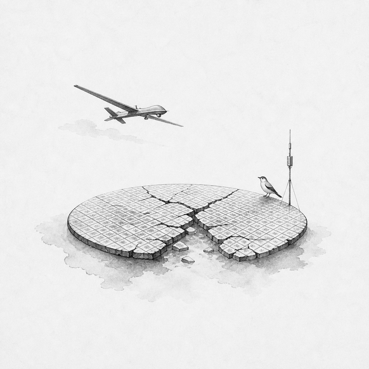
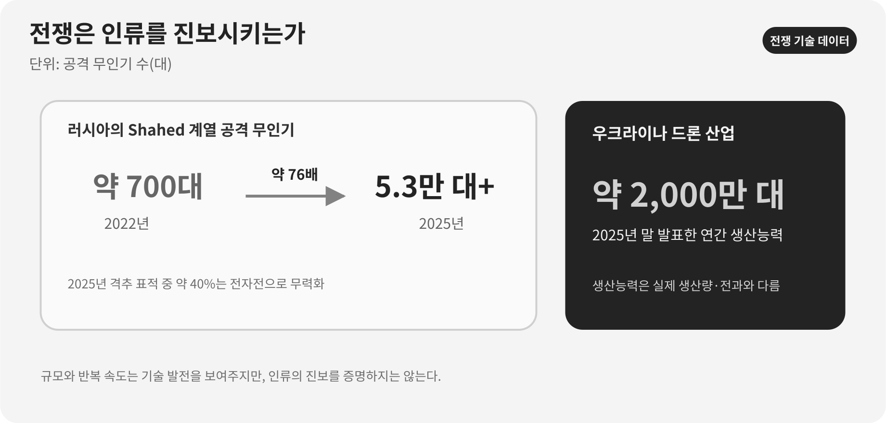

::: {.book-question}
[오늘의 책문]{.book-question-label}

{.book-question-image width=30mm fig-alt="전쟁과 반도체의 이중 용도를 상징하는 삽화"}

[전쟁이 기술을 가속했다는 사실을 근거로, 신입 제품심의 담당자는 군사 전용 가능성이 있는 칩의 공급을 조건부 승인해도 되는가?]{.book-question-prompt}
:::

1568년 선조의 책문^[이 장이 빌린 책문([策問]{.hanja}), 곧 ‘왕의 질문’은 “외적을 대할 때 정벌과 화친 가운데 무엇을 택해야 하며, 명분과 힘과 형세를 어떻게 함께 판단할 것인가?”였습니다. 책문 아카이브가 공개 번역의 뜻을 줄여 재구성한 한문은 “[禦外之道，戰與和而已。義、力、勢，何所先後？]{.hanja}”입니다. 원문 직역으로 인용한 문장이 아닙니다. 이 장의 질문도 원문의 현대어 번역이 아니라, 전쟁을 명분만으로 판단하지 않고 힘·형세·사후 결과까지 보게 한 구조를 오늘의 기술 문제에 적용한 재해석입니다.]은 분노만으로 정벌을, 두려움만으로 화친을 택하지 말고 명분·역량·형세를 함께 판단하라고 요구했습니다. 그 질문 구조를 빌려, 전쟁이 기술 능력을 키웠다는 사실과 그 기술이 인간의 삶을 낫게 했다는 평가를 분리합니다.

> 병기는 날로 정교해졌으나 백성의 삶도 그만큼 나아졌는가. 전쟁이 낳은 기술을 진보라 부르려면 무엇을 기준으로 삼아야 하는가?

이 문장은 특정 왕의 원문을 옮긴 인용문이 아니라, 조선시대 책문의 형식을 빌려 이 장의 쟁점에 맞게 새로 쓴 질문입니다.

## 왜 지금 이 질문인가

전쟁이 기술을 ‘발명했다’는 말과, 이미 있던 기술의 개발·양산·보급을 ‘가속했다’는 말은 구분해야 합니다. 비행기는 1차 세계대전 전에 발명됐지만 전쟁 중 정찰·통신·고공비행·엔진 기술이 빠르게 발전했고, 항공 산업의 생산 기반도 커졌습니다. 2차 세계대전은 레이더·전자계산·제트 추진의 연구와 대량 운용을 앞당겼습니다. 반면 인터넷의 뿌리인 ARPANET은 1969년, GPS의 통합 개발은 1973년 시작됐습니다. 두 기술은 세계대전의 직접 산물이라기보다 냉전기 국방 연구가 민간 기반시설로 확산된 사례입니다.

우크라이나 전쟁은 저가 드론, 위성통신, 전자전, 영상인식, 전장 소프트웨어를 짧은 주기로 결합하는 방식을 발전시켰습니다. 2026년 미국–이란 무력충돌에서도 무인기와 탄도미사일, 통합 방공, 전자전, 감시·통신 체계가 한 작전망 안에서 운용됐습니다. 이 체계의 밑바닥에는 이미지센서, 통신칩, 전력반도체, 메모리와 프로세서가 있습니다. 같은 반도체가 자동차의 안전과 의료기기의 진단을 돕기도 하고, 표적을 찾아 타격하는 무기의 눈과 두뇌가 되기도 합니다.

따라서 이 장의 쟁점은 “전쟁이 기술을 발전시키는가”에서 끝나지 않습니다. **기술 능력의 진보와 인류의 진보를 같은 말로 볼 수 있는가**, 그리고 전쟁에서 축적한 기술을 평화의 편익으로 전환할 책임이 누구에게 있는가를 묻습니다.

## 데이터 렌즈

{fig-alt="2022년과 2025년 러시아의 Shahed 계열 공격 무인기 규모와 2025년 우크라이나 드론 생산능력을 비교한 데이터 카드"}

### 근거 데이터 표

| 근거 | 확인된 사실 | 토론에서의 의미 |
|---:|---|---|
| 1 | 미국 스미스소니언 국립항공우주박물관은 1차 세계대전이 비행기를 제한된 성능의 기계에서 전문 임무를 수행하는 군용 항공기로 바꾸고 전후 항공 산업의 토대를 놓았다고 설명합니다(2025). | 전쟁은 비행기를 발명한 것이 아니라 성능·표준화·양산을 가속했습니다. |
| 2 | 미 육군은 1937년 시연된 레이더가 2차 세계대전에서 급속히 발전했고, 이후 항공교통·기상관측 등 일상 영역에 들어왔다고 설명합니다(2025). | 군사 연구의 민간 확산은 가능하지만 전쟁의 희생을 정당화하지는 않습니다. |
| 3 | DARPA의 4개 노드 ARPANET은 1969년 가동됐고, 미 국방부가 통합한 NAVSTAR GPS 사업은 1973년 시작됐습니다. | 인터넷·GPS를 세계대전의 직접 발명품이라고 말하면 연표가 틀립니다. 냉전기 국방 연구의 민간 전환으로 표현해야 합니다. |
| 4 | NATO의 2026년 우크라이나 전훈 자료는 러시아의 Shahed 계열 공격 무인기가 2022년 약 700대에서 2025년 5만3천 대 이상으로 늘었고, 2025년 격추된 표적 가운데 약 40%가 전자전으로 무력화됐다고 제시합니다. | 전쟁은 저가 양산, 항법 교란, 재밍 회피의 반복 주기를 극단적으로 짧게 만들었습니다. |
| 5 | 우크라이나 국방부는 2025년 말 자국 방산업계의 연간 드론 생산능력을 약 2천만 대로 발표했습니다. | 상용 부품과 소프트웨어가 대량 무기 체계로 전환되는 속도를 보여주지만, 생산능력은 실제 생산량·전과와 다릅니다. |
| 6 | 미 중부사령부는 2026년 대이란 작전이 38일 동안 1만3,500회 이상의 타격을 수행했다고 발표했고, 작전 자료에 전자전기·감시공격 무인기·일회용 공격 무인기·대드론 체계를 명시했습니다. | 여러 센서와 무기를 연결하는 반도체·소프트웨어의 중요성이 커졌습니다. 다만 교전 당사자의 성과 발표이므로 독립 검증 전에는 주장으로 다뤄야 합니다. |

이 장에서 읽어야 할 숫자는 세 종류입니다. 첫째, **5만3천 대**는 무인전이 얼마나 빠르게 대량화됐는지를 보여줍니다. 둘째, **약 40%**는 공격 기술과 방어 기술이 서로를 학습시키는 경쟁을 보여줍니다. 셋째, **38일·1만3,500회 이상**은 센서·통신·연산·무기가 결합된 작전의 밀도를 보여줍니다. 이 세 수치를 민간 편익의 증가로 곧바로 바꾸어 읽어서는 안 됩니다.

### 이 숫자를 읽는 법

- 드론 생산량과 타격 횟수는 기술의 규모를 보여줄 뿐, 민간인 피해와 삶의 회복을 보여주지 않습니다.
- 전쟁 뒤 민간에 쓰인 기술이 있다는 사실은 “전쟁이 없었다면 그 기술은 생기지 않았다”는 반사실을 증명하지 못합니다.
- 교전 당사자의 격추율·파괴율·전과는 측정 방법과 이해관계가 있으므로 상대 측 자료와 독립 조사로 교차검증해야 합니다.
- 연구비·인력·반도체가 무기에 집중되면서 의료·기후·교육 기술이 잃은 기회는 전과 통계에 나타나지 않습니다.

## 대립 답안

### 답안 A — 진보론

전쟁은 실패 비용과 시간 압박을 극단적으로 높여 연구비, 인재, 현장 피드백을 한곳에 모읍니다. 1차 세계대전의 항공·무선통신, 2차 세계대전의 레이더·전자계산, 냉전기의 ARPANET·GPS처럼 군사 수요에서 출발하거나 가속된 기술이 민간 항공, 통신, 물류와 재난 대응의 기반이 됐습니다. 우크라이나 전쟁에서도 저가 무인기, 전자전, 위성통신과 신속 조달의 발전이 재난 탐색·시설 점검·자율 이동 기술로 확산될 가능성이 있습니다.

이 답의 강점은 전쟁이 기술개발의 속도와 규모를 실제로 바꾼다는 점을 외면하지 않는 데 있습니다. 그러나 기술의 성능 향상을 곧 인류의 도덕적·사회적 진보로 부르는 순간, 희생자를 혁신의 비용으로 처리하는 오류에 빠집니다.

### 답안 B — 퇴보론

전쟁이 가장 먼저 최적화하는 것은 사람을 살리는 방식이 아니라 더 빨리 탐지하고, 더 멀리 타격하며, 더 적은 비용으로 공격하는 방식입니다. 드론과 AI는 병사의 위험을 줄일 수 있지만 공격의 정치적 문턱을 낮추고, 책임 소재가 불분명한 자동화된 살상을 늘릴 수 있습니다. 인프라 파괴, 인재 유출, 교육 중단, 감시의 일상화와 막대한 기회비용까지 포함하면 일부 기술의 발전만으로 인류가 진보했다고 말하기 어렵습니다.

이 답의 강점은 “민간에 쓸 수 있게 됐다”는 사후 편익이 전쟁 자체의 정당성을 만들지 못한다는 점을 분명히 하는 데 있습니다. 약점은 방어 기술과 억지력, 전쟁 중 생명을 구한 통신·요격·지뢰 제거 기술의 가치를 충분히 설명하지 못할 수 있다는 점입니다.

### 답안 C — 조건부론

전쟁은 **기술 능력을 발전시킬 수 있지만 인류를 자동으로 진보시키지는 않습니다.** 진보라는 판정은 성능이 아니라 결과로 내려야 합니다. 민간 전환의 폭, 생명 보호 효과, 통제 가능성, 책임 추적성, 확산 뒤의 오용 위험, 전쟁이 아닌 공공 연구로 같은 성과를 얻을 가능성을 함께 봐야 합니다. 반도체 기업도 “민수용 부품을 팔았다”는 이유만으로 책임에서 벗어날 수 없으며, 최종 용도 확인과 인권 실사, 수출통제 준수, 오용 발견 시 공급 중단 절차를 갖춰야 합니다.

## 판정 기준

토론에서는 ‘기술 진보’와 ‘인류 진보’를 두 줄로 나누어 평가합니다.

| 판정 축 | 확인 질문 |
|---|---|
| 기술 능력 | 성능·가격·생산속도·신뢰성이 실제로 얼마나 개선됐습니까? |
| 생명과 안전 | 민간인과 전투원의 사망·부상·오인 피해가 줄었습니까? |
| 민간 확산 | 전후 의료·교통·통신·재난 대응으로 이전된 편익이 누구에게 돌아갑니까? |
| 통제와 책임 | 인간의 최종 판단, 로그, 감사, 중단 장치와 책임 주체가 있습니까? |
| 대안과 기회비용 | 전쟁이 아닌 공공 연구와 국제 협력으로 같은 기술을 만들 수 있었습니까? |

다섯 축 가운데 기술 능력만 개선되고 생명·책임·대안 지표가 악화됐다면 “기술은 발전했지만 인류는 퇴보했다”고 답할 수 있습니다. 이것이 모순이 아니라 이 장의 핵심 구분입니다.

## AI 조사 설계

### AI에게 물어볼 프롬프트

> 기준일은 2026년 8월 18일입니다. 1·2차 세계대전, 우크라이나–러시아 전쟁, 2026년 미국–이란 무력충돌에서 개발·양산·운용이 빨라진 기술을 조사하십시오. 비행기·레이더·원자력·드론·전자전·위성통신·AI·반도체를 구분하고, 각 기술마다 ① 전쟁 전 존재 여부, ② 전쟁 중 달라진 성능·생산량·운용법, ③ 전후 민간 이전, ④ 민간인 피해와 오용, ⑤ 발표 주체·문서명·연도·단위·원문 URL을 표로 제시하십시오. ARPANET과 GPS를 세계대전의 직접 발명으로 쓰지 말고 실제 개발 시점을 확인하십시오. 군과 정부의 전과 발표는 독립 검증 전까지 ‘발표’로 표시하고, 확인된 사실·기관의 주장·분석자의 추론을 분리하십시오. 마지막에는 진보론·퇴보론·조건부론을 가장 강하게 만드는 자료와 결론을 바꿀 임계값을 각각 제시하십시오.

### 데이터 취득

| 우선순위 | 자료 | 확인 항목 |
|---:|---|---|
| 1 | 군·정부·국제기구의 원문 | 기술 개발 시점, 생산능력, 작전 범위, 집계 정의 |
| 2 | 박물관·공공 연구기관의 기술사 | 전쟁 전 존재 여부, 전쟁 중 개선, 민간 이전 시점 |
| 3 | 피해·인도주의 자료 | 민간인 피해, 기반시설 파괴, 의료·교육 손실 |
| 4 | 기업·연구기관 자료 | 부품·소프트웨어의 실제 기능, 최종용도 통제, 전후 전환 가능성 |

### 정보 판정

1. **발명과 가속을 구분합니다.** 전쟁 전에 존재한 기술이면 ‘발명’이 아니라 성능 개선·양산·통합이 빨라졌다고 씁니다.
2. **연표를 대조합니다.** ARPANET 1969년, GPS 통합개발 1973년처럼 냉전기 사업을 세계대전의 직접 산물로 돌리지 않습니다.
3. **능력과 결과를 분리합니다.** 생산능력·격추율·탐지거리는 기술지표이며 생명·자유·복지의 개선을 자동으로 증명하지 않습니다.
4. **교전 당사자의 수치는 조건부로 씁니다.** 전과·피해·요격률은 발표 주체와 집계기간을 밝히고 다른 자료와 교차검증합니다.
5. **대안의 기회비용을 묻습니다.** 같은 연구비와 인력이 평화적 공공 연구에 쓰였을 때 얻을 성과를 반사실 가정으로 표시합니다.

### 토론의 핵심

- 전쟁이 기술의 **속도**를 높였다는 사실과 인류의 **방향**을 개선했다는 평가는 다릅니다.
- 민간 이전의 편익과 전쟁 중 발생한 생명·자유·교육의 손실을 같은 단위로 억지 환산하지 않습니다.
- 반도체·AI처럼 민수와 군수가 겹치는 기술에는 최종사용자 확인·인간 통제·오용 발견 뒤 중단 절차가 필요합니다.
- 좋은 답은 전쟁을 찬양하거나 기술을 부정하지 않고, 기술 능력이 인간의 진보로 바뀌는 조건을 제시합니다.

## 사례형 토론

다음은 실제 기업 사례가 아닙니다. 2027년·3년·2천억 원을 포함한 조건은 모두 **면접용 가정**입니다. 당신은 한국 반도체 회사의 ‘이중용도 제품 심의위원회’에 참여했습니다. 회사의 저전력 영상처리 칩은 자율주행차와 산불 감시 드론에 쓰이지만, 최근 우크라이나 전쟁과 미국–이란 무력충돌에서 운용된 공격 무인기에도 전용될 수 있습니다. 해외 유통사가 3년간 2천억 원 규모의 공급계약을 제안했지만 최종 사용자는 공개하지 않았습니다. 계약을 거절하면 경쟁사가 공급할 가능성이 있고, 수락하면 민간 매출과 군사 전용을 구분하기 어렵습니다.

1. 영업책임자는 고용과 민간 시장의 편익을, 준법책임자는 수출통제와 최종사용자 위험을 제시합니다.
2. 설계책임자는 위치·표적 기능을 제한하는 펌웨어와 사용기록 장치가 가능한지 검토합니다.
3. 인권담당자는 오용 가능성과 피해구제 절차를, 재무책임자는 계약 거절의 손실을 계산합니다.
4. 팀은 **수락·조건부 수락·거절** 가운데 하나를 고르고, 필요한 증빙·기술적 제한·사후 감사·공급 중단 조건을 문서로 제시합니다.

핵심은 “다른 회사가 팔 것”이라는 말로 책임을 지우거나, “군사 가능성이 있다”는 이유로 모든 민수 기술을 막는 것이 아닙니다. 위험을 확인할 데이터와 통제 가능한 설계를 제시해야 합니다.

## 90초 발언 예시

“제 결론은 전쟁이 기술 능력을 키워도 인류가 자동으로 진보하지는 않는다는 것입니다. 사례에서는 최종사용자를 밝히지 않은 3년·2천억 원 계약을 보류하고 조건부 수락을 심사하겠습니다. 이 수치는 모두 가정입니다. NATO 자료에서 러시아의 Shahed 계열 공격 무인기는 2022년 약 700대에서 2025년 5만3천 대 이상으로 늘었고, 우크라이나는 연간 드론 생산능력을 약 2천만 대라고 발표했습니다. 이는 반도체와 소프트웨어가 방어와 대량 공격을 함께 가속한다는 증거입니다. 가장 강한 반론은 우리가 거절해도 경쟁사가 공급해 민간 편익만 잃을 수 있다는 것입니다. 그래서 이중용도 거래를 일괄 차단하지는 않겠습니다. 최종사용자·장착 제품·설치지를 공개하고 표적 기능 제한, 사용기록, 독립 감사와 공급중단권이 작동하면 물량을 나눠 계약하겠습니다. 공개를 거부하거나 군사 표적화 정황이 나오고 감사를 할 수 없다면 매출을 포기하고 거절하겠습니다. 민간인 피해, 인간의 최종 통제와 오용 추적이 개선될 때만 기술 발전을 인간의 진보라고 부르겠습니다.”

이 답안은 AI가 찾아 준 자료 후보를 기관 원문과 대조하고, 발명 시점·발표 주체·통계의 정의를 사람이 다시 확인해 구성한 예시입니다. 문장을 외우기보다 **사례 선택 → 구체적 데이터 → 가장 강한 반론 → 통제 조건과 결론 전환** 순서를 익히십시오.

## 꼬리 질문

**교차질문과 재반박**

- 비행기·인터넷·GPS의 민간 편익이 크다면 전쟁도 필요한 혁신 수단이라고 인정해야 합니까?
- 전쟁과 같은 예산·규제 완화를 기후·감염병 연구에 적용했다면 같은 속도를 낼 수 있지 않았겠습니까?
- 미국–이란 작전의 전과를 미군 발표만으로 인용할 때 어떤 한계를 밝혀야 합니까?
- 영상처리 칩 제조사가 최종 사용자를 알 수 없었다면 어디까지 책임져야 합니까?
- 인간이 승인하지만 AI 추천을 거의 그대로 따르는 무기체계를 ‘인간 통제’라고 부를 수 있습니까?
- 전후 민간 이전이 금지돼야 할 기술과 적극 이전해야 할 기술을 어떤 기준으로 나누겠습니까?

## 출처

- [Smithsonian National Air and Space Museum, *The Evolution of World War I Aircraft* (2025)](https://airandspace.si.edu/explore/stories/world-war-i-laboratory-air)
- [U.S. Army, *Radar demonstration transforms the Army* (2025)](https://www.army.mil/article/285662/radar_demonstration_transforms_the_army)
- [DARPA, *ARPANET* (2025 갱신)](https://www.darpa.mil/news/features/arpanet)
- [GPS.gov, *The History of GPS Technology: Government Collaboration and Technology Transfer* (2018)](https://www.gps.gov/sites/default/files/2025-07/gps_finalreport618.pdf)
- [NATO JALLC, *Ukraine Insights: Electronic Warfare against One-Way Attack Drones* (2026)](https://nllp.jallc.nato.int/iks/sharing%20public/20260409_u_q2-26%20sagu%20nsatu%20ukraine%20insights%20newsletter.pdf)
- [우크라이나 국방부, 드론 생산능력 발표 (2025)](https://mod.gov.ua/en/news/denys-shmyhal-the-fastest-way-to-strengthen-europe-s-security-is-to-support-ukraine)
- [U.S. CENTCOM, *Operation Epic Fury Fact Sheet* (2026)](https://www.centcom.mil/Portals/6/Documents/Publications/260406-FactSheet.pdf)
- [U.S. CENTCOM, *SASC Posture Statement 2026* (2026)](https://www.centcom.mil/ABOUT-US/SASC-POSTURE-STATEMENT-2026/)
- [U.S. Congressional Research Service, *Defense Primer: Emerging Technologies* (2026)](https://www.congress.gov/crs-product/IF11105)
- [조선시대 책문 아카이브, 1568년 선조 「정벌인가 화친인가」](https://waterfirst.github.io/Joseon-Dynasty-Civil-Service-Examination/#seonjo-1568/0)

> 데이터 기준일: 2026년 8월 18일. 군사 작전의 전과·격추율·생산능력은 발표 주체의 이해관계를 함께 적었으며, 상업 발행 직전에 원문과 정정 여부를 다시 확인합니다.
