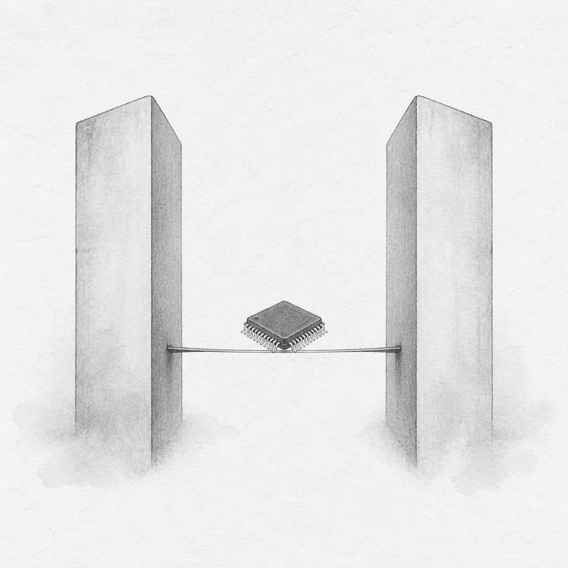
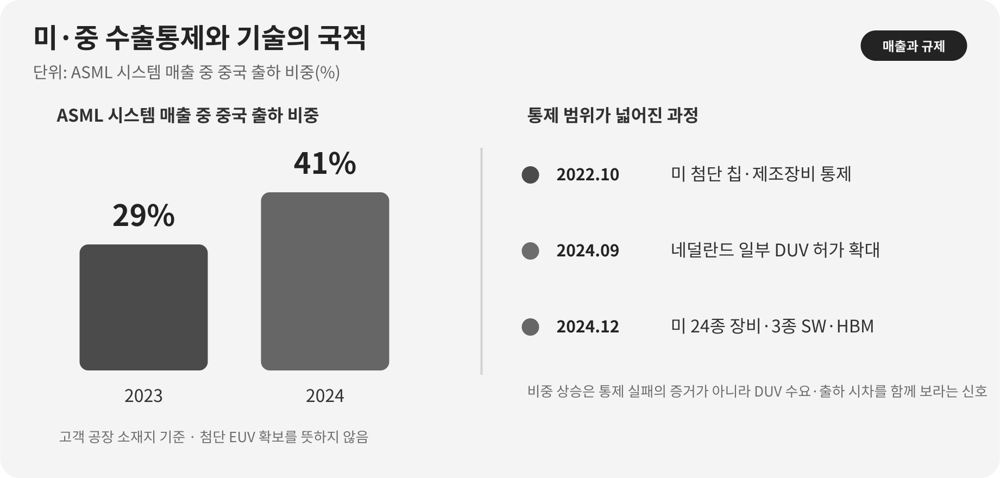

::: {.book-question}
[오늘의 책문]{.book-question-label}

{.book-question-image width=30mm fig-alt="미국과 중국 사이에서 기술 주권을 판단하는 반도체 산업 상징 삽화"}

[미국의 대중국 첨단 반도체 통제 아래 중국 매출 비중이 큰 한국 장비사의 신입 전략 담당자는 중국 계약을 보류하고 대체시장 인증을 앞당겨야 하는가?]{.book-question-prompt}
:::

중종대 문집에 전하는 책문^[이 장이 빌린 책문([策問]{.hanja}), 곧 ‘왕의 질문’은 “나라의 뜻을 정확히 전하고 국격을 지키는 사신에게 말재주와 문장보다 먼저 필요한 것은 무엇인가?”였습니다. 책문 아카이브가 제시한 한문 재구성은 “[奉使傳國意，才辯與德行孰先？]{.hanja}”이며 원문 직역은 아닙니다. 공개 자료에서는 정확한 시험 연도와 순위가 확정되지 않아 ‘중종대 문집 수록 대책’으로만 표기합니다. 이 장의 질문도 원문의 번역이 아니라, 외교의 기술보다 장기 신뢰와 책임을 먼저 묻는 구조를 수출통제 문제에 적용한 재해석입니다.]은 외교를 말재주나 단기 성과로만 보지 않고 국가의 뜻과 신뢰를 누가 어떻게 책임질지 물었습니다. 오늘의 응시자도 ‘미국 편’과 ‘중국 편’ 가운데 하나를 고르는 데서 멈춰서는 안 됩니다. 통제가 만드는 시간의 이익, 한국 기업이 잃는 시장, 중국의 대체기술 개발, 한국이 확보해야 할 독보적 기술을 함께 계산해야 합니다.

## 왜 지금 이 질문인가

미국의 대중국 통제는 ‘반도체 수출 금지’ 한 문장으로 요약할 수 없습니다. 2022년 10월 첨단 연산칩과 반도체 제조 장비 통제가 시작됐고, 2023년에는 성능 기준과 우회 방지 범위가 조정됐습니다. 2024년 12월 조치는 24종의 장비, 3종의 소프트웨어 도구, HBM과 140개 중국 관련 기관까지 범위를 넓혔습니다. 네덜란드도 2023년부터 일부 첨단 DUV 노광장비에 허가제를 적용하고 2024년 9월 범위를 확대했습니다. 이것은 모든 노광장비의 일괄 금지가 아니라 품목·최종사용자·목적지에 따른 허가 체계입니다.

한국에는 상반된 효과가 동시에 생깁니다. 첨단 노광장비와 AI 칩이 중국으로 들어가는 속도가 늦어지면 한국의 메모리·파운드리·첨단 패키징 기업은 기술 격차와 동맹 시장을 활용할 시간을 벌 수 있습니다. 반면 중국 고객 비중이 높은 한국 장비·소재 기업은 수출허가, 현장 서비스, 부품 교체와 매출 감소의 부담을 질 수 있습니다. 통제가 오래갈수록 중국 기업은 국산 장비, 공정 자동화, 수율 개선, 구형 장비의 생산성 향상에 더 많은 자원을 투입할 유인도 커집니다.

따라서 핵심은 “통제를 찬성하는가”가 아닙니다. **통제로 얻은 시간을 한국의 독보적 기술로 바꿀 수 있는가**, 그리고 안보 동맹의 편익과 산업 비용을 어떻게 배분할 것인가입니다.

## 데이터 렌즈

{fig-alt="ASML 시스템 매출에서 중국 출하 비중이 2023년 29퍼센트에서 2024년 41퍼센트로 증가한 사실과 주요 수출통제 일정을 함께 표시한 그래프"}

### 근거 데이터 표

| 근거 | 원자료의 수치·범위 | 토론에서의 의미 |
|---:|---|---|
| 1 | 미국 BIS는 2022년 10월 7일 첨단 연산칩·슈퍼컴퓨터·반도체 제조 장비에 대한 대중국 통제를 시행했고, 2023년 10월 17일 성능 기준과 우회 방지 범위를 보완했습니다. | 통제는 한 번의 조치가 아니라 기술 변화에 맞춰 수정되는 규칙입니다. |
| 2 | BIS의 2024년 12월 2일 조치는 24종의 반도체 제조 장비, 3종의 소프트웨어 도구, HBM, 140개 Entity List 추가를 포함했습니다. | 한국 장비기업도 미국산 기술·소프트웨어와 최종사용자에 따라 허가 영향을 받을 수 있습니다. |
| 3 | 네덜란드는 2024년 9월 7일부터 일부 첨단 DUV 노광장비의 국가 허가 범위를 확대했습니다. 네덜란드 정부는 이를 전면 금지가 아닌 건별 심사라고 명시했습니다. | ‘중국의 모든 포토 장비 수입을 막았다’고 말하면 범위를 과장하게 됩니다. |
| 4 | ASML의 시스템 매출 가운데 중국 출하 비중은 2023년 29%에서 2024년 41%로 상승했습니다. 같은 자료에서 2024년 EUV의 시스템 매출 비중은 38%, ArF 이머전 DUV는 44%였습니다. | 통제가 강화돼도 허용된 DUV 수요와 출하 시차 때문에 중국 매출 비중은 오를 수 있습니다. 통제의 효과를 단일 매출 숫자로 판정해서는 안 됩니다. |
| 5 | ASML은 2025년 중국의 DUV 수요가 예상보다 강했다고 밝혔고, 2026년 중국 매출은 2024~2025년보다 크게 줄 것으로 전망했습니다. | 규제의 효과는 즉시 나타나지 않을 수 있으며, 주문·출하·매출 인식 시점을 나눠 봐야 합니다. |
| 6 | 한·미 양국은 공급망·산업대화에서 안보를 보호하되 세계 반도체 공급망의 혼란을 줄이고 산업의 생존력과 기술 발전을 유지한다는 원칙을 확인했습니다(2023). | 동맹의 목표에도 안보와 산업 비용의 균형이 명시돼 있습니다. 한국은 비용 분담과 예측 가능성을 협상해야 합니다. |

### 이 숫자를 읽는 법

그래프의 **29%→41%**는 “통제가 실패했다”는 결론이 아닙니다. ASML의 전체 시스템 매출에서 고객 공장 소재지가 중국인 비중이며, 중국이 첨단 EUV를 확보했다는 뜻도 아닙니다. 반대로 통제가 한국 기업에 자동으로 이익을 준다는 증거도 아닙니다. 이 수치의 상징성은 **기술 통제와 시장 거래가 같은 방향으로 즉시 움직이지 않는다**는 데 있습니다.

한국 기업을 분석할 때는 다음 네 숫자를 따로 모아야 합니다.

- 중국 매출 비중과 통제품목 매출 비중
- 미국산 부품·소프트웨어가 제품 원가와 기능에서 차지하는 비중
- 허가 신청부터 승인·거절까지 걸린 기간과 서비스 중단일수
- 대체 시장의 수주액, 고객 인증기간, 핵심 장비의 성능·수율 격차

중국의 기술 자립도 역시 발표된 투자액이나 특허 수만으로 판단하지 않습니다. 실제 양산라인의 장비 채택률, 웨이퍼 처리량, 결함밀도, 가동률, 고객 인증과 반복 주문으로 확인해야 합니다.

## 대립 답안

### 답안 A — 적극론

미국의 시장·기술 통제는 한국이 첨단 반도체에서 기술 격차와 이윤을 지킬 시간을 벌어 줍니다. 중국이 EUV와 일부 첨단 DUV 노광장비, 첨단 AI 칩과 HBM을 충분히 확보하지 못하면 최선단 공정과 AI 가속기 생산의 진입장벽이 높아집니다. 한·미 동맹 안에서 한국의 메모리, HBM, 첨단 패키징과 소재·장비 기업이 신뢰할 수 있는 공급자로 자리 잡으면 미국·일본·유럽 고객과 공동 연구, 보조금, 장기계약의 편익도 얻을 수 있습니다.

이 답의 강점은 기술 격차가 영구적이지 않으며 확보한 시간을 투자로 바꿔야 한다는 현실을 본다는 데 있습니다. 다만 통제 자체가 한국의 이윤을 보장하지는 않습니다. 미국·일본·유럽의 경쟁사도 같은 기회를 얻고, 한국 기업의 중국 공장과 장비 고객도 규제 비용을 부담하기 때문입니다.

### 답안 B — 경계론

광범위하고 잦은 통제는 한국 장비·소재 기업의 중국 수출, 설치, 부품 교체와 유지보수를 제한하고 규정 준수 비용을 키울 수 있습니다. 더 중요한 장기 위험은 중국이 막힌 장비를 기다리기보다 국산 장비, 공정 자동화, 다중 패터닝, 수율 제어와 구형 장비의 생산성 향상에 투자를 집중한다는 점입니다. BIS가 2024년 통제에 ‘덜 첨단인 장비의 생산성을 높이는 소프트웨어’까지 포함한 사실은 미국도 이 우회 혁신 가능성을 경계한다는 뜻입니다.

시장에서 경쟁자를 영구히 막는 전략은 기술 변화와 제3국 거래 때문에 비용이 계속 커집니다. 한국이 미국 규칙을 수동적으로 따르기만 하면 중국 시장은 잃고, 핵심 원천기술은 미국·네덜란드·일본에 의존하는 이중 취약성이 남을 수 있습니다.

### 답안 C — 조건부론

한국은 두 강대국 사이에서 규제를 피하는 우회로를 찾을 것이 아니라, 어느 쪽도 쉽게 대체할 수 없는 기술을 확보해야 합니다. 제조사는 HBM·첨단 패키징·저전력 메모리·고수율 공정에서, 장비사는 검사·계측·식각·증착·공정제어와 유지보수 데이터에서 독보적 성능을 만들어야 합니다. 동시에 중국 매출 집중도를 낮추고, 미국산 기술 의존도를 파악하며, 동맹 시장의 고객 인증을 앞당겨야 합니다.

조건부론의 요지는 “양쪽과 적당히 거래하자”가 아닙니다. **통제로 번 시간을 R&D와 고객 다변화에 투자하고, 허가 범위 안에서만 거래하며, 매출 집중도·기술 격차·허가 지연이 정한 한계를 넘으면 전략을 바꾸는 것**입니다.

## AI 조사 설계

### AI에게 물어볼 프롬프트

> 기준일은 2026년 8월 18일입니다. 미국의 대중국 반도체 수출통제가 한국 반도체 제조사와 장비사에 주는 기회와 위험을 조사하십시오. ① BIS와 Federal Register의 규정 원문, ② 네덜란드 정부의 허가 범위, ③ ASML·한국 기업의 사업보고서, ④ 한국 정부 무역통계 순서로 찾으십시오. 각 주장마다 기관, 문서명, 발표일, 통계 기준연도, 단위, 원문 URL을 표로 제시하십시오. ‘금지’와 ‘허가 필요’, ‘주문’과 ‘출하·매출’, ‘중국 매출’과 ‘통제품목 매출’을 구분하십시오. 확인된 사실, 기업·정부의 주장, 분석자의 추론을 별도 열에 쓰고, 출처가 없거나 서로 충돌하는 숫자는 결론에 사용하지 마십시오. 마지막에 적극론·경계론·조건부론을 각각 가장 강하게 만든 뒤 한국 기업이 분기별로 확인할 지표를 제안하십시오.

### 데이터 취득

| 우선순위 | 자료 | 반드시 기록할 항목 |
|---:|---|---|
| 1 | BIS 규정·Federal Register·EAR | 시행일, ECCN, 대상 성능, 최종사용자, 허가 원칙, 예외 |
| 2 | 네덜란드·한국 정부 자료 | 허가 대상 장비, 건별 심사 여부, 한국 기업 예외·협의 내용 |
| 3 | 기업 사업보고서·실적자료 | 지역별 매출의 정의, 주문·출하·매출 인식 시점, 제품 구성 |
| 4 | 관세·무역통계 | HS코드, 금액·수량, 명목·실질, 중국·홍콩의 구분 |
| 5 | 특허·보도·분석자료 | 원자료 링크, 이해관계, 양산 검증 여부, 다른 출처의 반증 |

### 정보 판정

1. **법적 범위:** ‘전면 금지’인지 ‘허가 필요’인지 규정 문구로 확인합니다.
2. **시간 일치:** 규정 시행일보다 앞선 주문이 뒤늦게 매출로 잡힌 것은 아닌지 확인합니다.
3. **분모 일치:** 중국 매출 비중이 전체 매출인지 시스템 매출인지, 장비 대수인지 금액인지 확인합니다.
4. **인과 검증:** 통제 뒤 중국 투자가 늘었다고 해서 통제가 유일한 원인이라고 단정하지 않습니다.
5. **기업별 노출:** 대형 제조사와 중소 장비사의 중국 의존도·대체 고객·현금 여력은 별도로 봅니다.

### 토론의 핵심

- 통제가 한국에 벌어 준 **기술 시간**은 몇 년이며 어떤 R&D로 바꿔야 합니까?
- 동맹의 안보 편익과 한국 장비사의 매출 손실을 누가 어떻게 분담해야 합니까?
- 중국의 국산화가 발표가 아니라 양산 성과로 확인되는 지표는 무엇입니까?
- 한국 기업이 끌려다니지 않을 ‘독보적 기술’은 성능·수율·인증기간 중 무엇으로 측정합니까?

## 사례형 토론

2027년 3월, 한국의 중견 검사장비 회사가 중국 파운드리로부터 1,200억 원 규모의 주문을 받았습니다. 전년도 매출의 34%가 중국에서 발생했고, 이번 장비에는 미국산 레이저 제어 모듈과 설계 소프트웨어가 사용됩니다. 계약상 선적일은 새 BIS 규정 시행 45일 뒤입니다. 미국 고객의 대체 주문은 700억 원이지만 인증에 9개월이 필요하고, 회사가 손실을 견딜 현금은 14개월분입니다. 중국 고객은 최종사용자와 공정 노드를 비공개로 해 달라고 요구합니다. 모든 수치는 토론을 위해 만든 가상 조건입니다.

1. 준법팀은 ECCN·최종사용자·허가 필요 여부와 거절 시 제재 위험을 제시합니다.
2. 영업팀은 중국 계약의 이익과 고객 상실 위험, 미국 고객 인증 일정을 제시합니다.
3. 기술팀은 미국산 모듈을 합법적으로 대체하는 데 필요한 기간과 성능 저하를 제시합니다.
4. 전략팀은 **계약 보류 후 허가 신청·조건부 계약·계약 포기와 대체시장 전환** 가운데 하나를 선택합니다.
5. 최종안에는 가용 현금흐름, 중국 매출 상한, R&D 항목, 고객 인증 일정, 규정 변경 시 중단 조건을 포함합니다.

이 상황에서 ‘우회 수출’은 선택지가 아닙니다. 좋은 답은 법을 지키면서도 회사가 생존하고 기술을 축적할 경로를 수치와 일정으로 제시합니다.

## 90초 발언 예시

“저는 조건부론을 선택하겠습니다. 사례에서는 중국 고객이 최종사용자와 공정 노드를 숨겼으므로 1,200억 원 계약을 보류하고, 허가 필요 여부를 판정해 필요하면 신청하겠습니다. 34%·45일·700억 원·9개월·14개월은 모두 가정입니다. BIS가 2024년 24종 장비와 3종 소프트웨어, HBM까지 통제를 넓힌 반면 ASML의 중국 출하 시스템 매출 비중은 2023년 29%에서 2024년 41%로 올랐습니다. 통제가 시간을 벌어 준다는 적극론은 맞지만, 허용된 DUV 수요와 출하 시차 때문에 한국 기업의 이익을 보장하지는 않습니다. 가장 강한 반론은 계약을 포기하면 중국 시장만 잃고 9개월 뒤의 미국 주문도 확정되지 않는다는 것입니다. 그래서 ECCN, 미국산 모듈·소프트웨어의 적용 범위와 최종사용자를 확인해 허가가 승인되거나 비허가 대상임이 확인되면 재수출 금지와 규정 변경 시 중단권을 붙여 계약하겠습니다. 공개를 계속 거부하거나 허가가 거절되면 14개월 현금 여력 안에서 700억 원 대체 주문의 인증과 국산 모듈 R&D를 앞당기겠습니다. 통제로 번 시간을 독보적 기술과 고객 다변화로 바꿀 때만 한국의 기회입니다.”

이 발언은 **사례 선택 → 규정 원문 확인 → 적극론의 이득 → 경계론의 반증 → 계약 전환 조건** 순서로 구성했습니다. 숫자를 외우기보다 각 숫자의 분모와 시점을 설명할 수 있어야 합니다.

## 꼬리 질문

**교차질문과 재반박**

- ASML의 중국 매출 비중이 41%로 올랐는데도 통제가 효과적이라고 말할 수 있는 이유는 무엇입니까?
- 중국이 EUV 없이 DUV 다중 패터닝으로 첨단 공정을 구현한다면 통제의 시간 이익은 얼마나 줄어듭니까?
- 한국 장비사의 중국 매출이 34%에서 15%로 줄면 정부와 대형 제조사가 비용을 분담해야 합니까?
- 미국산 소프트웨어가 제품 개발에 일부만 쓰여도 미국 규정이 적용되는지 무엇으로 확인하겠습니까?
- 미국이 한국의 HBM까지 더 넓게 통제한다면 적극론의 결론을 유지하겠습니까?
- 독보적 기술을 판단할 한 가지 지표를 고른다면 처리량·결함밀도·가동률·고객 인증기간 중 무엇입니까?

## 출처

- [U.S. BIS, 2022·2023 첨단 연산 및 반도체 제조 통제 안내](https://www.bis.gov/press-release/bis-updated-public-information-page-export-controls-imposed-advanced-computing-semiconductor)
- [U.S. BIS, 2024년 12월 반도체 제조 장비·HBM 통제 발표](https://media.bis.gov/press-release/commerce-strengthens-export-controls-restrict-chinas-capability-produce-advanced-semiconductors-military)
- [U.S. BIS, *Export Administration Regulations §744.23* (2026 열람)](https://www.bis.gov/regulations/ear/744)
- [네덜란드 정부, 첨단 DUV 노광장비 수출허가 확대 (2024)](https://www.government.nl/latest/news/2024/09/06/the-netherlands-expands-export-control-measure-advanced-semiconductor-manufacturing-equipment)
- [ASML, *Q4 and Full Year 2024 Investor Presentation* (2025)](https://ourbrand.asml.com/m/62a213cac2117ee6/original/2025_01_29-Presentation-Investor-Relations-Q4-FY-2024.pdf)
- [ASML, *2025 Annual Report—Financials* (2026)](https://www.asml.com/en/investors/annual-report/2025/financials)
- [ASML, *Q3 2025 Financial Results* (2025)](https://www.asml.com/news/press-releases/2025/q3-2025-financial-results)
- [한·미 공급망·산업대화 공동성명, 수출통제 협력 원칙 (2023)](https://www.korea.net/Government/Briefing-Room/Press-Releases/view?articleId=6837&type=O)
- [조선시대 책문 아카이브, 중종대 「외교관은 어떤 자질을 갖춰야 하는가」(2026 열람)](https://waterfirst.github.io/Joseon-Dynasty-Civil-Service-Examination/#jungjong-diplomat/0)

> 데이터 기준일: 2026년 8월 18일. 수출통제는 품목·성능·최종사용자·목적지와 예외가 자주 바뀌므로 상업 발행 직전에 BIS, Federal Register, 네덜란드 정부와 기업 공시 원문을 다시 확인합니다.
