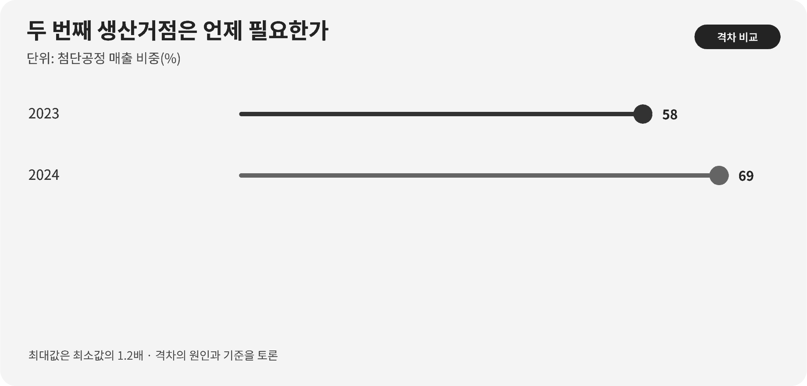

::: {.book-question}
[오늘의 책문]{.book-question-label}

{.book-question-image width=30mm fig-alt="두 생산거점 사이의 공급망과 복원 시간을 상징하는 미니멀 수묵화"}

[핵심 칩 생산이 한 지역에 집중돼 있다면 비용이 30% 늘어도 두 번째 생산거점을 확보해야 하는가?]{.book-question-prompt}
:::

조선의 책문^[이 장은 광해군대 문집에 전하는 실제 책문 「이 나라의 위기를 어떻게 구제할 것인가」와 연결됩니다. 책문 아카이브가 뜻을 줄여 재구성한 한문은 “國勢危急，舊制積弊。何所因革以開新命？”입니다. 원문 직역으로 인용한 문장이 아닙니다. “나라의 형세가 위급하고 옛 제도의 폐단이 쌓였으니, 무엇을 따르고 무엇을 고쳐 새 운명을 열겠는가”라는 물음입니다.]은 위기 앞에서 옛 제도를 모두 버리거나 그대로 지키라는 양자택일을 요구하지 않았습니다. 무엇을 계승하고 무엇을 바꿀지, 그 판단이 나라를 실제로 살릴 수 있는지 물었습니다. 오늘의 신입 공급망 분석가에게 같은 물음은 ‘공장을 더 지을 것인가’가 아니라 **중단 뒤 어느 제품을 언제, 어느 수율로 다시 공급할 수 있는가**로 바뀝니다.

## 왜 지금 이 질문인가

TSMC의 7나노미터 이하 공정이 전체 웨이퍼 매출에서 차지한 비중은 2023년 58%에서 2024년 69%로 높아졌습니다. 이 수치는 첨단공정의 경제적 중요성이 커졌음을 보여 주지만 생산이 어느 지역에 얼마나 몰렸는지는 직접 말해 주지 않습니다. 공급망 보고서에서 ‘첨단 매출 비중’과 ‘지리적 생산 비중’을 같은 숫자처럼 쓰면 첫 문장부터 틀립니다.

2024년 TSMC는 12인치 환산 웨이퍼 1,290만 장을 출하했고, 288개 공정기술로 522개 고객의 11,878개 제품을 생산했습니다. 규모와 다양성은 한 거점의 효율을 높이는 힘입니다. 동시에 전력·용수·숙련인력·장비 정비·소재 인증이 같은 생태계에 묶이면, 팹 건물 하나를 다른 나라에 세우는 것만으로는 대체능력이 생기지 않습니다.

신입사원이 해야 할 일은 지정학의 승패를 예언하는 것이 아닙니다. 품목별 재고일수, 대체라인의 고객 인증기간, 목표 수율까지 걸리는 시간, 두 거점이 함께 의존하는 장비와 원료를 한 장의 복원표로 만드는 일입니다. 비용 프리미엄은 눈에 보이지만 공급 중단을 피한 손실은 사고가 나지 않으면 보이지 않습니다. 따라서 두 비용을 같은 기간과 같은 제품 단위로 환산해야 합니다.

## 데이터로 보기

{fig-alt="TSMC의 첨단공정 매출 비중과 웨이퍼 출하량, 고객과 제품 다양성을 보여 주는 그래프"}

### 근거 데이터 표

| 구분 | 원자료의 수치·범위 | 현업에서 확인할 의미 |
|---:|---|---|
| 공시 사실 | TSMC의 7nm 이하 공정은 2023년 전체 웨이퍼 매출의 58%, 2024년 69%였습니다. | 첨단공정의 매출 중요도입니다. 국가별 생산능력이나 물량 비중은 아닙니다. |
| 공시 사실 | 2024년 출하량은 12인치 환산 웨이퍼 1,290만 장이었습니다. | 서로 다른 웨이퍼 크기를 환산한 연간 물량입니다. 비상시 대체 가능한 물량은 별도 계산해야 합니다. |
| 공시 사실 | 같은 해 288개 공정기술로 522개 고객의 11,878개 제품을 생산했습니다. | 고객·제품 다변화와 생산거점 다변화는 다른 개념입니다. |
| 원자료 계산 | 첨단공정 매출 비중은 1년 사이 11%포인트, 2023년 대비 약 19% 증가했습니다. | 증가 속도는 중요도 변화를 보여 주지만 중단확률을 뜻하지는 않습니다. |

### 이 숫자를 읽는 법

먼저 분모를 고정해야 합니다. 69%의 분모는 ‘TSMC 전체 웨이퍼 매출’이며 세계 첨단칩 생산량도, 대만에서 생산된 비율도 아닙니다. 1,290만 장은 12인치로 환산한 출하량이므로 첨단과 성숙 공정이 섞여 있습니다. 522개 고객과 11,878개 제품은 수요 포트폴리오가 넓다는 증거이지 공장이 지리적으로 분산됐다는 증거가 아닙니다.

두 번째 거점을 평가할 때는 공장 개수 대신 **복원가능 생산능력**을 계산해야 합니다. 후보 라인이 같은 노광장비 부품, 특수가스, 마스크 데이터센터와 현장 엔지니어를 공유한다면 지도상 두 곳이어도 운영상 한 곳입니다. 반대로 규모가 작더라도 고객 인증을 마치고 정기적으로 양산하며 독립된 전력·물류·정비체계를 갖춘 라인은 실제 보험이 됩니다.

마지막으로 확률과 손실을 분리합니다. 중단 가능성이 낮다는 판단과, 중단 시 손실이 매우 크다는 판단은 동시에 참일 수 있습니다. 보고서에는 특정 사건을 단정하는 대신 다음 계산 구조를 제시하고, 각 가정이 바뀔 때 결론이 어떻게 달라지는지 보여 주어야 합니다.

$$
\text{예상 회피 손실}
= \text{중단 확률}\times\text{중단 기간}\times\text{월별 공헌이익 손실}
$$

## 대립 답안

### 답안 A — 이원화 적극론

두 번째 거점은 평상시의 최저원가를 포기하고 연속공급 능력을 사는 보험입니다. 첨단 칩이 고객의 완제품 출시를 좌우한다면 공급이 끊긴 한 달의 손실은 웨이퍼 가격을 넘어섭니다. 고객 이탈, 재설계, 위약금과 신뢰 훼손까지 포함하면 30%의 단가 프리미엄이 더 작을 수 있습니다.

적극론은 특히 인증에 24개월처럼 긴 시간이 걸리는 품목에서 강합니다. 위기가 시작된 뒤 대체라인을 준비하면 늦기 때문입니다. 평소 낮은 물량이라도 반복 생산해 수율과 작업자 숙련을 유지하고, 고객에게 실제 대체 출하 이력을 보여 주어야 합니다.

### 답안 B — 집중 효율론

첨단 팹은 건물과 장비 목록의 복사본이 아닙니다. 공정개발자, 장비사 서비스 인력, 소재 공급자와 고객의 공동학습이 모여 수율을 만듭니다. 이 생태계를 억지로 나누면 두 공장 모두 규모의 경제와 학습속도를 잃고, 비싼 유휴설비만 남을 수 있습니다.

또한 두 거점이 같은 핵심 장비·소프트웨어·원료에 의존한다면 분산투자의 표면만 남습니다. 이 경우 추가 자금을 재고, 장기구매계약, 장비 예비부품과 공급업체 복수화에 쓰는 편이 복구시간을 더 짧게 만들 수 있습니다.

### 답안 C — 단계적 복원력론

이원화 여부를 국가 수나 공장 수로 정하지 않고, 제품군별 복구시간과 예상 회피손실로 정합니다. 먼저 고객 영향이 크고 인증기간이 긴 품목에 대체라인을 열고, 성숙·저위험 품목은 재고와 공급계약으로 대응합니다. 장비 발주도 한 번에 끝내지 않고 수율·인증 관문을 통과할 때마다 다음 단계로 넘어갑니다.

이 답의 전환 조건은 명확합니다. 대체라인이 목표 수율에 도달하지 못하거나 두 거점의 공통 의존도가 높아 실제 복구시간이 줄지 않으면 투자를 멈춥니다. 반대로 중단 한 달의 예상손실이 추가 고정비와 단가 프리미엄을 계속 웃돌면 이원화 범위를 넓힙니다.

## AI 조사 설계

### AI에게 물어볼 프롬프트

> 한 지역에 집중된 첨단 반도체 생산을 두 거점으로 나눌지 판단하는 신입 공급망 분석가의 조사자료를 만드십시오. TSMC 사업보고서와 고객사 공시, 해당 지역 전력·용수 운영기관, 장비·소재 공급사의 원자료만 1차 근거로 사용하십시오. 제품군별 생산지역 비중, 재고일수, 대체라인 고객 인증기간, 목표 수율 도달기간, 두 거점이 공유하는 장비·원료·정비인력을 표로 정리하십시오. ‘매출 비중’과 ‘물량 비중’, ‘해외 공장 보유’와 ‘인증된 대체능력’을 구분하십시오. 확인된 사실·기업 전망·분석 가정을 별도 열에 쓰고 각 숫자에 기준연도, 단위, 분모와 직접 URL을 붙이십시오. 마지막에는 집중 유지, 전면 이원화, 단계적 이원화를 각각 가장 강하게 논증하고 결론을 뒤집을 지표를 제시하십시오.

### 데이터 취득

| 우선순위 | 자료 | 반드시 기록할 항목 |
|---:|---|---|
| 1 | 파운드리 연차보고서·분기자료 | 노드별 매출 분모, 지역별 실제 생산능력, 출하량, 해외 팹의 양산 상태 |
| 2 | 고객사 구매·인증 기록 | 제품별 승인 라인, 재인증 소요기간, 중단 시 위약금과 대체설계 기간 |
| 3 | 장비·소재 명세와 정비계약 | 두 거점의 공통 공급자, 예비부품, 현장 엔지니어 이동 가능성 |
| 4 | 전력·용수·물류 운영자료 | 중단 빈도, 복구시간, 비상전력 지속시간, 항만·항공 대체경로 |
| 5 | 사내 원가·재고 자료 | 단가 프리미엄, 품목별 재고일수, 월별 공헌이익과 공급중단 손실 |

### 정보 판정

1. **분모 검사:** 첨단공정 ‘매출’과 ‘웨이퍼 물량’, 기업 전체와 특정 제품군을 섞지 않습니다.
2. **양산성 검사:** 건설·장비 반입·시험생산·고객 인증·반복 양산을 서로 다른 단계로 표시합니다.
3. **독립성 검사:** 두 거점이 같은 부품·원료·소프트웨어·인력에 동시에 막히는지 확인합니다.
4. **시간축 검사:** 재고가 버티는 기간과 대체라인이 목표 수율에 이르는 기간을 한 축에 놓습니다.
5. **가정 추적:** 중단확률과 손실액은 관측 사실이 아니므로 가정값과 민감도를 공개합니다.

### 토론의 핵심

- 고객이 필요로 하는 것은 두 번째 공장입니까, 인증된 두 번째 출하경로입니까?
- 30% 프리미엄과 공급 중단 한 달의 손실을 같은 기준으로 어떻게 비교하겠습니까?
- 공통 장비·원료 때문에 두 거점이 함께 멈출 위험을 어떤 지표로 드러내겠습니까?
- 단계적 투자를 중단하거나 확대할 관문을 누가 승인하고 어떤 기록을 남겨야 합니까?

## 사례형 토론

다음 수치는 모두 면접 토론을 위해 만든 **가상 조건**이며 TSMC의 실제 생산구조가 아닙니다. 당신은 입사 첫해의 공급망 분석가입니다. 회사 주력 칩의 72%가 한 지역에서 생산되고 현 재고는 45일분입니다. 후보 대체 팹의 단가는 30% 높으며 고객 인증에 24개월이 걸립니다. 두 팹의 일부 핵심 장비와 원료가 실제로 독립돼 있는지는 아직 확인되지 않았습니다.

1. 구매팀은 재고 확대, 장기계약과 원료 복수화의 비용을 계산합니다.
2. 생산팀은 대체 팹의 목표 수율 도달일과 월별 램프업 물량을 제시합니다.
3. 재무팀은 30% 프리미엄과 중단 한 달당 손실을 같은 현금흐름으로 비교합니다.
4. 당신은 **현 체제 유지·재고 중심 대응·단계적 이원화** 가운데 하나를 권고합니다.
5. 권고안에는 45일 재고가 소진되기 전의 조치, 24개월 인증 중간점검, 공통 의존도 확인과 철회 조건을 넣습니다.

좋은 답은 ‘대만 위험이 크다’처럼 사건을 예언하지 않습니다. 현재 확인되지 않은 공통 의존성을 표시하고, 그 정보가 들어오면 투자결론이 어떻게 바뀌는지 설명합니다.

## 90초 발언 예시

“저는 전면 증설이 아니라 제품별 단계적 이원화를 제안하겠습니다. 원자료에서 TSMC의 7나노미터 이하 매출 비중은 2023년 58%에서 2024년 69%로 높아졌고, 2024년 출하량은 12인치 환산 1,290만 장이었습니다. 다만 69%는 웨이퍼 매출의 분모이지 한 지역 생산비중이 아닙니다. 522개 고객과 11,878개 제품도 지리적 분산을 보장하지 않습니다. 우리 사례의 72% 집중, 재고 45일, 비용 30% 증가, 인증 24개월은 모두 토론 가정입니다. 저는 인증이 긴 주력 제품부터 후보 팹에서 소량 반복생산을 시작하고, 장비·원료·정비인력의 공통 의존성을 먼저 지우겠습니다. 반론은 타당합니다. 첨단 생태계를 나누면 수율 학습이 느려지고 비싼 유휴설비가 생길 수 있습니다. 그래서 공장 완공을 성과로 보지 않고 목표 수율, 고객 승인, 독립 정비와 실제 대체 출하를 단계별 관문으로 삼겠습니다. 대체라인이 24개월 안에 인증될 가능성이 낮아지거나 공통 의존성 때문에 복구시간이 줄지 않으면 다음 발주를 멈추겠습니다. 반대로 중단 한 달의 회피손실이 30% 프리미엄보다 크고 인증 성과가 확인되면 물량을 늘리겠습니다. 복원력은 지도 위 공장 수가 아니라 고객에게 다시 납품하기까지 걸리는 시간으로 평가하겠습니다.”

## 꼬리 질문

**교차질문과 재반박**

- 69%가 지역 집중을 뜻하지 않는다면 실제 집중도를 어느 자료로 구하겠습니까?
- 재고 45일을 늘리는 편이 24개월 인증보다 싸다는 반론에 어떻게 답하겠습니까?
- 후보 팹의 수율이 기존 팹보다 낮을 때 ‘대체 가능’의 최소 기준은 무엇입니까?
- 두 거점이 같은 노광장비 부품을 쓴다면 이원화 투자를 중단하겠습니까?
- 30% 비용 프리미엄을 고객에게 전가할 수 없다면 어떤 제품부터 제외하겠습니까?
- 중단확률을 신뢰하기 어려울 때 이사회에 어떤 민감도 표를 보여 주겠습니까?

## 출처

- [TSMC, *2024 Annual Report* (2025 발행)](https://investor.tsmc.com/static/annualReports/2024/english/index.html)
- [TSMC, *2024 Annual Report—Operational Achievements* (2025, 원문 페이지)](https://investor.tsmc.com/static/annualReports/2024/english/ebook/files/basic-html/page13.html)
- [조선시대 책문 아카이브, 「이 나라의 위기를 어떻게 구제할 것인가」(광해군대 문집 수록 대책, 2026 열람)](https://waterfirst.github.io/Joseon-Dynasty-Civil-Service-Examination/#gwanghae-crisis/0)

> **자료 메모:** TSMC 수치는 2024 회계연도 공시 사실이며, 사례의 72%·45일·30%·24개월은 교육용 가정입니다.
