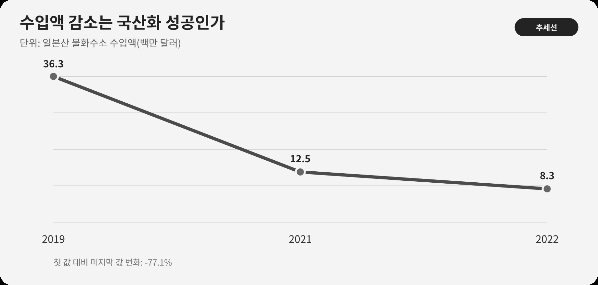

::: {.book-question}
[오늘의 책문]{.book-question-label}

{.book-question-image width=30mm fig-alt="수입 소재와 국내 대체 소재를 저울질하는 미니멀 수묵화"}

[일본산 불화수소 수입액이 줄었다면 신입 구매 담당자는 이를 국산화 성공이라고 보고해도 되는가?]{.book-question-prompt}
:::

조선의 책문^[이 장은 1798년 정조가 호남의 현실과 해법을 물은 실제 책문 「호남의 일곱 폐단과 해법」을 연결합니다. 전해지는 원문 첫머리는 “王若曰，湖南一路卽我朝興王之地也。”입니다. “왕은 이르노라, 호남 한 도는 곧 우리 왕조가 일어난 땅이다”라는 선언 뒤에 지역의 물산과 인재, 누적된 폐단을 함께 진단하도록 요구했습니다.]은 풍부한 물산이 있다는 찬사와 백성이 겪는 현실을 구분했습니다. 오늘의 구매 담당자도 ‘일본산 수입액이 줄었다’는 성과 문구를 그대로 받아 적지 말고, 국내 대체품의 수율·가격·원료 원산지와 고객 인증까지 확인해야 합니다.

## 왜 지금 이 질문인가

산업통상자원부 자료에서 일본산 불화수소 수입액은 2019년 3,630만 달러에서 2021년 1,250만 달러로 66% 감소했습니다. 무역통계를 이어 보면 2022년 반도체용 불화수소의 일본 수입액은 830만 달러로 제시됩니다. 규제 직전 고순도 불화수소의 일본 의존도는 43.9%였습니다. 이 흐름은 공급선 변화가 컸다는 사실을 보여 줍니다.

그러나 수입액 감소에는 서로 다른 이야기가 들어갈 수 있습니다. 국내 생산이 늘었을 수도 있고, 제3국 수입으로 바뀌었을 수도 있으며, 단가나 환율이 달라졌거나 생산 자체가 줄었을 수도 있습니다. 반도체 공정에서 ‘같은 화학식’은 곧바로 ‘같은 소재 성능’을 뜻하지 않습니다. 금속 불순물, 수분, 입자와 용기·운송 관리가 달라지면 식각 균일도와 수율에 영향을 줄 수 있습니다.

신입 구매 담당자의 보고서는 국가 간 감정을 평가하는 문서가 아닙니다. HS코드별 수입액·물량·단가, 공급자별 승인 품목, 국산품 투입 전후의 결함률과 수율, 원재료의 원산지, 비상재고와 고객 재인증기간을 연결하는 문서입니다. ‘국산화 완료’라는 표현은 구매선이 바뀌었다는 사실보다 훨씬 강한 주장입니다.

## 데이터 렌즈

{fig-alt="일본산 불화수소 수입액이 2019년 3,630만 달러에서 2022년 830만 달러로 줄어든 추이를 보여 주는 그래프"}

### 근거 데이터 표

| 구분 | 원자료의 수치·범위 | 보고서에 쓸 때의 한계 |
|---:|---|---|
| 정책자료 | 일본산 불화수소 수입액은 2019년 3,630만 달러였습니다. | 규제 직전 기준점이지만 물량과 순도별 구성이 함께 제시돼야 합니다. |
| 정책자료 | 2021년 수입액은 1,250만 달러로, 2019년보다 66% 감소했습니다. | 감소율은 공급선 변화의 신호이지 국산품의 양산 성능 증명은 아닙니다. |
| 무역통계 기반 자료 | 2022년 반도체용 불화수소의 일본 수입액은 830만 달러였습니다. | HS코드 범위와 집계 기준을 기록해야 다른 연도와 비교할 수 있습니다. |
| 규제 직전 자료 | 고순도 불화수소의 일본 의존도는 43.9%로 제시됐습니다. | 금액·물량·특정 등급 중 어떤 분모인지 확인하지 않으면 활용할 수 없습니다. |
| 원자료 계산 | 2019년 3,630만 달러에서 2022년 830만 달러로 약 77% 줄었습니다. | 계산된 감소폭도 국내 생산, 제3국 전환, 수요 감소를 분해하지 못합니다. |

### 이 숫자를 읽는 법

첫째, 수입액은 `물량 × 단가 × 환율`의 결과입니다. 금액이 줄어도 물량이 같은지, 고순도 제품의 단가가 바뀌었는지 알 수 없습니다. 반드시 같은 HS코드와 같은 기간의 중량·단가를 함께 확인해야 합니다.

둘째, ‘일본 의존도 하락’과 ‘국내 가치사슬 자립’을 구분합니다. 완제품을 국내에서 정제하더라도 원료, 용기, 분석장비 또는 공정 노하우를 특정 해외 공급자에게 의존할 수 있습니다. 국가 이름만 바뀌고 단일 의존이 남았다면 복원력은 충분히 개선되지 않았습니다.

셋째, 국산화의 최종 판정자는 구매팀만이 아닙니다. 생산팀이 장기간의 수율과 결함을 확인하고, 품질팀이 변경관리를 승인하며, 고객이 필요한 경우 재인증을 마쳐야 합니다. 시제품 성공, 한 라인 투입, 전 제품군 승인과 안정적 반복납품을 같은 단계로 쓰면 안 됩니다.

## 대립 답안

### 답안 A — 성과 인정론

수입액이 크게 줄고 국내 공급이 실제 양산으로 이어졌다면 그 과정은 분명한 학습 성과입니다. 공급자가 늘면 구매 협상력이 생기고, 갑작스러운 허가 지연에도 생산을 이어 갈 선택지가 커집니다. 완벽한 자립을 기다리느라 부분 성과까지 부정하면 다음 투자와 현장 개선의 동력을 잃을 수 있습니다.

다만 성과 인정의 근거는 국적이 아니라 납기와 성능이어야 합니다. 동일 제품군에서 고객 승인을 받고 반복 납품했으며, 비상시 증산할 능력이 확인될 때 ‘공급망 다변화 성과’라고 보고하는 편이 정확합니다.

### 답안 B — 성급한 성공론 경계

수입액 하나로 국산화 성공을 선언하면 가격 상승, 생산 감소, 제3국 우회와 품질비용이 가려집니다. 대체품이 비싸고 수율이 낮으면 표면상 수입은 줄어도 웨이퍼 한 장당 총비용은 오를 수 있습니다. 보호받는 공급자가 품질 개선을 늦출 위험도 있습니다.

특히 원료를 다른 한 국가에 집중해 들여온다면 일본 의존을 다른 의존으로 옮긴 것에 불과합니다. 구매팀은 홍보 문구를 만들기보다 단일 장애점이 어디로 이동했는지 찾아야 합니다.

### 답안 C — 단계별 국산화 판정

결론을 ‘완료’와 ‘실패’ 사이에 두지 않고 개발, 라인 검증, 고객 인증, 반복 양산, 원료 다변화로 나눕니다. 수입액 감소는 첫 번째 관찰지표로 인정하되, 국산품 사용 비중·수율·총소유비용·납기와 원료 원산지가 기준을 충족할 때만 다음 단계로 승격합니다.

이 답안의 전환 조건도 공개합니다. 대체품의 수율 차이가 사라지고 고객 재인증이 끝나며 비상 증산능력이 검증되면 ‘완료’로 바꿀 수 있습니다. 반대로 품질비용과 가격 프리미엄이 계속되고 새 국가 의존도가 높아지면 다변화 전략을 다시 설계해야 합니다.

## AI 조사 설계

### AI에게 물어볼 프롬프트

> 기준일은 2026년 8월 18일입니다. 일본산 반도체용 불화수소 수입 감소가 국산화 성과인지 신입 구매 담당자가 검증할 조사표를 작성하십시오. 관세청·산업통상자원부·한국무역협회 통계, 일본 경제산업성의 수출관리 문서, 기업 공시와 고객 인증자료 순서로 확인하십시오. HS코드, 기간, 국가, 금액, 중량, 단가, 순도·용도 범위를 적고 2019·2021·2022 수치의 비교 가능성을 판정하십시오. 국내 공급자의 원료 원산지, 생산능력, 실제 납품량, 제품군별 수율과 고객 승인 상태를 별도 표로 만드십시오. 확인된 통계, 정부·기업의 주장, 계산값, 내부 가정을 구분하고 모든 항목에 직접 URL을 붙이십시오. 마지막에는 ‘국산화 완료’라는 문장을 유지·수정·삭제할 조건을 제시하십시오.

### 데이터 취득

| 우선순위 | 자료 | 반드시 기록할 항목 |
|---:|---|---|
| 1 | 관세·무역 원자료 | HS코드, 수입국, 금액, 중량, 단가, 기간과 수정 여부 |
| 2 | 수출관리 규정 | 허가 대상 품목, 시행일, 포괄·개별 허가, 제도 변경 시점 |
| 3 | 사내 구매·품질 기록 | 공급자별 구매량, 로트 불량, 수율, 반품, 긴급조달 소요일 |
| 4 | 고객 변경승인 자료 | 제품군별 재인증 범위, 승인일, 보류 사유, 정기 감사 결과 |
| 5 | 국내 공급자 실사 | 원료 원산지, 정제·분석 능력, 증산 한계, 핵심 장비의 해외 의존 |

### 정보 판정

1. **품목 일치:** 산업용 전체 불화수소와 반도체용 고순도 품목을 구분합니다.
2. **값 분해:** 수입액 변화를 물량·단가·환율 변화로 나눕니다.
3. **단계 확인:** 개발 발표와 고객 승인, 한시 납품과 반복 양산을 따로 표시합니다.
4. **성능 비교:** 수율은 동일 제품·라인·기간의 기준군과 비교하고 다른 공정 변수를 기록합니다.
5. **의존 이전:** 국산품의 원료·용기·분석장비가 새 단일 국가에 몰렸는지 확인합니다.

### 토론의 핵심

- 수입액 77% 감소 가운데 국내 생산 확대가 설명하는 몫은 얼마입니까?
- 수율 0.4%p 손실을 공급 안정의 보험료로 받아들일 수 있는 조건은 무엇입니까?
- 가격 프리미엄과 긴급조달 위험을 웨이퍼 한 장당 총비용으로 어떻게 합치겠습니까?
- ‘국산화’ 대신 ‘공급망 다변화’라고 쓸 때 보고서의 책임 범위가 어떻게 달라집니까?

## 사례형 토론

아래 값은 모두 실제 기업 자료가 아닌 **면접용 가정**입니다. 당신은 입사 3개월 차 구매 담당자입니다. 일본산 소재 수입액은 기준연도보다 77% 줄었지만 국내 대체품은 15% 비싸고, 한 제품군에서 기존 소재보다 수율이 0.4%p 낮습니다. 현재 재고는 90일분이고 고객 재인증에는 9개월이 걸립니다. 국내 공급자의 정제 원료가 어느 국가에서 오는지는 아직 완전히 확인되지 않았습니다.

1. 구매팀은 수입액·물량·단가와 공급자별 총소유비용을 다시 계산합니다.
2. 생산·품질팀은 0.4%p 차이가 소재 때문인지 동일 조건 시험으로 검증합니다.
3. 영업팀은 9개월 재인증 동안 적용 가능한 제품과 고객을 구분합니다.
4. 당신은 보고서 결론을 **국산화 완료·부분 국산화·공급선 다변화 진행 중** 가운데 하나로 정합니다.
5. 90일 재고가 줄기 전에 원료 원산지 실사, 품질 개선과 이중구매 비율을 포함한 보완조치를 제시합니다.

면접관은 애국적 수사를 듣고 싶은 것이 아닙니다. 회사가 어떤 품질·비용 위험을 감수하는지, 그 위험을 누가 확인하고 언제 결론을 바꿀지 듣고 싶어 합니다.

## 90초 발언 예시

“저는 ‘국산화 완료’ 대신 ‘공급선 다변화가 진전됐으나 품질·원료 검증이 남았다’고 보고하겠습니다. 공공자료에서 일본산 불화수소 수입액은 2019년 3,630만 달러에서 2021년 1,250만 달러로 66% 줄었고, 2022년에는 830만 달러로 제시됩니다. 2019년 대비 약 77% 감소한 셈입니다. 하지만 수입액은 물량과 단가, 환율의 곱이므로 국내 양산 성능을 직접 증명하지 않습니다. 우리 사례의 가격 15% 프리미엄, 수율 0.4%p 열위, 재고 90일, 재인증 9개월은 모두 면접 가정입니다. 공급 안정성이 개선됐다는 적극론은 인정합니다. 다만 원료가 다른 한 국가에 몰리고 수율 손실이 계속되면 의존의 주소만 바뀐다는 반론도 맞습니다. 그래서 90일 안에 원료 원산지와 증산능력을 실사하고, 동일 제품·라인에서 수율 차이를 재검증하며, 9개월 고객 승인 일정 동안 이중구매를 유지하겠습니다. 수율 차이가 사라지고 고객 승인이 끝나며 반복 납품이 확인되면 ‘완료’로 바꾸겠습니다. 반대로 품질비용을 포함한 총원가가 계속 높고 새 단일 의존이 확인되면 제3 공급자를 추가하겠습니다. 국산화의 기준은 수입액 감소가 아니라 승인된 품질로 납기를 지키는 능력입니다.”

## 꼬리 질문

**교차질문과 재반박**

- 수입액은 줄었지만 수입물량이 늘었다면 보고서 결론을 어떻게 고치겠습니까?
- 0.4%p 수율 손실의 금액을 계산할 때 어떤 제품 가격과 기간을 쓰겠습니까?
- 고객 재인증 9개월 동안 일본산 재고가 부족해지면 어느 제품을 우선 배정하겠습니까?
- 국내 공급자가 핵심 원료를 한 국가에서만 사 온다면 국산화로 인정할 수 있습니까?
- 15% 가격 프리미엄을 공급 안정의 보험료로 인정할 최대 기간은 어떻게 정하겠습니까?
- 정부 발표와 사내 품질 데이터가 충돌할 때 최종 보고서에는 어떻게 기록하겠습니까?

## 출처

- [산업통상자원부, 「소재·부품·장비 경쟁력 강화 성과」 정책자료 (2022)](https://www.korea.kr/news/policyNewsView.do?newsId=148899420)
- [한국무역협회 국제무역통상연구원, *일본 수출규제 조치 해제의 경제적 효과와 시사점* Trade Brief No.09 (2023)](https://fileview.kita.net/getDownload/pY0FySquqta)
- [일본 경제산업성, *Security Export Control Policy* (2026 열람)](https://www.meti.go.jp/english/policy/external_economy/trade_control/index.html)
- [조선시대 책문 아카이브, 「호남의 일곱 폐단과 해법」(정조, 1798)](https://waterfirst.github.io/Joseon-Dynasty-Civil-Service-Examination/#jeongjo-1798/0)
- [한국학중앙연구원 한국고문서자료관, 1798년 응제 검색자료](https://archive.aks.ac.kr/search/list.do?fq=com_%EC%97%B0%EB%8F%84_fct%3A1798%EB%85%84%28%EC%A0%95%EC%A1%B022%29&fq=com_%EC%B0%B8%EA%B3%A0%EB%AC%B8%ED%97%8C_fct%3A%E3%80%8E%ED%95%9C%EA%B5%AD%EC%9D%98+%EA%B3%BC%EA%B1%B0%EC%A0%9C%EB%8F%84%E3%80%8F&q=query&sortField=%EC%9E%91%EC%84%B1%EB%85%84%EB%8F%84)

> 데이터 기준일: 2026년 8월 18일. 공공 수입통계와 사례 가정을 구분했으며, 15%·0.4%p·90일·9개월은 교육용 수치입니다.
