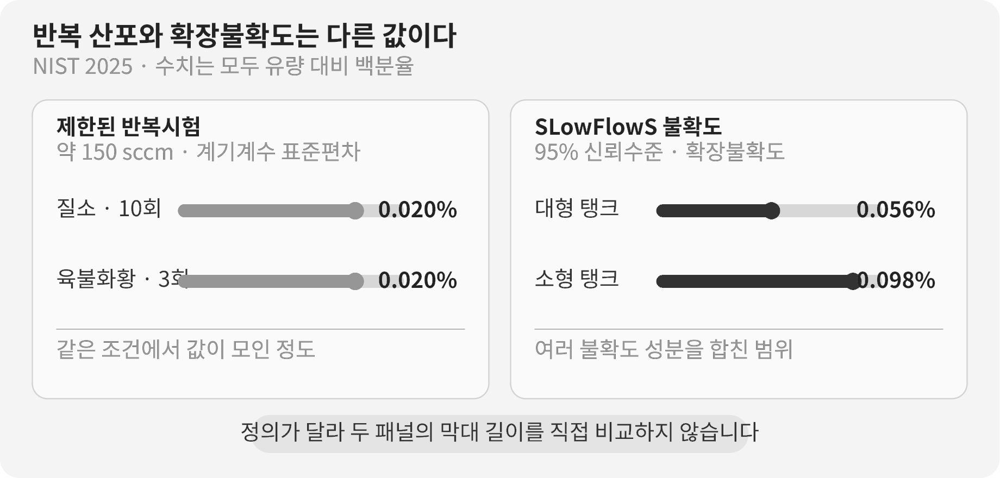

::: {.book-question}
[오늘의 책문]{.book-question-label}

{.book-question-image width=30mm fig-alt="한 번의 높은 최고치와 동일 조건에서 반복 측정되는 여러 웨이퍼를 대비한 미니멀 수묵화"}

[한 연구 샘플의 최고 성능과 반복 재현성이 충돌한다면 무엇을 다음 개발 단계로 넘겨야 하는가?]{.book-question-prompt}
:::

1447년 세종의 법과 운용에 관한 책문^[이 장이 연결한 실제 책문([策問]{.hanja})은 법이 폐단을 낳아 다시 법을 세우는 순환과 권한의 자리를 물었습니다. 책문 아카이브가 공개 번역의 뜻을 줄여 재구성한 한문은 “[法立而弊生，弊生而法又立。其所以救之者何歟？政權當歸於何所歟？]{.hanja}”이며 원문 직역이 아닙니다. “법을 세우면 폐단이 생기고 폐단이 생기면 다시 법을 세운다. 이를 구제할 방법은 무엇이며 권한은 어디에 돌아가야 하는가”라는 물음입니다. 오늘의 질문은 당시의 법제를 실험규정으로 번역한 것이 아니라, 좋은 기준도 운용자와 검증 절차가 바로 서지 않으면 성과를 보장하지 못한다는 질문 구조를 연구개발에 연결한 재해석입니다.]은 새 기준을 하나 더 만드는 데서 멈추지 않고, 그 기준을 누가 어떤 원칙으로 운용할지를 답하게 했습니다. 연구개발에서도 최고치 한 번은 가능성을 보여 주지만, 같은 절차를 다른 날·다른 웨이퍼·다른 장비에서 되풀이할 수 있어야 다음 사람이 그 결과를 사용할 수 있습니다.

## 왜 지금 이 질문인가

미국 NIST가 2025년 발표한 반도체 공정가스용 저유량 표준 SLowFlowS는 0.01~1,000 cm³/min의 유량 범위에서 95% 신뢰수준 확장불확도를 유량의 0.056~0.098%로 제시했습니다. 같은 연구의 선행 반복시험에서는 약 150 sccm에서 질소 10회와 육불화황 3회의 계기계수 표준편차가 각각 0.02%였습니다.

이 수치들은 ‘오차가 거의 없다’는 한 문장으로 합칠 수 없습니다. 0.02%는 특정 반복조건에서 값이 얼마나 모였는지를 나타내고, 0.056~0.098%는 교정·온도·압력·부피 등 불확도 성분을 포함한 확장불확도입니다. 반복값이 촘촘해도 모두 같은 방향으로 치우쳤다면 정확한 결과가 아닐 수 있습니다.

연구 샘플의 최고 성능도 같은 방식으로 읽어야 합니다. 최고치는 기술의 상한을 탐색하는 데 중요하지만, 최고 샘플만 골라 평균처럼 보고하거나 측정 불확도보다 작은 차이를 개선으로 부르면 양산팀은 재현할 수 없는 목표를 넘겨받습니다. 신입 연구원은 최고치, 중심값, 산포, 규격 미달 수, 측정 불확도와 조건 변경 뒤 결과를 한 표에 놓아야 합니다.

## 데이터 렌즈

{fig-alt="NIST 반도체 공정가스 표준의 반복 측정 표준편차와 대형·소형 탱크의 95퍼센트 확장불확도를 서로 다른 지표로 구분한 데이터 카드"}

### 근거 데이터 표

| 구분 | 원자료의 수치·범위 | 연구개발 판단에서의 의미 |
|---:|---|---|
| 측정 범위 | SLowFlowS는 표준상태 273.15 K, 101.325 kPa에서 0.01~1,000 cm³/min를 다룹니다. | 성능 수치는 적용 범위와 기준상태를 함께 적어야 합니다. |
| 반복성 시험 | 약 150 sccm에서 질소 10회와 육불화황 3회의 계기계수 표준편차는 각각 0.02%였습니다. | 같은 조건의 산포가 작다는 근거이며 장비·날짜가 바뀐 재현성을 모두 증명하지는 않습니다. |
| 확장불확도 | 대형 탱크는 유량의 0.056%, 소형 탱크는 0.098%였습니다. 두 값은 95% 신뢰수준의 확장불확도입니다. | 표준편차와 정의가 다르므로 같은 막대 순위로 우열을 정하면 안 됩니다. |
| 온도 검증 | 15시간 동안 탱크 표면의 24개 온도센서는 서로 63 mK 안에서 일치했고, 각 센서의 표준편차는 2 mK 미만이었습니다. | 장시간·다지점 검증이 단일 순간의 좋은 측정보다 강한 근거가 됩니다. |
| 종 효과 | 질소 교정값에 제작사 보정계수를 적용한 다른 가스 측정에서 유량 대비 최대 ±6%의 오차가 남았습니다. | 반복성이 좋아도 물질·방법이 바뀌면 계통오차가 커질 수 있습니다. |

### 이 숫자를 읽는 법

0.02%와 0.056~0.098%는 서로 다른 질문에 답합니다. 앞의 값은 제한된 반복시험의 표준편차이고, 뒤의 값은 여러 불확도 성분을 합친 95% 확장불확도입니다. 작은 표준편차만 보고 측정 정확도가 0.02%라고 말해서는 안 됩니다.

질소 10회와 육불화황 3회도 충분한 양산 검증 표본이 아닙니다. NIST 연구는 새로운 국가 유량표준의 검증이며, 특정 공정 레시피의 수율 보증시험이 아닙니다. 다만 ‘몇 번 측정했는가, 무엇을 바꿨는가, 어떤 불확도를 포함했는가’를 성능값과 함께 공개하는 연구 태도의 사례입니다.

최고치와 재현성은 적이 아닙니다. 최고치는 탐색 단계의 가설을 만들고, 반복성과 재현성은 그 가설을 다음 단계로 넘길 자격을 확인합니다. 보고서에는 최고치를 지우지 않되, 사전 정의한 제외기준 없이 좋은 샘플만 고른 값인지와 독립 재측정에서 유지되는지를 밝혀야 합니다.

## 대립 답안

### 답안 A — 최고치 우선 탐색

초기 연구의 목적은 아직 보지 못한 성능 가능성을 찾는 데 있습니다. 평균만 안정적으로 만드는 데 집중하면 위험한 가설을 일찍 버리고 기존 공정 주변만 탐색할 수 있습니다. 한 샘플의 최고치라도 측정 오류가 아니라는 최소 확인을 통과했다면 다음 실험의 방향을 바꾸는 중요한 증거입니다.

다만 최고치를 개발 완료값으로 부르지는 않습니다. 원자료, 샘플 선택과 측정조건을 공개하고 ‘탐색 결과’로 표시한 뒤 재현 원인을 찾는 후속실험 예산을 요청해야 합니다.

### 답안 B — 재현성 우선 이관

양산과 제품개발은 우연히 좋은 샘플이 아니라 반복해서 규격을 만족하는 분포를 사용합니다. 최고치가 높아도 샘플 간 산포가 크고 규격 미달이 반복되면 공정창이 좁거나 아직 모르는 교란요인이 있다는 뜻입니다. 다음 단계에는 낮은 최고치라도 중심값과 산포가 안정된 조건을 넘기는 편이 책임 있는 선택입니다.

그러나 지나치게 보수적인 기준은 혁신적인 후보를 계속 연구할 기회를 없앨 수 있습니다. 안정 조건을 이관하더라도 최고치 후보를 별도 연구트랙에 남겨 원인을 규명해야 합니다.

### 답안 C — 탐색과 이관의 이중 관문

최고치는 ‘기술 가능성’, 반복분포는 ‘이관 가능성’으로 분리해 승인합니다. 최고치 후보는 독립 재측정과 장비·날짜·웨이퍼를 바꾼 재현시험을 설계하고, 안정 후보는 제한된 파일럿에서 공정능력과 성능 손실을 확인합니다.

같은 숫자로 두 후보를 줄 세우지 않습니다. 최고치 후보에는 개선 메커니즘과 재현 성공률을, 안정 후보에는 평균·산포·규격 미달률과 비용을 관문으로 둡니다. 어느 후보도 관문을 못 넘으면 ‘성과 없음’이 아니라 가설과 실패 조건이 명확해졌다고 기록합니다.

## AI 조사 설계

### AI에게 물어볼 프롬프트

> 전력반도체 연구 샘플 두 레시피 가운데 파일럿 공정으로 이관할 후보를 평가하십시오. 원자료에서 샘플·웨이퍼·장비·측정일·작업자별 항복전압, 온저항, 결측과 재측정 이력을 보존하십시오. 최고값·평균·중앙값·표준편차·규격 미달 수를 계산하고, 측정시스템의 교정이력과 95% 확장불확도를 별도 열로 표시하십시오. 제외값은 사전 기준이 있는 경우와 사후에 뺀 경우를 구분하십시오. 동일 조건 반복성, 장비·날짜·작업자를 바꾼 재현성, 양산 공정창을 나눠 평가하십시오. 사실·계산·가정·권고를 분리하고 각 외부 근거에는 문서명·발행기관·연도·직접 URL을 붙이십시오. 최고치 우선, 재현성 우선, 이중 관문의 장단점과 결론이 바뀌는 수치 조건을 제시하십시오.

### 데이터 취득

| 우선순위 | 자료 | 반드시 기록할 항목 |
|---:|---|---|
| 1 | 샘플 원자료 | 모든 측정값, 샘플·웨이퍼 위치, 결측, 재측정과 제외 사유 |
| 2 | 실험 레시피·장비 로그 | 재료 로트, 공정조건, 장비, 챔버 상태, 측정일과 작업자 |
| 3 | 측정시스템 자료 | 교정표준, 분해능, 반복성·재현성, 불확도 예산과 환경조건 |
| 4 | 규격·제품 요구 | 항복전압 하한, 온저항·열·수명 한계, 고객 사용조건 |
| 5 | 후속 파일럿 계획 | 표본 수, 무작위화, 독립 재현기관, 성공·중단·재시험 기준 |

### 정보 판정

1. **선택 편향:** 최고 샘플만 남기거나 사후 기준으로 이상치를 제거하지 않습니다.
2. **측정 구분:** 반복성, 재현성, 정확도와 확장불확도를 같은 지표처럼 섞지 않습니다.
3. **효과 크기:** 후보 간 차이가 측정 불확도와 샘플 산포보다 큰지 확인합니다.
4. **공정 이동:** 한 웨이퍼의 다이 수를 독립 웨이퍼 수처럼 세지 않습니다.
5. **이관 관문:** 평균뿐 아니라 규격 미달, 산포, 공정창과 독립 재현을 통과해야 합니다.

### 토론의 핵심

- 최고치가 규격을 크게 넘더라도 반복 표본의 3분의 1이 미달이면 이관할 수 있습니까?
- 측정 불확도보다 작은 성능 차이를 연구 성과라고 부를 수 있습니까?
- 다른 장비에서 평균이 같고 산포가 커지면 재현 성공으로 보겠습니까?
- 안정 레시피의 온저항 손실을 얼마까지 받아들일 수 있습니까?

## 사례형 토론

다음 수치는 특정 기업이나 제품의 실제 결과가 아닌 **면접용 가정**입니다. 당신은 전력반도체 연구팀의 신입 엔지니어입니다. 파일럿 공정으로 한 레시피만 넘길 수 있습니다.

- 레시피 A는 12개 소자의 항복전압 최고치가 1,280 V, 평균이 1,195 V, 표준편차가 42 V이며 4개가 규격 1,200 V에 못 미쳤습니다.
- 레시피 B는 최고치가 1,250 V, 평균이 1,232 V, 표준편차가 11 V이며 12개 모두 1,200 V 이상이었습니다.
- 측정의 95% 확장불확도는 ±8 V로 가정합니다.
- B의 온저항은 A보다 6% 높아 효율 손실이 예상됩니다.

1. 연구팀은 A의 최고치가 측정·선택 오류가 아닌 물리적 개선인지 확인합니다.
2. 계측팀은 ±8 V 불확도 예산과 장비·날짜를 바꾼 재측정을 검토합니다.
3. 제품팀은 B의 온저항 6% 증가가 열설계와 고객규격에 미치는 영향을 계산합니다.
4. 당신은 **A 이관·B 이관·둘 다 보류** 가운데 하나를 택합니다.
5. 선택하지 않은 레시피의 후속실험과 결론 전환조건도 제시합니다.

좋은 답은 평균이 높은 후보를 고르는 데서 끝나지 않습니다. 규격 미달을 어떻게 처리할지, 불확도와 산포를 구분했는지, 안정성 때문에 잃는 성능을 어디까지 허용할지 설명해야 합니다.

## 90초 발언 예시

“저는 **답안 B, 재현성이 높은 레시피 B를 제한 파일럿으로 이관**하고 A는 연구 트랙에 남기겠습니다. NIST의 2025년 공정가스 표준은 0.01~1,000 cm³/min에서 95% 확장 불확도 0.056~0.098%를 제시합니다. 반복값이 촘촘해도 계통 오차가 없다는 뜻은 아니라는 실제 사례입니다. 반면 우리 수치는 가정입니다. A는 최고 1,280 V지만 평균 1,195 V이고 12개 중 4개가 규격에 미달했습니다. B는 평균 1,232 V, 표준편차 11 V이며 미달이 없습니다. A의 최고치가 더 큰 기술 가능성을 보인다는 반론은 인정하지만, 다음 단계에는 다른 엔지니어도 재현할 공정 창을 넘겨야 합니다. B의 온저항이 A보다 6% 높아 열 규격을 넘으면 이관을 보류하겠습니다. A는 독립 장비에서 웨이퍼 3장, 장당 20개를 재시험해 평균 1,230 V 이상, 표준편차 15 V 이하, 불확도 ±8 V 이하를 모두 만족하면 다시 심사하겠습니다. 파일럿 이관 뒤에도 로트별 산포와 규격 미달을 계속 투명하게 공개하겠습니다. 최고치는 탐색 성과로 기록하고 개발 이관은 재현 가능한 결과로 승인하겠습니다.”

## 꼬리 질문

**교차질문과 재반박**

- 레시피 A의 4개 미달이 모두 웨이퍼 가장자리라면 결론을 바꾸겠습니까?
- 레시피 B의 온저항 6% 증가가 시스템 전력 1% 증가에 그친다면 어떤 근거로 허용하겠습니까?
- 12개가 한 웨이퍼에서 나온 값이라면 표본 수를 왜 12로 그대로 보면 안 됩니까?
- 다른 장비에서 평균은 유지됐지만 표준편차가 22 V로 커지면 재현됐다고 보겠습니까?
- 측정 불확도가 ±8 V에서 ±20 V로 커지면 두 레시피의 비교를 어떻게 다시 설계하겠습니까?
- 최고치를 보도자료에 먼저 공개하라는 요청을 받으면 어떤 문구와 제한조건을 붙이겠습니까?

## 출처

- [미국 NIST, Pope 외, *SLowFlowS: A Novel Flow Standard for Semiconductor Process Gases* (2025)](https://www.nist.gov/publications/slowflows-novel-flow-standard-semiconductor-process-gases)
- [미국 국립의학도서관 PMC, SLowFlowS 논문 원문·실험자료 (2025)](https://pmc.ncbi.nlm.nih.gov/articles/PMC11894916/)
- [미국 NIST, *Research Updates—Gas Flow for Semiconductor Manufacturing* (2025)](https://www.nist.gov/pml/sensor-science/fluid-metrology/research-updates-gas-flow-semiconductor-manufacturing)
- [BIPM/JCGM, *International Vocabulary of Metrology—Repeatability and Reproducibility* (2012, 2026 열람)](https://jcgm.bipm.org/vim/en/2.25.html)
- [BIPM/JCGM, *Guide to the Expression of Uncertainty in Measurement* (2008)](https://www.bipm.org/documents/20126/2071204/JCGM_100_2008_E.pdf/cb0ef43f-baa5-11cf-3f85-4dcd86f77bd6?version=1.7)
- [미국 NIST, *CHIPS for America Metrology Program* (2026 열람)](https://www.nist.gov/chips/research-development-programs/metrology-program)
- [조선시대 책문 아카이브, 세종 1447년 「법의 폐단과 권력의 자리」](https://waterfirst.github.io/Joseon-Dynasty-Civil-Service-Examination/#sejong-1447/0)
- [국사편찬위원회, 『세종실록』 세종 29년 8월 27일 기사 (1447)](https://sillok.history.go.kr/id/kda_12908027_001)

> **자료 메모:** 0.01~1,000 cm³/min, 0.02%, 0.056~0.098%, 24개 센서, 63 mK, 2 mK와 최대 ±6%는 NIST 원자료입니다. 항복전압 1,280·1,250·1,195·1,232 V, 표준편차 42·11 V, 규격 1,200 V, 불확도 ±8 V, 온저항 6%와 후속 관문은 면접용 가정입니다.
