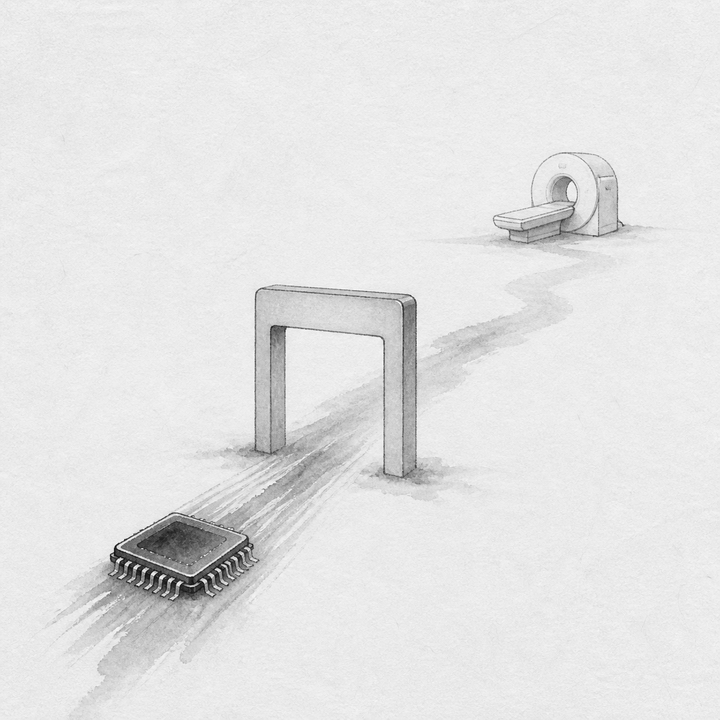
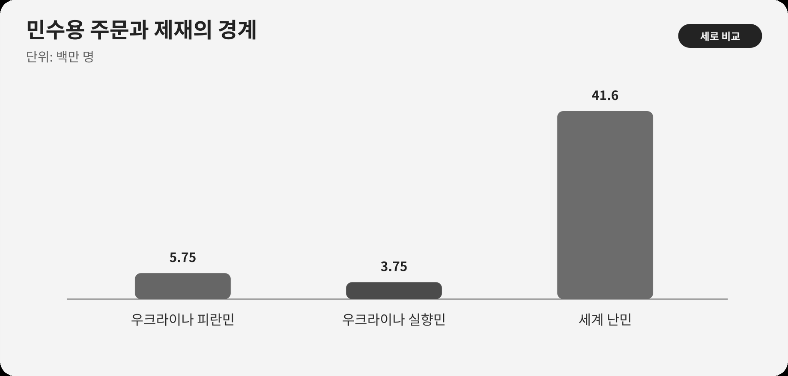

::: {.book-question}
[오늘의 책문]{.book-question-label}

{.book-question-image width=30mm fig-alt="제재의 장벽 너머 의료기기용 칩을 살피는 미니멀 수묵화"}

[제재 대상국의 의료기기용 칩 주문을 은행이 거절하면 신입 영업·준법 담당자는 거래를 되살려야 하는가?]{.book-question-prompt}
:::

조선의 책문^[이 장은 1568년 선조가 외적을 대하는 원칙을 물은 실제 책문 「정벌인가 화친인가」를 연결합니다. 책문 아카이브가 공개 번역의 뜻을 줄여 재구성한 한문은 “禦外之道，戰與和而已。義、力、勢，何所先後？”이며 원문 직역은 아닙니다. “외적을 막는 길은 싸움과 화친일 뿐이니, 의리·힘·형세에서 무엇을 먼저 하고 뒤에 할 것인가”라는 물음입니다.]은 명분만 옳다고 해서 실행 가능한 답이 되지 않으며, 힘과 형세만 따른다고 해서 정당한 답이 되는 것도 아니라고 보았습니다. 현대 기업의 제재 판단도 ‘인도적 목적’과 ‘법 위반 위험’ 가운데 하나를 외치는 일이 아닙니다. 제품·구매자·실소유자·최종 장착처와 결제경로를 확인해 합법적인 민수 거래와 우회거래를 갈라내는 일입니다.

## 왜 지금 이 질문인가

UNHCR은 2025년 9월 기준 우크라이나 출신 피란민을 575만 명, 국내 실향민을 375만 명으로 집계했습니다. 2025년 말 전 세계 난민은 4,160만 명이었습니다. 이 숫자들은 전쟁과 강제이주의 규모를 보여 주지만, 특정 반도체 주문이 의료기기에만 쓰인다는 증거는 아닙니다.

제재는 정부·군사조직·특정 산업과 자금줄을 압박하도록 설계되지만, 실제 거래에서는 은행·보험사·물류사가 불확실한 건을 넓게 거절할 수 있습니다. 이런 과잉준수는 의료·통신·식품처럼 허용 가능성이 있는 거래까지 막을 수 있습니다. 반대로 ‘병원 납품’이라는 문구만 믿으면 유통단계에서 이중용도 부품이 전용되거나 제재 대상자가 실소유한 회사로 흘러갈 수 있습니다.

신입 영업사원은 매출을 살리는 사람이지만 법적 분류를 임의로 확정하는 사람은 아닙니다. 주문을 바로 승인하거나 포기하기 전에 준법팀이 판단할 수 있는 증거 묶음을 만들어야 합니다. 제품분류, 적용 제재 프로그램, 거래상대방과 실소유자, 병원 계약, 운송·설치 위치, 재수출 금지, 사후 확인과 공급중단 권한을 한 건의 파일에 남기는 것이 핵심입니다.

## 데이터 렌즈

{fig-alt="2025년 우크라이나 피란민과 국내 실향민, 세계 난민 규모를 비교한 그래프"}

### 근거 데이터 표

| 구분 | 원자료의 수치·범위 | 거래 심사에서의 의미 |
|---:|---|---|
| UNHCR 집계 | 2025년 9월 우크라이나 출신 피란민은 575만 명이었습니다. | 국경 밖으로 피란한 사람의 규모이며 특정 구매자의 민수성을 증명하지 않습니다. |
| UNHCR 집계 | 같은 시점 우크라이나 국내 실향민은 375만 명이었습니다. | 국내에서 이동한 인구로 피란민과 정의·분모가 다릅니다. |
| UNHCR 집계 | 2025년 말 전 세계 난민은 4,160만 명이었습니다. | 시점과 포함 범주가 앞선 두 수치와 달라 단순 합산·비교하면 안 됩니다. |
| 조사 원칙 | 제재의 산업 효과를 볼 때 민간 의약·통신의 결제·물류 차단을 별도 지표로 둬야 합니다. | 제재 대상자 압박과 허용 가능한 인도적 거래의 실패를 분리해 평가해야 합니다. |

### 이 숫자를 읽는 법

피란민, 난민과 국내 실향민은 법적·통계적 범주가 다릅니다. 575만 명과 375만 명을 무심코 더해 ‘난민’이라고 부르면 정의가 틀립니다. 4,160만 명은 2025년 말 세계 범주이므로 9월의 우크라이나 수치와 기준시점도 다릅니다. 토론에서는 숫자의 크기로 감정적 결론을 만들기보다 범주와 시점을 먼저 설명해야 합니다.

이 통계는 **인도적 위험을 조사해야 할 이유**이지 거래 승인서가 아닙니다. 승인 여부는 해당 국가에 적용되는 법령, 칩의 수출통제 분류, 제재 대상자 목록, 구매자의 실소유자, 최종 의료기기와 병원 납품경로가 결정합니다. ‘의료용’이라는 사용 설명과 법적 인도적 예외도 같은 말이 아닙니다.

또한 은행의 결제 거절은 곧 불법 판정이 아닐 수 있습니다. 은행의 내부 위험한도가 더 엄격할 수 있으므로 거절 사유를 법적 금지, 정보 부족, 내부 정책으로 나눠야 합니다. 다만 다른 은행을 찾아 결제를 우회하기 전에 원래 위험을 해결했는지 준법 승인을 받아야 합니다.

## 대립 답안

### 답안 A — 거래 복원론

제품이 허용되는 의료기기용이고 최종사용자와 납품경로가 충분히 확인되며 적용 법령의 인도적 예외를 충족한다면 거래를 복원해야 합니다. 은행의 일괄 거절이 합법적인 치료 장비의 공급을 막는다면 기업은 정보와 통제장치를 보강해 과잉준수의 민간 피해를 줄일 책임이 있습니다.

거래 복원은 규정을 느슨하게 적용한다는 뜻이 아닙니다. 제한된 수량, 지정 병원 직접납품, 재수출 금지, 설치 확인과 사후 감사처럼 목적에 맞춘 조건을 붙이고 독립 준법심사를 통과해야 합니다.

### 답안 B — 거래 거절론

의료 명목은 우회거래에 악용될 수 있고 반도체는 장비 밖으로 빼내 다른 용도로 전용하기 쉽습니다. 중간 유통사의 실소유자나 최종 장착처를 확인하지 못하면 회사는 제재 회피, 이중용도 전용과 평판 손실을 동시에 감수하게 됩니다. 작은 매출을 위해 확인 불가능한 위험을 떠안을 이유가 없습니다.

사후 점검이 현실적으로 불가능한 지역이라면 계약서의 재수출 금지 문구도 약합니다. 위반을 발견해도 공급을 중단하거나 물품을 회수할 수 없다면 사전 거절이 유일한 통제일 수 있습니다.

### 답안 C — 증거충족형 조건부 재개

거래를 즉시 살리거나 포기하지 않고, 법적 분류와 최종사용자 증거가 충족될 때만 독립 심사로 재개합니다. 제품 사양과 수량이 의료기기 생산계획에 맞는지, 중간 유통사의 실소유자와 제재 연계가 없는지, 지정 병원까지 물류를 추적할 수 있는지 확인합니다.

미확인 항목이 남으면 출하와 결제를 보류합니다. 확인 뒤에도 재수출·전용 경보가 발생하거나 현장 확인을 거부하면 즉시 중단합니다. 이 접근은 인도적 예외를 실질적으로 쓰되 ‘좋은 목적’이 실사를 대신하지 못하게 합니다.

## AI 조사 설계

### AI에게 물어볼 프롬프트

> 기준일은 2026년 8월 18일입니다. 제재 대상국의 의료 영상장비용 반도체 주문을 재개할 수 있는지 조사하는 체크리스트를 만드십시오. 먼저 관할권과 적용되는 제재·수출통제 법령을 특정하고, 정부기관의 규정 원문·일반허가·FAQ만으로 금지, 허가 필요, 인도적 예외를 구분하십시오. 그다음 제품분류와 기술사양, 구매자·중간 유통사·실소유자, 최종 병원·장비 모델, 운송·결제은행·재수출 경로를 표로 정리하십시오. 각 정보에는 문서 발급자, 확인일, 유효기간과 직접 URL을 붙이십시오. 확인된 사실, 거래당사자의 진술, 미확인 사항, 준법팀의 법적 판단을 다른 열에 쓰고, 누락된 실소유자나 최종사용자 정보가 있으면 승인 결론을 내리지 마십시오. 마지막에는 재개·추가 실사·거절 각각의 근거와 즉시 중단 조건을 제시하십시오.

### 데이터 취득

| 우선순위 | 자료 | 반드시 기록할 항목 |
|---:|---|---|
| 1 | 관할 정부의 제재·수출통제 원문 | 대상자·지역·품목, 금지·허가·일반허가, 시행일과 예외 조건 |
| 2 | 제품 기술·분류 자료 | 모델, 성능, HS·수출통제 분류, 의료기기 장착 방식과 대체 용도 |
| 3 | 고객확인 자료 | 법인등기, 실소유자, 제재목록 검색, 임원·주소·계좌의 연계 |
| 4 | 최종사용·물류 자료 | 병원 계약, 장비 수량, 설치지, 운송경로, 재수출 금지와 수령 확인 |
| 5 | 사후통제 기록 | 설치 증빙, 이상 주문, 공급중단 권한, 감사 가능성과 보관기간 |

### 정보 판정

1. **법적 문구:** ‘인도적 목적’이라는 설명이 실제 허가·예외 요건을 충족하는지 원문으로 대조합니다.
2. **당사자 확인:** 구매회사뿐 아니라 중간 유통사와 실소유자까지 제재 연계를 조사합니다.
3. **수량 적합성:** 주문 수량·성능이 의료기기 생산량과 기술명세에 맞는지 봅니다.
4. **경로 일관성:** 계약·송장·운송·결제 정보의 회사명과 주소가 서로 일치하는지 확인합니다.
5. **통제 가능성:** 전용 징후를 발견했을 때 다음 출하를 실제로 중단할 수 있어야 합니다.

### 토론의 핵심

- 난민 통계가 거래의 인도적 필요를 보여 주더라도 승인 증거가 될 수 없는 이유는 무엇입니까?
- 은행의 거절이 법적 금지인지 내부 위험정책인지 누가 확인해야 합니까?
- 실소유자 한 명을 확인하지 못한 위험과 의료기기 공급 지연의 피해를 어떻게 비교하겠습니까?
- 사후 확인이 불가능한 지역에서는 어떤 조건도 거래를 안전하게 만들 수 없습니까?

## 사례형 토론

이 사례는 특정 국가·기업의 실제 거래가 아니며 모든 숫자는 **면접용 가정**입니다. 당신은 영업팀에 배치된 신입 사원입니다. 40만 달러 규모의 의료 영상장비용 칩 결제가 제재 위험을 이유로 은행에서 거절됐습니다. 구매자는 민간 병원 납품계약을 제출했지만 중간 유통사 한 곳의 실소유자가 확인되지 않습니다. 제품의 법적 분류와 인도적 예외 적용 여부는 준법팀이 아직 결론 내리지 않았습니다.

1. 영업팀은 병원·장비 모델·필요 수량과 납품기한을 문서화합니다.
2. 준법팀은 적용 법령, 제품분류와 일반허가·개별허가 여부를 판정합니다.
3. 재무팀은 은행 거절이 법적 금지인지 내부 정책인지 서면으로 확인합니다.
4. 당신은 **즉시 재개·추가 실사 후 조건부 재개·거절** 가운데 하나를 권고합니다.
5. 권고안에는 미확인 실소유자, 재수출 금지, 병원 수령 확인과 전용 발견 시 중단 절차를 넣습니다.

이 토론에서 다른 결제은행을 찾는 행동은 위험을 해결한 것으로 보지 않습니다. 빠른 답보다 ‘확인되지 않았으므로 지금은 보류한다’는 정확한 상태표시가 더 좋은 실무일 수 있습니다.

## 90초 발언 예시

“저는 즉시 재개나 최종 거절이 아니라 추가 실사 후 조건부 재개를 권고하겠습니다. UNHCR 자료에서 2025년 9월 우크라이나 출신 피란민은 575만 명, 국내 실향민은 375만 명이었고, 2025년 말 세계 난민은 4,160만 명이었습니다. 이 수치는 민간 피해를 외면해서는 안 된다는 배경이지만 40만 달러 주문의 최종용도를 증명하지는 않습니다. 40만 달러와 미확인 유통사 한 곳은 모두 사례 가정입니다. 거래 복원론처럼 합법적인 의료기기 공급을 은행의 과잉준수로 막아서는 안 됩니다. 그러나 의료 명목이 전용될 수 있고 실소유자를 모르면 제재 대상자에게 이익이 갈 수 있다는 반론이 결정적입니다. 따라서 제품분류와 인도적 예외의 원문 요건, 유통사 실소유자, 병원 장비 모델과 수량, 지정 배송경로를 확인할 때까지 결제를 보류하겠습니다. 모두 확인되면 지정 병원 직접납품, 재수출 금지, 수령·설치 증빙과 다음 출하 중단권을 조건으로 독립 준법승인을 받겠습니다. 실소유자가 끝내 확인되지 않거나 문서의 회사명·주소가 충돌하면 거래를 거절하겠습니다. 인도적 책임은 실사를 생략하는 이유가 아니라 허용되는 거래를 정확히 살려 내는 이유입니다.”

## 꼬리 질문

**교차질문과 재반박**

- 은행이 이유를 공개하지 않고 거래를 거절하면 합법 여부를 어떻게 확인하겠습니까?
- 의료기기용 칩이 다른 장비에도 쓰일 수 있을 때 수량 적합성을 어떻게 검증하겠습니까?
- 실소유자는 확인됐지만 최종 병원의 설치 증빙이 불가능하면 거래를 재개하겠습니까?
- 40만 달러 매출이 회사 전체에 미미해도 인도적 거래를 살릴 책임이 있습니까?
- 인도적 예외가 있어도 개별 수출허가가 필요하다면 고객 납기를 어떻게 다시 약정하겠습니까?
- 거래 뒤 전용 사실을 발견했을 때 영업·준법·경영진의 책임을 어떻게 나누겠습니까?

## 출처

- [UNHCR, *Ukraine Emergency* (2025 수치, 2026 열람)](https://www.unhcr.org/europe/emergencies/ukraine-emergency)
- [UNHCR, *Figures at a Glance—Global Trends 2025* (2026)](https://www.unhcr.org/about-unhcr/overview/figures-glance)
- [미국 재무부 OFAC, *Supplemental Guidance for the Provision of Humanitarian Assistance* (2023)](https://ofac.treasury.gov/media/931341/download?inline=)
- [조선시대 책문 아카이브, 「정벌인가 화친인가」(선조, 1568)](https://waterfirst.github.io/Joseon-Dynasty-Civil-Service-Examination/#seonjo-1568/0)
- [KRpia, 박광전 책문 항목(2026 열람)](https://www.krpia.co.kr/product/detail?nodeId=NODE03961489&plctId=PLCT00004893)

> 데이터 기준일: 2026년 8월 18일. 난민·피란민·실향민 수치는 UNHCR 집계이며, 40만 달러와 미확인 유통사 한 곳은 교육용 가정입니다. 실제 거래에서는 관할 법률가와 준법부서의 판단이 필요합니다.
