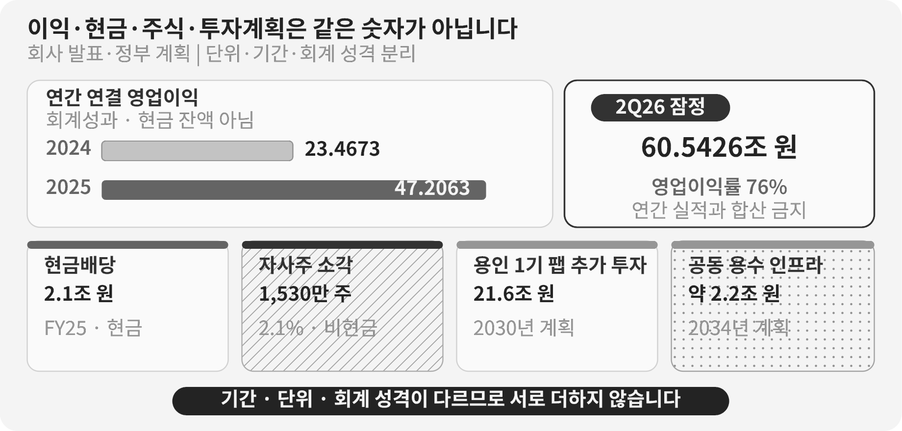

::: {.book-question}
[오늘의 책문]{.book-question-label}

{.book-question-image width=30mm fig-alt="반도체 웨이퍼에서 공장, 작업자, 주주, 마을로 네 갈래 물길이 이어지는 미니멀 수묵화 상징 삽화"}

[AI·데이터센터 호황의 이익을 재투자·노동·주주·공공 몫으로 어떤 기준에 따라 나눌 것인가?]{.book-question-prompt}
:::

1798년 정조의 호남 책문^[이 장이 연결한 실제 책문([策問]{.hanja})은 호남의 물산과 인재뿐 아니라 백성이 지는 부담과 누적된 폐단을 함께 살릴 방책을 물었습니다. 아카이브에 공개된 원문 첫 문장은 “[王若曰，湖南一路卽我朝興王之地也。]{.hanja}”, 곧 “왕은 이르노라. 호남 한 도는 우리 왕조가 일어난 땅이다”입니다. 오늘의 질문은 당시 조세제도를 현대 기업에 옮긴 번역이 아닙니다. 풍요의 총량과 부담의 분포를 함께 보라는 질문 구조를 빌린 재해석입니다.]은 물산이 풍부하다는 칭찬만으로 좋은 통치가 증명되지 않는다고 보았습니다. 누가 생산의 편익을 누리고 누가 세금·부역·지역 폐단을 떠안는지까지 살펴야 했습니다.

AI 메모리 호황도 “이익이 났으니 공평하게 나누자”로 끝나지 않습니다. 회사는 연구개발과 설비 실패위험을 부담했고, 노동자는 수율·납기·고객 인증을 만들었으며, 주주는 불황의 자본손실을 감수했습니다. 정부와 시민도 세액공제, 송전망, 용수관, 교육과 지역 생활비용을 통해 생산 기반을 함께 만들었습니다. 첫 질문은 각자의 공을 순위로 세우는 일이 아니라 **무엇을 이익이라고 부를지, 서로 다른 회계 성격을 어떻게 분리할지, 호황과 불황에 같은 규칙을 적용할지** 정하는 일입니다.

## 왜 지금 이 질문인가

SK하이닉스의 회사 발표 기준 2025년 연결 매출은 97.1467조 원, 영업이익은 47.2063조 원, 순이익은 42.9479조 원이었습니다. 2024년 영업이익 23.4673조 원과 비교하면 23.7390조 원 늘었고 증가율은 101%였습니다. 회사는 HBM 매출이 전년보다 두 배 이상 늘어 기록적 실적에 크게 기여했다고 설명했습니다. 그러나 HBM의 절대 매출과 제품별 영업이익은 이 발표에 따로 나오지 않았습니다. 회사 전체 영업이익 증가분을 전부 ‘AI 초과이익’이라고 부르면 원인과 분모를 과장할 수 있습니다.

2026년 2분기 회사의 잠정 연결 실적은 매출 79.3187조 원, 영업이익 60.5426조 원, 영업이익률 76%였습니다. 현금및현금성자산은 분기 말 88조 원, 총차입금은 18.6조 원, 순현금은 69.4조 원이라고 발표했습니다. 최신 호황의 크기를 보여 주지만, 단일 분기 잠정치와 연간 확정 배분능력은 같지 않습니다. 가격 급등, 운전자본, 세금, 설비대금의 지급시점과 비경상손익을 확인해야 합니다.

2026년 8월에는 배분의 한쪽이 먼저 확정됐습니다. SK하이닉스 이사회는 8월 19일 40조 원 규모 자기주식 취득·소각을 결의했고, 삼성전자 이사회는 8월 21일 약 90~110조 원의 주주환원 시행 방안을 의결했습니다. 두 결의 모두 잉여현금흐름의 일정 비율을 주주환원에 쓰겠다는 다년 정책의 이행입니다. 노동 몫과 공공 몫을 논하기 전에 주주 몫의 규모와 순서가 먼저 정해진 셈이며, 이 순서 자체가 이 장의 쟁점입니다.

‘이익’에는 적어도 네 가지 뜻이 있습니다. 영업이익은 본업의 회계성과이고, 순이익은 금융·세금·비경상 항목을 거친 결과이며, 잉여현금흐름은 실제 현금에서 투자를 뺀 값입니다. 노사가 정한 성과급 기준과 경제학의 초과이윤은 또 다른 개념입니다. 신입 사원이 배분안을 만들 때는 하나를 고르고 나머지를 숨기는 것이 아니라, **법정·계약상 지급을 먼저 분리한 뒤 재량으로 나눌 수 있는 현금**을 계산해야 합니다.

## 데이터 렌즈

{fig-alt="AI 메모리 호황의 영업이익, 현금배당, 자사주 소각, 다년 투자계획, 세금과 공공 인프라를 회계 성격별로 분리한 데이터 그림"}

### 근거 데이터 표

| 근거 | 공개된 수치·기간·분모 | 성격 | 토론에서의 의미 |
|---:|---|---|---|
| 1 | SK하이닉스 2025년 연결 매출 **97.1467조 원**, 영업이익 **47.2063조 원**, 순이익 **42.9479조 원**입니다. 2024년 영업이익은 23.4673조 원이었습니다. | 회사의 K-IFRS 연간 실적 발표 | 영업이익 증가액은 23.7390조 원이지만 현금 배분가능액이나 HBM만의 이익은 아닙니다. |
| 2 | 2026년 2분기 잠정 연결 매출 **79.3187조 원**, 영업이익 **60.5426조 원**, 영업이익률 **76%**이며 분기 말 순현금은 **69.4조 원**이라고 회사가 발표했습니다. | 2026년 7월 29일 회사의 분기 잠정치 | 최신 호황과 재무여력을 보여 주지만 한 분기를 장기 배분공식의 기준으로 고정해서는 안 됩니다. |
| 3 | 회사는 2025년 **HBM 매출이 전년보다 두 배 이상** 늘었다고 밝혔습니다. | 회사의 원인 설명 | 절대 HBM 매출, 제품별 원가·영업이익 분모가 없으므로 회사 전체 이익을 HBM 기여분으로 환산할 수 없습니다. |
| 4 | 2025 회계연도 총배당은 **2.1조 원, 주당 3,000원**으로 발표됐습니다. 회사는 발행주식의 **2.1%인 자사주 1,530만 주**를 소각한다고 밝혔고, 2026년 1월 27일 종가 기준 가치를 약 **12.2조 원**으로 제시했습니다. | 배당은 현금 지급, 자사주 소각 가치는 특정 시점의 시장가격 평가 | 2.1조 원과 12.2조 원을 같은 현금유출로 더하면 안 됩니다. 소각은 주식 수를 줄이지만 소각 시점에 12.2조 원을 새로 지급한 것은 아닙니다. |
| 5 | 회사는 2026년 2월 용인 1기 팹에 2030년 12월까지 **21.6조 원**을 추가 투자해 기존 9.4조 원을 포함한 총투자를 약 **31조 원**으로 늘린다고 발표했습니다. 장비 설치비는 제외됐습니다. | 이사회 결정에 따른 다년 시설계획 | 21.6조 원은 2025년 연간 설비투자나 한 번에 나가는 현금이 아닙니다. 기간·취소 가능성·장비비를 별도로 봐야 합니다. |
| 6 | 회사의 2025년 DBL 측정은 ‘고용’ **8.7114조 원**, ‘세금 납부’ **9.5329조 원**, ‘배당’ **2.1117조 원**을 간접 경제 기여로 제시합니다. 5개 자회사와 4개 사회적기업을 포함한다고 설명합니다. | 회사가 정의한 사회가치 측정값 | 고용값은 임금·성과급 총액, 세금값은 연결 손익계산서의 법인세비용과 같다고 단정할 수 없습니다. 측정범위와 방법을 확인해야 합니다. |
| 7 | 정부의 2025년 반도체 지원방안은 인프라 재정투자를 **3.1조 원에서 5.1조 원**으로 확대하고, 용인·평택 송전선로 지중화의 기업 부담분 **70%**를 국비로 분담하며, 2025년 1월 1일 이후 반도체 투자세액공제율을 국가전략기술보다 **5%포인트** 높인다고 제시했습니다. | 국가 전체 지원계획·한도·세제 | 특정 회사가 이 금액을 실제로 받았다는 뜻이 아닙니다. 공공기여를 논하려면 회사별 실현 세액공제와 보조금, 조건·환수조항을 확인해야 합니다. |
| 8 | 환경부와 한국수자원공사는 용인 통합용수 사업에 2034년까지 약 **2.2조 원**을 투입해 하루 **107.2만m³**를 공급하고, 1단계는 2031년 1월부터 하루 **31만m³**를 공급할 계획이라고 밝혔습니다. | 여러 기업·산단을 위한 장기 공공 인프라 계획 | 한 회사의 현재 물 사용량이나 보조금 수령액이 아닙니다. 취수·공급·재이용량과 사업비 분담을 나눠 봐야 합니다. |
| 9 | SK하이닉스 이사회는 2026년 8월 19일 자기주식 **40조 원** 취득 후 전량 소각을 결의했습니다. 회사는 결의 전날 종가 **주당 166만 2,000원** 기준으로 **2,407만 주**, 발행주식의 약 **3.3%**라고 밝혔습니다. 취득기간은 2026년 8월 20일부터 약 3개월입니다. 같은 결의에서 2025~2027년 주주환원 목표를 누적 잉여현금흐름의 ‘50% 범위 내’에서 **‘50% 이상’**으로 상향했습니다. | 이사회 결의에 따른 취득 예정 금액과 특정 종가 기준 환산 주식 수 | 이번에는 **금액이 확정치이고 주식 수가 파생값**입니다. 근거 4의 2025년 사례와 확정·파생 방향이 반대이므로 두 해를 같은 열에 놓고 단순 비교할 수 없습니다. |
| 10 | 삼성전자 이사회는 2026년 8월 21일 약 **90~110조 원** 규모의 2026년 주주환원 시행 방안을 의결했다고 공시했습니다. 2024~2026년 누적 잉여현금흐름의 **50%**를 주주환원에 쓰는 기존 정책의 이행이며, 2026년 3분기에 정규배당을 포함해 약 **30조 원**을 현금배당하고 잔여 재원은 2027년 1월 실적 확정 뒤 집행한다고 밝혔습니다. 구성원 보상을 위한 약 **15조 원** 자기주식 취득도 함께 의결했습니다. | 다른 회사의 이사회 결의·공시 | 90~110조 원은 **범위 추정치**이고 30조 원만 시점이 확정된 현금입니다. 구성원 보상 15조 원은 주주환원이 아니라 **노동 몫의 주식 지급 형태**로 따로 분류해야 합니다. |

### 이 숫자를 읽는 법

첫째, **영업이익과 현금을 분리**합니다. 영업이익에는 감가상각이 포함되고 설비대금, 재고, 매출채권과 세금 납부 시점은 현금흐름표에서 다르게 움직입니다. “영업이익의 몇 퍼센트”는 간단하지만, 유지보수 투자와 운전자본을 빼지 않으면 지급능력을 과장합니다.

둘째, **현금·주식 수·시장가치를 한 열에 더하지 않습니다.** 2025년 사례에서 배당 2.1조 원은 현금이고, 자사주 1,530만 주 소각은 발행주식 수의 변화이며, 약 12.2조 원은 특정 종가를 곱한 평가액입니다. 2026년 8월 결의는 방향이 반대입니다. **40조 원이 확정된 취득 예정 금액**이고, 2,407만 주와 3.3%는 결의 전날 종가 166만 2,000원으로 환산한 파생값입니다. 실제 소각 주식 수는 3개월 취득기간의 주가에 따라 달라집니다. 같은 회사의 ‘자사주 소각’이라는 같은 이름의 숫자에서도 무엇이 확정치이고 무엇이 환산값인지가 해마다 뒤바뀌므로 매번 성격을 다시 확인해야 합니다.

셋째, **연간 실적·분기 잠정치·다년 계획을 같은 기간으로 맞춥니다.** 2026년 2분기 영업이익을 네 배 해 연간 이익으로 단정하거나, 2030년까지의 21.6조 원을 2026년 한 해 투자로 놓으면 배분가능액이 왜곡됩니다.

넷째, **제품 기여와 회사 전체 성과를 분리**합니다. HBM 매출이 두 배 이상 늘었다는 사실은 AI 수요의 강도를 보여 줍니다. 그러나 기존 DRAM·낸드·eSSD, 환율, 가격과 원가도 영업이익에 영향을 줍니다. HBM별 영업이익이 공개되지 않았다면 ‘AI가 만든 몫’은 범위로 말해야 합니다.

다섯째, **세금·보조금·인프라는 총액과 순액을 함께 봅니다.** 법인세는 법적 의무이고 투자세액공제는 조건을 충족한 투자에 대한 감면이며, 송전·용수 지원은 여러 이용자가 공유할 수 있습니다. 세금 납부액과 지원계획을 단순 상계해 “정부 몫”을 만들 수 없습니다.

여섯째, **노동 기여를 회사의 ‘고용’ 측정값 하나로 대신하지 않습니다.** 인원, 기본급, 초과근로, 성과급, 협력사 노동, 산업재해, 이직률, 숙련과 수율 개선을 따로 봐야 합니다. 노사협상 수치가 공개되지 않았다면 개인당 성과급을 추정 사실처럼 제시하지 않습니다.

### 합산 함정 — ‘150조’를 분해하기

2026년 8월 두 회사의 결의를 두고 언론은 반도체 ‘150조 주주환원’이라는 표현을 썼습니다. 이 숫자는 성격이 다른 항목을 한 줄로 더한 값입니다.

- 삼성전자 90~110조 원은 **범위 추정치**입니다. 이 가운데 2026년 3분기 약 30조 원만 시점이 확정된 현금배당이고, 나머지 60~80조 원은 2027년 1월 실적 확정 뒤 현금배당과 자사주 매입·소각으로 나뉩니다.
- SK하이닉스 40조 원은 **취득 예정 금액**입니다. 3개월간 시장에서 매입한 뒤 소각하므로 실제 집행액과 소각 주식 수는 취득기간의 주가에 따라 달라집니다.
- 삼성전자의 구성원 보상용 자기주식 취득 약 15조 원은 주주환원이 아니므로 이 합계에 넣지 않습니다.

따라서 ‘150조’는 확정 현금, 범위 추정, 취득 한도, 미래 시점의 집행계획을 합한 수입니다. 배분을 논하려면 네 가지를 각각 다른 열에 두고, 집행이 끝난 뒤의 실제 현금유출과 소각 주식 수로 다시 확인해야 합니다. 큰 숫자일수록 합산 전에 성격부터 물어야 합니다.

## 대립 답안

### 답안 A — 적극 배분론

기록적 이익은 기술과 자본만으로 만들어지지 않습니다. 현장 노동자는 교대근무·수율개선·고객 대응으로 납기를 지켰고, 정부와 지역은 세액공제·송전망·용수·교통 비용을 분담했습니다. 주주도 불황기에 자본손실을 감수했습니다. 중간값을 크게 넘는 검증된 초과현금은 일회성 성과급, 협력사 단가·안전 개선, 지역 인프라, 특별배당으로 넓게 나누어 호황의 정당성과 조직 신뢰를 높여야 합니다.

다만 영업이익 증가액을 곧바로 배분하면 아직 지급하지 않은 세금, 유지투자, 고객계약과 다음 공정 전환을 놓칠 수 있습니다. 일회성 호황을 기본급·고정배당 같은 영구비용으로 바꾸면 불황기에 급격한 구조조정 압력이 생깁니다.

### 답안 B — 재투자·주주권 경계론

HBM과 첨단 패키징은 연구개발 실패, 장비 선발주, 장기 인증을 먼저 감수해야 얻는 결과입니다. 회사와 주주는 지난 적자기에도 자본을 투입했고, 다음 세대 생산능력이 없으면 현재 고용과 세수도 이어지지 않습니다. 법정 세금과 합의된 보상을 지급한 뒤 남은 현금은 고객의 장기계약, 수율, 투자회수 가능성을 기준으로 재투자와 주주환원에 우선 배정해야 합니다.

그러나 ‘미래투자’라는 말만으로 현금 축적과 임직원·지역의 기여를 무기한 미룰 수는 없습니다. 투자안의 수요근거, 중단 조건, 기대수익과 공공지원 실현액을 공개하지 않으면 재투자도 검증 불가능한 내부 주장에 머뭅니다.

### 답안 C — 조건부 배분 공식

저는 먼저 재량 배분의 분모를 다음처럼 정하겠습니다.

**가용배분액 = 세후 영업현금흐름 - 유지·안전 투자 - 이미 계약한 성장투자 - 운전자본·순차입 안전선**

법정 세금, 기본급, 산업안전 의무와 이미 체결한 계약은 이 풀의 ‘몫’이 아니라 먼저 지켜야 할 의무입니다. 남은 가용배분액만 추가 재투자, 노동 성과배분, 주주 현금환원, 전력·용수 효율과 지역편익, 불황준비금으로 나눕니다. 자사주 소각의 시장가치는 현금배분표 밖에서 주식 수 효과로 별도 표시합니다.

여기서 현실의 관행과 충돌이 생깁니다. 두 회사 모두 잉여현금흐름의 일정 비율을 주주환원에 배정하는 다년 정책을 공표해 두었고, SK하이닉스는 2026년 8월 그 목표를 누적 잉여현금흐름 ‘50% 범위 내’에서 ‘50% 이상’으로 올렸습니다. 이 방식에서 주주 몫은 남은 돈을 나누는 잔여가 아니라 **분모에서 먼저 약정된 몫**입니다. 위 공식은 반대로 주주환원을 마지막에 두므로, 두 방식은 같은 해에 서로 다른 금액을 만듭니다. 어느 쪽이 옳다고 선언하기 전에 **약정형과 잔여형이 호황과 불황에서 각각 어떻게 작동하는지** 비교해야 합니다. 약정형은 예측 가능성과 자본시장의 신뢰를 주지만 불황에 경직적이고, 잔여형은 유연하지만 해마다 재협상 비용과 불신을 낳습니다. 실제 설계는 둘 중 하나를 고르는 일이 아니라 **하한만 약정하고 그 위를 잔여로 두는 혼합**일 수 있습니다.

비율은 자동 고정하지 않습니다. 고객의 취소 불가능한 물량, 하방에서도 버티는 현금흐름, 수율과 장비 전환성이 확인되면 재투자 몫을 늘립니다. 노사가 합의한 성과지표와 안전·숙련 기여가 확인되면 노동 몫을 늘리고 일부를 불황준비금으로 이연합니다. 배당·매입은 투자와 부채 안전선을 지킨 뒤 집행합니다. 실제 세액공제·인프라 지원이 커질수록 회사의 전력·용수 절감, 지역기금, 환수조건 이행을 공개합니다.

손실분담도 대칭이어야 합니다. 가용배분액이 두 분기 연속 음수가 되면 선택적 자사주 매입, 임원 변동보상, 추가 성과급, 취소 가능한 성장투자를 사전에 정한 순서로 줄입니다. 기본급·안전·필수교육을 첫 조정항목으로 삼지 않고, 호황기에 적립한 준비금으로 성과급 급락을 완충합니다. 반대로 불황 때 투자와 보상을 줄였다면 회복 뒤 같은 지표로 다시 늘려야 합니다.

## AI 조사 설계

### AI에게 물어볼 프롬프트

> AI·데이터센터 호황을 누리는 한국 반도체 기업의 이익 배분안을 설계하십시오. ① 금융감독원 DART 사업보고서·감사보고서와 현금흐름표, ② 한국거래소 공시와 회사 이사회·주주총회·실적발표, ③ 회사와 노동조합의 공식 임금·성과급 합의문 또는 고용노동부 자료, ④ 기획재정부·국세청의 법인세·투자세액공제, 보조금·환수조건, ⑤ 산업통상자원부·환경부·지자체의 전력·용수 사업비와 분담자료 순서로 조사하십시오. 숫자마다 대상연도, 단위, 연결·별도 범위, 현금·비현금, 실적·계획, 분자와 분모를 기록하십시오. ‘확인된 사실, 회사 주장, 노동 측 주장, 정부 계획, 토론용 가정, AI 추론’을 다른 열에 표시하십시오. 영업이익을 배분가능현금으로 쓰지 말고 세후 영업현금흐름에서 유지·안전 투자, 계약된 성장투자, 운전자본·부채 안전선을 차감한 산식을 제시하십시오. 재투자·노동·주주·공공 몫과 호황·불황 전환 조건을 표로 만들고 모든 외부자료에 기관, 문서명, 발표일, 직접 URL을 붙이십시오.

### 데이터 취득

| 우선순위 | 자료 | 확인할 항목 |
|---:|---|---|
| 1 | 감사 재무제표·현금흐름표·주석 | 연결범위, 영업이익, 영업현금흐름, 법인세 납부, 유지·성장 CAPEX, 운전자본, 순차입금 |
| 2 | 이사회·주총·거래소 공시 | 배당 기준일·총액, 자사주 취득원가·소각 주식 수, 투자기간·취소조건, 실제 집행액 |
| 3 | 제품·고객 자료 | HBM·서버 DRAM·eSSD 매출 범위, 장기계약, 취소권, 수율, 고객집중도, 하방 가격 |
| 4 | 노사 공식자료 | 기본급·성과급 산식, 분모, 상한·이연, 대상인원, 협력사 범위, 불황기 조정 규칙 |
| 5 | 세제·보조금 원문 | 법인세비용과 현금납부, 세액공제 실현액, 보조금 지급·환수, 고용·투자 조건 |
| 6 | 전력·용수·지역 자료 | 정부·기업 분담액, 순취수·재이용, 최대전력·사용량, 주민비용, 지역기금과 공개범위 |

### 정보 판정

1. **회계 성격:** 이익, 현금유입, 현금유출, 주식 수 변화와 시장가치를 구분합니다.
2. **기간:** 분기 잠정치, 연간 실적, 5년 투자계획을 같은 기간으로 환산하되 추정을 표시합니다.
3. **범위:** 연결·별도·국내법인·자회사·협력사 중 어느 범위인지 적습니다.
4. **인과:** HBM 매출 증가와 회사 전체 영업이익 사이에서 가격·환율·기존 제품·원가를 통제합니다.
5. **추가성:** 정부지원 전후 투자가 실제로 늘었는지, 이미 예정된 투자를 보조했는지 확인합니다.
6. **대칭성:** 호황기 지급기준과 불황기 삭감기준이 동일한 지표·순서로 작동하는지 검사합니다.
7. **주장 출처:** 회사·노동·정부의 평가 문장을 사실값과 분리하고 반대 자료의 공개 여부를 기록합니다.

### 토론의 핵심

- 영업이익, 순이익, 잉여현금흐름, 노사 성과급 분모 가운데 무엇을 ‘나눌 이익’으로 삼겠습니까?
- HBM 제품별 이익이 공개되지 않을 때 AI 호황 기여분을 어느 범위로 제시하겠습니까?
- 현금배당과 자사주 소각, 다년 CAPEX와 당해 지출을 어떻게 같은 배분표에서 분리하겠습니까?
- 세액공제와 인프라 국비지원이 실제로 확인되면 기업의 공공·지역 의무를 무엇에 연동하겠습니까?
- 주주환원을 잉여현금흐름 비율로 미리 약정하는 방식과 잔여로 두는 방식 가운데 무엇을 택하겠습니까?
- 불황에 들어설 때 주주환원·변동성과급·선택투자 가운데 무엇을 어떤 순서로 조정하겠습니까?

## 사례형 토론

아래 회사와 수치는 모두 **토론용 가상 조건**이며 SK하이닉스나 다른 실제 기업의 자료가 아닙니다. 당신은 ‘한빛메모리’의 재무·노사·지속가능경영 공동 태스크포스에 배치된 신입 분석가입니다. 회사는 2026년 세후 영업현금흐름 10조 원을 예상합니다. 유지·안전 CAPEX 3조 원, 이미 계약한 성장 CAPEX 2조 원, 운전자본·순차입 안전선 1조 원을 빼면 가용배분액은 4조 원입니다.

각 이해관계자의 요구는 다음과 같습니다.

- 투자부문은 취소 가능한 추가 HBM 라인에 2.2조 원을 요구합니다. 고객 최소구매는 아직 협상 중입니다.
- 노동조합은 지난 수율개선과 교대부담을 근거로 추가 성과배분 1.4조 원을 요구합니다.
- 주주 측은 특별배당과 자사주 취득에 현금 1.8조 원을 요구합니다.
- 지역·공공협의체는 전력망 분담, 물 재이용, 협력사 안전과 지역기금에 0.6조 원을 요구합니다.
- 회사는 2025~2027년 누적 잉여현금흐름의 50% 이상을 주주환원에 쓰겠다고 이미 공표했습니다. 이 약정이 가용배분액 4조 원에 **앞서** 적용되는지 그 **안에서** 적용되는지가 최대 쟁점입니다. 앞서 적용하면 나머지 세 몫이 나눌 재원이 크게 줄어듭니다.

요구 합계는 6조 원으로 가용배분액보다 2조 원 많습니다. 회사는 실제로 실현된 투자세액공제 0.8조 원과 인프라 지원 0.2조 원이 있다고 가정합니다. 내년 메모리 가격이 35% 하락하면 세후 영업현금흐름은 5.5조 원으로 줄고, 추가 라인을 취소할 때 0.3조 원의 위약금이 발생할 수 있습니다. 이 수치도 모두 가정입니다.

신입 분석가는 **적극 배분, 재투자·주주 우선, 조건부 공식** 가운데 하나를 택해 4조 원의 금액표를 제시해야 합니다. 회사·노동·주주·정부·지역 어느 쪽도 상대의 기여를 0으로 놓을 수 없습니다. 제안서에는 가용배분액 산식, 각 몫의 현금·비현금 여부, 고객계약과 수율에 따른 투자 전환조건, 실현된 공공지원의 공개와 환수조건, 가격 35% 하락 때의 조정순서, 다음 호황에서 복원할 기준을 넣으십시오.

## 90초 발언 예시

“저는 **답안 C, 영업이익이 아니라 가용 배분액을 기준으로 나누는 방식**을 택하겠습니다. 실제 회사 발표에서 2025년 영업이익은 47.2063조 원, 배당은 2.1조 원이었지만 두 수치는 배분 가능한 현금과 같지 않습니다. 가상 사례에서는 세후 영업현금 10조 원에서 유지·안전 투자 3조 원, 계약된 성장 투자 2조 원, 운전자본·부채 안전선 1조 원을 빼 4조 원만 배분하겠습니다. 재투자 1.6조 원, 노동 1조 원, 주주 0.8조 원, 전력·용수와 지역 0.4조 원, 불황 준비금 0.2조 원이 제안입니다. 호황기에 더 투자해야 다음 고용과 수익을 지킨다는 반론은 타당합니다. 그래서 고객 최소 구매가 확정되고 가격 35% 하락에도 투자 현금이 1.5배 남으면 준비금과 주주 몫 일부를 재투자로 옮기겠습니다. 반대로 가용 배분액이 두 분기 연속 음수가 되면 자사주 매입과 임원 변동 보상부터 멈추되 기본급·안전·필수 교육은 지키겠습니다. 업계가 잉여현금흐름의 50% 이상을 주주환원에 먼저 약정한다는 사실도 압니다. 저는 그 약정을 **하한으로만** 인정하고, 그 위의 증액은 가용 배분액 안에서만 하며 불황기 조정 규칙을 같은 문서에 함께 적겠습니다. 공정한 배분은 같은 비율이 아니라 같은 분모와 호황·불황의 대칭 규칙을 미리 합의하는 일입니다.”

## 꼬리 질문

**교차질문과 재반박**

- HBM 제품별 영업이익이 공개되지 않았다면 23.7390조 원 증가분 중 ‘AI 초과이익’을 어떻게 추정하겠습니까?
- 제안한 40%·25%·20%·10%·5%를 각각 5%포인트 바꾸게 할 객관적 지표는 무엇입니까?
- 노동자는 수년간의 숙련 기여를, 주주는 적자기의 자본손실을 주장합니다. 한 경기순환 안에서 두 기여를 어떻게 비교하겠습니까?
- 2025년에는 소각 주식 수 1,530만 주가, 2026년에는 취득 예정 금액 40조 원이 확정치였습니다. 확정치와 파생값이 뒤바뀐 두 해의 자사주 소각을 같은 기준으로 비교하려면 무엇을 통제해야 합니까?
- 언론이 합산한 ‘150조 주주환원’에서 확정 현금, 범위 추정, 취득 한도, 미래 집행계획을 각각 얼마로 분리하겠습니까?
- 잉여현금흐름의 50% 이상을 주주환원에 먼저 약정한 회사에서 노동 몫과 공공 몫은 남은 재원만 두고 경쟁해야 합니까? 이 순서를 바꾸려면 어떤 근거가 필요합니까?
- 구성원 보상용 자기주식 취득 15조 원은 노동 몫입니까 주주 몫입니까? 현금 성과급과 비교해 노동자가 지는 위험은 어떻게 달라집니까?
- 세액공제와 인프라 지원이 늘 때 지역기금을 늘리면 법인세·보조금·지역분담을 이중 계산하는 문제가 생기지 않습니까?
- 메모리 가격이 35% 하락하고 가용배분액이 음수가 되면 주주환원·성과급·추가투자 가운데 무엇을 먼저 줄이며, 회복 뒤 무엇을 먼저 복원하겠습니까?

## 출처

- [SK하이닉스, *SK hynix Announces FY25 Financial Results* (2026-01-28)](https://news.skhynix.com/en/sk-hynix-announces-fy25-financial-results/)
- [SK하이닉스, *SK hynix Announces 2Q26 Financial Results* (2026-07-29)](https://news.skhynix.com/en/q2-2026-business-results/)
- [SK하이닉스, *New Facility Investment for Yongin Semiconductor Cluster* (2026-02-25)](https://news.skhynix.com/new-facility-investment-for-yongin-semiconductor-cluster/)
- [SK하이닉스, *DBL Performance—2025 SV·EV 측정값* (2026 열람)](https://www.skhynix.com/sustainability/UI-FR-SA04/)
- [SK하이닉스, *40조 원 규모 자사주 취득∙소각 조기 집행 · 주주환원 ‘FCF 50% 이상’ 추진* (2026-08-19)](https://news.skhynix.co.kr/share-buyback-and-retirement/)
- [삼성전자 IR, *주주환원 정책(Shareholder Return)* (2026 열람)](https://www.samsung.com/sec/ir/stock-information/shareholder-return)
- [대한민국 정책브리핑·기획재정부, 「글로벌 반도체 경쟁력 선점을 위한 재정투자 강화 방안」 (2025-04-17)](https://www.korea.kr/news/policyNewsView.do?newsId=148941998)
- [국가물관리위원회, 환경부 「용인 반도체 클러스터 용수 공급 사업 본격화」 (2025-05-16)](https://www.water.go.kr/board/PolicyNews/10620)
- [국세청, 「법인세 공제·감면 주요 제도」—국가전략기술·반도체 투자세액공제 (2026 열람)](https://www.nts.go.kr/nts/cm/cntnts/cntntsView.do?cntntsId=7987)
- [조선시대 책문 아카이브, 정조 1798년 「호남의 일곱 폐단과 해법」](https://waterfirst.github.io/Joseon-Dynasty-Civil-Service-Examination/#jeongjo-1798/0)

> **자료 메모:** 2025년·2026년 실적, 배당, 자사주 수와 회사가 제시한 시장가치, 다년 시설계획, DBL 측정값은 각 회사 원문에 따른 실제 공개값 또는 회사의 공식 계획·평가입니다. HBM이 실적에 기여했다는 설명과 DBL 분류는 회사의 주장·측정이며 제품별 이익이나 법인세비용과 같다고 보지 않았습니다. 정부의 5.1조 원, 70%, 5%포인트와 용수 2.2조 원·107.2만m³/일은 국가 전체 지원·인프라 계획이지 특정 기업의 수령액·사용량이 아닙니다. 2026년 8월 두 회사의 주주환원 결의는 각 사 이사회 결의·공시에 따른 값입니다. SK하이닉스의 40조 원은 취득 예정 금액이고 2,407만 주·3.3%는 결의 전날 종가 166만 2,000원 기준 환산값이므로 실제 소각 주식 수는 취득기간 주가에 따라 달라집니다. 삼성전자의 90~110조 원은 회사가 제시한 범위이며 확정 지급액이 아닙니다. 언론이 쓴 ‘150조’는 두 회사 값을 합산한 보도 표현이지 어느 회사의 공시값도 아닙니다. 한빛메모리의 10조·3조·2조·1조·4조·2.2조·1.4조·1.8조·0.6조·0.8조·0.2조·5.5조·0.3조, 가격 35%, 배분액과 전환 임계값은 모두 토론용 가정입니다.
