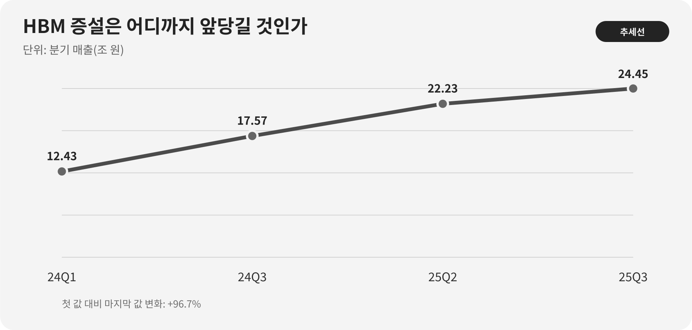

::: {.book-question}
[오늘의 책문]{.book-question-label}

{.book-question-image width=30mm fig-alt="HBM 적층과 단계별 설비투자 관문을 상징하는 미니멀 수묵화"}

[5년 장기주문이 들어왔지만 설비 회수에 7년이 걸린다면 신입 분석가는 전면 증설을 제안해야 하는가?]{.book-question-prompt}
:::

조선의 책문^[이 장은 1507년 중종이 시작의 뜻을 끝까지 지키는 법을 물은 실제 책문 「처음과 끝이 같은 정치」를 잇습니다. 책문 아카이브가 뜻을 줄여 재구성한 한문은 “善始者未必善終，何也？欲始終惟一，其道何由？”이며 원문 직역은 아닙니다. “잘 시작한 사람이 반드시 잘 끝내지 못하는 까닭은 무엇이며, 처음과 끝을 한결같이 하려면 어떤 길을 따라야 하는가”라는 물음입니다.]은 출발의 기세가 아니라 끝까지 작동할 제도와 태도를 요구했습니다. HBM 호황에서 좋은 시작은 장비를 빨리 주문하는 것일 수 있지만, 좋은 끝은 수요가 낮아져도 현금흐름을 지키고 다음 세대 제품으로 설비를 전환하는 것입니다.

## 왜 지금 이 질문인가

SK하이닉스 매출은 2024년 1분기 12.43조 원에서 2024년 3분기 17.57조 원, 2025년 2분기 22.23조 원, 2025년 3분기 24.45조 원으로 증가했습니다. 2024년 1분기와 2025년 3분기를 단순 비교하면 약 97% 늘어난 규모입니다. 2025년 3분기 영업이익은 11.38조 원이었습니다.

제품구성도 달라졌습니다. 회사 공시에서 HBM은 2024년 3분기 DRAM 매출의 30%였고 4분기 40%가 전망됐습니다. 이 수치는 AI 메모리의 중요도를 보여 주지만 HBM 출하량, 계약기간 또는 미래 수요가 확정됐다는 뜻은 아닙니다. 매출 증가는 물량뿐 아니라 가격과 고부가 제품믹스의 영향을 함께 받습니다.

설비투자팀 신입 분석가는 호황 서사를 투자안으로 옮길 때 시간표를 맞춰야 합니다. 고객의 주문기간, 취소권과 선수금, 장비 발주·설치, 수율 램프업, 패키징 병목, 감가상각과 투자회수기간을 한 축에 놓아야 합니다. 고객이 5년 물량을 말해도 설비 회수가 7년이면 마지막 2년의 현금흐름은 계약 밖 수요에 달려 있습니다.

## 데이터 렌즈

{fig-alt="SK하이닉스 분기 매출이 2024년 1분기부터 2025년 3분기까지 증가한 추이를 보여 주는 그래프"}

### 근거 데이터 표

| 구분 | 원자료의 수치·범위 | 투자판단에서의 의미 |
|---:|---|---|
| 기업 공시 | 2024년 1분기 매출은 12.43조 원이었습니다. | 비교의 시작점이며 HBM 단독 매출은 아닙니다. |
| 기업 공시 | 2024년 3분기 17.57조 원, 2025년 2분기 22.23조 원이었습니다. | 분기 매출의 상승경로지만 가격·물량·제품믹스를 분해해야 합니다. |
| 기업 공시 | 2025년 3분기 매출은 24.45조 원, 영업이익은 11.38조 원이었습니다. | 강한 수익성을 보여 주지만 신규 라인의 7년 현금흐름을 보장하지 않습니다. |
| 기업 발표 | HBM은 2024년 3분기 DRAM 매출의 30%였고 4분기 40%가 전망됐습니다. | 분모가 전체 매출이 아니라 DRAM 매출이며, 40%는 당시 전망값입니다. |
| 원자료 계산 | 2024년 1분기에서 2025년 3분기까지 매출은 약 97% 증가했습니다. | 서로 떨어진 두 분기의 단순 비교로 장기 성장률이나 수요 하방을 뜻하지 않습니다. |

### 이 숫자를 읽는 법

24.45조 원은 회사 전체 분기 매출입니다. HBM 수량이나 고객별 계약잔고와 같은 숫자가 아닙니다. 11.38조 원 영업이익도 기존 설비와 제품가격의 결과가 섞여 있으므로 신규 라인의 내부수익률에 그대로 넣을 수 없습니다.

HBM 30%의 분모는 DRAM 매출입니다. 판매량 비중이 아니며 가격이 높은 제품일수록 매출 비중이 크게 보입니다. 40%는 발표 당시 4분기 전망이므로 실제값과 구분해 기록해야 합니다. 신입 분석가는 공시된 실적, 경영진 전망과 자기 수요가정을 다른 색으로 표시해야 합니다.

장기주문도 계약서를 읽기 전에는 확정수요가 아닙니다. 최소구매, 가격 재협상, 취소수수료, 고객의 설계 변경, 품질 미달과 공급자 교체권을 확인해야 합니다. 장비를 취소할 때 내는 비용뿐 아니라 패키징·검사·전력과 숙련인력의 동반투자도 하방 시나리오에 넣어야 합니다.

## 대립 답안

### 답안 A — 선제 전면 증설론

HBM은 장비 조달과 공정·패키징 인증에 시간이 걸려 수요가 확인된 뒤 움직이면 고객의 제품주기를 놓칠 수 있습니다. 장기주문과 기술격차가 확인된 시점에 설비를 선점하면 고객과 표준을 묶고 후발주자의 진입을 늦출 수 있습니다.

증설 지연의 기회비용도 큽니다. 장비 대기열과 클린룸·전력 공사가 길어지면 한 번 놓친 물량을 다음 분기에 되찾지 못할 수 있습니다. 고객의 공급 안정 요구를 충족하는 능력 자체가 다음 계약의 근거가 됩니다.

### 답안 B — 과잉투자 경계론

5년 주문보다 회수기간이 7년으로 길다면 계약이 끝난 뒤의 수요와 가격을 회사가 떠안습니다. AI 투자속도가 둔화하거나 고객이 자체 가속기 구조를 바꾸면 고정비와 감가상각 충격이 커집니다. 메모리 산업의 과잉증설 경험을 무시한 전면 발주는 다음 불황을 깊게 만들 수 있습니다.

또한 HBM 웨이퍼 생산만 늘려도 패키징·검사·기판·전력이 따라오지 않으면 판매 가능한 제품이 되지 않습니다. 가장 큰 장비에 예산을 집중해 실제 병목을 놓치는 것이 더 위험합니다.

### 답안 C — 수요연동 삼단계 증설론

클린룸·기반시설, 핵심 장비, 후속 장비를 단계로 나누고 고객의 선수금·최소구매·인증과 패키징 가동률이 확인될 때 다음 발주를 엽니다. 이렇게 하면 장비 대기시간을 일부 선점하면서도 하방 수요가 나타날 때 취소 가능한 여지를 남깁니다.

전환 조건은 계약의 질과 현금흐름입니다. 취소 가능한 수주가 늘거나 선수금이 줄고, 하방 시나리오에서 투자기간 중 현금이 부족해지면 다음 단계를 멈춥니다. 반대로 고객이 위험을 분담하고 패키징 병목과 수율이 해소되면 증설을 앞당깁니다.

## AI 조사 설계

### AI에게 물어볼 프롬프트

> 기준일은 2026년 8월 18일입니다. HBM 장기주문 5년과 신규 라인 투자회수 7년을 비교해 전면 증설 또는 삼단계 증설을 권고하는 자료를 만드십시오. 기업 공시·실적발표, 고객 계약서와 수요예측, 장비 발주서, 공정·패키징 월별 능력, 재무모형 순으로 조사하십시오. 매출·출하량·ASP·DRAM 내 HBM 매출 비중을 구분하고 실적, 기업 전망, 사내 가정을 별도 열에 쓰십시오. 고객별 최소구매·취소권·선수금·가격조정, 장비 리드타임·취소수수료, 웨이퍼·적층·검사 병목과 수율 램프를 표로 제시하십시오. 기준·하방·상방의 현금흐름과 회수기간을 계산하되 각 가정의 출처와 민감도를 밝히십시오. 마지막에는 다음 단계 발주를 열거나 멈출 수치와 책임자를 제안하십시오.

### 데이터 취득

| 우선순위 | 자료 | 반드시 기록할 항목 |
|---:|---|---|
| 1 | 고객 계약·수요 합의 | 기간, 최소구매, 취소권, 가격조정, 선수금, 품질·납기 조건 |
| 2 | 장비·건설 계약 | 발주·설치 리드타임, 지급일정, 취소수수료, 전환·중고매각 가능성 |
| 3 | 공정·패키징 운영자료 | 웨이퍼 투입, 적층·검사능력, 수율, 가동률, 병목과 인력 |
| 4 | 기업 공시·시장자료 | 실적과 전망의 구분, HBM 비중의 분모, 가격·물량·믹스 변화 |
| 5 | 재무모형 | 감가상각, 운전자본, 전력·소재비, 기준·하방 현금흐름과 회수기간 |

### 정보 판정

1. **실적과 전망:** 2024년 4분기 40%처럼 발표 당시 전망인 숫자를 실제값으로 쓰지 않습니다.
2. **계약 품질:** 주문기간보다 최소구매·취소·가격조정과 선수금이 위험분담을 결정합니다.
3. **병목 일치:** 웨이퍼 능력과 적층·검사·기판 능력을 같은 완제품 단위로 환산합니다.
4. **시간 일치:** 고객 계약기간과 장비수명·감가상각·회수기간을 같은 연도 축에 놓습니다.
5. **하방 생존:** 수요가 낮을 때 취소비용, 고정비와 현금잔액을 우선 확인합니다.

### 토론의 핵심

- 5년 주문 뒤 남는 2년의 회수위험을 고객과 어떻게 나눌 수 있습니까?
- 장비 선점의 기회비용과 12% 취소수수료 가운데 무엇이 더 큰지 어떻게 계산하겠습니까?
- 웨이퍼보다 패키징이 병목이면 어떤 설비를 먼저 발주해야 합니까?
- 단계적 증설이 너무 느려 고객을 잃는다는 반론에 어떤 선행투자로 답하겠습니까?

## 사례형 토론

아래 값은 SK하이닉스의 실제 투자계획이 아니라 **면접용 가상 조건**입니다. 당신은 설비투자팀 신입 분석가입니다. 주요 고객이 5년 물량을 제안했지만 신규 라인의 투자 회수에는 7년이 걸립니다. 하방 시나리오에서 수요는 기본안의 50%이며, 이미 발주한 장비의 취소수수료는 계약금액의 12%입니다. 고객의 최소구매와 선수금, 패키징 병목은 아직 협상 중입니다.

1. 영업팀은 5년 물량의 취소 가능분과 가격조정 조항을 공개합니다.
2. 생산팀은 웨이퍼·적층·검사의 월별 능력과 목표 수율 도달시점을 제시합니다.
3. 구매팀은 장비별 리드타임, 12% 취소비용과 단계별 발주 가능성을 정리합니다.
4. 재무팀은 기본안과 50% 하방의 7년 현금흐름을 비교합니다.
5. 당신은 **일괄 증설·삼단계 증설** 가운데 하나를 고르고 다음 단계의 개방·중단 조건을 씁니다.

전면 증설을 택하더라도 ‘AI 수요가 계속될 것’이라는 문장만으로는 부족합니다. 삼단계를 택하더라도 첫 단계가 장비 대기열을 확보할 만큼 빠른지 설명해야 합니다.

## 90초 발언 예시

“저는 삼단계 증설을 권고하겠습니다. 공시에서 SK하이닉스 분기 매출은 2024년 1분기 12.43조 원에서 2025년 3분기 24.45조 원으로 약 97% 늘었고, 같은 분기 영업이익은 11.38조 원이었습니다. HBM은 2024년 3분기 DRAM 매출의 30%였으며 4분기 40%가 전망됐습니다. 다만 회사 전체 매출 증가와 HBM 매출 비중은 7년 투자수익을 보장하지 않습니다. 사례의 고객 계약 5년, 회수 7년, 하방 수요 50%, 취소수수료 12%는 모두 가정입니다. 선제 증설론처럼 장비와 인증이 늦으면 호황을 놓칠 수 있으므로 클린룸과 병목 장비는 먼저 확보하겠습니다. 그러나 계약보다 회수가 2년 길고 하방에서 수요가 절반이면 전면 발주의 고정비가 큽니다. 첫 단계는 장비 대기열과 시제품 능력을 확보하고, 다음 단계는 고객 최소구매·선수금과 패키징 수율이 확인될 때만 열겠습니다. 취소 가능한 수주가 늘거나 50% 하방 현금흐름이 투자기간 중 부족해지면 12% 취소비용을 감수하고 후속 발주를 멈추겠습니다. 반대로 고객이 위험을 분담하고 병목이 해소되면 일정을 앞당기겠습니다. 권벌은 1507년 답안에서 좋은 시작을 끝까지 잇으려면 원칙을 실제로 운용해야 한다고 했습니다(의역). 그 기준만 참고해, 설비 속도는 호황이 아니라 고객 계약과 공정 데이터로 정하겠습니다.^[응시자: 권벌(權橃). 답안 요지(의역): 좋은 시작을 좋은 끝으로 잇으려면 마음의 근본을 보존하고 올바른 방도를 실제 운용해야 합니다. [국사편찬위원회 조선시대 사료 DB, 「한국고문서입문—시권」](https://db.history.go.kr/joseon/level.do?levelId=odi_002_0050_0110)은 1507년 권벌의 실제 시권·책문·답안 일부와 병과 2위, 즉 전체 12위라는 등위를 함께 공개합니다. 따라서 장원이라고 쓰지 않고 ‘응시자의 답안’으로 표기했습니다. 아카이브 개별 항목은 [「처음과 끝이 같은 정치」, 권벌 항목](https://waterfirst.github.io/Joseon-Dynasty-Civil-Service-Examination/#jungjong-1507/0)입니다.]”

## 꼬리 질문

**교차질문과 재반박**

- 고객의 5년 물량이 구속력 없는 전망이라면 첫 단계도 보류해야 합니까?
- 장비 취소수수료 12%와 과잉설비 7년 유지비를 어떻게 비교하겠습니까?
- 하방 수요 50%에서도 경쟁사가 증설한다면 시장점유율 방어를 우선하겠습니까?
- HBM 매출 비중의 분모가 DRAM이라는 사실이 투자안에 어떤 차이를 만듭니까?
- 패키징 수율은 낮지만 웨이퍼 장비 리드타임이 길다면 어느 발주를 먼저 하겠습니까?
- 고객 선수금이 충분하면 투자회수 7년이라는 우려가 사라집니까?

## 출처

- [SK하이닉스, *1Q24 Financial Results* (2024)](https://news.skhynix.com/sk-hynix-announces-1q24-financial-results/)
- [SK하이닉스, *3Q24 Financial Results* (2024)](https://news.skhynix.com/sk-hynix-announces-3q24-financial-results/)
- [SK하이닉스, *3Q25 Financial Results* (2025)](https://news.skhynix.com/en/sk-hynix-announces-3q25-financial-results/)
- [조선시대 책문 아카이브, 「처음과 끝이 같은 정치」(중종, 1507)](https://waterfirst.github.io/Joseon-Dynasty-Civil-Service-Examination/#jungjong-1507/0)

> 데이터 기준일: 2026년 8월 18일. 기업 실적·발표 수치와 사례 가정을 구분했으며, 5년·7년·50%·12%는 교육용 조건입니다.
