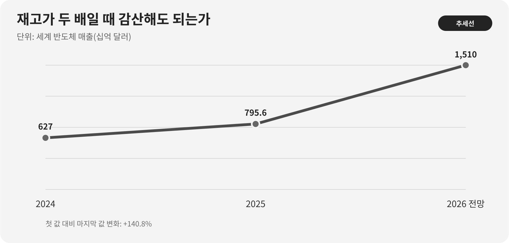

::: {.book-question}
[오늘의 책문]{.book-question-label}

{.book-question-image width=30mm fig-alt="쌓인 메모리 재고와 멈추는 생산라인을 저울질하는 미니멀 수묵화"}

[재고가 목표의 두 배이고 가격이 원가 아래라면 경쟁사 움직임과 무관하게 감산을 제안해야 하는가?]{.book-question-prompt}
:::

조선의 책문^[이 장은 1447년 세종의 실제 책문 「법의 폐단과 권력의 자리」를 시장 운영의 책임 문제에 연결합니다. 책문 아카이브가 뜻을 줄여 제시한 한문 재구성은 “法立而弊生，弊生而法又立。其所以救之者何歟？政權當歸於何所歟？”이며 원문 직역은 아닙니다. “법을 세우면 폐단이 생기고 폐단이 생기면 다시 법을 세우니, 이를 구제할 길은 무엇이며 정권은 어디에 돌아가야 하는가”라는 물음입니다.]은 폐단을 고치려 만든 새 제도가 다시 다른 폐단을 낳을 수 있음을 경계했습니다. 재고를 줄이려는 감산도 회사의 손실을 막는 정상적 운영이 될 수 있지만, 과점시장에서 경쟁사와 보조를 맞추는 방식이 되면 가격과 공급의 새 폐단을 낳습니다. 신입 생산관리자는 ‘왜 줄이는가’뿐 아니라 ‘누구의 정보로, 어떤 기록을 남겨 독립적으로 줄였는가’를 설명해야 합니다.

## 왜 지금 이 질문인가

WSTS는 2024년 세계 반도체 시장을 약 6,270억 달러로 추정했고, 2025년 실제 시장은 7,956억 달러로 발표했습니다. WSTS가 제시한 2025년 전년 대비 성장률은 26.2%였습니다. 2026년 봄 전망은 AI와 메모리 수요 증가를 반영해 세계 시장을 1.51조 달러로 제시했습니다.

큰 시장 숫자는 생산회의의 배경일 뿐 제품별 결론이 아닙니다. 세계 반도체 매출이 늘어도 특정 세대 DRAM이나 NAND의 재고, 고객 인증, 평균판매가격과 현금원가는 서로 다르게 움직입니다. AI용 고부가 메모리의 강한 매출이 범용 제품의 과잉재고를 가릴 수도 있습니다.

2024 수치는 당시 추정치이고 2025 수치는 뒤에 확정된 실제값이며, 2026 수치는 미래 전망입니다. 서로 다른 전망 시점의 숫자를 한 선에 놓고 정확한 성장률을 다시 계산하면 개정된 과거 기준과 최신 실적이 섞일 수 있습니다. 신입사원은 WSTS의 발표시점과 데이터 빈티지를 기록하고, 자사 결정에는 제품·등급·고객별 내부자료를 사용해야 합니다.

## 데이터 렌즈

{fig-alt="세계 반도체 매출의 2024년 추정, 2025년 실제와 2026년 전망을 구분해 보여 주는 그래프"}

### 근거 데이터 표

| 구분 | 원자료의 수치·범위 | 감산 토론에서의 의미 |
|---:|---|---|
| 과거 추정 | WSTS는 2024년 세계 반도체 시장을 약 6,270억 달러로 추정했습니다. | 전 세계·전 제품 매출이며 특정 메모리의 재고상태가 아닙니다. |
| 실제 발표 | 2025년 세계 시장은 7,956억 달러였습니다. | 최신 실제값이지만 가격 상승과 물량 증가를 분해하지 않은 매출입니다. |
| 기관 산출 | WSTS는 2025년 전년 대비 성장률을 26.2%로 제시했습니다. | 기관이 사용한 개정 비교기준을 따라야 하며 다른 빈티지 수치로 재계산하면 차이가 날 수 있습니다. |
| 조건부 전망 | 2026년 봄 전망은 1.51조 달러였습니다. | 미래 실적이 아니라 AI·메모리 성장 가정에 따른 전망값입니다. |

### 이 숫자를 읽는 법

6,270억 달러, 7,956억 달러와 1.51조 달러는 모두 세계 반도체 **매출**입니다. 칩 출하개수, 웨이퍼 투입량이나 특정 회사의 수요가 아닙니다. 메모리 가격이 오르면 물량이 같아도 시장 매출은 커질 수 있으므로 생산량 결정에는 비트 출하와 제품별 ASP를 별도로 봐야 합니다.

실제값과 전망값을 같은 확실성으로 읽지 않습니다. 2026년 1.51조 달러는 봄 시점에 이용 가능한 정보로 만든 조건부 기대입니다. 보고서에는 발표일과 전망시계, 이전 전망에서 무엇이 바뀌었는지를 써야 합니다. 전망이 커졌다는 이유로 재고 12주인 제품까지 계속 생산하는 것은 집계 수준의 오류입니다.

감산의 준법성은 결과만으로 판단하지 않습니다. 회사가 자사 재고·현금원가·확정주문·가동률로 독립 결정했고 경쟁사의 미래 가격·생산계획을 주고받지 않았다는 절차와 기록이 중요합니다. 공개된 시장통계와 비공개 경쟁사 정보를 구분하고, 의심되는 접촉은 법무 검토와 정보차단 절차에 올려야 합니다.

## 대립 답안

### 답안 A — 독립 감산론

수요보다 빠른 생산은 재고 보관비, 전력·소재와 현금을 낭비합니다. 평균판매가격이 현금원가 아래이고 확정주문으로 소진되지 않는다면, 경쟁사와 무관하게 자사 생산을 줄이는 것은 정상적인 경영 판단입니다. 손실 제품을 계속 만들어 시장성장을 기다리는 것이 오히려 무책임할 수 있습니다.

초기 감산은 일률적일 필요가 없습니다. 재고가 많고 원가 열위인 제품부터 줄이고, 고객 전환비용이 크거나 전략적 공급의무가 있는 제품은 유지할 수 있습니다. 재가동 기준을 함께 정하면 하방 대응이 영구적 공급제한으로 굳는 것을 막습니다.

### 답안 B — 공급제한 경계론

소수 기업이 비슷한 시기에 공급을 줄이면 고객과 후방산업은 가격 상승과 납기 위험을 떠안을 수 있습니다. ‘재고 정상화’라는 표현이 경쟁사와 같은 방향의 가격관리 신호로 쓰이면 독립 경영의 선을 넘을 수 있습니다.

세계 시장 전망이 밝은데도 현재 가격만 보고 과도하게 감산하면 수요 회복 때 공급부족을 키우고 장기 고객을 잃을 수도 있습니다. 시장점유율을 되찾기 위한 급격한 재증산은 다시 변동성을 확대합니다.

### 답안 C — 제품별·독립적 탄력운영

제품별 재고일수, 현금원가, 확정주문과 가동률을 기준으로 작은 폭의 감산부터 시작하고 입고·출고 흐름을 보며 조정합니다. 결정자료에는 경쟁사 전망을 넣지 않고, 외부 협회·고객 접촉에서 민감정보가 유입되지 않도록 법무팀과 정보차단 기록을 남깁니다.

재고가 목표 방향으로 줄고 ASP가 현금원가를 회복하면 생산을 되돌립니다. 반대로 확정주문이 더 약해지고 재고가 계속 늘면 감산 폭을 확대합니다. 이 조건을 사전에 공개하면 가격을 올리기 위한 공급제한이 아니라 손실·재고 관리라는 운영 목적이 선명해집니다.

## AI 조사 설계

### AI에게 물어볼 프롬프트

> 기준일은 2026년 8월 18일입니다. 특정 메모리 제품의 재고가 목표보다 높고 ASP가 현금원가 아래일 때 독립 감산 여부를 판단하는 생산회의 자료를 만드십시오. WSTS의 시장자료는 발표일·실제·전망을 구분해 배경으로만 사용하고, 결론은 자사 제품별 재고일수, 입출고, 확정주문, 취소, ASP, 현금원가, 가동률과 고객 공급의무로 계산하십시오. 경쟁법 원문과 회사 정보교환 지침을 확인해 공개정보, 고객정보, 경쟁사 비공개 생산·가격정보를 별도 분류하십시오. 숫자마다 제품, 기간, 단위, 분모와 출처를 쓰고 사실·전망·사내 가정·경쟁사 관련 금지정보를 구분하십시오. 10% 감산, 20% 감산, 현 생산 유지의 현금·재고·납기 영향을 비교하고 재가동 임계값과 의사결정 기록 양식을 제시하십시오.

### 데이터 취득

| 우선순위 | 자료 | 반드시 기록할 항목 |
|---:|---|---|
| 1 | 자사 재고·생산 원장 | 제품·등급별 재고주수, 입출고, 수율, 가동률과 공정 병목 |
| 2 | 주문·고객 자료 | 확정주문, 취소 가능분, 납기, 전략고객 최소공급과 재고 책임 |
| 3 | 원가·가격 자료 | ASP, 현금원가, 감산 때 변동·고정비, 재고평가와 폐기 위험 |
| 4 | WSTS 등 공개시장 자료 | 실제·전망, 발표일, 제품범주, 이전 전망과 수정내역 |
| 5 | 경쟁법·사내 지침 | 금지되는 정보교환, 회의 참석·보고 절차, 법무 검토와 보존기록 |

### 정보 판정

1. **집계 수준:** 세계 시장성장과 특정 제품의 재고를 같은 근거로 쓰지 않습니다.
2. **데이터 빈티지:** 과거 추정, 개정 실제와 미래 전망을 발표시점별로 저장합니다.
3. **원가 범위:** 현금원가와 완전원가를 구분하고 감산 때 없어지지 않는 고정비를 표시합니다.
4. **주문의 질:** 예측·예약·취소 가능한 주문과 구속력 있는 확정주문을 나눕니다.
5. **독립 결정:** 경쟁사 비공개 정보가 자료·회의·모형에 들어오지 않았음을 기록합니다.

### 토론의 핵심

- 세계 시장이 성장해도 특정 제품의 재고 12주가 감산 근거가 될 수 있는 이유는 무엇입니까?
- ASP가 현금원가보다 8% 낮을 때 생산을 유지해야 하는 예외는 무엇입니까?
- 감산의 운영 목적과 가격 인상 목적을 어떤 문서와 지표로 구분하겠습니까?
- 공개된 경쟁사 공시를 참고하는 것과 비공개 생산계획을 교환하는 것의 경계는 어디입니까?

## 사례형 토론

다음 값은 특정 메모리 기업의 실제 정보가 아닌 **면접용 가정**입니다. 당신은 생산기획팀 신입 사원입니다. 한 메모리 제품의 목표재고는 6주지만 현재 12주로 두 배가 됐습니다. 평균판매가격은 현금원가보다 8% 낮고, 경쟁당국은 업계의 동시 감산 가능성을 주시하고 있습니다. 경쟁사의 비공개 생산정보는 사용하지 않으며 자사 확정주문과 제품별 원가만으로 결정해야 합니다.

1. 영업팀은 12주 재고 가운데 확정주문에 배정된 물량과 취소 위험을 나눕니다.
2. 생산팀은 10%·20% 감산 때 재고, 수율, 장비 유지와 납기에 미치는 영향을 계산합니다.
3. 재무팀은 현금원가 8% 미달 판매와 감산 뒤 고정비 증가를 비교합니다.
4. 법무팀은 회의자료의 출처와 경쟁사 정보 차단기록을 확인합니다.
5. 당신은 **10% 감산·20% 감산·현 생산 유지** 가운데 하나를 택하고 재가동·추가 감산 조건을 제시합니다.

의견이 업계 전망과 우연히 같다는 사실만으로 담합이 되는 것은 아니지만, ‘남들도 줄일 것’이라는 기대를 자사 결정근거로 삼아서는 안 됩니다. 면접에서는 독립적 데이터와 절차를 함께 말해야 합니다.

## 90초 발언 예시

“저는 우선 10% 감산하고 제품별 재고와 확정주문으로 다시 조정하겠습니다. WSTS는 2024년 세계 시장을 약 6,270억 달러로 추정했고 2025년 실제 시장을 7,956억 달러, 전년 대비 26.2% 성장으로 발표했습니다. 2026년 봄의 1.51조 달러는 전망입니다. 이 큰 숫자는 특정 메모리의 재고 상태를 말하지 않습니다. 사례의 목표 6주, 현재 12주, ASP의 현금원가 대비 8% 미달, 10%와 20% 감산안은 모두 가정입니다. 손실 제품을 계속 만들 필요가 없다는 감산론에 동의합니다. 다만 과점기업의 동시 감산이 가격관리로 보일 수 있고 수요 회복 때 고객을 놓칠 수 있다는 반론도 중요합니다. 그래서 경쟁사 생산계획을 자료에서 배제하고 자사 확정주문, 입출고와 현금원가만으로 작은 폭부터 줄이겠습니다. 재고가 6주 방향으로 내려가고 ASP가 현금원가를 회복하면 생산을 되돌리겠습니다. 반대로 확정주문이 더 줄고 12주 재고가 해소되지 않으면 20% 감산안으로 전환하겠습니다. 모든 회의자료의 출처와 법무 검토를 남기겠습니다. 성삼문의 1447년 중시 답안에서 법을 자주 바꾸기 전에 원칙과 운용 책임을 바로 세우라는 순서만 참고하겠습니다(의역). 감산은 가격 상승이 아니라 독립적인 손실·재고 관리로 정당화하겠습니다.^[응시자: 성삼문(成三問). 답안 요지(의역): 기존 법의 기본 원칙을 지키고 통치자의 마음과 운용을 바로 세우는 일이 잦은 법 개정보다 앞섭니다. 방목상 성삼문은 1447년 문과 중시 최종 1위입니다. 다만 대책의 우열이 가려지지 않아 추가 글짓기 뒤 최종 순위가 정해졌으므로 ‘책문 수석 답안’이라고 부르지 않습니다. 이 경위는 [국사편찬위원회 우리역사넷 「성삼문」](https://contents.history.go.kr/mobile/kc/view.do?code=kc_age_30&levelId=kc_n305300)에서, 최종 등위는 [한국학중앙연구원 방목](https://dh.aks.ac.kr/~sonamu5/wiki/index.php/SEDB%3A1447%EB%85%84%28%E4%B8%96%E5%AE%97_29%29_%E4%B8%81%E5%8D%AF_%EC%A4%91%EC%8B%9C%28%E9%87%8D%E8%A9%A6%29_%EB%AC%B8%EA%B3%BC%28%E6%96%87%E7%A7%91%29)에서, 답안 내용은 [김현옥, 「성삼문과 신숙주의 책문에 나타난 현실인식 비교」, 『한문학논집』 33(2011)](https://kiss.kstudy.com/Detail/Ar?key=2973664)에서 확인했습니다. 아카이브 개별 항목은 [「법의 폐단과 권력의 자리」, 성삼문 항목](https://waterfirst.github.io/Joseon-Dynasty-Civil-Service-Examination/#sejong-1447/0)입니다.]”

## 꼬리 질문

**교차질문과 재반박**

- 10% 감산으로 재고가 줄지 않으면 얼마 동안 기다린 뒤 20%로 바꾸겠습니까?
- ASP가 현금원가보다 8% 낮아도 전략고객 공급을 유지해야 할 조건은 무엇입니까?
- 재고 12주 가운데 절반이 구형 제품이라면 동일한 감산률을 적용하겠습니까?
- 경쟁사 공시자료를 AI가 자동 수집해 모형에 넣었다면 독립 결정으로 볼 수 있습니까?
- 감산 뒤 고정비 배부로 완전원가가 오르면 결정을 잘못했다고 평가해야 합니까?
- 2026년 시장 전망이 다시 낮아질 때 감산 근거와 투자근거를 어떻게 따로 고치겠습니까?

## 출처

- [WSTS, *2025 Semiconductor Market—Final Results* (2026)](https://www.wsts.org/esraCMS/extension/esrapdf/generate/13512)
- [WSTS, *Spring 2026 Semiconductor Market Forecast* (2026)](https://www.wsts.org/esraCMS/extension/esrapdf/generate/105)
- [WSTS, *Recent News Release* (2026 열람)](https://www.wsts.org/76/Recent-News-Release)
- [조선시대 책문 아카이브, 「법의 폐단과 권력의 자리」(세종, 1447)](https://waterfirst.github.io/Joseon-Dynasty-Civil-Service-Examination/#sejong-1447/0)
- [국사편찬위원회, 『세종실록』 세종 29년 8월 5일 기사 (1447)](https://sillok.history.go.kr/id/kda_12908005_001)

> 데이터 기준일: 2026년 8월 18일. WSTS의 실제·추정·전망을 구분했으며, 재고 6주·12주, 원가 대비 8%, 감산 10%·20%는 교육용 가정입니다.
