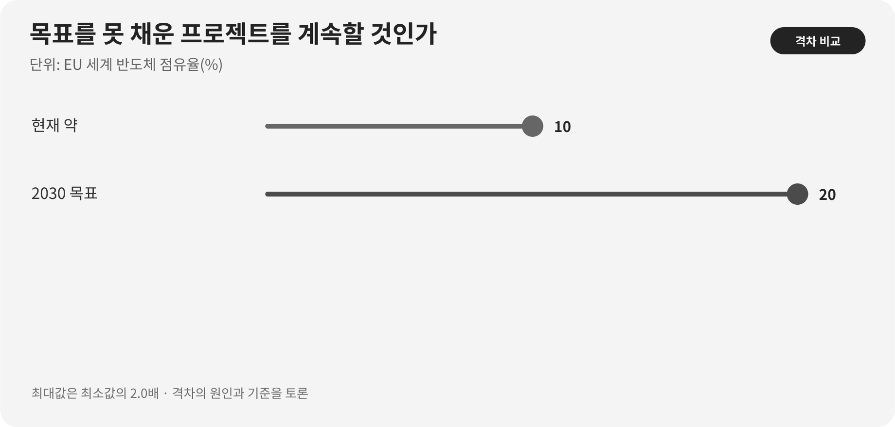

::: {.book-question}
[오늘의 책문]{.book-question-label}

{.book-question-image width=30mm fig-alt="미완성 반도체 공장과 남은 인력·특허의 길을 살피는 미니멀 수묵화"}

[생산 목표는 미달했지만 인력과 특허가 남은 국책 팹 사업은 연장해야 하는가?]{.book-question-prompt}
:::

조선의 책문^[이 장은 1507년 중종의 실제 책문 「처음과 끝이 같은 정치」를 실패한 사업의 종료와 계승 문제에 연결합니다. 책문 아카이브가 뜻을 줄여 재구성한 한문은 “善始者未必善終，何也？欲始終惟一，其道何由？”이며 원문 직역은 아닙니다. “잘 시작한 사람이 반드시 잘 끝내지 못하는 까닭은 무엇이며, 처음과 끝을 한결같이 하려면 어떤 길을 따라야 하는가”라는 물음입니다.]은 처음의 명분이 좋았다는 사실로 끝의 실패를 변명하지 못하게 합니다. 동시에 당초 숫자를 못 채웠다는 이유만으로 그 과정에서 생긴 역량까지 버리라는 뜻도 아닙니다. 신입 정책평가자는 목표 달성, 남은 역량과 추가예산의 기회비용을 분리해 연장·재설계·종료를 판단해야 합니다.

## 왜 지금 이 질문인가

EU는 세계 반도체 점유율을 약 10%에서 2030년 20%로 높이겠다는 목표를 제시했습니다. European Chips Act는 2023년 9월 21일 발효됐습니다. 2026년 유럽연합 집행위원회는 기존 정책이 공공·민간 투자 520억 유로 이상을 동원했고 직·간접 일자리 약 4.6만 개를 만들었다고 설명했습니다.

10%에서 20%로 가는 목표는 방향과 야심을 보여 주지만 결과가 아닙니다. ‘동원된 투자’는 EU 예산의 실제 지출액과 다를 수 있고, 발표·계획·착공·집행이 섞일 수 있습니다. 4.6만 개도 직접과 간접 일자리를 합친 추정치이므로 순고용, 고용기간과 직무를 확인해야 합니다.

프로젝트 단위의 평가에서는 더 좁혀야 합니다. 실제 추가 생산능력, 고객이 승인한 제품, 민간투자의 추가성, 숙련인력의 재취업, 특허의 양산 적용과 인증 협력사의 반복 수주를 봅니다. 당초 생산량만 평가하면 학습을 놓치고, 역량이라는 추상어만 평가하면 목표 미달과 매몰비용을 숨기게 됩니다.

## 데이터 렌즈

{fig-alt="EU의 세계 반도체 점유율 약 10%와 2030년 목표 20%를 비교한 그래프"}

### 근거 데이터 표

| 구분 | 원자료의 수치·범위 | 프로젝트 평가에서의 의미 |
|---:|---|---|
| 정책 기준점 | EU의 세계 반도체 점유율은 정책 설명에서 약 10%로 제시됐습니다. | 정의와 기준연도에 따라 달라질 수 있는 출발점입니다. |
| 정책 목표 | 2030년 목표는 세계 점유율 20%입니다. | 법·정책의 목표이며 달성된 생산실적이 아닙니다. |
| 시행 사실 | European Chips Act는 2023년 9월 21일 발효됐습니다. | 제도 시작일로, 개별 사업의 착공·집행·양산일과 다릅니다. |
| 집행위 설명 | 2026년까지 공공·민간 투자 520억 유로 이상을 동원했다고 발표했습니다. | ‘동원’의 정의, 중복과 실제 집행액을 확인해야 합니다. |
| 집행위 설명 | 직·간접 일자리 약 4.6만 개를 만들었다고 설명했습니다. | 추정 범위·순고용·지속기간과 직무의 질을 따로 검증해야 합니다. |

### 이 숫자를 읽는 법

점유율 20%는 분자가 EU 생산액이고 분모가 세계 생산액일 때 세계 시장 성장에 따라 필요한 생산증가가 달라집니다. 명목 매출, 생산능력 또는 출하량 중 무엇으로 계산했는지도 확인해야 합니다. 목표가 두 배라는 문장만으로 필요한 팹 수를 역산할 수 없습니다.

520억 유로 ‘동원’은 공공예산이 그만큼 지급됐다는 뜻이 아닐 수 있습니다. 민간의 기존 계획이 포함됐는지, 보조금이 없었어도 이루어질 투자였는지, 발표된 금액과 실제 집행이 얼마인지 나눠야 합니다. 4.6만 개 일자리도 공사기간의 간접고용과 장기 양산직을 같은 값으로 취급해서는 안 됩니다.

실패한 개별사업을 평가할 때는 세 장부를 만듭니다. 첫째는 생산·재무·고용의 약속 장부, 둘째는 재사용 가능한 인력·특허·협력망의 역량 장부, 셋째는 추가예산을 다른 사업에 썼을 때의 기회비용 장부입니다. 이미 쓴 돈은 연장 이유가 아니며, 앞으로 회수할 수 있는 가치만 비교합니다.

## 대립 답안

### 답안 A — 역량 보존 연장론

전략산업의 학습은 단기 생산량으로 모두 포착되지 않습니다. 숙련인력, 공정 특허와 인증 협력사가 남아 다음 라인의 실패확률과 인증기간을 줄인다면 사업을 즉시 종료하는 것은 공공투자의 지식자산을 흩어 버릴 수 있습니다.

특히 기반시설과 인력양성이 완료돼 추가예산으로 병목을 해결할 수 있다면 제한적 연장이 원안 전체를 새로 시작하는 것보다 효율적일 수 있습니다. 다만 남은 자산이 실제 후속 사업에 쓰일 주체와 계약이 있어야 합니다.

### 답안 B — 일몰·종료론

‘장기 역량’은 목표 미달을 설명하는 편리한 말이 될 수 있습니다. 생산능력과 고객이 없는 특허, 이동할 일자리가 없는 교육 인력, 주문이 없는 협력사 인증은 장부상 성과일 뿐입니다. 중단 기준이 없다면 실패한 사업이 예산과 인력을 계속 점유해 더 나은 대안을 막습니다.

이미 투입한 돈이 아깝다는 이유는 매몰비용 오류입니다. 추가예산으로 달성할 미래 성과가 다른 사업보다 작다면 종료하고 인력·특허를 별도 이전하는 편이 낫습니다.

### 답안 C — 범위를 줄인 조건부 재설계

원안을 그대로 연장하지 않고 실패 원인이 명확하며 재사용 가치가 높은 부분만 남깁니다. 생산 목표, 고객 승인, 인력·특허의 실제 이전과 민간투자 유입에 12개월 중간목표를 두고, 달성하지 못하면 자동 종료하는 일몰조건을 붙입니다.

재설계는 과거 투입액이 아니라 추가예산의 한계편익으로 평가합니다. 새 예산이 병목을 제거해 판매 가능한 생산능력을 만드는지, 다른 프로젝트에 투입할 때보다 가치가 큰지 공개합니다. 독립평가자가 원래 사업팀과 다른 자료로 성과를 검증해야 합니다.

## AI 조사 설계

### AI에게 물어볼 프롬프트

> 기준일은 2026년 8월 18일입니다. 생산 목표를 못 채운 국책 반도체 팹을 연장·재설계·종료할지 평가하는 보고서를 작성하십시오. 법령·지원약정, 최초 사업계획과 수정계획, 실제 집행·생산·고용 자료, 고객 승인, 특허·훈련·협력사 활용기록, 외부감사 순서로 조사하십시오. EU의 10% 기준점·2030년 20% 목표·520억 유로 동원·4.6만 일자리처럼 목표와 발표 수치를 실제 집행·순효과와 구분하십시오. 개별 사업에는 계획 대비 생산능력, 실제 판매, 민간투자의 추가성, 숙련인력의 재배치, 특허의 양산 적용, 협력사의 반복수주를 표로 만드십시오. 확인 사실·당사자 주장·추정·시나리오 가정을 나누고 모든 외부자료에 기관, 문서명, 발표일과 직접 URL을 붙이십시오. 추가예산의 대안비용과 12개월 일몰조건을 포함하십시오.

### 데이터 취득

| 우선순위 | 자료 | 반드시 기록할 항목 |
|---:|---|---|
| 1 | 최초 계획·지원약정 | 생산·투자·고용 목표, 일정, 변경절차, 환수·일몰과 책임주체 |
| 2 | 실제 집행·운영자료 | 지급·집행액, 장비·가동능력, 수율, 판매, 고객 승인과 지연 원인 |
| 3 | 인력·특허 자료 | 숙련직 유지·이동, 특허 등록·사용·수익, 후속 프로젝트의 재사용 |
| 4 | 협력사·민간투자 자료 | 인증 뒤 반복수주, 신규 민간자금, 보조금이 만든 추가성 |
| 5 | 대안사업 자료 | 같은 추가예산으로 가능한 생산·연구·인력성과와 전환비용 |

### 정보 판정

1. **목표와 실적:** 정책목표·발표·약정·착공·양산·판매를 단계별로 표시합니다.
2. **매몰비용 배제:** 이미 지출한 금액이 아니라 앞으로 드는 비용과 회수 가능한 편익을 비교합니다.
3. **역량 실재성:** 인력·특허·협력망이 사용될 후속 주체, 일정과 계약을 확인합니다.
4. **추가성:** 민간투자가 보조금 때문에 새로 생겼는지 기존 계획이 이동했는지 조사합니다.
5. **일몰 집행:** 중간목표 미달 시 누가 자동 종료할지 예외와 변경 권한까지 정합니다.

### 토론의 핵심

- 생산 목표 62%와 인력·특허의 잔존가치를 같은 점수로 합칠 수 있습니까?
- 추가예산 25%가 매몰비용을 살리는 돈인지 미래 병목을 푸는 돈인지 어떻게 구분합니까?
- 숙련인력 2천 명과 인증 협력사 40곳이 실제 재사용됐다는 최소 증거는 무엇입니까?
- 12개월 일몰조건을 정치적 압력에도 집행할 독립성은 어떻게 확보합니까?

## 사례형 토론

다음은 EU의 실제 사업이 아닌 **면접용 가상 상황**입니다. 당신은 산업정책 평가팀의 신입 연구원입니다. 지원 팹의 생산 목표 달성률은 62%에 그쳤지만 숙련인력 2천 명, 특허 300건과 인증 협력사 40곳이 남았습니다. 사업을 이어 가는 데 필요한 추가예산은 원안의 25%입니다. 남은 역량의 실제 재사용률과 고객의 추가구매는 아직 검증되지 않았습니다.

1. 운영팀은 생산 62%의 원인을 수요·수율·장비·인프라로 분해합니다.
2. 인력팀은 2천 명의 직무, 유지·이동과 후속 사업 배치를 확인합니다.
3. 기술팀은 특허 300건과 협력사 40곳의 양산 적용·반복수주를 검증합니다.
4. 재무팀은 추가예산 25%와 다른 사업에 쓸 때의 편익을 비교합니다.
5. 당신은 **원안 연장·12개월 재설계·종료와 자산이전** 가운데 하나를 권고합니다.

재설계를 선택하면 ‘한 번 더 기회를 주자’가 아니라 12개월 뒤 자동 종료되는 수치와 책임자를 적어야 합니다. 종료를 선택하면 인력·특허·협력사를 어디로 이전할지까지 말해야 합니다.

## 90초 발언 예시

“저는 원안 연장이 아니라 범위를 줄인 12개월 재설계를 권고하겠습니다. EU는 세계 반도체 점유율을 약 10%에서 2030년 20%로 높이는 목표를 세웠고, 집행위원회는 2026년 기존 정책이 520억 유로 이상 투자와 직·간접 일자리 약 4.6만 개를 동원했다고 설명했습니다. 목표·동원액·추정 일자리는 개별 팹의 실제 생산성과 다릅니다. 사례의 생산 달성 62%, 숙련인력 2천 명, 특허 300건, 협력사 40곳, 추가예산 25%는 모두 가정입니다. 연장론처럼 이 역량이 후속 양산의 수율과 인증기간을 개선한다면 즉시 폐쇄는 손실입니다. 그러나 ‘전략역량’이라는 말로 매몰비용을 숨길 수 있다는 종료론의 반론도 옳습니다. 따라서 추가 25%를 원안 유지에 쓰지 않고 확인된 병목과 자산이전에만 배정하겠습니다. 12개월 동안 고객 승인 생산능력, 인력의 실제 배치, 특허의 양산 사용과 협력사의 반복수주를 별도 관문으로 공개하겠습니다. 중간목표를 못 채우거나 다른 사업의 한계편익이 더 크면 자동 종료하고 자산을 이전하겠습니다. 반대로 실제 판매와 민간 추가투자가 확인되면 다음 단계만 승인하겠습니다. 권벌은 1507년 답안에서 좋은 시작을 끝까지 잇는 원칙과 실제 운용을 함께 물었습니다(의역). 그 순서만 참고해, 실패를 목표 삭제가 아니라 배운 것을 검증 가능한 다음 선택으로 바꾸는 기회로 보겠습니다.^[응시자: 권벌(權橃). 답안 요지(의역): 좋은 시작을 좋은 끝으로 잇으려면 마음의 근본을 보존하고 올바른 방도를 실제 운용해야 합니다. [국사편찬위원회 조선시대 사료 DB, 「한국고문서입문—시권」](https://db.history.go.kr/joseon/level.do?levelId=odi_002_0050_0110)은 1507년 권벌의 실제 시권·책문·답안 일부와 병과 2위, 즉 전체 12위라는 등위를 함께 공개합니다. 따라서 장원이라고 쓰지 않고 ‘응시자의 답안’으로 표기했습니다. 아카이브 개별 항목은 [「처음과 끝이 같은 정치」, 권벌 항목](https://waterfirst.github.io/Joseon-Dynasty-Civil-Service-Examination/#jungjong-1507/0)입니다.]”

## 꼬리 질문

**교차질문과 재반박**

- 생산 목표 62%가 시장수요 감소 때문이라면 기술적으로 성공한 사업이라고 볼 수 있습니까?
- 숙련인력 2천 명이 다른 기업에 취업하면 원사업의 성과와 종료 근거 중 어느 쪽입니까?
- 특허 300건의 가치가 낮아도 협력사 40곳의 인증이 남는다면 재설계하겠습니까?
- 추가예산 25%를 다른 인력사업에 쓰는 대안과 어떻게 공정하게 비교하겠습니까?
- 12개월 뒤 목표에 근소하게 미달하면 일몰조건을 그대로 집행하겠습니까?
- 정치적 목표인 점유율 20%와 개별 사업의 경제성을 분리해 보고할 수 있습니까?

## 출처

- [유럽연합 집행위원회, *European Chips Act* (2023 발효, 2026 열람)](https://digital-strategy.ec.europa.eu/en/policies/european-chips-act)
- [유럽연합 집행위원회, *Chips Act 2.0* (2026)](https://digital-strategy.ec.europa.eu/en/policies/chips-act-2)
- [유럽연합 집행위원회, *Proposal for the Chips Act 2.0* (2026)](https://digital-strategy.ec.europa.eu/en/library/proposal-chips-act-20)
- [조선시대 책문 아카이브, 「처음과 끝이 같은 정치」(중종, 1507)](https://waterfirst.github.io/Joseon-Dynasty-Civil-Service-Examination/#jungjong-1507/0)

> 데이터 기준일: 2026년 8월 18일. EU 정책·발표 수치와 사례 가정을 구분했으며, 62%·2천 명·300건·40곳·25%·12개월은 교육용 평가 조건 또는 이 장의 제안 기준입니다.
