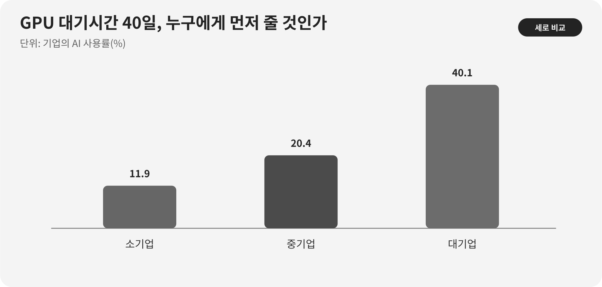

::: {.book-question}
[오늘의 책문]{.book-question-label}

{.book-question-image width=30mm fig-alt="한정된 GPU 자원을 여러 팀에 나누는 미니멀 수묵화"}

[사내 공용 GPU가 부족할 때 매출 부서와 신입 실험팀 가운데 누구에게 먼저 배정해야 하는가?]{.book-question-prompt}
:::

조선의 책문^[이 장은 1447년 세종대 기록과 연결되는 실제 책문 「인재를 어떻게 구할 것인가」를 오늘의 연산자원 배분 문제로 옮깁니다. 책문 아카이브가 뜻을 줄여 재구성한 한문은 “人才國之寶也。何以養之、辨之、用之？君臣相遇之難，其故何歟？”이며 원문 직역은 아닙니다. “인재는 나라의 보배이니 어떻게 기르고, 분별하고, 쓸 것이며 군주와 신하가 서로 만나기 어려운 까닭은 무엇인가”라는 물음입니다.]은 이미 드러난 사람을 쓰는 법만 묻지 않고 아직 드러나지 않은 능력을 어떻게 기르고 알아볼지 물었습니다. GPU 배분도 현재 매출이 큰 팀에 줄을 세우는 문제를 넘어, 새 팀이 능력을 증명할 최소 기회를 어떻게 보장할지 묻습니다.

## 왜 지금 이 질문인가

OECD가 국가 공식통계를 모아 비교한 자료에서 AI 사용률은 소기업 11.9%, 중기업 20.4%, 대기업 40.1%였습니다. 대기업의 사용률은 소기업의 약 3.4배입니다. 같은 기술이 공개돼 있어도 자금, 데이터, 인력, 교육과 실패를 복구할 시간이 다르면 실제 사용기회가 크게 달라집니다.

그러나 기업규모별 사용률을 사내 GPU 배분 비율로 바로 옮길 수는 없습니다. 이 통계는 AI를 사용하는 기업의 비율이며 작업 성과, GPU 시간 또는 투자수익률을 뜻하지 않습니다. 국가·산업 구성도 섞여 있습니다. 사내 의사결정에는 팀별 대기시간, 예약 대비 실제 사용률, 실험 재현성, 고객 마감, 데이터 준비와 산출물의 후속 활용을 수집해야 합니다.

사내에서는 계정 보유 여부와 실제 실험기회를 구분해야 합니다. 계정을 모두에게 주어도 데이터 정제, 멘토링, 검토시간과 실패 뒤 재시도 기회가 없으면 결과를 만들 조건은 같지 않습니다. 그래서 배분 규칙은 GPU 시간뿐 아니라 준비 지원과 첫 실패 뒤 재도전 경로까지 함께 다뤄야 합니다.

## 데이터 렌즈

{fig-alt="OECD 기업규모별 AI 사용률이 소기업 11.9%, 중기업 20.4%, 대기업 40.1%임을 보여 주는 그래프"}

### 근거 데이터 표

| 구분 | 원자료의 수치·범위 | 사내 배분에서의 의미 |
|---:|---|---|
| OECD 집계 | 소기업의 AI 사용률은 11.9%였습니다. | 기업 단위 사용 여부이며 소규모 팀의 GPU 수요나 능력을 직접 측정하지 않습니다. |
| OECD 집계 | 중기업의 AI 사용률은 20.4%였습니다. | 규모가 커지며 자원·기술지원 장벽을 넘기 쉬워질 가능성을 보여 줍니다. |
| OECD 집계 | 대기업의 AI 사용률은 40.1%였습니다. | 높은 사용률이 모든 도입의 성과나 효율성을 보장하지는 않습니다. |
| 원자료 계산 | 대기업 사용률은 소기업의 약 3.4배입니다. | 접근격차의 신호이며 원인이 GPU 부족 하나라는 뜻은 아닙니다. |

### 이 숫자를 읽는 법

11.9%, 20.4%, 40.1%는 기업이 AI를 사용하는지에 관한 OECD 회원국 집계입니다. 생성형 AI만의 사용률인지, 모든 AI를 포함하는지 문서의 정의를 확인해야 합니다. 기업 수를 기준으로 한 평균은 직원 수나 사용시간을 기준으로 한 평균과 다릅니다.

규모와 사용률의 상관관계만으로 인과를 확정하지 않습니다. 대기업은 GPU뿐 아니라 데이터 인프라, 법무·보안, 전담 인력과 교육이 더 많을 수 있습니다. 따라서 GPU를 나눠 주는 정책의 성과는 접속계정 수보다 대기시간 감소, 완료된 실험, 재현 가능한 결과, 현업 채택과 팀별 격차로 평가해야 합니다.

공정한 배분은 모든 팀에 같은 시간을 주는 것과도 다릅니다. 고객 시연 마감처럼 지연비용이 큰 작업에는 긴급성이 있고, 신입 실험처럼 아직 성과가 없는 작업에는 기회가 필요합니다. 긴급 고객 몫과 기본 탐색 몫을 분리하고, 사용하지 않은 예약은 빠르게 회수하며, 첫 실험을 통과한 팀에 다음 단계 자원을 주는 방식이 두 목적을 함께 다룰 수 있습니다.

## 대립 답안

### 답안 A — 매출·마감 우선론

고객 일정과 현금흐름이 분명한 팀에 먼저 배정하면 같은 GPU로 더 빠르게 사업성과를 만들 수 있습니다. 이미 데이터와 코드가 준비된 팀은 예약한 자원을 실제로 사용할 가능성도 높습니다. 희소 자원을 준비되지 않은 실험에 묶어 두는 것은 전사 기회비용을 키웁니다.

특히 납기가 가까운 시연은 한 번 놓치면 회복하기 어렵습니다. 긴급작업을 별도 대기열로 두고 예상 매출, 계약확률과 준비상태를 심사하는 것이 합리적입니다.

### 답안 B — 기회 형평론

현재 성과만으로 순위를 정하면 이미 고객·인력·데이터를 가진 팀이 계속 앞서고 신입·연구팀은 능력을 증명할 첫 실험조차 못 합니다. 단기 매출이 없는 탐색에서도 다음 제품, 실패 원인과 재사용 가능한 데이터가 생깁니다. 형평성은 시혜가 아니라 미래 선택지를 만드는 투자입니다.

성과순 배분은 측정 가능한 결과를 만드는 팀에게 유리해 기초 연구와 장기 개선을 구조적으로 밀어낼 수 있습니다. 모든 신규팀이 작은 검증을 한 번은 수행할 기본 몫과 멘토링을 받아야 합니다.

### 답안 C — 이중 풀과 단계승급

긴급 고객 풀과 기본 연구 풀을 나누고 각 풀 안에서 준비도·예상효과·대기시간을 심사합니다. 신규팀은 최소 실험기회를 보장하되 데이터·코드·평가지표를 사전 등록하게 합니다. 첫 결과가 재현되고 후속가치가 확인되면 더 큰 자원으로 승급시킵니다.

예약 대비 실제 사용률이 낮거나 산출물을 제출하지 않으면 남은 할당을 회수해 다음 팀에 넘깁니다. 긴급 고객팀도 사후에 매출·고객결과를 보고해야 하며, 반복해서 기대성과를 못 내면 우선순위를 낮춥니다. 배분규칙과 이의제기 경로를 공개해 관리자 재량이 특혜로 보이지 않게 합니다.

## AI 조사 설계

### AI에게 물어볼 프롬프트

> 기준일은 2026년 8월 18일입니다. 사내 공용 GPU가 수요보다 부족할 때 매출 부서와 신입 실험팀을 공정하게 배분하는 운영안을 설계하십시오. OECD의 기업규모별 AI 사용률은 외부 배경으로만 쓰고, 사내 스케줄러 로그·예약·실사용·대기시간, 팀별 데이터 준비, 실험계획·재현성, 고객 마감과 실제 사업성과를 수집하십시오. 개인·팀별 민감정보를 최소화하고 직급·부서 때문에 생기는 차별 가능성을 점검하십시오. ‘접근권’, ‘실사용’, ‘완료 산출물’, ‘현업 채택’을 구분하고 모든 외부 숫자에 기관·문서명·연도·단위·분모·직접 URL을 붙이십시오. 고정 쿼터, 성과순, 추첨과 심사 혼합을 비교하되 긴급 고객 풀과 기본 연구 풀, 미사용 할당 회수, 이의신청과 분기별 감사 기준을 제안하십시오.

### 데이터 취득

| 우선순위 | 자료 | 반드시 기록할 항목 |
|---:|---|---|
| 1 | GPU 스케줄러 로그 | 신청·승인·시작·종료, 대기시간, 예약 대비 사용률, 실패·중단 사유 |
| 2 | 실험 사전등록 | 데이터 준비, 코드, 예상 GPU 시간, 평가척도, 보안·개인정보 승인 |
| 3 | 산출물 저장소 | 재현 가능 여부, 모델·코드·실패기록, 후속팀의 재사용과 현업 채택 |
| 4 | 고객·사업 자료 | 마감, 계약 단계, 지연비용, 시연 결과와 실제 매출 기여 |
| 5 | 팀 속성 감사자료 | 직급·부서·근속별 대기격차, 이의신청, 예외 승인과 관리자 재량 |

### 정보 판정

1. **지표 분리:** 계정 보유, GPU 배정, 실제 사용, 완료와 사업성과를 다른 단계로 셉니다.
2. **준비도 검증:** 데이터·코드·평가척도가 준비되지 않은 긴급 신청은 그대로 우선하지 않습니다.
3. **기회 보정:** 과거 성과가 없는 신규팀에는 작은 검증을 통해 성과를 만들 기회를 줍니다.
4. **재현성 확인:** 좋은 결과뿐 아니라 실패조건·코드·로그가 재사용 가능해야 학습성과로 인정합니다.
5. **격차 감사:** 평균 대기시간뿐 아니라 팀 규모·직급별 분포와 예외 승인을 공개합니다.

### 토론의 핵심

- 고객 시연 2주와 신입팀 평균 대기 40일 가운데 어느 긴급성을 우선해야 합니까?
- GPU 수요의 60%만 처리할 때 ‘기본 연구 몫’은 어떤 원칙으로 보호합니까?
- 과거 성과가 없는 팀의 잠재력을 심사하면 평가자의 편견이 다시 들어오지 않습니까?
- 실패한 실험도 산출물로 인정하려면 어떤 기록이 재현 가능해야 합니까?

## 사례형 토론

아래 값은 OECD 통계와 별개의 **사내 배분 면접용 가정**입니다. 당신은 공용 연산자원 운영팀의 신입 사원입니다. 매출 부서는 2주 안에 고객 시연을 해야 하고, 신입 연구팀 12개는 평균 40일을 기다리고 있습니다. 현재 GPU는 전체 신청수요의 60%만 처리할 수 있습니다. 각 팀의 예약 대비 실사용률과 실패 산출물의 재사용 여부는 아직 공개되지 않았습니다.

1. 매출 부서는 고객 마감, 준비된 데이터·코드와 지연비용을 제출합니다.
2. 신입 연구팀은 작은 검증의 목표, 필요시간과 재현성 계획을 사전등록합니다.
3. 운영팀은 팀별 40일 평균 뒤에 숨은 분포와 미사용 예약을 확인합니다.
4. 당신은 **고정 쿼터·성과순·추첨과 심사 혼합** 가운데 하나를 설계합니다.
5. 운영안에는 2주 긴급경로, 기본 실험기회, 미사용 회수, 승급·강등과 이의신청을 넣습니다.

신입팀을 배려한다는 이유로 준비되지 않은 작업을 오래 점유하게 해서도 안 되고, 매출을 이유로 같은 부서가 예외를 독점하게 해서도 안 됩니다. 누구나 규칙을 예측하고 결과를 검증할 수 있어야 합니다.

## 90초 발언 예시

“저는 추첨과 심사를 섞은 이중 풀을 제안하겠습니다. OECD 집계에서 AI 사용률은 소기업 11.9%, 중기업 20.4%, 대기업 40.1%로 대기업이 소기업의 약 3.4배였습니다. 이 격차는 같은 도구를 공개해도 데이터·인력·교육과 재시도 기회가 다를 수 있음을 보여 주지만 사내 GPU 배분비율을 직접 정해 주지는 않습니다. 사례의 고객 시연 2주, 신입팀 12개, 평균 대기 40일, 처리능력 60%는 모두 가정입니다. 매출 우선론처럼 준비된 고객작업의 지연비용은 큽니다. 그러나 과거 성과순만 적용하면 신입팀은 첫 결과를 만들 기회가 없어 격차가 고착된다는 반론이 더 중요합니다. 긴급 고객 풀은 마감·준비도·예상효과를 심사하고, 기본 연구 풀은 사전등록을 통과한 신규팀에 추첨으로 첫 실험기회를 주겠습니다. 결과가 재현되고 후속가치가 확인되면 다음 단계로 승급합니다. 예약을 쓰지 않거나 산출물을 남기지 않으면 즉시 회수하고, 고객팀도 실제 시연·매출 결과를 사후 보고하게 하겠습니다. 대기시간·실사용률·재현성·부서별 예외를 분기마다 공개해 어느 풀도 특권이 되지 않게 하겠습니다. 공정한 접근은 GPU 시간을 똑같이 나누는 것이 아니라 능력을 증명할 경로를 열어 두는 것입니다.”

## 꼬리 질문

**교차질문과 재반박**

- 고객 시연 2주가 확정계약이 아니라 가능성이라면 긴급 풀에 넣겠습니까?
- 신입팀 12개 가운데 준비도를 심사할 때 부서·학력 편견을 어떻게 줄이겠습니까?
- 평균 대기 40일이 일부 장기 프로젝트 때문에 왜곡됐다면 어떤 분위수를 공개하겠습니까?
- 처리능력 60%를 늘리는 투자와 배분규칙 개선 중 무엇을 먼저 제안하겠습니까?
- 실패 실험의 로그가 후속팀에 재사용됐다면 매출성과와 같은 수준으로 보상할 수 있습니까?
- 성과가 높은 팀이 미사용 할당도 없는데 기본 연구 몫 때문에 기다려야 한다는 반론에 어떻게 답하겠습니까?

## 출처

- [OECD, *Generative AI and the SME Workforce: New Survey Evidence* (2025)](https://www.oecd.org/en/publications/generative-ai-and-the-sme-workforce_2d08b99d-en.html)
- [OECD, *Introduction: Generative AI and the SME Workforce*—기업규모별 AI 사용률 (2025)](https://www.oecd.org/en/publications/generative-ai-and-the-sme-workforce_2d08b99d-en/full-report/component-3.html)
- [조선시대 책문 아카이브, 「인재를 어떻게 구할 것인가」(세종대 기록, 2026 열람)](https://waterfirst.github.io/Joseon-Dynasty-Civil-Service-Examination/#sejong-1447-talent/0)
- [국사편찬위원회 우리역사넷, 「강희맹」(2026 열람)](https://contents.history.go.kr/mobile/kc/view.do?code=kc_age_30&levelId=kc_n300400)

> 데이터 기준일: 2026년 8월 18일. OECD 기업규모별 수치는 외부 근거이며, 2주·12개 팀·40일·60%는 사내 자원배분을 위한 교육용 가정입니다.
