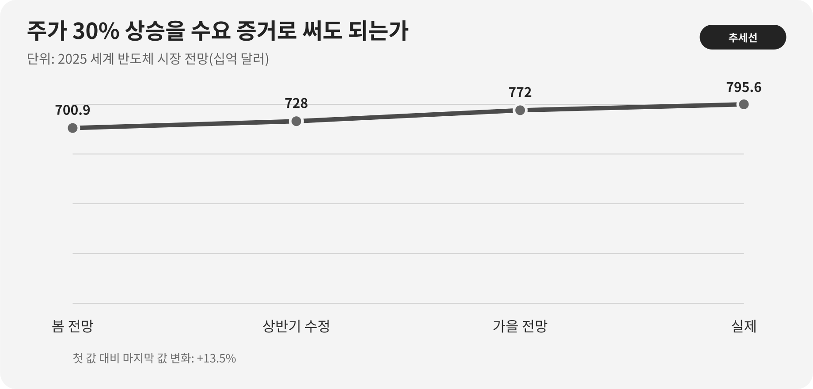

::: {.book-question}
[오늘의 책문]{.book-question-label}

{.book-question-image width=30mm fig-alt="맞물리는 표준 칩렛 두 개와 더 빠르지만 홀로 떨어진 독자 칩렛 사이에 검증용 확대경이 놓인 수묵화"}

[차세대 AI 가속기의 칩렛 연결을 UCIe 표준으로 통일할 것인가, 성능과 전력을 위해 일부 구간에 독자 인터페이스를 쓸 것인가?]{.book-question-prompt}
:::

1447년 세종의 법과 권한에 관한 책문^[이 장이 연결한 실제 책문([策問]{.hanja})은 규칙이 폐단을 낳아 다시 규칙을 세우는 순환과 책임의 자리를 물었습니다. 책문 아카이브가 뜻을 줄여 재구성한 한문은 “[法立而弊生，弊生而法又立。其所以救之者何歟？政權當歸於何所歟？]{.hanja}”이며 원문 전체의 직역은 아닙니다. “법을 세우면 폐단이 생기고 폐단이 생기면 다시 법을 세운다. 이를 구제할 방법은 무엇이며 권한은 어디에 두어야 하는가”라는 물음입니다. 오늘의 질문은 조선의 통치기구를 칩렛 규격에 대응시킨 번역이 아니라, 공동 규칙과 예외 설계가 각각 새 비용을 낳을 때 누가 검증하고 되돌릴지를 묻는 구조를 빌립니다. [조선시대 책문 아카이브 개별 항목](https://waterfirst.github.io/Joseon-Dynasty-Civil-Service-Examination/#sejong-1447/0)]은 표준을 세웠다는 사실만으로 문제가 끝나지 않는다고 보았습니다. 인터페이스 표준은 공급자를 넓히고 검증 언어를 통일할 수 있지만, 모든 패키지에서 최적 성능을 보장하지는 않습니다. 반대로 독자 링크는 특정 워크로드에 맞출 수 있지만 설계 지식과 공급망을 한곳에 묶을 수 있습니다.

## 왜 지금 이 질문인가

AI 가속기는 연산 다이, 입출력 다이, 캐시와 메모리 인터페이스를 한 패키지 안에서 조합합니다. 한 덩어리의 대형 다이보다 공정 노드와 기능을 나누기 쉽지만, 다이 사이의 대역폭·지연·전력·열·테스트를 시스템 수준에서 다시 맞춰야 합니다. 이때 UCIe는 물리층부터 프로토콜·소프트웨어 모델·적합성 시험까지 공통 기반을 제공합니다.

UCIe 컨소시엄은 2025년 8월 UCIe 3.0을 발표하며 48 GT/s와 64 GT/s를 지원하고, UCIe 2.0의 32 GT/s보다 최고 데이터율을 두 배로 높였다고 밝혔습니다. 그러나 NIST의 2024년 표준 활동 보고서는 단일 범용 표준이 아직 널리 채택됐다고 보기 어렵고, 서로 다른 회사의 칩렛을 실제로 통합한 사례도 많지 않다고 평가했습니다. 표준의 목표와 현재 생태계의 성숙도를 함께 읽어야 합니다.

신입 설계 엔지니어가 결정권자 한 사람을 대신할 수는 없습니다. 대신 어느 경계에 표준을 적용할지, 독자 링크가 얻는 성능이 검증·재설계·단일공급 위험보다 큰지, 어떤 시험에서 실패하면 표준안으로 돌아갈지를 수치로 제안할 수 있습니다.

## 데이터로 보기

{fig-alt="UCIe 2.0의 최고 데이터율 32 GT/s와 UCIe 3.0의 새 선택지 48 GT/s, 64 GT/s를 비교한 막대그래프"}

### 근거 데이터

| 근거 | 공식 자료의 수치·범위 | 설계 판단에서의 의미 |
|---:|---|---|
| 1 | UCIe 컨소시엄은 UCIe 3.0이 48 GT/s와 64 GT/s를 지원하며 UCIe 2.0의 32 GT/s보다 최고 데이터율을 두 배로 높였다고 발표했습니다. | 표준을 택해도 고속 링크 선택지가 있습니다. 다만 GT/s는 애플리케이션이 쓰는 GB/s와 같지 않습니다. |
| 2 | UCIe 3.0은 최대 100 mm의 확장 사이드밴드, 조기 펌웨어 다운로드, 우선순위 패킷, 비상 정지 알림을 추가했고 이전 버전과의 하위 호환성을 명시했습니다. | 데이터 경로뿐 아니라 초기화·관리·장애 격리까지 아키텍처 검토 범위에 넣어야 합니다. |
| 3 | UCIe 2.0은 약 10~25 μm에서 1 μm 이하까지의 범프 피치를 고려한 UCIe-3D와 다중 칩렛의 테스트·원격측정·디버그 구조를 제시했습니다. | 미세 피치 자체가 수율을 보장하지 않습니다. 본딩 공정, 열응력, known-good-die와 수리 전략이 함께 필요합니다. |
| 4 | NIST의 2024년 활동 보고서는 아직 널리 채택된 단일 범용 칩렛 표준이 없고, 다중 공급자 통합 사례가 제한적이라고 정리했습니다. | “표준 준수”와 “즉시 교체 가능한 칩렛”을 같은 말로 쓰면 생태계 성숙도를 과장합니다. |
| 5 | 미국 NAPMP는 첨단 패키징의 여섯 우선 영역과 파일럿 시설·인력 양성에 약 30억 달러를 투입한다고 밝혔습니다. | 인터페이스 외에도 기판, 공정장비, 전력·열, 광연결, 공동설계와 양산 검증이 병목이라는 뜻입니다. |
| 6 | NIST 칩렛 표준 워크숍은 패키지 조립 설계키트(PADK), 열·기계 제약, 결함 위치를 찾는 기능시험과 fail-fast 절차를 공백으로 지목했습니다. | 링크 규격 하나만 맞추는 시험계획으로는 다중 공급자 패키지의 책임 경계를 닫을 수 없습니다. |

### 이 숫자를 읽는 법

**64 GT/s는 64 GB/s가 아닙니다.** GT/s는 링크의 심벌 전송률입니다. 실제 유효 대역폭은 레인 수, 인코딩과 오류정정 오버헤드, 프로토콜 효율, 양방향 구성, 패키지 배선과 열 제한에 따라 달라집니다. 따라서 차트는 규격의 속도 선택지를 보여줄 뿐 특정 제품의 처리량을 예측하지 않습니다.

10~25 μm와 1 μm 이하는 UCIe-3D가 고려하는 범프 피치 범위이지 어느 공급자가 그 피치에서 원하는 수율을 냈다는 실적이 아닙니다. 최대 100 mm 사이드밴드도 주 데이터 경로의 도달거리와 혼동하면 안 됩니다. 약 30억 달러는 정책 프로그램의 규모이며 우리 프로젝트의 수익률이나 납기를 증명하지 않습니다.

표준안과 독자안을 비교할 때에는 최소한 다음 지표를 같은 워크로드·같은 패키지 조건에서 측정해야 합니다.

- 유효 대역폭과 왕복 지연의 평균뿐 아니라 꼬리값
- 전송 에너지, 링크 전력, 패키지 온도와 스로틀링 시간
- PHY·프로토콜·DFx 요구사항 추적률과 오류주입 통과율
- known-good-die 선별률, 조립 수율, 첫 실리콘 재설계 확률
- IP·파운드리·OSAT 교체에 필요한 주수와 다시 해야 할 인증 범위

## 대립 답안

### 답안 A — 표준 우선

모든 공급자 경계를 UCIe 3.0으로 통일하면 PHY와 프로토콜의 공통 요구사항, 적합성 시험, 관리·디버그 절차를 재사용할 수 있습니다. 두 번째 IP 공급자나 다른 칩렛을 검토할 때도 협상 기준이 생깁니다. 첫 제품의 최고 성능보다 후속 제품군의 교체 가능성과 검증 자산을 중시한다면 표준 우선이 합리적입니다.

다만 규격 호환은 패키지 호환의 필요조건일 뿐 충분조건이 아닙니다. 서로 다른 범프맵, 전력망, 열설계, 펌웨어와 오류처리 정책을 맞추지 못하면 표준 PHY를 썼어도 통합은 실패합니다. 표준 블록의 면적과 프로토콜 오버헤드가 특정 데이터 경로의 전력 한계를 넘을 수도 있습니다.

### 답안 B — 독자 최적화

워크로드가 고정되고 동일 회사가 양쪽 다이와 패키지를 함께 설계한다면 독자 링크는 불필요한 기능을 덜어낼 수 있습니다. 짧은 배선과 전용 흐름제어에 맞춰 레인·버퍼·전압을 조정하면 성능과 전력에서 이익을 얻을 가능성이 있습니다. 제품 출시 시점에 표준 IP의 검증이 늦는 경우 기존 사내 링크가 일정 위험을 줄일 수도 있습니다.

그 대가는 시스템 검증과 공급망에 돌아옵니다. 한 공급자의 PHY, 패키지 공정과 도구에 묶이면 결함 원인을 다이·링크·조립 가운데 어디에 배분할지 합의하기 어렵습니다. 다음 세대나 외부 칩렛으로 바꿀 때 기존 검증 자산을 잃을 수도 있습니다. “더 빠르다”는 시뮬레이션만으로는 이 비용을 상쇄하지 못합니다.

### 답안 C — 경계별 조건부 혼합

외부 공급자와 맞닿는 경계, 관리·디버그 경로는 UCIe로 고정하고, 같은 책임조직이 양쪽 다이를 통제하는 성능 병목 한 곳만 독자 링크 후보로 둡니다. 독자안은 실제 워크로드 이득, 전력·열 여유, 오류격리, 재설계 일정과 대체경로를 함께 통과할 때만 채택합니다.

혼합안은 표준과 독자의 단점을 자동으로 없애지 않습니다. 인터페이스 종류가 늘어 검증 행렬과 장애 대응이 복잡해질 수 있습니다. 따라서 “어디까지가 교체 가능한 표준 경계인지”와 “어느 시험에서 독자 구간을 포기할지”를 아키텍처 동결 전에 문서로 닫아야 합니다.

## AI 조사 설계

### AI에게 물어볼 프롬프트

> 차세대 AI 가속기의 칩렛 연결을 UCIe 3.0으로 통일하는 안, 독자 인터페이스를 쓰는 안, 공급자 경계만 UCIe로 두는 혼합안을 비교하십시오. UCIe 컨소시엄 규격·보도자료, NIST 표준 보고서·CHIPS R&D 자료, 실제 IP 공급자의 데이터시트와 우리 측 시뮬레이션·검증 로그를 구분하십시오. 각 주장마다 기관, 문서명, 버전·발표일, 절·페이지, 단위, 직접 URL을 적으십시오. 32·48·64 GT/s를 GB/s로 변환할 때 레인 수와 오버헤드를 임의로 가정하지 마십시오. 규격상 지원, 공급자 주장, 독립 실측, 내부 가정을 별도 열에 놓으십시오. 상호운용성은 PHY 적합성, 프로토콜, 패키지·PADK, 열·전력, 초기화·펌웨어, 오류격리, 공급자 교체로 나누십시오. 마지막에는 세 안을 가르는 사전 시험, 실패 임계값, 표준안으로 돌아갈 마지막 시점을 제시하십시오.

### 데이터 취득

| 순서 | 자료 | 반드시 확보할 항목 |
|---:|---|---|
| 1 | UCIe 규격·공식 발표 | 버전, 데이터율, 패키지 유형, 사이드밴드, DFx, 하위 호환, 적합성 조항 |
| 2 | NIST·CHIPS 표준 자료 | 다중 공급자 통합의 공백, PADK, 열·기계, 시험·수리, 공급망 쟁점 |
| 3 | PHY·패키지 공급자 자료 | 지원 공정·범프 피치, PPA 조건, BER 시험조건, IP 변경·지원 기간 |
| 4 | 내부 설계 자료 | 워크로드별 유효 대역폭·지연, 링크 전력, 온도, 면적, 일정, 검증 항목 수 |
| 5 | 조립·시험 로그 | known-good-die, 본딩 수율, 오류주입, 결함 격리시간, 재작업 가능성 |

### 정보 판정

1. **규격과 구현을 분리합니다.** 규격이 허용하는 최대치와 특정 IP가 특정 공정에서 달성한 값을 구분합니다.
2. **단위를 복원합니다.** GT/s, Gb/s, GB/s, TB/s와 단방향·양방향, 레인당·패키지 전체를 섞지 않습니다.
3. **시험조건을 맞춥니다.** 동일 워크로드, 전압, 온도, 패키지 배선과 오류율에서 비교하지 않은 PPA는 순위를 매기지 않습니다.
4. **상호운용성의 범위를 적습니다.** PHY 적합성만 통과했는지, 펌웨어·DFx·패키지·열까지 공동 검증했는지 표시합니다.
5. **가정을 의사결정 문턱으로 바꿉니다.** 독자안의 이득과 재설계 비용을 범위로 제시하고, 범위를 벗어나면 선택을 바꾸게 합니다.

### 토론의 핵심

- 표준이 줄이는 것은 어느 검증비용이며, 우리 패키지에 남는 비표준 문제는 무엇입니까?
- 독자 링크의 이득은 링크 벤치마크가 아니라 최종 AI 워크로드에서도 남습니까?
- 공급자 교체 가능성을 이름의 개수보다 실제 재검증 주수로 어떻게 측정합니까?
- 신입 엔지니어가 중단을 요청할 수 있는 시험과 최종 승인권자는 누구입니까?

## 사례형 토론

당신은 여섯 개 칩렛을 묶는 AI 추론 가속기 프로젝트의 신입 die-to-die 설계 엔지니어입니다. 제품 출시까지 14개월, 패키지 전력 상한은 700 W, 링크 전력 예산은 70 W입니다. 아래 수치는 모두 토론용 내부 가정이며 공급자 보증이나 실측 양산값이 아닙니다.

- **전면 UCIe안:** UCIe 3.0의 64 GT/s PHY를 사용합니다. 세 대표 워크로드에서 목표 성능의 96%, 링크 전력 68 W, 통합 12개월, 검증 요구사항 900개로 추정됩니다. 대체 PHY를 붙이는 데 10주가 걸립니다.
- **전면 독자안:** 내부 80 GT/s 목표 링크입니다. 목표 성능의 104%, 링크 전력 56 W, 통합 10개월로 추정되지만 검증 요구사항은 1,350개이고 PHY 공급원은 하나입니다. 대체 설계에는 24주가 필요합니다.
- **혼합안:** 외부 I/O·관리 경계는 UCIe, 두 연산 칩렛 사이 병목만 독자 링크로 둡니다. 목표 성능의 100%, 링크 전력 62 W, 통합 11개월, 검증 요구사항 1,100개로 추정됩니다. 독자 구간은 단일공급입니다.
- 첫 실리콘 재설계 예산은 한 번뿐이며, 아키텍처 동결까지 8주가 남았습니다.

당신은 각 안의 시뮬레이션 조건을 맞추고, 패키지·검증·구매 엔지니어와 함께 설계검토안을 내야 합니다. 선택지는 **전면 UCIe, 전면 독자, 경계별 혼합**입니다. 최종안에는 채택 구간, 8주 안에 끝낼 검증, 단일공급 완화책, 독자안을 포기할 수치 조건을 포함하십시오.

## 90초 발언 예시

“저는 **답안 C, 외부 공급자 경계는 UCIe 3.0으로 고정하고 병목 한 곳만 독자 링크로 남기는 혼합안**을 선택하겠습니다. UCIe 3.0은 48·64 GT/s를 지원해 2.0의 최고 32 GT/s보다 규격상 데이터율을 두 배로 높였지만, NIST는 다중 공급자 통합 사례가 제한적이라고 봅니다. 표준이라는 이름만으로 상호 운용성을 보장할 수 없다는 뜻입니다. 사례에서 독자안은 성능 104%와 링크 전력 56 W로 가장 좋지만 검증 요구사항 1,350개와 대체 기간 24주가 필요하다는 가정입니다. 독자 최적화가 성능과 전력을 지킨다는 반론을 인정해 8주 동안 같은 워크로드와 패키지 조건으로 비교하겠습니다. 독자 구간이 성능을 5% 이상 높이거나 전력을 10 W 이상 줄이고 오류 주입·초기화·열 시험을 통과할 때만 유지하겠습니다. 하나라도 실패하거나 일정이 2주 이상 늦어지면 전면 UCIe안으로 돌아가겠습니다. 시험 로그와 포기 사유는 다음 세대 설계에도 재사용하도록 남기겠습니다. 최고 속도보다 공급자 교체 가능성과 검증 책임을 보존하는 것이 선택 기준입니다.”

## 꼬리 질문

- 64 GT/s를 실제 유효 대역폭으로 바꾸려면 어떤 정보가 더 필요합니까?
- UCIe 적합성 시험을 통과했는데도 다중 공급자 패키지가 실패할 수 있는 세 가지 원인은 무엇입니까?
- 독자 링크의 성능 이득이 4%이고 전력 절감이 12 W라면 어떤 기준을 우선하겠습니까?
- 단일 PHY 공급자가 24주 대체기간을 12주로 줄이겠다고 약속하면 무엇으로 검증하겠습니까?
- 첫 실리콘에서 간헐적 오류가 나오면 다이·패키지·프로토콜 책임을 어떤 로그로 나누겠습니까?
- 다음 세대에서 외부 칩렛을 추가할 가능성이 커지면 오늘의 혼합안을 언제 전면 표준안으로 바꾸겠습니까?

## 출처

- [UCIe Consortium, *UCIe 3.0 Specification With 64 GT/s Performance and Enhanced Manageability* (2025)](https://www.uciexpress.org/_files/ugd/8dc731_ae67289d0ec646cdba5c1aee245538b3.pdf)
- [UCIe Consortium, *Specifications* — UCIe 1.0~3.0 개요 (2026 열람)](https://www.uciexpress.org/specifications)
- [UCIe Consortium, *UCIe 2.0 Specification: Continuing Innovation to Drive an Open Chiplet Ecosystem* (2024)](https://www.uciexpress.org/_files/ugd/0c1418_b6481ec611e24c6e91f1beb743b0c860.pdf)
- [NIST, *Semiconductors and Microelectronics Standards Working Group Annual Report for 2024*, NIST IR 8577 (2025)](https://nvlpubs.nist.gov/nistpubs/ir/2025/NIST.IR.8577.pdf)
- [NIST CHIPS R&D, *Chiplets Interfaces & Digital Twin Technical Standards Workshops Summary Report* (2024)](https://www.nist.gov/system/files/documents/2024/11/22/Technical%20Standards%20Workshop%20Summary%20Report-DEC2023-Final-508C.pdf)
- [NIST, *National Advanced Packaging Manufacturing Program Announcement* (2023)](https://www.nist.gov/speech-testimony/national-advanced-packaging-manufacturing-program-announcement-morgan-state)
- [NIST, *Nanoscale Mechanical Characterization for Hybrid-Bonding-Ready Structures in Advanced Packaging* (2026)](https://www.nist.gov/news-events/news/2026/01/nanoscale-mechanical-characterization-hybrid-bonding-ready-structures)
- [조선시대 책문 아카이브, 세종 1447년 「법의 폐단과 권력의 자리」 개별 항목](https://waterfirst.github.io/Joseon-Dynasty-Civil-Service-Examination/#sejong-1447/0)
- [국사편찬위원회 우리역사넷, 「성삼문」](https://contents.history.go.kr/mobile/kc/view.do?code=kc_age_30&levelId=kc_n305300)

> **자료 메모:** 차트의 32·48·64 GT/s는 UCIe 컨소시엄이 발표한 규격상 데이터율입니다. NIST의 상호운용성 평가는 2024년 활동을 정리한 2025년 보고서입니다. 사례의 80 GT/s, 성능·전력·일정·검증 항목·온도·전환 기준은 모두 토론용 가정이며 실제 회사나 제품 수치가 아닙니다.
