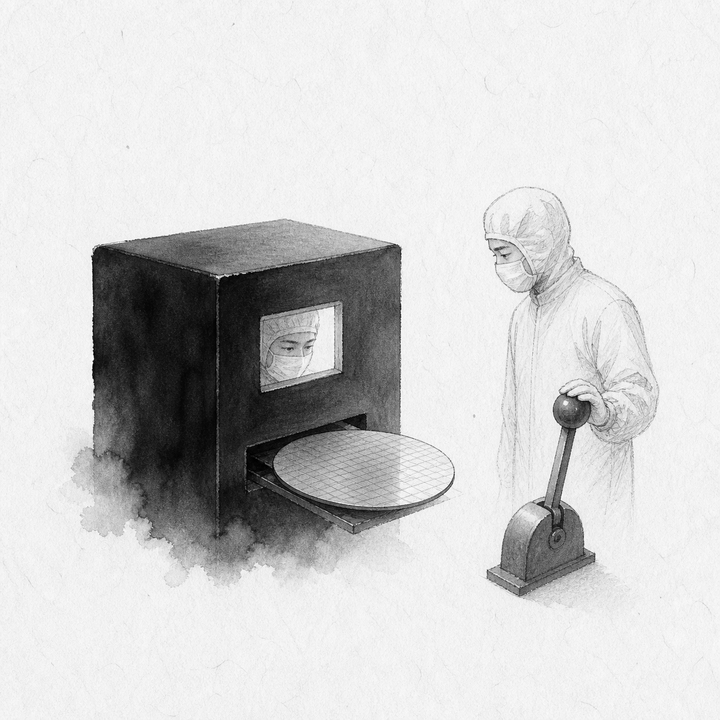
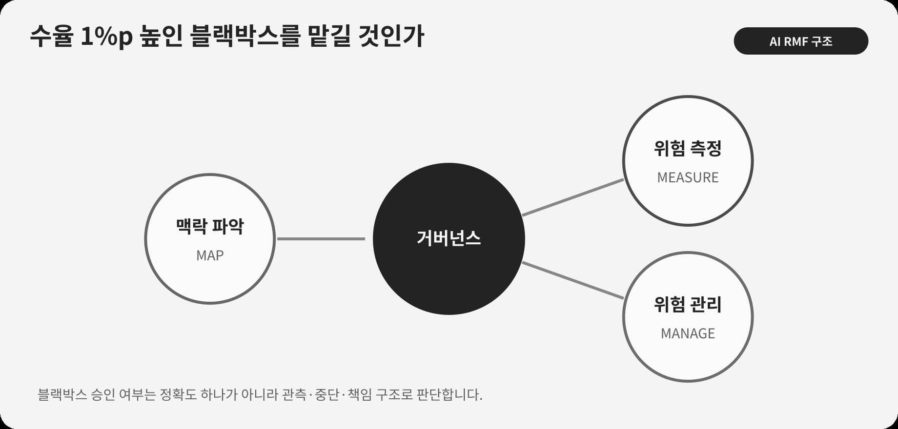

::: {.book-question}
[오늘의 책문]{.book-question-label}

{.book-question-image width=30mm fig-alt="검은 먹점과 공정 제어선 사이에 놓인 반도체 웨이퍼 수묵화 상징"}

[수율을 1%p 높였지만 이유를 설명하지 못하는 AI에 공정 자동운전을 맡겨도 되는가?]{.book-question-prompt}
:::

조선의 책문^[1558년 명종의 「하늘의 이치와 인간의 정치」에서 이 장과 연결되는 원문은 “天道難知亦難言也。日月麗乎天，一晝一夜，有遲有速者，孰使之然歟？”입니다. 보이는 규칙이 있어도 그 원인을 안다고 성급히 말할 수 있는지를 묻습니다. 이것은 공정 AI에 관한 당시의 질문이 아니라, 현상·원인·책임을 구분하는 현대적 연결입니다. [개별 책문과 해설](https://waterfirst.github.io/Joseon-Dynasty-Civil-Service-Examination/#myeongjong-1558/0), [한국학중앙연구원 실록위키 「천도책」](https://dh.aks.ac.kr/sillokwiki/index.php/%EC%B2%9C%EB%8F%84%EC%B1%85%28%E5%A4%A9%E9%81%93%E7%AD%96%29)]은 알기 어려운 이치를 말로만 단정하지 말라고 경계합니다. 공정 AI도 평균 수율을 높였다는 결과와 낯선 제품에서 안전하게 작동한다는 보장을 나누어 보아야 합니다.

## 왜 지금 이 질문인가

반도체 공정은 수백 개 변수와 장비 상태가 얽혀 있어 사람이 모든 상호작용을 설명하기 어렵습니다. AI가 레시피 보정과 이상 탐지를 더 잘할 수 있지만, 제품 전환·센서 교체·장비 정비 뒤 데이터 분포가 바뀌면 어제의 최적화가 오늘의 결함을 만들 수 있습니다. 신입 검증 엔지니어는 ‘설명 가능’이라는 추상어보다 어떤 조건에서 멈추고 누구에게 넘길지를 설계해야 합니다.

NIST AI 위험관리 프레임워크는 GOVERN·MAP·MEASURE·MANAGE 네 기능으로 위험관리를 구성하며, GOVERN을 다른 기능을 관통하는 층으로 둡니다. 저자의 『AI 시대, 인간은 무엇으로 남는가』 7장 「에이전트의 제어실」도 승인 버튼 하나보다 독립된 관측경로, 실행 로그, 정지 레버가 중요하다고 설명합니다. 공정 자동운전의 핵심은 사람이 화면 앞에 앉아 있다는 문구가 아니라, 사람이 실제로 이상을 보고 되돌릴 수 있는 구조입니다.

## 데이터 렌즈

{fig-alt="공정 AI를 GOVERN, MAP, MEASURE, MANAGE의 순환으로 검증하는 판단 구조"}

### 근거 데이터 표

| 근거 | 원자료의 범위 | 현업 의미 |
|---:|---|---|
| 1 | NIST AI RMF 1.0은 위험관리 핵심을 GOVERN·MAP·MEASURE·MANAGE 네 기능으로 구성합니다. | 수율 한 지표만으로 배포를 결정하지 않고 역할·맥락·측정·대응을 함께 봅니다. |
| 2 | GOVERN은 MAP·MEASURE·MANAGE 전 과정에 스며드는 교차 기능입니다. | 자동운전 책임자, 변경 승인, 중단권과 기록 보존을 모델 성능과 함께 정해야 합니다. |
| 3 | NIST는 2026년 중요 인프라에서 신뢰 가능한 AI를 위한 AI RMF 프로파일 개념문서를 공개했습니다. | 공정 AI도 실험실 정확도만이 아니라 설비 가용성·안전·공급망의 전체 수명주기로 다뤄야 합니다. |

### 이 숫자를 읽는 법

이 장의 공공 근거는 하나의 ‘안전 점수’를 주지 않습니다. 네 기능은 순서대로 한 번 체크하고 끝내는 인증표가 아니라 반복 구조입니다. GOVERN이 있다고 해서 위험이 사라지는 것도 아니며, MEASURE가 평균 수율만 뜻하는 것도 아닙니다. 제품별 오탐·미탐, 작업자 개입률, 드리프트 탐지시간과 이전 레시피로 복귀하는 시간을 함께 측정해야 합니다.

따라서 사례의 수율 1%p 개선과 오탐률은 검증 조건이지 산업 평균이 아닙니다. 퍼센트와 퍼센트포인트도 구분합니다. 오탐률이 2%에서 6%가 되면 4%p 상승이며 세 배가 된 것입니다.

## 대립 답안

### 답안 A — 적극론

완전한 인과 설명을 기다리면 복잡한 공정에서 검증된 개선 기회를 잃을 수 있습니다. 독립된 오프라인 시험과 제한된 파일럿에서 사람보다 안정적이라면, 위험이 낮고 복구 가능한 제품군부터 자동운전을 허용할 수 있습니다. 설명의 빈틈은 범위 제한과 실시간 감시로 보완합니다.

### 답안 B — 경계론

평균 수율 1%p 개선은 제품 전환 뒤 오탐 증가나 드문 대형 손실을 가릴 수 있습니다. 원인을 모르면 장비 정비와 레시피 변경에서 실패를 재현하기 어렵고, 책임을 모델 뒤로 숨기기 쉽습니다. 원인 진단과 안전 복귀가 검증되기 전에는 추천만 받고 실행은 사람이 해야 합니다.

### 답안 C — 조건부론

자동운전 여부를 ‘설명 가능/불가능’ 두 칸으로 나누지 않습니다. 제품군별 허용범위, 이중 관측, 작업자 중단권, 드리프트 경보, 이전 레시피 복귀시간을 정합니다. 오탐·미탐 또는 복구시간이 임계값을 넘으면 추천 모드로 즉시 낮추고 독립 검증 뒤에만 재가동합니다.

## AI 조사 설계

### AI에게 물어볼 프롬프트

> NIST AI RMF 1.0과 2026년 중요 인프라 프로파일 개념문서를 기준으로 반도체 공정 자동운전 검증안을 만드십시오. GOVERN·MAP·MEASURE·MANAGE별로 책임자, 필요한 데이터, 시험, 중단 조건, 증빙 로그를 표로 작성하십시오. 평균 수율과 함께 제품별 오탐·미탐, 작업자 개입률, 분포 변화 탐지시간, 안전 복귀시간을 요구하십시오. 모델 개발팀의 주장과 독립 검증 결과를 분리하고, 출처는 NIST 문서명·연도·절·직접 URL로 제시하십시오. AI가 알 수 없는 장비 고장모드와 데이터 공백도 별도 열에 쓰십시오.

### 데이터 취득

| 순서 | 자료 | 확인 항목 |
|---:|---|---|
| 1 | NIST AI RMF 원문과 플레이북 | 기능별 정의, 수명주기, 독립 검토, 위험 우선순위 |
| 2 | 공정 이력과 모델 버전 | 제품·장비·레시피·센서 버전, 학습기간, 배포시점 |
| 3 | 섀도 운전과 제한 파일럿 | 사람 결정 대비 차이, 오탐·미탐, 수율, 개입 사유 |
| 4 | 장애·복구 로그 | 탐지시각, 중단시각, 이전 레시피 복귀, 손실 웨이퍼 |

### 정보 판정

1. 학습에 쓴 로트와 시험 로트를 분리하고 제품 전환 구간을 별도 평가합니다.
2. 평균 개선이 특정 제품의 손실을 가리는지 제품별 분포를 봅니다.
3. 모델 추천과 실제 장비 명령을 연결한 실행 로그가 완전한지 확인합니다.
4. 작업자가 불이익 없이 중단할 수 있는지 실제 모의훈련으로 검증합니다.
5. 재가동 승인은 개발팀이 아닌 공정·품질·안전의 공동 서명으로 남깁니다.

### 토론의 핵심

- 설명이 부족해도 허용할 수 있는 공정의 피해 범위와 복구 가능성은 어디까지입니까?
- 평균 수율과 최악 제품군의 오탐 중 어느 지표에 중단 우선권을 줍니까?
- 사람이 ‘루프 안’에 있다는 것을 버튼이 아니라 어떤 로그와 시간으로 증명합니까?

## 사례형 토론

당신은 공정 AI 검증팀의 신입 엔지니어입니다. 제한 파일럿에서 평균 수율은 1%p 올랐지만 제품 전환 뒤 오탐은 2%에서 6%로 증가했습니다. 이상 감지 후 사람이 개입하기까지 평균 18분, 이전 레시피 복귀에는 25분이 걸립니다. **이 절의 모든 수치는 토론용 가상 조건이며 실제 팹 성과가 아닙니다.**

1. 자동운전 유지, 기존 제품군만 허용, 전면 중단 가운데 하나를 권고합니다.
2. 새 제품은 추천 모드로 낮추고 원인별 오탐을 재분류할지 결정합니다.
3. 중단 임계값과 재가동에 필요한 연속 검증 로트 수를 제시합니다.
4. 작업자·개발자·공정책임자 가운데 누가 정지와 재가동 권한을 갖는지 정합니다.
5. 수율 이익보다 큰 안전·품질 손실이 발생했을 때 이전 모델로 돌아갈 절차를 씁니다.

## 90초 발언 예시

“저는 AI를 전면 중단하기보다 기존 제품군에만 자동운전을 허용하고 새 제품은 추천 모드로 낮추겠습니다. NIST AI RMF는 GOVERN·MAP·MEASURE·MANAGE 네 기능을 요구하며, GOVERN은 나머지 전 과정을 관통합니다. 수율 1%p 개선만 측정하고 중단권과 복구를 정하지 않으면 MEASURE만 일부 한 것입니다. 적극론처럼 복잡한 공정에서 완전한 설명을 기다릴 필요는 없습니다. 그러나 제품 전환 뒤 오탐이 2%에서 6%로 세 배가 됐다는 반론은 평균 수율보다 중요합니다. 저는 작업자에게 즉시 정지권을 주고, 개입 18분과 복귀 25분을 줄이는 시험을 먼저 하겠습니다. 새 제품에서 오탐이 2% 수준으로 돌아오고 드리프트 경보와 복귀훈련이 독립 검증을 통과하면 자동운전을 확대하겠습니다. 반대로 오탐이 다시 6%에 접근하거나 복구시간이 늘면 기존 제품도 수동 모드로 전환하겠습니다. 사람이 루프 안에 있다는 말은 승인 도장보다 보고·중단·복구가 실제로 작동한 로그로 증명해야 합니다.”

## 꼬리 질문

- 수율 1%p 개선과 오탐 4%p 증가를 같은 비용 단위로 어떻게 비교하겠습니까?
- 제품 전환 뒤에만 성능이 나빠진다면 학습데이터에서 무엇을 먼저 점검합니까?
- 모델이 설명을 잘하지만 성능이 낮다면 더 안전하다고 볼 수 있습니까?
- 작업자가 중단 버튼을 누르지 못하게 만드는 조직적 압력은 어떻게 측정합니까?
- 독립 검증팀도 같은 데이터에 의존한다면 독립성이 충분합니까?
- 어떤 조건이 충족되면 조건부론에서 전면 자동운전으로 전환하겠습니까?

## 출처

- [U.S. National Institute of Standards and Technology, *Artificial Intelligence Risk Management Framework (AI RMF 1.0)* (2023)](https://nvlpubs.nist.gov/nistpubs/ai/nist.ai.100-1.pdf)
- [NIST AI Resource Center, *AI RMF Core* (2023, 2026 열람)](https://airc.nist.gov/airmf-resources/airmf/5-sec-core/)
- [NIST, *Concept Note: AI RMF Profile on Trustworthy AI in Critical Infrastructure* (2026)](https://www.nist.gov/programs-projects/concept-note-ai-rmf-profile-trustworthy-ai-critical-infrastructure)
- [최낙초, 『AI 시대, 인간은 무엇으로 남는가』 7장 「에이전트의 제어실」](https://waterfirst.quarto.pub/ai-era-humanity/chapters/chapter07.html)
- [조선시대 책문 아카이브, 명종 「하늘의 이치와 인간의 정치」 개별 항목](https://waterfirst.github.io/Joseon-Dynasty-Civil-Service-Examination/#myeongjong-1558/0)

> 데이터 기준일: 2026년 8월 18일. NIST의 네 기능은 공공 문서의 근거이며, 수율·오탐·개입·복귀 수치는 사례를 위해 만든 가정입니다.
