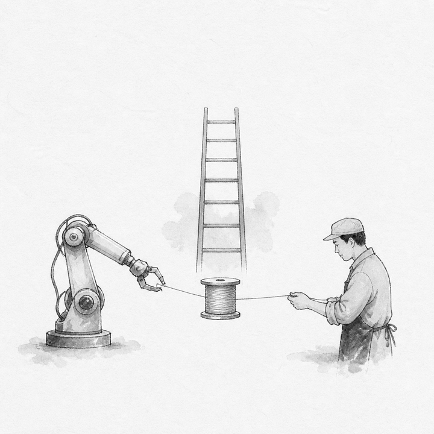
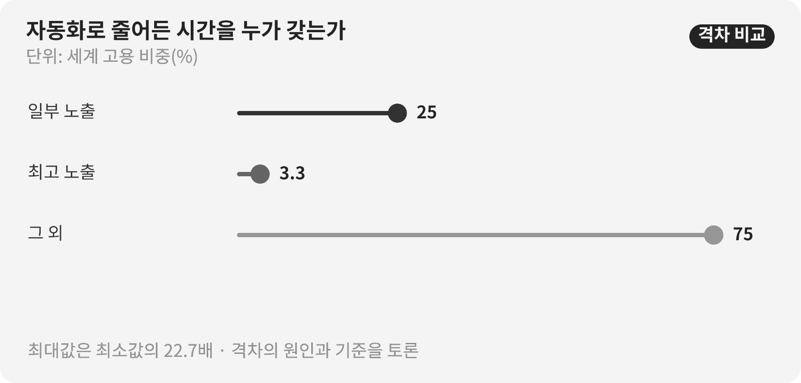

::: {.book-question}
[오늘의 책문]{.book-question-label}

{.book-question-image width=30mm fig-alt="사람의 손과 자동화 톱니 사이로 흐르는 시간을 그린 미니멀 수묵화"}

[AI로 생산성이 20% 높아졌다면 줄어든 노동시간과 이익을 회사·팀·직원이 어떻게 나눠야 하는가?]{.book-question-prompt}
:::

조선의 책문^[명종대의 「교육은 어디로 가야 하는가」에서 이 장과 맞닿는 원문은 “敎所以成材也。其本末次第與作人之方何如？”입니다. “교육은 재목을 이루는 것이니, 그 근본과 말단의 차례와 사람을 만드는 방법은 어떠해야 하는가?”라는 물음입니다. 자동화나 기업 배분을 직접 묻는 원문은 아니며, 일을 덜 하게 된 사람을 다음 역할의 인재로 기르는 문제와 연결한 해석입니다. [개별 책문과 해설](https://waterfirst.github.io/Joseon-Dynasty-Civil-Service-Examination/#myeongjong-1558-education/0)]은 교육을 지식 전달이 아니라 사람과 역할을 만드는 일로 봅니다. 자동화의 성과도 남은 인력을 줄이는 데서 끝나는지, 새로운 숙련을 만드는지로 판정해야 합니다.

## 왜 지금 이 질문인가

ILO는 세계 노동자 네 명 중 한 명이 생성형 AI에 어느 정도 노출된 직업에 있다고 추정합니다. 그러나 노출은 해고율이 아닙니다. 과업 일부가 바뀔 가능성을 직업 전체가 사라지는 수치로 읽으면 자동화 투자도 인력계획도 왜곡됩니다. 회사는 설비와 모델에 자본을 댔고, 직원은 공정 데이터·예외처리·현장 숙련을 제공했습니다. 생산성 이익의 원천이 함께라면 배분 원칙도 사후 협상이 아니라 도입 전에 정해야 합니다.

ILO가 전면 대체보다 직무 변형 가능성을 더 크게 보는 만큼, 신입사원의 현업 질문도 “AI가 일자리를 없애는가”보다 구체적이어야 합니다. 자동화로 절약된 시간을 누가 소유하며, 다음 직무로 옮기는 유급 학습시간과 현장 멘토링을 누가 부담할지 도입 전에 정해야 합니다.

## 데이터 렌즈

{fig-alt="세계 고용에서 생성형 AI에 일부 노출된 직업 25%, 최고 노출 범주 3.3%, 그 외 75%를 비교한 도표"}

### 근거 데이터 표

| 근거 | 원자료의 수치·범위 | 토론에서의 의미 |
|---:|---|---|
| 1 | ILO는 세계 노동자의 25%, 곧 네 명 중 한 명이 생성형 AI에 어느 정도 노출된 직업에 있다고 추정했습니다. | 과업 변화의 범위가 넓으므로 직무별 전환계획이 필요합니다. |
| 2 | 가장 높은 노출 범주는 세계 고용의 3.3%입니다. | ‘노출된 25%가 모두 대체된다’는 해석은 범주를 섞은 오류입니다. |
| 3 | ILO는 전면 대체보다 직무 변형 가능성이 더 크다고 판단했습니다. | 성과지표를 감원 수가 아니라 과업 변화·임금·시간·재배치로 넓혀야 합니다. |

### 이 숫자를 읽는 법

25%는 생성형 AI가 할 수 있는 과업이 포함된 직업의 비중이지, 사라질 일자리의 비중이 아닙니다. 3.3%도 실제 해고율이 아니라 가장 높은 노출 범주의 고용 비중입니다. 국가·성별·직업구조에 따라 노출도 달라집니다. 이 수치를 회사의 인원 감축률로 곧장 옮길 수 없습니다.

회사 내부에서는 자동화 전후 같은 제품·같은 품질 기준의 노동시간, 오류, 재작업, 산출량을 비교합니다. 절감시간을 초과근무 감소로 돌렸는지, 인원 감축으로만 흡수했는지, 유급교육 뒤 실제 배치와 임금이 유지됐는지도 함께 봅니다.

## 대립 답안

### 답안 A — 재투자 우선론

기업이 개발비와 실패위험을 부담했으므로 생산성 이익의 상당 부분을 설비 고도화와 연구개발에 재투자해야 합니다. 이익을 즉시 모두 시간 단축과 성과급으로 나누면 다음 자동화 투자가 줄 수 있습니다. 장기 고용을 지키는 재투자도 직원에게 돌아가는 몫입니다.

### 답안 B — 노동 환원론

AI는 현장 직원이 남긴 데이터와 예외처리 지식으로 작동합니다. 인원을 줄이고 업무량만 높이면서 생산성 이익을 회사가 독점하면 신뢰와 숙련전수가 무너집니다. 확인된 순이익의 일부는 노동시간 단축, 성과급, 유급 재교육으로 돌려야 합니다.

### 답안 C — 사전 배분공식론

자동화 전에 배분 공식을 합의합니다. 품질과 안전을 유지한 순생산성 이익만 계산하고, 재투자·팀 보상·유급교육·시간 단축의 몫을 나눕니다. 재교육 뒤 배치율과 이탈률이 기준에 미달하면 추가 감원 대신 교육과 직무설계를 먼저 고칩니다.

## AI 조사 설계

### AI에게 물어볼 프롬프트

> ILO의 2025년 *Generative AI and Jobs: A Refined Global Index of Occupational Exposure*를 원문으로 확인하고 노출, 최고 노출, 대체, 직무 변형의 정의를 구분하십시오. 반도체 생산 직무의 자동화 전후 과업 목록을 만들되 산출량·품질·재작업·노동시간·임금·인원·유급교육시간·재배치율을 같은 기간과 제품군으로 비교하십시오. 기업 투자비와 직원의 데이터·숙련 기여를 구분한 생산성 이익 배분표를 제시하고, 확인된 사실·회사 가정·노동자 의견·분석자의 추론을 별도 열에 쓰십시오. 모든 수치에 단위·기간·직무 범위·직접 URL을 붙이십시오.

### 데이터 취득

| 순서 | 자료 | 확인 항목 |
|---:|---|---|
| 1 | ILO 원문과 방법론 | 노출의 정의, 직업·과업 단위, 최고 노출, 해석 한계 |
| 2 | 공정 MES·품질 기록 | 같은 제품의 시간당 산출량, 불량, 재작업, 정지시간 |
| 3 | 인사·급여·근무기록 | 직무별 인원, 임금, 초과근무, 이탈, 재배치 |
| 4 | 교육·배치 기록 | 유급 여부, 교육시간, 수료가 아닌 실제 배치와 유지 |

### 정보 판정

1. 생산량 증가에서 제품 믹스와 수요 증가 효과를 제거합니다.
2. 생산성 20%가 인당·시간당·설비당 가운데 무엇인지 분모를 고정합니다.
3. 교육 수료율 대신 배치율, 배치 뒤 임금과 고용유지를 확인합니다.
4. 오류와 안전사고가 늘었다면 그 비용을 생산성 이익에서 차감합니다.
5. 직원 의견은 평균만 내지 말고 직무·교대·근속별 분포를 봅니다.

### 토론의 핵심

- 자동화 투자비 회수와 직원의 데이터·숙련 기여를 어떤 기준으로 나눕니까?
- 줄어든 시간이 새 업무로 채워졌다면 생산성 이익을 직원에게 돌려줬다고 할 수 있습니까?
- 재교육의 성과는 수료, 배치, 임금 유지 가운데 무엇으로 판정합니까?

## 사례형 토론

당신은 생산혁신팀 신입 사원입니다. 자동화 뒤 시간당 생산성은 20% 올랐지만 한 직무의 인원은 30% 줄었고 재교육 뒤 다른 직무에 배치된 비율은 55%입니다. 회사는 다음 1년의 순생산성 이익을 설비 재투자, 성과급, 주 4시간 단축, 유급교육에 배분해야 합니다. **모든 수치는 토론용 가상 조건이며 실제 회사 자료가 아닙니다.**

1. 품질·재작업·감가상각을 뺀 순이익부터 다시 계산하도록 요청합니다.
2. 네 항목의 배분 비율과 그 이유를 제안합니다.
3. 인원 30% 감축을 유지할지, 재교육 기간 동안 추가 감축을 멈출지 결정합니다.
4. 배치율 55%를 높일 직무·멘토·유급시간 조치를 정합니다.
5. 6개월 뒤 배분 공식을 다시 여는 전환 조건을 씁니다.

## 90초 발언 예시

“저는 **답안 C, 생산성 이익을 회사와 직원이 사전에 정한 기준으로 나누겠습니다.** ILO는 세계 노동자의 25%가 생성형 AI에 어느 정도 노출된 직업에 있지만 최고 노출 범주는 3.3%이며, 전면 대체보다 직무 변형 가능성이 크다고 봅니다. 노출률을 곧 감원률로 읽어서는 안 됩니다. 사례의 생산성 20% 향상, 인원 30% 감소와 재교육 뒤 배치율 55%는 모두 가정입니다. 기업이 투자비를 회수해야 다음 자동화를 할 수 있다는 반론은 인정합니다. 다만 현장 데이터와 숙련의 기여를 배분에서 빼면 다음 전환이 실패합니다. 품질·재작업 비용을 뺀 순이익을 설비 재투자 40%, 유급 교육 25%, 성과급 20%, 주 4시간 단축 15%로 나누겠습니다. 이 비율도 토론용입니다. 배치율이 70%에 못 미치면 추가 감원을 멈추고 교육 몫을 늘리겠습니다. 반대로 배치와 임금 유지가 확인되면 재투자 비중을 높이겠습니다. 그 기준은 분기마다 공개하겠습니다. 자동화의 성공은 줄인 인원이 아니라 더 안전하고 숙련된 역할로 옮긴 비율로 판단해야 합니다.”

## 꼬리 질문

- 생산성 20%가 시간당인지 인당인지에 따라 배분안은 어떻게 달라집니까?
- 자동화 개발비를 회수하기 전에도 성과급을 지급해야 합니까?
- 주 4시간 단축 뒤 업무강도가 높아지면 시간 환원이 맞습니까?
- 재교육 배치율 55%의 실패 책임을 직원과 회사가 어떻게 나눕니까?
- 신입의 반복업무를 자동화했다면 숙련 사다리를 무엇으로 대체하겠습니까?
- 어떤 조건에서 직원 배분을 줄이고 설비 재투자를 늘리겠습니까?

## 출처

- [International Labour Organization, *Generative AI and Jobs: A Refined Global Index of Occupational Exposure*, Working Paper 140 (2025)](https://www.ilo.org/publications/generative-ai-and-jobs-refined-global-index-occupational-exposure)
- [International Labour Organization, *Generative AI and jobs: A 2025 update* (2025)](https://www.ilo.org/publications/generative-ai-and-jobs-2025-update)
- [조선시대 책문 아카이브, 명종대 「교육은 어디로 가야 하는가」 개별 항목](https://waterfirst.github.io/Joseon-Dynasty-Civil-Service-Examination/#myeongjong-1558-education/0)

> **자료 메모:** 25%와 3.3%는 ILO의 직업 노출 추정치이며, 생산성·감원·배치·배분 비율은 가상 사례의 조건 또는 제안값입니다.
