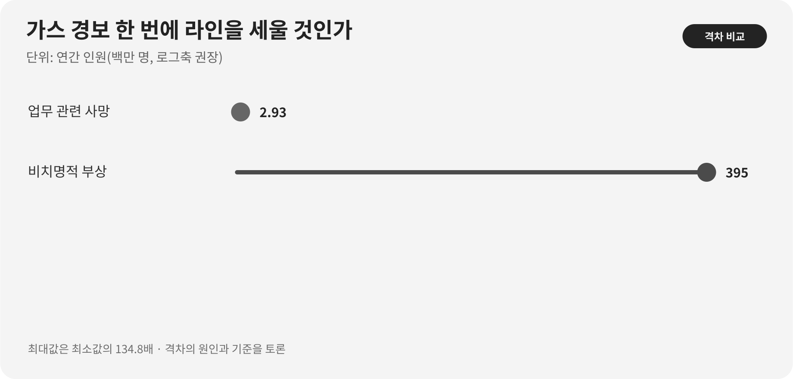

::: {.book-question}
[오늘의 책문]{.book-question-label}

{.book-question-image width=30mm fig-alt="가느다란 가스 흔적과 멈춤 표식을 담은 반도체 팹 미니멀 수묵화"}

[납기가 이틀 늦어져도 확증이 없는 가스 누출 경보만으로 신입 엔지니어가 라인 중단을 요청해야 하는가?]{.book-question-prompt}
:::

조선의 책문^[1611년 광해군의 「임진왜란 뒤 가장 시급한 일」에서 이 장과 이어지는 원문은 “今之國事，何者最急？用人、賦役、田政、戶籍，孰先孰後？”입니다. “지금 국사에서 무엇이 가장 시급한가. 인재 등용·부역·토지행정·호적 가운데 무엇을 먼저 하고 뒤에 할 것인가?”를 묻습니다. 가스 경보에 관한 옛 문장을 현대어로 옮긴 것이 아니라, 여러 손실 앞에서 되돌릴 수 없는 위험을 먼저 가려내는 판단과 연결한 것입니다. [개별 책문과 해설](https://waterfirst.github.io/Joseon-Dynasty-Civil-Service-Examination/#gwanghae-1611/0), [한국학중앙연구원 1611년 시험 기록](https://dh.aks.ac.kr/~sonamu5/wiki/index.php/%EA%B4%91%ED%95%B4%28%E5%85%89%E6%B5%B7%29_3%EB%85%84%281611%29_%EC%8B%A0%ED%95%B4%28%E8%BE%9B%E4%BA%A5%29_%EB%B3%84%EC%8B%9C%28%E5%88%A5%E8%A9%A6%29)]은 우선순위를 말하려면 피해의 성격과 회복 가능성을 함께 따져야 함을 보여줍니다. 팹에서는 납기 지연은 회복할 수 있어도 유해가스 노출로 잃은 생명과 건강은 되돌리기 어렵습니다.

## 왜 지금 이 질문인가

반도체 팹은 독성·가연성·부식성 물질을 사용하면서도 장시간 연속 가동합니다. 경보 하나마다 전면정지하면 오탐 비용과 경보 피로가 커지지만, 확인을 기다리다 실제 누출을 놓치면 대피시간을 잃습니다. 특히 신입은 생산손실을 과장해 느끼고 자신의 센서 해석을 과소평가하기 쉽습니다. 그래서 용기만 요구하기보다 정지 단계와 보고선을 미리 정해야 합니다.

ILO는 업무 관련 요인으로 매년 293만 명이 사망하고 비치명적 업무상 부상이 3억9,500만 건에 이른다고 추정합니다. 세계 총량은 예방의 중요성을 보여줄 뿐, 특정 팹의 단일 경보가 실제 누출인지 알려주지는 않습니다. 현업 판단에는 물질 독성, 농도, 경보 지속시간, 이중센서 일치, 환기와 대피시간, 최근 센서 고장이 필요합니다.

## 데이터 렌즈

{fig-alt="연간 업무 관련 사망 2.93백만 명과 비치명적 업무상 부상 395백만 건을 비교한 안전 데이터"}

### 근거 데이터 표

| 근거 | 원자료의 수치·범위 | 팹 안전 판단에서의 의미 |
|---:|---|---|
| 1 | ILO는 업무 관련 사고와 질병으로 매년 293만 명이 사망한다고 추정합니다. | 안전 손실은 평균 납기비용만으로 환산하기 어려운 비가역 피해를 포함합니다. |
| 2 | 비치명적 업무상 부상은 연 3억9,500만 건으로 추정됩니다. | 사망만 집계하면 치료·휴업·장기 건강피해를 놓칩니다. |
| 3 | ILO 자료에서 전 세계 업무 관련 사망의 약 63%가 아시아·태평양에서 발생합니다. | 인력 규모와 산업구조가 다른 지역 총량을 한 공장의 위험확률로 사용해서는 안 됩니다. |

### 이 숫자를 읽는 법

293만 명은 업무 관련 **사고와 질병**을 합친 세계 추정치이며, 단일 연도의 팹 가스사고 건수가 아닙니다. 3억9,500만 건은 사람 수와 동일하지 않을 수 있는 부상 건수입니다. 63%도 아시아 공장이 본질적으로 더 위험하다는 인과 증거가 아니라 노동인구와 산업분포가 반영된 지역 비중입니다.

이 숫자는 “모든 경보에 전면정지하라”는 명령이 아니라, 미탐의 피해를 의사결정표에서 빼지 말라는 배경입니다. 현장 기준은 가스별 허용농도, 센서 신뢰도, 경보 일치, 대피 가능시간, 부분 격리의 효과로 따로 정합니다.

## 대립 답안

### 답안 A — 적극론

유해가스는 한 번의 미탐이 회복 불가능한 피해를 만들 수 있으므로 신입의 단일 경보라도 먼저 안전 상태로 전환해야 합니다. 중단 뒤 독립 측정으로 오탐을 확인하는 비용은 실제 노출을 놓치는 비용보다 제한적입니다. 작업중지 요청자에게 불이익을 주지 않아야 경보가 살아 있습니다.

### 답안 B — 경계론

센서 오탐이 반복되는 공정에서 단일 짧은 경보마다 전체 라인을 멈추면 납기와 장비 안정성이 손상되고 직원이 경보를 무시하게 될 수 있습니다. 물질의 위험도와 인접 센서, 환기 상태를 반영한 부분정지와 재측정 절차가 필요합니다.

### 답안 C — 조건부론

독성·농도·지속시간·이중센서 일치를 기준으로 단계별 자동조치를 정합니다. 치명도가 높거나 대피 여유가 짧으면 단일 경보도 즉시 전면정지하고, 국소화가 가능한 경보는 구역 격리와 대피 후 독립 측정합니다. 생산부서가 아닌 안전책임자가 재가동을 승인합니다.

## AI 조사 설계

### AI에게 물어볼 프롬프트

> ILO의 산업안전 원자료와 사업장의 승인된 가스안전 절차를 분리해 검토하십시오. 세계 업무 관련 사망·비치명적 부상·아시아태평양 비중은 발표기관, 기준연도, 추정 범위, 단위, 직접 URL을 기록하십시오. 이어 해당 가스의 물질안전보건자료, 센서 교정기록, 최근 경보·오탐 이력, 환기구역, 대피시간, 장비 안전정지 절차를 표로 만드십시오. AI가 정지 여부를 단독 결정하지 않게 하고, 법정 기준과 회사 내부 기준을 구분하십시오. 확정 사실, 센서 관측, 작업자 진술, 추론을 별도 열에 쓰며 누락된 정보는 ‘미확인’으로 남기십시오.

### 데이터 취득

| 순서 | 자료 | 확인할 내용 |
|---:|---|---|
| 1 | 사업장 비상대응 절차와 물질안전보건자료 | 물질별 위험, 자동정지 기준, 대피·응급조치 |
| 2 | 센서 원시로그와 교정기록 | 시각, 농도, 지속시간, 인접 센서, 교정 만료 |
| 3 | 설비·환기 도면과 작업자 위치 | 격리 가능한 구역, 기류, 대피경로, 잔류 인원 |
| 4 | 경보·정지·재가동 이력 | 오탐 원인, 중단시간, 승인자, 재발 여부 |

### 정보 판정

1. 경보가 통신 오류인지 실제 센서 측정인지 원시로그로 구분합니다.
2. 인접 센서가 정상이어도 기류와 검출한계 때문에 배제 증거가 되는지 따집니다.
3. 미탐 피해와 오탐 비용을 같게 두지 않고 심각성과 가역성을 반영합니다.
4. 정지 요청 뒤 인사 불이익이나 보고 지연이 있었는지 기록합니다.
5. 재가동은 원인 제거, 독립 측정, 안전책임자 승인 세 조건을 모두 확인합니다.

### 토론의 핵심

- 단일 센서라도 즉시 전면정지해야 하는 물질·농도·대피 조건은 무엇입니까?
- 최근 오탐이 많다는 사실이 이번 경보를 무시할 근거가 될 수 있습니까?
- 생산부서와 안전부서의 판단이 다를 때 최종 재가동권은 누구에게 있어야 합니까?

## 사례형 토론

당신은 야간조 신입 공정 엔지니어입니다. 센서 한 대가 12초 동안 가스 기준을 초과했고 인접 센서는 정상입니다. 최근 한 달 동안 같은 센서에서 오탐이 두 번 있었으며 전면정지는 고객 납기를 이틀 늦춥니다. 해당 구역에는 작업자 세 명이 있습니다. **이 절의 시간·인원·납기 수치는 토론을 위해 만든 가상 조건입니다.**

1. 즉시 구역 대피와 부분정지, 전면정지, 가동 중 재측정 가운데 하나를 선택합니다.
2. 인접 센서 정상값이 결론을 바꾸는 조건을 설명합니다.
3. 안전팀·시설팀·생산책임자에게 보고할 순서와 시간을 정합니다.
4. 휴대형 독립 검출과 센서 교정 뒤 누가 재가동을 승인할지 정합니다.
5. 오탐이 확인돼도 경보를 낸 신입에게 불이익이 없도록 기록 항목을 제안합니다.

## 90초 발언 예시

“저는 즉시 해당 구역을 대피시키고 부분정지한 뒤, 물질의 독성과 확산 범위가 확인되지 않으면 전면정지로 확대하겠습니다. ILO는 업무 관련 사고와 질병으로 매년 293만 명이 사망하고 비치명적 부상도 3억9,500만 건에 이른다고 추정합니다. 이 세계 통계가 이번 12초 경보가 참임을 증명하지는 않지만, 미탐 피해를 납기 이틀과 같은 선에 놓을 수 없다는 배경은 됩니다. 경계론처럼 최근 오탐 두 번과 인접 센서 정상값을 무시해서도 안 됩니다. 임숙영이 권력자에게 불편한 원인을 가장 시급한 문제로 지목했듯(의역), 저는 납기 압력보다 먼저 되돌릴 수 없는 안전 위험을 보고하겠습니다.^[1611년 별시 응시자 임숙영(任叔英)의 대책 요지를 현대적으로 의역한 것입니다. 그는 왕비와 외척 유희분 일파의 정사 개입과 전횡을 가장 시급한 병으로 지목했습니다. 장원 답안이 아니며 방목상 문과 13등입니다. [조선시대 책문 아카이브 개별 항목(2026 열람)](https://waterfirst.github.io/Joseon-Dynasty-Civil-Service-Examination/#gwanghae-1611/0), [한국학중앙연구원 실록위키 「궁류」(2026 열람)](https://dh.aks.ac.kr/sillokwiki/index.php/%EA%B6%81%EB%A5%98%28%E5%AE%AE%E6%9F%B3%29), [한국학중앙연구원 1611년 별시 기록(2026 열람)](https://dh.aks.ac.kr/~sonamu5/wiki/index.php/%EA%B4%91%ED%95%B4%28%E5%85%89%E6%B5%B7%29_3%EB%85%84%281611%29_%EC%8B%A0%ED%95%B4%28%E8%BE%9B%E4%BA%A5%29_%EB%B3%84%EC%8B%9C%28%E5%88%A5%E8%A9%A6%29)] 그래서 전면정지를 자동 결론으로 두지 않고 구역 격리, 작업자 세 명 대피, 휴대형 검출, 센서 교정을 동시에 시작하겠습니다. 독립 측정에서 누출이 확인되거나 대피 여유가 짧은 가스라면 즉시 전면정지하겠습니다. 반대로 두 독립 측정이 정상이고 센서 결함 원인이 확인되면 안전책임자 승인 아래 재가동하겠습니다. 생산책임자가 단독 승인하지 못하게 하고, 경보 요청자에게 불이익이 없도록 결정 로그를 남기겠습니다.”

## 꼬리 질문

- 세계 사망 통계가 이번 센서 경보의 진실성을 증명하지 못하는 이유는 무엇입니까?
- 인접 센서가 정상이어도 누출을 배제할 수 없는 조건은 무엇입니까?
- 부분정지가 오히려 대피를 방해하는 설비라면 결론을 어떻게 바꾸겠습니까?
- 오탐이 반복될 때 경보 임계값을 높이는 것과 센서를 교체하는 것 중 무엇이 우선입니까?
- 정지 요청자 보호가 실제로 작동하는지 어떤 지표로 확인하겠습니까?
- 어떤 증거가 나오면 부분정지에서 즉시 전면정지로 전환하겠습니까?

## 출처

- [International Labour Organization, *Safety and health at work* (2023, 2026 열람)](https://www.ilo.org/topics-and-sectors/safety-and-health-work)
- [International Labour Organization, *Nearly 3 million people die of work-related accidents and diseases* (2023)](https://www.ilo.org/resource/news/nearly-3-million-people-die-work-related-accidents-and-diseases)
- [International Labour Organization, *Safety and health at work in Asia and the Pacific* (2022)](https://www.ilo.org/resource/safety-and-health-work-asia-and-pacific-0)
- [조선시대 책문 아카이브, 광해군 「임진왜란 뒤 가장 시급한 일」 개별 항목](https://waterfirst.github.io/Joseon-Dynasty-Civil-Service-Examination/#gwanghae-1611/0)
- [한국학중앙연구원, 1611년 시험 기록](https://dh.aks.ac.kr/~sonamu5/wiki/index.php/%EA%B4%91%ED%95%B4%28%E5%85%89%E6%B5%B7%29_3%EB%85%84%281611%29_%EC%8B%A0%ED%95%B4%28%E8%BE%9B%E4%BA%A5%29_%EB%B3%84%EC%8B%9C%28%E5%88%A5%E8%A9%A6%29)

> 데이터 기준일: 2026년 8월 18일. ILO 수치는 세계 추정치이며, 12초·오탐 두 번·납기 이틀·작업자 세 명은 사례 가정입니다.
