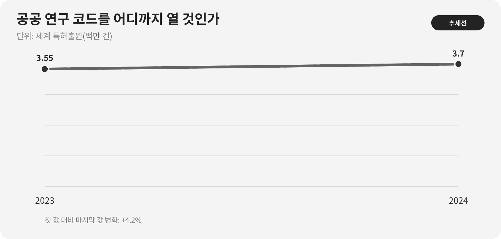

::: {.book-question}
[오늘의 책문]{.book-question-label}

{.book-question-image width=30mm fig-alt="열린 두루마리와 잠긴 공정 코드를 대비한 미니멀 수묵화"}

[정부 연구비로 만든 공정 소프트웨어를 회사가 독점하려 할 때 어느 범위까지 공개해야 하는가?]{.book-question-prompt}
:::

조선의 책문^[명종대 「교육은 어디로 가야 하는가」의 관련 원문은 “敎所以成材也。其本末次第與作人之方何如？”입니다. 교육이 인재를 이루는 방법과 순서를 묻는 문장입니다. 공공 연구 코드의 면허를 직접 다룬 사료는 아니며, 공적 지식이 다음 사람의 역량을 만드는 기반이어야 한다는 점에서 연결합니다. [개별 책문과 해설](https://waterfirst.github.io/Joseon-Dynasty-Civil-Service-Examination/#myeongjong-1558-education/0)]은 지식을 소유하는 것보다 사람을 길러 실제로 쓰이게 하는 일을 묻습니다. 공공 연구 성과도 공개 자체와 제품화 자체 가운데 하나만 고르는 문제가 아닙니다. 누가 검증하고 배우고 후속 제품을 만들 수 있는지 설계해야 합니다.

## 왜 지금 이 질문인가

공정 소프트웨어는 알고리즘만으로 제품이 되지 않습니다. 장비 인터페이스, 검증 데이터, 현장 튜닝, 보안, 고객지원에 추가 투자가 필요합니다. 기업에 일정 기간 독점권을 주면 제품화 유인이 생기지만, 공공재원으로 만든 기반도구까지 잠기면 대학·중소기업·후속 연구자가 같은 출발비용을 다시 냅니다. 신입 산학협력 담당자는 ‘오픈소스가 선하다’거나 ‘특허가 혁신을 만든다’는 구호 대신 자금과 기여물을 모듈별로 나눠야 합니다.

세계 특허출원은 2023년 355만 건에서 2024년 370만 건으로 늘었습니다. 그러나 출원 수는 코드의 품질, 라이선스 접근성, 실제 제품화와 같지 않습니다. WIPO의 기술이전 안내는 라이선스 범위를 목적·지역·기술에 따라 좁히거나 넓힐 수 있고, 대학과 기업 사이에서 독점·비독점·소프트웨어 라이선스 같은 여러 계약형태를 쓸 수 있다고 설명합니다. 공개 여부를 판정할 때는 공공비용 비중, 기업의 추가개발비, 연구 재현성, 중소기업 접근가격, 보안과 영업비밀, 독점기간 뒤 공개 조건을 함께 봅니다.

## 데이터로 보기

{fig-alt="세계 특허출원이 2023년 3.55백만 건에서 2024년 3.7백만 건으로 늘어난 비교 그래프"}

### 근거 데이터 표

| 근거 | 원자료의 수치·범위 | 라이선스 판단에서의 의미 |
|---:|---|---|
| 1 | WIPO 집계에서 세계 특허출원은 2023년 355만 건에서 2024년 370만 건으로 증가했습니다. | 권리 신청이 늘어도 공공 코드의 접근성과 재사용이 늘었다고 단정할 수 없습니다. |
| 2 | 2024년 증가율은 4.9%로 2018년 이후 가장 빨랐습니다. | 성장률은 출원 활동의 속도이며 발명의 품질이나 상용화 성공률이 아닙니다. |
| 3 | 2024년 세계 특허출원의 약 70%가 아시아 특허청에 접수됐습니다. | 접수 지역 비중은 연구 성과의 국적·가치·공개 수준과 동일하지 않습니다. |
| 4 | WIPO는 기술 라이선스의 이용 목적·지역·기술 범위를 달리 정할 수 있고 독점·비독점 등 여러 계약형태가 있다고 안내합니다. | 전체 코드를 한 조건으로 묶기보다 모듈별 권리·기여·제품화 의무를 계약에 적어야 합니다. |

### 이 숫자를 읽는 법

특허출원 ‘건수’는 등록특허 수가 아니며, 한 제품이나 한 발명과 일대일로 대응하지 않습니다. 70%는 출원인이 모두 아시아인이라는 뜻이 아니라 아시아 소재 특허청에 접수된 비중입니다. 4.9% 증가도 공공연구를 독점해야 혁신이 늘어난다는 인과 근거가 아닙니다.

따라서 이 숫자는 지식재산 활동이 크다는 배경으로만 씁니다. 개별 프로젝트에서는 기초 코드, API·파일 형식, 검증 데이터, 장비별 튜닝, 고객 레시피를 분리하고 각 부분의 개발비·보안위험·대체 가능성을 평가해야 합니다.

## 대립 답안

### 답안 A — 적극론

제품화에는 연구비 밖의 검증·보안·지원 비용이 들기 때문에 일정 기간 독점 라이선스가 필요합니다. 제조 노하우까지 즉시 공개하면 경쟁사가 후속 비용 없이 복제해 투자 유인이 약해질 수 있습니다. 성과와 투자 의무를 붙인 독점은 공공성과 양립할 수 있습니다.

### 답안 B — 경계론

납세자가 부담한 기반 코드와 검증 데이터를 한 기업이 장기간 잠그면 중소기업과 교육, 오류 재현이 막힙니다. 제품화 약속을 지키지 않아도 독점권이 유지되면 공공 위험을 사적 권리로 바꾸는 결과가 됩니다. 최소한의 상호운용 규격과 연구용 접근은 열어야 합니다.

### 답안 C — 조건부론

기초 인터페이스·교육용 코드·비식별 검증 데이터는 공개하고 기업이 추가한 장비 튜닝과 고객 레시피는 기간 제한 라이선스로 보호합니다. 독점권에는 투자·출시·지원 목표, 중소기업의 합리적 가격, 연구용 예외와 성과 미달 시 권리 회수를 붙입니다.

## AI 조사 설계

### AI에게 물어볼 프롬프트

> 정부와 기업이 공동 부담한 반도체 공정 소프트웨어의 라이선스안을 조사하십시오. 협약서의 지식재산 조항, 정부 연구개발 성과관리 규정, 대학 규정, 기업의 추가개발 원가를 원문 순서로 확인하십시오. 코드 저장소를 기초 알고리즘·인터페이스·검증 데이터·장비 튜닝·고객 레시피로 나누고 각 항목의 자금 출처, 저작자, 특허·영업비밀, 보안위험, 재현 필요성을 표로 작성하십시오. 공개·비독점·기간 독점의 대안을 만들고 성과 미달 시 회수, 연구용 예외, 중소기업 가격 조건을 넣으십시오. 법적 결론은 관할 전문 검토가 필요하다고 표시하고 기관·문서·연도·직접 URL을 제시하십시오.

### 데이터 취득

| 순서 | 자료 | 확인 항목 |
|---:|---|---|
| 1 | 연구협약·과제 공고·성과규정 | 자금 출처, 성과 귀속, 공개 의무, 보안 예외 |
| 2 | 버전관리·기여 기록 | 모듈별 저자, 개발시점, 외부 라이브러리 면허 |
| 3 | 비용·제품화 계획 | 공공비용, 기업 추가비용, 검증·지원·보안 비용 |
| 4 | 이용자 수요 | 대학 재현, 중소기업 제품화, 표준 상호운용 요구 |

### 정보 판정

1. 특허출원, 저작권, 영업비밀과 계약상 독점을 서로 다른 권리로 구분합니다.
2. 총개발비 비율만으로 모든 모듈의 소유권을 같은 비율로 나누지 않습니다.
3. 공개가 재현 가능한 문서·테스트·데이터까지 포함하는지 확인합니다.
4. 독점기간 동안 실제 투자·출시·지원 목표를 달성했는지 해마다 검토합니다.
5. AI가 제안한 면허 충돌은 원문과 전문 법률 검토로 다시 확인합니다.

### 토론의 핵심

- 공공비용 비중과 공개 범위는 비례해야 합니까, 모듈의 기능에 따라 달라야 합니까?
- 기업이 제품화 위험을 부담했다는 사실을 어떤 지출과 성과로 증명합니까?
- 독점이 필요하더라도 연구 재현성과 중소기업의 첫 접근권을 어떻게 보장합니까?

## 사례형 토론

당신은 산학협력팀 신입 사원입니다. 총 개발비의 70%는 정부, 30%는 회사가 부담했습니다. 회사는 전체 코드의 10년 독점을 요구하고 대학 연구팀은 핵심 코드와 검증 데이터를 즉시 공개하라고 합니다. 회사가 추가로 부담할 제품화 비용은 아직 승인되지 않았습니다. **비율·기간·비용 상태는 토론을 위한 가상 조건입니다.**

1. 공개, 비독점 라이선스, 기간 독점으로 나눌 모듈을 정합니다.
2. 독점기간과 단계별 공개시점을 제안합니다.
3. 중소기업·교육·비영리 연구의 가격 또는 무상 조건을 정합니다.
4. 회사의 제품화 투자·출시가 미달할 때 권리를 회수할 기준을 씁니다.
5. 보안상 공개하지 않을 데이터와 그 판단권자를 지정합니다.

## 90초 발언 예시

“저는 전체 코드의 10년 독점과 즉시 전면공개 모두 반대하고 모듈별 조건부 라이선스를 제안하겠습니다. WIPO에 따르면 세계 특허출원은 2023년 355만 건에서 2024년 370만 건으로 늘었고 증가율은 4.9%였습니다. 그러나 출원 수가 지식의 접근성이나 제품화 성공을 뜻하지는 않습니다. 사례에서는 공공비용이 70%이므로 기초 인터페이스, 교육용 코드, 비식별 검증 데이터는 공개해야 합니다. 적극론의 반론처럼 회사가 장비 튜닝과 고객지원 비용을 부담할 유인도 필요합니다. 그래서 회사가 새로 만든 제조 노하우에는 우선 3년 독점을 주고 투자·출시 목표를 해마다 검토하겠습니다. 3년은 이 가상 사례의 제안값입니다. 대학에는 재현 목적 접근을, 중소기업에는 매출 규모에 따른 비독점 가격을 보장하겠습니다. 회사가 승인된 제품화 투자와 출시 목표를 지키면 제한적으로 연장하고, 미달하면 독점권을 회수하겠습니다. 자금 비율만으로 코드를 자르지 않고 공공 기반과 기업 추가기여를 기능별로 나누는 것이 제품화와 확산을 함께 지키는 길입니다.”

## 꼬리 질문

- 공공비용 70%라면 코드 70%를 공개한다는 계산이 왜 부적절합니까?
- 검증 데이터에 고객 영업비밀이 섞여 있으면 재현성을 어떻게 보장합니까?
- 기업이 독점 없이 투자하지 않겠다고 할 때 무엇을 증빙으로 요구하겠습니까?
- 중소기업 라이선스 가격이 ‘합리적’인지 어떤 기준으로 판정합니까?
- 공개 코드의 보안 취약점이 발견되면 공개 원칙을 바꿔야 합니까?
- 어떤 성과가 나오면 독점기간을 연장하고, 어떤 미달이면 회수하겠습니까?

## 출처

- [World Intellectual Property Organization, *World Intellectual Property Indicators 2025: Patents Highlights* (2025)](https://www.wipo.int/web-publications/world-intellectual-property-indicators-2025-highlights/en/patents-highlights.html)
- [World Intellectual Property Organization, *World Intellectual Property Indicators 2025* (2025)](https://www.wipo.int/edocs/pubdocs/en/wipo-pub-941-2025-en-world-intellectual-property-indicators-2025.pdf)
- [World Intellectual Property Organization, *World Intellectual Property Indicators: Global Patent and Design Filings Reach New Records in 2024* (2025)](https://www.wipo.int/pressroom/en/articles/2025/article_0012.html)
- [World Intellectual Property Organization, *Technology Transfer Agreements* (2026 열람)](https://www.wipo.int/en/web/technology-transfer/agreements)
- [조선시대 책문 아카이브, 명종대 「교육은 어디로 가야 하는가」 개별 항목](https://waterfirst.github.io/Joseon-Dynasty-Civil-Service-Examination/#myeongjong-1558-education/0)

> **자료 메모:** 특허출원 수·증가율·지역 비중은 WIPO 자료이며, 공공·기업 비용 비율, 독점 요구기간과 모범답안의 기간은 가상 조건 또는 제안값입니다.
