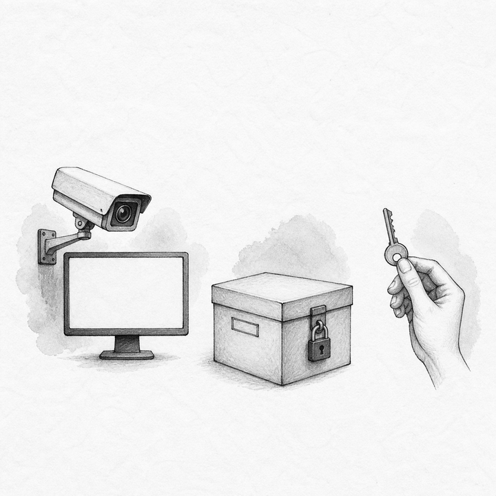
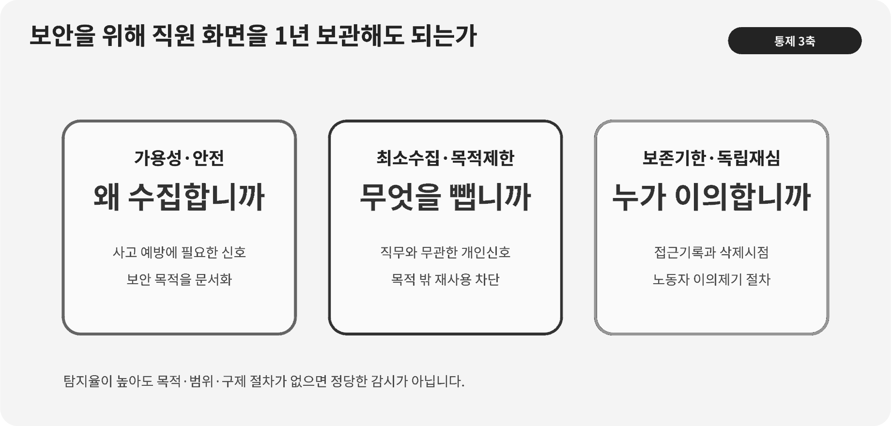

::: {.book-question}
[오늘의 책문]{.book-question-label}

{.book-question-image width=30mm fig-alt="감시의 눈과 팹 제어망 사이에 경계를 그린 미니멀 수묵화"}

[팹 보안을 위해 모든 직원의 화면과 통신 기록을 1년 동안 보관해도 되는가?]{.book-question-prompt}
:::

조선의 책문^[1447년 세종의 「법의 폐단과 권력의 자리」에서 이 장과 맞닿는 원문은 “法立而弊生，弊生而法又立。其所以救之者何歟？政權當歸於何所歟？”입니다. “법을 세우면 폐단이 생기고, 폐단이 생기면 다시 법을 세우니 무엇으로 구제하며 권한은 어디에 두어야 하는가?”를 묻습니다. 디지털 감시를 말한 사료는 아니며, 보안을 위한 통제가 새 폐단과 권력 남용을 낳을 때 누가 고치고 견제할지 묻는 연결입니다. [개별 책문과 해설](https://waterfirst.github.io/Joseon-Dynasty-Civil-Service-Examination/#sejong-1447/0), [국사편찬위원회 세종실록 1447년 8월 5일 기록](https://sillok.history.go.kr/id/kda_12908005_001)]은 규칙의 존재보다 폐단을 고칠 책임과 권한 배치를 함께 보게 합니다.

## 왜 지금 이 질문인가

팹의 산업제어시스템은 정보 유출뿐 아니라 장비 가용성과 사람의 안전을 지켜야 합니다. 원격정비 계정, USB, 레시피 변경, 화면 캡처는 사고 조사에 도움이 될 수 있습니다. 그러나 전 직원의 화면과 통신을 오래 저장하면 목적과 무관한 개인정보가 쌓이고, 오탐이 인사평가나 징계에 흘러갈 위험도 커집니다. 신입 보안운영 담당자는 로그가 많을수록 좋다는 가정을 버리고 어떤 위험을 얼마나 빨리 찾는지부터 정의해야 합니다.

NIST의 OT 보안 지침은 일반 IT와 달리 성능·신뢰성·안전을 함께 고려하라고 요구합니다. CISA도 산업제어시스템에서 원격접근 관리와 방어 심층화를 권고합니다. OECD 개인정보 가이드라인은 수집 제한, 목적 명시, 이용 제한, 정보주체 참여와 책임성을 기본 원칙으로 둡니다. 이 기준들을 함께 적용하면 로그는 목적에 필요한 범위만 수집하되, 어떤 계정이 어떤 승인으로 무엇을 실행했고 누가 중단했는지는 추적할 수 있어야 합니다.

## 데이터로 보기

{fig-alt="팹 보안에서 기밀성·가용성·안전과 감시 최소화를 함께 배치한 판단 구조"}

### 근거 데이터 표

| 근거 | 원자료의 범위 | 보안 운영에서의 의미 |
|---:|---|---|
| 1 | CISA는 산업제어시스템 보안을 별도 영역으로 다루며 원격접근·망 경계·운영 관행을 제시합니다. | 사무용 화면 감시를 늘리는 것만으로 공정망 보안이 완성되지 않습니다. |
| 2 | NIST SP 800-82 Rev. 3은 OT 보안에서 성능·신뢰성·안전 요구를 함께 고려합니다. | 무리한 수집·업데이트가 장비 가용성을 해치지 않는지도 보안 평가에 포함합니다. |
| 3 | 최소권한·망분리·다중인증을 적용해도 내부자·공급망·원격정비 경로는 남습니다. | 전 직원 전면감시보다 고위험 행위와 권한 경로를 정밀하게 기록해야 합니다. |
| 4 | OECD 개인정보 가이드라인은 수집 제한, 목적 명시, 이용 제한, 정보주체 참여와 책임성을 제시합니다. | 보안용 로그를 인사평가에 넘기거나 필요 이상으로 보관하는 별도 위험도 통제해야 합니다. |

### 이 숫자를 읽는 법

공공 근거는 “화면을 몇 개월 저장하라”는 단일 숫자를 주지 않습니다. OECD 원칙도 특정 직장의 적법한 감시 범위나 보존기간을 대신 정하지 않습니다. 시스템 위험과 관할 법령·단체협약·조사에 필요한 시간이 조직마다 다르므로 실제 도입 전 별도 검토가 필요합니다. 사례의 오탐 18%, 오용 두 건, 1년 보존은 사실 통계가 아니라 설계 판단을 위한 가정입니다.

보존기간을 정할 때는 총 로그량보다 평균 탐지시간, 사건 확정까지 걸린 시간, 목적 외 조회, 오탐 이의제기 처리시간을 봅니다. 사건이 없는 직원의 원문 화면은 짧게 두고, 고위험 명령과 계정행위는 가명화·무결성 보호 아래 더 오래 보존하는 식으로 등급을 나눌 수 있습니다.

## 대립 답안

### 답안 A — 적극론

팹 중단과 핵심 레시피 유출의 피해가 크므로 고위험 구역의 행동 로그와 원격정비 기록은 충분히 오래 남겨야 합니다. 짧은 보존기간 때문에 침해 경로를 재구성하지 못하면 사고 대응과 법적 증빙이 무너집니다. 다만 모든 화면이 아니라 위험 기반 수집이 우선입니다.

### 답안 B — 경계론

전 직원 화면·통신의 일괄 저장은 보안 목적과 무관한 개인정보를 축적하고 오탐을 인사통제에 쓰게 만듭니다. 더 많은 데이터가 탐지 정확도를 자동으로 높이지 않으며, 유출되면 감시 저장소 자체가 새로운 공격 표적이 됩니다.

### 답안 C — 조건부론

직무·구역·명령 위험도에 따라 수집 항목과 기본 보존기간을 최소화합니다. 실제 사건이 발생하면 관련 로그만 보존을 연장하고, 보안 목적 외 이용을 금지합니다. 접근은 이중 승인과 감사로 제한하고 직원에게 통지·열람·이의제기 절차를 제공합니다.

## AI 조사 설계

### AI에게 물어볼 프롬프트

> CISA 산업제어시스템 자료, NIST SP 800-82 Rev. 3과 OECD 개인정보 가이드라인을 기준으로 팹 로그 수집안을 만드십시오. 자산·계정·원격정비·레시피 변경·파일반출·화면·메신저를 위험도별로 분류하고, 각 항목의 보안 목적, 필요 필드, 기본 보존기간을 정할 때 필요한 근거, 접근권자, 가명화, 사건 시 연장, 삭제 절차를 표로 작성하십시오. 전면 수집안과 최소수집안의 탐지효과·가용성·사생활·저장소 침해위험을 비교하십시오. 현행 개인정보·노동법의 구체 결론은 관할 원문과 전문 검토가 필요하다고 표시하고, 확인된 사실과 회사 가정을 분리하십시오.

### 데이터 취득

| 순서 | 자료 | 확인 항목 |
|---:|---|---|
| 1 | 자산·권한·데이터 분류표 | 공정 영향, 영업비밀, 개인정보, 관리자 권한 |
| 2 | 과거 사고와 탐지 로그 | 최초 신호, 필요한 필드, 탐지·확정시간, 누락 데이터 |
| 3 | 오탐·오용·이의제기 기록 | 직무별 오탐, 목적 외 조회, 시정시간, 불이익 여부 |
| 4 | CISA·NIST·OECD 원문과 내부규정 | OT 가용성·안전, 원격접근, 수집·이용 제한, 승인·감사·보존 근거 |

### 정보 판정

1. 각 로그가 어떤 위협 시나리오를 탐지하는지 목적을 한 문장으로 연결합니다.
2. 탐지에 쓰이지 않은 필드는 관성적으로 보존하지 않습니다.
3. 오탐률뿐 아니라 오탐이 인사결정으로 넘어간 경로를 조사합니다.
4. 보안팀 내부의 조회도 모두 기록하고 독립감사가 표본 점검합니다.
5. 기간이 끝나면 자동 삭제하고 법적 보존이나 사건 연장은 사유와 승인자를 남깁니다.

### 토론의 핵심

- 화면 원문이 꼭 필요한 위협과 명령·파일 메타데이터만으로 충분한 위협을 어떻게 나눕니까?
- 오탐 피해를 줄이면서 내부자 탐지시간을 유지할 수 있는 최소 필드는 무엇입니까?
- 보안 로그가 인사평가로 흘러간 두 사례를 기술통제와 조직통제로 어떻게 막습니까?

## 사례형 토론

당신은 보안운영팀 신입 사원입니다. 보안팀은 전 직원 화면과 통신을 1년 보관하자고 제안했습니다. 최근 경보의 18%가 오탐이었고, 그중 두 건은 사실 확인 전에 인사평가에 잘못 활용됐습니다. 고위험 원격정비 계정은 전체 직원 중 4%가 사용합니다. **모든 비율·건수·기간은 토론용 가상 조건입니다.**

1. 전면 저장, 고위험 직무 한정, 화면 대신 메타데이터 저장 가운데 조합을 정합니다.
2. 일반 로그와 원격정비 로그의 기본 보존기간을 다르게 제안합니다.
3. 사건 발생 시 보존 연장의 요건과 승인자를 정합니다.
4. 보안팀·인사팀·감사팀의 접근권을 분리합니다.
5. 직원 통지와 오탐 이의제기 처리기한을 포함한 절차를 만듭니다.

## 90초 발언 예시

“저는 전 직원 화면과 통신을 1년 보관하는 안에 반대하고 위험 기반 수집으로 바꾸겠습니다. NIST SP 800-82 Rev. 3은 OT 보안에서 기밀성뿐 아니라 성능·신뢰성·안전을 함께 보라고 합니다. OECD 원칙도 수집 목적과 이용 범위를 구분하게 합니다. 따라서 화면을 많이 모으는 것보다 고위험 계정과 레시피 명령을 정확히 추적해야 합니다. 적극론처럼 사고 조사에 충분한 기록이 필요하다는 반론은 맞습니다. 그러나 사례에서 경보 오탐이 18%이고 두 건이 인사평가에 오용됐으므로 전면 수집은 새 위험을 만들었습니다. 토론용 초기안으로 일반 직원의 파일반출·권한변경 메타데이터는 30일, 직원의 4%인 원격정비 계정의 세션 명령·승인 로그는 180일 보존하겠습니다. 화면 원문은 상시 수집하지 않고 승인된 사건에 한해 확보하겠습니다. 이 기간은 관할 법령과 실제 탐지·조사기간을 검토해 확정하고, 사건 관련 자료만 독립 승인으로 연장하겠습니다. 오탐률이 낮아지고 목적 외 조회가 사라지면서 탐지시간이 악화되지 않으면 유지하겠습니다. 반대로 필요한 사고 증빙이 반복해 사라지면 해당 로그의 기간만 늘리겠습니다.”

## 꼬리 질문

- 화면 전체 대신 명령 메타데이터만 저장하면 놓칠 수 있는 위협은 무엇입니까?
- 오탐 18%가 높다고 판단할 비교 기준은 무엇이어야 합니까?
- 보안팀의 정당한 조회와 목적 외 열람을 어떻게 구분하겠습니까?
- 사건 발생 뒤 관련 직원의 모든 기록을 연장해도 됩니까?
- 원격정비 협력사 계정에는 직원과 같은 통지·이의제기 절차를 적용해야 합니까?
- 어떤 증거가 나오면 기본 보존기간을 늘리거나 줄이겠습니까?

## 출처

- [U.S. Cybersecurity and Infrastructure Security Agency, *Industrial Control Systems* (2026 열람)](https://www.cisa.gov/topics/industrial-control-systems)
- [U.S. Cybersecurity and Infrastructure Security Agency, *ICS Recommended Practices* (2026 열람)](https://www.cisa.gov/resources-tools/resources/ics-recommended-practices)
- [U.S. National Institute of Standards and Technology, *Guide to Operational Technology Security, SP 800-82 Rev. 3* (2023)](https://www.nist.gov/publications/guide-operational-technology-ot-security)
- [Organisation for Economic Co-operation and Development, *Recommendation of the Council concerning Guidelines Governing the Protection of Privacy and Transborder Flows of Personal Data* (1980, 2013 개정)](https://legalinstruments.oecd.org/public/doc/114/body-text.en.html)
- [조선시대 책문 아카이브, 세종 「법의 폐단과 권력의 자리」 개별 항목](https://waterfirst.github.io/Joseon-Dynasty-Civil-Service-Examination/#sejong-1447/0)
- [국사편찬위원회, 세종실록 1447년 8월 5일 기록](https://sillok.history.go.kr/id/kda_12908005_001)

> **자료 메모:** 공공 문서의 근거는 정성 원칙이며, 오탐률·오용 건수·1년 보존·고위험 계정 비중은 가상 사례 수치입니다. 30일·180일은 모범답안의 토론용 제안값으로 법정 보존기간을 뜻하지 않습니다.
