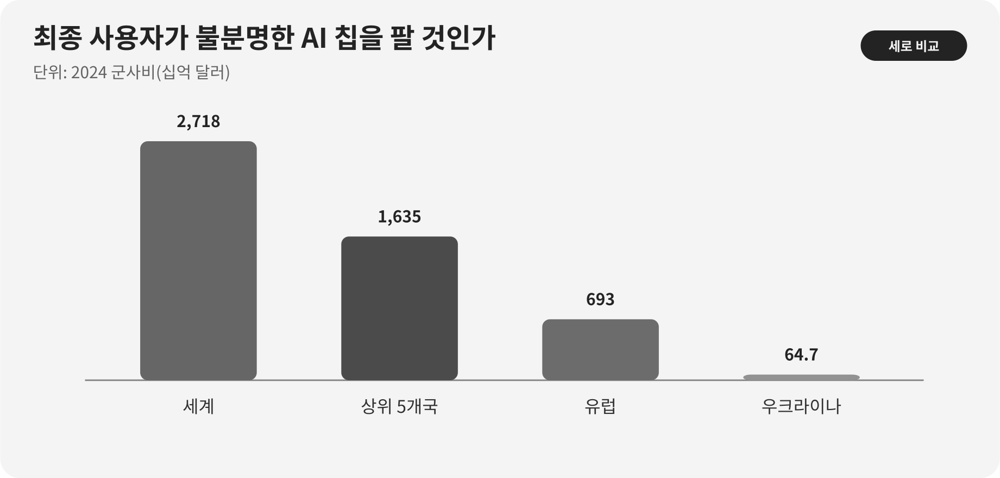

::: {.book-question}
[오늘의 책문]{.book-question-label}

{.book-question-image width=30mm fig-alt="민수와 군수로 갈라지는 AI 칩의 길을 표현한 미니멀 수묵화"}

[민수용 AI 가속기가 품목·목적지 요건을 통과했어도 최종 사용자의 군 연계 경보가 뜨면 계약을 멈춰야 하는가?]{.book-question-prompt}
:::

조선의 책문^[1568년 선조의 「정벌인가 화친인가」에서 이 장과 맞닿는 원문은 “禦外之道，戰與和而已。義、力、勢，何所先後？”입니다. “외부를 막는 길에 전쟁과 화친이 있으니 의리·힘·형세 가운데 무엇을 먼저 하고 뒤에 둘 것인가?”라는 물음입니다. AI 칩 수출을 직접 논한 옛 문장이 아니라, 원칙과 실행능력과 구체 형세를 함께 판단해야 한다는 연결입니다. [개별 책문과 해설](https://waterfirst.github.io/Joseon-Dynasty-Civil-Service-Examination/#seonjo-1568/0), [KRpia 박광전 책문 항목](https://www.krpia.co.kr/product/detail?nodeId=NODE03961489&plctId=PLCT00004893)]은 명분만으로 결론을 내리지 않고 상대·경로·실행 결과를 살피게 합니다. 준법 담당자도 계약서의 ‘민수용’ 문구와 막연한 ‘군 연계’ 의심 사이에서 최종사용자와 재수출 경로를 확인해야 합니다.

## 왜 지금 이 질문인가

AI 가속기는 데이터센터, 의료, 제조, 대학 연구에 쓰이면서 군사 지휘·정보분석에도 전용될 수 있습니다. 제조사가 모든 최종용도를 알 수는 없지만, 이상한 주문 규모, 불투명한 유통사, 설치 거부, 군 연구기관과의 인적 연결 같은 경보를 보고도 거래하면 단순한 중립이라고 하기 어렵습니다. 반대로 근거가 약한 연계만으로 거래를 막으면 합법적 고객을 자의적으로 차별하고 영업현장의 예측 가능성을 해칩니다.

2024년 세계 군사비는 2조7,180억 달러로 늘었습니다. 이 총액은 국제적 군사 수요의 크기를 보여줄 뿐, 특정 주문의 칩이 군사용이라는 증거가 아닙니다. 미국 산업안보국의 고객확인 지침은 거래 상대방·최종사용자·최종용도를 확인하고 경보를 해소하지 못하면 거래를 자제하도록 요구합니다. 기업은 이 책임을 고객확인·보류·공급중단 절차와 결정 기록으로 구체화해야 합니다.

## 데이터 렌즈

{fig-alt="2024년 세계 군사비 2718십억 달러, 상위 5개국 1635십억 달러, 유럽 693십억 달러, 우크라이나 64.7십억 달러 비교"}

### 근거 데이터 표

| 근거 | 원자료의 수치·범위 | 거래 판정에서의 의미 |
|---:|---|---|
| 1 | SIPRI에 따르면 2024년 세계 군사비는 2조7,180억 달러로 실질 9.4% 증가했습니다. | 군사 수요가 크고 늘었다는 배경이지 개별 칩 주문의 최종용도 증명은 아닙니다. |
| 2 | 상위 5개국은 1조6,350억 달러로 세계 총액의 60%를 차지했습니다. | 국가 총액을 그 나라의 모든 기업·연구기관 위험등급으로 옮기면 안 됩니다. |
| 3 | 우크라이나의 2024년 군사비는 647억 달러로 GDP의 34%였습니다. | 전시국의 거시 지표와 특정 구매자·유통경로의 실사는 서로 다른 분석 단위입니다. |

### 이 숫자를 읽는 법

군사비는 정부의 군사 목적 지출 추정치이며 무기나 반도체 구매액만을 뜻하지 않습니다. 명목 달러 총액, 실질 증가율, GDP 대비 비중은 서로 다른 단위입니다. 상위 5개국 60%를 근거로 그 밖의 국가 거래가 안전하다고 볼 수도 없습니다.

개별 거래에서는 칩 성능·분류, 구매자와 최종사용자, 실소유자, 설치장소, 재수출국, 결제·물류 경로, 거절 가능한 공급중단 조항을 확인합니다. 군사비 총액은 실사를 생략할 근거도, 자동 거절할 근거도 아닙니다.

## 대립 답안

### 답안 A — 적극론

품목분류·목적지·허가의 형식 요건을 충족했고 범용 칩의 용도를 제조사가 완전히 통제할 수 없다면 국가 규칙과 명확한 금지목록을 따르는 것이 예측 가능합니다. 모호한 인적 연결만으로 거래를 막으면 담당자마다 기준이 달라지고 적법한 민간 연구까지 위축됩니다.

### 답안 B — 경계론

법적 허용은 최소선입니다. 군 연계 경보와 불투명한 유통경로를 알고도 48시간 영업기한에 밀려 출하하면, 기업이 알 수 있었던 위험신호를 외면한 것입니다. 핵심 정보가 확인되지 않으면 손실을 감수하고 보류해야 합니다.

### 답안 C — 조건부론

허가와 제재목록 확인 뒤에도 고객 위험등급, 최종용도 증빙, 실소유자, 재수출 제한, 설치·사후감사를 적용합니다. 경보를 해소할 독립 문서가 나오면 조건부 공급하고, 최종사용자나 경로가 확인되지 않으면 보류합니다. 오용이 발견되면 즉시 지원·업데이트·후속 공급을 중단할 조항을 둡니다.

## AI 조사 설계

### AI에게 물어볼 프롬프트

> 기준일은 2026년 8월 18일입니다. AI 가속기 거래의 최종사용자·최종용도 실사안을 작성하십시오. 관할 수출통제 원문, 허가조건, 제재·통제목록, BIS의 Know Your Customer Guidance and Red Flags, 고객 법인등기와 실소유자, 유통·결제·설치 경로 순서로 확인하십시오. ‘법적으로 허용’, ‘목록에 없음’, ‘위험이 없음’을 구분하고 각 경보의 근거·반증·미확인 사항을 표로 만드십시오. SIPRI 군사비는 거시 배경으로만 쓰고 개별 고객 위험의 증거로 사용하지 마십시오. 모든 주장에 기관·문서·발표일·직접 URL을 붙이고 최종 법률판단은 준법·법무의 원문 검토가 필요하다고 명시하십시오.

### 데이터 취득

| 순서 | 자료 | 확인 항목 |
|---:|---|---|
| 1 | 관할 수출통제 규정과 허가서 | 품목 분류, 목적지, 최종사용자·최종용도 조건, 유효기간 |
| 2 | 통제목록·고객확인 자료 | 법인명 변형, 실소유자, 임원·연구자 연결, 주소 |
| 3 | 계약·결제·물류 문서 | 중간상, 설치장소, 재수출, 제3자 지급, 납기 압박 |
| 4 | 기술·서비스 계획 | 성능, 원격지원, 업데이트, 사용량 이상, 공급중단 가능성 |

### 정보 판정

1. 명단에 없다는 사실을 안전 증명으로 바꾸지 않습니다.
2. 인적 연결의 출처·시점·동명이인을 확인해 단순 연계와 지배관계를 나눕니다.
3. 고객 설명과 독립 등기·계약·물류 자료가 일치하는지 대조합니다.
4. 48시간 납기 요구가 통상 거래와 다른 위험신호인지 기록합니다.
5. AI 검색 결과는 준법 담당자가 규정 원문과 목록에서 다시 확인하고 판단 로그를 남깁니다.

### 토론의 핵심

- 형식 요건상 거래 가능한 계약을 기업이 보류할 최소 경보는 무엇입니까?
- 인적 연결과 조직의 통제관계를 구분할 증거는 무엇입니까?
- 출하 뒤 오용을 발견했을 때 회사가 실제로 행사할 수 있는 중단수단은 무엇입니까?

## 사례형 토론

당신은 수출준법팀 신입 사원입니다. 주문은 회사 연매출의 12%에 해당하며 현재 확인된 품목분류와 목적지 요건만 보면 허가 가능한 거래입니다. 그러나 최종사용자 실사는 끝나지 않았고 군 연구기관과의 인적 연결 경보가 떴으며, 한 중간 유통사의 실소유자도 확인되지 않습니다. 고객은 48시간 안에 출하하지 않으면 계약을 취소하겠다고 합니다. **매출비중·기한·경보 내용과 형식 요건의 충족 상태는 토론용 가상 조건이며 실제 거래가 아닙니다.**

1. 즉시 출하, 추가 실사 중 보류, 조건부 공급, 거래 거절 가운데 하나를 고릅니다.
2. 48시간 안에 반드시 확인할 문서와 확인할 수 없는 항목을 나눕니다.
3. 인적 연결이 동명이인인지 지배·고용관계인지 검증합니다.
4. 재수출 금지, 설치 확인, 사후감사, 지원중단 조항을 계약안에 넣습니다.
5. 매출 12% 손실과 제재·평판·인명 위험을 같은 의사결정표에서 비교합니다.

## 90초 발언 예시

“저는 48시간 출하 요구를 거절하고 추가 실사가 끝날 때까지 주문을 보류하겠습니다. SIPRI에 따르면 2024년 세계 군사비는 2조7,180억 달러이고 상위 5개국이 60%를 차지했습니다. 그러나 이 거시 수치는 이번 AI 칩의 용도를 증명하지 않습니다. 거래 판단은 고객·최종사용자·실소유자·재수출 경로로 해야 합니다. 적극론처럼 품목분류와 목적지 요건을 통과했고 명단에 없다는 사실은 중요한 출발점입니다. 다만 최종사용자 실사가 끝나지 않은 상태에서 회사 매출의 12%라는 규모와 48시간 압박, 군 연구기관 인적 연결, 미확인 중간상은 무시할 수 없는 가상 경보입니다. 저는 등기·실소유자·설치장소와 최종용도 확인서를 요구하고 재수출 금지, 사후감사, 오용 시 지원·후속공급 중단을 계약에 넣겠습니다. 독립 자료가 경보를 해소하면 조건부 공급으로 전환하겠습니다. 반대로 실소유자나 설치장소가 끝내 확인되지 않거나 자료가 서로 다르면 계약을 거절하겠습니다. 형식 요건 충족은 거래의 시작 조건이지, 알게 된 위험을 외면할 면허가 아닙니다.”

## 꼬리 질문

- 세계 군사비 증가가 개별 고객 위험을 증명하지 못하는 이유는 무엇입니까?
- 고객이 통제목록에 없다는 사실만으로 실사를 끝낼 수 있습니까?
- 군 연구기관과의 인적 연결을 어떤 수준에서 중대한 경보로 보겠습니까?
- 주문이 연매출의 1%라면 12%일 때와 판정 기준이 달라져도 됩니까?
- 사후감사가 현실적으로 불가능한 국가라면 조건부 공급은 가능합니까?
- 어떤 반증이 나오면 보류에서 출하로, 어떤 증거가 나오면 거절로 전환하겠습니까?

## 출처

- [Stockholm International Peace Research Institute, *Trends in World Military Expenditure, 2024* (2025)](https://www.sipri.org/publications/2025/sipri-fact-sheets/trends-world-military-expenditure-2024)
- [Stockholm International Peace Research Institute, *Unprecedented rise in global military expenditure* (2025)](https://www.sipri.org/media/press-release/2025/unprecedented-rise-global-military-expenditure-european-and-middle-east-spending-surges)
- [U.S. Bureau of Industry and Security, *Supplement No. 3 to Part 732—Know Your Customer Guidance and Red Flags* (2026 열람)](https://www.bis.gov/node/1533)
- [조선시대 책문 아카이브, 선조 「정벌인가 화친인가」 개별 항목](https://waterfirst.github.io/Joseon-Dynasty-Civil-Service-Examination/#seonjo-1568/0)
- [KRpia, 박광전 책문 항목](https://www.krpia.co.kr/product/detail?nodeId=NODE03961489&plctId=PLCT00004893)

> 데이터 기준일: 2026년 8월 18일. 군사비 수치는 SIPRI 근거이고 주문 매출비중·기한·연계 경보는 가상 사례입니다. 실제 거래는 적용 법령과 허가조건을 별도 확인해야 합니다.
