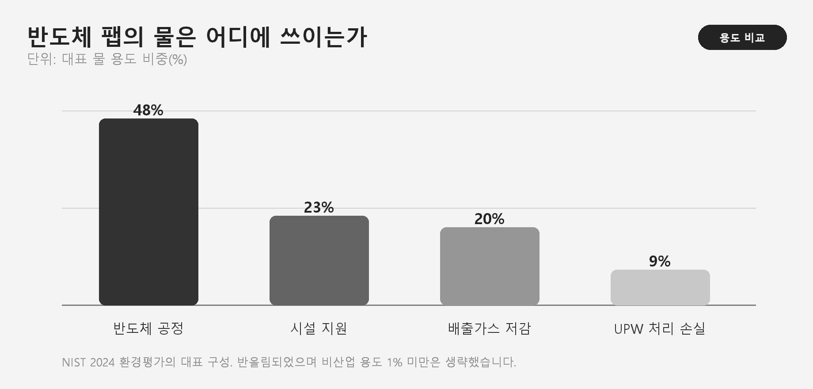

::: {.book-question}
[오늘의 책문]{.book-question-label}

{.book-question-image width=30mm fig-alt="웨이퍼를 씻는 맑은 물길이 재이용 고리로 돌아오고 그 사이에 미세 오염을 살피는 확대경이 놓인 수묵화"}

[AI 반도체 팹의 초순수 재이용률을 높일 때 미세 오염과 수율 위험을 어디까지 감수할 것인가?]{.book-question-prompt}
:::

1798년 정조의 호남 책문^[이 장이 연결한 실제 책문([策問]{.hanja})은 호남의 물산과 지역의 삶을 함께 살릴 방책을 물었습니다. 전승 답안에 앞서 제시된 첫 원문은 “[王若曰，湖南一路卽我朝興王之地也。]{.hanja}”, 곧 “왕은 이르노라. 호남 한 도는 우리 왕조가 일어난 땅이다”입니다. 오늘의 질문은 당시 지역정책을 반도체 공장에 옮긴 번역이 아니라, 생산의 편익과 자원 부담이 다른 곳에 놓일 때 총량뿐 아니라 부담의 분포를 보라는 문제 구조를 빌립니다. [조선시대 책문 아카이브 개별 항목](https://waterfirst.github.io/Joseon-Dynasty-Civil-Service-Examination/#jeongjo-1798/0)]은 풍부한 자원이 있다는 사실과 주민의 삶이 나아지는 일을 같은 것으로 보지 않았습니다. 팹이 물을 많이 재이용해도 취수량, 갈수기 부담, 방류수 수질과 수율 위험을 따로 측정하지 않으면 성과를 과장할 수 있습니다.

## 왜 지금 이 질문인가

첨단 로직과 메모리 공정은 웨이퍼 표면의 입자·이온·유기물을 반복해서 씻어냅니다. 일반 용수를 초순수(UPW)로 만들고 사용한 뒤 다시 회수하는 과정에는 역삼투, 이온교환, 자외선 산화, 탈기와 정밀여과가 이어집니다. 재이용률을 높이면 신규 취수와 방류를 줄일 수 있지만, 회수수의 오염원이 농축되거나 감시 사각이 생기면 막 오염, 배관 오염과 수율 손실로 돌아올 수 있습니다.

NIST의 2024년 환경평가는 평균적인 반도체 팹이 받은 물의 40~70%를 현장 재활용하고, 일부 대형 제조사는 공정 활동에서 80%를 넘겼다고 정리했습니다. 같은 문서는 물 용도의 48%를 반도체 공정, 23%를 시설 지원, 20%를 배출가스 저감에 배분합니다. 이 수치는 재이용을 늘릴 여지가 크다는 뜻이지만, 모든 배출수를 곧바로 최종 웨이퍼 세정에 넣어도 된다는 뜻은 아닙니다.

기업의 실제 경로도 단계적입니다. TSMC는 회수수를 먼저 2차 용도에 쓰고 검증 뒤 성숙 공정에서 첨단 공정으로 넓혀 2024년에 5 nm와 3 nm 공정 적용을 확인했다고 보고했습니다. 삼성전자는 2026년 보고서에서 2025년 국내 반도체 사업장의 물 재이용량을 1억796만7천 톤으로 제시했습니다. 재이용 “양”은 여러 번 순환한 물을 합산할 수 있으므로 신규 취수 감축률과 같다고 해석해서는 안 됩니다.

## 데이터 렌즈

{fig-alt="반도체 팹 물 용도를 공정 48%, 시설 지원 23%, 배출가스 저감 20%, 초순수 처리 손실 9%로 비교한 막대그래프"}

### 근거 데이터

| 근거 | 공식 자료의 수치·범위 | 공정·인프라 판단에서의 의미 |
|---:|---|---|
| 1 | NIST의 2024년 환경평가는 대표 물 용도를 반도체 공정 48%, 시설 지원 23%, 배출가스 저감 20%, UPW 처리 손실 9%, 비산업 용도 1% 미만으로 정리했습니다. | 용도별 수질 요구가 다릅니다. 고순도 세정수와 냉각·스크러버 보충수를 한 재이용률로 묶으면 위험을 숨깁니다. |
| 2 | 같은 평가는 일반적인 현장 재활용 범위를 받은 물의 40~70%로, 일부 대형 제조사의 공정 UPW 재활용을 80% 초과로 제시했습니다. | 높은 비율은 가능성의 근거이지 우리 공정의 합격기준이 아닙니다. 분모와 공정 범위를 먼저 맞춰야 합니다. |
| 3 | TSMC는 2024년 타이난에 하루 6만7천 m³의 재생수를 공급받고 연간 1,965만 m³를 사용해 상수도 사용을 31% 줄였으며, 재생수 대체율 17%를 보고했습니다. | 외부 재생수 공급, 내부 순환, 상수도 감축은 서로 다른 지표입니다. 한 숫자로 대체할 수 없습니다. |
| 4 | TSMC는 검증을 거쳐 2024년에 재생수를 5 nm와 3 nm 공정에 적용했다고 밝혔습니다. | 첨단 공정 적용은 “전면 투입”보다 수질별 분리·파일럿·단계승인이 현실적인 경로임을 보여줍니다. |
| 5 | 삼성전자 2026년 보고서는 국내 DS 사업장의 물 재이용량을 2023년 9,265만7천 톤, 2024년 1억110만6천 톤, 2025년 1억796만7천 톤으로 제시합니다. | 재이용량 증가는 성과지만 총취수량과 반복 순환 횟수 없이는 재이용률이나 지역 취수 감축을 계산할 수 없습니다. |
| 6 | NIST의 2026년 Micron 뉴욕 최종 환경영향평가서는 용수 수요를 2029년 785만 갤런/일에서 2041년 전체 구축 시 4,800만 갤런/일로 전망합니다. | 이는 미래 사업계획의 전망치이지 현재 사용 실적이 아닙니다. 지역 인프라는 단계별 실제 가동률과 갈수기 조건에 맞춰 승인해야 합니다. |

### 이 숫자를 읽는 법

재이용률은 분모가 다르면 비교할 수 없습니다. “총 사용량 대비 순환량”, “취수량 대비 회수량”, “공정 UPW만의 회수율”, “외부 재생수가 상수도를 대체한 비율”은 서로 다른 질문입니다. 반복 순환한 같은 물을 매회 합산하면 재이용량이 신규 취수량보다 커질 수도 있습니다.

차트의 48·23·20·9%는 NIST 환경평가가 인용한 대표 구성입니다. 사업장별 공정 세대, 냉각 방식과 저감설비에 그대로 적용할 비율이 아닙니다. 40~70%와 80% 초과도 산업 범위이지 수율 안전선이 아닙니다. Micron의 785만~4,800만 갤런/일은 2029~2041년 구축 계획에 따른 전망이며 실제 취수와 구분해야 합니다.

재이용 확대안은 다음 계측을 한 시간축에서 연결해야 합니다.

- 취수원별 순취수량, 공정별 회수량, 반복 순환 횟수와 방류량
- UPW 사용점의 비저항, 총유기탄소, 실리카·붕소, 용존산소와 입자 수
- 막 차압·수명, 이온교환 재생주기, 에너지·약품 사용량
- 제품군·공정단계별 결함지도, 수율과 공정능력지수
- 갈수기 하천 유량, 지역 생활·농업용수 영향과 방류수 수질

## 대립 답안

### 답안 A — 재이용 목표를 빠르게 높입니다

용도별로 회수수를 분리하고 고도처리 설비를 충분히 두면 신규 취수, 방류와 물 공급 중단 위험을 함께 줄일 수 있습니다. 대규모 팹은 수질 센서와 공정 데이터를 많이 확보하므로 오염을 조기에 탐지하고 저위험 용도부터 빠르게 확대할 수 있습니다. 지역 용수 부담이 이미 큰 곳이라면 보수적 목표만 반복하는 것도 위험을 외부에 남기는 선택입니다.

그러나 재이용률을 경영 목표 하나로 걸면 서로 다른 수질의 물을 무리하게 합치거나 경보를 늦게 보고할 유인이 생길 수 있습니다. 신규 취수 감소가 작고 에너지·약품 사용과 농축폐수가 늘면 환경성과도 예상보다 작아집니다.

### 답안 B — 수율 검증 전에는 공정 재투입을 멈춥니다

첨단 공정의 미세 오염은 여러 공정 뒤에 결함으로 나타나 원인 추적이 어렵습니다. 고객 신뢰와 긴 학습주기를 고려하면 냉각탑·스크러버·조경처럼 웨이퍼와 직접 닿지 않는 용도에서 재이용하고, 최종 세정수는 충분한 장기 데이터가 쌓일 때까지 기존 공급을 유지하는 편이 안전합니다.

이 입장도 비용이 있습니다. “완전한 무위험”을 기다리면 파일럿 학습이 시작되지 않고, 지역사회가 계속 신규 취수 부담을 떠안습니다. 기존 상수도 역시 가뭄·수질변동과 공급중단 위험이 있으므로 현상 유지가 무위험은 아닙니다.

### 답안 C — 수질 등급별로 단계승인합니다

회수수를 오염 특성에 따라 나누고, 냉각·저감설비에서 시작해 전처리·초기 세정·최종 세정 순으로 검증합니다. 각 단계는 물 지표뿐 아니라 결함지도와 수율을 함께 통과해야 합니다. 이상이 나면 자동 격리하고 기존 보충수로 돌아갈 수 있는 이중 배관과 저장 여유를 둡니다.

단계안은 설비와 운영이 복잡하고 초기 투자비가 큽니다. 그래서 승인 단계가 늘어나는 것 자체가 목표가 되어서는 안 됩니다. 취수 감축, 총비용, 탄소·약품, 오염 사건과 수율을 같은 검토표에 놓고 확대·유지·후퇴를 정해야 합니다.

## AI 조사 설계

### AI에게 물어볼 프롬프트

> 기준일은 2026년 8월 19일입니다. AI 반도체 팹의 초순수 재이용을 58%에서 75%로 높이는 안을 검토하십시오. NIST 환경평가·최종 환경영향평가서, 환경부·지자체·수자원기관 자료, 반도체 기업의 최신 지속가능성 보고서, 사업장 수질·수율 원자료를 우선하십시오. 각 수치마다 기관, 문서명, 기준연도, 실제·목표·전망 구분, 분자와 분모, 수질 등급, 단위, 절·페이지, 직접 URL을 적으십시오. 물 재이용량, 내부 재활용률, 외부 재생수 대체율, 신규 취수 감축률을 섞지 마십시오. 회수수 계통별 비저항·TOC·실리카·붕소·입자, 막 차압, 에너지·약품, 결함·수율, 갈수기 취수와 방류를 같은 시간축으로 분석하십시오. 상관관계를 수율 인과로 단정하지 말고 split-lot·대조계통·회귀변수와 검정력을 제시하십시오. 마지막에는 수질 등급별 확대 순서, 자동 격리 기준, 수율 중단조건, 지역사회 공개지표를 제안하십시오.

### 데이터 취득

| 순서 | 자료 | 반드시 확보할 항목 |
|---:|---|---|
| 1 | 취수·순환·방류 계량기 | 수원과 계통, 시간당 유량, 순취수, 반복 순환, 손실, 방류 |
| 2 | UPW·회수수 품질 로그 | 채수점, 비저항, TOC, 이온·실리카·붕소, 입자, 교정·검출한계 |
| 3 | 공정·수율 자료 | lot·제품·장비·레시피, 결함지도, 수율, 재작업, 시차 |
| 4 | 설비·비용 자료 | 막 차압·수명, 에너지, 약품, 슬러지, 유지보수와 우회계통 용량 |
| 5 | 유역·지역 자료 | 갈수기 유량, 생활·농업용수, 취수허가, 방류수, 주민 민원·협의 기록 |

### 정보 판정

1. **물의 정체를 구분합니다.** 상수·공업용수·외부 재생수·내부 회수수와 UPW를 같은 “물”로 합치지 않습니다.
2. **분모를 고정합니다.** 재이용률 계산식과 반복 순환 처리방식을 공개하지 않은 비율은 비교표에서 제외합니다.
3. **시간 지연을 반영합니다.** 수질 이상과 결함·수율 변화 사이의 공정 주기를 맞추고 사후 선택한 구간만 보지 않습니다.
4. **검출되지 않음과 없음을 구분합니다.** 검출한계, 교정 실패와 결측을 정상값으로 처리하지 않습니다.
5. **지역성과 공정성을 함께 봅니다.** 취수 감축이 없거나 갈수기 부담·농축폐수·에너지가 커지면 재이용량만으로 성공 판정을 내리지 않습니다.

### 토론의 핵심

- 수율 위험을 가장 먼저 드러낼 계통과 제품군은 어디입니까?
- 물 지표가 규격 안인데 수율이 낮아지면 어떤 교란변수를 먼저 제거합니까?
- 신규 취수 감축 1 m³당 에너지·약품·폐기물 증가는 어디까지 허용합니까?
- 지역사회에 공개할 지표와 회사 내부 영업비밀의 경계를 어떻게 정합니까?

## 사례형 토론

당신은 신규 AI 반도체 팹의 인프라·공정 통합팀에 배치된 신입 엔지니어입니다. 현재 총 공정용수 순환 기준 재이용률은 58%이고 1년 뒤 목표는 75%입니다. 총 물 수요를 하루 4만5천 m³로 단순 고정하면 신규 취수는 하루 1만8,900 m³에서 1만1,250 m³로 7,650 m³ 줄어듭니다. 이 계산은 누수·증발·반복 순환과 생산량 변화를 무시한 토론용 가정입니다.

12주 파일럿에서 회수수의 UPW 보충 비중을 20%에서 40%로 높였습니다. 비저항은 내부 규격을 지켰지만 TOC 경보가 네 번 발생했고, 20 nm 이상 입자 수가 대조계통보다 15% 높았습니다. 파일럿 lot의 수율은 0.18%포인트 낮았으나 표본이 18 lot뿐이라 인과와 통계적 유의성이 확정되지 않았습니다. 막 교체주기는 10% 짧아졌고 신규 취수는 12% 줄었습니다. 모든 수치와 내부 규격은 토론용 가정입니다.

생산팀은 수율 신호가 불확실하므로 확대 속도를 늦추자고 합니다. 인프라팀은 갈수기 전에 취수 여유를 확보해야 한다고 합니다. 환경팀은 취수뿐 아니라 에너지·약품과 방류 농도를 함께 보자고 합니다. 누구도 상대의 목표를 부정하지 않습니다.

당신은 **즉시 75% 확대, 공정 재투입 중단, 수질 등급별 단계확대** 중 하나를 권고해야 합니다. 신입의 역할은 최종 승인보다 데이터 정합성 확인, split-lot 설계, 자동 격리·우회 조건과 의사결정 로그 초안을 만드는 것입니다.

## 90초 발언 예시

“저는 수질 등급별 단계확대를 선택하겠습니다. NIST는 일반적인 팹의 현장 재활용을 40~70%로 보지만 일부는 80%를 넘었다고 정리했고, TSMC도 검증을 거쳐 2024년 5 nm와 3 nm에 재생수를 적용했습니다. 높은 재이용은 가능하지만 우리 수율 안전선이 자동으로 정해진 것은 아닙니다. 사례의 58%·75%, 하루 4만5천 m³, 수율 0.18%포인트 하락은 모두 가정입니다. 즉시 확대하면 하루 7,650 m³의 단순 취수 절감 가능성이 있지만 TOC 경보 네 번과 입자 15% 상승을 무시하게 됩니다. 반대로 전면 중단하면 갈수기 부담과 학습 기회를 그대로 남깁니다. 우선 냉각·스크러버와 비핵심 세정은 확대하고, 최종 세정 계통은 30개 짝지은 lot와 8주 연속 수질 합격 뒤에만 올리겠습니다. TOC 경보가 주 2회 발생하거나 입자가 대조계통보다 10% 넘게 상승하면 자동 격리하겠습니다. 수율이 대조군보다 0.10%포인트 이상 낮다는 결과가 사전 검정에서 확인되면 이전 단계로 돌아가겠습니다. 임흥원의 답안이 지역 총량보다 부담이 약한 쪽에 더 무겁게 쏠리는지를 먼저 본 사고 순서만 빌리면, 월별 순취수·갈수기 취수·방류수와 수율을 함께 공개해야 합니다.^[1798년 광주목 도과 응시자 임흥원(任興源)의 대책은 부유한 집의 부담은 가볍고 가난한 집의 부담은 무거운 조세 폐단을 먼저 짚었다는 취지입니다(현대어 의역). 한국학호남진흥원과 『정조실록』은 고정봉과 임흥원을 최고점 두 사람으로 기록하고 두 사람에게 직부전시 자격을 주었다고 확인하므로 ‘공동 장원’이라고 부르지 않습니다. 이 문장은 현대 공정의 권위가 아니라 총량과 부담의 분포를 함께 보는 사고법의 선례로만 인용했습니다. [한국학호남진흥원, 「광주의 풍교를 다스린 광주향교」(2021)](https://www.hiks.or.kr/HonamHeritage/19/read/629), [국사편찬위원회 『정조실록』 정조 22년 6월 18일](https://sillok.history.go.kr/id/kva_12206018_002), [책문 아카이브 임흥원 항목](https://waterfirst.github.io/Joseon-Dynasty-Civil-Service-Examination/#jeongjo-1798/0)]”

## 꼬리 질문

- 재이용률 75%의 분자와 분모를 어떻게 정의해야 사업장 간 비교가 가능합니까?
- 비저항은 정상인데 TOC와 입자가 상승했다면 어느 채수점과 장비부터 격리하겠습니까?
- 18 lot에서 수율이 0.18%포인트 낮을 때 확대 중단 여부를 판단하려면 어떤 통계정보가 더 필요합니까?
- 신규 취수는 줄었지만 막 교체·에너지·약품 사용이 늘면 어떤 단위로 총효과를 비교하겠습니까?
- 갈수기 지역 취수가 한계에 접근하면 생산량, 재이용 단계, 주민 공급 가운데 어떤 사전 규칙을 적용하겠습니까?
- 8주 합격 뒤 양산에서 오염이 재발하면 책임 소재보다 먼저 실행할 자동조치는 무엇입니까?

## 출처

- [NIST, *Final Programmatic Environmental Assessment for Modernization and Expansion of Existing Semiconductor Fabrication Facilities* (2024)](https://www.nist.gov/system/files/documents/2024/06/28/Final%20PEA%20for%20Modernization%20and%20Expansion%20of%20Semiconductor%20Fabs%206-28-2024%20-%20OGC-508C.pdf)
- [NIST, *Micron Semiconductor Manufacturing Project, Clay, New York — Final Environmental Impact Statement* (2026)](https://www.nist.gov/document/micron-ny-feis-final)
- [TSMC, *2024 Sustainability Report* (2025)](https://esg.tsmc.com/en-US/file/public/2024-TSMC-Sustainability-Report-e.pdf)
- [TSMC, *2024 Annual Report*, Water Management (2025)](https://investor.tsmc.com/static/annualReports/2024/english/ebook/files/basic-html/page159.html)
- [삼성전자, 『지속가능경영보고서 2026』 (2026)](https://download.semiconductor.samsung.com/resources/others/Samsung_Electronics_Sustainability_Report_2026_KOR.pdf)
- [삼성전자 반도체, 「경기권역 반도체 사업장 1단계 물 재이용 사업」 업무협약](https://semiconductor.samsung.com/kr/news-events/news/mou-with-ministry-of-environment/)
- [조선시대 책문 아카이브, 정조 1798년 「호남의 일곱 폐단과 해법」 개별 항목](https://waterfirst.github.io/Joseon-Dynasty-Civil-Service-Examination/#jeongjo-1798/0)
- [한국학호남진흥원, 「광주의 풍교를 다스린 광주향교」 (2021)](https://www.hiks.or.kr/HonamHeritage/19/read/629)
- [국사편찬위원회, 『정조실록』 정조 22년 6월 18일](https://sillok.history.go.kr/id/kva_12206018_002)

> **자료 메모:** 차트의 48·23·20·9%와 40~70%·80% 초과는 NIST의 2024년 환경평가 수치입니다. TSMC 수치는 2024년 타이난 실적, 삼성전자 수치는 2025년 국내 DS 실적, Micron 수치는 2029~2041년 전망입니다. 사례의 물 수요·재이용률·수질·수율·막 수명·승인·중단 기준은 모두 토론용 가정이며 특정 기업의 실제 운영값이 아닙니다.
