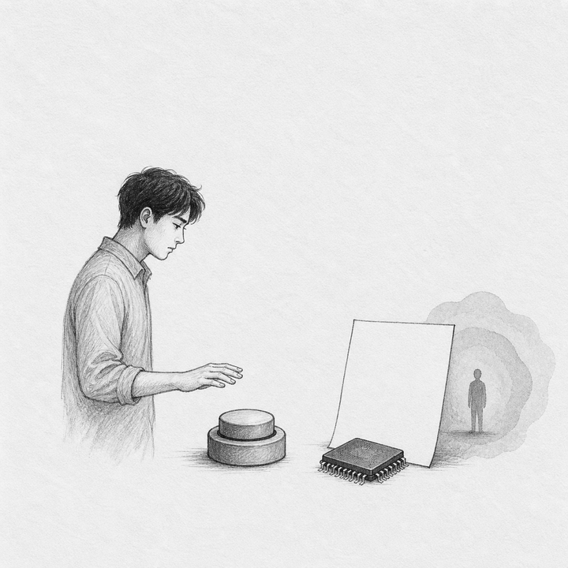
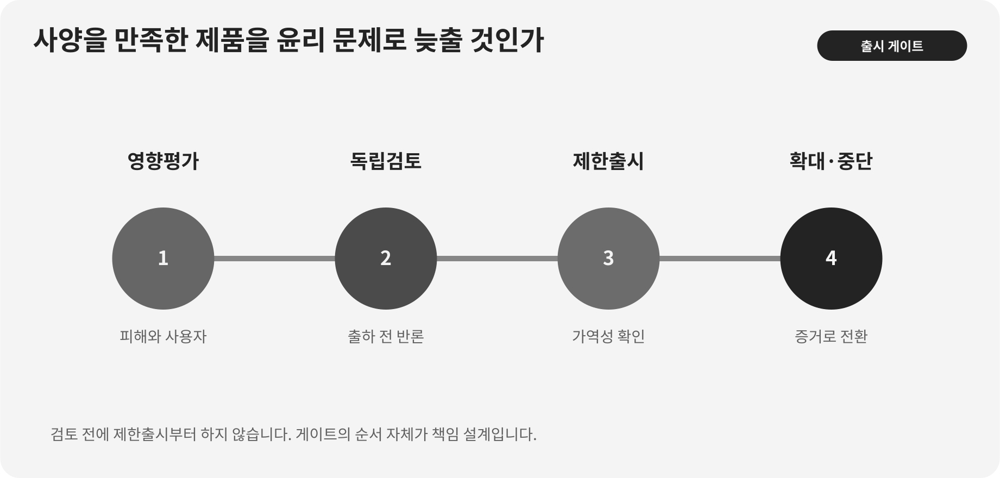

::: {.book-question}
[오늘의 책문]{.book-question-label}

{.book-question-image width=30mm fig-alt="완료 도장 앞에서 갈라지는 출시와 재검토의 길을 그린 미니멀 수묵화"}

[기술 사양을 충족했지만 사용자 피해 우려가 남아 있다면 신입 엔지니어도 출시 연기를 요청해야 하는가?]{.book-question-prompt}
:::

조선의 책문^[1515년 중종의 「이상정치를 현실로 만드는 법」에서 이 장과 연결되는 원문은 “欲致堯舜之治於今日，何者爲先？子若孔子，將何以治國歟？”입니다. “오늘날 요순의 정치를 이루려면 무엇을 먼저 해야 하며, 그대가 공자라면 어떻게 나라를 다스리겠는가?”를 묻습니다. 제품 출시를 다룬 옛 질문은 아니며, 좋은 원칙을 현실의 우선순위와 실행으로 바꾸라는 요구에 연결한 것입니다. [개별 책문과 해설](https://waterfirst.github.io/Joseon-Dynasty-Civil-Service-Examination/#jungjong-1515/0), [한국학중앙연구원 1515년 알성시 방목](https://dh.aks.ac.kr/~sonamu5/wiki/index.php/SEDB%3A1515%EB%85%84%28%E4%B8%AD%E5%AE%97_10%29_%E4%B9%99%E4%BA%A5_%EC%95%8C%EC%84%B1%EC%8B%9C%28%E8%AC%81%E8%81%96%E8%A9%A6%29_%EB%AC%B8%EA%B3%BC%28%E6%96%87%E7%A7%91%29)]은 이상을 말하는 데서 멈추지 않고 무엇을 먼저 바꿀지 답하게 합니다. 엔지니어의 윤리도 선언이 아니라 위험등록·시험·중단·재검토 권한으로 내려와야 합니다.

## 왜 지금 이 질문인가

제품이 계약 사양과 법정 기준을 통과해도 모든 사용자·환경에서 안전하다는 뜻은 아닙니다. 시험표본에 적게 포함된 사용자군에서 오작동이 집중되거나, 실패가 건강·기회·개인정보에 큰 피해를 주면 평균 성능이 위험을 가릴 수 있습니다. 반대로 막연한 우려만으로 신입 개인이 출시를 무기한 멈추게 하면 책임과 일정이 자의적으로 흔들립니다.

UNESCO의 AI 윤리 권고는 2021년 193개 회원국이 채택했습니다. 권고는 인권·존엄, 투명성, 공정성, 환경 지속가능성, 인간 감독을 제시하며 영향평가·감사·실사 같은 운영장치로 원칙을 내리도록 합니다. 신입 품질 엔지니어에게 필요한 것도 ‘윤리적 사람’이라는 자부심보다 발견한 위험을 재현하고 공식 위험등록에 올리며 필요하면 출시를 멈출 수 있는 절차입니다.

## 데이터 렌즈

{fig-alt="UNESCO AI 윤리 권고의 원칙이 영향평가·감사·중단권·결정로그로 이어지는 판단 구조"}

### 근거 데이터 표

| 근거 | 원자료의 수치·범위 | 제품 출시에서의 의미 |
|---:|---|---|
| 1 | UNESCO AI 윤리 권고는 2021년 193개 회원국에 의해 채택됐습니다. | 넓은 국제 합의는 문제의 중요성을 보여주지만 개별 제품의 합격판정표를 대신하지 않습니다. |
| 2 | 권고는 인권·존엄, 투명성, 공정성, 환경 지속가능성, 인간 감독을 주요 원칙으로 둡니다. | 평균 정확도와 법정 사양 밖의 사용자 피해도 제품 검토 범위에 넣어야 합니다. |
| 3 | 권고는 영향평가·감사·추적성과 인간의 최종 책임을 강조합니다. | 신입의 문제 제기를 일정·예산·설계 변경 권한을 가진 독립 재검토로 연결해야 합니다. |

### 이 숫자를 읽는 법

193개국 채택은 모든 국가가 동일한 법률을 시행했다는 뜻이 아닙니다. 권고는 국제 규범이며 구체적 의무는 관할 법령·계약·산업표준에서 별도로 확인해야 합니다. 회원국 수가 많다는 사실만으로 특정 제품을 출시하거나 연기할 수 없습니다.

제품 판단에서는 평균 오작동률과 사용자군별 오작동률, 피해의 심각성·가역성, 영향받는 사람 수, 회피수단, 수정 뒤 위험 감소를 봅니다. 사양 충족은 최소선이고 윤리 우려는 무제한 거부권이 아닙니다. 둘을 연결하는 것이 영향평가와 전환 조건입니다.

## 대립 답안

### 답안 A — 적극론

법정 사양과 승인 절차를 통과했다면 최종 출시책임은 제품·품질·법무 리더에게 있습니다. 신입의 막연한 우려만으로 일정을 멈추면 책임 경계가 흐려지고 경쟁력이 손상됩니다. 재현 가능한 결함과 기준을 갖춘 공식 위험등록을 요구해야 합니다.

### 답안 B — 경계론

특정 사용자군에서 반복되는 피해를 발견했다면 직급과 무관하게 알려야 합니다. 사양은 과거에 합의한 최소 조건일 뿐 새롭게 예측된 피해를 무시할 면허가 아닙니다. 되돌리기 어려운 피해라면 매출 이연보다 먼저 독립 검토해야 합니다.

### 답안 C — 조건부론

누구나 위험을 등록할 수 있게 하되 재현자료·영향범위·심각성을 정해진 기한 안에 독립 검토합니다. 피해가 중대하고 비가역적이거나 회피수단이 없으면 출시를 연기합니다. 범위가 제한되고 통제 가능하면 대상 사용자 제한·경고·모니터링을 붙인 제한 출시 후 재심사합니다.

## AI 조사 설계

### AI에게 물어볼 프롬프트

> UNESCO *Recommendation on the Ethics of Artificial Intelligence* 원문에서 안전, 비차별, 인간 감독, 책임, 영향평가 관련 조항을 찾아 절·문서연도·직접 URL로 제시하십시오. 이어 제품의 법정 사양, 내부 요구사항, 사용자군별 시험표본, 평균·집단별 오작동, 피해의 심각성·가역성·회피수단, 수정안과 출시일정을 표로 작성하십시오. 사양 충족과 안전·윤리 판단을 별도 열로 두고, 재현되지 않은 제보는 삭제하지 말고 불확실성으로 표시하십시오. AI가 출시 결정을 내리지 않게 하고 품질·안전·법무·사용자 대표의 독립 검토와 결정 로그를 설계하십시오.

### 데이터 취득

| 순서 | 자료 | 확인 항목 |
|---:|---|---|
| 1 | 법정·계약·내부 사양 | 시험조건, 합격기준, 사용자 범위, 예외 |
| 2 | 원시 시험데이터 | 사용자군별 표본, 오작동, 신뢰구간, 재현환경 |
| 3 | 현장·사용자 피해자료 | 심각성, 가역성, 빈도, 회피수단, 신고 누락 |
| 4 | 수정·출시 대안 | 위험 감소, 검증기간, 매출·고객 영향, 롤백 가능성 |

### 정보 판정

1. 평균 성능이 작은 사용자군의 높은 오작동을 가리는지 층별로 봅니다.
2. 표본이 적으면 ‘문제 없음’이 아니라 불확실성이 크다고 기록합니다.
3. 법적 합격, 계약 충족, 윤리·안전 허용을 서로 다른 판정으로 남깁니다.
4. 문제 제기자의 직급과 무관하게 원시데이터 재현성을 독립 검토합니다.
5. 출시·제한출시·연기마다 중단·확대·수정 전환 조건을 미리 정합니다.

### 토론의 핵심

- 사양 밖의 피해를 출시 중단 사유로 인정할 심각성·가역성 기준은 무엇입니까?
- 특정 사용자군 표본이 적을 때 출시를 늦추는 비용과 불확실성 비용을 어떻게 비교합니까?
- 신입에게 문제 제기권은 주되 개인의 무제한 거부권이 되지 않게 어떤 절차를 둡니까?

## 사례형 토론

당신은 입사 6개월 차 품질 엔지니어입니다. 제품은 법정 사양과 계약시험을 통과했지만 특정 사용자군의 오작동률이 전체 평균의 세 배입니다. 설계를 수정하고 재시험하면 출시가 3개월 늦고 매출 150억 원이 이연됩니다. 현 버전은 해당 사용자군을 식별해 사용을 제한할 기능이 있습니다. **기간·매출·오작동 배수와 기능 상태는 토론을 위해 만든 가상 조건입니다.**

1. 전면 출시, 사용자군 제한 출시, 3개월 연기 가운데 하나를 권고합니다.
2. 피해의 심각성·가역성과 표본 충분성을 먼저 확인합니다.
3. 제한 출시를 택하면 경고·동의·모니터링·즉시 중단 조건을 정합니다.
4. 품질·법무·제품팀 밖에서 독립 승인할 사람 또는 위원회를 지정합니다.
5. 150억 원 매출 이연과 피해비용을 비교할 때 돈으로 환산하지 않을 기준을 씁니다.

## 90초 발언 예시

“저는 현재 증거만으로는 3개월 출시 연기를 권고하고, 독립 검토 결과에 따라 사용자군 제한 출시로 전환하겠습니다. UNESCO AI 윤리 권고는 2021년 193개 회원국이 채택했고 인간 감독과 영향평가, 추적성을 강조합니다. 그렇다고 193이라는 수가 이 제품의 결론을 정해 주지는 않습니다. 사례의 핵심은 법정 사양 통과 뒤에도 특정 사용자군의 오작동이 평균의 세 배라는 점입니다. 적극론처럼 신입 한 사람의 막연한 우려로 150억 원 매출과 일정을 무기한 멈춰서는 안 됩니다. 그러나 이 우려는 재현성과 표본 충분성을 검증해야 할 정량 신호이므로 공식 위험등록과 독립 재시험이 필요합니다. 조광조는 높은 이상일수록 지도자의 진실한 실천에서 시작해야 한다고 답했습니다(의역). 저는 ‘윤리적 출시’라는 구호보다 독립 재시험·제외 기능·중단권이 실제로 작동하는지부터 확인하겠습니다.^[1515년 알성시 을과 수석이자 전체 2위인 응시자 조광조(趙光祖)의 대책 요지를 현대적으로 의역한 것입니다. 그는 정치의 근본을 바른 도리와 진실한 마음에 두고 그 기준을 행동으로 지켜야 한다고 논했습니다. 이 시험의 장원은 장옥(張玉)이며 조광조는 장원이 아닙니다. [조선시대 책문 아카이브 개별 항목(2026 열람)](https://waterfirst.github.io/Joseon-Dynasty-Civil-Service-Examination/#jungjong-1515/0), [국사편찬위원회 우리역사넷 「조광조」(2026 열람)](https://contents.history.go.kr/mobile/kc/view.do?code=kc_age_30&levelId=kc_n311500), [한국학중앙연구원 1515년 알성시 방목(2026 열람)](https://dh.aks.ac.kr/~sonamu5/wiki/index.php/SEDB%3A1515%EB%85%84%28%E4%B8%AD%E5%AE%97_10%29_%E4%B9%99%E4%BA%A5_%EC%95%8C%EC%84%B1%EC%8B%9C%28%E8%AC%81%E8%81%96%E8%A9%A6%29_%EB%AC%B8%EA%B3%BC%28%E6%96%87%E7%A7%91%29)] 검토 결과 현재 기능으로 해당 사용자군을 확실히 식별·차단할 수 있고 피해가 가역적이면 3개월을 모두 기다리지 않고 경고와 모니터링을 붙여 해당 사용자군을 제외한 제한 출시로 전환하겠습니다. 식별이 불완전하거나 피해가 중대·비가역적이면 연기를 유지하겠습니다. 수정 뒤 집단별 오작동 격차가 사전 기준 안으로 줄고 독립 승인을 받으면 전면 출시하겠습니다. 사양은 출발선이며, 좋은 엔지니어링은 새 증거에 따라 멈추고 다시 출발하는 조건까지 설계하는 일입니다.”

## 꼬리 질문

- UNESCO 권고의 193개국 채택이 개별 제품의 법적 의무와 다른 이유는 무엇입니까?
- 평균의 세 배라는 비율만 있고 실제 피해 건수가 적다면 결론을 바꾸겠습니까?
- 해당 사용자군을 정확히 식별할 수 없다면 제한 출시는 가능합니까?
- 150억 원 매출 이연을 안전 위험과 비교할 때 돈으로 환산하면 안 되는 요소는 무엇입니까?
- 신입의 문제 제기가 틀렸을 때 불이익 없이 학습하게 할 절차는 무엇입니까?
- 어떤 시험 결과가 나오면 제한 출시에서 전면 출시 또는 전면 연기로 전환하겠습니까?

## 출처

- [United Nations Educational, Scientific and Cultural Organization, *Recommendation on the Ethics of Artificial Intelligence* (2021)](https://www.unesco.org/en/legal-affairs/recommendation-ethics-artificial-intelligence)
- [UNESCO, *Recommendation on the Ethics of Artificial Intelligence—AI Ethics for the People* (2021, 2026 열람)](https://www.unesco.org/en/artificial-intelligence/recommendation-ethics)
- [UNESCO, *Recommendation on the Ethics of Artificial Intelligence: Key Facts* (2023)](https://www.unesco.org/en/articles/unescos-recommendation-ethics-artificial-intelligence-key-facts)
- [조선시대 책문 아카이브, 중종 「이상정치를 현실로 만드는 법」 개별 항목](https://waterfirst.github.io/Joseon-Dynasty-Civil-Service-Examination/#jungjong-1515/0)
- [한국학중앙연구원, 1515년 알성시 방목](https://dh.aks.ac.kr/~sonamu5/wiki/index.php/SEDB%3A1515%EB%85%84%28%E4%B8%AD%E5%AE%97_10%29_%E4%B9%99%E4%BA%A5_%EC%95%8C%EC%84%B1%EC%8B%9C%28%E8%AC%81%E8%81%96%E8%A9%A6%29_%EB%AC%B8%EA%B3%BC%28%E6%96%87%E7%A7%91%29)

> 데이터 기준일: 2026년 8월 18일. 193개 회원국 채택은 UNESCO 근거이며, 오작동 배수·출시 지연·매출 이연은 가상 사례입니다.
