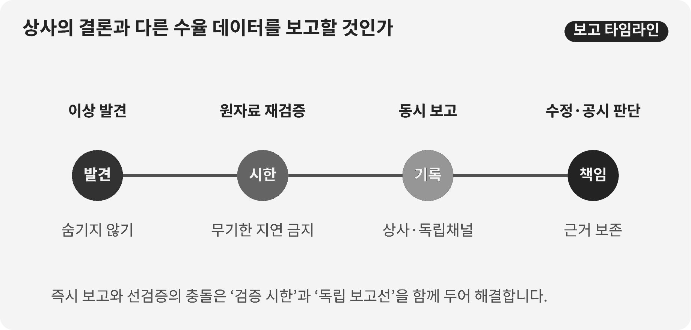

::: {.book-question}
[오늘의 책문]{.book-question-label}

{.book-question-image width=30mm fig-alt="서로 다른 수율 표를 사이에 두고 말할 용기와 검증 책임을 저울질하는 미니멀 수묵화 상징 삽화"}

[분기 실적 발표 직전에 상사의 결론과 다른 수율 데이터를 발견하면 신입사원도 즉시 보고해야 하는가?]{.book-question-prompt}
:::

1611년 광해군의 책문^[이 장과 연결한 실제 책문([策問]{.hanja})은 전란 뒤 국정을 수습할 우선순위를 묻습니다. 책문 아카이브가 뜻을 줄여 재구성한 한문은 “[今之國事，何者最急？用人、賦役、田政、戶籍，孰先孰後？]{.hanja}”이며 원문 직역은 아닙니다. “지금 국사에서 무엇이 가장 급한가. 인재 등용·부역·토지 행정·호적 가운데 무엇을 먼저 하고 무엇을 뒤에 할 것인가”라는 물음입니다. 오늘의 질문은 이 문장을 현대 조직에 그대로 번역한 것이 아니라, 위기 때 불편한 사실의 우선순위를 정하는 구조를 수율 보고에 적용한 재해석입니다.]은 좋은 일을 모두 나열하라고 하지 않았습니다. 무엇을 먼저 고칠지 선택하고 그 순서를 설명하라고 했습니다. 분기 발표를 앞둔 조직에도 같은 난점이 있습니다. 공시 일정을 지키는 일, 분석 오류를 재검증하는 일, 고객과 투자자에게 틀린 숫자가 나가지 않게 하는 일이 한꺼번에 급합니다.

신입사원의 직급이 낮다는 사실은 데이터의 진위를 결정하지 않습니다. 그렇다고 첫 계산을 곧바로 확정 사실처럼 유포해도 된다는 뜻은 아닙니다. 이 장의 쟁점은 ‘말할 용기’만이 아니라 **재현 가능한 증거, 제한된 검증 시간, 독립 보고선, 제보 뒤 보호**를 하나의 절차로 만드는 일입니다.

OECD 책임경영 가이드라인은 기업이 위험기반 실사와 고충처리 절차를 갖추도록 요구합니다. 현업에서 소수 의견은 곧 정답이 아니라, 되돌리기 어려운 발표 전에 재현과 독립 검증을 거쳐야 할 조기경보입니다.

## 왜 지금 이 질문인가

반도체 수율은 매출·원가·납기·고객 품질을 동시에 움직입니다. 그런데 같은 웨이퍼 기록도 제품군 제외 기준, 재작업품 처리, 검사 단계, 양품 정의, 집계 시점에 따라 다른 수율로 보일 수 있습니다. 숫자가 다르다는 사실만으로 허위 보고를 단정할 수 없고, ‘표본 정의가 다르다’는 말만으로 차이를 묻어 둘 수도 없습니다.

OECD의 2023년 다국적기업 책임경영 가이드라인은 기업 책임의 범위를 정보공개, 인권, 고용과 노사관계, 환경, 소비자 이해, 과학기술 등으로 넓게 둡니다. 책임경영은 신고함을 설치하는 것으로 끝나지 않습니다. 부정적 영향을 식별·평가하고, 예방·완화하고, 결과를 추적하며, 어떻게 처리했는지 소통하고, 필요하면 구제하는 과정이 이어져야 합니다.

신입 수율분석가가 당장 통제할 수 있는 것은 거대한 기업문화가 아닙니다. 원자료를 보존하고, 계산 환경을 고정하고, 차이가 생긴 행을 표시하고, 검증 담당자와 보고 시한을 기록하는 일입니다. 조직의 언로는 ‘회의에서 자유롭게 말할 수 있다’는 인상보다 **발견→검증 요청→의사결정자 통보→조치→재발 확인**의 시간이 얼마나 걸렸는지로 측정하는 편이 낫습니다.

## 데이터로 보기

{fig-alt="수율 92퍼센트와 89.8퍼센트의 차이를 독립 검증과 보고 흐름에 연결한 데이터 그림"}

### 근거 데이터 표

| 근거 | 원자료 또는 계산 | 성격 | 토론에서의 의미 |
|---:|---|---|---|
| 1 | OECD는 2023년 가이드라인에서 정보공개·인권·고용·환경·소비자 이해·과학기술 등을 책임경영의 주요 영역으로 다룹니다. | OECD 원문에 근거한 사실 | 수율 은폐 문제를 개인의 예절이 아니라 정보공개·고객 영향·기술 책임이 만나는 사안으로 봅니다. |
| 2 | 이 장의 근거자료는 언로를 익명제보 채널의 존재보다 보고 뒤 보복 여부, 조치 시차와 재발률로 측정해야 한다고 제안합니다. | 프로젝트 분석틀·통계 아님 | 제보 건수만이 아니라 보고가 실제 조치와 학습으로 이어졌는지 봅니다. |
| 3 | 반대 의견을 검토하는 시간과 최종 결정을 내리는 시간을 분리하면 숙의와 속도를 함께 설계할 수 있습니다. | 프로젝트 분석틀·통계 아님 | 검증을 무기한 미루지 않으면서 이견이 사라지지 않게 합니다. |
| 4 | 이 장의 사례에서는 발표안 92%와 재계산 89.8%가 2.2%포인트 차이 납니다. 불량률로 바꾸면 8%에서 10.2%로, 상대적으로 27.5% 증가합니다. | **토론용 가정의 산술 계산** | 수율 차이는 작아 보여도 불량 규모와 원가 관점에서는 훨씬 크게 보일 수 있습니다. 실제 회사 수치가 아닙니다. |

### 이 숫자를 읽는 법

첫째, **퍼센트와 %포인트를 구분**해야 합니다. 92%와 89.8%의 차이는 2.2%가 아니라 2.2%포인트입니다. 기준을 92%로 잡은 상대 감소율은 약 2.4%입니다.

둘째, 수율보다 불량률이 의사결정에 가까울 수 있습니다. 같은 가정에서 불량률은 8%에서 10.2%로 늘어 상대 증가율이 27.5%입니다. 다만 이 계산만으로 재무 손실을 확정할 수는 없습니다. 투입 웨이퍼 수, 다이 크기, 판매가능 등급, 재작업률, 고객 보상 조건이 필요합니다.

셋째, 집계 정의가 같아야 합니다. 두 숫자의 제품군·공정 단계·기간·재작업품 포함 여부가 다르면 비교가 성립하지 않습니다. 따라서 최초 보고문은 “수율이 틀렸다”보다 “동일한 원자료에 두 정의를 적용했을 때 2.2%포인트 차이가 재현됐다”처럼 써야 합니다.

넷째, OECD 자료는 특정 회사의 제보 효과를 측정한 통계가 아닙니다. 이 장은 가이드라인의 책임 절차를 수율 사례에 적용합니다. 보고 시차·보복 여부·조치 완료율·동일 오류 재발률은 **이 장이 제안하는 사내 운영지표**이지 OECD가 제시한 업계 평균값이 아닙니다.

## 대립 답안

### 답안 A — 즉시 보고론

발표 전에 발견한 중대한 차이는 직급과 무관하게 즉시 올려야 합니다. 잘못된 수율이 외부에 나간 뒤 수정하면 고객 생산계획, 원가 추정, 투자자 신뢰가 함께 손상될 수 있습니다. 신입이 침묵하면 상사는 반대 데이터를 보지 못한 채 결론을 확정할 수 있습니다. 원자료와 재현 절차를 붙여 감사·품질·공시 담당자에게 알리는 것은 조직에 대한 충성의 반대가 아니라 충성의 구체적 형태입니다.

약점도 있습니다. 분석 하나가 검증되기 전에 넓게 퍼지면 발표 준비가 중단되고, 접근 권한 밖의 민감정보가 유출되며, 정상적인 정의 차이가 부정행위 의혹으로 변할 수 있습니다. ‘즉시’는 전사 메일 발송이 아니라 정해진 독립 보고선에 지체 없이 접수한다는 뜻이어야 합니다.

### 답안 B — 선검증론

수율은 정의에 민감하므로 최소한의 이중검증을 거친 뒤 보고해야 합니다. 원자료 해시, 쿼리 버전, 제외 규칙과 샘플 기간을 맞추지 않으면 92%와 89.8%는 서로 다른 모집단의 숫자일 수 있습니다. 발표 직전의 제한된 시간을 소문과 해명에 쓰기보다 두 분석가가 독립적으로 재현하고 차이의 원인을 한 장으로 정리하는 편이 정확합니다.

그러나 ‘검증이 더 필요하다’는 말은 가장 흔한 지연 장치가 될 수 있습니다. 검증자와 종료 시한이 없고 직속 상사만 결론을 통제한다면 다음 분기로 미루자는 요구가 사실상 은폐로 작동합니다. 검증론은 시간제한과 상향 보고 조건을 반드시 가져야 합니다.

### 답안 C — 시간제한 독립검증론

저는 원자료를 즉시 동결하고 24시간 안에 독립 재현을 요청하며, 동시에 공시 책임자에게 ‘검증 중인 2.2%포인트 차이’가 존재함을 제한적으로 알리는 방식을 택하겠습니다. 독립 계산에서도 차이가 유지되거나 고객·재무 영향 임계값을 넘으면 직속 상사의 동의 없이 감사·품질·공시위원회로 올립니다. 반대로 정의를 통일했을 때 차이가 사라지면 분석 수정 기록을 남기고 발표안을 유지합니다.

이것은 즉시 보고와 선검증의 중간값이 아닙니다. **보고 대상·증거 수준·검증 기한·전환 조건을 미리 분리**하는 설계입니다. 반대 의견을 낼 시간은 보장하되 최종 결정 시각도 고정합니다.

## AI 조사 설계

### AI에게 물어볼 프롬프트

> 반도체 제조사의 수율 산정 차이와 내부 이견 해결 절차를 조사하십시오. ① 회사가 제공한 데이터 사전과 수율 공식, ② 원자료와 쿼리·코드 버전, ③ 공정·품질·생산의 승인권한, ④ 감사·공시 규정, ⑤ OECD 책임경영 가이드라인 순서로 확인하십시오. 92%와 89.8%의 모집단, 검사 단계, 기간, 재작업품·시험품 포함 여부를 표로 대조하고 차이를 %포인트, 상대 수율 변화, 불량률 변화로 각각 계산하십시오. 각 부서의 주장·근거·이해관계, 중립 중재자, 중단·재개 조건과 최종 승인자를 권한표로 만드십시오. 확인된 사실, 담당자의 주장, AI의 추론, 토론용 가정을 별도 열에 표시하고 개인 이름·제보자 신원·미공개 고객정보는 입력하지 마십시오. 결론에는 24시간 독립검증, 공시 보류 또는 유지 조건, 반대의견 보호, 결정로그 필드와 사후 재발점검을 포함하십시오.

### 데이터 취득

| 순서 | 자료 | 반드시 남길 항목 |
|---:|---|---|
| 1 | MES·검사장비·데이터웨어하우스 원자료 | 추출 시각, 로트·제품군, 공정 단계, 결측·중복, 원자료 해시 |
| 2 | 수율 쿼리와 분석 코드 | 저장소 버전, 분자·분모 정의, 제외 규칙, 재작업품 처리, 실행 환경 |
| 3 | 재무·고객 영향 자료 | 판매가능 등급, 폐기·재작업 원가, 고객 보상, 매출 인식과 공시 마감 |
| 4 | 사내 품질·감사·제보 규정 | 접수권자, 독립 검증자, 상향 보고선, 비밀유지, 보복 금지, 처리 시한 |
| 5 | OECD와 규제기관 원문 | 문서명, 발행연도, 적용 범위, 원문 URL, 회사 규정과 다른 부분 |

### 정보 판정

1. **재현성:** 다른 분석자가 같은 원자료와 코드로 같은 값을 얻는지 확인합니다.
2. **정의 일치:** 양품·투입량·재작업·시험 로트의 정의와 집계 기간을 맞춥니다.
3. **영향 분리:** 통계 차이, 고객 품질 영향, 재무·공시 중요성을 서로 다른 열에 둡니다.
4. **출처 등급:** 시스템 원장과 승인된 규정은 사실, 담당자 설명은 주장, AI의 원인 설명은 추론으로 표시합니다.
5. **보안:** AI에는 비식별 집계와 승인된 문서만 넣고 제보자·고객·공정 레시피 정보는 제외합니다.
6. **반증 기록:** 92%가 맞을 조건과 89.8%가 맞을 조건을 모두 적고 어느 검사가 이를 가르는지 지정합니다.

### 토론의 핵심

- 검증 전 경보를 누구까지 공유해야 정확성과 기밀성을 함께 지킬 수 있습니까?
- 수율 2.2%포인트가 공시·고객·품질 면에서 중대해지는 임계값은 누가 정합니까?
- 공정·품질·생산의 정의가 충돌할 때 KPI를 소유하지 않은 중재자는 누구입니까?
- 반대의견을 결정로그에 남기되 제기자의 평가·배치와 분리하려면 어떤 접근권한이 필요합니까?

## 사례형 토론

당신은 수율분석팀 입사 4개월 차 사원입니다. 경영진 발표안은 주력 제품군 수율을 92%로 적었지만, 원자료를 다시 계산하니 특정 저수율 제품군을 포함할 때 89.8%가 나왔습니다. 상사는 표본 정의 문제라며 다음 분기에 정리하자고 합니다. 발표 자료는 36시간 뒤 확정됩니다. 아래의 추가 수치는 모두 토론을 위한 가정입니다.

- 해당 분기 투입량은 10만 웨이퍼이며, 제품 믹스 차이를 보정하지 않은 단순 집계입니다.
- 독립 분석가 한 명이 재현하는 데 8시간, 재무 영향의 1차 추정에 6시간이 필요합니다.
- 사내 가상 규정은 수율 차이 0.5%포인트 이상 또는 예상 손실 5억 원 이상이면 품질책임자에게 24시간 안에 통보하도록 정합니다.
- 직속 상사를 거치지 않는 감사 채널은 있으나, 접수 사실을 상사가 알 수 있다는 우려가 있습니다.

같은 원자료를 두고 해석이 갈립니다. 공정팀은 저수율 제품이 개발 단계라 양산 수율에서 분리해야 한다고 봅니다. 생산팀은 재작업 완료 전 잠정값으로 발표 일정을 유지하자고 합니다. 품질팀은 고객에게 출하될 제품이면 현재 모집단에 포함해야 한다고 봅니다. 세 주장 모두 검증할 부분이 있으며 어느 팀도 부정행위자로 전제하지 않습니다.

역할과 권한을 나눕니다. 신입 분석가는 원자료·코드·차이 행을 보존합니다. 공정·생산·품질팀은 8시간 안에 각자의 분자·분모와 근거 규정을 제출합니다. KPI를 소유하지 않은 데이터 거버넌스 책임자가 중재하고, 품질책임자는 출하 보류, 공시위원회는 발표 보류·재개를 승인합니다. 감사 담당자는 결정로그와 반대의견 제기자의 신원 접근권을 관리합니다. 로그에는 각 주장, 사용한 데이터·코드 버전, 반증 결과, 최종 권한자, 유효기간, 재심 조건을 남깁니다.

팀은 **발표 유지 후 사후 수정, 24시간 독립검증과 조건부 보류, 즉시 발표 연기** 가운데 하나를 선택해야 합니다. 정의를 맞춘 차이가 0.5%포인트 이상이거나 예상 손실이 5억 원 이상이거나 원자료 추적이 끊기면 발표를 중단한다는 가상 조건도 검토합니다. 최종안에는 첫 8시간의 작업, 24시간 중재회의, 36시간 발표 결정, 부서별 권한, 결정로그, 제보자 신원 접근권, 평가상 불이익 점검과 30일 뒤 재발검사를 넣으십시오.

## 90초 발언 예시

“저는 **답안 A, 독립 보고선에 즉시 알리고 발표를 먼저 멈추겠습니다.** OECD의 2023년 책임경영 가이드라인은 정보 공개와 과학기술 책임을 주요 영역으로 다룹니다. 다만 사례의 수율 92%와 89.8%, 차이 2.2%포인트, 내부 기준 0.5%포인트와 손실 5억 원은 모두 가정입니다. 가장 강한 반론은 정상적인 정의 차이를 성급히 비위로 키울 수 있다는 것입니다. 그래서 전사에 의혹을 퍼뜨리지 않고 원자료 해시와 코드 버전을 동결해 감사·품질·공시 책임자에게만 접수하겠습니다. KPI를 소유하지 않은 책임자가 24시간 안에 분자·분모와 근거 규정을 맞추게 하겠습니다. 정의를 통일한 차이가 0.5%포인트 미만이고 원자료 추적이 완전하면 수정 근거와 반대 의견을 남긴 뒤 발표를 재개하겠습니다. 반대로 차이가 유지되거나 원자료 추적이 끊기면 연기를 확정하겠습니다. 보고는 의혹의 확정이 아니라 검증을 시작하는 조치이며, 발표 속도보다 되돌릴 수 없는 오공시를 먼저 막아야 합니다.”

## 꼬리 질문

**교차질문과 재반박**

- 공정·품질·생산이 서로 다른 수율 정의를 규정 근거와 함께 제시하면 중재자는 무엇을 최종 모집단으로 정해야 합니까?
- 독립 재현 결과가 90.4%라면 하나의 숫자를 택하겠습니까, 정의별 값을 함께 발표하겠습니까?
- 품질책임자와 공시위원회의 결론이 다르면 출하와 발표 권한을 어떻게 분리하겠습니까?
- 결정로그에 반드시 남길 항목과 제보자 신원에서 분리할 항목은 각각 무엇입니까?
- 제기자의 분석이 틀렸을 때도 보호하되 고의적 조작을 구분하려면 어떤 절차가 필요합니까?
- 발표를 유지한 뒤 같은 오류가 30일 안에 재발하면 어느 권한과 산정 규칙을 바꾸겠습니까?

## 출처

- [OECD, *OECD Guidelines for Multinational Enterprises on Responsible Business Conduct* (2023)](https://www.oecd.org/en/publications/oecd-guidelines-for-multinational-enterprises-on-responsible-business-conduct_81f92357-en.html)
- [OECD, Responsible Business Conduct—위험기반 실사와 고충처리 개요 (2026 열람)](https://www.oecd.org/en/topics/responsible-business-conduct.html)
- [조선시대 책문 아카이브, 광해군 1611년 「임진왜란 뒤 가장 시급한 일」](https://waterfirst.github.io/Joseon-Dynasty-Civil-Service-Examination/#gwanghae-1611/0)
- [한국학중앙연구원, 1611년 시험 기록](https://dh.aks.ac.kr/~sonamu5/wiki/index.php/%EA%B4%91%ED%95%B4%28%E5%85%89%E6%B5%B7%29_3%EB%85%84%281611%29_%EC%8B%A0%ED%95%B4%28%E8%BE%9B%E4%BA%A5%29_%EB%B3%84%EC%8B%9C%28%E5%88%A5%E8%A9%A6%29)

> **자료 메모:** 92%·89.8%·10만 웨이퍼·0.5%포인트·5억 원·8시간·36시간은 모두 이 장의 토론을 위해 만든 가정이며 실제 기업 실적이 아닙니다. OECD 가이드라인의 내용과 사례 수치를 섞어 읽지 않습니다.
