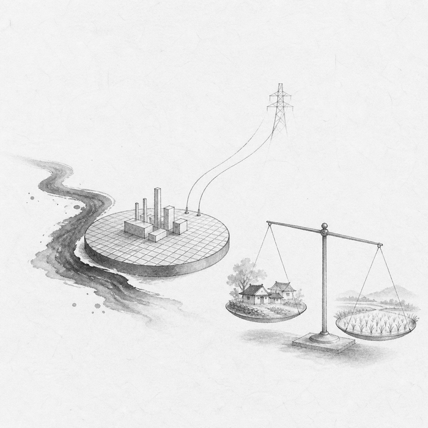
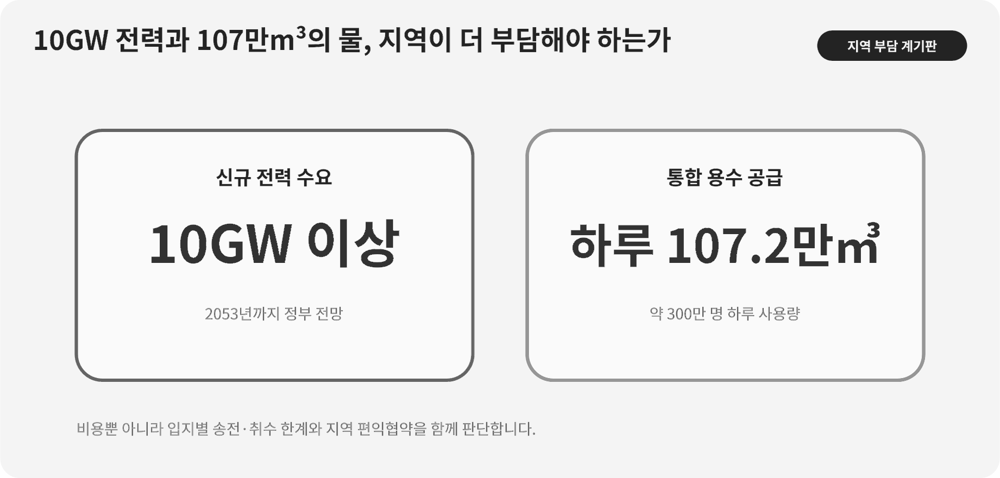

::: {.book-question}
[오늘의 책문]{.book-question-label}

{.book-question-image width=30mm fig-alt="산업단지로 향하는 물길과 송전선, 지역 마을을 한 화면에 담은 미니멀 수묵화 상징 삽화"}

[국가 반도체 클러스터를 위해 특정 지역이 송전선·용수·생활비용을 더 부담해야 하는가?]{.book-question-prompt}
:::

1798년 정조의 호남 책문^[이 장이 연결한 실제 책문([策問]{.hanja})은 호남의 삶과 지역 잠재력을 함께 살릴 방책을 물었습니다. 아카이브에 제시된 첫 원문은 “[王若曰，湖南一路卽我朝興王之地也。]{.hanja}”, 곧 “왕은 이르노라. 호남 한 도는 우리 왕조가 일어난 땅이다”입니다. 오늘의 질문은 당시 폐단을 현대 산업단지에 그대로 대응시킨 번역이 아니라, 중앙의 목적과 지역 주민의 생활을 동시에 보라는 문제 구조를 빌린 것입니다.]은 지역을 국가의 자원 창고로만 보지 않았습니다. 인재와 물산이 풍부한 곳이라도 부담이 한쪽에 쌓이면 잠재력이 폐단으로 바뀔 수 있다고 물었습니다.

반도체 클러스터의 전력과 물은 공장 담장 안에서만 생기고 사라지지 않습니다. 발전소·송전망·취수원·정수장·폐수처리장·주거와 교통이 여러 지역을 잇습니다. 따라서 “국가 전략이니 지역이 감수해야 한다”와 “지역이 반대하니 건설하지 말자” 사이에는 실제 사용량, 환경 한계, 단계별 투자, 편익 배분을 설계하는 넓은 실무가 있습니다.

## 왜 지금 이 질문인가

대한민국 정부가 2024년 공개한 용인 반도체 클러스터 전력·용수 계획은 2053년까지 10GW 이상의 신규 전력과 하루 약 107.2만m³의 통합 용수 공급을 제시했습니다. 정부는 이 물의 양을 인구 약 300만 명의 하루 사용량과 비슷하다고 설명했습니다. 이 숫자는 산업 규모를 보여주지만, 현재 모든 공장이 그만큼 쓰고 있다는 뜻은 아닙니다. 장기간에 걸친 계획 용량입니다.

신입 환경담당자가 가장 먼저 할 일은 찬반 구호가 아니라 단위를 바로잡는 것입니다. 10GW는 특정 순간의 전력 **용량**이고, GWh나 TWh는 일정 기간의 **전력량**입니다. 하루 107.2만m³는 취수량인지 공급량인지, 공정 사용량인지, 재이용수가 포함된 총순환량인지 정의가 필요합니다. 공장별 가동률과 공정 세대가 바뀌면 실제 수요도 달라집니다.

지역 부담 역시 한 숫자로 합칠 수 없습니다. 취수 지역의 하천유량, 송전선 경과지의 토지·경관, 공장 소재지의 세수와 고용, 인근 도시의 주거비와 교통, 하류의 수질 영향을 나누어야 합니다. 혜택을 받는 지자체와 부담을 지는 지자체가 다를 수 있기 때문입니다.

## 데이터 렌즈

{fig-alt="용인 반도체 클러스터에 계획된 신규 전력 용량과 하루 용수 공급 규모, 지역 부담의 확인 항목을 보여주는 데이터 그림"}

### 근거 데이터 표

| 근거 | 원자료의 수치·범위 | 성격 | 토론에서의 의미 |
|---:|---|---|---|
| 1 | 정부 계획은 용인 반도체 클러스터에 **2053년까지 10GW 이상**의 신규 전력이 필요하다고 제시합니다. | 정부의 장기 계획치 | 현재 소비전력이나 확정된 연간 사용량이 아니라 단계별 수요 전망입니다. |
| 2 | 통합 용수 공급 규모는 **하루 약 107.2만m³**로 제시됐습니다. | 정부의 장기 공급 계획치 | 공장별 순사용량, 재이용량, 취수원별 부담을 추가로 확인해야 합니다. |
| 3 | 정부는 하루 107.2만m³를 **인구 약 300만 명의 하루 물 사용량**과 비슷하다고 설명했습니다. | 정부의 규모 비교 | 직관을 돕는 비유이지 산업용수와 생활용수의 권리를 단순 교환할 수 있다는 뜻은 아닙니다. |
| 4 | 107.2만m³를 300만 명으로 나누면 한 사람당 하루 약 **0.357m³, 즉 357L**입니다. | 위 정부 수치의 산술 환산 | 비교의 분모를 드러냅니다. 실제 국민 1인당 사용량을 새로 측정한 통계가 아닙니다. |
| 5 | 이 장의 사례는 1단계 실제 사용이 계획 용수의 68%, 주민 요구 재이용률이 70%라고 가정합니다. | **토론용 가정** | 공식 사업 실적이 아니며 단계투자 규칙을 연습하기 위한 조건입니다. |

### 이 숫자를 읽는 법

첫째, **계획 최대치와 관측 실적을 분리**합니다. 2053년까지 필요한 설비 규모를 현재의 낭비로 단정하면 안 됩니다. 반대로 미래 계획이라는 이유로 취수원과 송전 경로의 누적 영향을 미뤄서도 안 됩니다.

둘째, 전력 용량과 전력량을 혼동하지 않습니다. 10GW 설비가 일 년 내내 전부 가동된다는 가정은 별도입니다. 실제 전력량은 시간대별 부하, 가동률, 정비, 자체발전과 저장장치에 따라 달라집니다.

셋째, 물에는 세 개의 분모가 필요합니다. 외부에서 새로 취수한 **순취수량**, 공장에 공급한 **총공급량**, 공정 안에서 다시 쓴 **재이용량**입니다. 재이용률이 높아져도 농축폐수 처리와 에너지 사용이 늘 수 있으므로 수질과 전력도 함께 봅니다.

넷째, 300만 명 비교는 규모를 이해하는 장치입니다. 생활용수와 초순수는 처리 수준·용도·회수 가능성이 다릅니다. 숫자가 같다고 사회적 가치나 환경 영향까지 같아지는 것은 아닙니다.

## 대립 답안

### 답안 A — 선투자론

대형 팹은 전력과 물이 준비되지 않으면 장비를 들여놓을 수 없습니다. 송전망과 광역 용수관은 인허가와 공사에 오래 걸리므로 실제 수요가 확인된 뒤 시작하면 투자 시기를 놓칠 수 있습니다. 국가 공급망과 양질의 일자리가 만드는 편익은 공장 소재지를 넘어가므로 중앙정부와 기업이 광역 기반시설을 미리 확보할 이유가 있습니다.

다만 선투자는 수요가 줄거나 공정이 더 효율적으로 바뀔 때 유휴자산을 남길 수 있습니다. ‘국가 전략’이라는 말이 비용 검증과 지역 동의를 생략하는 면허가 되어서는 안 됩니다.

### 답안 B — 지역한계 우선론

취수·송전·주거 부담은 구체적인 마을과 생태계에 집중됩니다. 편익을 전국이 누린다면 해당 지역에만 토지 손실, 요금 상승, 수질 위험을 맡기는 것은 불공정합니다. 하천 유지유량, 비상시 생활용수, 누적 송전선 밀도 같은 한계선을 먼저 정하고 그 범위 안에서만 공장을 늘려야 합니다.

그러나 모든 불확실성이 사라질 때까지 투자를 미루면 기반시설 병목이 커지고 기업이 다른 거점을 택할 수 있습니다. 지역 보호론도 필요한 정보와 협상 시한을 제시해야 실무안이 됩니다.

### 답안 C — 단계승인·편익협약론

저는 광역 관로의 공용 구간은 먼저 준비하되 공장별 접속과 증설은 실제 사용률·재이용률·환경 한계에 연동하겠습니다. 기업은 순취수량, 시간대별 전력, 폐수 수질, 재이용 실적을 공장 단위로 공개하고, 정부와 운영사는 취수·송전 경과 지역에 요금·기금·주민사업·비상공급을 묶은 편익협약을 체결해야 합니다.

단계투자는 “조금씩 해 보자”가 아닙니다. 예를 들어 1단계 사용률이 일정 기간 80%를 넘고 재이용률과 하천유량 기준을 지켰을 때만 다음 접속을 승인하는 식으로 **승인 조건과 중단 조건**을 문서화하는 방식입니다. 임계값 자체는 지역 수문자료와 공정계획으로 정해야 하며, 이 장의 사례 값은 가정입니다.

## AI 조사 설계

### AI에게 물어볼 프롬프트

> 용인 반도체 클러스터의 전력·용수 계획과 지역 부담을 조사하십시오. ① 산업통상자원부·환경부·국토교통부·지자체의 협약 및 환경자료, ② 전력망·용수시설 사업계획, ③ 기업의 지속가능경영 자료와 공장별 허가문서, ④ 주민·의회 자료 순서로 찾으십시오. 10GW는 설비용량인지 최대수요인지, 107.2만m³/일은 취수·공급·사용·재이용 중 무엇인지 원문 문구와 함께 기록하십시오. 계획치, 허가치, 실제 측정치, 사업자 주장, 주민 주장, AI 추론을 구분하십시오. 취수원·송전 경과지·공장 소재지별 편익과 비용을 표로 만들고, 단계별 증설의 승인·중단·보상 조건을 제안하십시오. 출처마다 기관, 문서명, 발표일, 단위, 대상연도와 직접 URL을 제시하고 확인되지 않은 공장별 사용량을 추정 사실처럼 쓰지 마십시오.

### 데이터 취득

| 우선순위 | 자료 | 확인할 항목 |
|---:|---|---|
| 1 | 정부 협약·기본계획·환경영향 자료 | 목표연도, 계획용량, 사업구간, 취수원, 송전 경로, 단계별 준공일 |
| 2 | 공장 인허가·운영자료 | 허가량, 실제 순취수·총공급, 재이용량, 시간대별 최대전력, 가동률 |
| 3 | 수문·전력망 측정자료 | 갈수기 유량, 수질, 계통 여유, 정전·제약 시간, 비상공급 능력 |
| 4 | 지역 재정·생활 자료 | 세수·고용, 보상 대상, 주거비·교통, 농업·생활용수 영향 |
| 5 | 주민 협의와 민원 처리 | 참여 시점, 대안 비교, 이의제기, 조치기한, 독립검증 결과 |

### 정보 판정

1. **단위:** GW와 GWh, m³/일과 연간 m³, 공급량과 순취수량을 구분합니다.
2. **시간:** 2053년 계획값을 현재 실적으로 쓰지 않고 단계별 준공·가동 시점을 맞춥니다.
3. **공간:** 편익을 받는 지역과 취수·송전 부담을 지는 지역을 따로 표시합니다.
4. **수지:** 재이용률의 분자·분모와 증발·제품 포함·방류를 포함한 물수지를 확인합니다.
5. **추가성:** 재생전력 계약이 새 설비를 늘리는지, 기존 전력을 명목상 배분하는지 확인합니다.
6. **불확실성:** 기업 증설계획과 실제 투자결정 사이의 차이를 범위로 제시합니다.

### 토론의 핵심

- 장기 수요에 앞서 투자할 공용 구간과 실적 뒤 승인할 전용 구간을 어떻게 나눕니까?
- 순취수량·재이용률·갈수기 유량 가운데 증설을 멈출 핵심 지표는 무엇입니까?
- 공장 소재지와 송전·취수 경과지가 다를 때 편익협약의 돈과 권한을 어떻게 배분합니까?
- 공장 효율이 좋아져도 생산량이 늘어 총사용량이 증가하면 약속을 지켰다고 볼 수 있습니까?

## 사례형 토론

당신은 클러스터 운영사에 입사한 신입 환경담당자입니다. 1단계 공장의 실제 용수 사용은 계획량의 68%이지만, 2단계 송수관 공사를 지금 발주하지 않으면 예정 가동보다 30개월 늦어질 수 있습니다. 주민협의회는 재이용률 70%와 공장별 월간 사용량 공개를 요구합니다. 다음 추가 수치는 토론용 가정입니다.

- 2단계 관로 총사업비는 1조4천억 원이며 지금 발주하면 15%를 중도 취소비로 부담합니다.
- 최근 3년 갈수기 중 한 해에는 취수원 유량이 환경 한계선보다 6% 높았을 뿐입니다.
- 1단계의 현재 재이용률은 58%, 2년 안에 70%로 높이는 설비비는 1천2백억 원입니다.
- 전면 보류 시 신규 팹 고객 인증 일정이 최대 18개월 밀릴 수 있습니다.

신입 담당자는 **전 구간 선투자, 공용 구간만 선투자하고 공장 접속은 단계승인, 2년 보류** 가운데 하나를 운영위원회에 제안해야 합니다. 기업 측은 일정과 비용을, 지자체는 세수·주거·교통을, 주민은 물·송전·생태 영향을, 독립전문가는 수문과 계통 자료를 맡습니다.

최종 협약에는 월별 순취수·재이용·방류 수질 공개, 갈수기 감축 순서, 다음 단계 승인 조건, 중도 취소비 부담, 주민 검증권, 지역기금의 산식과 사용처를 넣으십시오. 모든 가정값을 정부 계획치와 별도 표기해야 합니다.

## 90초 발언 예시

“저는 공용 구간은 선투자하되 공장별 접속은 단계 승인하는 조건부 안을 선택하겠습니다. 정부가 제시한 2053년까지 10GW 이상과 하루 107.2만m³는 클러스터의 장기 규모이지 현재 실적이 아닙니다. 하루 107.2만m³를 정부가 비교한 300만 명으로 나누면 약 357L이지만, 생활용수와 산업용수의 가치가 같다는 뜻도 아닙니다. 지금 사례에서 1단계 사용률은 계획의 68%이고 재이용률은 58%라는 가정이므로 1조4천억 원 전 구간을 즉시 확정하기에는 수요와 환경 불확실성이 큽니다. 반대로 전면 보류하면 관로와 고객 인증이 최대 18~30개월 늦어질 수 있습니다. 그래서 되돌릴 수 있는 공용 구간만 발주하고, 재이용률 70% 달성, 월별 순취수 공개, 갈수기 유량 기준 준수, 1단계 사용률 80% 초과가 6개월 지속될 때 공장 접속을 승인하겠습니다. 취수원 유량이 한계선의 5% 이내로 내려가면 증설을 멈추고 생산 감축 순서를 가동하겠습니다. 이 80%·6개월·5%는 토론용 임계값이며 실제 값은 환경영향 자료와 주민협의로 정해야 합니다. 임흥원이 총량보다 부담의 역진성을 먼저 살폈듯(의역), 투자액보다 취수·송전·취소 비용을 누가 떠안는지 먼저 공개하겠습니다.^[임흥원의 1798년 호남 별시 대책은 부유한 집의 부담은 가볍고 가난한 집의 부담은 무거운 조세 폐단을 먼저 짚었다는 취지입니다(현대어 의역). 한국학호남진흥원과 『정조실록』은 고정봉과 임흥원을 최고점 두 사람으로 기록하고 두 사람에게 직부전시 자격을 주었다고 확인합니다. 따라서 ‘공동 장원’이라고 부르지 않습니다. 이 문장은 현대 정책의 권위가 아니라 총량보다 부담의 분포를 먼저 보는 사고법의 선례로만 인용했습니다. [책문 아카이브 개별 항목](https://waterfirst.github.io/Joseon-Dynasty-Civil-Service-Examination/#jeongjo-1798/0), [한국학호남진흥원, 「광주의 풍교를 다스린 광주향교」(2021)](https://www.hiks.or.kr/HonamHeritage/19/read/629), [국사편찬위원회 『정조실록』 정조 22년 6월 18일](https://sillok.history.go.kr/id/kva_12206018_002)] 국가 전략의 비용을 특정 지역의 침묵으로 조달해서는 안 됩니다.”

## 꼬리 질문

**교차질문과 재반박**

- 10GW가 최대수요인지 접속용량인지 정부 문서가 모호하다면 어떤 자료로 보정하겠습니까?
- 재이용률 70%를 달성했지만 농축폐수 처리 전력이 크게 늘면 환경 성과를 어떻게 판정합니까?
- 공장 소재지는 세수를 얻고 송전 경과지는 토지 부담만 진다면 보상 산식을 무엇에 연동하겠습니까?
- 갈수기 생활용수와 산업용수가 충돌할 때 감축 순서를 누가 어떤 기준으로 정해야 합니까?
- 사용률이 68%여도 다음 단계의 고객 계약이 확정됐다면 선투자 조건을 완화하겠습니까?
- 주민이 기업의 영업비밀을 이유로 공장별 사용량을 받지 못한다면 어느 수준까지 공개해야 합니까?

## 출처

- [대한민국 정부 정책브리핑, 용인 반도체 클러스터 전력·용수 공급 협약 자료 (2024)](https://www.korea.kr/common/docViewer.do?fileId=197961931&tblKey=GMN)
- [조선시대 책문 아카이브, 정조 1798년 「호남의 일곱 폐단과 해법」](https://waterfirst.github.io/Joseon-Dynasty-Civil-Service-Examination/#jeongjo-1798/0)
- [한국학중앙연구원 한국고문서자료관, 1798년 응제 관련 기록](https://archive.aks.ac.kr/search/list.do?fq=com_%EC%97%B0%EB%8F%84_fct%3A1798%EB%85%84%28%EC%A0%95%EC%A1%B022%29&fq=com_%EC%B0%B8%EA%B3%A0%EB%AC%B8%ED%97%8C_fct%3A%E3%80%8E%ED%95%9C%EA%B5%AD%EC%9D%98+%EA%B3%BC%EA%B1%B0%EC%A0%9C%EB%8F%84%E3%80%8F&q=query&sortField=%EC%9E%91%EC%84%B1%EB%85%84%EB%8F%84)

> **자료 메모:** 10GW·107.2만m³/일·300만 명은 정부 자료의 장기 계획·비교 수치입니다. 68%·70%·30개월·1조4천억 원·15%·6%·58%·1천2백억 원·18개월과 모범답안의 임계값은 모두 토론용 가정입니다.
