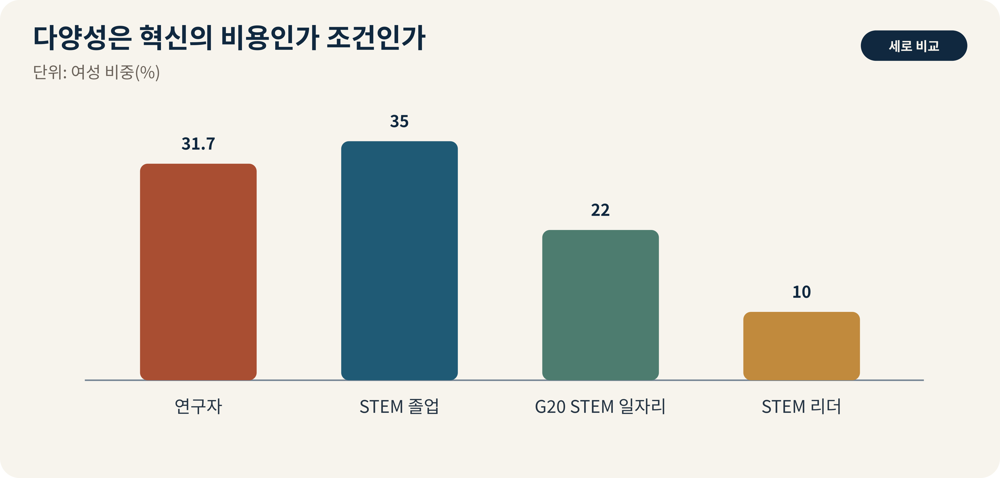

::: {.book-question}
[오늘의 책문]{.book-question-label}

{.book-question-image width=30mm fig-alt="다양성은 혁신의 비용인가 조건인가 상징 삽화"}

[반도체 조직의 성별·전공·세대 다양성을 성과지표로 관리해야 하는가?]{.book-question-prompt}
:::

조선의 모티브는 **인재 등용 책문—같은 문벌의 익숙함과 낯선 인재의 가능성 중 무엇을 택할 것인가**입니다. 책문은 사실을 많이 아는 사람보다, 충돌하는 가치의 우선순위와 자기 답이 실패할 조건을 밝히는 사람을 가려냈습니다. 오늘의 응시자는 이 질문을 산업의 숫자와 인간의 비용을 함께 놓고 답해야 합니다.

## 왜 지금 이 질문인가

채용·승진·이탈, 특허팀 구성, 안전장비 적합성, 교대근무, 임금과 심리적 안전을 봅니다. 이 주제를 단순한 찬반으로 만들면 중요한 당사자가 사라집니다. 공급망의 비용은 구매팀만, AI의 위험은 개발팀만, 노동의 전환은 개인만 책임지는 문제가 아닙니다. 결정권·편익·손실이 누구에게 배분되는지까지 보여야 토론이 산업 분석이 됩니다.

## 데이터 렌즈

{fig-alt="다양성은 혁신의 비용인가 조건인가 핵심 데이터"}

### 근거 데이터 표

| 근거 번호 | 토론에 쓸 수 있는 검증 문장 |
|---:|---|
| 1 | UNESCO는 여성 연구자 비중을 31.7%로 제시했습니다. |
| 2 | 세계 STEM 졸업자의 여성 비중은 35%, G20 STEM 일자리에서는 22%다. |
| 3 | STEM 리더 중 여성은 10명 중 1명 수준입니다. |

첫 번째 숫자는 문제의 **규모**를, 두 번째는 **분배**를, 세 번째는 **시간축 또는 제약조건**을 보여줍니다. 다만 숫자는 결론이 아닙니다. 집계 범위가 다른 자료를 한 그래프에서 직접 비교하지 말고, 전망치는 사실값이 아니라 가정의 결과라고 밝혀야 합니다. 기업·정부·군의 발표는 이해관계가 있는 1차 자료이므로 독립 통계와 대조합니다.

### 숫자가 말하지 못하는 것

- 평균은 지역·직무·기업규모별 격차를 숨길 수 있습니다.
- 비용으로 계산되지 않은 안전, 존엄, 환경, 장기 역량은 의사결정표에서 쉽게 사라집니다.
- 사건 뒤의 상관관계가 정책이나 기술의 인과효과를 자동으로 증명하지 않습니다.

따라서 면접에서는 숫자를 많이 외우기보다 **숫자의 정의와 결론이 바뀌는 임계값**을 말하는 편이 강합니다. 예를 들어 “공급선이 두 개”보다 “두 번째 공급선이 같은 원료·항만·인증 설비를 공유하는가”가 복원력을 더 잘 묻습니다.

## 대립 답안

### 답안 A — 적극론

동질적 조직의 사각지대를 줄이려면 목표와 데이터가 필요합니다.

이 답의 강점은 결정 지연의 비용을 본다는 데 있습니다. 위기가 실제이고 대체시간이 길다면, 평시의 최적비용보다 행동 속도가 중요합니다. 약점은 정책이나 투자의 편익을 크게, 숨은 비용을 작게 추정하기 쉽다는 점입니다.

### 답안 B — 경계론

숫자 목표가 개인을 정체성의 대표로 만들고 실질적 포용을 가릴 수 있습니다.

이 답의 강점은 과잉대응과 권력 집중을 견제한다는 데 있습니다. 약점은 시장이나 기존 제도가 충분히 빠르게 조정될 것이라는 가정을 숨길 수 있다는 점입니다. 아무것도 하지 않는 선택에도 피해자와 비용이 있다는 사실을 계산해야 합니다.

### 답안 C — 조건부론

대표성, 공정한 과정, 팀 성과, 이탈 사유를 함께 보며 단일 할당 지표에 의존하지 않아야 합니다.

## 판정 조건

조건부론은 가운데에 서는 타협이 아닙니다. 무엇을 측정해 어느 임계값에서 A에서 B로, 또는 B에서 A로 전환할지 정하는 답입니다. 의사결정자는 효율·회복탄력성·분배·가역성·설명책임 가운데 최소 세 축을 공개해야 합니다.

## 사례형 토론

당신은 반도체 기업의 전략 태스크포스에 참여했습니다. 이사회는 48시간 안에 투자·조달·운영 원칙을 정하라고 요구합니다. 동시에 재무팀은 비용 증가를, 현장팀은 실행 가능성을, 노동자·지역사회는 안전과 부담을 문제 삼습니다.

1. 첫 결정에서 보호할 최우선 가치를 하나만 고릅니다.
2. 그 선택으로 손해를 보는 집단을 명시합니다.
3. 90일 안에 확인할 선행지표 두 개와 결과지표 한 개를 정합니다.
4. 결정을 중단하거나 뒤집을 수치·사건을 사전에 약속합니다.

## 90초 발언 예시

“제 결론은 **대표성, 공정한 과정, 팀 성과, 이탈 사유를 함께 보며 단일 할당 지표에 의존하지 않아야 한다**라고 봅니다. 근거로 먼저 UNESCO는 여성 연구자 비중을 31.7%로 제시했습니다. 다음으로 세계 STEM 졸업자의 여성 비중은 35%, G20 STEM 일자리에서는 22%다. 이 두 수치는 문제의 규모와 편익이 자동으로 같은 곳에 가지 않는다는 점을 보여줍니다. 적극론의 장점은 행동 지연을 줄이는 것이지만, 비용과 권한이 고착될 위험이 있습니다. 반대로 경계론은 과잉대응을 막지만 아무것도 하지 않는 비용을 과소평가할 수 있습니다. 그래서 저는 90일 단위로 공개 지표를 점검하고, 사전에 정한 임계값을 넘으면 정책을 확대하되 넘지 못하면 축소하겠습니다. 확인하지 못한 숫자는 단정하지 않고 원출처와 정의부터 검증하겠습니다.”

이 문장을 외우지 말고 **결론 → 데이터 2개 → 강한 반론 → 전환 조건**의 순서를 익힙니다. 집단토론에서는 상대방의 말을 요약한 뒤 빠진 지표를 보태야 점수를 얻습니다.

## 꼬리 질문

**교차질문과 재반박**

- 적극론이 가정한 피해 규모가 절반이라도 같은 결론인가?
- 경계론이 말하는 시장 조정은 몇 개월 안에 일어나야 의미가 있는가?
- 비용을 가장 많이 부담하지만 데이터에 잡히지 않는 사람은 누구인가?
- 같은 원칙을 경쟁국·경쟁사에도 적용해도 받아들일 수 있는가?
- 첫 번째와 두 번째 핵심 수치 가운데 어느 것이 바뀌면 결론을 수정할 것인가?
- 결정이 실패했을 때 책임자가 실제로 통제할 수 있었던 변수는 무엇인가?

## 출처

- [UNESCO gender gap in science](https://www.unesco.org/en/science-technology-and-innovation/cta)
- [UNESCO women in science data](https://uis.unesco.org/en/topic/women-science)

- [조선시대 책문 아카이브](https://waterfirst.github.io/Joseon-Dynasty-Civil-Service-Examination/)

> 데이터 기준일: 각 원출처의 표기 연도. 최신성이 중요한 수치는 상업 발행 직전에 다시 확인합니다.
