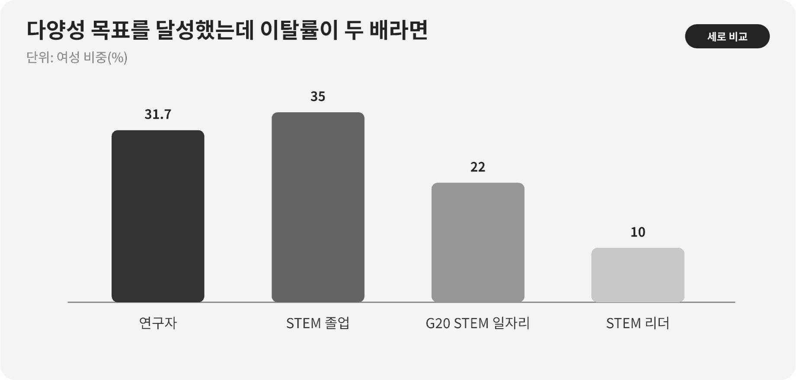

::: {.book-question}
[오늘의 책문]{.book-question-label}

{.book-question-image width=30mm fig-alt="서로 다른 사람들이 같은 팹 출입문을 통과한 뒤 갈라지는 경로를 그린 미니멀 수묵화 상징 삽화"}

[채용 다양성 목표를 달성했어도 특정 집단의 2년 이탈률이 두 배라면 성공이라고 평가할 수 있는가?]{.book-question-prompt}
:::

1447년 세종대 인재 책문^[이 장과 연결한 실제 책문([策問]{.hanja})은 인재를 기르고 알아보고 맡기는 법을 물었습니다. 책문 아카이브가 뜻을 줄여 재구성한 한문은 “[人才國之寶也。何以養之、辨之、用之？君臣相遇之難，其故何歟？]{.hanja}”이며 원문 직역은 아닙니다. “인재는 나라의 보배다. 어떻게 기르고, 분별하고, 쓸 것인가. 임금과 신하가 서로 만나기 어려운 까닭은 무엇인가”라는 물음입니다. 오늘의 질문은 당시의 신분·관료제를 현대 채용에 옮긴 번역이 아니라, 뽑는 일과 역량을 펼치게 하는 일을 분리하지 말라는 질문 구조를 빌린 것입니다.]은 인재를 ‘찾는 것’에서 끝나지 않았습니다. 알아보고 적절히 맡기며 오래 일할 조건까지 물었습니다. 현대 기업도 채용 비율만으로 다양성을 완성했다고 말할 수 없습니다.

반도체 현장은 연구개발, 설계, 생산, 장비 유지, 품질과 교대근무가 긴밀히 연결됩니다. 같은 직급으로 입사해도 첫 배치, 핵심 프로젝트 접근, 안전장비의 적합성, 야간근무, 멘토와 발언권이 다르면 경력의 속도가 달라집니다. 따라서 대표성은 입구의 숫자이고 포용은 경로의 데이터입니다.

## 왜 지금 이 질문인가

UNESCO의 과학 분야 성별 격차 자료는 세계 여성 연구자 비중을 약 3분의 1로 제시합니다. 프로젝트 근거자료에는 31.7%가 제시돼 있고, 같은 UNESCO 페이지는 STEM 졸업자의 여성 비중을 35%, G20 STEM 일자리의 여성 비중을 22%, STEM 리더는 10명 중 1명 수준이라고 설명합니다. 교육을 마친 비율, 직업에 진입한 비율, 리더가 된 비율이 서로 다릅니다.

이 세계 통계를 특정 한국 반도체 회사의 채용 목표로 그대로 옮길 수는 없습니다. 국가·전공·직무·연령·자료연도가 다르고, 여성이라는 범주 안의 경험도 같지 않습니다. 다만 입구에서 리더십까지 단계가 내려가는 모양은 회사가 어느 전환점에서 인재를 잃는지 묻게 합니다.

신입 인사데이터 담당자의 일은 사람을 정체성 하나로 평가하는 것이 아닙니다. 같은 입사 코호트에서 지원·면접·채용·배치·교육·핵심과제·승진·임금·이탈을 추적하고, 개인을 식별하지 않는 최소 표본 규칙을 세우는 것입니다. 이탈률이 높다면 ‘적응하지 못했다’는 설명보다 근무표, 관리자, 승진대기, 안전과 괴롭힘 처리, 돌봄 조건을 먼저 비교해야 합니다.

## 데이터 렌즈

{fig-alt="여성 연구자, STEM 졸업자, G20 STEM 일자리, STEM 리더 비중을 비교한 데이터 그림"}

### 근거 데이터 표

| 근거 | 원자료의 수치·범위 | 성격 | 토론에서의 의미 |
|---:|---|---|---|
| 1 | UNESCO 근거자료는 세계 여성 연구자 비중을 **31.7%**로 제시하며, 공개 페이지에서는 이를 ‘3명 중 1명’으로 반올림해 설명합니다. | UNESCO 세계 집계 | 연구자 전체의 대표성을 보여주지만 특정 기업·직무의 적정 목표는 아닙니다. |
| 2 | 전 세계 STEM 졸업자의 여성 비중은 **35%**로 제시됩니다. | UNESCO 세계 집계 | 교육 단계의 후보군과 실제 채용 후보군을 구분해야 합니다. |
| 3 | G20 국가의 STEM 일자리에서 여성 비중은 **22%**입니다. | UNESCO 지역·직업 집계 | 졸업 이후 고용으로 이동하는 과정의 손실 가능성을 묻습니다. |
| 4 | STEM 리더 가운데 여성은 **10명 중 1명**, 약 10% 수준입니다. | UNESCO 리더십 집계 | 채용만이 아니라 승진과 의사결정권을 추적해야 합니다. |
| 5 | 이 장의 회사 사례에서는 특정 집단의 2년 이탈률이 24%, 전체가 12%입니다. 차이는 12%포인트이며 특정 집단이 두 배입니다. | **토론용 가정** | 세계 통계와 무관한 가상 회사 수치로, 잔류 조건을 설계하기 위한 재료입니다. |

### 이 숫자를 읽는 법

31.7%, 35%, 22%, 10%는 하나의 동일 코호트가 시간에 따라 이동한 결과가 아닙니다. 조사 대상과 분모가 다른 단면 통계이므로 ‘여성 STEM 졸업자 35% 중 25%포인트가 리더가 되지 못했다’고 계산하면 안 됩니다. 이 숫자들은 경로별 측정이 필요하다는 신호입니다.

회사 이탈률도 분모를 확인해야 합니다. 입사자 25명 중 6명이 나간 24%와 2,500명 중 600명이 나간 24%는 추정의 안정성과 개인정보 위험이 다릅니다. 자발·비자발 이탈, 조직이동, 휴직, 계약종료도 분리합니다.

전체 12%는 비교집단이 아닐 수 있습니다. 특정 집단이 전체에 포함되므로 나머지 집단과의 격차는 별도로 계산해야 합니다. 직무·근속·근무지·교대형태가 다르면 표준화한 비교와 원시 수치를 함께 제시합니다.

마지막으로 낮은 이탈률이 항상 좋은 것도 아닙니다. 승진이 막혔지만 다른 일자리가 없어 머무를 수 있습니다. 잔류율과 함께 승진대기, 임금, 프로젝트 배치, 발언권, 안전·괴롭힘 사건 처리, 몰입도와 실제 성과를 봅니다.

## 대립 답안

### 답안 A — 대표성 목표 유지론

후보군과 평가자의 관성이 강한 조직에서는 수치 목표가 기존 인맥과 익숙한 학교·경력만 반복하는 채용을 흔드는 장치가 됩니다. STEM 리더의 여성 비중이 약 10%라는 세계 수준 자료는 시간이 지나면 저절로 균형이 온다는 낙관을 경계하게 합니다. 채용 목표를 없애면 이탈의 원인을 고치기도 전에 입구가 다시 좁아질 수 있습니다.

그러나 목표 달성 자체를 관리자 성과로 강하게 보상하면 숫자를 채우기 위한 배치, 작은 집단에 대한 과도한 노출, ‘대표자’ 역할 강요가 생길 수 있습니다. 입구 목표는 필요조건이지 성공 판정이 아닙니다.

### 답안 B — 동일기준 우선론

채용과 승진은 개인의 직무역량과 성과로 판단해야 하며 정체성 목표가 개별 지원자의 평가를 대체해서는 안 됩니다. 작은 표본의 이탈률만 보고 조직 전체를 차별적이라고 단정하면 원인이 직무·지역·경기·상사에 있는 경우를 놓칠 수 있습니다. 평가 루브릭, 블라인드 과제, 동일 직무의 보상 기준을 정교하게 만드는 일이 우선입니다.

하지만 ‘모두에게 같은 기준’이 이미 다른 배치와 근무조건 위에서 적용되면 결과를 정당화할 뿐입니다. 같은 평가를 받기 전에 핵심 장비 접근, 멘토 시간, 야간근무와 발언 기회가 달랐는지 확인해야 합니다.

### 답안 C — 코호트 경로책임론

채용 대표성 목표는 유지하되 성공 평가는 2년·5년 경로로 바꾸겠습니다. 같은 입사 코호트 안에서 직무 배치, 교육, 핵심과제, 승진후보, 임금, 휴직과 이탈을 비교하고, 격차가 큰 팀은 원인 분석과 제도 개선을 관리자 KPI에 넣습니다. 개인의 평가 기준은 동일하게 공개하되 기회 접근이 실제로 같았는지 감사를 받게 합니다.

전환 조건도 둡니다. 채용 격차가 줄어도 이탈·승진 격차가 악화되면 채용 홍보 예산 일부를 교대제·멘토·안전장비·관리자 개선으로 옮깁니다. 반대로 직무와 근속을 보정했을 때 격차가 통계적으로 불안정하다면 개인을 낙인찍지 않고 표본을 더 모읍니다.

## AI 조사 설계

### AI에게 물어볼 프롬프트

> 우리 회사의 다양성 채용이 입사 뒤 포용과 경력 성과로 이어지는지 분석할 설계를 만드십시오. UNESCO 세계 통계는 배경 근거로만 쓰고 회사 데이터와 직접 비교하지 마십시오. 입사연도·직무·직급·근무지·교대형태가 같은 코호트에서 지원, 면접, 채용, 첫 배치, 교육시간, 핵심 프로젝트, 승진후보, 임금, 휴직, 1년·2년 이탈을 비교하십시오. 각 수치의 분모, 표본 수, 결측, 자발·비자발 이탈, 신뢰구간을 표시하십시오. 최소 셀 크기 미만은 비공개 처리하고 자유서술 응답에서 개인 식별정보를 제거하십시오. 상관관계를 차별의 확정 원인으로 쓰지 말고, 인터뷰·규정·근무표로 검증할 가설을 제시하십시오. 마지막에는 채용 목표 유지, 조직개선 우선, 코호트 연동안을 각각 강하게 논증하고 12개월 KPI와 전환 조건을 작성하십시오.

### 데이터 취득

| 순서 | 자료 | 기록할 항목 |
|---:|---|---|
| 1 | 지원·면접·채용 시스템 | 후보군, 단계별 통과율, 평가자, 직무, 채용경로, 제안연봉 |
| 2 | 인사·배치·교육 기록 | 입사 코호트, 팀, 교대, 교육시간, 멘토, 핵심과제, 휴직 |
| 3 | 승진·보상 데이터 | 후보 등록, 승진대기, 평가등급, 기본급·성과급, 직무·근속 보정 |
| 4 | 퇴직·설문·고충 자료 | 자발·비자발 이탈, 주된 사유, 괴롭힘·안전 이슈, 처리기한 |
| 5 | UNESCO 원자료 | 국가·연도·직업 범위, 분모, 반올림, 회사 데이터와 비교 불가 사항 |

### 정보 판정

1. **코호트 일치:** 같은 입사연도와 유사 직무·근속을 우선 비교합니다.
2. **분모 공개:** 비율 옆에 인원수를 표시하되 소규모 집단은 익명성을 보호합니다.
3. **원인 절제:** 이탈 격차는 신호이며 차별의 단독 증거가 아니므로 근무표·면담으로 확인합니다.
4. **교차요인:** 성별 하나만이 아니라 직무, 장애, 연령, 돌봄, 국적 등 겹치는 조건을 가능한 범위에서 봅니다.
5. **결측 검토:** 퇴직사유 미응답과 설문 비응답이 특정 집단에 집중되는지 확인합니다.
6. **목적 제한:** 분석 결과를 개인 선발·감시에 재사용하지 않고 제도 개선에만 씁니다.

### 토론의 핵심

- 채용 목표와 개인의 동일 평가 기준을 어떻게 동시에 지킬 수 있습니까?
- 이탈률 24%의 원인이 교대근무인지 관리자 행동인지 어떤 추가 데이터로 가르겠습니까?
- 작은 표본의 프라이버시와 팀별 책임 공개가 충돌할 때 어느 수준으로 집계합니까?
- 대표성·포용·성과 가운데 관리자 보상에 넣을 선행지표와 결과지표는 무엇입니까?

## 사례형 토론

당신은 인사데이터팀 신입 사원입니다. 최근 채용에서 회사가 정한 대표성 목표는 달성했지만 특정 집단의 2년 이탈률은 24%, 전체는 12%였습니다. 설문은 교대근무 예측 불가능성과 멘토 부족을 반복해서 지적합니다. 아래는 모두 토론용 가정입니다.

- 해당 집단 입사자는 100명, 2년 내 이탈자는 24명입니다. 전체 입사자는 1,000명, 이탈자는 120명입니다.
- 해당 집단의 62%가 4조3교대 팀에 배치됐고 전체 신입의 해당 배치 비율은 38%입니다.
- 멘토링 월 1회 이상 참여자는 이탈률 9%, 미참여자는 19%지만 자발적으로 참여한 사람의 차이가 섞여 있습니다.
- 다음 채용예산은 10억 원이며, 관리자는 홍보·채용 확대와 교대예고제·멘토 수당 가운데 배분안을 요구합니다.

신입 담당자는 **채용 목표 확대, 목표 유지와 조직개선 예산 우선, 목표 잠정중단과 원인검증** 가운데 하나를 선택합니다. 채용팀, 현장관리자, 당사자 대표, 노무·개인정보 담당, 재무팀이 각자 반론을 냅니다. 최종안에는 12개월 예산, 팀별 KPI, 최소 공개 표본, 승진·임금 점검, 2년 뒤 목표 조정 조건을 포함하십시오.

## 90초 발언 예시

“채용 목표 달성만으로 성공이라고 평가할 수 없습니다. UNESCO 자료에서 여성 비중은 STEM 졸업 35%, G20 STEM 일자리 22%, 리더 약 10%로 서로 다릅니다. 동일 코호트가 아니므로 단계별 감소를 인과로 계산할 수는 없지만 입구 이후 경로를 봐야 한다는 신호입니다. 우리 사례는 특정 집단 100명 중 24명이 이탈해 24%, 전체 1,000명 중 120명이 이탈해 12%라는 가정입니다. 더구나 해당 집단의 62%가 예측이 어려운 교대팀에 배치돼 전체 38%보다 높습니다. 저는 채용 목표는 유지하되 10억 원 중 6억 원을 교대예고제와 관리자 개선, 2억 원을 멘토 수당, 2억 원을 후보군 확대에 배정하겠습니다. 동일 직무·교대·근속을 보정한 2년 이탈 격차, 핵심과제 배치, 승진후보 비율을 분기별로 보겠습니다. 12개월 뒤 이탈 격차가 5%포인트 아래로 줄고 승진후보 격차가 악화되지 않으면 유지하겠습니다. 반대로 격차가 10%포인트 이상이면 해당 팀장 KPI와 근무제도를 다시 설계하겠습니다. 이 예산과 임계값은 토론용입니다. 강희맹은 완전한 사람을 기다리기보다 장점을 쓰고 단점을 보완하라고 했습니다(의역). 이 선발·배치 원칙에 따라 채용 수뿐 아니라 지원과 성장 경로를 함께 설계하겠습니다.^[강희맹의 1447년 별시 대책은 완전한 인재를 기다리기보다 장점을 취하고 단점을 보완해 적재적소에 써야 한다는 취지입니다(현대어 의역). 국사편찬위원회 자료는 강희맹이 이 별시에서 장원했다고 확인합니다. 이 문장은 현대 인사정책의 권위가 아니라 선발 뒤 배치와 보완까지 보는 사고법의 선례로만 인용했습니다. [책문 아카이브 개별 항목](https://waterfirst.github.io/Joseon-Dynasty-Civil-Service-Examination/#sejong-1447-talent/0), [국사편찬위원회 우리역사넷 「강희맹」](https://contents.history.go.kr/mobile/kc/view.do?code=kc_age_30&levelId=kc_n300400), [한국문집총간DB 『사숙재집』](https://db.mkstudy.com/opendatabase/itkc/chonggan/book/qapw/)] 다양성의 성과는 누가 들어왔는지가 아니라 들어온 사람이 역량을 발휘할 경로가 열렸는지로 판단해야 합니다.”

## 꼬리 질문

**교차질문과 재반박**

- 특정 집단 100명이 아니라 25명뿐이라면 24% 이탈률을 어떻게 공개하고 판단하겠습니까?
- 교대형태를 보정하자 격차가 사라지면 다양성 정책이 아니라 교대제만 고치면 됩니까?
- 멘토링 참여자의 이탈률이 낮아도 자기선택 효과가 있다면 어떤 실험이나 비교가 필요합니까?
- 채용 목표가 일부 지원자에게 역차별로 느껴진다는 반론에 평가 절차로 어떻게 답하겠습니까?
- 이탈률은 낮아졌지만 특정 집단의 승진대기가 길어졌다면 성공 판정을 철회하겠습니까?
- 팀별 데이터를 공개하면 개인이 추정될 수 있을 때 책임성과 프라이버시를 어떻게 조정하겠습니까?

## 출처

- [UNESCO, *Call to Action: Closing the Gender Gap in Science* 및 현황 데이터 (2024)](https://www.unesco.org/en/science-technology-and-innovation/cta)
- [UNESCO, “L'Oréal–UNESCO Award ‘For Women in Science’ 2025 in Argentina”—세계 과학계 여성 비중 31.7% (2025)](https://www.unesco.org/en/articles/loreal-unesco-award-women-science-2025-argentina)
- [조선시대 책문 아카이브, 세종 1447년 「인재를 어떻게 구할 것인가」](https://waterfirst.github.io/Joseon-Dynasty-Civil-Service-Examination/#sejong-1447-talent/0)
- [국사편찬위원회 우리역사넷, 강희맹과 세종대 인재 등용 기록](https://contents.history.go.kr/mobile/kc/view.do?code=kc_age_30&levelId=kc_n300400)

> **자료 메모:** 31.7%·35%·22%·10%는 UNESCO 근거자료의 세계·G20 범위 수치입니다. 24%·12%·100명·1,000명·62%·38%·9%·19%·10억 원과 모범답안의 예산·임계값은 전부 토론용 회사 가정입니다.
