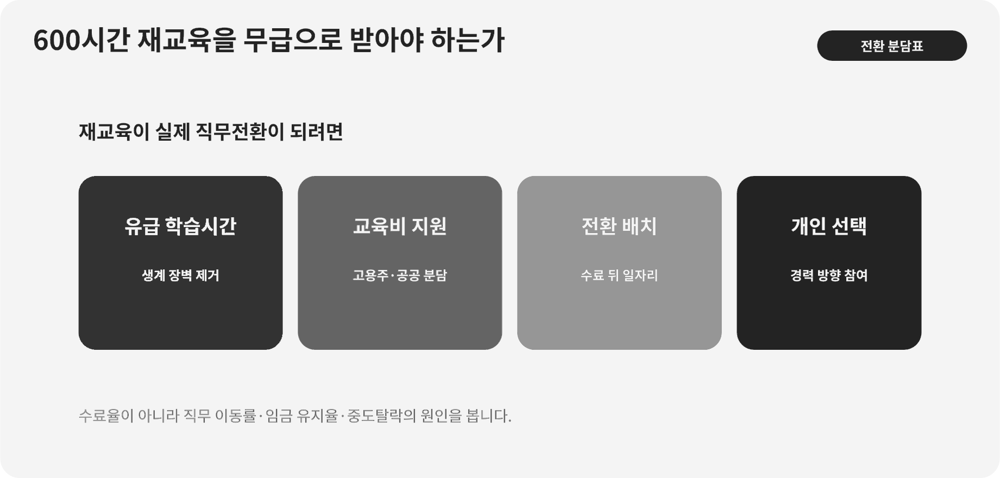

::: {.book-question}
[오늘의 책문]{.book-question-label}

{.book-question-image width=30mm fig-alt="자동화 설비 옆에서 새 기술을 배우는 노동자와 시간을 담은 미니멀 수묵화 상징 삽화"}

[자동화로 직무가 사라질 때 필요한 600시간의 재교육 비용과 시간을 개인이 부담해야 하는가?]{.book-question-prompt}
:::

명종대 교육 책문^[이 장이 잇는 실제 책문([策問]{.hanja})은 인재를 바르게 기르는 교육의 순서와 방법을 물었습니다. 책문 아카이브가 뜻을 줄여 재구성한 한문은 “[敎所以成材也。其本末次第與作人之方何如？]{.hanja}”이며 원문 직역은 아닙니다. “교육은 인재를 이루는 것이다. 그 근본과 말단의 차례, 사람을 만드는 방법은 어떠해야 하는가”라는 물음입니다. 오늘의 질문은 조선의 교육제도를 현대 기업교육으로 번역한 것이 아니라, 교육의 목적·순서·성과를 함께 밝히라는 구조를 직무전환에 적용한 것입니다.]은 공부 시간을 많이 채웠는지가 아니라 어떤 사람과 역량을 길러 어디에 쓸 것인지 물었습니다. 자동화 앞의 재교육도 수료증을 발급하는 사업이 아니라 실제 직무 이동을 만드는 과정이어야 합니다.

OECD의 2025년 성인학습 보고서는 시간과 비용을 대표적인 학습 장벽으로 제시하고, 고용주 지원이 참여와 강하게 연결된다고 분석합니다. 반도체 현업의 재교육도 장비 조작 한 가지를 외우는 데서 끝내지 말고 데이터 해석, 이상 원인 추적, 안전한 개입, 다른 팀과의 인수인계까지 묶어야 합니다.

## 왜 지금 이 질문인가

자동화가 작업을 없앨 때 기업은 생산성 이익을 먼저 얻지만, 노동자는 임금이 끊길 위험과 학습시간을 부담합니다. 반대로 모든 교육을 회사가 무제한 책임지면 현 직무와 무관한 과정, 실제 수요가 없는 자격증, 이직 뒤 개인에게 남는 편익까지 회사가 떠안을 수 있습니다. 부담 주체를 하나로 정하기보다 누가 자동화 결정을 했고 누가 교육 내용을 통제하며 누가 장기 편익을 얻는지 나눠야 합니다.

OECD가 2025년 발간한 『Trends in Adult Learning』은 2023년 성인역량조사 자료를 분석합니다. 여러 국가에서 성인학습 참여가 정체하거나 감소했고, 교육이 특히 필요한 사람이 시간·소득·접근 제약 때문에 오히려 덜 참여하는 누적 불리도 나타납니다. 고용주의 재정지원은 참여와 강하게 연결됩니다.

신입 인재개발 담당자가 물어야 할 것은 “좋은 강의를 찾았는가”가 아닙니다. 직무 종료일까지 교육을 실제로 배치할 수 있는지, 학습 중 임금을 누가 지급하는지, 수료 뒤 어느 직무와 임금으로 이동하는지, 이동하지 못한 사람에게 어떤 선택권이 남는지를 일정표와 예산으로 보여줘야 합니다.

## 데이터로 보기

{fig-alt="성인학습 참여와 시간·비용 장벽, 육백 시간 재교육의 월별 부담을 함께 보여주는 데이터 그림"}

### 근거 데이터 표

| 근거 | 원자료의 수치·범위 | 성격 | 토론에서의 의미 |
|---:|---|---|---|
| 1 | OECD는 여러 조사국에서 성인학습 참여가 정체하거나 감소했다고 분석합니다. | EVIDENCE의 OECD 근거 | 자동화가 빨라져도 재교육 참여가 저절로 늘어난다고 가정할 수 없습니다. |
| 2 | 고용주의 재정지원은 성인학습 참여와 강하게 연결됩니다. | EVIDENCE의 OECD 근거 | 교육비뿐 아니라 유급시간·배치·관리자 지원을 함께 설계해야 합니다. |
| 3 | 가장 교육이 필요한 사람이 가장 적게 참여하는 누적우위, 이른바 매튜 효과가 생길 수 있습니다. | EVIDENCE의 OECD 근거 | 무급 장시간 교육은 소득·돌봄 제약이 큰 사람을 먼저 배제할 수 있습니다. |
| 4 | 사례에서 교육 대상은 80명, 직무 종료까지 18개월, 필요한 교육은 600시간입니다. | **토론용 가정** | 교육 정원·시간표·전환 일자리 수를 같은 계획에 넣습니다. |
| 5 | 사례의 600시간은 8시간 기준 75일이며, 18개월 동안 균등 배치하면 월 33.3시간, 주 약 7.7시간입니다. | **토론용 가정의 산술 계산** | ‘교육비만 지원’이 사실상 매주 하루 가까운 무급노동을 요구할 수 있음을 보여줍니다. |

### 이 숫자를 읽는 법

OECD의 참여 정체와 고용주 지원의 연관성은 특정 회사의 교육효과를 보장하는 인과계수가 아닙니다. 회사는 교대별 참여, 교육 중 임금, 중도탈락 사유와 실제 직무전환을 별도로 측정해야 합니다.

매튜 효과는 소득·학력·시간이 충분한 사람이 학습기회를 더 쉽게 쌓는 누적 현상을 설명합니다. 개인의 의욕을 추정하는 딱지가 아니라, 과정 시간과 소득보전이 누구를 배제하는지 점검하는 렌즈로 씁니다.

600시간은 이 장의 시나리오 값입니다. 75일·월 33.3시간·주 7.7시간도 8시간 근무일과 18개월 균등배치라는 가정의 환산입니다. 교대제, 휴가, 사전학습 인정, 실습 장비 가용성에 따라 달라집니다.

성과는 수료율 하나로 측정하지 않습니다. 전환 직무 배치율, 6개월 숙련도, 전환 전후 임금, 1년 고용유지, 교육 중 안전사고, 중도탈락의 사유를 함께 공개해야 기업이 쉬운 학습자만 골라 높은 수료율을 만들지 못합니다.

## 대립 답안

### 답안 A — 개인 공동부담론

새 역량은 현재 회사 밖에서도 쓸 수 있는 인적자산이므로 개인도 과정 선택과 일부 시간을 부담할 이유가 있습니다. 회사가 전액 부담하면 당장 필요한 기술만 가르치고 개인의 장기 경력 선택을 제한하거나, 반대로 직무와 관련 없는 과정까지 비용을 떠안을 수 있습니다. 정부 학습계정과 개인 선택권을 활용하면 회사가 사라져도 교육 기록이 남습니다.

하지만 자동화 결정권과 생산성 이익은 주로 기업에 있습니다. 임금 없이 600시간을 개인에게 넘기면 돌봄·부채·건강 제약이 있는 노동자는 선택권을 행사할 수 없습니다. 형식적 자유가 실질적 배제가 될 수 있습니다.

### 답안 B — 기업 전액책임론

직무를 없애는 설비투자를 결정하고 비용 절감의 편익을 얻는 기업이 전환교육의 비용과 유급시간을 책임해야 합니다. 회사 공정에 특화된 장비·품질·안전 교육은 다른 직장에서의 가치보다 현 고용주의 필요가 큽니다. 교육을 근무로 인정해야 참여율과 안전, 집중도를 확보할 수 있습니다.

다만 회사가 모든 시간을 통제하면 노동자의 원치 않는 직무로만 이동시키거나 교육 실패의 책임을 다시 개인에게 돌릴 수 있습니다. 시장에서 통용되는 자격과 이직 선택을 보장할 공공 역할이 필요합니다.

### 답안 C — 원인·편익 연동 분담론

필수 600시간을 세 묶음으로 나누겠습니다. 현재 회사의 자동화와 직접 연결된 공정·안전 교육은 기업의 유급시간으로, 산업 공통역량은 기업과 정부가 공동 지원하는 유급 또는 소득보전 시간으로, 개인이 선택한 추가 과정은 학습계정과 제한된 개인 부담으로 설계합니다. 전환교육을 거부한 사람에게도 숙려기간, 다른 직무 지원, 합리적 퇴직 선택을 제공합니다.

지원금은 수료 때 모두 지급하지 않습니다. 전환배치, 임금 보전, 6개월 숙련, 1년 고용유지의 단계에 따라 정산합니다. 기업이 교육을 제공하고도 자리를 만들지 않거나 개인에게 원래보다 현저히 낮은 임금을 제시하면 기업 부담이 커지도록 합니다.

## AI 조사 설계

### AI에게 물어볼 프롬프트

> 자동화로 18개월 뒤 종료될 반도체 현장 직무 80명에게 600시간 전환교육을 제공하는 안을 설계하십시오. 먼저 ① 개인별 현재 과업·숙련·임금과 희망경로, ② 자동화 뒤 남는 과업과 실제 신규 직무 수요, ③ 교대별 유급 학습 가능시간, ④ 회사의 직무전환·임금보전 규정, ⑤ 국가 기간산업 인력정책과 OECD 성인학습 근거를 확인하십시오. 600시간을 회사 특화 필수역량, 산업 공통역량, 개인 선택역량으로 나누고 개인 학습계획·포트폴리오, 회사의 유급시간·내부면접, 정부의 공통자격·공동실습장·보조금 책임을 표로 만드십시오. 수료율뿐 아니라 실제 배치, 임금, 6개월 역량검증, 1년 고용유지와 이직 시 자격 인정률을 KPI로 제시하십시오. 개인·회사·정부 각각의 실패조건과 재설계 책임을 적고, 개인정보와 평가기록은 비식별 집계만 사용하십시오.

### 데이터 취득

| 순서 | 자료 | 확인할 항목 |
|---:|---|---|
| 1 | 자동화 투자안과 직무분석 | 사라지는 과업, 남는 과업, 신규 직무 수, 도입일, 생산성 편익 |
| 2 | 인사·임금·교대 기록 | 대상자 수, 숙련, 임금, 근무표, 돌봄·접근성 제약, 자발적 선택 |
| 3 | 교육과정·평가자료 | 모듈별 시간, 실습 장비, 강사, 사전학습 인정, 역량평가 방식 |
| 4 | 배치·채용 계획 | 실제 공석, 배치 기준, 임금 범위, 지역 이동, 6개월·1년 유지 |
| 5 | 정부·OECD 원문 | 지원 대상, 유급 인정, 보조금 정산, 조사연도·분모·한계 |

### 정보 판정

1. **수요 검증:** 교육 정원보다 전환 가능한 실제 직무 수를 먼저 확인합니다.
2. **시간 가능성:** 교대별 인력 공백과 휴식·안전 규정을 반영해 달력에 배치합니다.
3. **이식 가능성:** 회사 전용 기술과 산업 공통 자격을 분리합니다.
4. **선택의 실질성:** 무급·원거리·야간 과정이 특정 집단을 배제하는지 봅니다.
5. **성과 귀속:** 기업 비용절감, 정부 고용안정, 개인 임금·경력 편익을 따로 계산합니다.
6. **탈락 해석:** 미수료를 개인 의지 부족으로 단정하지 않고 시간·과정·건강 원인을 확인합니다.

### 토론의 핵심

- 자동화 이익을 얻는 기업의 책임은 교육비, 임금, 새 일자리 가운데 어디까지입니까?
- 시장에서 통용되는 공통역량과 회사 전용역량을 누가 판정합니까?
- 엔지니어 개인의 학습 포트폴리오는 어떤 현업 산출물로 역량을 증명해야 합니까?
- 수료율이 높아도 배치·임금·자격 이동성이 낮으면 회사와 정부 중 누가 무엇을 다시 설계해야 합니까?

## 사례형 토론

당신은 자동검사 설비 전환 TF에 참여한 입사 2년 차 공정 엔지니어입니다. 본인의 수동 데이터 점검 업무도 자동화되며, 80명의 검사·운반 직무는 18개월 뒤 종료될 예정입니다. 새 장비 운영·데이터 품질 직무로 옮기려면 600시간 교육이 필요합니다. 회사는 수강료는 전액 내지만 학습시간은 무급으로 하려 합니다. 다음 수치는 토론용 가정입니다.

- 600시간 가운데 회사 전용 장비·안전 300시간, 산업 공통 데이터·품질 200시간, 개인 선택 100시간입니다.
- 대상자의 평균 시급은 2만5천 원으로 가정하며, 600시간 전부를 유급 처리하면 단순 임금은 1인당 1천5백만 원, 80명 합계 12억 원입니다.
- 신규 내부 직무는 60개이고, 20명에게는 협력사 전직·다른 공장 이동·퇴직 지원 가운데 선택이 필요합니다.
- 정부 보조는 승인된 공통과정 비용의 50%, 1인당 최대 400만 원이라고 가정합니다.
- 개인별로 첫 4주에 20시간 역량진단을 하고, 장비 이상분석·SPC 자동화·데이터 계보 가운데 한 과제를 포트폴리오로 완성해야 합니다.

신입 엔지니어는 **회사 교육비만 부담, 전 시간 기업 유급, 역량 묶음별 개인·회사·정부 분담** 가운데 하나를 제안합니다. 개인은 희망직무와 주간 학습계획을 고르고, 회사는 유급시간·대체인력·60개 직무의 내부면접을 보장하며, 정부는 여러 기업이 인정하는 공통과정·공동실습장과 보조금 성과를 관리합니다. 현장관리자는 생산공백, 노동자 대표는 소득과 선택권, 재무팀은 12억 원, 교육기관은 실습 품질을 검토합니다.

최종안에는 개인별 90일 학습계획과 포트폴리오, 18개월 유급 학습 달력, 교대 대체인력, 60개 내부직무의 선발 방식, 나머지 20명의 선택, 임금 보전, 중도탈락 지원, 정부 과정의 이식성 검증과 6개월·1년 성과정산을 넣으십시오. 개인·회사·정부의 실패를 서로에게 떠넘기지 않도록 각 실패조건도 정해야 합니다.

## 90초 발언 예시

“저는 역량 묶음별 개인·회사·정부 분담안을 선택하겠습니다. 무급 600시간은 18개월 동안 주 약 7.7시간, 8시간 기준 75일의 소득을 포기하라는 요구입니다. OECD가 시간·비용과 고용주 지원을 핵심 조건으로 보는 이유입니다. 저는 첫 90일에 장비 이상분석·SPC 자동화·데이터 계보 중 희망직무를 정하고, 20시간 진단 뒤 현업 과제 하나를 포트폴리오로 완성하겠습니다. 회사 자동화에 필요한 장비·안전 300시간은 전액 유급으로 하고 60개 직무의 기준과 내부면접을 교육 전에 보장해야 합니다. 산업 공통 데이터·품질 200시간은 회사 유급시간과 정부 과정비·공동실습장을 결합하겠습니다. 개인 선택 100시간은 학습계정을 쓰되 야간학습을 강제하지 않겠습니다. 전부 유급이면 가정상 임금비는 12억 원이지만 내부직무가 60개뿐이므로 나머지 20명에게 이동·협력사 전직·퇴직 지원을 실제 선택지로 제시하겠습니다. 6개월 내 배치 75%, 임금 90%, 1년 고용유지 85%를 가상 기준으로 두겠습니다. 개인이 지원 뒤 두 번 역량평가에 실패하면 경로를 바꾸고, 회사가 배치 기준을 못 지키면 유급 전환기간을 연장하며, 정부 과정이 세 곳의 채용기업에서 인정되지 않거나 취업률이 70% 미만이면 보조를 중단하고 자격과 실습을 다시 설계하겠습니다.”

## 꼬리 질문

**교차질문과 재반박**

- 개인의 90일 학습계획이 실제 역량 향상으로 이어졌음을 어떤 현업 산출물로 증명하겠습니까?
- 교육을 마친 80명보다 내부 직무 60개가 적다면 선발과 이의신청을 어떻게 설계하겠습니까?
- 회사가 유급시간을 주는 대신 2년 의무근무를 요구하면 어느 수준까지 정당합니까?
- 산업 공통과정을 세 곳 이상의 기업이 인정하지 않으면 정부는 보조금과 자격체계를 어떻게 바꿔야 합니까?
- 두 번의 역량평가에 실패한 개인에게 경로 변경과 퇴직 가운데 어떤 추가 선택을 보장하겠습니까?
- 배치율은 높지만 임금 90%·1년 유지 85% 기준을 못 채우면 개인·회사·정부의 책임을 어떻게 나누겠습니까?

## 출처

- [OECD, *Trends in Adult Learning: New Data from the 2023 Survey of Adult Skills* (2025)](https://www.oecd.org/en/publications/trends-in-adult-learning_ec0624a6-en.html)
- [OECD, *Trends in Adult Learning* 전체 보고서와 참여·장벽 분석 (2025)](https://www.oecd.org/en/publications/trends-in-adult-learning_ec0624a6-en/full-report.html)
- [조선시대 책문 아카이브, 명종대 「교육은 어디로 가야 하는가」](https://waterfirst.github.io/Joseon-Dynasty-Civil-Service-Examination/#myeongjong-1558-education/0)
- [책문 아카이브, 조종도 대책 전승 해설](https://waterfirst.github.io/Joseon-Dynasty-Civil-Service-Examination/#myeongjong-1558-education/0)

> **자료 메모:** OECD 수치는 2025년 보고서가 분석한 2023년 성인역량조사 자료입니다. 80명·18개월·600시간·교육 묶음·시급·12억 원·60개 직무·정부 보조와 모범답안의 KPI는 모두 토론용 가정입니다.
