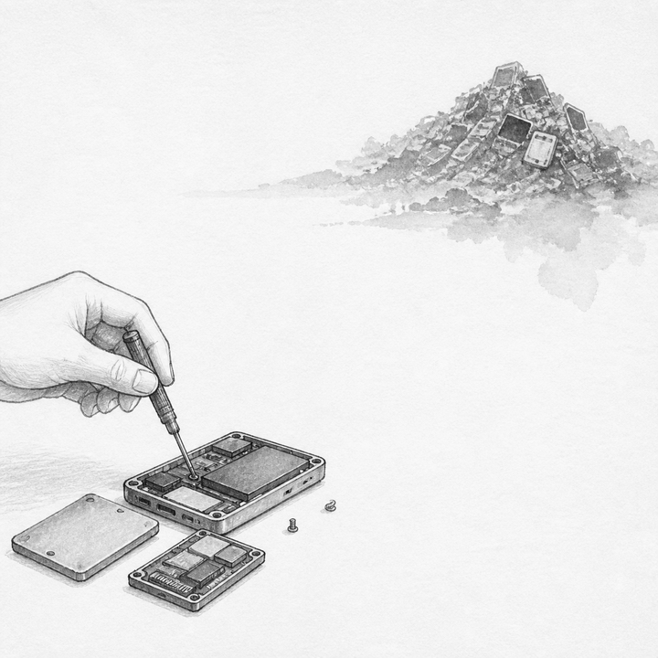
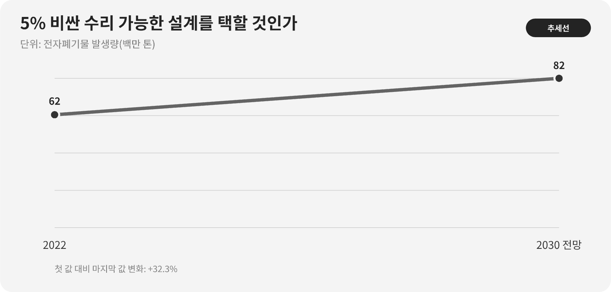

::: {.book-question}
[오늘의 책문]{.book-question-label}

{.book-question-image width=30mm fig-alt="버려진 회로기판에서 다시 자라는 모듈과 수리 도구를 그린 미니멀 수묵화 상징 삽화"}

[제품 가격이 5% 오르더라도 교체주기를 2년 늘리는 수리 가능한 설계를 선택해야 하는가?]{.book-question-prompt}
:::

1798년 정조의 호남 책문^[이 장과 연결한 실제 책문([策問]{.hanja})은 지역의 풍부한 물산이 백성의 삶을 해치지 않고 오래 쓰이게 할 방책을 물었습니다. 아카이브에 제시된 첫 원문은 “[王若曰，湖南一路卽我朝興王之地也。]{.hanja}”입니다. “왕은 이르노라. 호남 한 도는 우리 왕조가 일어난 땅이다”라는 뜻입니다. 이 장은 조선의 지역정책을 전자제품에 직접 대응시키지 않습니다. 자원을 얻는 곳과 편익을 누리는 곳, 폐기 부담을 지는 곳이 다를 때 책임을 묻는 구조를 빌립니다.]은 풍부한 자원이 자동으로 좋은 삶을 만든다고 전제하지 않았습니다. 생산과 유통의 편익 뒤에 어느 지역과 사람이 비용을 떠안는지 물었습니다.

반도체가 들어간 제품은 성능이 좋아질수록 교체 유인이 커집니다. 동시에 접착제, 일체형 배터리, 납땜된 저장장치, 전용 진단도구, 짧은 펌웨어 지원은 고장 난 작은 부품 대신 제품 전체를 버리게 할 수 있습니다. 수리 가능한 설계는 환경 캠페인만이 아니라 제품 아키텍처, 서비스망, 보증, 재고와 수익모델의 선택입니다.

## 왜 지금 이 질문인가

UNITAR와 ITU의 『Global E-waste Monitor 2024』에 따르면 2022년 세계 전자폐기물은 6,200만 톤으로 2010년보다 82% 늘었습니다. 공식적으로 문서화된 수거·재활용 비율은 22.3%에 그쳤고, 2030년 발생량은 8,200만 톤으로 늘며 공식 재활용률은 20%로 낮아질 전망입니다.

이 세계 총량만으로 특정 회사의 모듈형 설계가 효과적이라고 결론낼 수는 없습니다. 제품 한 대의 질량, 실제 사용기간, 고장 부품, 수리 성공률, 회수율, 재사용 부품, 물류와 서비스 에너지, 신제품의 효율 개선을 알아야 합니다. 오래 쓰는 구형 제품이 전기를 훨씬 더 많이 소비한다면 조기 교체가 전 과정 환경부담을 줄이는 경우도 있습니다.

신입 제품기획자가 할 수 있는 일은 ‘친환경’이라는 이름을 붙이는 것이 아닙니다. 어느 부품을 모듈화할지, 부품을 몇 년 공급할지, 진단 소프트웨어를 누구에게 열지, 수리 뒤 안전과 방수 성능을 어떻게 보증할지, 서비스망의 고정비를 어떤 제품군이 감당할지 수치로 정하는 것입니다.

## 데이터 렌즈

{fig-alt="세계 전자폐기물의 2022년 발생량과 2030년 전망, 공식 재활용률을 비교한 데이터 그림"}

### 근거 데이터 표

| 근거 | 원자료의 수치·범위 | 성격 | 토론에서의 의미 |
|---:|---|---|---|
| 1 | 세계 전자폐기물은 2022년 **6,200만 톤**으로 2010년보다 **82% 증가**했습니다. | UNITAR·ITU 세계 추정 | 총량 증가가 수리·수명·회수 설계를 함께 보아야 할 배경입니다. |
| 2 | 2022년 공식적으로 수거·재활용된 비율은 **22.3%**, 약 1,400만 톤 수준입니다. | UNITAR·ITU 세계 추정 | 판매량만큼 회수체계의 실제 작동을 측정해야 합니다. |
| 3 | 2030년 전자폐기물은 **8,200만 톤**으로 늘어날 전망입니다. | 조건부 전망 | 정책·가격·설계가 바뀌면 달라지는 전망치이지 확정 실적이 아닙니다. |
| 4 | 현 추세에서 2030년 공식 수거·재활용률은 **20%**로 낮아질 전망입니다. | 조건부 전망 | 발생량 증가 속도가 공식 재활용 확대보다 빠를 수 있음을 뜻합니다. |
| 5 | 사례의 모듈형 제품은 가격 5% 상승, 평균 수명 4년에서 6년으로 연장을 가정합니다. 제품가격을 P라 하면 단순 연간 구매비는 P/4에서 1.05P/6으로 바뀌어 약 30% 낮습니다. | **토론용 가정의 산술 계산** | 수명 연장이 실제라면 초기 가격 상승과 생애비용의 방향이 다를 수 있습니다. |

### 이 숫자를 읽는 법

6,200만 톤은 세계 모든 전기·전자제품의 합입니다. 반도체 칩 자체의 폐기물이나 특정 회사의 제품군을 뜻하지 않습니다. 제품 질량이 작은 모바일기기와 대형 장비를 단순 대수로 비교해서도 안 됩니다.

22.3%는 공식적으로 문서화된 수거·재활용 비율입니다. 나머지가 전부 같은 방식으로 매립됐다는 뜻은 아닙니다. 비공식 수리·재사용·거래와 추적되지 않은 처리가 섞여 있습니다. 공식률이 낮다는 사실은 추적성의 한계와 노동·환경 보호 문제를 함께 보여줍니다.

2030년 8,200만 톤과 20%는 전망입니다. 전망값을 실제 성과처럼 말하지 않고 어떤 추세와 정책 가정을 썼는지 밝혀야 합니다.

P/4와 1.05P/6 계산은 할인율, 고장 확률, 수리비, 서비스 거점 30억 원, 신제품의 전력효율, 잔존가치를 제외한 단순 비교입니다. 수명 6년이 실사용 데이터로 확인되지 않으면 30% 절감도 사라집니다.

## 대립 답안

### 답안 A — 성능교체 우선론

새 세대 제품이 같은 작업을 훨씬 적은 전력과 시간으로 처리하고 안전·보안 지원도 개선한다면 적기 교체의 환경·경제 편익이 있습니다. 모든 부품을 나사와 커넥터로 분리하면 크기·무게·방수·열저항·신뢰성이 나빠지고 제조원가와 고장점이 늘 수 있습니다. 회수와 고효율 재활용이 확실한 제품은 일체형 설계가 전체 부담을 줄일 수도 있습니다.

그러나 회수율이 낮은데 미래 재활용을 이유로 짧은 수명을 정당화하면 폐기비용을 외부에 넘깁니다. 효율 개선의 편익은 실제 사용전력으로, 설계 제한은 고장·안전 데이터로 증명해야 합니다.

### 답안 B — 전면 수리권 우선론

배터리·저장장치·전원부처럼 고장이 잦거나 마모되는 부품은 교체 가능해야 합니다. 부품, 매뉴얼, 진단도구와 펌웨어를 장기간 제공하면 제품 전체 폐기를 줄이고 지역 수리업과 고객 선택권을 넓힐 수 있습니다. 초기 가격이 5% 오르더라도 수명이 2년 늘면 단순 연간 구매비는 낮아질 가능성이 큽니다.

다만 모든 사용자가 수리하지는 않습니다. 부품 재고와 서비스 거점이 남아도 회수·수리 성공률이 낮으면 비용과 자원만 추가됩니다. 안전 핵심 부품의 비전문 수리 위험과 제조물 책임도 설계해야 합니다.

### 답안 C — 고장기여 기반 선택론

제품군별 고장모드와 수명기여를 기준으로 모듈화하겠습니다. 상위 고장 원인의 대부분을 차지하면서 안전하게 교체할 수 있는 부품부터 표준화하고, 나머지는 회수·재제조를 강화합니다. 출고가 5% 상승은 수리 성공률, 부품 공급기간, 실제 수명, 회수율, 전 과정 탄소와 고객 총비용이 사전 기준을 넘는 제품군에서만 허용합니다.

수리 가능성을 점수 하나로 홍보하지 않습니다. 부품 도착시간, 진단 성공률, 첫 수리 성공률, 수리 뒤 12개월 재고장률, 평균 실제 사용기간을 공개합니다. 2년 연장 목표가 2개 코호트에서 확인되지 않으면 설계를 축소하거나 서비스 방식을 바꿉니다.

## AI 조사 설계

### AI에게 물어볼 프롬프트

> 모듈형 설계가 전자제품의 실제 수명과 전 과정 환경부담을 줄이는지 조사하십시오. ① 제품별 고장·보증·수리 원장, ② 부품 조달과 서비스망 데이터, ③ 회수·재사용·재활용 실적, ④ 사용전력과 신제품 효율, ⑤ UNITAR·ITU 전자폐기물 원문 순서로 확인하십시오. 일체형과 모듈형을 같은 기능·판매지역·사용강도의 코호트로 비교하고 출고가, 수리비, 첫 수리 성공률, 부품 대기, 평균 사용기간, 회수율, 재제조율, 전 과정 탄소를 표로 만드십시오. 세계 전자폐기물 총량을 회사 제품 효과로 환산하지 마십시오. 확인 사실, 회사 주장, 수명 예측, 토론 가정을 구분하고 5% 가격 인상이 고객 총비용 절감으로 바뀌는 손익분기 조건을 민감도 분석하십시오.

### 데이터 취득

| 순서 | 자료 | 필수 항목 |
|---:|---|---|
| 1 | 고장·보증·반품 원장 | 제품연령, 고장부품, 안전등급, 수리·교환, 재고장, 폐기 사유 |
| 2 | 부품·서비스 운영자료 | 공급기간, 가격, 배송거리, 거점 고정비, 기술자 시간, 진단도구 접근 |
| 3 | 판매·사용 코호트 | 출고가, 실제 사용기간, 중고 이전, 전력소비, 소프트웨어 지원 종료 |
| 4 | 회수·재활용 증빙 | 판매대수 대비 회수율, 재사용·재제조·재료회수, 처리지역과 인증 |
| 5 | 생애주기 평가와 국제통계 | 기능단위, 시스템 경계, 전력믹스, 추정·실측, 자료연도 |

### 정보 판정

1. **기능단위:** 제품 한 대가 아니라 동일 작업량 또는 사용연수당 비용·탄소를 비교합니다.
2. **선택편향:** 수리를 선택한 고객이 원래 오래 쓰는 집단인지 보정합니다.
3. **수명 정의:** 첫 고장, 경제적 수리불가, 실제 폐기와 소유권 이전을 구분합니다.
4. **회수 증빙:** 위탁업체 인계량이 최종 재활용량과 같은지 확인합니다.
5. **안전:** 수리 후 방수·절연·배터리 안전과 보증 책임을 별도 지표로 둡니다.
6. **전망 표시:** 6년 수명과 2030년 세계 전망을 실측값처럼 쓰지 않습니다.

### 토론의 핵심

- 수리 가능성을 설계 사양과 실제 고객 행동 가운데 무엇으로 평가해야 합니까?
- 구형 제품의 추가 전력사용과 새 제품 제조의 환경부담을 어떤 기능단위로 비교합니까?
- 부품을 장기 보유하는 비용을 제품 구매자, 제조사, 수리 이용자 중 누가 부담합니까?
- 공식 재활용률이 낮을 때 회수업체 인증만으로 책임을 다했다고 볼 수 있습니까?

## 사례형 토론

당신은 산업용 엣지 장비 제품기획팀의 신입 사원입니다. 모듈형 설계는 출고가를 5% 올리지만 평균 사용기간을 4년에서 6년으로 늘릴 것으로 개발팀이 예측합니다. 서비스 거점 확충비는 연 30억 원입니다. 다음 수치는 모두 토론용 가정입니다.

- 현 제품 가격은 100만 원, 연 판매량은 10만 대입니다. 모듈형의 추가 매출액은 단순 계산으로 연 50억 원입니다.
- 고장의 65%는 전원부·저장장치·냉각팬 세 부품에서 발생하고, 모듈형의 첫 수리 성공률 목표는 80%입니다.
- 6년 사용 가정에서 구형 장비는 신형보다 연간 전력비가 2만 원 더 듭니다.
- 서비스 거점 비용 30억 원 외에 부품 재고 폐기비는 연 5억 원으로 예상합니다.

신입 사원은 **전 제품 도입, 고장기여가 큰 산업용 제품군에 제한 도입, 현 설계 유지와 회수 강화** 가운데 하나를 선택합니다. 개발팀은 열·방수·신뢰성, 서비스팀은 수리율과 재고, 재무팀은 가격·고정비, 고객팀은 가동중단, 환경팀은 수명·회수·탄소를 맡습니다.

최종안에는 대상 부품, 7년 부품공급 약속, 수리시간, 가격 인상, 서비스 비용, 12개월 재고장, 실제 수명 확인 시점과 철회 조건을 넣으십시오.

## 90초 발언 예시

“저는 고장 기여가 큰 산업용 제품군에 제한 도입하겠습니다. 세계 전자폐기물은 2022년 6,200만 톤이고 공식 수거·재활용률은 22.3%였지만, 이 총량만으로 우리 설계의 효과를 주장할 수는 없습니다. 우리 가정에서 가격은 5% 오르고 수명은 4년에서 6년으로 늘어납니다. 수명이 실제라면 단순 연간 구매비는 P/4에서 1.05P/6으로 약 30% 낮아집니다. 그러나 연 서비스 거점 30억 원과 재고 폐기 5억 원, 구형 제품의 추가 전력비가 있습니다. 그래서 고장의 65%를 차지하는 전원부·저장장치·팬만 모듈화하고 첫 수리 성공률 80%, 부품 도착 48시간, 수리 후 12개월 재고장 10% 이하, 회수율 60%를 가상 승인 기준으로 두겠습니다. 2개 연간 코호트에서 실제 중위 사용 기간이 5.5년을 넘지 못하거나 안전 고장이 현 설계보다 20% 이상 늘면 확대를 중단하겠습니다. 반대로 기준을 지키고 제품 한 대·연도당 총비용과 탄소가 줄면 전 제품으로 넓히겠습니다. 임흥원은 총액보다 부담이 약한 쪽에 비용이 더 쏠리는지를 먼저 살폈습니다(의역). 모듈화 비용도 수리망이 약한 고객에게 전가되는지 검증하겠습니다.^[임흥원의 1798년 호남 별시 대책은 부유한 집의 부담은 가볍고 가난한 집의 부담은 무거운 조세 폐단을 먼저 짚었다는 취지입니다(현대어 의역). 한국학호남진흥원과 『정조실록』은 고정봉과 임흥원을 최고점 두 사람으로 기록하고 두 사람에게 직부전시 자격을 주었다고 확인합니다. 따라서 ‘공동 장원’이라고 부르지 않습니다. 이 문장은 현대 제품정책의 권위가 아니라 총비용과 함께 부담의 분포를 살피는 사고법의 선례로만 인용했습니다. [책문 아카이브 개별 항목](https://waterfirst.github.io/Joseon-Dynasty-Civil-Service-Examination/#jeongjo-1798/0), [한국학호남진흥원, 「광주의 풍교를 다스린 광주향교」(2021)](https://www.hiks.or.kr/HonamHeritage/19/read/629), [국사편찬위원회 『정조실록』 정조 22년 6월 18일](https://sillok.history.go.kr/id/kva_12206018_002)] 수리 가능성은 분해 영상이 아니라 실제로 고쳐져 더 오래 쓰인 비율로 증명해야 합니다.”

## 꼬리 질문

**교차질문과 재반박**

- 평균 사용기간이 늘어도 중위값은 그대로라면 일부 고객만 오래 쓴 효과를 어떻게 해석하겠습니까?
- 부품 공급을 7년 약속했지만 수요가 거의 없으면 재고 폐기비를 누가 부담해야 합니까?
- 수리 뒤 방수·절연 성능이 낮아진다면 고객 선택으로 위험을 넘길 수 있습니까?
- 새 제품의 에너지 효율이 40% 좋아지면 6년 사용이라는 목표를 계속 유지하겠습니까?
- 회수율 60%를 판매대수, 폐기 예상대수, 반납 요청대수 중 무엇을 분모로 계산하겠습니까?
- 공식 재활용업체가 해외 하청으로 넘길 때 최종 처리까지 어떤 증빙을 요구하겠습니까?

## 출처

- [UNITAR·ITU, *Global E-waste Monitor 2024* 발표자료 (2024)](https://unitar.org/about/news-stories/press/global-e-waste-monitor-2024-electronic-waste-rising-five-times-faster-documented-e-waste-recycling)
- [조선시대 책문 아카이브, 정조 1798년 「호남의 일곱 폐단과 해법」](https://waterfirst.github.io/Joseon-Dynasty-Civil-Service-Examination/#jeongjo-1798/0)
- [한국학중앙연구원 한국고문서자료관, 1798년 응제 관련 기록](https://archive.aks.ac.kr/search/list.do?fq=com_%EC%97%B0%EB%8F%84_fct%3A1798%EB%85%84%28%EC%A0%95%EC%A1%B022%29&fq=com_%EC%B0%B8%EA%B3%A0%EB%AC%B8%ED%97%8C_fct%3A%E3%80%8E%ED%95%9C%EA%B5%AD%EC%9D%98+%EA%B3%BC%EA%B1%B0%EC%A0%9C%EB%8F%84%E3%80%8F&q=query&sortField=%EC%9E%91%EC%84%B1%EB%85%84%EB%8F%84)

> **자료 메모:** 6,200만 톤·82%·22.3%·8,200만 톤·20%는 UNITAR·ITU의 세계 실적·전망입니다. 가격 5%·수명 4년과 6년·연 30억 원 및 사례의 판매·고장·전력·재고·판정 수치는 모두 토론용 가정입니다.
