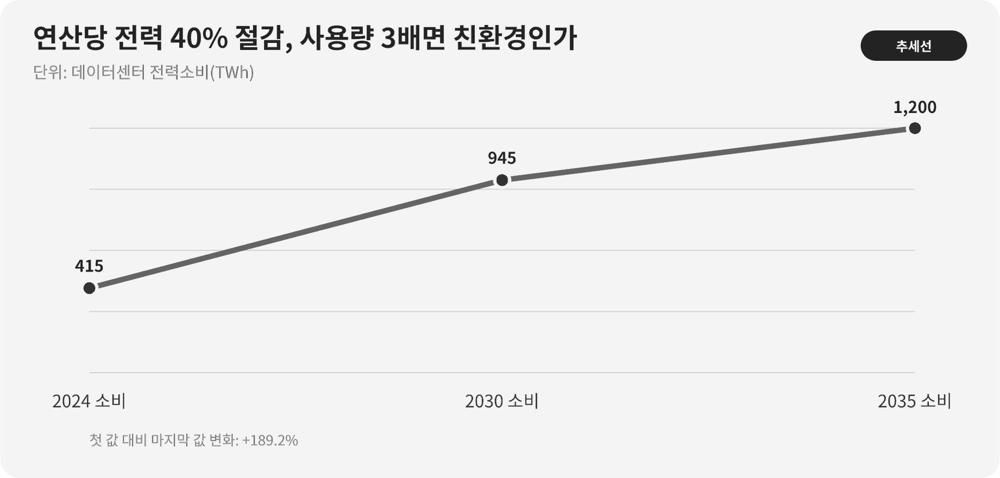

::: {.book-question}
[오늘의 책문]{.book-question-label}

{.book-question-image width=30mm fig-alt="작아진 전력 한 방울이 수많은 AI 요청으로 퍼지는 모습을 그린 미니멀 수묵화 상징 삽화"}

[새 AI 칩이 연산당 전력을 40% 줄여도 서비스 사용량이 3배가 되면 친환경이라고 평가할 수 있는가?]{.book-question-prompt}
:::

중종대 절제에 관한 책문^[이 장과 연결한 실제 책문([策問]{.hanja})은 술이 예와 교제에 쓰이는 이로움이 있는데도 나라와 가정을 해치는 폐단으로 변하는 까닭과 절제 방법을 물었습니다. 책문 아카이브가 뜻을 줄여 재구성한 한문은 “[酒有禮用，而其弊敗國喪家。何以節之？]{.hanja}”이며 원문 직역은 아닙니다. “술에는 예에 맞는 쓰임이 있으나 그 폐해가 나라를 망치고 집안을 잃게 한다. 어떻게 절제할 것인가”라는 물음입니다. 이 장은 술과 AI를 같은 대상으로 보는 것이 아니라, 유용함을 인정하면서 총량의 한계를 설계하라는 질문 구조를 빌립니다.]은 유용한 것을 없애자고 하지 않았습니다. 좋은 쓰임이 과도한 총량으로 바뀌는 지점을 어떻게 통제할지 물었습니다.

AI 연산도 같습니다. 같은 답을 적은 전력으로 만드는 칩은 분명한 기술 진보입니다. 그러나 연산 가격이 내려가 광고 추천, 영상 생성, 검색, 에이전트 호출이 크게 늘면 데이터센터의 총전력과 전력피크는 오를 수 있습니다. 효율과 총량은 경쟁하는 지표가 아니라 서로 다른 질문에 답합니다.

IEA의 *Energy and AI*는 AI 수요를 서버만이 아니라 데이터센터와 전력망, 발전원까지 이어지는 시스템으로 분석합니다. 따라서 효율 판정도 칩의 데이터시트에서 끝내지 않고 서비스 요청량과 데이터센터 총전력까지 책임 범위를 넓혀야 합니다.

## 왜 지금 이 질문인가

IEA의 2025년 『Energy and AI』 기본 시나리오에서 세계 데이터센터 전력소비는 2024년 약 415TWh에서 2030년 약 945TWh로 두 배 이상 늘어납니다. 2030년 세계 전력소비의 3%에 조금 못 미치는 수준입니다. IEA는 가속 서버 전력소비가 연 30% 수준으로 늘어 순증분의 거의 절반을 차지할 것으로 봅니다.

이 전망은 AI 칩 한 종의 전력이나 모든 국가의 상황이 같다는 뜻이 아닙니다. 데이터센터 입지는 전력망, 기후, 냉각방식, 반도체 공급, 서비스 수요에 따라 집중됩니다. 세계 비중이 3% 미만이어도 특정 지역에서는 신규 부하가 계통 접속과 전력가격, 물 사용, 예비력에 큰 영향을 줄 수 있습니다.

신입 지속가능성 담당자는 칩의 TOPS/W만 보고 친환경 라벨을 붙여서는 안 됩니다. 실제 서버 전력, 이용률, 메모리·네트워크, 냉각을 포함한 시설 전력, 요청당 작업 품질, 총 요청량, 시간대별 전력과 탄소집약도를 함께 연결해야 합니다.

## 데이터 렌즈

{fig-alt="데이터센터 전력소비가 2024년 415TWh에서 2030년 945TWh로 증가하는 전망과 효율·수요의 관계를 보여주는 데이터 그림"}

### 근거 데이터 표

| 근거 | 원자료의 수치·범위 | 성격 | 토론에서의 의미 |
|---:|---|---|---|
| 1 | 세계 데이터센터 전력소비는 2024년 약 **415TWh**로 제시됩니다. | IEA 기준연도 추정 | 데이터센터 전체이며 AI 연산만의 소비량은 아닙니다. |
| 2 | IEA 기본 시나리오는 2030년 약 **945TWh**를 전망합니다. | 조건부 전망 | 정책·효율·수요·공급이 달라지면 결과도 변합니다. |
| 3 | 2030년 945TWh는 세계 전력소비의 **약 3% 미만**입니다. | IEA 기본 시나리오의 세계 비중 | 세계 평균이 낮아 보여도 지역 계통 영향은 별도로 봐야 합니다. |
| 4 | 가속 서버의 전력소비는 2030년까지 **연 약 30%** 늘어 데이터센터 전력 순증분의 거의 절반을 차지할 전망입니다. | IEA 기술별 전망 | AI 서버 효율과 보급량을 동시에 추적해야 합니다. |
| 5 | 사례에서 연산당 전력이 40% 줄면 요청 하나는 기존의 60%를 씁니다. 요청량이 3배면 총전력은 0.6×3=1.8배, 즉 **80% 증가**합니다. | **토론용 가정의 산술 계산** | 효율 향상만으로 총전력 감소를 보장할 수 없음을 보여줍니다. |

### 이 숫자를 읽는 법

TWh는 일정 기간 사용한 에너지이고 GW는 순간 또는 계약 용량입니다. 945TWh를 945GW로 말하면 안 됩니다. 평균전력으로 바꾸려면 연간 시간을 나눠야 하지만 실제 피크는 평균보다 높습니다.

415TWh와 945TWh는 데이터센터 전체 전력소비입니다. 서버뿐 아니라 냉각·전력변환 등이 포함되는 범위와 추정방법을 확인해야 하며, AI 전력과 전통 워크로드를 완전히 분리하기 어렵습니다. IEA가 별도 공급 분석에서 제시한 2024년 발전량 460TWh는 송배전 손실 등을 반영해 소비량보다 크므로 두 값을 섞어 쓰지 않습니다.

연 30%는 매년 같은 절대량이 늘어난다는 뜻이 아니라 복리 성장률입니다. ‘순증분의 거의 절반’과 ‘전체 소비의 절반’도 다릅니다.

0.6×3=1.8은 이 장의 단순 시나리오입니다. 작업 품질, 모델 크기, 배치, 캐시, 요청 길이, 서버 이용률과 냉각은 고정했다고 가정합니다. 현실에서는 칩 효율이 좋아져도 더 큰 모델이나 높은 품질을 선택해 요청당 작업량 자체가 달라질 수 있습니다.

탄소 역시 전력량과 같지 않습니다. 같은 1MWh라도 시간·지역의 발전원에 따라 배출이 다릅니다. 시간대별 무탄소 전력 매칭, 전력피크와 추가 발전설비를 함께 봅니다.

## 대립 답안

### 답안 A — 효율혁신론

연산당 전력을 40% 줄이는 기술은 같은 서비스 수준에서 비용과 전력, 냉각부담을 낮춥니다. AI가 의료·과학·산업 최적화에 쓰이는 편익도 있으므로 사용량 증가 자체를 낭비로 볼 수 없습니다. 효율 높은 칩을 빠르게 보급해야 오래된 서버를 대체하고 제한된 계통 안에서 더 많은 유용한 작업을 처리할 수 있습니다.

그러나 ‘같은 서비스 수준’이 실제로 유지되는지 확인해야 합니다. 효율 개선분을 더 큰 모델과 무제한 자동호출에 모두 쓰면 총량과 피크가 커집니다. 제품 지표만으로 시설의 환경성과를 대신할 수 없습니다.

### 답안 B — 총량한도론

환경 영향은 최종 총전력과 물·배출에서 생깁니다. 요청당 전력이 줄어도 총전력이 80% 늘어나는 시나리오라면 친환경이라고 부르기 어렵습니다. 데이터센터 전력예산, 피크 상한, 비필수 추론 제한을 먼저 정하고 효율은 그 안에서 사용량을 배분하는 수단으로 봐야 합니다.

하지만 고정된 총량이 모든 서비스의 사회적 가치를 같게 취급하면 유용한 신규 서비스까지 막을 수 있습니다. 한도가 과거 사업자에게 유리한 진입장벽이 될 위험도 있습니다.

### 답안 C — 이중장부 승인론

칩 승인에는 연산당 에너지와 총서비스 에너지를 모두 넣겠습니다. 제품팀은 같은 품질의 표준 작업당 전력을, 서비스팀은 월간 총 추론량·총전력·피크를 책임집니다. 효율 개선으로 절감된 전력의 일부만 수요 확대에 쓰고 나머지는 절대 감축으로 남기는 예산을 정합니다.

재생전력 구매량만으로 끝내지 않습니다. 시간대별 무탄소 전력, 신규 전원 추가성, 전력망 혼잡, 수요반응과 비상 감축을 계약에 넣습니다. 총전력이 승인예산을 넘거나 피크 시간의 탄소집약도가 기준을 초과하면 저가치 요청을 늦추고 자동호출 상한을 낮춥니다.

## AI 조사 설계

### AI에게 물어볼 프롬프트

> 새 AI 칩의 연산당 전력 40% 절감과 서비스 사용량 3배 전망이 데이터센터 총전력·탄소·피크에 미치는 영향을 분석하십시오. ① 동일 품질 벤치마크의 서버 실측, ② 실제 요청 로그와 모델·토큰·배치 정보, ③ 시설 전력계와 PUE·냉각, ④ 시간대별 전력·탄소집약도와 전력계약, ⑤ IEA Energy and AI 원문 순서로 확인하십시오. 기준 서버와 새 서버의 칩·메모리·네트워크·시설 전력을 같은 기능단위로 비교하고, 사용량 1배·2배·3배·5배 민감도에서 총전력과 피크를 계산하십시오. 실측, 모델링, 회사 전망, IEA 전망, 토론 가정을 구분하십시오. 재생에너지 인증서 구매를 실제 시간대별 무탄소 공급과 동일시하지 마십시오. 마지막에는 효율 KPI, 총전력 예산, 피크 감축, 수요반응과 승인 철회 조건을 제시하십시오.

### 데이터 취득

| 순서 | 자료 | 확인할 항목 |
|---:|---|---|
| 1 | 서버 벤치마크 | 모델·정확도·지연·배치·입출력 길이, 칩·메모리·네트워크 전력 |
| 2 | 서비스 요청 로그 | 요청 수, 토큰·영상 크기, 재시도·캐시, 자동호출, 고객·기능별 가치 |
| 3 | 시설 계량 | 서버와 시설 총전력, PUE, 냉각수, 최대수요, 시간대·지역 |
| 4 | 전력조달 | 계통 전력, PPA, 인증서, 신규성, 시간대 매칭, 수요반응 의무 |
| 5 | IEA·계통 원문 | 시나리오, 대상 범위, 기준연도, 지역 집중, 전망 불확실성 |

### 정보 판정

1. **기능 동등성:** 같은 품질·지연·작업량을 처리했는지 확인합니다.
2. **경계 일치:** 칩 전력과 서버·시설 전력을 섞지 않고 층별로 기록합니다.
3. **총량 검산:** 단위 효율에 실제 사용량을 곱해 총전력을 재계산합니다.
4. **시간·지역:** 연간 평균과 피크, 지역별 탄소·계통 제약을 분리합니다.
5. **추가성:** 전력구매가 새 무탄소 설비를 늘렸는지 확인합니다.
6. **반등 원인:** 가격, 신규 기능, 자동화된 재호출 가운데 수요 증가 원인을 나눕니다.

### 토론의 핵심

- 친환경이라는 말의 분모를 연산, 유용한 작업, 고객, 시설 총전력 중 어디에 둘 것입니까?
- 효율 절감분 가운데 얼마를 수요 확대에 쓰고 얼마를 절대 감축으로 남겨야 합니까?
- 저가치 요청을 판정하고 지연·중단할 권한은 제품팀과 고객 중 누구에게 있습니까?
- 재생전력 연간 구매량이 같아도 피크 시간 전력이 화석연료라면 목표를 달성한 것입니까?

## 사례형 토론

당신은 AI 서버 제품의 지속가능성 담당 신입 사원입니다. 새 칩은 동일 벤치마크에서 연산당 전력을 40% 줄이지만, 가격 하락과 신규 기능으로 고객 추론량이 3배가 될 전망입니다. 다음 수치는 모두 토론용 가정입니다.

- 기존 서비스의 연간 시설 전력은 100GWh이고 요청량만 3배가 되면 새 설비는 단순 계산상 180GWh를 씁니다.
- 현재 최대수요는 20MW이며 계통운영자는 25MW를 넘으면 접속 보강비 200억 원을 요구합니다.
- 연간 재생전력 계약은 120GWh이지만 실제 요청 피크는 저녁 6~10시에 집중됩니다.
- 지연 허용형 배치 작업은 전체 전력의 30%이고, 그 절반을 낮 시간으로 옮길 수 있습니다.

신입 담당자는 **효율 성능만으로 출시, 연간 총전력 150GWh 상한과 수요관리 조건부 출시, 수요가 확정될 때까지 보류** 가운데 하나를 선택합니다. 제품팀은 성능, 서비스팀은 요청가치, 데이터센터팀은 피크, 조달팀은 전력계약, 재무팀은 보강비를 맡습니다.

최종 계약에는 동일품질 연산당 전력, 월간 총전력, 25MW 피크, 시간대별 무탄소 비율, 배치이동, 요청 상한, 고객 통보와 재승인 조건을 넣으십시오.

## 90초 발언 예시

“연산당 전력 40% 절감은 좋은 기술이지만 친환경 판정은 총량까지 본 뒤 내리겠습니다. IEA 기본 시나리오에서 데이터센터 전력소비는 2024년 약 415TWh에서 2030년 945TWh로 늘고, 가속 서버는 연 약 30% 증가합니다. 우리 사례도 요청이 3배면 0.6×3으로 총전력이 1.8배, 100GWh에서 180GWh가 됩니다. 따라서 저는 150GWh 상한의 조건부 출시를 제안합니다. 우선 지연 가능한 전력 30%의 절반을 낮 시간으로 옮기고, 저녁 피크가 25MW에 닿으면 자동 배치와 저가치 재호출을 제한하겠습니다. 연간 재생계약 120GWh는 시간대가 맞지 않을 수 있으므로 시간대별 무탄소 비율을 따로 공개하겠습니다. 적극론처럼 효율 혁신은 필요하지만, 총량한도론의 반론처럼 80% 증가를 절감이라고 부를 수는 없습니다. 출시 6개월 뒤 유용한 작업당 전력이 30% 이상 줄고 총전력이 150GWh 안에 있으면 확대하겠습니다. 반대로 2개월 연속 상한을 5% 넘거나 피크가 25MW를 넘으면 신규 자동호출을 중단하고 재승인을 받겠습니다. 이 상한과 기간은 토론용입니다. 친환경 AI는 더 효율적인 칩과 통제 가능한 총수요를 함께 가진 서비스입니다.”

## 꼬리 질문

**교차질문과 재반박**

- 요청량 3배가 의료진단처럼 가치 높은 작업이라면 150GWh 상한을 넘겨도 됩니까?
- ‘유용한 작업’의 가치를 제품회사가 정하면 자의적이지 않습니까?
- PUE가 좋아졌지만 칩 밖 메모리 전력이 늘었다면 연산당 효율을 어떻게 다시 계산하겠습니까?
- 연간 재생전력 120GWh를 모두 샀어도 저녁 피크가 화석발전이라면 탄소 주장을 어떻게 바꾸겠습니까?
- 고객이 사용량 상한을 거부하면 가격, 지연, 계약 중 어느 수단을 먼저 쓰겠습니까?
- 총전력은 150GWh 안이지만 지역 물 사용과 소음이 늘었다면 출시 성공을 철회하겠습니까?

## 출처

- [IEA, *Energy and AI—Energy demand from AI* (2025)](https://www.iea.org/reports/energy-and-ai/energy-demand-from-ai)
- [IEA, *Energy and AI—Energy supply for AI* (2025)](https://www.iea.org/reports/energy-and-ai/energy-supply-for-ai)
- [조선시대 책문 아카이브, 중종대 「술의 폐해를 논하라」](https://waterfirst.github.io/Joseon-Dynasty-Civil-Service-Examination/#jungjong-1513-wine/0)
- [한국민족문화대백과사전, 김구와 중종대 대책 기록](https://encykorea.aks.ac.kr/Article/E0008751)

> **자료 메모:** 415TWh·945TWh·약 3%·연 30%는 IEA의 데이터센터 전력소비 기준연도 추정과 기본 시나리오 전망입니다. IEA 공급 분석의 2024년 460TWh는 데이터센터 수요를 충당하기 위한 발전량입니다. 40%·3배와 사례의 100·180·150GWh, 20·25MW, 200억 원, 120GWh, 30% 및 전환 조건은 모두 토론용 가정입니다.
