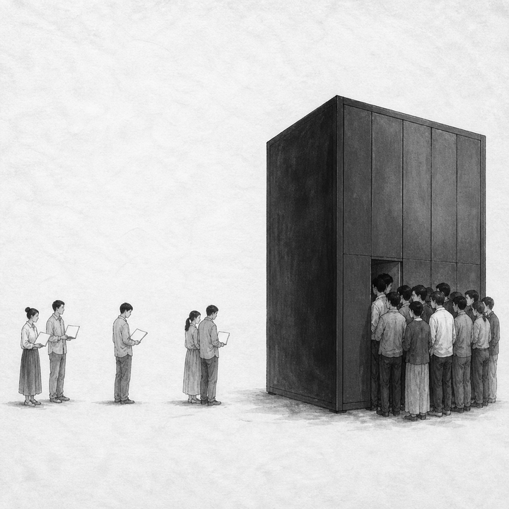
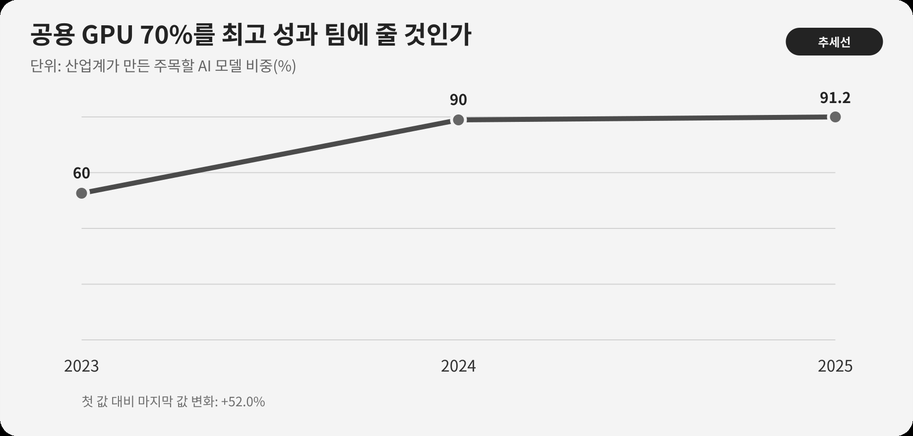

::: {.book-question}
[오늘의 책문]{.book-question-label}

{.book-question-image width=30mm fig-alt="큰 연산 구름 아래 하나의 굵은 길과 여러 작은 첫걸음을 함께 그린 미니멀 수묵화 상징 삽화"}

[한 초거대 모델의 성능을 높이기 위해 공용 GPU의 70%를 최고 성과 팀에 배정해도 되는가?]{.book-question-prompt}
:::

1447년 세종의 법과 권한에 관한 책문^[이 장과 연결한 실제 책문([策問]{.hanja})은 법이 폐단을 낳아 다시 법을 세우는 순환과 권한의 자리를 물었습니다. 책문 아카이브가 뜻을 줄여 재구성한 한문은 “[法立而弊生，弊生而法又立。其所以救之者何歟？政權當歸於何所歟？]{.hanja}”이며 원문 직역은 아닙니다. “법을 세우면 폐단이 생기고 폐단이 생기면 다시 법을 세운다. 이를 구제할 방법은 무엇이며 정권은 어디에 돌아가야 하는가”라는 물음입니다. 오늘의 질문은 조선의 통치기구를 GPU 위원회에 대응시킨 번역이 아니라, 배분 규칙이 새 독점을 만들 때 규칙과 권한을 다시 묻는 구조를 빌린 것입니다.]은 좋은 규칙도 시간이 지나면 특권을 굳힐 수 있음을 경계합니다. 성과에 따라 자원을 주는 원칙도 이미 자원을 가진 팀이 다음 성과까지 독점하는 순환을 만들 수 있습니다.

최낙초의 『AI 시대, 인간은 무엇으로 남는가』 6장 「무료 AI는 왜 불평등을 해결하지 못하는가」는 무료 접속 뒤에도 시간·기기·교육·검토능력의 계단이 남는다고 지적합니다. 공용 GPU도 계정 발급만으로 평등해지지 않습니다. 대기시간, 데이터 준비, 엔지니어 지원, 실패를 견딜 할당량이 없으면 신규팀의 첫 실험은 시작되지 못합니다.

## 왜 지금 이 질문인가

Stanford HAI의 『AI Index Report 2026』 연구개발 장은 산업계가 만든 주목할 AI 모델의 비중이 2023년 60%에서 2024년 약 90%로 높아졌다고 집계합니다. 2025년에는 산업계 93개, 학계 2개로 산업 비중이 91.2%였습니다. 같은 자료에서 2025년 미국은 59개, 중국은 35개의 주목할 모델을 배출했습니다.

이 수치는 산업계가 연구역량을 크게 키웠다는 증거입니다. 그러나 산업계 모델이 많으니 학계와 중소기업에 연산을 줄 필요가 없다는 결론은 나오지 않습니다. ‘주목할 모델’의 선정 기준, 공개 여부, 조직 분류가 있으며 작은 모델, 재현연구, 도메인 연구와 안전성 검증은 숫자 밖에 있을 수 있습니다.

공공 GPU 배분의 목표도 하나가 아닙니다. 국제 최고 성능, 산업 파급, 논문·오픈소스, 지역·중소기업 접근, 교육, 안전성 검증을 동시에 요구할 수 있습니다. 신입 간사가 할 일은 슬로건을 합치는 것이 아니라 **포트폴리오별 목적과 평가기준을 분리**하고 미사용 자원을 빨리 회수하는 것입니다.

## 데이터 렌즈

{fig-alt="산업계가 만든 주목할 AI 모델의 비중이 2023년 60퍼센트에서 2025년 91.2퍼센트로 증가한 데이터 그림"}

### 근거 데이터 표

| 근거 | 원자료의 수치·범위 | 성격 | 토론에서의 의미 |
|---:|---|---|---|
| 1 | 산업계가 만든 주목할 AI 모델 비중은 2023년 **60%**였습니다. | Stanford AI Index의 연도별 집계 | 짧은 기간에 연구 생산 주체가 이동한 기준점입니다. |
| 2 | 2024년 산업계 비중은 **약 90%**로 상승했습니다. | Stanford AI Index 집계 | 연산·데이터·인력 집중과 모델 산출의 관계를 묻게 합니다. |
| 3 | 2025년 주목할 모델은 산업계 93개, 학계 2개였고 산업 비중은 **91.2%**였습니다. | Stanford AI Index·Epoch AI 분류 | 모델 수가 아이디어의 질이나 공공가치를 모두 측정하지는 않습니다. |
| 4 | 2025년 주목할 모델은 미국 **59개**, 중국 **35개**로 집계됐습니다. | 국가별 모델 집계 | 공용 연산을 국가 경쟁력 목표와 연결할 근거이지만 배분의 유일 기준은 아닙니다. |
| 5 | 사례에서 대표팀은 GPU 70%로 성능 8% 향상을 약속하고, 100개 팀의 평균 대기는 14일에서 46일로 늘어납니다. | **토론용 가정** | 집중의 성과와 다수 팀의 기회비용을 같은 표에 놓습니다. |

### 이 숫자를 읽는 법

‘주목할 모델’은 전 세계 모든 AI 연구를 센 값이 아닙니다. 선정 기준을 충족해 추적된 모델 수이며, 산업계 소속 연구자와 산학협력의 분류도 확인해야 합니다. 모델 개수는 논문 수, 특허, 사용자 편익, 안전성과 같은 단위가 아닙니다.

91.2%는 산업계와 학계만 분모로 삼은 비율이 아닙니다. 산업계 93개와 학계 2개 외에 산학협력·기타 분류가 전체 분모에 포함되므로 93/(93+2)로 다시 계산하면 안 됩니다. 면접에서는 비율의 원표와 모든 분류를 확인한 뒤 분모를 설명해야 합니다.

국가별 59개와 35개도 모델 성능의 합이나 국민당 연구역량이 아닙니다. 공동개발 모델의 귀속, 본사와 연구소 위치, 공개시점이 영향을 줍니다.

공용 GPU의 대기시간은 평균만으로 부족합니다. 중앙값·상위 10%·첫 사용자·긴급 안전검증의 대기를 나누고, 승인량 대비 실제 사용률과 실패 작업도 봅니다. 사용하지 않은 예약을 성과로 계산하면 안 됩니다.

## 대립 답안

### 답안 A — 최고성과 집중론

거대 모델은 연산을 쪼개면 성능 실험 자체가 성립하지 않을 수 있습니다. 국제 경쟁에서 앞선 팀에 충분한 연속 GPU 시간을 줘야 스케일링, 시스템 최적화와 연구인력의 기회비용을 살릴 수 있습니다. 성능 8% 향상이 공공 서비스와 산업에 큰 편익을 준다면 70% 집중도 정당화될 수 있습니다.

그러나 성공 가능성을 과거 성과로만 판단하면 기존 팀이 자원·인재·성과를 계속 모읍니다. 약속한 8%가 벤치마크 한 개의 개선인지 실제 공공가치인지도 검증해야 합니다.

### 답안 B — 균등접근론

공공자원은 세금으로 조성됐으므로 대학·중소기업·지역·신입 연구자에게 첫 접근권을 보장해야 합니다. 작은 탐색 할당은 아이디어를 저비용으로 걸러내고, 재현연구와 도메인 문제를 넓힙니다. 100개 팀의 대기가 46일이면 좋은 아이디어가 인력계약과 연구일정 때문에 사라질 수 있습니다.

하지만 GPU를 팀 수대로 균등분배하면 대형 실험은 누구도 할 수 없고, 준비되지 않은 작업과 낮은 이용률이 늘 수 있습니다. 평등한 배정과 유효한 사용은 다릅니다.

### 답안 C — 목적별 포트폴리오론

전체 자원을 대형 전략, 공개경쟁, 신규팀 탐색, 재현·안전검증으로 나누겠습니다. 각 바구니는 다른 기준을 씁니다. 대형 전략은 성능·공공편익·중간마일스톤, 공개경쟁은 동료평가와 산출물 공개, 신규팀은 첫 접근과 소규모 검증, 재현·안전은 독립성으로 평가합니다.

할당은 소유권이 아닙니다. 주간 이용률, 작업 성공률, 중간 결과, 공개 산출물, 대기시간을 보고 미사용 예약을 회수합니다. 소규모 탐색에서 성과가 확인된 팀은 다음 바구니로 올라가고, 대표팀도 중간 목표를 놓치면 할당이 줄어듭니다.

## AI 조사 설계

### AI에게 물어볼 프롬프트

> 기준일은 2026년 8월 18일입니다. 공공 GPU를 대표팀과 대학·중소기업·신규 연구팀에 배분할 원칙을 설계하십시오. ① 시간대별 GPU 예약·실사용·실패 로그, ② 신청서와 평가점수·이해충돌, ③ 대기시간·중도포기, ④ 논문·오픈소스·특허·서비스·재현 산출물, ⑤ Stanford AI Index 원문 순서로 분석하십시오. 대형 전략, 공개경쟁, 신규팀 첫 실험, 재현·안전검증을 별도 포트폴리오로 만들고 각 목적에 맞는 KPI를 제안하십시오. 평균 대기뿐 아니라 중앙값·90분위·첫 사용자 대기를 계산하고 승인 GPU시간과 실제 유효 GPU시간을 구분하십시오. 확인 사실, 신청팀 약속, 위원회 판단, AI 추론, 사례 가정을 구분하십시오. 연구 내용과 미공개 데이터는 외부 모델에 입력하지 말고 심사위원 이해충돌과 배분 로그를 감사 가능하게 남기십시오.

### 데이터 취득

| 순서 | 자료 | 확인할 항목 |
|---:|---|---|
| 1 | 예약·스케줄러 로그 | 승인량, 실제 사용, 유휴, 작업 실패, 연속사용, 선점·취소 |
| 2 | 신청·심사 기록 | 목표, 최소 필요량, 대안 자원, 평가점수, 이해충돌, 신규팀 여부 |
| 3 | 대기·지원 데이터 | 평균·중앙·90분위, 첫 접근, 데이터 준비, 기술지원, 포기 사유 |
| 4 | 산출물과 재현 | 모델·코드·논문·특허·서비스, 공개 범위, 재현 성공, 사회적 편익 |
| 5 | 국제 원자료 | 주목할 모델 정의, 조직·국가 분류, 공동개발, 집계연도와 한계 |

### 정보 판정

1. **필요량 검증:** 팀이 요구한 GPU와 최소 실행 가능한 GPU를 구분합니다.
2. **실사용:** 예약시간보다 유효 연산시간과 이용률을 봅니다.
3. **성과 다양성:** 벤치마크 성능 외에 재현·공개·도메인 편익을 목적별로 평가합니다.
4. **신규성:** 조직 이름만 바꾼 기존팀이 신규팀 쿼터를 차지하지 않는지 확인합니다.
5. **접근비용:** GPU 외 데이터·스토리지·엔지니어 지원의 격차를 포함합니다.
6. **반사실:** 대표팀에 주지 않았을 때와 신규팀에 주지 않았을 때 잃는 결과를 모두 추정합니다.

### 토론의 핵심

- 성능 8% 향상과 100개 팀의 첫 실험을 어떤 공통 가치로 비교합니까?
- 신규팀 쿼터가 낮은 품질 신청을 보호하는 장치가 되지 않게 하려면 무엇이 필요합니까?
- 공공 GPU를 받은 결과물의 공개 범위와 기업 영업비밀을 어떻게 조정합니까?
- 배분위원회의 권한과 이의제기·감사 권한을 어디에 두어야 합니까?

## 사례형 토론

당신은 공공 GPU 배분위원회의 신입 간사입니다. 대표팀 한 곳은 전체 GPU의 70%를 6개월간 연속 배정해 달라고 요구하며 핵심 벤치마크 성능 8% 향상을 약속합니다. 그러면 대학·중소기업 100개 팀의 평균 대기는 14일에서 46일로 늘어납니다. 다음 수치는 모두 토론용 가정입니다.

- 분기 가용량은 100만 GPU시간이고 최근 평균 실사용률은 72%입니다.
- 대표팀은 지난 할당의 88%를 사용했지만 코드·체크포인트 공개는 6개월 뒤로 미뤘습니다.
- 신규팀 100곳에는 팀당 1,000 GPU시간이면 첫 가설검증이 가능하며, 기술지원 20시간이 추가로 필요합니다.
- 공개경쟁 과제 중 15%는 지난 분기 재현평가를 통과했고, 대표팀 모델의 독립 재현은 아직 없습니다.

신입 간사는 **대표팀 70% 집중, 팀별 균등배분, 목적별 포트폴리오 배분** 가운데 하나를 제안합니다. 대표팀, 신규팀, 안전·재현팀, 운영사, 시민위원이 반론을 냅니다. 최종안에는 포트폴리오 비율, 최소·최대 할당, 미사용 회수, 기술지원, 대기 상한, 공개 산출물, 이해충돌과 이의제기를 넣으십시오.

## 90초 발언 예시

“저는 공용 GPU의 70%를 한 팀에 고정하지 않고 목적별 포트폴리오로 배분하겠습니다. Stanford AI Index는 산업계의 주목할 모델 비중을 2025년 91.2%로 제시합니다. 산업의 역량은 분명하지만, 그 숫자가 신규팀에 아이디어가 없다는 뜻은 아닙니다. 사례에서 대표팀은 성능 8% 향상을 약속하지만 100개 팀의 평균 대기는 14일에서 46일로 늘어납니다. 분기 100만 GPU시간이라는 가정에서 50%는 대표 전략, 25%는 공개경쟁, 15%는 신규팀 첫 실험, 10%는 재현·안전에 배정하겠습니다. 신규팀 100곳에 1,000시간씩 주면 10만 시간으로 첫 검증이 가능합니다. 대표팀은 월별 마일스톤과 85% 이용률, 3개월 내 독립 재현 패키지를 조건으로 50만 시간을 받습니다. 이용률이 2주 연속 70% 아래이거나 중간 성능개선이 2% 미만이면 10%포인트를 회수해 대기팀에 돌리겠습니다. 신규팀도 첫 실험 뒤 검증된 팀만 확대합니다. 이 비율과 임계값은 토론용입니다. 공공 연산의 목표는 오늘의 우승자만 키우는 것이 아니라 다음 우승자가 처음 증명할 기회를 보존하는 것입니다.”

## 꼬리 질문

**교차질문과 재반박**

- 대표팀의 성능 8%가 국가안보나 의료에 결정적이라면 70% 집중을 허용하겠습니까?
- 평균 대기 46일보다 90분위 대기가 120일이라면 어느 지표를 계약에 넣겠습니까?
- 신규팀이 할당받은 GPU를 충분히 쓰지 못하면 첫 접근권 정책이 실패한 것입니까?
- 공개 산출물을 요구하면 기업이 공공 GPU 신청을 포기할 수 있는데 어느 수준까지 공개해야 합니까?
- 91.2%와 산업 93개·학계 2개의 산술이 맞지 않을 때 면접 답변에서 어떻게 처리하겠습니까?
- 배분위원이 대표팀과 공동연구 관계라면 제척·공개·재심 중 어떤 절차가 필요합니까?

## 출처

- [Stanford HAI, *AI Index Report 2026—Research and Development* (2026)](https://hai.stanford.edu/assets/files/ai_index_report_2026_chapter_1_research_development.pdf)
- [조선시대 책문 아카이브, 세종 1447년 「법의 폐단과 권력의 자리」](https://waterfirst.github.io/Joseon-Dynasty-Civil-Service-Examination/#sejong-1447/0)
- [국사편찬위원회, 세종실록 1447년 8월 5일 기록](https://sillok.history.go.kr/id/kda_12908005_001)
- [최낙초, 『AI 시대, 인간은 무엇으로 남는가』 6장 「무료 AI는 왜 불평등을 해결하지 못하는가」 (온라인판)](https://waterfirst.quarto.pub/ai-era-humanity/chapters/chapter06.html)

> 데이터 기준일: 2026년 8월 18일. 60%·약 90%·91.2%·93개·2개·59개·35개는 Stanford AI Index 근거자료의 집계입니다. 91.2%의 분모에는 산업계·학계 외 분류도 포함됩니다. GPU 70%·성능 8%·100개 팀·14일·46일과 사례의 GPU시간·이용률·지원시간·재현률 및 모범답안 비율은 모두 토론용 가정입니다.
