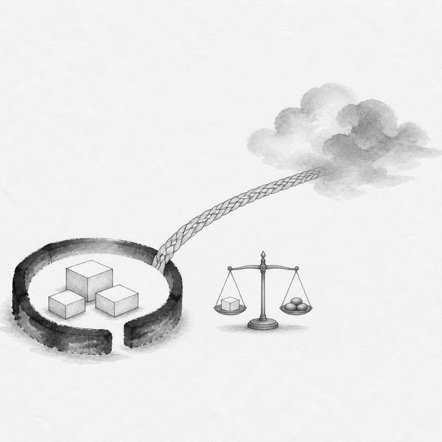
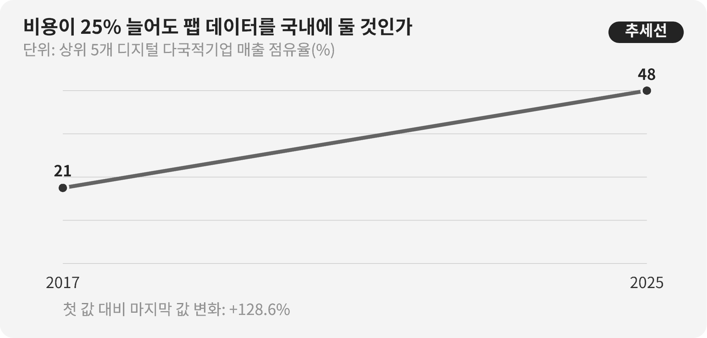

::: {.book-question}
[오늘의 책문]{.book-question-label}

{.book-question-image width=30mm fig-alt="국경을 가로지르는 데이터 물결과 국내 금고, 협력 공장을 함께 그린 미니멀 수묵화 상징 삽화"}

[팹 데이터를 국내에 저장하면 협력사의 클라우드 비용이 25% 늘어도 데이터 현지화를 해야 하는가?]{.book-question-prompt}
:::

1447년 세종의 법과 권한에 관한 책문^[이 장이 연결한 실제 책문([策問]{.hanja})은 법이 폐단을 낳아 다시 법을 세우는 순환과 권한의 자리를 물었습니다. 책문 아카이브가 뜻을 줄여 재구성한 한문은 “[法立而弊生，弊生而法又立。其所以救之者何歟？政權當歸於何所歟？]{.hanja}”이며 원문 직역은 아닙니다. “법을 세우면 폐단이 생기고 폐단이 생기면 다시 법을 세운다. 이를 구제할 방법은 무엇이며 정권은 어디에 돌아가야 하는가”라는 물음입니다. 오늘의 질문은 당시 권력기관을 데이터센터에 그대로 대응한 번역이 아니라, 통제를 강화하려 만든 규칙이 새 비용과 집중을 낳을 때 권한의 자리와 구제절차를 다시 묻는 구조를 빌립니다.]은 규칙이 있다는 사실만으로 좋은 통치가 완성되지 않는다고 보았습니다. 데이터를 국내에 둔다는 규칙도 통제권을 높일 수 있지만, 소수 사업자에게 시장을 몰아주거나 복구와 협업을 어렵게 하는 새 폐단을 만들 수 있습니다.

팹 데이터는 한 종류가 아닙니다. 공정 레시피와 장비 파라미터, 결함 이미지, 예지정비 로그, 작업자 개인정보, 구매·고객 정보, 비식별 생산통계는 유출·변조·중단의 피해가 다릅니다. 저장 위치 하나로 모두를 묶으면 가장 민감한 데이터에는 부족하고 가장 덜 민감한 데이터에는 과도한 규칙이 될 수 있습니다.

## 왜 지금 이 질문인가

UNCTAD는 2025년 디지털시장 집중을 다룬 자료에서 상위 5개 디지털 다국적기업의 매출 점유율이 2017년 21%에서 2025년 48%로 두 배 이상 커졌다고 밝혔습니다. 또한 43개국 기업 전자상거래 매출은 2016~2022년 약 60% 증가했습니다.

이 수치는 세계 디지털 시장이 집중됐다는 배경이지, 팹 데이터 현지화가 보안을 높이거나 낮춘다는 직접 실험이 아닙니다. 오히려 규칙을 설계할 때 소수 글로벌 클라우드의 지배력과 국내 소수 사업자에 대한 재집중을 모두 보라는 신호입니다.

보안은 데이터의 물리적 위치보다 암호화, 키 소유, 계정 권한, 운영자 접근, 패치, 백업 격리, 사고 대응과 공급망에서 깨질 수 있습니다. 반대로 위치와 관할권도 무의미하지 않습니다. 비상시 법집행, 압수·접근, 해외 정부 요구, 서비스 중단과 계약 집행에 영향을 줍니다.

신입 데이터 거버넌스 담당자의 실무는 ‘국내냐 해외냐’ 투표가 아닙니다. 데이터 흐름을 그려 민감도를 등급화하고, 각 등급에 저장·처리·백업·국외이전·키·운영자·삭제 규칙을 붙이며, 비용과 복구시간을 시험하는 일입니다.

## 데이터 렌즈

{fig-alt="상위 다섯 개 디지털 다국적기업의 매출 점유율이 2017년 21퍼센트에서 2025년 48퍼센트로 증가한 데이터 그림"}

### 근거 데이터 표

| 근거 | 원자료의 수치·범위 | 성격 | 토론에서의 의미 |
|---:|---|---|---|
| 1 | 상위 5개 디지털 다국적기업의 매출 점유율은 2017년 **21%**에서 2025년 **48%**로 늘었습니다. | UNCTAD 세계시장 분석 | 클라우드·연산·데이터 접근이 소수 기업에 집중되는 배경입니다. |
| 2 | 43개국 기업의 전자상거래 매출은 2016~2022년 **약 60% 증가**했습니다. | EVIDENCE의 UNCTAD 근거 | 국경 간 디지털 거래가 커진 상황에서 이전 규칙의 비용이 넓게 퍼질 수 있습니다. |
| 3 | 데이터 현지화는 통제권을 높일 수 있지만 중소기업의 클라우드 접근비용도 키울 수 있습니다. | EVIDENCE의 해석 근거 | 보안·관할 편익과 협력사의 비용·복구를 같은 평가표에 둡니다. |
| 4 | UNCTAD는 자본, 데이터와 컴퓨팅 접근이 디지털시장 진입장벽이 될 수 있다고 설명합니다. | 원자료의 정책 분석 | 현지화 설계에서도 중소 협력사의 접근성을 별도 KPI로 둡니다. |
| 5 | 사례는 전면 현지화 때 협력사 비용 25% 증가, 장애복구 3시간 지연, 정부 비상접근 24시간 단축을 가정합니다. | **토론용 가정** | 공식 통계가 아니며 등급별 규칙의 손익을 비교하기 위한 조건입니다. |

### 이 숫자를 읽는 법

21%와 48%는 UNCTAD가 정의한 디지털 다국적기업 상위 5개의 매출 점유율입니다. 전체 클라우드시장 점유율이나 반도체 팹 소프트웨어 점유율로 바꾸어 말하면 안 됩니다. 매출·자산·이용자·데이터량은 서로 다른 집중도입니다.

2017년과 2025년 사이의 증가는 집중이 커졌음을 보여주지만 단독 원인을 말하지 않습니다. 규모의 경제, 인수합병, 네트워크 효과, AI 투자와 규제가 함께 작용할 수 있습니다.

43개국의 60% 증가도 전 세계 모든 기업의 증가율이 아닙니다. 국가 수, 명목가격, 통화와 표본 범위를 확인해야 합니다.

현지화의 보안효과는 별도 측정이 필요합니다. 사고 건수만 세면 탐지 능력이 좋아진 조직이 나빠 보일 수 있습니다. 탐지시간, 권한 오남용, 키 유출, 복구목표 달성, 제3자 접근, 패치 지연, 독립감사와 실제 피해를 함께 봅니다.

25%·3시간·24시간은 사례 가정입니다. 비용 증가의 분모가 저장비인지 총 IT비인지, 복구시간이 RTO인지 실제 평균인지, 비상접근이 어떤 적법 절차를 뜻하는지 명시해야 합니다.

## 대립 답안

### 답안 A — 핵심데이터 현지화론

공정 레시피, 결함모델, 장비 제어와 보안 로그는 생산경쟁력과 국가안보에 직결될 수 있습니다. 국내 관할과 국내 키 관리, 승인된 운영자, 격리 백업을 의무화하면 해외 서비스 중단과 외국 법 집행에 대한 통제력을 높일 수 있습니다. 사고 때 정부·기업의 공동대응 시간을 줄이는 편익도 있습니다.

하지만 ‘국내 저장’만 충족하고 계정·암호화·패치가 약하면 주소만 안전한 시스템이 됩니다. 국내 사업자 한 곳에 몰리면 동일 장애와 가격 인상 위험이 커집니다.

### 답안 B — 보안통제 중심 자유이전론

데이터 위치보다 종단간 암호화, 고객 보유키, 최소권한, 불변 로그, 다중지역 백업과 공급자 교체 가능성이 중요합니다. 글로벌 협력사가 같은 플랫폼에서 장비를 진단해야 복구가 빨라지고 중소기업도 규모의 경제를 이용합니다. 전면 현지화의 25% 비용은 혁신과 경쟁을 약화시킬 수 있습니다.

그러나 국외 관할, 해외 정부 요구, 제재·전쟁·네트워크 단절 같은 비기술 위험을 암호화만으로 없앨 수는 없습니다. 가장 민감한 데이터의 통제권과 비상 접근은 위치와 계약의 영향을 받습니다.

### 답안 C — 등급별 주권론

데이터를 네 등급으로 나누겠습니다. 장비제어·핵심 레시피·보안키는 국내 저장·처리와 국내 격리백업을 원칙으로 합니다. 민감한 품질·고객 데이터는 승인된 국가 간 암호화 이전과 고객 보유키를 허용합니다. 비식별 통계와 공개 기술자료는 다지역 클라우드를 씁니다. 개인정보와 수출통제 데이터는 별도 법률 검토를 거칩니다.

등급은 이름이 아니라 피해 시나리오로 정합니다. 기밀성·무결성·가용성, 법적 관할, 복구시간과 공급자 전환을 점수화하고 예외에는 만료일과 승인자를 둡니다. 현지화로 비용이 늘어나는 중소 협력사에는 공동 보안서비스와 표준 이전도구를 제공하되, 보안 예외를 값싼 계약의 대가로 주지는 않습니다.

## AI 조사 설계

### AI에게 물어볼 프롬프트

> 반도체 팹 데이터의 등급별 저장·처리·국외이전 규칙을 설계하십시오. ① 데이터 목록과 실제 흐름, ② 계약·관할·개인정보·수출통제에 관한 사내 법률검토, ③ 계정·암호화·키·백업·사고대응 통제, ④ 비용·지연·복구훈련, ⑤ UNCTAD 디지털시장 집중 자료 순서로 확인하십시오. 공정 레시피, 장비제어, 결함 이미지, 예지정비 로그, 작업자 개인정보, 구매·고객, 비식별 통계를 구분하고 각 등급의 기밀성·무결성·가용성 피해를 평가하십시오. 국내 저장이 보안을 자동 보장한다고 가정하지 말고 키 소유·운영자 위치·원격접근·백업까지 포함하십시오. 확인 사실, 법무 의견, 공급자 주장, AI 추론, 사례 가정을 분리하십시오. AI에 원문 레시피·개인정보·보안키를 입력하지 말고 법적 결론은 담당 변호사의 확인 대상으로 표시하십시오.

### 데이터 취득

| 순서 | 자료 | 확인할 항목 |
|---:|---|---|
| 1 | 데이터 목록·흐름도 | 생성 장비, 필드, 민감도, 저장·처리·백업 위치, 수신자, 보존기간 |
| 2 | 권한·보안 로그 | 사용자·서비스계정, 키 소유, 원격운영자, 관리자 접근, 이상탐지 |
| 3 | 계약·법률 검토 | 관할, 하도급, 정부요구 통지, 이전·삭제, 서비스 종료, 감사권 |
| 4 | 비용·성능·복구 시험 | 저장·전송비, 지연, RTO·RPO, 다지역 장애훈련, 공급자 전환시간 |
| 5 | 협력사 영향 | 기업규모, 추가비용, 기술인력, 표준 도구, 보안사고와 지원수요 |

### 정보 판정

1. **위치와 통제 분리:** 서버 주소, 법적 관할, 키, 운영자와 백업 위치를 따로 기록합니다.
2. **최소화:** 업무에 필요하지 않은 필드와 보존기간을 먼저 줄입니다.
3. **복구 실증:** 계약상 RTO가 아니라 실제 장애훈련 결과를 봅니다.
4. **공급자 집중:** 한 국내 사업자로의 이동이 새로운 단일장애점을 만드는지 확인합니다.
5. **비용 분모:** 저장비·총 클라우드 비용·제품원가 중 무엇의 25%인지 명시합니다.
6. **법률 최신성:** 관할별 규정과 계약은 시행일·예외를 법무가 원문으로 재확인합니다.

### 토론의 핵심

- 데이터 주권을 저장 위치, 암호키, 법적 관할, 비상 접근 중 무엇으로 정의합니까?
- 공정 레시피와 비식별 장비진단 통계를 같은 규칙으로 묶으면 어떤 비용이 생깁니까?
- 중소 협력사의 25% 비용을 대기업과 정부가 분담해야 하는 조건은 무엇입니까?
- 현지화가 국내 사업자 독점을 키우면 경쟁과 보안을 어떻게 동시에 지킵니까?

## 사례형 토론

당신은 데이터 거버넌스팀 입사 5개월 차 사원입니다. 전면 현지화안은 중소 협력사의 총 클라우드 비용을 25% 높이고 다지역 장애 복구를 3시간 늦추지만, 정부의 적법한 비상 접근은 24시간 빨라질 것으로 내부 검토팀이 예상합니다. 모두 토론용 가정입니다.

- 이전 대상은 2 PB이며 핵심 레시피·제어 5%, 품질·결함 이미지 35%, 예지정비 40%, 개인정보·계약 10%, 비식별 통계 10%입니다.
- 국내 이중사업자 구성은 연 40억 원, 기존 다지역 구성은 연 32억 원입니다.
- 해외 장비사 12곳이 예지정비 로그에 접근하며, 국내 중계 방식은 평균 진단을 90분 늦춥니다.
- 국내 키관리와 불변로그를 적용하면 고위험 관리자 계정은 180개에서 60개로 줄일 수 있습니다.

신입 사원은 **전면 현지화, 보안통제를 강화한 현행 유지, 등급별 현지화와 제한 이전** 가운데 하나를 선택합니다. 팹 운영, 보안, 법무, 중소 협력사, 해외 장비사, 정부 대응 담당자가 반론을 냅니다.

최종안에는 등급표, 저장·처리·백업 위치, 키 소유, 해외 접근 방식, 비용 분담, RTO·RPO, 비상접근 절차, 예외 만료와 분기별 감사 항목을 넣으십시오.

## 90초 발언 예시

“저는 **답안 C, 전면 현지화가 아니라 데이터 등급별 주권안**을 택하겠습니다. UNCTAD는 상위 5개 디지털 다국적기업의 매출 점유율이 2017년 21%에서 2025년 48%로 커졌다고 봅니다. 집중 위험은 분명하지만 국내 저장만으로 보안이 보장되지는 않습니다. 사례의 데이터 2 PB, 비용 25% 증가, 복구 3시간 지연과 비상 접근 24시간 단축은 모두 가정입니다. 전면 현지화가 관할권과 비상 통제를 높인다는 반론은 인정합니다. 핵심 레시피·제어 5%와 보안 키는 국내 처리와 격리 백업을 의무화하고, 품질 이미지는 국내 원본과 가명 진단본으로 나누겠습니다. 예지 정비 데이터는 필드를 최소화해 고객 보유 키·승인 세션·불변 로그 아래 해외 접근을 허용하겠습니다. 복구 훈련이 현행보다 1시간 이상 느리거나 관리자 계정이 목표를 넘으면 해당 등급을 재설계하겠습니다. 해외 접근에서 키나 로그 위반이 한 건이라도 확인되면 즉시 국내 중계로 전환하겠습니다. 데이터 주권은 저장 장소가 아니라 접근·중단 권한과 복구 능력으로 증명해야 합니다.”

## 꼬리 질문

**교차질문과 재반박**

- 핵심 레시피가 전체의 5%여도 다른 로그와 결합해 복원될 수 있다면 등급을 어떻게 조정하겠습니까?
- 국내 사업자 두 곳이 같은 전력망과 소프트웨어를 쓰면 이중화라고 볼 수 있습니까?
- 정부 비상 접근이 24시간 빨라지는 편익이 실제로 필요한 사건 빈도와 무관하면 어떻게 평가합니까?
- 해외 장비사의 진단이 90분 늦어져 팹 손실이 커질 때 보안팀은 어느 예외를 허용해야 합니까?
- 협력사 비용 25%의 분모가 총 IT비가 아니라 저장비뿐이라면 결론이 달라집니까?
- 법률상 국내 저장이 의무인 데이터와 회사가 자율적으로 정한 데이터를 문서에서 어떻게 구분하겠습니까?

## 출처

- [UNCTAD, “Highly concentrated digital markets put consumers at risk”—상위 5개 디지털 다국적기업 매출 점유율 (2025)](https://unctad.org/news/highly-concentrated-digital-markets-put-consumers-risk-heres-how-change-course)
- [UNCTAD, “Online dispute resolution key to boosting consumer trust”—43개국 기업 전자상거래 매출 (2024)](https://unctad.org/news/un-trade-and-development-online-dispute-resolution-key-boosting-consumer-trust)
- [조선시대 책문 아카이브, 세종 1447년 「법의 폐단과 권력의 자리」](https://waterfirst.github.io/Joseon-Dynasty-Civil-Service-Examination/#sejong-1447/0)
- [국사편찬위원회, 세종실록 1447년 8월 5일 기록](https://sillok.history.go.kr/id/kda_12908005_001)

> **자료 메모:** 21%·48%·43개국·약 60%는 UNCTAD 자료의 시장 집계입니다. 비용 25%·복구 3시간·비상 접근 24시간과 사례의 2 PB·구성비·비용·장비사·계정 수 및 전환 조건은 모두 토론용 가정입니다. 실제 법적 의무는 관할별 원문과 법률 전문가 검토로 확정해야 합니다.
