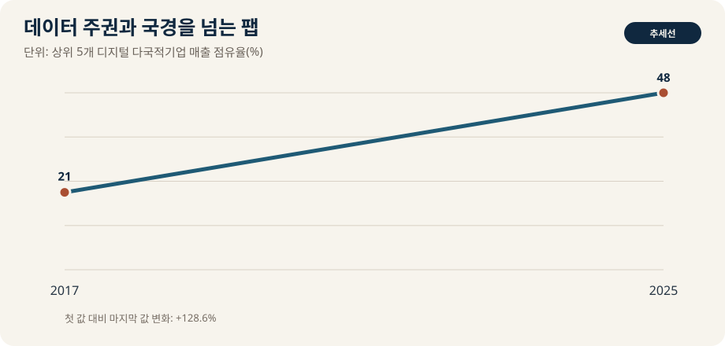

## 오늘의 책문

> **생산·고객·근로자 데이터는 국가 안보를 이유로 국경 안에 머물러야 하는가?**

조선의 모티브는 **중앙과 지방의 권한 책문—한곳에 모은 정보는 질서인가 위험인가**이다. 책문은 사실을 많이 아는 사람보다, 충돌하는 가치의 우선순위와 자기 답이 실패할 조건을 밝히는 사람을 가려냈다. 오늘의 응시자는 이 질문을 산업의 숫자와 인간의 비용을 함께 놓고 답해야 한다.

## 왜 지금 이 질문인가

국경간 데이터 흐름, 클라우드 집중, 사고 대응시간, 현지화 비용, 중소기업 접근성을 본다. 이 주제를 단순한 찬반으로 만들면 중요한 당사자가 사라진다. 공급망의 비용은 구매팀만, AI의 위험은 개발팀만, 노동의 전환은 개인만 책임지는 문제가 아니다. 결정권·편익·손실이 누구에게 배분되는지까지 보여야 토론이 산업 분석이 된다.

## 데이터 렌즈

{fig-alt="데이터 주권과 국경을 넘는 팹 핵심 데이터"}

| 데이터 카드 | 발언에 쓸 수 있는 검증 문장 |
|---:|---|
| 1 | UNCTAD는 상위 5개 디지털 다국적기업의 매출 점유율이 2017년 21%에서 2025년 48%로 두 배 이상 늘었다고 밝혔다. |
| 2 | 43개국 기업 전자상거래 매출은 2016~2022년 약 60% 증가했다. |
| 3 | 데이터 현지화는 통제권을 높일 수 있지만 중소기업의 클라우드 접근 비용도 키운다. |

첫 번째 숫자는 문제의 **규모**를, 두 번째는 **분배**를, 세 번째는 **시간축 또는 제약조건**을 보여준다. 다만 숫자는 결론이 아니다. 집계 범위가 다른 자료를 한 그래프에서 직접 비교하지 말고, 전망치는 사실값이 아니라 가정의 결과라고 밝혀야 한다. 기업·정부·군의 발표는 이해관계가 있는 1차 자료이므로 독립 통계와 대조한다.

### 숫자가 말하지 못하는 것

- 평균은 지역·직무·기업규모별 격차를 숨길 수 있다.
- 비용으로 계산되지 않은 안전, 존엄, 환경, 장기 역량은 의사결정표에서 쉽게 사라진다.
- 사건 뒤의 상관관계가 정책이나 기술의 인과효과를 자동으로 증명하지 않는다.

따라서 면접에서는 숫자를 많이 외우기보다 **숫자의 정의와 결론이 바뀌는 임계값**을 말하는 편이 강하다. 예를 들어 “공급선이 두 개”보다 “두 번째 공급선이 같은 원료·항만·인증 설비를 공유하는가”가 복원력을 더 잘 묻는다.

## 대립 답안

### 답안 A — 적극론

전략산업 데이터의 통제권은 위기 대응과 법 집행을 위해 필요하다.

이 답의 강점은 결정 지연의 비용을 본다는 데 있다. 위기가 실제이고 대체시간이 길다면, 평시의 최적비용보다 행동 속도가 중요하다. 약점은 정책이나 투자의 편익을 크게, 숨은 비용을 작게 추정하기 쉽다는 점이다.

### 답안 B — 경계론

강제 현지화는 비용을 높이고 보안을 자동으로 보장하지 않는다. 인터넷의 분절을 키운다.

이 답의 강점은 과잉대응과 권력 집중을 견제한다는 데 있다. 약점은 시장이나 기존 제도가 충분히 빠르게 조정될 것이라는 가정을 숨길 수 있다는 점이다. 아무것도 하지 않는 선택에도 피해자와 비용이 있다는 사실을 계산해야 한다.

### 답안 C — 조건부론

데이터 민감도별 분류, 상호인정, 암호화·감사, 비상 접근 규칙을 층위별로 설계해야 한다.

## 판정 조건

조건부론은 가운데에 서는 타협이 아니다. 무엇을 측정해 어느 임계값에서 A에서 B로, 또는 B에서 A로 전환할지 정하는 답이다. 의사결정자는 효율·회복탄력성·분배·가역성·설명책임 가운데 최소 세 축을 공개해야 한다.

## 사례형 토론

당신은 반도체 기업의 전략 태스크포스에 참여했다. 이사회는 48시간 안에 투자·조달·운영 원칙을 정하라고 요구한다. 동시에 재무팀은 비용 증가를, 현장팀은 실행 가능성을, 노동자·지역사회는 안전과 부담을 문제 삼는다.

1. 첫 결정에서 보호할 최우선 가치를 하나만 고른다.
2. 그 선택으로 손해를 보는 집단을 명시한다.
3. 90일 안에 확인할 선행지표 두 개와 결과지표 한 개를 정한다.
4. 결정을 중단하거나 뒤집을 수치·사건을 사전에 약속한다.

## 90초 발언 예시

“제 결론은 **데이터 민감도별 분류, 상호인정, 암호화·감사, 비상 접근 규칙을 층위별로 설계해야 한다**라고 봅니다. 근거로 먼저 UNCTAD는 상위 5개 디지털 다국적기업의 매출 점유율이 2017년 21%에서 2025년 48%로 두 배 이상 늘었다고 밝혔다. 다음으로 43개국 기업 전자상거래 매출은 2016~2022년 약 60% 증가했다. 이 두 수치는 문제의 규모와 편익이 자동으로 같은 곳에 가지 않는다는 점을 보여줍니다. 적극론의 장점은 행동 지연을 줄이는 것이지만, 비용과 권한이 고착될 위험이 있습니다. 반대로 경계론은 과잉대응을 막지만 아무것도 하지 않는 비용을 과소평가할 수 있습니다. 그래서 저는 90일 단위로 공개 지표를 점검하고, 사전에 정한 임계값을 넘으면 정책을 확대하되 넘지 못하면 축소하겠습니다. 확인하지 못한 숫자는 단정하지 않고 원출처와 정의부터 검증하겠습니다.”

이 문장을 외우지 말고 `결론 → 데이터 2개 → 강한 반론 → 전환 조건`의 순서를 익힌다. 집단토론에서는 상대방의 말을 요약한 뒤 빠진 지표를 보태야 점수를 얻는다.

## 꼬리 질문

**교차질문과 재반박**

- 적극론이 가정한 피해 규모가 절반이라도 같은 결론인가?
- 경계론이 말하는 시장 조정은 몇 개월 안에 일어나야 의미가 있는가?
- 비용을 가장 많이 부담하지만 데이터에 잡히지 않는 사람은 누구인가?
- 같은 원칙을 경쟁국·경쟁사에도 적용해도 받아들일 수 있는가?
- 첫 번째와 두 번째 핵심 수치 가운데 어느 것이 바뀌면 결론을 수정할 것인가?
- 결정이 실패했을 때 책임자가 실제로 통제할 수 있었던 변수는 무엇인가?

## 면접장 직전 메모

- 숫자는 **출처·연도·단위**와 함께 말한다.
- 전망과 실제, 명목과 실질, 상관과 인과를 구분한다.
- 상대 주장의 가장 강한 버전을 먼저 인정한다.
- 자기 결론의 수혜자·비용부담자·중단조건을 밝힌다.
- 모르는 수치는 만들지 말고 확인할 데이터셋을 말한다.

## 출처

- [UNCTAD digital market concentration](https://unctad.org/news/highly-concentrated-digital-markets-put-consumers-risk-heres-how-change-course)
- [UNCTAD Digital Economy Report](https://unctad.org/topic/ecommerce-and-digital-economy/digital-economy-report)

- [조선시대 책문 아카이브](https://waterfirst.github.io/Joseon-Dynasty-Civil-Service-Examination/)

> 데이터 기준일: 각 원출처의 표기 연도. 최신성이 중요한 수치는 상업 발행 직전에 다시 확인한다.
