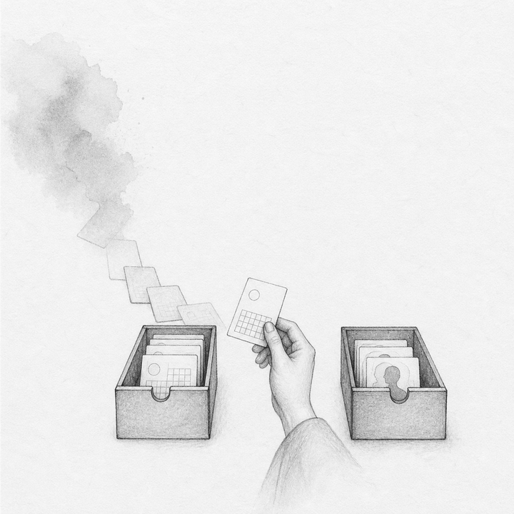
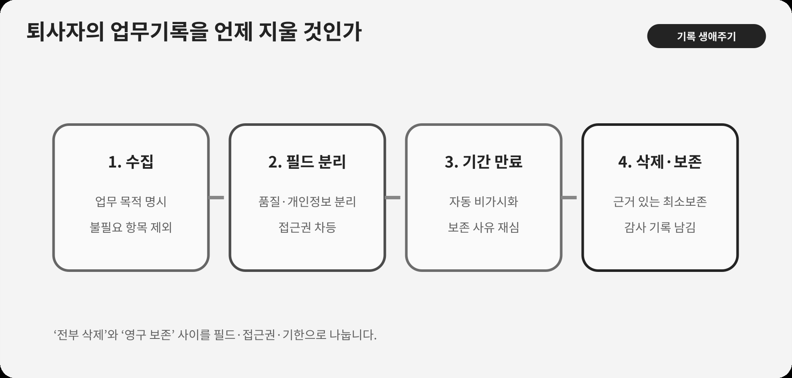

::: {.book-question}
[오늘의 책문]{.book-question-label}

{.book-question-image width=30mm fig-alt="기록 두루마리에서 업무 흔적은 남고 사적인 그림자는 지워지는 미니멀 수묵화 상징 삽화"}

[프로젝트 기록에 퇴사자의 개인정보가 남아 있을 때 완전삭제·비가시화·보존 가운데 무엇을 택해야 하는가?]{.book-question-prompt}
:::

1616년 광해군의 세월 책문^[이 장과 연결한 실제 책문([策問]{.hanja})은 자연의 시간은 되돌아오는데 사람이 묵은해를 보내며 세월을 슬퍼하는 까닭을 물었습니다. 책문 아카이브가 뜻을 줄여 재구성한 한문은 “[日往則復，夜明復晦。人於除夕守歲而悲流光者，何也？]{.hanja}”이며 원문 직역은 아닙니다. “해는 가면 다시 오고 밤은 밝았다가 다시 어두워진다. 사람이 섣달그믐에 수세하며 흐르는 세월을 슬퍼하는 것은 어째서인가”라는 물음입니다. 오늘의 질문은 당시의 시간 철학을 개인정보 규정으로 번역한 것이 아니라, 지나간 것을 남기는 기억과 다시 시작하려는 사람 사이의 긴장을 빌립니다.]은 시간이 반복되는 것처럼 보여도 한 사람의 삶은 되돌릴 수 없다는 감각을 묻습니다. 디지털 시스템은 거의 모든 기록을 남길 수 있지만, 저장할 수 있다는 사실이 영구보존의 정당성을 만들지는 않습니다.

반도체 조직에는 오래 남겨야 할 기록이 있습니다. 설계변경, 공정 이탈, 검사결과, 승인과 고객 조치가 사라지면 결함 원인을 추적하지 못하고 같은 실패를 반복합니다. 그러나 그 기록 안에 개인 메신저, 건강정보, 가족사, 관리자 평가와 소문까지 섞여 있다면 품질보존이라는 목적이 퇴사자의 삶 전체를 붙잡는 구실이 됩니다.

## 왜 지금 이 질문인가

UNESCO ‘세계기록유산’ 프로그램은 세계의 기록유산이 보존·보호되고 접근 가능해야 한다는 원칙을 내세웁니다. 주요 목표는 분쟁·재난에 취약한 기록유산의 보존을 돕고, 보편적 접근을 가능하게 하며, 기록유산의 중요성에 대한 인식을 높이는 것입니다. 이 원칙은 공익적 기록의 보존 가치를 보여줍니다.

하지만 회사의 모든 디지털 흔적이 기록유산은 아닙니다. 보존 가치, 법정 의무, 계약 책임, 개인정보와 당사자 권리가 다릅니다. 이 장에서 UNESCO 자료는 ‘기억을 보존해야 하는 이유’의 한 축을 제공할 뿐, 회사의 보존기간이나 삭제 의무를 정하는 법률 근거가 아닙니다. 실제 규칙은 적용 법률과 계약, 품질규격을 법무·품질 부서가 확인해야 합니다.

OECD 개인정보 가이드라인은 개인정보의 수집을 제한하고, 수집 목적을 명시하며, 그 목적과 양립하지 않는 후속 이용을 제한하라고 권고합니다. 당사자가 자기 정보의 존재와 이용 목적을 확인하고 거절 이유에 이의를 제기할 수 있어야 한다는 원칙도 제시합니다. 이것 역시 개별 사건의 보존기간을 정하는 국내법은 아니지만, 회사가 ‘나중에 쓸 수도 있다’는 이유만으로 모든 기록을 보관해서는 안 된다는 설계 기준을 줍니다.

신입 문서관리 담당자는 완전삭제와 영구보존 중 하나를 고르는 대신 문서 안의 필드를 분리해야 합니다. 업무 결정 근거는 보존하되 불필요한 개인 대화는 삭제하고, 이름이 없어도 재식별될 수 있는 경우 익명화 수준을 검증하며, 접근권한과 검색 노출을 줄이고, 보존기간이 끝나면 자동 재심사합니다.

## 데이터로 보기

{fig-alt="보존·접근·삭제·기간만료를 서로 다른 기록정책 수단으로 구분한 데이터 그림"}

### 근거 데이터 표

| 근거 | 원자료 또는 분석틀 | 성격 | 토론에서의 의미 |
|---:|---|---|---|
| 1 | UNESCO는 세계 기록유산이 모두의 것이며 보존·보호되고 접근 가능해야 한다는 원칙을 제시합니다. | UNESCO 프로그램 원칙 | 품질·안전처럼 공익과 책임 추적에 필요한 기록은 보존 가치가 있습니다. |
| 2 | UNESCO 프로그램의 목표에는 기록유산 보존, 보편적 접근, 중요성에 대한 인식 제고가 포함됩니다. | UNESCO 프로그램 목표 | 보존과 접근은 같은 말이 아니며 누구에게 어떻게 보여줄지도 설계해야 합니다. |
| 3 | 공익적 기록의 보존과 개인의 재출발 권리는 한 개의 일률적 보존기간으로 해결할 수 없습니다. | EVIDENCE의 분석 근거 | 선별·목적·접근권·기간만료를 문서 종류별로 설계합니다. |
| 4 | 완전삭제, 검색 비노출, 접근 제한, 익명화, 기간 만료 후 재심사는 서로 다른 정책 수단입니다. | **이 장의 분석틀** | 한 개 보존기간으로 모든 충돌을 해결하지 않고 목적·민감도별로 조합합니다. |
| 5 | 사례는 품질기록 10년 보존 필요, 개인 메신저·건강정보 혼재를 가정합니다. | **토론용 가정** | 특정 회사나 법률의 실제 기간이 아니며 분리 설계를 연습하기 위한 조건입니다. |
| 6 | OECD 가이드라인은 개인정보의 수집 제한, 목적 명시·이용 제한, 안전조치와 당사자 참여 원칙을 제시합니다. | OECD 국제 가이드라인 | 보존할 필드를 목적과 연결하고, 목적 없는 재사용·검색 노출·무기한 보관을 막는 점검표가 됩니다. |

### 이 숫자를 읽는 법

UNESCO의 원칙은 공익적 기록유산을 대상으로 합니다. 회사 서버의 파일 수, 사람 수, 저장용량이나 법적 보존기간을 정하는 통계가 아닙니다.

보존기간 10년도 이 장의 가정입니다. 실제 기간은 제품·고객·국가·소송보존·품질규격에 따라 다를 수 있습니다. ‘품질기록 10년’이라는 폴더 이름만 보고 그 안의 모든 개인정보를 10년 보존할 수 있다고 단정하지 않습니다.

삭제율은 성과지표가 될 수 있지만 단독으로 쓰면 필요한 증거까지 지우게 합니다. 보존 목적이 있는 필드의 완전성, 목적 없는 개인정보 삭제, 접근권한 축소, 기간만료 검토, 법적 보존명령 준수를 함께 봅니다.

익명화도 이름을 지우는 것으로 끝나지 않습니다. 프로젝트명, 날짜, 희귀질환, 직책과 대화 맥락을 결합해 사람을 알아볼 수 있는지 재식별 위험을 시험해야 합니다. 가능성이 남으면 접근제한과 가명화를 함께 씁니다.

## 대립 답안

### 답안 A — 추적성 보존론

반도체 결함은 수년 뒤 고객 현장에서 드러날 수 있습니다. 누가 어떤 데이터로 설계·공정 변경을 승인했는지 남아야 원인을 찾고 책임을 바로잡을 수 있습니다. 퇴사했다는 이유로 업무 의사결정 기록을 전부 지우면 품질·안전·감사와 학습이 훼손됩니다. 개인 이름도 승인권한과 이해충돌을 입증하는 데 필요한 경우가 있습니다.

그러나 추적성이라는 넓은 말로 사적 대화와 건강정보를 함께 보존하면 목적을 벗어납니다. 검색 가능성과 접근권이 과도하면 기록이 인사평가와 낙인의 자료로 재사용될 수 있습니다.

### 답안 B — 재출발 삭제론

업무에 필요하지 않은 개인 메신저, 건강·가족정보, 비공식 평가는 퇴사와 함께 삭제해야 합니다. 미래의 불확실한 필요를 이유로 영구 저장하면 당사자가 통제할 수 없는 프로필이 쌓이고 유출 피해도 커집니다. 저장 최소화는 보안의 기본이기도 합니다.

하지만 문서 전체를 삭제하면 결함 조사와 고객 보상에 필요한 근거까지 사라질 수 있습니다. 삭제 요구를 파일 단위로만 처리하는 체계가 문제입니다.

### 답안 C — 필드 분리·기한 재심론

품질 판단의 입력, 결정, 승인과 결과는 목적에 맞는 기간 동안 보존하되, 사적 대화·건강정보는 업무근거와 분리해 삭제하거나 매우 제한된 별도 보관으로 옮기겠습니다. 사람 이름이 없어도 되는 분석 사본은 가명화하고, 승인 책임이 필요한 원본은 최소 인원만 접근하게 합니다.

보존기간이 끝나면 자동삭제가 아니라 먼저 법적 보존명령·미해결 품질사건을 확인하고, 연장이 필요하면 목적·기간·승인자를 새로 기록합니다. 검색 노출을 제한하고 모든 열람을 남기며, 퇴사자에게 처리 결과와 이의제기 경로를 알립니다.

## AI 조사 설계

### AI에게 물어볼 프롬프트

> 퇴사자의 정보가 섞인 반도체 품질기록을 목적별로 분리할 보존·삭제 규칙을 설계하십시오. 원문 파일이나 개인정보를 외부 AI에 업로드하지 말고 승인된 가상 필드명과 비식별 메타데이터만 사용하십시오. ① 문서 유형·필드·소유자 목록, ② 품질·계약·소송보존·개인정보에 대한 사내 법률·규격 검토, ③ 접근·검색·복사 로그, ④ 삭제·익명화·백업 복구 절차, ⑤ OECD 개인정보 가이드라인과 UNESCO 기록유산 원칙 순서로 확인하십시오. 각 필드의 목적, 필요성, 보존기간, 당사자 통지, 접근자, 삭제 방식, 재식별 위험, 연장 승인자를 표로 만드십시오. 확인된 의무, 회사 정책, 담당자 주장, AI 추론과 사례 가정을 구분하고 법률 결론은 법무 검토 대상으로 표시하십시오.

### 데이터 취득

| 순서 | 자료 | 확인할 항목 |
|---:|---|---|
| 1 | 문서·필드 인벤토리 | 품질근거, 승인, 대화, 건강·가족, 고객정보, 작성자, 저장·백업 위치 |
| 2 | 보존 근거표 | 법률·계약·품질규격, 시작일, 기간, 소송보존, 국가·제품별 차이 |
| 3 | 접근·사용 로그 | 검색자, 열람·다운로드, 목적, 권한 변경, 비정상 접근, 인사 재사용 |
| 4 | 삭제·가명화 시험 | 운영계·백업·검색색인·캐시 삭제, 재식별 시험, 증명서와 실패 복구 |
| 5 | 당사자 절차 | 통지, 열람·정정·삭제 요청, 거절 근거, 이의제기, 처리기한 |

### 정보 판정

1. **목적 연결:** 각 필드가 품질 추적에 실제 필요한지 문서화합니다.
2. **최소성:** 같은 목적을 덜 민감한 데이터로 달성할 수 있는지 확인합니다.
3. **기간 기산:** 작성일·퇴사일·제품종료·사건종료 중 시작점을 명확히 합니다.
4. **재식별:** 직접 식별자 삭제 뒤 결합정보로 개인을 알아볼 수 있는지 시험합니다.
5. **백업 포함:** 운영계 삭제와 백업·검색색인에서의 삭제·격리를 구분합니다.
6. **법률 검토:** 국가와 계약별 의무를 AI가 확정하지 않고 담당자가 원문으로 승인합니다.

### 토론의 핵심

- 품질 추적에 개인 이름이 필요한 경우와 역할·사번 가명만 필요한 경우를 어떻게 나눕니까?
- 완전삭제가 불가능한 백업에서는 접근격리와 자연 만료를 삭제로 볼 수 있습니까?
- 퇴사자의 삭제 요구와 미해결 고객 결함조사가 충돌하면 누가 기간을 연장합니까?
- 익명화 뒤 재식별 위험을 어느 수준까지 낮춰야 데이터를 재사용할 수 있습니까?

## 사례형 토론

당신은 문서관리팀 입사 3개월 차 사원입니다. 10년 보존이 필요하다고 분류된 품질 프로젝트 폴더에 퇴사자의 개인 메신저 내보내기와 건강정보가 섞여 있습니다. 전면삭제는 결함 추적성을 해치고 현 상태는 과다보존입니다. 다음 수치는 모두 토론용 가정입니다.

- 폴더는 200GB, 파일 12만 개이며 품질 판단에 직접 필요한 파일은 표본검토상 약 35%입니다.
- 퇴사자 18명 가운데 7명이 삭제·처리 결과 통지를 요청했습니다.
- 건강정보가 포함된 파일은 자동분류가 420개를 찾았지만 표본 정확도는 86%입니다.
- 미해결 고객 결함 2건과 소송보존 1건이 있어 관련 자료는 즉시 삭제할 수 없습니다.

신입 사원은 **폴더 전체 10년 보존, 사적 정보 우선 완전삭제, 필드·사건별 분리와 접근제한** 가운데 하나를 선택합니다. 품질팀, 법무·개인정보팀, IT 백업팀, 퇴사자 대리, 감사팀이 각자의 요구를 냅니다.

최종안에는 30일 분류, 사람 검토, 품질 원본과 분석 사본, 건강정보 격리, 접근자, 소송보존, 백업 처리, 퇴사자 통지, 6개월 재심과 감사표본을 넣으십시오.

## 90초 발언 예시

“저는 폴더 전체를 지우거나 10년간 그대로 두지 않고 필드와 사건별로 분리하겠습니다. UNESCO는 기록유산의 보존과 접근을 함께 강조하지만 회사의 모든 개인 대화가 공익 기록은 아닙니다. OECD도 개인정보의 수집·이용을 명시된 목적에 맞게 제한하라고 권고합니다. 사례에서 200GB·12만 파일 중 품질 판단에 직접 필요한 것은 표본상 35%이고, 건강정보 자동 탐지 정확도는 86%라는 가정입니다. 자동 분류만 믿고 삭제하면 오분류 위험이 있으므로 30일 동안 품질 근거, 승인 기록, 사적 대화, 민감정보를 사람이 표본 검증하겠습니다. 미해결 결함 2건과 소송 보존 1건 관련 원본은 최소 권한으로 격리하고 열람을 기록합니다. 나머지 개인 메신저와 건강정보는 업무 근거를 추출한 뒤 운영 시스템·검색 색인에서 삭제하고 백업은 복구 시 재삭제 목록에 넣겠습니다. 퇴사자 7명에게 목적·보존 기간·거절된 항목의 근거를 통지하겠습니다. 6개월 뒤 미해결 사건이 끝나면 연장 승인 없는 자료를 자동 만료시키고, 재식별 시도 성공률이 내부 가상 기준 1%를 넘으면 분석 사본 사용을 중지하겠습니다. 10년과 1%는 토론용 기준입니다. 이명한은 유한한 시간을 남은 책임으로 돌렸습니다(의역). 그 순서대로 책임을 증명할 기록은 남기고 사람을 붙잡는 기록은 지우겠습니다.^[이명한의 1616년 증광시 대책은 사람에게 유한한 시간을 아껴 남은 날을 학문과 책임으로 채워야 한다는 취지입니다(현대어 의역). 방목에는 을과 6위, 전체 9위로 올라 장원이 아닙니다. 이 문장은 현대 개인정보정책의 권위가 아니라 유한한 시간과 기록의 목적을 함께 묻는 사고법의 선례로만 인용했습니다. [책문 아카이브 개별 항목](https://waterfirst.github.io/Joseon-Dynasty-Civil-Service-Examination/#gwanghae-1616/0), [한국학중앙연구원 1616년 증광시 방목](https://dh.aks.ac.kr/~sonamu5/wiki/index.php/SEDB%3A1616%EB%85%84%28%E5%85%89%E6%B5%B7_8%29_%E4%B8%99%E8%BE%B0_%EC%A6%9D%EA%B4%91%EC%8B%9C%28%E5%A2%9E%E5%BB%A3%E8%A9%A6%29_%EB%AC%B8%EA%B3%BC%28%E6%96%87%E7%A7%91%29), [한국문집총간DB 『백주집』](https://db.mkstudy.com/opendatabase/itkc/chonggan/book/bLZz/), [한국민족문화대백과사전 「이명한」](https://encykorea.aks.ac.kr/Article/E0044244)]”

## 꼬리 질문

**교차질문과 재반박**

- 품질 판단에 필요한 35%라는 표본 추정이 틀리면 어떤 이중검토로 과삭제를 막겠습니까?
- 건강정보가 의사결정의 차별 가능성을 입증하는 증거라면 삭제와 보존 중 무엇을 우선합니까?
- 퇴사자가 삭제를 요청했지만 고객 결함소송이 예상될 때 보존 연장 권한을 누구에게 줍니까?
- 백업에서 즉시 물리삭제할 수 없다면 접근격리와 복구 시 재삭제로 충분하다고 볼 수 있습니까?
- 승인자의 이름을 지우면 책임 추적이 약해지는데 가명화 수준을 어떻게 정하겠습니까?
- 보존기간 만료 직전에 AI 학습데이터로 변환된 기록은 원본 삭제 뒤에도 남겨도 됩니까?

## 출처

- [UNESCO, *Memory of the World Programme*—보존·접근 원칙과 프로그램 현황 (2026 열람)](https://www.unesco.org/en/memory-world)
- [OECD, *Guidelines Governing the Protection of Privacy and Transborder Flows of Personal Data*—수집 제한·목적 명시·이용 제한·당사자 참여 원칙 (2013 개정, 2026 열람)](https://legalinstruments.oecd.org/public/doc/114/body-text.en.html)
- [조선시대 책문 아카이브, 광해군 1616년 「섣달그믐밤은 왜 서글픈가」](https://waterfirst.github.io/Joseon-Dynasty-Civil-Service-Examination/#gwanghae-1616/0)
- [책문 아카이브, 이명한 대책 전승 해설](https://waterfirst.github.io/Joseon-Dynasty-Civil-Service-Examination/#gwanghae-1616/0)

> **자료 메모:** UNESCO 자료는 기록유산의 공익적 보존 원칙이고 OECD 자료는 국제 개인정보 가이드라인이며, 어느 자료도 기업 개인정보의 개별 법적 보존기간을 정하지 않습니다. 10년·200GB·12만 개·35%·18명·7명·420개·86%·사건 수와 모범답안의 기간·임계값은 모두 토론용 가정입니다.
