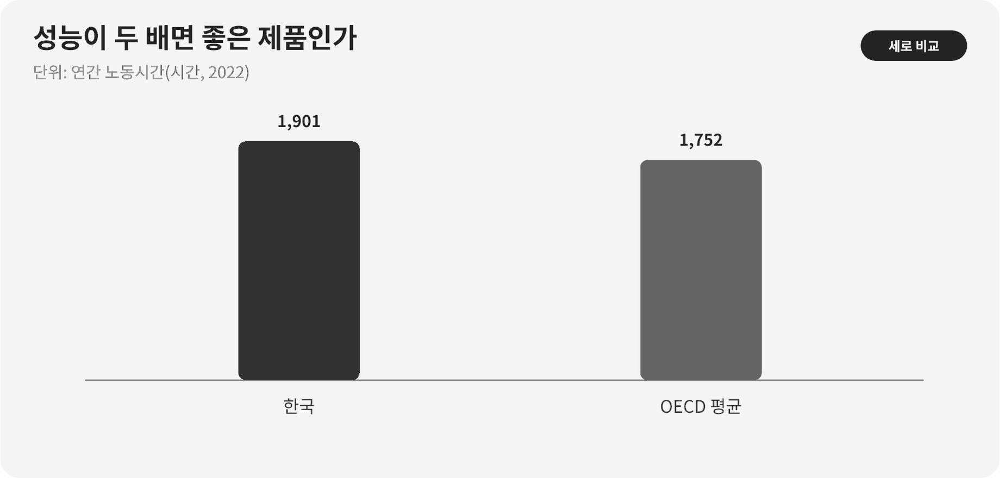

::: {.book-question}
[오늘의 책문]{.book-question-label}

{.book-question-image width=30mm fig-alt="빠르게 달리는 칩과 그 뒤에 놓인 전력·시간·삶의 저울을 그린 미니멀 수묵화 상징 삽화"}

[새 칩의 성능이 두 배라도 전력·교체비용·업무강도가 늘면 성공이라고 볼 수 있는가?]{.book-question-prompt}
:::

1515년 중종의 이상정치 책문^[이 장과 연결한 실제 책문([策問]{.hanja})은 이상을 오늘의 현실에 구현할 때 무엇을 먼저 할지 물었습니다. 책문 아카이브가 뜻을 줄여 재구성한 한문은 “[欲致堯舜之治於今日，何者爲先？子若孔子，將何以治國歟？]{.hanja}”이며 원문 직역은 아닙니다. “요순의 정치를 오늘에 이루려면 무엇을 먼저 해야 하는가. 그대가 공자라면 장차 어떻게 나라를 다스리겠는가”라는 물음입니다. 오늘의 질문은 이상정치를 제품 KPI로 번역한 것이 아니라, 좋은 상태를 말로 칭송하는 데서 멈추지 말고 현실의 우선순위와 실행기준을 제시하라는 구조를 빌립니다.]은 좋은 세상을 구성하는 요소를 나열하는 데서 멈추지 않았습니다. 무엇을 먼저 하고 어떤 결과로 이상을 확인할지 답하게 했습니다.

제품도 ‘성능이 높다’는 한 문장으로 성공을 정의하기 쉽습니다. 하지만 사용자가 기다리는 시간을 줄이지 못하거나, 전력과 냉각·교체비용을 크게 늘리고, 더 빠른 처리량이 더 많은 업무 할당으로만 돌아오면 벤치마크 성능과 삶의 개선은 갈라집니다.

OECD 지표는 노동생산성과 노동시간을 서로 다른 항목으로 측정합니다. 제품 평가도 벤치마크 성능만 보지 않고 사용자 시간과 건강, 전력·냉각·교체비용을 따로 확인해야 좋은 구성요소가 실제로 좋은 시스템을 만들었는지 판단할 수 있습니다.

## 왜 지금 이 질문인가

OECD 『Economic Surveys: Korea 2024』에 인용된 비교에서 한국의 2022년 연간 노동시간은 1,901시간으로 OECD 평균 1,752시간보다 149시간, 약 8.5% 길었습니다. 이것은 모든 한국 노동자가 정확히 1,901시간 일했다는 뜻이 아니라 국가 평균 비교입니다.

한편 OECD 생산성 자료는 한국의 시간당 노동생산성이 1995년 13.9달러에서 2024년 52.0달러로 거의 네 배가 됐다고 설명합니다. 단위는 2020년 구매력평가 기준의 불변 달러입니다. 생산성 향상은 생활수준을 높일 기반이지만, 노동시간·건강·분배·환경이 자동으로 좋아졌다는 뜻은 아닙니다.

신입 엔지니어가 제품평가회의에서 해야 할 일은 성능을 낮게 평가하는 것이 아닙니다. 벤치마크 성능이 실제 업무 대기와 완료시간을 줄이는지, 시스템 전력과 총소유비용은 얼마인지, 기존 장비를 얼마나 일찍 폐기하게 하는지, 야간·긴급 업무가 늘었는지, 고령·장애 사용자도 편익을 얻는지 같은 변환 경로를 확인하는 것입니다.

## 데이터 렌즈

{fig-alt="한국과 OECD 평균의 연간 노동시간, 한국 시간당 생산성의 장기 증가와 제품 성공의 여러 지표를 보여주는 데이터 그림"}

### 근거 데이터 표

| 근거 | 원자료의 수치·범위 | 성격 | 토론에서의 의미 |
|---:|---|---|---|
| 1 | 2022년 한국의 연간 노동시간은 **1,901시간**이었습니다. | OECD 국가 평균 통계 | 기술 편익이 사용자 시간을 실제로 줄이는지 묻게 하는 사회적 배경입니다. |
| 2 | 같은 해 OECD 평균은 **1,752시간**이었습니다. 한국은 149시간, 약 **8.5%** 길었습니다. | OECD 수치의 산술 비교 | 국가 간 제도·산업구조가 달라 원인을 칩 성능과 직접 연결해서는 안 됩니다. |
| 3 | 한국의 시간당 노동생산성은 1995년 **13.9달러**에서 2024년 **52.0달러**로 높아졌습니다. | OECD, 2020 PPP 불변달러 | 생산성이 거의 네 배가 돼도 삶의 모든 지표가 같은 비율로 변하는 것은 아닙니다. |
| 4 | 사례는 칩 벤치마크 성능 2배, 시스템 전력 35% 증가, 교체비용 20% 증가, 실제 업무시간 8% 감소를 가정합니다. | **토론용 가정** | 성능·비용·사용자 결과가 다른 방향으로 움직이는 선택을 연습합니다. |
| 5 | 성능을 2, 시스템 전력을 1.35로 단순 놓으면 이론적 성능/전력은 약 **1.48배**입니다. | **토론용 가정의 산술 계산** | 데이터시트 효율은 개선되지만 실제 업무시간 절감 8%와는 다른 지표입니다. |

### 이 숫자를 읽는 법

연간 노동시간은 평균입니다. 정규·비정규, 성별, 직종과 소득에 따라 분포가 다르고, 긴 노동시간의 원인을 반도체나 AI 하나로 설명할 수 없습니다. 국가 평균은 제품 성공의 직접 KPI가 아니라 사용자 시간을 별도로 측정해야 하는 이유입니다.

시간당 노동생산성의 13.9달러와 52.0달러는 명목 환율 달러가 아니라 2020년 PPP 불변가격입니다. 약 3.74배이며 ‘정확히 네 배’라고 쓰기보다 ‘거의 네 배’라고 표현합니다. 생산성은 산출/노동시간이지 임금, 삶의 만족, 환경의 단위가 아닙니다.

벤치마크 2배는 어떤 작업·정밀도·전력제한·소프트웨어를 썼는지에 따라 다릅니다. 최대성능, 지속성능, 평균 사용자 작업시간을 분리합니다. 2/1.35≈1.48 계산도 최대성능과 시스템 전력이 동일 조건이라는 시나리오일 뿐입니다.

업무시간 8% 감소가 곧 여가 8% 증가를 뜻하지 않습니다. 절약된 시간이 추가 업무, 대기, 보고, 교육, 휴식 중 어디로 갔는지 확인해야 합니다. 팀별 업무량과 야간 호출, 오류 수정시간을 함께 측정합니다.

## 대립 답안

### 답안 A — 성능 선도론

계산성능은 과학, 제조, 의료와 창작의 가능성을 넓히는 범용 기반입니다. 성능 2배와 성능/전력 1.48배라면 같은 시간에 더 큰 문제를 풀고 서버 수를 줄일 수 있습니다. 초기 전력과 교체비용이 늘어도 새로운 기능과 매출, 고객의 대기시간 절감이 장기 편익을 만들 수 있습니다.

그러나 최고 벤치마크를 실제 수요로 착각하면 과잉교체와 유휴성능을 낳습니다. 절약된 시간이 사용자에게 돌아갔는지 검증하지 않으면 성능은 내부 목표에 머뭅니다.

### 답안 B — 인간결과 우선론

실제 업무시간이 8%밖에 줄지 않는데 전력이 35%, 교체비용이 20% 늘면 성능 2배를 성공이라고 부르기 어렵습니다. 업무강도, 야간 대응, 건강, 접근가격, 수명과 폐기까지 포함해 사용자의 삶이 좋아져야 합니다. 성능이 충분한 기존 제품을 유지하는 선택도 혁신입니다.

하지만 모든 인간 결과가 장기 자료로 확인될 때까지 출시를 미루면 필요한 성능 개선과 시장 기회를 잃을 수 있습니다. 업무시간 절감만으로 의료 정확도나 연구 가능성 같은 질적 편익을 놓칠 수도 있습니다.

### 답안 C — 다중 문턱론

성능·전력·비용·사용자·환경을 가중평균 하나로 상쇄하지 않고 먼저 최소 문턱을 둡니다. 안전·신뢰성, 실제 핵심업무 개선, 전력·열 한계, 총소유비용, 접근성과 제품수명이 모두 최소 기준을 통과한 뒤 제품군별 가중점수를 계산합니다. 성능이 매우 높아도 안전이나 전력망 문턱을 넘지 못하면 출시하지 않습니다.

출시 후에는 절약된 시간의 귀속을 점검합니다. 업무시간이 줄어도 업무량과 야간 호출이 늘면 조직 프로세스를 바꾸고, 실제 활용률이 낮으면 교체를 늦춥니다. 특정 연구·의료 작업처럼 편익이 큰 고객에는 높은 비용을 허용하되 일반 사무에 같은 교체주기를 강요하지 않습니다.

## AI 조사 설계

### AI에게 물어볼 프롬프트

> 새 반도체 제품의 성공을 벤치마크 성능 외 실제 사용자·비용·환경 결과로 평가할 대시보드를 설계하십시오. ① 동일 조건의 칩·시스템 벤치마크, ② 고객 작업로그와 전후 시간연구, ③ 전력·냉각·고장·교체·폐기 데이터, ④ 가격·총소유비용·접근성·건강 설문, ⑤ OECD 노동시간·생산성 원문 순서로 확인하십시오. 성능 2배, 전력 35% 증가, 비용 20% 증가, 업무시간 8% 감소가 모두 사례 가정임을 표시하고 기능·고객군별 민감도 분석을 하십시오. 평균뿐 아니라 분포와 최악집단을 제시하고 시간 절감이 추가업무와 휴식 중 어디로 갔는지 구분하십시오. 확인 사실, 회사 주장, 사용자 관측, AI 추론, 전망을 별도 열에 쓰십시오. 안전·개인 로그는 비식별 처리하고 인과관계는 비교군 또는 단계도입으로 검증하십시오.

### 데이터 취득

| 순서 | 자료 | 확인할 항목 |
|---:|---|---|
| 1 | 칩·시스템 시험 | 작업, 정확도, 지속성능, 칩·메모리·냉각 전력, 온도, 오류 |
| 2 | 사용자 작업연구 | 업무 종류, 전후 완료시간, 대기·수정, 처리량, 야간 호출, 학습시간 |
| 3 | 경제성 자료 | 제품·설치·교육·전력·냉각·정비·중단·교체·잔존가치 |
| 4 | 접근·건강·품질 | 가격대별 채택, 장애 접근성, 피로·스트레스, 오류·고객결과 |
| 5 | 수명·환경 | 제조·운송·사용·폐기, 실제 수명, 조기교체, 회수·재사용 |

### 정보 판정

1. **조건 동등성:** 벤치마크의 정확도·소프트웨어·전력제한을 맞춥니다.
2. **실제성:** 최대성능과 고객 활용률·완료시간을 분리합니다.
3. **분배:** 평균 편익과 비용을 사용자군·교대·기업규모별로 나눕니다.
4. **귀속:** 절약시간이 휴식, 추가생산, 회의·보고 중 어디로 갔는지 봅니다.
5. **전 과정:** 사용전력만 줄고 제조·조기폐기 부담이 늘지 않는지 확인합니다.
6. **인과:** 제품 도입 전후 다른 제도·수요 변화와 칩 효과를 구분합니다.

### 토론의 핵심

- 안전·전력·비용·시간 가운데 높은 성능으로 상쇄할 수 없는 문턱은 무엇입니까?
- 실제 업무시간 8% 절감이 사용자 복지인지 더 많은 업무인지 어떻게 판정합니까?
- 성능 편익이 연구자에게 집중되고 전력비는 사회가 부담하면 가격에 무엇을 반영해야 합니까?
- 한 제품의 성공 KPI를 고객군별로 다르게 두는 것이 공정한가요?

## 사례형 토론

당신은 신제품 평가회의에 참석한 입사 7개월 차 시스템 엔지니어입니다. 새 칩은 핵심 벤치마크 성능이 2배지만 시스템 전력은 35%, 교체비용은 20% 늘고 파일럿 사용자의 실제 업무시간은 8% 줄었습니다. 다음 수치는 모두 토론용 가정입니다.

- 파일럿은 설계검증팀 60명, 8주 관측이며 비교팀은 기존 장비를 쓴 60명입니다.
- 새 칩의 활용률 중앙값은 42%, 상위 10% 사용자는 78%입니다.
- 야간 자동작업 오류 호출은 주 10건에서 16건으로 늘었고, 주간 대기시간은 평균 50분 줄었습니다.
- 기존 장비의 남은 회계수명은 2년이고 조기교체 1천 대의 추가비용은 120억 원입니다.

신입 엔지니어는 **전면 출시, 고부하 고객군 제한 출시, 한 세대 보류** 가운데 하나를 권고합니다. 성능팀, 사용자대표, 재무, 지속가능성, 안전·품질, 영업이 각자 KPI를 제안합니다.

최종안에는 상쇄할 수 없는 최소 문턱, 가중치, 파일럿 편향, 조기교체, 실제 시간 절감, 야간 호출, 고객군별 출시, 6개월 재평가와 중단 조건을 넣으십시오.

## 90초 발언 예시

“저는 성능이 두 배라는 이유로 전면 출시하지 않고 고부하 고객군에 제한 출시하겠습니다. OECD 자료에서 한국의 2022년 연간 노동시간은 1,901시간으로 OECD 평균 1,752시간보다 약 8.5% 길었고, 시간당 생산성은 1995년 13.9달러에서 2024년 52.0달러로 거의 네 배가 됐습니다. 생산성만으로 삶의 시간을 추정할 수는 없습니다. 우리 사례에서 성능은 2배지만 전력 35%, 교체비용 20% 증가에 실제 업무시간 절감은 8%입니다. 파일럿 활용률 중앙값은 42%이고 야간 호출은 주 10건에서 16건으로 늘었다는 가정입니다. 저는 안전·오류 25%, 실제 업무시간 25%, 총소유비용 20%, 전력·수명 20%, 벤치마크 10%로 평가하되 안전과 야간 호출은 상쇄할 수 없는 문턱으로 두겠습니다. 활용률 60% 이상이 예상되는 고객만 출시하고 기존 1천 대는 조기 교체하지 않겠습니다. 6개월 뒤 업무시간이 10% 이상 줄고 야간 호출이 기존 대비 10% 이내, 시스템 전력이 30% 증가 이내면 확대하겠습니다. 문턱을 하나라도 못 넘으면 수정 뒤 재심사하겠습니다. 가중치와 기준은 토론용입니다. 조광조는 목표를 먼저 세우고 마음·실천·제도를 차례로 점검했습니다(의역). 이 순서대로 2배 성능보다 사용자 시간을 실제로 줄였는지를 먼저 보겠습니다.^[조광조의 1515년 알성시 대책은 정치의 목표를 분명히 한 뒤 바른 근본, 진실한 마음과 실천, 사람과 제도를 함께 바로잡아야 한다는 취지입니다(현대어 의역). 그는 을과 수석이자 전체 2위로 장원은 아닙니다. 이 문장은 현대 제품정책의 권위가 아니라 목표와 실행조건을 차례로 점검하는 사고법의 선례로만 인용했습니다. [책문 아카이브 개별 항목](https://waterfirst.github.io/Joseon-Dynasty-Civil-Service-Examination/#jungjong-1515/0), [국사편찬위원회 우리역사넷 「조광조」](https://contents.history.go.kr/mobile/kc/view.do?code=kc_age_30&levelId=kc_n311500), [한국학중앙연구원 1515년 알성시 방목](https://dh.aks.ac.kr/~sonamu5/wiki/index.php/SEDB%3A1515%EB%85%84%28%E4%B8%AD%E5%AE%97_10%29_%E4%B9%99%E4%BA%A5_%EC%95%8C%EC%84%B1%EC%8B%9C%28%E8%AC%81%E8%81%96%E8%A9%A6%29_%EB%AC%B8%EA%B3%BC%28%E6%96%87%E7%A7%91%29), [한국고전종합DB 『정암집』](https://db.mkstudy.com/opendatabase/itkc/transbook/w3J/)] 좋은 칩은 더 빠른 칩이 아니라 성능이 사용자의 시간과 사회의 비용을 실제로 개선한 칩입니다.”

## 꼬리 질문

**교차질문과 재반박**

- 의료·과학 작업의 질이 크게 좋아진다면 업무시간이 8%만 줄어도 출시 범위를 넓히겠습니까?
- 파일럿 60명이 고성능 사용자만 포함했다면 실제 시간 절감 8%를 어떻게 보정하겠습니까?
- 야간 호출이 60% 늘었지만 주간 대기가 50분 줄었다면 어느 시간을 더 무겁게 평가합니까?
- 벤치마크 가중치가 10%뿐이면 반도체 기업의 핵심 경쟁력을 과소평가하는 것 아닙니까?
- 기존 장비 수명이 2년 남았어도 경쟁사가 새 제품을 도입하면 조기교체를 허용하겠습니까?
- 생산성 편익은 회사에, 전력·건강 비용은 사용자와 지역에 돌아갈 때 가격과 보상에 무엇을 넣겠습니까?

## 출처

- [OECD, *OECD Economic Surveys: Korea 2024*—노동시간 비교 (2024)](https://www.oecd.org/content/dam/oecd/en/publications/reports/2024/07/oecd-economic-surveys-korea-2024_9343c046/c243e16a-en.pdf)
- [OECD, *Compendium of Productivity Indicators 2026*—한국 시간당 노동생산성 장기 변화 (2026)](https://www.oecd.org/en/publications/oecd-compendium-of-productivity-indicators-2026_734a5e68-en/full-report/labour-productivity-in-oecd-economies-recent-trends-and-shifting-drivers-of-growth_cd896487.html)
- [조선시대 책문 아카이브, 중종 1515년 「이상정치를 현실로 만드는 법」](https://waterfirst.github.io/Joseon-Dynasty-Civil-Service-Examination/#jungjong-1515/0)
- [한국학중앙연구원, 1515년 알성시 방목](https://dh.aks.ac.kr/~sonamu5/wiki/index.php/SEDB%3A1515%EB%85%84%28%E4%B8%AD%E5%AE%97_10%29_%E4%B9%99%E4%BA%A5_%EC%95%8C%EC%84%B1%EC%8B%9C%28%E8%AC%81%E8%81%96%E8%A9%A6%29_%EB%AC%B8%EA%B3%BC%28%E6%96%87%E7%A7%91%29)

> **자료 메모:** 1,901시간·1,752시간은 2022년 OECD 비교이며, 13.9달러·52.0달러는 1995·2024년 2020 PPP 불변달러 기준 생산성입니다. 성능 2배·전력 35%·비용 20%·시간 8%와 파일럿·활용률·호출·교체비용·모범답안 KPI는 모두 토론용 가정입니다.
