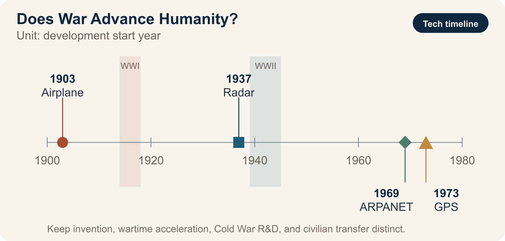

::: {.book-question}
[Today’s Chaekmun]{.book-question-label}

{.book-question-image width=30mm fig-alt="An illustration symbolizing the dual-use nature of war and semiconductor technology"}

[Should a newly hired design engineer adapt autonomous tracking technology developed in wartime for a civilian disaster-response drone?]{.book-question-prompt}
:::

King Seonjo’s 1568 chaekmun^[The chaekmun (策問), or “royal policy question,” that inspired this chapter asked: “When confronting a foreign enemy, should one choose war or peace, and how should principle, strength, and circumstances be weighed together?” The Chaekmun Archive reconstructs the meaning of the published translation in this concise Classical Chinese form: “禦外之道，戰與和而已。義、力、勢，何所先後？” It is not quoted as a literal transcription of the original. Nor is this chapter’s question a modern-language translation of that text. It reinterprets the structure of the original question—which demands that war be judged not by principle alone, but also by strength, circumstances, and eventual consequences—and applies it to a contemporary technology problem.] demanded that a ruler choose neither war out of anger nor peace out of fear, but judge principle, capability, and circumstances together. Borrowing that structure, this chapter separates the fact that war may expand technological capability from the judgment that the resulting technology has improved human life.

> Weapons have grown more sophisticated by the day, but has the life of the people improved to the same degree? By what standard should a technology born of war be called progress?

This is not a quotation translated from the words of a particular king. It is a new question written for this chapter in the form of a Joseon-era chaekmun.

## Why This Question, and Why Now?

The claim that war “invented” a technology must be distinguished from the claim that it “accelerated” the development, mass production, and diffusion of an existing technology. The airplane was invented before World War I, but reconnaissance, communications, high-altitude flight, and engine technology advanced rapidly during the war, while the aviation industry’s manufacturing base expanded. World War II accelerated research and large-scale deployment in radar, electronic computing, and jet propulsion. ARPANET, an ancestor of the internet, began in 1969, while integrated development of GPS began in 1973. Rather than direct products of the world wars, both are examples of Cold War defense research later diffusing into civilian infrastructure.

The war in Ukraine has advanced the rapid-cycle integration of low-cost drones, satellite communications, electronic warfare, image recognition, and battlefield software. Underlying all of these systems are image sensors, communications chips, power semiconductors, memory, and processors. The same semiconductors can find people in a wildfire zone and prevent traffic accidents, yet they can also become the eyes and brains of weapons that identify and strike targets.

The issue in this chapter therefore extends beyond whether war advances technology. It asks **whether progress in technological capability can be equated with human progress**, and who bears responsibility for converting technology accumulated in war into benefits for peace.

## Data Lens

{fig-alt="A data card comparing the development timelines of the airplane, radar, ARPANET, and GPS with the civilian transfer of military technology"}

### Evidence Table

| No. | Verified fact | Meaning for the debate |
|---:|---|---|
| 1 | The Smithsonian National Air and Space Museum explains that World War I transformed airplanes from machines with limited capability into military aircraft performing specialized missions, and laid the foundation for the postwar aviation industry (2025). | War did not invent the airplane; it accelerated its performance, standardization, and mass production. |
| 2 | The U.S. Army explains that radar, demonstrated in 1937, developed rapidly during World War II and subsequently entered everyday applications such as air-traffic control and weather observation (2025). | Civilian diffusion of military research is possible, but it does not justify the human cost of war. |
| 3 | DARPA’s four-node ARPANET became operational in 1969, and the U.S. Department of Defense launched the integrated NAVSTAR GPS program in 1973. | It is chronologically wrong to describe the internet and GPS as direct inventions of the world wars. They should be described as civilian transfers of Cold War defense research. |
| 4 | NATO lessons-learned material on Ukraine analyzes how low-cost one-way attack drones and electronic warfare are rapidly reshaping one another’s methods of operation. | Do not cite battlefield results or production volumes from an ongoing war as settled figures. Use only the qualitative change—shorter technology iteration cycles—as evidence for judgment. |

The first thing to read in this chapter is the **development timeline**. The airplane existed before World War I, and radar before World War II. ARPANET and GPS began after both world wars had ended. This chronology alone allows us to distinguish “inventions of war” from “development accelerated by war” and the “civilian transfer of Cold War defense research.” Production volumes and interception rates in an ongoing war change constantly and are strongly shaped by the interests of those reporting them, so they are excluded from the quantitative evidence used in the sample response.

### How to Read These Numbers

- Drone production volumes and numbers of strikes are operational figures that change with every reporting date; they do not demonstrate a technology’s civilian benefit.
- The fact that a technology found civilian uses after a war does not prove the counterfactual that it would never have emerged without war.
- Interception rates, destruction rates, and claimed battlefield successes reported by belligerents reflect both measurement methods and institutional interests; they must be cross-checked against opposing-party data and independent investigations.
- The opportunities lost in medical, climate, and education technology when funding, talent, and semiconductors are concentrated on weapons do not appear in battlefield statistics.

## Competing Answers

### Answer A — War Drives Progress

War radically increases the cost of failure and the pressure of time, concentrating funding, talent, and frontline feedback in one place. Technologies that originated in or were accelerated by military demand—aviation and radio communications in World War I, radar and electronic computing in World War II, and ARPANET and GPS during the Cold War—became foundations for civil aviation, communications, logistics, and disaster response. The war in Ukraine may similarly diffuse advances in low-cost drones, electronic warfare, satellite communications, and rapid procurement into search and rescue, infrastructure inspection, and autonomous-mobility technologies.

The strength of this answer is that it does not ignore the real effect of war on the speed and scale of technological development. Yet the moment improved technical performance is labeled moral and social progress for humanity, the victims are reduced to a cost of innovation.

### Answer B — War Drives Regression

The first thing war optimizes is not how to save people, but how to detect them sooner, strike them from farther away, and attack at lower cost. Drones and AI can reduce risks to soldiers, but they can also lower the political threshold for attack and increase automated killing with unclear lines of responsibility. Once infrastructure destruction, brain drain, interrupted education, normalized surveillance, and enormous opportunity costs are included, advances in selected technologies are not enough to claim that humanity has progressed.

The strength of this answer is its insistence that postwar civilian benefits do not justify war itself. Its weakness is that it may not adequately explain the value of defensive technology and deterrence, or of communications, interception, and mine-clearance technologies that saved lives during war.

### Answer C — Progress Is Conditional

War may **advance technological capability, but it does not automatically advance humanity**. Progress must be judged by outcomes, not performance alone. We must examine the breadth of civilian transfer, the effect on protecting life, controllability, traceability of responsibility, the risk of misuse after diffusion, and the possibility of achieving the same results through nonmilitary public research. Semiconductor companies cannot evade responsibility merely by saying that they sold civilian components. They need end-use screening, human-rights due diligence, export-control compliance, and procedures to suspend supply when misuse is detected.

### Decision Axes for Answer C

In the debate, evaluate “technological progress” and “human progress” on separate lines.

| Decision axis | Question to verify |
|---|---|
| Technological capability | How much did performance, price, production speed, and reliability actually improve? |
| Life and safety | Did deaths, injuries, and misidentification harms among civilians and combatants decline? |
| Civilian diffusion | Who receives the postwar benefits transferred to medicine, transport, communications, and disaster response? |
| Control and accountability | Are there final human judgment, logs, audits, shutdown mechanisms, and identifiable accountable parties? |
| Alternatives and opportunity cost | Could the same technology have been developed through nonmilitary public research and international cooperation? |

If only technological capability improves while life, accountability, and alternative-path indicators deteriorate, it is entirely coherent to answer: “The technology advanced, but humanity regressed.” That is not a contradiction; it is the central distinction of this chapter.

## AI Research Design

### Prompt for the AI

> Research technologies whose development, mass production, or deployment accelerated during World Wars I and II and the Russia–Ukraine war. Distinguish among airplanes, radar, nuclear technology, drones, electronic warfare, satellite communications, AI, and semiconductors. For each technology, present in a table: ① whether it existed before the war, ② how its performance or operating method changed during the war, ③ postwar civilian transfer, ④ civilian harm and misuse, and ⑤ the issuing institution, document title, year, and primary-source URL. Do not describe ARPANET or GPS as a direct invention of either world war; verify the actual development dates. Exclude battlefield results, production volumes, and interception rates from an ongoing war as quantitative evidence for the conclusion, and distinguish verified facts, institutional claims, and the analyst’s inferences. Finally, identify the evidence that most strongly supports the technology-acceleration thesis, the human-regression thesis, and the civilian-transfer thesis, along with the threshold that would change each conclusion.

### Data Acquisition

| Priority | Source | Items to verify |
|---:|---|---|
| 1 | Primary documents from militaries, governments, and international organizations | Technology development date, operational scope, definitions |
| 2 | Technology histories from museums and public research institutions | Prewar existence, wartime improvements, timing of civilian transfer |
| 3 | Harm and humanitarian data | Civilian casualties, infrastructure destruction, losses to healthcare and education |
| 4 | Company and research-institution materials | Actual functions of components and software, end-use controls, feasibility of postwar conversion |

### Assessing the Information

1. **Distinguish invention from acceleration.** If a technology existed before the war, describe accelerated performance improvement, mass production, or integration rather than “invention.”
2. **Cross-check the timeline.** Do not misattribute Cold War programs such as ARPANET, launched in 1969, and integrated GPS development, launched in 1973, as direct products of the world wars.
3. **Separate capability from outcome.** Technical indicators such as detection range do not automatically prove improvements in life, freedom, or well-being.
4. **Exclude volatile figures from ongoing wars from the evidence used in the response.** Treat battlefield results, casualties, interception rates, and production volumes only as background until independently verified.
5. **Ask about the opportunity cost of alternatives.** Label as a counterfactual assumption any estimate of the results that might have been achieved had the same funding and talent gone to peaceful public research.

### Core Questions for Debate

- The fact that war increases the **speed** of technology is different from the judgment that it improves the **direction** of humanity.
- Do not force the benefits of civilian transfer and wartime losses of life, freedom, and education into the same unit.
- Dual-use technologies such as semiconductors and AI require end-user screening, human control, and procedures to halt supply after misuse is discovered.
- A strong answer neither glorifies war nor rejects technology. It states the conditions under which technological capability becomes human progress.

## Case Debate

The following is an **interview scenario**, not a real company case. You are an image-processing chip design engineer six months into your first job. Your team wants to deploy on a wildfire search-and-rescue drone an object tracker trained jointly on publicly available wartime footage and commercial drone data. Compared with the existing model, its missing-person detection rate is 12 percentage points higher and its computing power consumption is 18% lower, but its ability to track vehicles and people over long periods could be repurposed for military targeting. Retraining the system exclusively on civilian data would delay release by four months and is expected to reduce the detection rate by 6 percentage points. All of these figures are hypothetical.

1. The design team proposes which long-duration tracking, coordinate output, and external model-replacement functions should be restricted in the chip and firmware.
2. The rescue agency explains its need for detection in severe weather and re-identification of missing persons, while safety and ethics staff describe the risks of repurposing the system for surveillance and targeting.
3. The validation team compares the system with a control model trained solely on civilian data to test whether wartime material actually contributed to the higher detection rate.
4. The team chooses among **releasing the existing model unchanged, rebuilding it entirely with civilian data, and producing a civilian-only design with high-risk functions removed**.

The core question is not merely whether to screen the customer. It is whether engineers can materially reduce the risk of misuse at the product-function and data stages.

## Sample 90-Second Response

“I choose **Answer C: a civilian-only design with high-risk functions removed**. The airplane existed before World War I, while ARPANET and GPS began in 1969 and 1973, respectively. This chronology refutes the claim that war invented every technology, but it does not deny that war accelerated development and deployment. In the scenario, the 12-percentage-point increase in detection, 18% reduction in power, and four-month delay are all hypothetical. I also accept the counterargument that using only civilian data would sacrifice rescue performance and time to market. I would therefore retain the model while blocking long-duration tracking of individuals, external transmission of precise coordinates, and unauthorized model replacement. I would compare it with the civilian control model to verify the contribution of wartime data, then disclose both missing-person detection and false-tracking rates. I would postpone release if the restrictions could be bypassed or false tracking exceeded the preset threshold. I would continue monitoring these criteria after the civilian transfer. Only when greater technological capability translates into protection of life and effective control should we call it human progress.”

## Follow-Up Questions

**Cross-Examination and Rebuttal**

- If the civilian benefits of airplanes, the internet, and GPS are so great, must we concede that war is a necessary engine of innovation?
- Could the same pace have been achieved by applying wartime levels of funding and regulatory flexibility to climate and infectious-disease research?
- What important information might the sample response miss by excluding current drone figures from an ongoing war?
- If an image-processing chip manufacturer could not know the end user, how far does its responsibility extend?
- Can a weapons system be said to have “human control” when a person approves the action but follows the AI recommendation almost automatically?
- By what criteria would you distinguish technologies that should be barred from postwar civilian transfer from those that should be actively transferred?

## Sources

- [Smithsonian National Air and Space Museum, *The Evolution of World War I Aircraft* (2025)](https://airandspace.si.edu/explore/stories/world-war-i-laboratory-air)
- [U.S. Army, *Radar demonstration transforms the Army* (2025)](https://www.army.mil/article/285662/radar_demonstration_transforms_the_army)
- [DARPA, *ARPANET* (updated 2025)](https://www.darpa.mil/news/features/arpanet)
- [GPS.gov, *The History of GPS Technology: Government Collaboration and Technology Transfer* (2018)](https://www.gps.gov/sites/default/files/2025-07/gps_finalreport618.pdf)
- [NATO JALLC, *Ukraine Insights: Electronic Warfare against One-Way Attack Drones* (2026)](https://nllp.jallc.nato.int/iks/sharing%20public/20260409_u_q2-26%20sagu%20nsatu%20ukraine%20insights%20newsletter.pdf)
- [U.S. Congressional Research Service, *Defense Primer: Emerging Technologies* (2026)](https://www.congress.gov/crs-product/IF11105)
- [Joseon Dynasty Chaekmun Archive, King Seonjo’s 1568 *War or Peace?*](https://waterfirst.github.io/Joseon-Dynasty-Civil-Service-Examination/#seonjo-1568/0)

> **Data note:** Battlefield results, interception rates, and production volumes from an ongoing war were excluded from the quantitative evidence in the sample response because they change rapidly and the reporting parties have strong interests in the figures. The performance and schedule figures in the scenario are hypothetical assumptions for debate.
