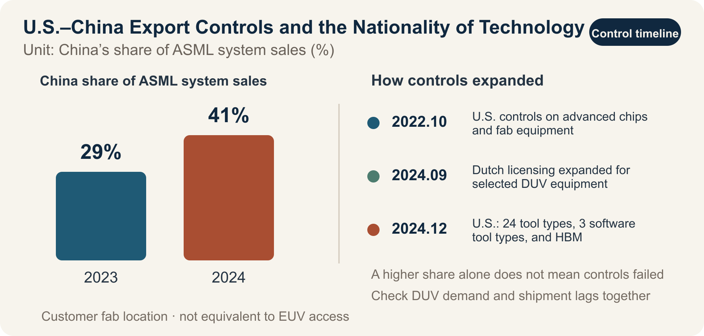

::: {.book-question}
[Today’s Chaekmun]{.book-question-label}

{.book-question-image width=30mm fig-alt="A semiconductor-industry illustration symbolizing a judgment about technological sovereignty between the United States and China"}

[Under U.S. controls on advanced semiconductor exports to China, should a newly hired strategist at a Korean equipment maker with high China exposure suspend a Chinese contract and accelerate qualification in alternative markets?]{.book-question-prompt}
:::

A chaekmun preserved in an anthology from King Jungjong’s reign^[The chaekmun (策問), or “royal policy question,” that inspired this chapter asked: “What does an envoy charged with conveying the nation’s intentions accurately and preserving its dignity need before eloquence and literary skill?” The Chaekmun Archive offers the Classical Chinese reconstruction “奉使傳國意，才辯與德行孰先？”, which is not a literal transcription of the original. Because the exact examination year and ranking are not established in public sources, it is identified only as a “response preserved in an anthology from King Jungjong’s reign.” This chapter’s question is likewise not a translation of the original. It reinterprets the structure that places long-term trust and responsibility before the techniques of diplomacy, and applies it to export controls.] treated diplomacy as more than eloquence or short-term achievement. It asked who would take responsibility for conveying the state’s intentions and maintaining trust, and how. Today’s candidate must likewise go beyond choosing either “the U.S. side” or “the Chinese side.” The answer must account for the time gained through controls, the markets Korean companies may lose, China’s development of substitute technologies, and the distinctive technologies Korea must secure.

## Why This Question, and Why Now?

U.S. controls on China cannot be summarized as a blanket “ban on semiconductor exports.” Controls on advanced computing chips and semiconductor manufacturing equipment began in October 2022, while the performance thresholds and anti-circumvention scope were adjusted in 2023. Measures announced in December 2024 expanded the scope to 24 types of equipment, three types of software tools, HBM, and 140 China-related entities. The Netherlands also introduced licensing for selected advanced DUV lithography equipment in 2023 and expanded the scope in September 2024. This is not a blanket ban on all lithography systems, but a licensing regime based on the item, end user, and destination.

Korea faces conflicting effects at the same time. If advanced lithography equipment and AI chips enter China more slowly, Korean memory, foundry, and advanced-packaging companies gain time to leverage their technology lead and allied markets. Korean equipment and materials companies with high exposure to Chinese customers, however, may bear the costs of export licenses, field service, replacement parts, and declining revenue. The longer controls remain in place, the greater the incentive for Chinese firms to invest in domestic equipment, process automation, yield improvement, and higher productivity from legacy tools.

The central question, then, is not whether one supports the controls. It is **whether Korea can convert the time gained through controls into technologies that others cannot readily replace**, and how the benefits of the security alliance and the costs to industry should be allocated.

## Data Lens

{fig-alt="A graph showing the increase in China’s share of ASML system sales from 29% in 2023 to 41% in 2024 alongside the major export-control dates"}

### Evidence Table

| No. | Figure and scope in the primary data | Meaning for the debate |
|---:|---|---|
| 1 | The U.S. BIS implemented controls on advanced computing chips, supercomputers, and semiconductor manufacturing equipment bound for China on October 7, 2022, and revised performance thresholds and anti-circumvention provisions on October 17, 2023. | Export controls are not a one-time measure; they are rules that evolve with technology. |
| 2 | BIS measures announced on December 2, 2024, covered 24 types of semiconductor manufacturing equipment, three types of software tools, HBM, and 140 additions to the Entity List. | Korean equipment companies may also face licensing effects depending on U.S.-origin technology and software and the end user. |
| 3 | Beginning September 7, 2024, the Netherlands expanded the scope of national licensing for selected advanced DUV lithography equipment. The Dutch government explicitly described it as case-by-case review, not a comprehensive ban. | Saying that the measure “blocked all Chinese imports of photolithography equipment” overstates its scope. |
| 4 | China’s share of ASML system sales rose from 29% in 2023 to 41% in 2024. In the same data, EUV accounted for 38% of 2024 system sales and ArF immersion DUV for 44%. | China’s revenue share can rise even as controls tighten because of permitted DUV demand and shipment lags. The effectiveness of controls cannot be judged from a single revenue figure. |
| 5 | ASML said Chinese DUV demand was stronger than expected in 2025 and forecast that revenue from China would fall substantially in 2026 from 2024–2025 levels. | Regulatory effects may not appear immediately. Orders, shipments, and revenue recognition must be separated. |
| 6 | In their supply-chain and commercial dialogue, Korea and the United States affirmed the principles of protecting national security while minimizing disruption to the global semiconductor supply chain and sustaining industrial viability and technological development (2023). | The alliance’s own objectives explicitly balance security and industrial costs. Korea must negotiate cost sharing and predictability. |

### How to Read These Numbers

The chart’s **29%→41%** is not proof that “the controls failed.” It represents the share of ASML’s total system sales shipped to customer fabs located in China; it does not mean that China secured advanced EUV systems. Nor is it evidence that the controls automatically benefited Korean companies. Its significance is that **technology controls and market transactions do not move immediately in the same direction**.

When analyzing a Korean company, collect the following four sets of figures separately:

- Share of revenue from China and share of revenue from controlled items
- Share of U.S.-origin components and software in product cost and functionality
- Time from license application to approval or denial, and days of service interruption
- Orders from alternative markets, customer-qualification lead times, and performance and yield gaps for critical equipment

China’s technological self-reliance should likewise not be judged by announced investment or patent counts alone. It must be verified through equipment adoption in actual production lines, wafer throughput, defect density, utilization, customer qualification, and repeat orders.

## Competing Answers

### Answer A — Leverage the Alliance Opportunity

U.S. market and technology controls buy Korea time to protect its technology lead and margins in advanced semiconductors. If China cannot secure sufficient EUV and selected advanced DUV lithography equipment, advanced AI chips, and HBM, the barriers to leading-edge processes and AI-accelerator production rise. If Korea’s memory, HBM, advanced-packaging, materials, and equipment companies establish themselves as trusted suppliers within the Korea–U.S. alliance, they may also benefit from joint research, subsidies, and long-term contracts with customers in the United States, Japan, and Europe.

This answer’s strength is its recognition that a technology lead is not permanent and that the time gained must be converted into investment. The controls themselves, however, do not guarantee Korean profits. Competitors in the United States, Japan, and Europe receive the same opportunity, while Korean companies’ Chinese fabs and equipment customers also bear regulatory costs.

### Answer B — Controls Will Backfire

Broad, frequently changing controls can constrain Chinese exports, installation, parts replacement, and maintenance by Korean equipment and materials companies and raise compliance costs. The more important long-term risk is that China will invest in domestic equipment, process automation, multipatterning, yield control, and productivity improvements for legacy tools rather than waiting for blocked equipment. BIS’s inclusion in its 2024 controls of “software that improves the productivity of less advanced equipment” indicates that the United States also sees this avenue for workaround innovation as a threat.

A strategy of permanently excluding a market rival becomes ever more expensive as technology changes and transactions move through third countries. If Korea merely follows U.S. rules passively, it may lose the Chinese market while retaining a double vulnerability: dependence on the United States, the Netherlands, and Japan for key foundational technologies.

### Answer C — Build a Technology Lead and Diversify Markets

Korea should not seek loopholes between two great powers. It should secure technologies that neither side can easily replace. Manufacturers need distinctive performance in HBM, advanced packaging, low-power memory, and high-yield processes; equipment makers need it in inspection, metrology, etching, deposition, process control, and maintenance data. At the same time, companies must lower their concentration of Chinese revenue, understand their dependence on U.S.-origin technology, and accelerate customer qualification in allied markets.

The conditional position does not mean “trade moderately with both sides.” It means **invest the time gained through controls in R&D and customer diversification, trade only within the licensing rules, and change strategy when revenue concentration, technology gaps, or licensing delays cross predefined limits**.

## AI Research Design

### Prompt for the AI

> Research the opportunities and risks that U.S. semiconductor export controls on China create for Korean semiconductor manufacturers and equipment makers. Search in this order: ① primary BIS and Federal Register rules, ② the Dutch government’s licensing scope, ③ annual reports from ASML and Korean companies, and ④ Korean government trade statistics. For each claim, provide a table with the institution, document title, publication date, statistical base year, unit, and primary-source URL. Distinguish “prohibited” from “requires a license,” “order” from “shipment and revenue,” and “China revenue” from “revenue from controlled items.” Put verified facts, company and government claims, and the analyst’s inferences in separate columns, and do not use unsourced or conflicting figures in the conclusion. Finally, construct the strongest possible cases for an active-opportunity position, a cautionary position, and a conditional position, then propose indicators Korean companies should review quarterly.

### Data Acquisition

| Priority | Source | Items that must be recorded |
|---:|---|---|
| 1 | BIS rules, Federal Register, and EAR | Effective date, ECCN, performance thresholds, end user, licensing policy, exceptions |
| 2 | Dutch and Korean government materials | Equipment requiring licenses, case-by-case review, exceptions and consultations concerning Korean companies |
| 3 | Company annual reports and earnings materials | Definition of regional revenue, timing of order, shipment, and revenue recognition, product mix |
| 4 | Customs and trade statistics | HS code, value and quantity, nominal and real terms, distinction between China and Hong Kong |
| 5 | Patents, news reports, and analytical material | Link to primary data, conflicts of interest, production validation, contrary evidence from other sources |

### Assessing the Information

1. **Legal scope:** Verify from the rule’s language whether the measure is a “blanket ban” or a “licensing requirement.”
2. **Timing alignment:** Check whether an order placed before a rule’s effective date was recognized as revenue only later.
3. **Denominator alignment:** Determine whether China’s revenue share refers to total revenue or system sales, and whether it measures units or value.
4. **Causal verification:** Do not assume that controls were the sole cause simply because Chinese investment rose after controls were introduced.
5. **Company-specific exposure:** Evaluate Chinese dependence, alternative customers, and cash capacity separately for large manufacturers and smaller equipment makers.

### Core Questions for Debate

- How many years of **technology time** have the controls bought Korea, and into what R&D should that time be converted?
- Who should bear, and how should they share, the alliance’s security benefits and the revenue losses of Korean equipment makers?
- What indicators show Chinese localization through manufacturing results rather than announcements?
- Should an “irreplaceable technology” that prevents Korean companies from being pushed around be measured by performance, yield, or customer-qualification time?

## Case Debate

In March 2027, a midsized Korean inspection-equipment company receives a KRW 120 billion order from a Chinese foundry. China generated 34% of its revenue in the previous year, and the equipment uses a U.S.-origin laser-control module and design software. The contractual shipment date is 45 days after a new BIS rule takes effect. A substitute order from a U.S. customer is worth KRW 70 billion, but qualification will take nine months, and the company has enough cash to absorb losses for 14 months. The Chinese customer asks the company not to disclose the end user or process node. All figures are hypothetical conditions created for the debate.

1. The compliance team presents the ECCN, end user, licensing requirement, and sanctions risk if the license is denied.
2. The sales team presents the profit from the Chinese contract, the risk of losing the customer, and the U.S. customer’s qualification timeline.
3. The technology team presents the time required and the performance penalty involved in legally replacing the U.S.-origin module.
4. The strategy team chooses among **suspending the contract while applying for a license, signing a conditional contract, and abandoning the contract while shifting to an alternative market**.
5. The final proposal includes available cash flow, a cap on China revenue, R&D line items, a customer-qualification schedule, and stop conditions if the rules change.

In this situation, “diversion through a third country” is not an option. A strong answer presents a quantified, scheduled path that keeps the company alive and builds technology while complying with the law.

## Sample 90-Second Response

“I choose **Answer C: suspend the contract while verifying the license and end user**. BIS expanded its 2024 control scope to 24 types of equipment, three types of software, and HBM, while the share of ASML’s system sales shipped to China rose from 29% in 2023 to 41% in 2024. This means that even if controls widen a technology gap, they do not automatically guarantee profits for Korean companies. The KRW 120 billion contract, 34% China revenue exposure, KRW 70 billion substitute order, and nine-month qualification period in the scenario are all hypothetical. The strongest counterargument is that abandoning the contract would lose the Chinese market before the substitute order is secure. I would therefore verify the ECCN and scope of the U.S.-origin module and software, and contract only if the license is approved or the item is proven not to require a license, with clauses barring re-export and allowing suspension if the rules change. If the customer continues to conceal the end user or the license is denied, I would abandon the contract and accelerate alternative-market qualification and development of a Korean module. I would recheck licensing conditions every quarter. Controls become an opportunity only when the time they create is converted into technology and customer diversification.”

## Follow-Up Questions

**Cross-Examination and Rebuttal**

- How can you argue that controls are effective when ASML’s China revenue share rose to 41%?
- If China implements advanced processes through DUV multipatterning without EUV, how much does the time gained through controls shrink?
- If a Korean equipment maker’s China revenue falls from 34% to 15%, should the government and large manufacturers share the cost?
- How would you determine whether U.S. rules apply when U.S.-origin software is used in only part of product development?
- If the United States extends controls more broadly to Korean HBM, would you maintain the opportunity thesis?
- If you had to choose one measure of distinctive technology, which would it be: throughput, defect density, utilization, or customer-qualification time?

## Sources

- [U.S. BIS, guidance on 2022 and 2023 advanced computing and semiconductor manufacturing controls](https://www.bis.gov/press-release/bis-updated-public-information-page-export-controls-imposed-advanced-computing-semiconductor)
- [U.S. BIS, December 2024 announcement on semiconductor manufacturing equipment and HBM controls](https://media.bis.gov/press-release/commerce-strengthens-export-controls-restrict-chinas-capability-produce-advanced-semiconductors-military)
- [U.S. BIS, *Export Administration Regulations §744.23* (accessed 2026)](https://www.bis.gov/regulations/ear/744)
- [Government of the Netherlands, expansion of export licensing for advanced DUV lithography equipment (2024)](https://www.government.nl/latest/news/2024/09/06/the-netherlands-expands-export-control-measure-advanced-semiconductor-manufacturing-equipment)
- [ASML, *Q4 and Full Year 2024 Investor Presentation* (2025)](https://ourbrand.asml.com/m/62a213cac2117ee6/original/2025_01_29-Presentation-Investor-Relations-Q4-FY-2024.pdf)
- [ASML, *2025 Annual Report—Financials* (2026)](https://www.asml.com/en/investors/annual-report/2025/financials)
- [ASML, *Q3 2025 Financial Results* (2025)](https://www.asml.com/news/press-releases/2025/q3-2025-financial-results)
- [Korea–U.S. Supply Chain and Commercial Dialogue Joint Statement, principles for export-control cooperation (2023)](https://www.korea.net/Government/Briefing-Room/Press-Releases/view?articleId=6837&type=O)
- [Joseon Dynasty Chaekmun Archive, Jungjong-era *What Qualities Should a Diplomat Possess?* (accessed 2026)](https://waterfirst.github.io/Joseon-Dynasty-Civil-Service-Examination/#jungjong-diplomat/0)

> **Data note:** Because export controls and their exceptions change frequently by item, performance, end user, and destination, recheck the primary texts from BIS, the Federal Register, the Dutch government, and company disclosures immediately before commercial publication.
