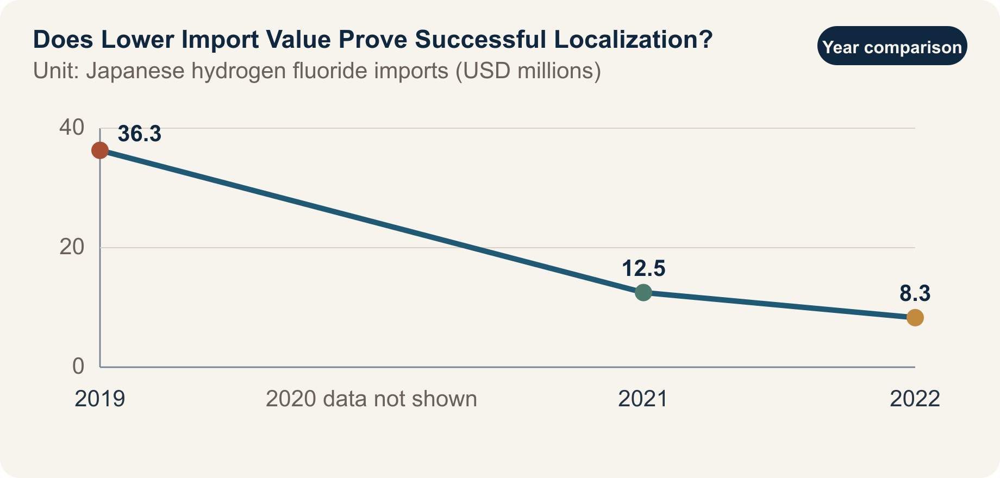

::: {.book-question}
[Today’s Chaekmun]{.book-question-label}

{.book-question-image width=30mm fig-alt="A minimalist ink-wash illustration weighing imported materials against domestic substitutes"}

[If imports of Japanese hydrogen fluoride have fallen, can a newly hired procurement specialist report this as successful localization?]{.book-question-prompt}
:::

A Joseon-era chaekmun^[This chapter connects to the historical chaekmun *Seven Abuses in Honam and Their Remedies*, in which King Jeongjo asked about Honam’s conditions and possible remedies in 1798. The transmitted text begins, “王若曰，湖南一路卽我朝興王之地也。” Following the declaration “The king speaks: the province of Honam is the land where our dynasty arose,” the question demanded a diagnosis encompassing both the region’s resources and talent and its accumulated abuses.] distinguished praise for abundant resources from the realities experienced by the people. Today’s procurement specialist must likewise do more than repeat the favorable phrase “imports from Japan have declined.” The report must also verify the yield and price of domestic substitutes, the origin of their raw materials, and their customer-qualification status.

## Why This Question, and Why Now?

According to data from the Ministry of Trade, Industry and Energy, the value of hydrogen fluoride imports from Japan fell 66%, from USD 36.3 million in 2019 to USD 12.5 million in 2021. Extending the trade-statistics series, imports of Japanese hydrogen fluoride for semiconductor use are reported at USD 8.3 million in 2022. Immediately before the controls, Japan’s share of high-purity hydrogen fluoride was 43.9%. This trend demonstrates a major shift in sourcing.

A decline in import value, however, can contain several different stories. Domestic production may have increased, imports may have shifted to third countries, unit prices or exchange rates may have changed, or production itself may have fallen. In semiconductor processing, “the same chemical formula” does not automatically mean “the same material performance.” Differences in metallic impurities, moisture, particles, containers, and transport controls can affect etch uniformity and yield.

A new procurement specialist’s report is not a document for judging sentiment between nations. It should connect import value, volume, and unit price by HS code with approved items by supplier, defect rates and yields before and after introducing the domestic material, raw-material origins, emergency inventory, and customer requalification lead times. “Localization complete” is a much stronger claim than saying that the source of supply has changed.

## Data Lens

{fig-alt="A graph showing the decline in the value of Japanese hydrogen fluoride imports from USD 36.3 million in 2019 to USD 8.3 million in 2022"}

### Evidence Table

| Category | Figure and scope in the primary data | Limitation when used in a report |
|---:|---|---|
| Policy data | The value of hydrogen fluoride imports from Japan was USD 36.3 million in 2019. | This is a pre-control baseline, but the corresponding volume and purity mix must also be disclosed. |
| Policy data | Import value was USD 12.5 million in 2021, 66% lower than in 2019. | The decline signals a change in sourcing, but does not prove the manufacturing performance of domestic material. |
| Trade-statistics-based data | The value of Japanese hydrogen fluoride imports for semiconductor use was USD 8.3 million in 2022. | The HS-code scope and aggregation methodology must be recorded before comparison with other years. |
| Pre-control data | Japan’s share of high-purity hydrogen fluoride was reported at 43.9%. | The figure cannot be used without knowing whether the denominator is value, volume, or a particular grade. |
| Calculation from primary data | Imports fell by approximately 77%, from USD 36.3 million in 2019 to USD 8.3 million in 2022. | Even the calculated decline cannot distinguish among increased domestic production, substitution through third countries, and lower demand. |

### How to Read These Numbers

First, import value is the product of `volume × unit price × exchange rate`. A decline in value does not show whether volume was unchanged or whether the price of high-purity product shifted. Always verify weight and unit price for the same HS code and period.

Second, distinguish “lower dependence on Japan” from “self-reliance across the domestic value chain.” Even when final purification takes place domestically, the producer may depend on a specific foreign supplier for feedstock, containers, analytical equipment, or process know-how. If only the country name changes while single-source dependence remains, resilience has not improved enough.

Third, the procurement team is not the sole arbiter of localization. The production team must verify long-run yield and defects, the quality team must approve change control, and customers must complete requalification where required. Prototype success, deployment on one line, approval across all product families, and stable repeat delivery must not be described as the same stage.

## Competing Answers

### Answer A — Recognize the Achievement

If import value has fallen substantially and domestic supply has actually entered mass production, the process represents genuine learning. More suppliers create purchasing leverage and more options for continuing production during an unexpected licensing delay. If every partial achievement is dismissed while waiting for perfect self-reliance, the next round of investment and shop-floor improvement may lose momentum.

The basis for recognizing success, however, must be delivery and performance rather than nationality. It is more accurate to report a “supply-chain diversification achievement” once repeated delivery, customer approval within the same product family, and verified emergency scale-up capacity are in place.

### Answer B — Beware a Premature Declaration of Success

Declaring localization successful on the basis of import value alone conceals price increases, production declines, rerouting through third countries, and quality costs. If the substitute is more expensive and delivers lower yield, the total cost per wafer may rise even while reported imports fall. A protected supplier may also have less incentive to improve quality.

In particular, if feedstock is concentrated in another single country, the result merely transfers dependence on Japan to another source. The procurement team’s job is not to produce a promotional slogan, but to locate where the single point of failure has moved.

### Answer C — Assess Localization in Stages

Do not force the conclusion into a binary of “complete” or “failed.” Divide it into development, line validation, customer qualification, repeat mass production, and raw-material diversification. Treat the decline in import value as an initial observation, then advance to the next stage only when domestic-use share, yield, total cost of ownership, delivery, and raw-material origin meet the defined criteria.

Disclose the conditions that would change this conclusion. The status can be upgraded to “complete” if the substitute’s yield gap disappears, customer requalification is finished, and emergency scale-up capacity is verified. Conversely, if quality costs and the price premium persist while dependence on a new country increases, the diversification strategy must be redesigned.

## AI Research Design

### Prompt for the AI

> Create an investigation worksheet that a newly hired procurement specialist can use to verify whether declining Japanese imports of semiconductor-grade hydrogen fluoride represent a localization achievement. Check, in order, statistics from the Korea Customs Service, Ministry of Trade, Industry and Energy, and Korea International Trade Association; Japanese Ministry of Economy, Trade and Industry export-control documents; company disclosures; and customer-qualification materials. Record the HS code, period, country, value, weight, unit price, and purity and end-use scope, and determine whether the 2019, 2021, and 2022 figures are comparable. In a separate table, show the domestic supplier’s raw-material origin, capacity, actual delivery volume, yield by product family, and customer-approval status. Distinguish verified statistics, government and corporate claims, calculated values, and internal assumptions, and attach a direct URL to every item. Finally, state the conditions under which the phrase “localization complete” should be retained, revised, or deleted.

### Data Acquisition

| Priority | Source | Items that must be recorded |
|---:|---|---|
| 1 | Primary customs and trade data | HS code, country of import, value, weight, unit price, period, and revision status |
| 2 | Export-control rules | Items requiring licenses, effective date, bulk and individual licenses, timing of rule changes |
| 3 | Internal procurement and quality records | Purchase volume by supplier, lot failures, yield, returns, and emergency-procurement lead time |
| 4 | Customer change approvals | Requalification scope by product family, approval date, reasons for holds, regular-audit results |
| 5 | Domestic supplier due diligence | Feedstock origin, purification and analysis capability, scale-up limit, foreign dependence of critical equipment |

### Assessing the Information

1. **Product match:** Distinguish all industrial hydrogen fluoride from high-purity semiconductor grades.
2. **Decompose value:** Separate changes in import value into changes in volume, unit price, and exchange rate.
3. **Confirm the stage:** Distinguish development announcements from customer approval and temporary deliveries from repeat mass production.
4. **Compare performance:** Compare yield with a control group on the same product, line, and period, recording other process variables.
5. **Transferred dependence:** Determine whether the domestic product’s feedstock, containers, or analytical equipment has become concentrated in a new single country.

### Core Questions for Debate

- What portion of the 77% decline in import value is explained by expanded domestic production?
- Under what conditions could a 0.4-percentage-point yield loss be accepted as the insurance premium for supply security?
- How should the price premium and emergency-procurement risk be combined into total cost per wafer?
- How does the report’s scope of responsibility change when it says “supply-chain diversification” instead of “localization”?

## Case Debate

All figures below are **interview assumptions**, not data from an actual company. You are a procurement specialist three months into your first job. Import value for Japanese material has fallen 77% from the base year, but the domestic substitute is 15% more expensive and delivers yield 0.4 percentage points below the incumbent material in one product family. Current inventory covers 90 days, and customer requalification takes nine months. The country of origin of the domestic supplier’s purification feedstock has not yet been fully verified.

1. The procurement team recalculates import value, volume, unit price, and total cost of ownership by supplier.
2. The production and quality teams use a controlled test under identical conditions to determine whether the 0.4-percentage-point gap is attributable to the material.
3. The sales team identifies which products and customers can be served during the nine-month requalification period.
4. You choose among **localization complete, partial localization, and supply-chain diversification in progress** as the report’s conclusion.
5. Before the 90-day inventory is depleted, you propose corrective actions covering feedstock-origin due diligence, quality improvement, and the dual-sourcing ratio.

The interviewer is not looking for patriotic rhetoric. The interviewer wants to hear which quality and cost risks the company is accepting, who will verify them, and when the conclusion will change.

## Sample 90-Second Response

“I choose **Answer C and would report ‘supply-chain diversification in progress,’ not ‘localization complete.’** Public data show that the value of Japanese hydrogen fluoride imports fell approximately 77%, from USD 36.3 million in 2019 to USD 8.3 million in 2022. But import value is the product of volume, unit price, and exchange rate, so it does not directly prove the manufacturing performance of domestic material. The 15% price premium, 0.4-percentage-point yield gap, 90 days of inventory, and nine-month requalification period in the scenario are all hypothetical. I accept the counterargument that reduced dependence on Japan improves supply security. Yet if feedstock is concentrated in another single country and the yield penalty persists, only the address of dependence has changed. Within 90 days, I would therefore audit feedstock origin and scale-up capacity, retest the yield gap on the same product and line, and maintain dual sourcing throughout customer qualification. I would upgrade the status to ‘complete’ once the yield gap disappears and customer approval and repeat deliveries are confirmed. Conversely, if the total-cost disadvantage including quality costs and the new single-country dependence persist, I would add a third supplier. Localization should be judged by approved quality and delivery capability, not declining import value.”

## Follow-Up Questions

**Cross-Examination and Rebuttal**

- How would you revise the report if import value fell but import volume rose?
- Which product price and time horizon would you use to calculate the monetary cost of a 0.4-percentage-point yield loss?
- If the Japanese inventory runs short during the nine-month customer requalification, which products would receive priority?
- Can the material be recognized as localized if the domestic supplier buys critical feedstock from only one country?
- How would you set the maximum period for accepting a 15% price premium as the cost of supply security?
- If a government announcement conflicts with internal quality data, how would you record the conflict in the final report?

## Sources

- [Ministry of Trade, Industry and Energy, *Achievements in Strengthening the Competitiveness of Materials, Parts, and Equipment* policy material (2022)](https://www.korea.kr/news/policyNewsView.do?newsId=148899420)
- [Korea International Trade Association, Institute for International Trade, *Economic Effects and Implications of Lifting Japan’s Export-Control Measures*, Trade Brief No. 09 (2023)](https://fileview.kita.net/getDownload/pY0FySquqta)
- [Japan Ministry of Economy, Trade and Industry, *Security Export Control Policy* (accessed 2026)](https://www.meti.go.jp/english/policy/external_economy/trade_control/index.html)
- [Joseon Dynasty Chaekmun Archive, King Jeongjo’s 1798 *Seven Abuses in Honam and Their Remedies*](https://waterfirst.github.io/Joseon-Dynasty-Civil-Service-Examination/#jeongjo-1798/0)
- [Academy of Korean Studies, Archives of Old Documents, search records for royal examination responses from 1798](https://archive.aks.ac.kr/search/list.do?fq=com_%EC%97%B0%EB%8F%84_fct%3A1798%EB%85%84%28%EC%A0%95%EC%A1%B022%29&fq=com_%EC%B0%B8%EA%B3%A0%EB%AC%B8%ED%97%8C_fct%3A%E3%80%8E%ED%95%9C%EA%B5%AD%EC%9D%98+%EA%B3%BC%EA%B1%B0%EC%A0%9C%EB%8F%84%E3%80%8F&q=query&sortField=%EC%9E%91%EC%84%B1%EB%85%84%EB%8F%84)

> **Data note:** Public import statistics and case assumptions are kept separate; 15%, 0.4 percentage points, 90 days, and nine months are educational assumptions.
