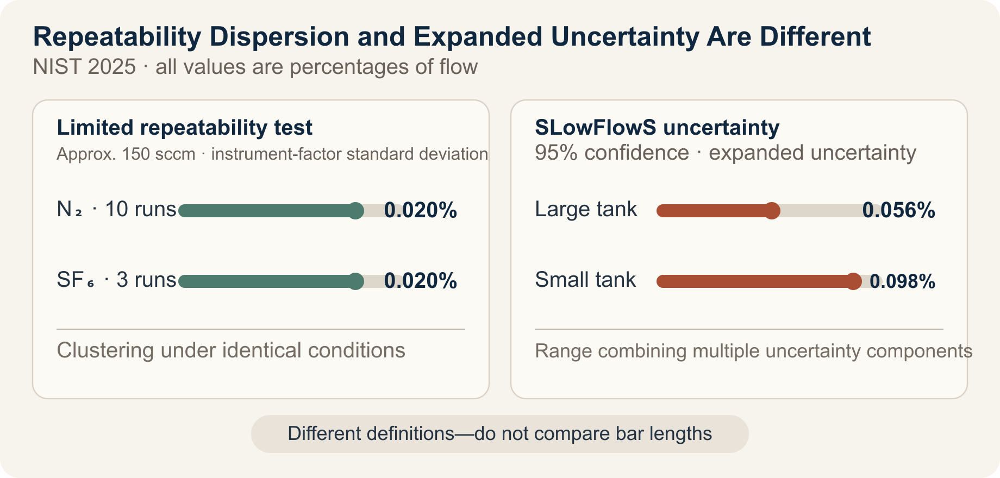

::: {.book-question}
[Today’s Chaekmun]{.book-question-label}

{.book-question-image width=30mm fig-alt="A minimalist ink-wash illustration contrasting a single high peak with multiple wafers measured repeatedly under identical conditions"}

[If a research sample’s peak performance conflicts with repeatability, which result should advance to the next stage of development?]{.book-question-prompt}
:::

King Sejong’s 1447 chaekmun on law and administration^[The historical chaekmun (策問) connected to this chapter asked about the cycle in which a law creates abuses and another law is then enacted, and about where authority should reside. The Chaekmun Archive reconstructs the meaning of its published translation in the concise Classical Chinese “法立而弊生，弊生而法又立。其所以救之者何歟？政權當歸於何所歟？” This is not a literal transcription of the original. It asks: “When a law is established, abuses arise; when abuses arise, another law is established. How can this be remedied, and where should authority reside?” Today’s question does not translate the legal institutions of that era into experimental regulations. It reinterprets the structure of the question—that even a sound standard cannot guarantee results unless its operators and verification procedures are sound—and connects it to research and development.] required an answer not only about adding a new standard, but also about who would administer that standard and according to what principles. In R&D, one peak result may demonstrate possibility, but another person can use it only if the same procedure can be repeated on another day, wafer, and instrument.

## Why This Question, and Why Now?

SLowFlowS, a low-flow standard for semiconductor process gases published by the U.S. National Institute of Standards and Technology in 2025, covers a flow range of 0.01–1,000 cm³/min and reports 95% confidence-level expanded uncertainties of 0.056–0.098% of flow. In preliminary repeatability tests from the same research, the standard deviations of instrument factors for ten nitrogen runs and three sulfur hexafluoride runs at approximately 150 sccm were each 0.02%.

These figures cannot be collapsed into the statement “there was almost no error.” The 0.02% figure describes how tightly values clustered under specific repeatability conditions, while 0.056–0.098% is a 95% expanded uncertainty incorporating calibration, temperature, pressure, volume, and other uncertainty components. Even tightly clustered repeated values may be inaccurate if all are biased in the same direction.

Peak performance from a research sample should be read in the same way. A peak is valuable for exploring a technology’s upper bound. Yet if the best sample alone is selected and reported as though it were the mean, or a difference smaller than the measurement uncertainty is called an improvement, the manufacturing team inherits a target it cannot reproduce. A new researcher should place the peak, central tendency, spread, number of out-of-specification results, measurement uncertainty, and results after condition changes in a single table.

## Data Lens

{fig-alt="A data card contrasting the standard deviation of repeated measurements of the NIST semiconductor process-gas standard with the 95% expanded uncertainties of the large and small tanks"}

### Evidence Table

| Category | Figure and range in the primary data | Meaning for R&D decisions |
|---:|---|---|
| Measurement range | SLowFlowS covers 0.01–1,000 cm³/min at standard conditions of 273.15 K and 101.325 kPa. | Performance figures must be reported together with their applicable range and reference conditions. |
| Repeatability test | At approximately 150 sccm, the standard deviations of the instrument factors for ten nitrogen runs and three sulfur hexafluoride runs were each 0.02%. | This supports low dispersion under the same conditions, but does not establish reproducibility across all instruments and dates. |
| Expanded uncertainty | The large tank’s value was 0.056% of flow and the small tank’s was 0.098%. Both are 95% confidence-level expanded uncertainties. | Because these values differ in definition from standard deviation, they must not be placed in a single bar ranking. |
| Temperature validation | Over 15 hours, the 24 temperature sensors on the tank surface agreed within 63 mK of one another, and each sensor had a standard deviation below 2 mK. | Long-duration, multipoint validation provides stronger evidence than one favorable instantaneous measurement. |
| Species effect | When manufacturer correction factors were applied to measurements of gases other than the nitrogen used for calibration, errors of up to ±6% of flow remained. | Even with good repeatability, systematic error can grow when the material or method changes. |

### How to Read These Numbers

The figures 0.02% and 0.056–0.098% answer different questions. The first is a standard deviation from a limited repeatability test; the second is a 95% expanded uncertainty combining multiple uncertainty components. A small standard deviation alone does not justify saying that measurement accuracy is 0.02%.

Ten nitrogen runs and three sulfur hexafluoride runs are also not a sufficient sample for manufacturing validation. The NIST study validates a new national flow standard; it is not a yield-assurance test for a particular process recipe. It does, however, model a valuable research practice: disclosing how many measurements were taken, what variables changed, and which uncertainties were included alongside the performance result.

Peak performance and reproducibility are not enemies. A peak creates a hypothesis during exploration; repeatability and reproducibility determine whether that hypothesis is ready to advance. Do not erase the peak from the report. Instead, disclose whether it came from selecting only favorable samples without a predefined exclusion rule and whether it persists under independent remeasurement.

## Competing Answers

### Answer A — Explore the Peak First

The purpose of early research is to find performance possibilities not yet observed. Focusing only on making the mean stable can cause teams to discard high-risk hypotheses too soon and explore only around existing processes. Even a peak from one sample is important evidence that can redirect the next experiment, provided it passes a minimum check showing that it is not a measurement error.

The peak should not, however, be labeled a completed development result. The team must disclose the raw data, sample selection, and measurement conditions, label it an “exploratory result,” and request funding for follow-up experiments that identify the cause and establish reproducibility.

### Answer B — Transfer the Reproducible Result First

Manufacturing and product development use distributions that meet specification repeatedly, not a sample that happens to be good. A high peak accompanied by large sample-to-sample dispersion and repeated specification failures indicates a narrow process window or an uncontrolled confounding factor. Advancing a condition with a lower peak but stable central tendency and spread is the more responsible choice.

An overly conservative criterion, however, may eliminate opportunities to continue studying an innovative candidate. Even when the stable condition advances, the peak-performing candidate should remain on a separate research track so its mechanism can be identified.

### Answer C — Two Gates: Exploration and Transfer

Approve peak performance as “technical possibility” and the repeated distribution as “readiness for transfer.” For the peak-performing candidate, design independent remeasurement and reproducibility tests across instruments, dates, and wafers. For the stable candidate, test process capability and performance loss in a limited pilot.

Do not rank both candidates using a single number. Gate the peak candidate on the improvement mechanism and reproducibility success rate; gate the stable candidate on its mean, spread, out-of-specification rate, and cost. If neither candidate passes its gate, record that the hypothesis and failure conditions have become clear, rather than declaring “no result.”

## AI Research Design

### Prompt for the AI

> Evaluate which of two power-semiconductor research recipes should advance to a pilot process. Preserve raw histories of breakdown voltage, on-resistance, missing values, and remeasurements by sample, wafer, instrument, measurement date, and operator. Calculate the maximum, mean, median, standard deviation, and number of out-of-specification results, and show the measurement system’s calibration history and 95% expanded uncertainty in separate columns. Distinguish values excluded under a predefined rule from those removed after the fact. Evaluate repeatability under identical conditions, reproducibility after changing instruments, dates, and operators, and the production process window separately. Separate facts, calculations, assumptions, and recommendations, and attach the document title, issuing body, year, and direct URL to every external source. Present the advantages and disadvantages of prioritizing the peak, prioritizing reproducibility, and applying a two-gate model, along with the numerical conditions that would change the conclusion.

### Data Acquisition

| Priority | Source | Items that must be recorded |
|---:|---|---|
| 1 | Sample-level raw data | All measurements, sample and wafer locations, missing values, remeasurements, and reasons for exclusion |
| 2 | Experimental recipes and equipment logs | Material lot, process conditions, equipment, chamber state, measurement date, and operator |
| 3 | Measurement-system data | Calibration standard, resolution, repeatability and reproducibility, uncertainty budget, and environmental conditions |
| 4 | Specifications and product requirements | Minimum breakdown voltage; on-resistance, thermal, and lifetime limits; customer use conditions |
| 5 | Follow-on pilot plan | Sample size, randomization, independent reproducing institution, and success, stop, and retest criteria |

### Assessing the Information

1. **Selection bias:** Do not retain only the best samples or remove outliers using criteria defined after the results are known.
2. **Measurement distinctions:** Do not mix repeatability, reproducibility, accuracy, and expanded uncertainty as though they were the same metric.
3. **Effect size:** Determine whether the difference between candidates exceeds measurement uncertainty and sample dispersion.
4. **Process transfer:** Do not count multiple dies from one wafer as an equivalent number of independent wafers.
5. **Transfer gate:** A result must pass not only the mean criterion but also out-of-specification, spread, process-window, and independent-reproducibility criteria.

### Core Questions for Debate

- Can a recipe advance if its peak greatly exceeds specification but one-third of its repeated samples fall short?
- Can a performance difference smaller than the measurement uncertainty be called a research result?
- If the mean is unchanged on a different instrument but the spread increases, has the result been reproduced?
- How much on-resistance penalty is acceptable for the stable recipe?

## Case Debate

The following figures are **interview assumptions**, not actual results from a particular company or product. You are a new engineer on a power-semiconductor research team. Only one recipe can advance to the pilot process.

- For Recipe A, the highest breakdown voltage among 12 devices is 1,280 V, the mean is 1,195 V, and the standard deviation is 42 V; four devices fall below the 1,200 V specification.
- For Recipe B, the maximum is 1,250 V, the mean is 1,232 V, and the standard deviation is 11 V; all 12 devices meet or exceed 1,200 V.
- Assume that the measurement’s 95% expanded uncertainty is ±8 V.
- B’s on-resistance is 6% higher than A’s, implying an efficiency penalty.

1. The research team tests whether A’s peak represents a physical improvement rather than measurement or selection error.
2. The metrology team reviews the ±8 V uncertainty budget and remeasurement after changing the instrument and date.
3. The product team calculates the effect of B’s 6% increase in on-resistance on thermal design and customer specifications.
4. You choose among **advancing A, advancing B, and holding both**.
5. You also propose a follow-up experiment and decision-reversal condition for the recipe not selected.

A strong answer does not end with selecting the candidate with the higher mean. It must explain how specification failures will be handled, whether uncertainty and dispersion have been distinguished, and how much performance loss is acceptable in exchange for stability.

## Sample 90-Second Response

“I choose **Answer B: advance the more reproducible Recipe B to a limited pilot**, while retaining A on the research track. NIST’s 2025 process-gas standard reports 95% expanded uncertainties of 0.056–0.098% across 0.01–1,000 cm³/min. It is a real-world example showing that tightly clustered repeated values do not prove an absence of systematic error. Our figures, by contrast, are hypothetical. A peaks at 1,280 V, but its mean is 1,195 V and four of 12 devices fall below specification. B has a mean of 1,232 V, a standard deviation of 11 V, and no failures. I accept the counterargument that A’s peak shows greater technical potential, but the next stage must receive a process window another engineer can reproduce. I would hold the transfer if B’s 6% higher on-resistance violates the thermal specification. I would retest A on three wafers using independent equipment and 20 devices per wafer. If it simultaneously achieves a mean of at least 1,230 V, a standard deviation no greater than 15 V, and uncertainty no greater than ±8 V, I would reopen the decision. After pilot transfer, I would continue disclosing lot-to-lot dispersion and specification failures transparently. I would record the peak as an exploratory result and approve development transfer only for a reproducible result.”

## Follow-Up Questions

**Cross-Examination and Rebuttal**

- Would your conclusion change if all four failures in Recipe A came from the wafer edge?
- If Recipe B’s 6% increase in on-resistance raised system power by only 1%, on what basis would you accept it?
- If all 12 devices came from a single wafer, why should the sample size not simply be treated as 12?
- If the mean holds on another instrument but the standard deviation rises to 22 V, would you consider the result reproduced?
- If measurement uncertainty increases from ±8 V to ±20 V, how would you redesign the comparison of the two recipes?
- If asked to disclose the peak in a press release first, what wording and limitations would you attach?

## Sources

- [U.S. NIST, Pope et al., *SLowFlowS: A Novel Flow Standard for Semiconductor Process Gases* (2025)](https://www.nist.gov/publications/slowflows-novel-flow-standard-semiconductor-process-gases)
- [U.S. National Library of Medicine PMC, full SLowFlowS paper and experimental data (2025)](https://pmc.ncbi.nlm.nih.gov/articles/PMC11894916/)
- [U.S. NIST, *Research Updates—Gas Flow for Semiconductor Manufacturing* (2025)](https://www.nist.gov/pml/sensor-science/fluid-metrology/research-updates-gas-flow-semiconductor-manufacturing)
- [BIPM/JCGM, *International Vocabulary of Metrology—Repeatability and Reproducibility* (2012, accessed 2026)](https://jcgm.bipm.org/vim/en/2.25.html)
- [BIPM/JCGM, *Guide to the Expression of Uncertainty in Measurement* (2008)](https://www.bipm.org/documents/20126/2071204/JCGM_100_2008_E.pdf/cb0ef43f-baa5-11cf-3f85-4dcd86f77bd6?version=1.7)
- [U.S. NIST, *CHIPS for America Metrology Program* (accessed 2026)](https://www.nist.gov/chips/research-development-programs/metrology-program)
- [Joseon Dynasty Chaekmun Archive, King Sejong’s 1447 *The Abuses of Law and the Seat of Authority*](https://waterfirst.github.io/Joseon-Dynasty-Civil-Service-Examination/#sejong-1447/0)
- [National Institute of Korean History, *Annals of King Sejong*, entry for the 27th day of the eighth month in Sejong’s 29th year (1447)](https://sillok.history.go.kr/id/kda_12908027_001)

> **Data note:** The ranges and values 0.01–1,000 cm³/min, 0.02%, 0.056–0.098%, 24 sensors, 63 mK, 2 mK, and up to ±6% come from the NIST primary data. The breakdown voltages of 1,280, 1,250, 1,195, and 1,232 V; standard deviations of 42 and 11 V; the 1,200 V specification; ±8 V uncertainty; 6% on-resistance increase; and follow-on gates are interview assumptions.
