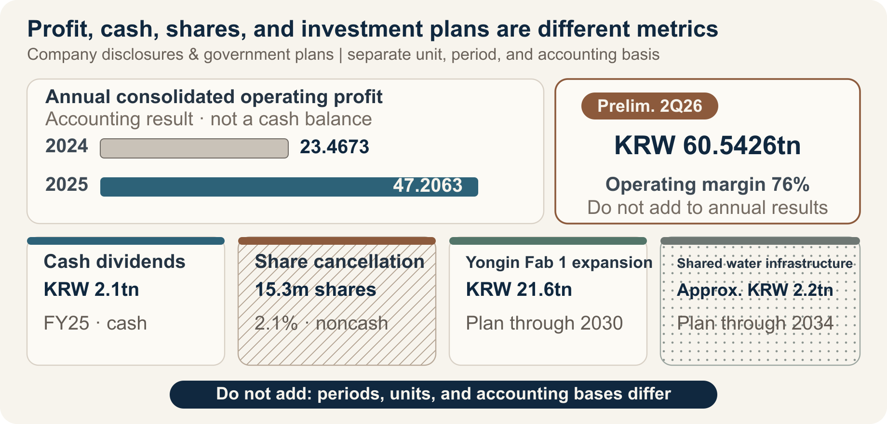

::: {.book-question}
[Today’s Chaekmun]{.book-question-label}

{.book-question-image width=30mm fig-alt="A minimalist ink-wash symbolic illustration in which four channels flow from a semiconductor wafer toward a factory, a worker, a shareholder, and a town"}

[By what criteria should the gains from the AI and data-center boom be divided among reinvestment, labor, shareholders, and the public?]{.book-question-prompt}
:::

King Jeongjo’s 1798 chaekmun on Honam^[The historical chaekmun (策問) connected to this chapter asked how to address not only Honam’s resources and talent, but also the burdens borne by its people and its accumulated abuses. The first sentence of the archival text reads, “王若曰，湖南一路卽我朝興王之地也。” In English: “The king speaks: the province of Honam is the land where our dynasty arose.” Today’s question is not a translation of that era’s tax system into the setting of a modern corporation. It reinterprets the structure of the question, which asks us to consider both the total abundance created and the distribution of its burdens.] did not assume that abundant resources alone proved good governance. It demanded scrutiny of who enjoyed the benefits of production and who shouldered taxes, corvée labor, and entrenched local abuses.

Nor can the AI memory boom be reduced to “the company made a profit, so let us divide it fairly.” The company bore the risks of R&D and failed capital investment; workers delivered yield, met schedules, and secured customer qualification; shareholders accepted capital losses during the downturn. Government and citizens also helped build the productive base through tax credits, transmission networks, water pipelines, education, and the cost of living imposed on host communities. The first task is not to rank their contributions. It is to decide **what counts as profit, how to separate items with different accounting characteristics, and whether the same rule should apply in booms and downturns**.

## Why This Question, and Why Now?

According to the company’s announcement, SK hynix reported 2025 consolidated revenue of KRW 97.1467 trillion, operating profit of KRW 47.2063 trillion, and net income of KRW 42.9479 trillion. Compared with 2024 operating profit of KRW 23.4673 trillion, operating profit increased by KRW 23.7390 trillion, or 101%. The company said HBM revenue more than doubled year over year and contributed substantially to its record results. The announcement, however, did not separately disclose absolute HBM revenue or operating profit by product. Calling the entire increase in company-wide operating profit “AI windfall profit” would overstate both causation and the relevant denominator.

For the second quarter of 2026, the company’s preliminary consolidated results were KRW 79.3187 trillion in revenue, KRW 60.5426 trillion in operating profit, and a 76% operating margin. It announced quarter-end cash and cash equivalents of KRW 88 trillion, total borrowings of KRW 18.6 trillion, and net cash of KRW 69.4 trillion. These figures show the scale of the latest boom, but a single quarter’s preliminary figures are not the same as a confirmed annual capacity for distribution. Price spikes, working capital, taxes, the timing of equipment payments, and nonrecurring gains and losses must all be examined.

“Profit” has at least four meanings. Operating profit is the accounting result of core operations; net income reflects financing, taxes, and nonrecurring items; and free cash flow deducts investment from actual cash generation. The performance-bonus base agreed between labor and management and the economic concept of excess profit are different again. When a new hire develops an allocation proposal, the task is not to choose one measure and conceal the others. It is to **separate statutory and contractual payments first, then calculate the cash that remains available for discretionary allocation**.

## Data Lens

{fig-alt="A data illustration separating the operating profit, cash dividends, share cancellation, multiyear investment plans, taxes, and public infrastructure associated with the AI memory boom according to their accounting characteristics"}

### Evidence Table

| No. | Disclosed figure, period, and denominator | Status | Meaning for the debate |
|---:|---|---|---|
| 1 | SK hynix reported 2025 consolidated revenue of **KRW 97.1467 trillion**, operating profit of **KRW 47.2063 trillion**, and net income of **KRW 42.9479 trillion**. Operating profit in 2024 was KRW 23.4673 trillion. | Company’s annual K-IFRS results announcement | Operating profit increased by KRW 23.7390 trillion, but that increase is neither cash available for distribution nor profit attributable solely to HBM. |
| 2 | The company announced preliminary consolidated revenue of **KRW 79.3187 trillion**, operating profit of **KRW 60.5426 trillion**, and an operating margin of **76%** for the second quarter of 2026, with quarter-end net cash of **KRW 69.4 trillion**. | Company’s preliminary quarterly figures dated July 29, 2026 | The figures show the latest boom and the company’s financial capacity, but one quarter should not be fixed as the basis of a long-term allocation formula. |
| 3 | The company stated that **HBM revenue more than doubled** in 2025 from the previous year. | Company’s explanation of causes | Because absolute HBM revenue and product-level cost and operating-profit denominators are unavailable, company-wide profit cannot be converted into a measure of HBM’s contribution. |
| 4 | Total dividends for fiscal 2025 were **KRW 2.1 trillion**, and **15.3 million shares** were canceled. On August 19, 2026, the board resolved to acquire and cancel in full **KRW 40 trillion** of treasury shares; based on the previous day’s closing price, the company described this as **24.07 million shares, or 3.3% of shares outstanding**. | The 2025 share count and the 2026 acquisition amount are confirmed figures. | The confirmed figure and converted value switch places between the two years, so the “scale of cancellation” cannot be compared in a single column. The actual number of shares canceled will depend on share prices during the acquisition period. |
| 5 | In February 2026, the company announced an additional **KRW 21.6 trillion** investment in the first Yongin fab through December 2030, raising total investment to approximately **KRW 31 trillion** including the existing KRW 9.4 trillion. Equipment installation costs were excluded. | Multiyear capital plan approved by the board | KRW 21.6 trillion is neither annual capital expenditure for 2025 nor cash paid all at once. The time horizon, cancellation options, and equipment costs must be considered separately. |
| 6 | The company’s 2025 DBL measurement reports indirect economic contributions of **KRW 8.7114 trillion** from “employment,” **KRW 9.5329 trillion** from “tax payments,” and **KRW 2.1117 trillion** from “dividends.” It states that the scope includes five subsidiaries and four social enterprises. | Social-value metrics defined by the company | The employment figure cannot automatically be treated as total wages and performance bonuses, nor can the tax figure be treated as identical to income-tax expense in the consolidated income statement. The measurement scope and methodology must be checked. |
| 7 | The government’s 2025 semiconductor support package proposed increasing fiscal investment in infrastructure from **KRW 3.1 trillion to KRW 5.1 trillion**, using the national budget to cover **70%** of the corporate share of undergrounding transmission lines in Yongin and Pyeongtaek, and raising the semiconductor investment tax-credit rate by **5 percentage points** above that for other national strategic technologies for investments made on or after January 1, 2025. | Nationwide support plan, limits, and tax provisions | This does not mean that any particular company actually received these amounts. A debate about public contribution requires company-specific tax credits and subsidies actually realized, along with their conditions and clawback provisions. |
| 8 | The Ministry of Environment and K-water announced plans to invest approximately **KRW 2.2 trillion** in the Yongin integrated water-supply project through 2034, supplying **1.072 million m³ per day**. Phase 1 is scheduled to supply **310,000 m³ per day** beginning in January 2031. | Long-term public infrastructure plan serving multiple companies and industrial complexes | These are not the current water use or subsidy receipts of one company. Water intake, supply, recycling volumes, and cost sharing must be examined separately. |

### How to Read These Numbers

First, **separate operating profit from cash**. Operating profit includes depreciation, while equipment payments, inventory, receivables, and tax payments move differently in the cash-flow statement. “A percentage of operating profit” is simple, but it overstates the capacity to pay if sustaining capital expenditure and working capital are not deducted.

Second, **do not add cash, share counts, and market value in a single column**. In 2025, the confirmed figure was the number of shares canceled; in the August 2026 resolution, it was the KRW 40 trillion acquisition amount, while 3.3% was a conversion based on the closing price. Even when figures carry the same label, what is confirmed and what is derived must be rechecked each year.

Third, **align annual results, preliminary quarterly figures, and multiyear plans to the same period**. Multiplying second-quarter 2026 operating profit by four and declaring it annual profit, or treating KRW 21.6 trillion through 2030 as investment in 2026 alone, distorts the amount available for allocation.

Fourth, **separate product contribution from company-wide performance**. The fact that HBM revenue more than doubled demonstrates the strength of AI demand. Yet legacy DRAM, NAND, eSSD, exchange rates, pricing, and costs also affect operating profit. If HBM-specific operating profit is not disclosed, the “share created by AI” must be expressed as a range.

Fifth, **consider both gross and net amounts for taxes, subsidies, and infrastructure**. Corporate income tax is a legal obligation; an investment tax credit is relief for qualifying investment; and support for transmission and water infrastructure may be shared by multiple users. Tax payments and support plans cannot simply be netted to manufacture a “government share.”

Sixth, **do not substitute the company’s single “employment” metric for labor’s contribution**. Headcount, base pay, overtime, performance bonuses, contractor labor, occupational accidents, turnover, skill, and yield improvement must be examined separately. If figures from labor-management negotiations are not public, do not present estimated bonuses per employee as fact.

## Competing Answers

### Answer A — Distribute the Windfall Broadly

Record profits are not produced by technology and capital alone. Frontline employees met delivery commitments through shift work, yield improvements, and customer support; government and host communities shared the costs of tax credits, transmission networks, water, and transport; and shareholders accepted losses of capital during the downturn. Verified excess cash well above its historical midpoint should be distributed broadly through one-time performance bonuses, improved supplier pricing and safety, local infrastructure, and special dividends, reinforcing the legitimacy of the boom and trust within the organization.

Yet immediately distributing the increase in operating profit could overlook taxes not yet paid, maintenance investment, customer contracts, and the next process transition. Converting a one-time boom into permanent costs such as base pay or fixed dividends could create acute restructuring pressure in the next downturn.

### Answer B — Prioritize Reinvestment and Protect Shareholder Rights

HBM and advanced packaging require companies to accept R&D failure, place equipment orders in advance, and endure long qualification cycles before returns are earned. The company and its shareholders continued to invest through the last loss-making period, and without next-generation capacity, today’s jobs and tax base will not endure. After statutory taxes and agreed compensation have been paid, remaining cash should be allocated first to reinvestment and shareholder returns, based on long-term customer contracts, yields, and the likelihood of earning back the investment.

But the phrase “future investment” cannot indefinitely defer recognition of employees’ and communities’ contributions while cash accumulates. Unless the demand case, stop conditions, expected returns, and amount of public support actually realized are disclosed, reinvestment remains an unverifiable internal assertion.

### Answer C — Use a Conditional Allocation Formula

I would begin by defining the denominator for discretionary allocation as follows:

**Distributable pool = after-tax operating cash flow − sustaining and safety investment − committed growth investment − working-capital and net-debt safety buffer**

Statutory taxes, base salaries, workplace-safety obligations, and existing contracts are not “shares” of this pool. They are obligations that must be honored first. Only the remaining distributable pool is divided among incremental reinvestment, employee profit-sharing, cash returns to shareholders, power and water efficiency and local benefits, and a downturn reserve. The market value of share cancellations should sit outside the cash-allocation table and be shown separately as an effect on share count.

The ratios should not be fixed automatically. The reinvestment share rises when noncancelable orders and downside cash flow are confirmed; the employee share rises when agreed performance indicators and contributions to safety and skill are verified. The industry, however, often **commits in advance** to returning a certain proportion of free cash flow to shareholders. That turns the shareholder share from a residual into an amount deducted from the denominator first, conflicting with the sequence above. Treat the commitment as a floor only, and adjust any amount above it within the distributable pool.

Burden sharing must also be symmetrical in a downturn. If the distributable pool is negative for two consecutive quarters, discretionary share repurchases, variable executive compensation, incremental performance bonuses, and cancelable growth investment should be reduced in a predetermined order. Base pay, safety, and essential training should not be the first adjustment items, while reserves accumulated during the boom should cushion a collapse in performance bonuses. Conversely, if investment and compensation are reduced during a downturn, they must be restored after the recovery using the same indicators.

## AI Research Design

### Prompt for the AI

> Design a profit-allocation proposal for a Korean semiconductor company benefiting from the AI and data-center boom. Research the following in order: ① the Financial Supervisory Service’s DART annual reports, audit reports, and cash-flow statements; ② Korea Exchange disclosures and company board, shareholder-meeting, and earnings announcements; ③ official wage and performance-bonus agreements issued by the company and labor union, or materials from the Ministry of Employment and Labor; ④ Ministry of Economy and Finance and National Tax Service materials on corporate income tax and investment tax credits, and subsidy and clawback conditions; and ⑤ Ministry of Trade, Industry and Energy, Ministry of Environment, and local-government data on the cost and allocation of power and water projects. For every figure, record the relevant year, unit, consolidated or separate scope, cash or noncash status, actual or planned status, numerator, and denominator. Use separate columns for “verified fact, company claim, labor claim, government plan, debate assumption, and AI inference.” Do not use operating profit as distributable cash. Present a formula that begins with after-tax operating cash flow and deducts sustaining and safety investment, committed growth investment, and working-capital and debt safety buffers. Create a table that sets out reinvestment, employee, shareholder, and public shares and the conditions for switching between boom and downturn rules. For every external source, provide the institution, document title, publication date, and direct URL.

### Data Acquisition

| Priority | Source | Items to verify |
|---:|---|---|
| 1 | Audited financial statements, cash-flow statement, and notes | Consolidation scope, operating profit, operating cash flow, income taxes paid, sustaining and growth CAPEX, working capital, net debt |
| 2 | Board, shareholder-meeting, and exchange disclosures | Dividend record date and total, treasury-share acquisition cost and shares canceled, investment period and cancellation conditions, actual cash outlay |
| 3 | Product and customer data | HBM, server DRAM, and eSSD revenue ranges; long-term contracts; cancellation rights; yields; customer concentration; downside pricing |
| 4 | Official labor-management materials | Base-pay and performance-bonus formulas, denominator, cap and deferral, eligible headcount, supplier coverage, downturn-adjustment rules |
| 5 | Primary tax and subsidy documents | Income-tax expense and cash taxes paid, tax credits realized, subsidy payment and clawback, employment and investment conditions |
| 6 | Power, water, and local data | Government and corporate contributions, net withdrawal and recycling, peak power and consumption, costs borne by residents, local funds and disclosure scope |

### Assessing the Information

1. **Accounting character:** Distinguish profit, cash inflow, cash outflow, changes in share count, and market value.
2. **Period:** Convert preliminary quarterly figures, annual results, and five-year investment plans to a common period, clearly labeling estimates.
3. **Scope:** State whether each figure covers the consolidated group, separate entity, domestic entities, subsidiaries, or contractors.
4. **Causation:** Between HBM revenue growth and company-wide operating profit, control for pricing, exchange rates, legacy products, and costs.
5. **Additionality:** Determine whether public support increased investment or merely subsidized investment already planned.
6. **Symmetry:** Test whether boom-period payouts and downturn-period cuts operate through the same indicators and sequence.
7. **Source of claims:** Separate evaluative statements by the company, labor, and government from factual values, and record whether contrary evidence is public.

### Core Questions for Debate

- Which measure should define “profit available for distribution”: operating profit, net income, free cash flow, or the labor-management performance-bonus base?
- When HBM product-level profit is not disclosed, what range should be given for the AI boom’s contribution?
- How should cash dividends and share cancellations, and multiyear CAPEX and current-year spending, be separated within the same allocation table?
- If tax credits and national funding for infrastructure are verified, to what should the company’s public and local obligations be linked?
- When a downturn begins, in what order should shareholder returns, variable performance bonuses, and discretionary investment be adjusted?

## Case Debate

The company and figures below are all **hypothetical conditions for debate**. They are not data from SK hynix or any other real company. You are a newly hired analyst assigned to the joint finance, labor-relations, and sustainability task force at “Hanbit Memory.” The company forecasts KRW 10 trillion in after-tax operating cash flow for 2026. After deducting KRW 3 trillion of sustaining and safety CAPEX, KRW 2 trillion of committed growth CAPEX, and a KRW 1 trillion working-capital and net-debt safety buffer, the distributable pool is KRW 4 trillion.

Stakeholder demands are as follows:

- The investment division requests KRW 2.2 trillion for an additional, cancelable HBM line. Customer minimum-purchase commitments remain under negotiation.
- The labor union requests KRW 1.4 trillion in additional performance-based profit sharing, citing past yield improvements and the burden of shift work.
- Shareholders request KRW 1.8 trillion in cash for a special dividend and treasury-share acquisition.
- A local and public-sector council requests KRW 0.6 trillion for transmission-grid cost sharing, water recycling, supplier safety, and a community fund.

The demands total KRW 6 trillion, exceeding the distributable pool by KRW 2 trillion. Assume the company has actually realized KRW 0.8 trillion in investment tax credits and KRW 0.2 trillion in infrastructure support. If memory prices fall by 35% next year, after-tax operating cash flow would decline to KRW 5.5 trillion, and canceling the additional line could trigger a KRW 0.3 trillion penalty. All of these figures are also assumptions.

The new analyst must choose one of the three positions—**broad distribution, priority for reinvestment and shareholders, or a conditional formula**—and present a KRW 4 trillion allocation table. No party—the company, employees, shareholders, government, or community—may assign a value of zero to another party’s contribution. The proposal must include the distributable-pool formula; the cash or noncash status of each share; investment-switching conditions tied to customer contracts and yield; disclosure and clawback conditions for public support actually realized; the adjustment sequence in the event of a 35% price decline; and the criteria for restoration in the next boom.

## Sample 90-Second Response

“I choose **Answer C: allocate the distributable pool, not operating profit**. In the actual company announcement, 2025 operating profit was KRW 47.2063 trillion and dividends were KRW 2.1 trillion, but neither figure equals cash available for allocation. In the hypothetical case, I would distribute only KRW 4 trillion, calculated by deducting KRW 3 trillion in sustaining and safety investment, KRW 2 trillion in committed growth investment, and a KRW 1 trillion working-capital and debt safety buffer from KRW 10 trillion in after-tax operating cash flow. My proposal is KRW 1.6 trillion for reinvestment, KRW 1 trillion for employees, KRW 0.8 trillion for shareholders, KRW 0.4 trillion for power, water, and the community, and KRW 0.2 trillion for a downturn reserve. The counterargument that we must invest more during a boom to protect future jobs and earnings is valid. I would therefore reallocate the reserve and part of the shareholder share to reinvestment once customer minimum purchases are confirmed and 1.5 times the required investment cash remains even under a 35% price decline. Conversely, if the distributable pool is negative for two consecutive quarters, I would halt share repurchases and variable executive compensation first, while protecting base pay, safety, and essential training. Fair allocation does not mean equal percentages. It means agreeing in advance on a common denominator and symmetrical rules for booms and downturns.”

## Follow-Up Questions

**Cross-Examination and Rebuttal**

- If HBM product-level operating profit is not disclosed, how would you estimate the “AI windfall profit” within the KRW 23.7390 trillion increase?
- What objective indicators would cause you to change each proposed share—40%, 25%, 20%, 10%, and 5%—by 5 percentage points?
- Employees point to years of accumulated skill, while shareholders point to capital losses during the downturn. How would you compare the two contributions across one industry cycle?
- The confirmed figure in 2025 was the number of shares canceled, while in 2026 it was the KRW 40 trillion acquisition amount. What would you control for to compare the two years on the same basis?
- If you increase the community fund when tax credits and infrastructure support rise, would you double count corporate taxes, subsidies, and local contributions?
- If memory prices fall by 35% and the distributable pool turns negative, which would you cut first—shareholder returns, performance bonuses, or incremental investment—and which would you restore first after recovery?

## Sources

- [SK hynix, *SK hynix Announces FY25 Financial Results* (2026-01-28)](https://news.skhynix.com/en/sk-hynix-announces-fy25-financial-results/)
- [SK hynix, *SK hynix Announces 2Q26 Financial Results* (2026-07-29)](https://news.skhynix.com/en/q2-2026-business-results/)
- [SK hynix, *New Facility Investment for Yongin Semiconductor Cluster* (2026-02-25)](https://news.skhynix.com/new-facility-investment-for-yongin-semiconductor-cluster/)
- [SK hynix, *DBL Performance—2025 SV and EV Measurements* (accessed 2026)](https://www.skhynix.com/sustainability/UI-FR-SA04/)
- [Korea Policy Briefing and Ministry of Economy and Finance, *Plan to Strengthen Fiscal Investment for Leadership in Global Semiconductor Competitiveness* (2025-04-17)](https://www.korea.kr/news/policyNewsView.do?newsId=148941998)
- [Presidential Water Commission and Ministry of Environment, *Yongin Semiconductor Cluster Water-Supply Project Moves into Full Implementation* (2025-05-16)](https://www.water.go.kr/board/PolicyNews/10620)
- [National Tax Service, *Major Corporate Tax Credits and Exemptions*—National Strategic Technologies and Semiconductor Investment Tax Credits (accessed 2026)](https://www.nts.go.kr/nts/cm/cntnts/cntntsView.do?cntntsId=7987)
- [Joseon Dynasty Chaekmun Archive, King Jeongjo’s 1798 *Seven Abuses in Honam and Their Remedies*](https://waterfirst.github.io/Joseon-Dynasty-Civil-Service-Examination/#jeongjo-1798/0)

> **Data note:** The 2025 and 2026 results, dividends, treasury-share counts and market values stated by the company, multiyear capital plan, and DBL measurements are actual disclosed values or official company plans and assessments drawn from the respective primary company sources. The claim that HBM contributed to performance and the DBL categories are company claims and measurements; they are not treated as equivalent to product-level profit or income-tax expense. The government’s KRW 5.1 trillion, 70%, and 5-percentage-point figures and the water project’s KRW 2.2 trillion and 1.072 million m³ per day are nationwide support and infrastructure plans, not the amount received or used by a specific company. Every figure for Hanbit Memory—KRW 10 trillion, KRW 3 trillion, KRW 2 trillion, KRW 1 trillion, KRW 4 trillion, KRW 2.2 trillion, KRW 1.4 trillion, KRW 1.8 trillion, KRW 0.6 trillion, KRW 0.8 trillion, KRW 0.2 trillion, KRW 5.5 trillion, and KRW 0.3 trillion—as well as the 35% price decline, allocation amounts, and switching thresholds are hypothetical assumptions for debate.
