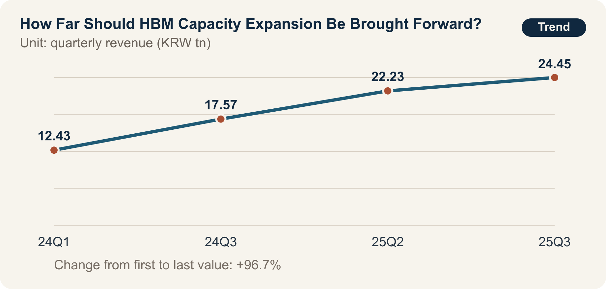

::: {.book-question}
[Today’s Chaekmun]{.book-question-label}

{.book-question-image width=30mm fig-alt="A minimalist ink-wash illustration symbolizing HBM stacks and the stage gates of capital investment"}

[If a customer places a five-year order but the equipment takes seven years to pay back, should a new analyst recommend a full capacity expansion?]{.book-question-prompt}
:::

A Joseon-era chaekmun^[This chapter follows the historical 1507 chaekmun *Government Consistent from Beginning to End*, in which King Jungjong asked how the purpose of an undertaking could be preserved to the finish. The Chaekmun Archive reconstructs its meaning in the concise Classical Chinese “善始者未必善終，何也？欲始終惟一，其道何由？”, which is not a literal transcription of the original. It asks: “Why does one who begins well not necessarily end well, and what path allows beginning and end to remain consistent?”] demanded institutions and conduct that would work to the end, not merely momentum at the start. During an HBM boom, a good start may mean ordering equipment quickly; a good finish means protecting cash flow if demand falls and converting the equipment to the next product generation.

## Why This Question, and Why Now?

SK hynix revenue rose from KRW 12.43 trillion in the first quarter of 2024 to KRW 17.57 trillion in the third quarter of 2024, KRW 22.23 trillion in the second quarter of 2025, and KRW 24.45 trillion in the third quarter of 2025. A simple comparison of the first quarter of 2024 with the third quarter of 2025 shows an increase of approximately 97%. Operating profit in the third quarter of 2025 was KRW 11.38 trillion.

The product mix also changed. In company disclosures, HBM represented 30% of DRAM revenue in the third quarter of 2024 and was forecast to reach 40% in the fourth quarter. These figures show the importance of AI memory, but they do not mean that HBM shipments, contract duration, or future demand were secured. Revenue growth reflects not only volume, but also pricing and a shift toward higher-value products.

When a new analyst on the capital-investment team turns the boom narrative into an investment proposal, the timelines must be aligned. The analysis must place customer order duration, cancellation rights and prepayments, equipment order and installation, yield ramp, packaging bottlenecks, depreciation, and the payback period on one axis. Even if a customer states five years of demand, a seven-year payback makes the final two years of cash flow dependent on demand outside the contract.

## Data Lens

{fig-alt="A graph showing the rise in SK hynix quarterly revenue from the first quarter of 2024 through the third quarter of 2025"}

### Evidence Table

| Category | Figure and scope in the primary data | Meaning for the investment decision |
|---:|---|---|
| Company disclosure | Revenue in the first quarter of 2024 was KRW 12.43 trillion. | This is the starting point for comparison, not HBM-only revenue. |
| Company disclosure | Revenue was KRW 17.57 trillion in the third quarter of 2024 and KRW 22.23 trillion in the second quarter of 2025. | This is an upward path in quarterly revenue, but price, volume, and product mix must be decomposed. |
| Company disclosure | Third-quarter 2025 revenue was KRW 24.45 trillion and operating profit was KRW 11.38 trillion. | The figures demonstrate strong profitability, but do not guarantee seven years of cash flow from a new line. |
| Company announcement | HBM represented 30% of DRAM revenue in the third quarter of 2024 and was forecast to reach 40% in the fourth quarter. | The denominator is DRAM revenue, not total revenue, and 40% was a forecast at the time. |
| Calculation from primary data | Revenue increased approximately 97% from the first quarter of 2024 to the third quarter of 2025. | This is a simple comparison of two nonadjacent quarters, not a long-term growth rate or a measure of downside demand. |

### How to Read These Numbers

KRW 24.45 trillion is total company quarterly revenue. It is not HBM unit volume or contract backlog by customer. The KRW 11.38 trillion operating profit likewise combines the effects of existing equipment and product pricing, so it cannot be inserted directly into the internal rate of return for a new line.

The denominator for the 30% HBM figure is DRAM revenue. It is not unit share, and higher-priced products appear larger when measured by revenue. Because 40% was a fourth-quarter forecast at the time of the announcement, it must be recorded separately from the actual result. A new analyst should use different colors for disclosed actuals, management forecasts, and the analyst’s own demand assumptions.

A long-term order is not committed demand until the contract has been read. The analyst must examine minimum purchases, price renegotiation, cancellation fees, customer design changes, quality shortfalls, and rights to change suppliers. The downside scenario must include not only the cost of canceling equipment, but also the supporting investment in packaging, testing, power, and skilled employees.

## Competing Answers

### Answer A — Expand Fully and Early

HBM equipment procurement and process and packaging qualification take time. If a company waits until demand is fully confirmed, it may miss the customer’s product cycle. Securing equipment when long-term orders and a technology lead have been established can bind customers and standards to the supplier and slow market entry by followers.

The opportunity cost of delayed expansion is also large. If equipment queues and cleanroom and power construction stretch out, volume missed in one quarter may not be recovered in the next. The ability to meet a customer’s supply-security requirement becomes evidence supporting the next contract.

### Answer B — Guard Against Overinvestment

If the seven-year payback exceeds a five-year order, the company bears demand and pricing risk after the contract ends. If the pace of AI investment slows or customers change their in-house accelerator architectures, the fixed-cost and depreciation shock will grow. A full equipment order that ignores the memory industry’s history of overexpansion can deepen the next downturn.

Nor does increasing HBM wafer output alone create a saleable product if packaging, testing, substrates, and power do not keep pace. Concentrating the budget on the largest equipment while missing the real bottleneck is even more dangerous.

### Answer C — Use a Three-Stage Expansion Linked to Demand

Divide the build-out into cleanroom and infrastructure, critical equipment, and follow-on equipment, opening the next order only when customer prepayments, minimum purchases, qualification, and packaging utilization are confirmed. This secures part of the equipment lead time while preserving cancelable capacity if downside demand emerges.

The switching conditions are contract quality and cash flow. Stop the next stage if cancelable orders increase, prepayments decline, or the downside scenario shows a cash shortfall during the investment period. Conversely, bring expansion forward when the customer shares risk and the packaging bottleneck and yield constraints have been resolved.

## AI Research Design

### Prompt for the AI

> Prepare a recommendation comparing full expansion with a three-stage build-out for a five-year HBM order and a new line with a seven-year payback. Investigate, in order, company disclosures and earnings releases, customer contracts and demand forecasts, equipment purchase orders, monthly process and packaging capacity, and the financial model. Distinguish revenue, shipment volume, ASP, and HBM’s share of DRAM revenue, and place actual results, company forecasts, and internal assumptions in separate columns. Present by customer the minimum purchase, cancellation rights, prepayments, and price adjustments; equipment lead times and cancellation fees; wafer, stacking, and testing bottlenecks; and the yield ramp. Calculate cash flow and payback under base, downside, and upside cases, disclosing the source and sensitivity of every assumption. Finally, propose numerical thresholds and accountable decision makers for opening or stopping the next order stage.

### Data Acquisition

| Priority | Source | Items that must be recorded |
|---:|---|---|
| 1 | Customer contracts and demand agreements | Duration, minimum purchases, cancellation rights, price adjustments, prepayments, quality and delivery terms |
| 2 | Equipment and construction contracts | Order and installation lead times, payment schedule, cancellation fees, conversion and used-equipment resale options |
| 3 | Process and packaging operating data | Wafer starts, stacking and test capacity, yield, utilization, bottlenecks, and staffing |
| 4 | Company disclosures and market data | Distinction between actuals and forecasts, denominator for HBM share, changes in price, volume, and mix |
| 5 | Financial model | Depreciation, working capital, power and materials costs, base and downside cash flow, and payback period |

### Assessing the Information

1. **Actuals and forecasts:** Do not report a figure that was a forecast at the time, such as 40% for the fourth quarter of 2024, as an actual result.
2. **Contract quality:** Minimum purchases, cancellation and price-adjustment rights, and prepayments determine risk sharing more than the order term does.
3. **Bottleneck alignment:** Convert wafer, stacking, testing, and substrate capacity into the same finished-product units.
4. **Timeline alignment:** Put the customer’s contract term and the equipment life, depreciation, and payback period on the same yearly axis.
5. **Downside survival:** Examine cancellation costs, fixed costs, and cash balances first under low demand.

### Core Questions for Debate

- How can the two years of payback risk remaining after the five-year order be shared with the customer?
- How would you calculate whether the opportunity cost of securing equipment or a 12% cancellation fee is larger?
- If packaging rather than wafers is the bottleneck, which equipment should be ordered first?
- What advance investment answers the objection that a phased build-out may move too slowly and lose the customer?

## Case Debate

The figures below are **hypothetical interview conditions**, not SK hynix’s actual investment plan. You are a new analyst on the capital-investment team. A major customer has proposed five years of volume, but the new line takes seven years to pay back. In the downside scenario, demand is 50% of the base case, while the cancellation fee on equipment already ordered is 12% of the contract value. The customer’s minimum purchase and prepayment and the packaging bottleneck remain under negotiation.

1. The sales team discloses the cancelable portion of the five-year volume and the price-adjustment clauses.
2. The production team presents monthly wafer, stacking, and test capacity and the expected date for reaching target yield.
3. The procurement team summarizes lead times by tool, the 12% cancellation cost, and the feasibility of staged ordering.
4. The finance team compares seven-year cash flow under the base case and a 50% downside case.
5. You choose between **a single full expansion and a three-stage expansion**, and write the conditions for opening and stopping the next stage.

Even if you choose full expansion, the statement “AI demand will continue” is insufficient. Even if you choose three stages, you must explain whether the first stage moves fast enough to secure a place in the equipment queue.

## Sample 90-Second Response

“I recommend **Answer C: a three-stage expansion**. Disclosed quarterly revenue rose approximately 97%, from KRW 12.43 trillion in the first quarter of 2024 to KRW 24.45 trillion in the third quarter of 2025, while HBM represented 30% of DRAM revenue in the third quarter of 2024. Yet total company revenue and HBM revenue share do not guarantee a seven-year return on investment. The five-year customer contract, seven-year payback, 50% downside demand, and 12% cancellation fee in the scenario are all hypothetical. The full-expansion counterargument—that delayed equipment and qualification could cause us to miss the boom—is valid, so I would secure the cleanroom and bottleneck equipment first. But committing the full order is risky when the payback runs two years beyond the contract. I would open the next stage only after confirming customer minimum purchases and prepayments and packaging yield. If the 50% downside case shows a cash shortfall during the investment period, I would absorb the cancellation fee and stop follow-on orders. Conversely, if the customer shares the risk and the bottleneck is resolved, I would accelerate the schedule. At every stage, I would recalculate cash flow and yield and report them to the board. Capacity speed should be set by contracts and process data, not the mood of the boom.”

## Follow-Up Questions

**Cross-Examination and Rebuttal**

- If the customer’s five-year volume is a nonbinding forecast, should even the first stage be held?
- How would you compare a 12% equipment cancellation fee with seven years of carrying cost for excess capacity?
- If a competitor expands even in the 50% downside scenario, would you prioritize defending market share?
- What difference does it make to the investment proposal that HBM’s reported share is a percentage of DRAM revenue?
- If packaging yield is low but wafer-equipment lead times are long, which order would you place first?
- If the customer prepays enough, does the concern about a seven-year payback disappear?

## Sources

- [SK hynix, *1Q24 Financial Results* (2024)](https://news.skhynix.com/sk-hynix-announces-1q24-financial-results/)
- [SK hynix, *3Q24 Financial Results* (2024)](https://news.skhynix.com/sk-hynix-announces-3q24-financial-results/)
- [SK hynix, *3Q25 Financial Results* (2025)](https://news.skhynix.com/en/sk-hynix-announces-3q25-financial-results/)
- [Joseon Dynasty Chaekmun Archive, King Jungjong’s 1507 *Government Consistent from Beginning to End*](https://waterfirst.github.io/Joseon-Dynasty-Civil-Service-Examination/#jungjong-1507/0)

> **Data note:** Company results and announced figures are kept separate from case assumptions; five years, seven years, 50%, and 12% are educational conditions.
