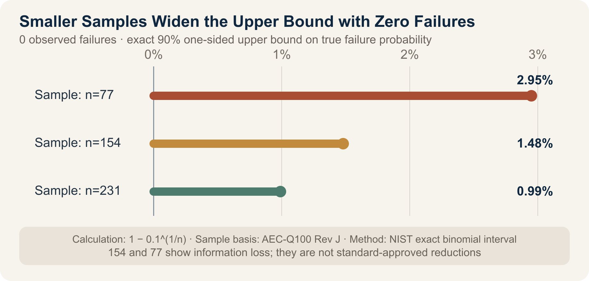

::: {.book-question}
[Today’s Chaekmun]{.book-question-label}

{.book-question-image width=30mm fig-alt="A minimalist ink-wash illustration of a reliability test chamber, an hourglass, and a hidden microcrack beneath a magnifying glass"}

[Should a product ship before some reliability tests are complete in order to meet the customer’s deadline?]{.book-question-prompt}
:::

King Jungjong’s 1515 chaekmun on realizing ideal government in the present^[The historical chaekmun (策問) connected to this chapter asked what must come first to realize the government of the sage-kings Yao and Shun in that age, and how Confucius would govern the country. The Chaekmun Archive reconstructs the meaning of its published translation in the concise Classical Chinese “欲致堯舜之治於今日，何者爲先？子若孔子，將何以治國歟？” This is not a literal transcription of the original. It means: “To realize the government of Yao and Shun today, what must come first? If you were Confucius, how would you govern the country?” Today’s question does not equate a historical ideal of government with a quality standard. It reinterprets the structure of the question—which demands an order of execution and conditions for verification rather than merely a worthy goal—and connects it to reliability decisions.] demanded more than good intentions; it required a statement of what to do first and how to execute it. “We will protect quality” and “We will meet the deadline” are likewise not answers when they remain declarations. The team must decide which tests detect which failure modes, how much risk remains unseen, and what may ship to whom and within what limits.

## Why This Question, and Why Now?

In an advanced package, the different coefficients of thermal expansion of the die, bumps, interposer, underfill, and substrate act within one system. When a material or thickness changes, dominant failure modes may also change, including interfacial delamination, cracking, and intermetallic-compound growth. Legacy reliability data cannot simply be borrowed because the previous generation had the same process name and external form.

For representative stress-test groups, AEC-Q100 Rev J (2023) requires 77 devices per lot across three lots—231 in total—with zero failures. This sample structure is associated with LTPD 1 at a 90% confidence level, but the standard states that it should not be used to estimate process-control performance or shipment PPM directly. Passing a test is different from claiming precise knowledge of the failure rate in actual use.

Accelerated testing compresses time, but it is not a license to raise any stress indiscriminately. NIST explains that random samples should be tested across multiple stress cells; the stress must accelerate the same failure mechanism seen under use conditions; and excessively high stress must not create a new failure mechanism. When a deadline is tight, teams should validate the failure mode and acceleration model before simply halving the test time.

## Data Lens

{fig-alt="A graph comparing the 90% one-sided upper bounds on the true failure probability for zero observed failures in samples of 231, 154, and 77 devices"}

### Evidence Table

| Category | Figure and scope in the primary data | Meaning for process and quality decisions |
|---:|---|---|
| Sample structure | A representative stress test in AEC-Q100 Rev J uses 77 devices per lot × three lots, for a total of 231 devices with zero failures. | The lot count is structured to include at least some process and material variation. Replacing it with 77 devices from one lot does not provide equivalent evidence. |
| Statistical meaning | The standard associates LTPD 1 with a 90% confidence level and states that this sample alone is insufficient to estimate process-control performance or PPM. | “Zero failures” does not mean that the failure probability is zero. |
| Temperature-humidity stress | The document specifies 1,000 hours at 85°C/85% RH, or accelerated conditions including 96 hours at 130°C/85% RH and 264 hours at 110°C/85% RH. | Do not compare time alone; verify the applied bias, package structure, and target failure mode together. |
| Reduced-sample calculation | With zero observed failures, the exact 90% one-sided upper bounds are 0.99% for 231 devices, 1.48% for 154, and 2.95% for 77. | Reducing the sample by two-thirds makes the upper bound on “unseen failures” roughly three times wider. |
| Accelerated-test principles | NIST calls for stress cells by failure mode, random samples, acceleration models, and extrapolation to use conditions. | If excessive stress creates a new failure mode, the result is not a faster version of the same test, but a different test. |
| Current military standard | MIL-STD-883 Rev L Change 1, published by the U.S. Defense Logistics Agency, is the 2025 edition. | The applicable standard and revision must be checked for each contract and product family; standards cannot substitute for one another. |

### How to Read These Numbers

The figures 0.99%, 1.48%, and 2.95% are not predictions of the actual field failure rate. Assuming identical Bernoulli trials in which no failures are observed, they are the exact 90% one-sided upper bounds on the true failure probability, calculated as (1-0.1^{1/n}). They illustrate why even zero failures among 231 devices cannot be described as a “0% failure rate.”

Samples of 154 and 77 are not reduced-sample plans allowed by AEC-Q100. They are hypothetical cases in which only two or one of three lots have been completed because of a delivery deadline, used to compare the resulting loss of statistical information. Actual qualification must follow the applicable standard, product family, scope of change, and customer approval.

Accelerated-test time and sample size are not fully interchangeable. A shorter test at a higher temperature requires a physical model and validation data showing that it accelerates the same failure mechanism. A larger sample with insufficient test time can miss late-emerging failure modes, while completing the time requirement on only one lot can miss lot-to-lot variation.

## Competing Answers

### Answer A — Complete Every Planned Test

For a product with changed materials or structure, legacy data cannot erase potential failure modes. A mass-production shipment is difficult to reverse, and if an early failure appears in a customer system, the costs of recall, analysis, and lost trust can exceed the cost of a delayed delivery. Hold shipment until the planned number of lots, stress duration, and post-stress electrical tests are all complete.

“All tests complete,” however, does not mean that every risk has been eliminated. The team must also review whether the test plan adequately reflects the real failure modes and use conditions.

### Answer B — Reduce Testing Based on Risk

For unchanged structures and validated failure modes, legacy lot data may be used while samples and analytical resources are concentrated on stresses associated with the change. This is an engineering choice that can meet the customer’s deadline while reducing redundant tests. It applies only when equivalence of materials, suppliers, process windows, and acceleration models is documented and the standard and customer permit it.

Yet “test only the changes” may miss interactions that are not yet understood. If both the underfill and interposer thickness have changed, data from the previous package become less representative.

### Answer C — Hold Production Shipments and Release Only Limited Engineering Samples

Do not shorten the full qualification test, but provide only nonsale engineering samples for the customer’s assembly and firmware validation under restrictions on quantity, use, and return. Distinguish them from production and field shipments, and document the incomplete tests, known risks, and prohibited uses by agreement.

This choice preserves part of the customer’s schedule, but engineering samples can effectively be used as production units. It is unavailable unless traceable serial numbers, the permitted location of use, a ban on onward transfer, and an immediate right of recall after a test failure are in place.

## AI Research Design

### Prompt for the AI

> Create a reliability release-decision table for a new advanced package before its delivery deadline. Compare changes in the underfill, interposer thickness, bumps, substrate, and process conditions with the previous product, and connect each change to its failure mechanisms. Verify the applicable contractual standard and revision, and record each test’s temperature, humidity, bias, cycles, duration, number of lots, sample size per lot, and allowable failures. Distinguish completed, in-progress, not-started, failed, and right-censored data. For zero observed failures, calculate the exact 90% one-sided upper bound for each sample size, but do not interpret it as the field failure rate. To reuse legacy data, require evidence that the material, supplier, process window, failure mode, and acceleration model are equivalent. Separate facts, calculations, interview assumptions, and recommendations, and attach the institution, document, year, and direct URL to every external source. Present the advantages and disadvantages of a full hold, risk-based reduction, and a limited engineering-sample release, along with the conditions that would change the conclusion.

### Data Acquisition

| Priority | Source | Items that must be recorded |
|---:|---|---|
| 1 | Change list | Materials, dimensions, suppliers, equipment, process windows, and differences from the previous product |
| 2 | Raw test data | Sample and lot, stress conditions and duration, censoring, pre- and post-stress electrical tests, failure location |
| 3 | Failure-analysis data | Cross sections, SAM, X-ray, electrical analysis, failure mode, and root cause |
| 4 | Standards and customer requirements | Applicable document and revision, sample and allowable failures, change notification and deviation approval |
| 5 | Shipment controls | Engineering or production status, quantity, place of use, traceability, recall, and no-onward-transfer conditions |

### Assessing the Information

1. **Equivalent standards:** Do not apply test conditions from another product family merely because their names are similar.
2. **Sample independence:** Do not treat multiple dies from one lot as representing the variation of multiple lots.
3. **Zero-failure interpretation:** Do not express zero observed failures as a true failure probability of zero.
4. **Acceleration validity:** Do not use stress that creates a failure mechanism absent under use conditions for lifetime extrapolation.
5. **Data reuse:** Unless equivalence of the change and failure modes is demonstrated, do not substitute legacy data for a pass result on the current product.

### Core Questions for Debate

- If all 77 devices in one test lot pass, what is the strongest claim you can make to the customer?
- If a 72-hour delivery deadline conflicts with a 96-hour HAST, can the test be shortened to 48 hours by raising the stress?
- Who must control 20 engineering samples, and how, to prevent their use in field equipment?
- What values are omitted when the cost of a schedule delay and the cost of a latent defect are both converted into Korean won?

## Case Debate

The following figures are **interview assumptions**, not actual results from a particular company or product. You are a new engineer on the process and quality team for a new advanced-package product.

- Both the underfill material and interposer thickness have changed in this product.
- Using the AEC-Q100 sample structure as an internal benchmark, the company planned a HAST of 96 hours at 130°C/85% RH on three lots × 77 devices, along with 1,000 temperature cycles.
- The customer’s assembly-validation milestone is 72 hours away.
- So far, only one HAST lot of 77 devices is complete, with zero failures; the other two lots remain in progress.
- Temperature cycling has reached 300 of 1,000 cycles with zero failures.
- Legacy-product data are available, but equivalence has not been established because the underfill and interposer combination is different.

1. The reliability team presents the incomplete tests and failure mechanisms associated with each change.
2. The process team reviews material and process-window equivalence between the legacy data and the current product.
3. The customer team determines whether the units needed in 72 hours are for assembly validation or field sale.
4. You choose among **shipping the full production quantity, holding all units until testing is complete, and providing only 20 nonsale engineering samples under restrictions**.
5. You state the action after a test failure and the numerical and documentary conditions for switching to production shipment.

A strong answer does not conceal “zero failures” and “testing incomplete” in the same sentence. It separates the minimum support that can be offered to the customer’s schedule from the quality gates that cannot be reduced.

## Sample 90-Second Response

“I choose **Answer A: hold all units until the planned testing is complete**. A representative AEC-Q100 Rev J sample consists of 77 devices per lot across three lots—231 total—with zero allowable failures. When zero failures are observed, the 90% one-sided upper bound is approximately 0.99% for 231 devices and 2.95% for 77. These are not predicted field failure rates, but they show how reducing the sample increases uncertainty. In the scenario, both the underfill and interposer have changed, while only one HAST lot and 300 temperature cycles have been completed. These figures and the 72-hour deadline are hypothetical. I accept the counterargument that the delay may disrupt the customer’s schedule and cost a market opportunity. I would instead disclose the remaining tests and new ship date immediately. Shipment requires completion of HAST on all three lots and 231 devices, 1,000 temperature cycles, electrical testing, and failure-mode review. I would show test progress and causes of any failure to the customer and the accountable quality executive in the same table. If even one device fails, the hold remains until root-cause analysis and a revised test plan are approved. Deadlines can be renegotiated; unverified risk cannot be transferred to the customer.”

## Follow-Up Questions

**Cross-Examination and Rebuttal**

- If the customer says it will install the 20 engineering samples in the final product, how would your choice change?
- If one of 77 devices fails HAST but analysis identifies handling damage, how would you redesign the test?
- If all three lots use the same batch of raw material, can the full sample of 231 be treated as independent evidence?
- What physical evidence is required to replace a 96-hour HAST with 48 hours at a higher temperature?
- How would you qualify the statement that there were zero failures through 300 temperature cycles when reporting it to the customer?
- Can information that a competitor already mass-produces the same structure justify releasing the entire shipment?

## Sources

- [Automotive Electronics Council, official reliability-document list (accessed 2026)](https://www.aecouncil.com/AECDocuments.html)
- [Automotive Electronics Council, *AEC-Q100 Rev J: Failure Mechanism Based Stress Test Qualification for Integrated Circuits* (2023)](https://www.aecouncil.com/Documents/AEC_Q100_Rev_J_Base_Document.pdf)
- [U.S. NIST/SEMATECH, *Confidence Intervals for a Proportion*—exact binomial intervals (accessed 2026)](https://www.itl.nist.gov/div898/handbook/prc/section2/prc241.htm)
- [U.S. NIST/SEMATECH, *Accelerated Life Tests* (accessed 2026)](https://www.itl.nist.gov/div898/handbook/apr/section3/apr314.htm)
- [U.S. NIST/SEMATECH, *Physical Acceleration Models* (accessed 2026)](https://www.itl.nist.gov/div898/handbook/apr/section1/apr14.htm)
- [U.S. Defense Logistics Agency, official MIL-STD-883 document list (accessed 2026)](https://landandmaritimeapps.dla.mil/programs/milspec/ListDocs.aspx?BasicDoc=MIL-STD-883)
- [U.S. Defense Logistics Agency, *MIL-STD-883 Rev L Change 1* (2025)](https://landandmaritimeapps.dla.mil/Downloads/MilSpec/Docs/MIL-STD-883/std883.pdf)
- [Joseon Dynasty Chaekmun Archive, King Jungjong’s 1515 *The Path to the Government of Yao and Shun Today*](https://waterfirst.github.io/Joseon-Dynasty-Civil-Service-Examination/#jungjong-1515/0)

> **Data note:** The sample structure of 77 devices per lot × three lots, 231 total, with zero allowable failures; LTPD 1 and a 90% confidence level; and the temperature, humidity, and duration of the damp-heat tests come from the AEC-Q100 Rev J primary source. The 90% one-sided upper bounds of 0.99%, 1.48%, and 2.95% for zero observed failures in samples of 231, 154, and 77 are calculations based on the exact binomial method presented by NIST; samples of 154 and 77 are not reduced-sample plans permitted by the standard. The changes to underfill and interposer, 72-hour deadline, completion of one HAST lot, 300 of 1,000 temperature cycles, 20 engineering samples, and switching conditions are interview assumptions.
