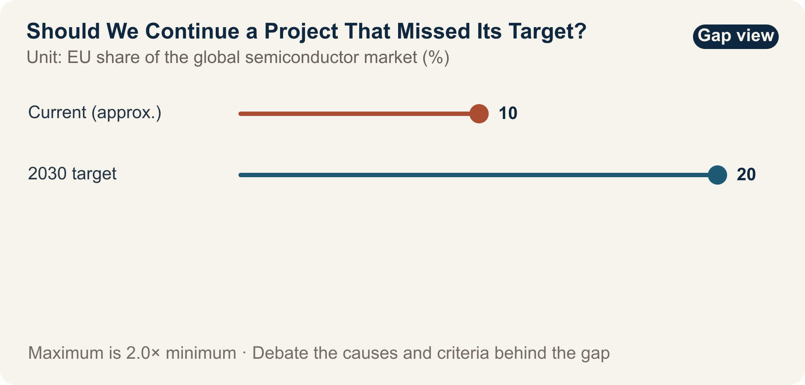

::: {.book-question}
[Today's Chaekmun]{.book-question-label}

{.book-question-image width=30mm fig-alt="A minimalist ink-wash illustration examining the paths available to an unfinished semiconductor fab and its remaining talent and patents"}

[Should a publicly funded fab project be extended when it missed its production target but still retains skilled people and patents?]{.book-question-prompt}
:::

The Joseon chaekmun—an examination question through which the king asked candidates to reason through an urgent problem of state^[This chapter connects the 1507 chaekmun posed by King Jungjong, “Governance Consistent from Beginning to End,” to the problem of ending or carrying forward an unsuccessful project. The Chaekmun Archive condenses and reconstructs the question in Classical Chinese as “善始者未必善終，何也？欲始終惟一，其道何由?”; this is not a literal transcription of the original. It asks, “Why does someone who begins well not necessarily end well, and what path allows one to remain consistent from beginning to end?”]—does not allow a worthy original purpose to excuse a failed outcome. Nor does it say that missing the original numbers requires discarding every capability created along the way. A junior policy evaluator must separate target attainment, residual capabilities, and the opportunity cost of additional funding before recommending extension, redesign, or termination.

## Why This Question Matters Now

The EU set a goal of raising its share of the global semiconductor market from about 10% to 20% by 2030. The European Chips Act entered into force on September 21, 2023. In 2026, the European Commission stated that existing policies had mobilized more than €52 billion in public and private investment and created about 46,000 direct and indirect jobs.

The move from 10% to 20% expresses direction and ambition; it is not an outcome. “Mobilized investment” may differ from actual EU budget expenditure and may combine announcements, plans, construction starts, and executed spending. The estimate of 46,000 jobs combines direct and indirect employment, so net employment, job duration, and occupational mix must be checked.

Project-level evaluation must be narrower still. Examine actual incremental capacity, customer-qualified products, the additionality of private investment, the reemployment of skilled workers, the use of patents in volume production, and repeat orders won by certified suppliers. Assessing only the original production target misses learning; assessing only the abstraction of “capability” conceals target shortfalls and sunk costs.

## Data Lens

{fig-alt="Chart comparing the EU's roughly 10% share of the global semiconductor market with its 20% target for 2030"}

### Evidence Table

| Category | Figure or Scope in the Source | Meaning for Project Evaluation |
|---:|---|---|
| Policy baseline | EU policy materials put its share of the global semiconductor market at about 10%. | This is a starting point that may vary with the definition and baseline year. |
| Policy target | The 2030 target is a 20% share of the global market. | This is a legal and policy objective, not achieved production output. |
| Entry into force | The European Chips Act entered into force on September 21, 2023. | This is the institutional start date, not the construction, execution, or volume-production date of an individual project. |
| Commission statement | The Commission announced that more than €52 billion in public and private investment had been mobilized by 2026. | The definition of “mobilized,” double counting, and the amount actually disbursed must be checked. |
| Commission statement | The Commission stated that about 46,000 direct and indirect jobs had been created. | The estimated range, net employment, duration, and job quality require separate verification. |

### How to Read These Numbers

If the 20% global-share target is calculated by production value, the scale of production the EU must add will depend on global market growth. You must also establish whether the calculation uses nominal revenue, production capacity, or shipment volume. A statement that the target is twice the baseline does not, by itself, reveal how many fabs are needed.

The €52 billion “mobilized” may not mean that €52 billion in public funds was paid out. Separate existing private plans from investment induced by subsidies, and announced amounts from actual execution. Likewise, construction-period indirect employment and long-term volume-production jobs should not be treated as equivalent components of the 46,000-job estimate.

To evaluate an unsuccessful individual project, prepare three ledgers. The first records production, financial, and employment commitments; the second records reusable talent, patents, and supplier networks; the third records the opportunity cost of directing additional funding away from other projects. Money already spent is not a reason to extend a project. Compare only the value that can still be recovered.

## Opposing Answers

### Answer A — Extend to Preserve Capabilities

Short-term output does not capture all the learning generated in a strategic industry. If skilled workers, process patents, and qualified suppliers remain—and can reduce the risk of failure and shorten qualification for the next line—immediate termination may disperse the knowledge assets created by public investment.

Where infrastructure and workforce development are complete and additional funding can remove a defined bottleneck, a limited extension may be more efficient than restarting the entire original plan. The remaining assets, however, must have an identified user and a contract that puts them to work in a follow-on project.

### Answer B — Sunset and Terminate

“Long-term capability” can become a convenient explanation for missing targets. Patents without production capacity or customers, trained workers with nowhere to move, and supplier certifications without orders are achievements only on paper. Without a termination threshold, an unsuccessful project continues to occupy funding and talent, blocking better alternatives.

Continuing because the money already spent feels too valuable to lose is a sunk-cost fallacy. If the future benefit created by additional funding is smaller than the benefit of another project, terminate the project and transfer its people and patents separately.

### Answer C — Conditional Redesign with a Narrower Scope

Do not extend the original plan unchanged. Retain only the components whose failure mechanisms are clear and whose reuse value is high. Set 12-month milestones for production, customer qualification, actual transfer of people and patents, and new private investment, with a sunset clause that triggers automatic termination if they are missed.

Evaluate the redesign by the marginal benefit of new funding, not by past expenditure. Disclose whether the new budget removes a bottleneck and creates marketable capacity, and whether it produces more value than allocating the funds to another project. An independent evaluator should verify results using evidence that does not come exclusively from the original project team.

## AI Research Design

### Prompt for the AI

> Write an evaluation of whether a publicly funded semiconductor fab that missed its production target should be extended, redesigned, or terminated. Investigate, in order, the relevant laws and funding agreements; the original and revised business plans; actual spending, production, and employment data; customer qualifications; records showing the use of patents, training, and suppliers; and external audits. Distinguish targets and announced figures—such as the EU's roughly 10% baseline, 20% goal for 2030, €52 billion mobilized, and 46,000 jobs—from actual execution and net effects. For the individual project, tabulate capacity versus plan, actual sales, the additionality of private investment, redeployment of skilled workers, use of patents in volume production, and repeat supplier orders. Separate verified facts, stakeholder claims, estimates, and scenario assumptions, and attach the institution, document title, publication date, and direct URL to every external source. Include the opportunity cost of additional funding and a 12-month sunset clause.

### Data Acquisition

| Priority | Evidence | Required Fields |
|---:|---|---|
| 1 | Original plan and funding agreement | Production, investment, and employment targets; schedule; change procedure; clawback and sunset provisions; accountable party |
| 2 | Actual execution and operating data | Amount paid and spent; equipment and operating capacity; yield; sales; customer qualifications; causes of delay |
| 3 | Workforce and patent records | Retention and movement of skilled workers; patent registration, use, and revenue; reuse in follow-on projects |
| 4 | Supplier and private-investment records | Repeat orders after qualification; new private capital; additionality created by subsidies |
| 5 | Alternative-project evidence | Production, R&D, and workforce outcomes possible with the same additional funding, and transition costs |

### Evidence Assessment

1. **Targets versus results:** Mark policy targets, announcements, commitments, construction starts, volume production, and sales as distinct stages.
2. **Exclude sunk costs:** Compare future costs with recoverable future benefits, not with money already spent.
3. **Reality of capabilities:** Identify the follow-on organization, schedule, and contract that will use the talent, patents, and supplier network.
4. **Additionality:** Determine whether private investment was newly induced by subsidies or merely moved from an existing plan.
5. **Enforcing the sunset:** Specify who triggers automatic termination after missed milestones, including exceptions and authority to amend them.

### Core Issues for Debate

- Can 62% attainment of a production target and the residual value of people and patents be combined into a single score?
- How do you distinguish whether additional funding equal to 25% of the original budget is rescuing sunk costs or removing a future bottleneck?
- What is the minimum evidence that 2,000 skilled workers and 40 qualified suppliers were actually reused?
- How do you give an independent evaluator enough autonomy to enforce a 12-month sunset clause despite political pressure?

## Case Discussion

The following is an **interview scenario, not an actual EU project**. You are a junior researcher on an industrial-policy evaluation team. A supported fab achieved only 62% of its production target, but 2,000 skilled workers, 300 patents, and 40 qualified suppliers remain. Continuing the project requires additional funding equal to 25% of the original budget. The actual reuse rate of the remaining capabilities and customers' repeat purchases have not yet been verified.

1. The operations team attributes the 62% result across demand, yield, equipment, and infrastructure.
2. The workforce team verifies the roles, retention, movement, and follow-on placement of the 2,000 workers.
3. The technology team verifies the use of the 300 patents in volume production and repeat orders won by the 40 suppliers.
4. The finance team compares the additional 25% with the benefit of directing those funds to other projects.
5. You recommend one of three options: **extend the original plan, redesign it for 12 months, or terminate it and transfer the assets**.

If you choose redesign, do not merely say, “Give it one more chance.” Specify numerical thresholds and the person responsible for automatic termination after 12 months. If you choose termination, explain where the workers, patents, and suppliers will go.

## Sample 90-Second Answer

“I recommend **Answer C: a narrower 12-month redesign, not an extension of the original plan**. The EU set a goal of raising its share of the global semiconductor market from about 10% to 20% by 2030, and the Commission says existing policy has mobilized more than €52 billion in investment. But a target and a mobilized sum do not prove the productivity of an individual fab. In this case, the 62% target attainment, 2,000 skilled workers, 300 patents, and 25% additional budget are all assumptions. I accept the argument for extension that abandoning people and patents useful to follow-on production would destroy value. The opposite risk is using the language of ‘strategic capability’ to conceal sunk costs. I would therefore spend additional funds only on verified bottlenecks and asset transfer, while publishing gates for customer-qualified capacity, workforce placement, use of patents in volume production, and repeat supplier orders. If the milestones are missed, or another project offers a higher marginal benefit, the project should terminate automatically. I would approve the next stage only after actual sales and additional private investment are verified. The purpose of redesign is not to hide failure, but to convert what remains into assets for the next decision.”

## Follow-Up Questions

**Cross-Examination and Rebuttal**

- If weaker market demand caused the project to reach only 62% of its production target, could the project still be considered a technical success?
- If the 2,000 skilled workers find jobs at other companies, is that evidence of the original project's success or a reason to terminate it?
- Would you redesign the project if the 300 patents had little value but the certifications of the 40 suppliers remained useful?
- How would you compare fairly the additional 25% with the option of spending it on another workforce program?
- If the project narrowly misses its targets after 12 months, would you enforce the sunset clause as written?
- Can you report separately on the political target of a 20% market share and the economics of an individual project?

## Sources

- [European Commission, *European Chips Act* (entered into force in 2023; accessed 2026)](https://digital-strategy.ec.europa.eu/en/policies/european-chips-act)
- [European Commission, *Chips Act 2.0* (2026)](https://digital-strategy.ec.europa.eu/en/policies/chips-act-2)
- [European Commission, *Proposal for the Chips Act 2.0* (2026)](https://digital-strategy.ec.europa.eu/en/library/proposal-chips-act-20)
- [Joseon Dynasty Chaekmun Archive, “Governance Consistent from Beginning to End” (King Jungjong, 1507)](https://waterfirst.github.io/Joseon-Dynasty-Civil-Service-Examination/#jungjong-1507/0)

> **Data note:** EU policy and announcement figures are separated from the scenario assumptions. The 62%, 2,000 workers, 300 patents, 40 suppliers, 25%, and 12 months are educational evaluation conditions or decision criteria proposed in this chapter.
