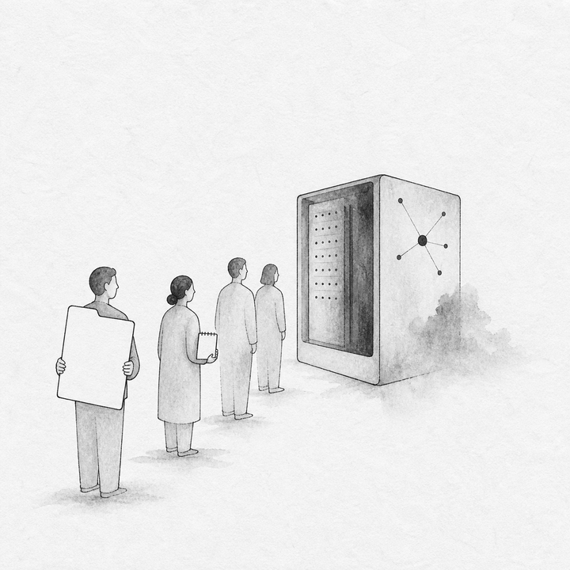
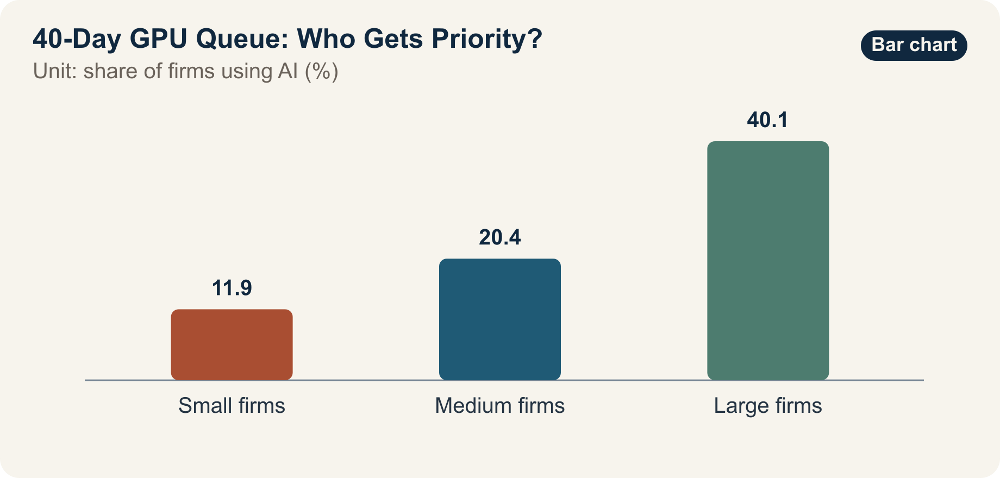

::: {.book-question}
[Today's Chaekmun]{.book-question-label}

{.book-question-image width=30mm fig-alt="A minimalist ink-wash illustration dividing scarce GPU resources among several teams"}

[When shared corporate GPUs are scarce, who should receive them first: a revenue team or a junior experimental team?]{.book-question-prompt}
:::

The Joseon chaekmun—an examination question through which the king asked candidates to reason through an urgent problem of state^[This chapter adapts the actual chaekmun “How Should We Find Talent?,” associated with a 1447 record from the reign of King Sejong, to today's problem of allocating compute. The Chaekmun Archive condenses and reconstructs it in Classical Chinese as “人才國之寶也。何以養之、辨之、用之？君臣相遇之難，其故何歟?”; this is not a literal transcription of the original. It asks, “Talent is a treasure of the state: how should it be cultivated, recognized, and used, and why is it difficult for a ruler and a subject to find each other?”]—did not ask only how to use people whose talent was already visible. It also asked how to cultivate and recognize ability that had not yet emerged. Allocating GPUs likewise goes beyond ranking teams by current revenue. It asks how to guarantee new teams a minimum opportunity to prove what they can do.

## Why This Question Matters Now

In an OECD comparison compiled from official national statistics, AI adoption rates were 11.9% for small firms, 20.4% for medium-sized firms, and 40.1% for large firms. The large-firm rate was about 3.4 times the small-firm rate. Even when the same technology is publicly available, actual opportunity can differ sharply when firms have unequal funding, data, talent, training, and time to recover from failure.

These adoption rates cannot be converted directly into an internal GPU allocation ratio. They measure the share of firms using AI, not work quality, GPU hours, or return on investment. They also combine different countries and industries. An internal decision requires data on waiting time by team, actual utilization versus reservations, experimental reproducibility, customer deadlines, data readiness, and the downstream use of outputs.

Inside the company, distinguish holding an account from receiving a real opportunity to experiment. Giving everyone an account does not equalize the conditions for producing results if teams lack data cleaning, mentoring, review time, and a chance to retry after an initial failure. Allocation rules must therefore address not only GPU time, but also preparation support and a path to retry after the first experiment fails.

## Data Lens

{fig-alt="Chart showing OECD AI adoption rates of 11.9% for small firms, 20.4% for medium-sized firms, and 40.1% for large firms"}

### Evidence Table

| Category | Figure or Scope in the Source | Meaning for Internal Allocation |
|---:|---|---|
| OECD aggregate | AI adoption among small firms was 11.9%. | This is firm-level use and does not directly measure the GPU demand or ability of small teams. |
| OECD aggregate | AI adoption among medium-sized firms was 20.4%. | It suggests that barriers in resources and technical support may be easier to overcome as scale increases. |
| OECD aggregate | AI adoption among large firms was 40.1%. | Higher adoption does not guarantee the performance or efficiency of every deployment. |
| Calculation from source data | The large-firm adoption rate was about 3.4 times the small-firm rate. | This signals an access gap; it does not mean GPU scarcity is the sole cause. |

### How to Read These Numbers

The 11.9%, 20.4%, and 40.1% figures are OECD member-country aggregates of whether firms use AI. Consult the document's definition to determine whether they refer to generative AI alone or to all AI. An average weighted by the number of firms differs from one weighted by employees or hours of use.

Correlation between firm size and adoption does not establish causation. Large firms may have more data infrastructure, legal and security support, dedicated staff, and training, in addition to GPUs. The effectiveness of a GPU allocation policy should therefore be evaluated by reduced waiting times, completed experiments, reproducible results, operational adoption, and gaps between teams—not by the number of accounts alone.

Fair allocation is not the same as giving every team equal time. Work such as a customer demonstration deadline has urgent delay costs; junior experimentation without a track record requires an opportunity. Both objectives can be served by separating an urgent customer pool from a baseline exploration pool, reclaiming unused reservations quickly, and granting larger allocations to teams that pass an initial experiment.

## Opposing Answers

### Answer A — Prioritize Revenue and Deadlines

Allocating first to teams with clear customer schedules and cash-flow implications can produce business results faster from the same GPUs. Teams whose data and code are ready are also more likely to use the resources they reserve. Tying up scarce capacity in experiments that are not ready increases the opportunity cost to the whole company.

A demonstration with an imminent deadline may be irrecoverable once missed. It is reasonable to create a separate urgent queue and evaluate expected revenue, contract probability, and readiness.

### Answer B — Protect Equal Opportunity

If rankings depend only on current performance, teams that already have customers, staff, and data will remain at the front of the queue, while junior and research teams cannot run even the first experiment needed to demonstrate ability. Exploration without short-term revenue can still create the next product, reveal failure mechanisms, and produce reusable data. Equity is not charity; it is an investment in future options.

Performance-based allocation favors teams that produce easily measurable outcomes and may systematically crowd out basic research and long-term improvement. Every new team should receive a baseline allocation and mentoring sufficient to run one small validation.

### Answer C — Two Pools with Staged Promotion

Separate an urgent customer pool from a baseline research pool, then assess readiness, expected effect, and waiting time within each. Guarantee a minimum experiment to new teams, while requiring them to preregister their data, code, and evaluation metrics. Promote a team to a larger allocation when its first result is reproducible and has demonstrated follow-on value.

If actual utilization is low relative to the reservation or no output is submitted, reclaim the remaining allocation and transfer it to the next team. Urgent customer teams must also report downstream revenue and customer outcomes. Repeated failure to deliver expected results lowers their priority. Publish both the allocation rule and an appeals path so managerial discretion is not perceived as favoritism.

## AI Research Design

### Prompt for the AI

> Design an operating policy that allocates scarce shared corporate GPUs fairly between revenue teams and junior experimental teams. Use OECD AI adoption rates by firm size only as external context. Collect internal scheduler logs, reservations, actual utilization and waiting time; data readiness by team; experiment plans and reproducibility; customer deadlines; and actual business outcomes. Minimize sensitive personal and team information and test for discrimination related to rank or department. Distinguish “access,” “actual use,” “completed output,” and “operational adoption.” For every external number, provide the institution, document title, year, unit, denominator, and direct URL. Compare fixed quotas, performance ranking, and a lottery-review hybrid, and propose an urgent customer pool, a baseline research pool, reclamation of unused allocations, an appeal process, and quarterly audit criteria.

### Data Acquisition

| Priority | Evidence | Required Fields |
|---:|---|---|
| 1 | GPU scheduler logs | Request, approval, start, end, waiting time, utilization versus reservation, reason for failure or termination |
| 2 | Experiment preregistration | Data readiness, code, expected GPU time, evaluation metric, security and privacy approval |
| 3 | Output repository | Reproducibility, model, code, failure record, reuse by follow-on teams, operational adoption |
| 4 | Customer and business records | Deadline, contract stage, delay cost, demonstration result, actual revenue contribution |
| 5 | Team-attribute audit data | Waiting-time gaps by rank, department, and tenure; appeals; exceptions; managerial discretion |

### Evidence Assessment

1. **Separate the metrics:** Count account ownership, GPU allocation, actual use, completion, and business performance as different stages.
2. **Verify readiness:** Do not automatically prioritize an urgent request if its data, code, and evaluation metrics are not ready.
3. **Correct opportunity gaps:** Give new teams without past performance a small validation through which they can create evidence of performance.
4. **Check reproducibility:** Recognize a learning outcome only when failure conditions, code, and logs—not just successful results—can be reused.
5. **Audit disparities:** Disclose waiting-time distributions and exception approvals by team size and rank, not only the overall average.

### Core Issues for Debate

- Which is more urgent: a customer demonstration in two weeks or a 40-day average wait for junior teams?
- When only 60% of GPU demand can be served, what principle protects a “baseline research allocation”?
- Does evaluating the potential of teams without past performance simply reintroduce evaluator bias?
- What records must be reproducible for a failed experiment to count as an output?

## Case Discussion

The following values are **internal allocation assumptions for an interview**, separate from the OECD statistics. You are a junior employee on the shared-compute operations team. The revenue team must give a customer demonstration within two weeks; 12 junior research teams have waited an average of 40 days. Current GPU capacity can serve only 60% of total requested demand. Actual utilization versus reservations and the downstream reuse of failed experiments have not yet been disclosed by team.

1. The revenue team submits its customer deadline, prepared data and code, and the cost of delay.
2. Each junior research team preregisters the purpose, required time, and reproducibility plan for a small validation.
3. The operations team examines the distribution hidden behind the 40-day team average and identifies unused reservations.
4. You design one of three approaches: **a fixed quota, performance ranking, or a lottery-review hybrid**.
5. The policy must include a two-week urgent path, a baseline opportunity to experiment, reclamation of unused time, promotion and demotion, and an appeal process.

Do not allow unprepared work to occupy resources for extended periods merely because a junior team deserves consideration. Nor should the same department monopolize exceptions in the name of revenue. Everyone must be able to predict the rule and verify the outcome.

## Sample 90-Second Answer

“I propose **Answer C: two pools combining review and a lottery**. In the OECD aggregate, AI adoption was 11.9% among small firms, 20.4% among medium-sized firms, and 40.1% among large firms—making the large-firm rate about 3.4 times the small-firm rate. This gap shows that simply making a tool available does not equalize opportunity, but it does not directly set an internal allocation ratio. The customer demonstration in two weeks, 12 junior teams, 40-day average wait, and 60% capacity in this case are all assumptions. The objection that delaying a ready customer project may lose real revenue is valid. I would therefore assess the urgent customer pool by deadline, readiness, and expected impact, while using a lottery to give preregistered new teams in the baseline research pool their first experiment. Reproducible results earn promotion to the next stage; unused reservations or missing outputs trigger immediate reclamation. Each quarter, I would publish waiting time, actual utilization, reproducibility, and departmental exceptions. If junior teams remain blocked from obtaining a first result, or if unused capacity in the customer pool exceeds the threshold, I would rebalance the pools. Fair access does not mean dividing time equally. It means opening a path through which ability can be demonstrated.”

## Follow-Up Questions

**Cross-Examination and Rebuttal**

- If the customer demonstration in two weeks reflects a possibility rather than a signed contract, should it enter the urgent pool?
- How would you reduce departmental and educational-background bias when evaluating readiness among the 12 junior teams?
- If a few long projects distort the 40-day average, which quantiles should be disclosed?
- Which should come first: investing to raise the 60% capacity or improving the allocation rule?
- If the logs from a failed experiment are reused by a follow-on team, should that receive the same reward as a revenue outcome?
- How would you answer a high-performing team that has no unused allocation but must still wait to protect the baseline research pool?

## Sources

- [OECD, *Generative AI and the SME Workforce: New Survey Evidence* (2025)](https://www.oecd.org/en/publications/generative-ai-and-the-sme-workforce_2d08b99d-en.html)
- [OECD, *Introduction: Generative AI and the SME Workforce*—AI Adoption by Firm Size (2025)](https://www.oecd.org/en/publications/generative-ai-and-the-sme-workforce_2d08b99d-en/full-report/component-3.html)
- [Joseon Dynasty Chaekmun Archive, “How Should We Find Talent?” (record from the reign of King Sejong; accessed 2026)](https://waterfirst.github.io/Joseon-Dynasty-Civil-Service-Examination/#sejong-1447-talent/0)
- [National Institute of Korean History, *Gang Hui-maeng* (accessed 2026)](https://contents.history.go.kr/mobile/kc/view.do?code=kc_age_30&levelId=kc_n300400)

> **Data note:** The OECD figures by firm size are external evidence. The two weeks, 12 teams, 40 days, and 60% are educational assumptions for internal resource allocation.
