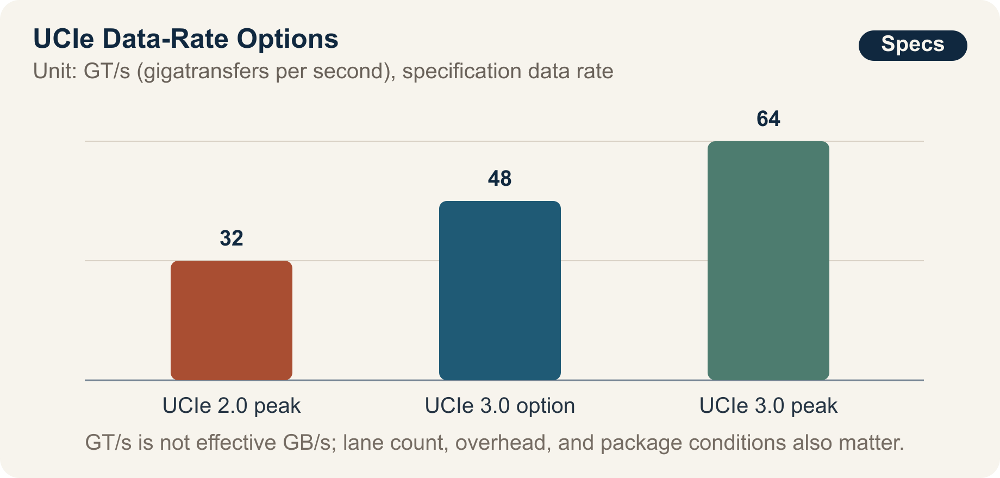

::: {.book-question}
[Today's Chaekmun]{.book-question-label}

{.book-question-image width=30mm fig-alt="An ink-wash illustration of two interlocking standards-based chiplets, a faster isolated proprietary chiplet, and a magnifying glass for verification between them"}

[Should the next AI accelerator use UCIe for every chiplet connection, or use a proprietary interface in selected segments to improve performance and power?]{.book-question-prompt}
:::

King Sejong's 1447 chaekmun on law and authority^[The actual chaekmun ([策問]{.hanja}) connected to this chapter asked about the cycle in which rules create abuses and new rules are then established, as well as where responsibility should reside. The Chaekmun Archive condenses and reconstructs the question in Classical Chinese as “[法立而弊生，弊生而法又立。其所以救之者何歟？政權當歸於何所歟？]{.hanja}”; this is not a literal translation of the complete original. It asks, “When laws are established, abuses arise, and when abuses arise, new laws are established. How can this be remedied, and where should authority reside?” Today's question does not translate Joseon's governing institutions into chiplet specifications. It borrows the question's structure to ask who verifies and reverses a design when shared rules and engineered exceptions each create new costs. See the [individual entry in the Joseon Dynasty Chaekmun Archive](https://waterfirst.github.io/Joseon-Dynasty-Civil-Service-Examination/#sejong-1447/0).] did not assume that establishing a standard ended the problem. An interface standard can broaden the supplier base and provide a common language for verification, but it does not guarantee optimal performance in every package. A proprietary link can be tailored to a specific workload, but it can also lock design knowledge and the supply chain to one source.

## Why This Question Matters Now

AI accelerators combine compute dies, I/O dies, caches, and memory interfaces inside one package. Compared with a single large monolithic die, this makes it easier to assign functions to different process nodes. It also requires bandwidth, latency, power, thermals, and testing between dies to be reconciled again at the system level. UCIe provides a common foundation spanning the physical layer, protocols, software model, and compliance testing.

In August 2025, the UCIe Consortium announced UCIe 3.0 with support for 48 GT/s and 64 GT/s, doubling the peak data rate from UCIe 2.0's 32 GT/s. NIST's report on 2024 standards activity, however, concluded that no single universal standard could yet be considered widely adopted and that relatively few real integrations combined chiplets from different companies. The goals of the standard and the ecosystem's current maturity must be considered together.

A junior design engineer cannot replace the ultimate decision-maker. The engineer can, however, quantify which boundaries should use the standard, whether the performance advantage of a proprietary link exceeds its verification, redesign, and single-source risks, and which failed test would trigger a return to the standards-based design.

## Data Lens

{fig-alt="Bar chart comparing UCIe 2.0's peak data rate of 32 GT/s with the new UCIe 3.0 options of 48 GT/s and 64 GT/s"}

### Evidence

| Evidence | Figure or Scope in Official Sources | Meaning for the Design Decision |
|---:|---|---|
| 1 | The UCIe Consortium announced that UCIe 3.0 supports 48 GT/s and 64 GT/s, doubling the peak data rate from UCIe 2.0's 32 GT/s. | High-speed link options remain available when the standard is selected. GT/s, however, is not the same as the GB/s available to an application. |
| 2 | UCIe 3.0 adds an extended sideband with a reach of up to 100 mm, early firmware download, priority packets, and emergency-shutdown notification, while specifying backward compatibility with earlier versions. | Architecture review must cover initialization, management, and fault isolation, not only the data path. |
| 3 | UCIe 2.0 introduced UCIe-3D for bump pitches ranging from roughly 10–25 μm to below 1 μm, as well as test, telemetry, and debug structures for multiple chiplets. | Fine pitch alone does not guarantee yield. Bonding, thermal stress, known-good-die screening, and repair strategy are also required. |
| 4 | NIST's report on 2024 activity concluded that no single universal chiplet standard was yet widely adopted and that multisupplier integration examples remained limited. | Treating “standards-compliant” as synonymous with “immediately replaceable chiplet” overstates ecosystem maturity. |
| 5 | The U.S. NAPMP announced an investment of about $3 billion in six priority areas for advanced packaging, pilot facilities, and workforce development. | Beyond the interface, bottlenecks remain in substrates, process equipment, power and thermals, optical connections, codesign, and volume-production validation. |
| 6 | A NIST chiplet-standards workshop identified gaps in package assembly design kits (PADKs), thermal and mechanical constraints, functional tests for locating defects, and fail-fast procedures. | A test plan that verifies only the link specification cannot close the boundaries of responsibility in a multisupplier package. |

### How to Read These Numbers

**64 GT/s is not 64 GB/s.** GT/s is the link's symbol-transfer rate. Effective bandwidth depends on lane count, encoding and error-correction overhead, protocol efficiency, directionality, package routing, and thermal constraints. The chart therefore shows the specification's speed options; it does not predict the throughput of a particular product.

The ranges of 10–25 μm and below 1 μm are bump pitches considered by UCIe-3D, not evidence that a supplier achieved a desired yield at those pitches. The sideband reach of up to 100 mm must not be confused with the reach of the primary data path. The roughly $3 billion figure is the scale of a policy program, not proof of our project's return or delivery schedule.

At a minimum, a standards-based design and a proprietary design must be measured under the same workload and package conditions using the following metrics:

- Effective bandwidth and both the mean and tail of round-trip latency
- Energy per transfer, link power, package temperature, and time spent throttling
- Traceability of PHY, protocol, and DFx requirements, and fault-injection pass rate
- Known-good-die screening rate, assembly yield, and probability of a first-silicon redesign
- Weeks required to replace an IP vendor, foundry, or OSAT, and the scope of qualification that must be repeated

## Opposing Answers

### Answer A — Standards First

Standardizing every supplier boundary on UCIe 3.0 allows common PHY and protocol requirements, compliance tests, and management and debug procedures to be reused. It also provides a basis for negotiation when evaluating a second IP source or a different chiplet. A standards-first approach is reasonable when replaceability and verification assets across a product family matter more than peak performance in the first product.

Specification compatibility is necessary for package compatibility, but not sufficient. Integration can fail even with a standard PHY if teams cannot reconcile bump maps, power-delivery networks, thermal design, firmware, and error-handling policies. The area and protocol overhead of a standard block may also exceed the power limit of a particular data path.

### Answer B — Proprietary Optimization

When the workload is fixed and one company designs both dies and the package, a proprietary link can remove unnecessary features. Adjusting lanes, buffers, and voltage for short routing and dedicated flow control may improve performance and power. If standards-based IP validation is running late at product launch, an established internal link may also reduce schedule risk.

The price is paid in system verification and the supply chain. Dependence on one vendor's PHY, packaging process, and tools makes it harder to agree whether a defect belongs to the die, link, or assembly. The next generation or a move to external chiplets may invalidate existing verification assets. A simulation showing that the link is “faster” does not by itself offset these costs.

### Answer C — Conditional Hybrid by Boundary

Fix UCIe at boundaries with external suppliers and on management and debug paths. Consider a proprietary link only at one performance bottleneck where the same accountable organization controls both dies. Adopt it only if it passes tests for real-workload benefit, power and thermal margin, fault isolation, redesign schedule, and a fallback path.

A hybrid does not automatically eliminate the weaknesses of the two approaches. Additional interface types can enlarge the verification matrix and complicate incident response. Before the architecture freezes, document exactly where the replaceable standards boundary ends and which failed test will cause the proprietary segment to be abandoned.

## AI Research Design

### Prompt for the AI

> Compare three approaches to die-to-die connectivity in a next-generation AI accelerator: standardizing on UCIe 3.0, using a proprietary interface, and a hybrid that uses UCIe only at supplier boundaries. Separate UCIe Consortium specifications and announcements, NIST standards reports and CHIPS R&D materials, actual IP-vendor data sheets, and our simulations and verification logs. For each claim, provide the organization, document title, version or publication date, section and page, unit, and direct URL. When converting 32, 48, or 64 GT/s to GB/s, do not invent lane counts or overhead assumptions. Put specification support, vendor claims, independent measurements, and internal assumptions in separate columns. Divide interoperability into PHY compliance, protocol, package and PADK, thermal and power, initialization and firmware, fault isolation, and vendor replacement. Conclude with the pretests and failure thresholds that distinguish the three options, and the last point at which the project can return to the standards-based design.

### Data Acquisition

| Order | Evidence | Required Fields |
|---:|---|---|
| 1 | UCIe specifications and official announcements | Version, data rate, package type, sideband, DFx, backward compatibility, compliance clauses |
| 2 | NIST and CHIPS standards materials | Gaps in multisupplier integration; PADKs; thermals and mechanics; test and repair; supply-chain issues |
| 3 | PHY and packaging vendor materials | Supported process and bump pitch, PPA conditions, BER test conditions, IP change and support periods |
| 4 | Internal design data | Effective bandwidth and latency by workload, link power, temperature, area, schedule, number of verification items |
| 5 | Assembly and test logs | Known-good-die, bonding yield, fault injection, defect-isolation time, rework feasibility |

### Evidence Assessment

1. **Separate specification from implementation.** Distinguish the maximum a specification permits from what a particular IP implementation achieved on a particular process.
2. **Restore the units.** Do not mix GT/s, Gb/s, GB/s, and TB/s, or unidirectional and bidirectional values, or per-lane and package-wide values.
3. **Match test conditions.** Do not rank PPA results unless they use the same workload, voltage, temperature, package routing, and error rate.
4. **State the scope of interoperability.** Record whether only PHY compliance passed, or whether firmware, DFx, packaging, and thermals were also jointly verified.
5. **Turn assumptions into decision gates.** Express the proprietary design's benefit and redesign cost as ranges, and change the decision when a range is breached.

### Core Issues for Debate

- Which verification costs does a standard reduce, and which nonstandard problems remain in our package?
- Does the proprietary link's advantage survive in the final AI workload rather than only in a link benchmark?
- How do we measure vendor replaceability in actual weeks of revalidation rather than by counting vendor names?
- Which test allows a junior engineer to request a stop, and who holds final approval authority?

## Case Discussion

You are a junior die-to-die design engineer on an AI inference-accelerator project that combines six chiplets. Product launch is 14 months away; package power is capped at 700 W, including a 70 W link-power budget. Every value below is an internal assumption for discussion, not a vendor guarantee or measured volume-production result.

- **All-UCIe design:** Uses a 64 GT/s UCIe 3.0 PHY. It is estimated to deliver 96% of target performance across three representative workloads, draw 68 W for links, require 12 months for integration, and involve 900 verification requirements. Adding an alternative PHY takes 10 weeks.
- **All-proprietary design:** Uses an internal link targeting 80 GT/s. It is estimated to deliver 104% of target performance, draw 56 W for links, and require 10 months for integration, but it has 1,350 verification requirements and only one PHY source. A replacement design would take 24 weeks.
- **Hybrid design:** Uses UCIe at external I/O and management boundaries, with a proprietary link only at the bottleneck between two compute chiplets. It is estimated to deliver 100% of target performance, draw 62 W for links, require 11 months for integration, and involve 1,100 verification requirements. The proprietary segment is single-sourced.
- The budget permits only one first-silicon respin, and the architecture freezes in eight weeks.

You must normalize the simulation conditions for all options and submit a design review with the packaging, verification, and procurement engineers. Choose among **all-UCIe, all-proprietary, and a boundary-based hybrid**. Your final design must specify where each interface is adopted, the verification to complete within eight weeks, mitigation for the single source, and the numerical condition that causes you to abandon the proprietary design.

## Sample 90-Second Answer

“I choose **Answer C: fix UCIe 3.0 at external supplier boundaries and retain a proprietary link at only one bottleneck**. UCIe 3.0 supports 48 and 64 GT/s, doubling the specification's peak data rate from UCIe 2.0's 32 GT/s, but NIST finds that multisupplier integrations remain limited. The name of a standard alone cannot guarantee interoperability. In the scenario, the proprietary design is strongest at 104% performance and 56 W of link power, but it is also assumed to require 1,350 verification items and 24 weeks to replace. I accept the argument that proprietary optimization protects performance and power, so for eight weeks I would compare the options under the same workload and package conditions. I would retain the proprietary segment only if it raises performance by at least 5% or reduces power by at least 10 W, while passing fault-injection, initialization, and thermal tests. If it fails any one of these tests or slips by two weeks or more, I would return to the all-UCIe design. I would preserve the test logs and reasons for abandoning an option for reuse in the next generation. The deciding criterion is not peak speed, but preserving vendor replaceability and accountable verification.”

## Follow-Up Questions

- What additional information is required to convert 64 GT/s into effective bandwidth?
- What are three reasons a multisupplier package can fail even after passing UCIe compliance testing?
- If a proprietary link improves performance by 4% and saves 12 W, which criterion takes priority?
- If the sole PHY supplier promises to shorten the replacement period from 24 to 12 weeks, how would you verify the promise?
- If intermittent errors appear in first silicon, which logs distinguish responsibility among the die, package, and protocol?
- If the next generation is increasingly likely to add an external chiplet, when should today's hybrid become an all-standards design?

## Sources

- [UCIe Consortium, *UCIe 3.0 Specification With 64 GT/s Performance and Enhanced Manageability* (2025)](https://www.uciexpress.org/_files/ugd/8dc731_ae67289d0ec646cdba5c1aee245538b3.pdf)
- [UCIe Consortium, *Specifications*—Overview of UCIe 1.0–3.0 (accessed 2026)](https://www.uciexpress.org/specifications)
- [UCIe Consortium, *UCIe 2.0 Specification: Continuing Innovation to Drive an Open Chiplet Ecosystem* (2024)](https://www.uciexpress.org/_files/ugd/0c1418_b6481ec611e24c6e91f1beb743b0c860.pdf)
- [NIST, *Semiconductors and Microelectronics Standards Working Group Annual Report for 2024*, NIST IR 8577 (2025)](https://nvlpubs.nist.gov/nistpubs/ir/2025/NIST.IR.8577.pdf)
- [NIST CHIPS R&D, *Chiplets Interfaces & Digital Twin Technical Standards Workshops Summary Report* (2024)](https://www.nist.gov/system/files/documents/2024/11/22/Technical%20Standards%20Workshop%20Summary%20Report-DEC2023-Final-508C.pdf)
- [NIST, *National Advanced Packaging Manufacturing Program Announcement* (2023)](https://www.nist.gov/speech-testimony/national-advanced-packaging-manufacturing-program-announcement-morgan-state)
- [NIST, *Nanoscale Mechanical Characterization for Hybrid-Bonding-Ready Structures in Advanced Packaging* (2026)](https://www.nist.gov/news-events/news/2026/01/nanoscale-mechanical-characterization-hybrid-bonding-ready-structures)
- [Joseon Dynasty Chaekmun Archive, King Sejong's 1447 “The Abuses of Law and the Seat of Power”](https://waterfirst.github.io/Joseon-Dynasty-Civil-Service-Examination/#sejong-1447/0)
- [National Institute of Korean History, *Seong Sam-mun*](https://contents.history.go.kr/mobile/kc/view.do?code=kc_age_30&levelId=kc_n305300)

> **Data note:** The chart's 32, 48, and 64 GT/s values are specification data rates announced by the UCIe Consortium. NIST's interoperability assessment appears in a 2025 report covering 2024 activity. The scenario's 80 GT/s, performance, power, schedule, verification-item count, temperature, and switching criteria are all assumptions for discussion, not actual company or product figures.
