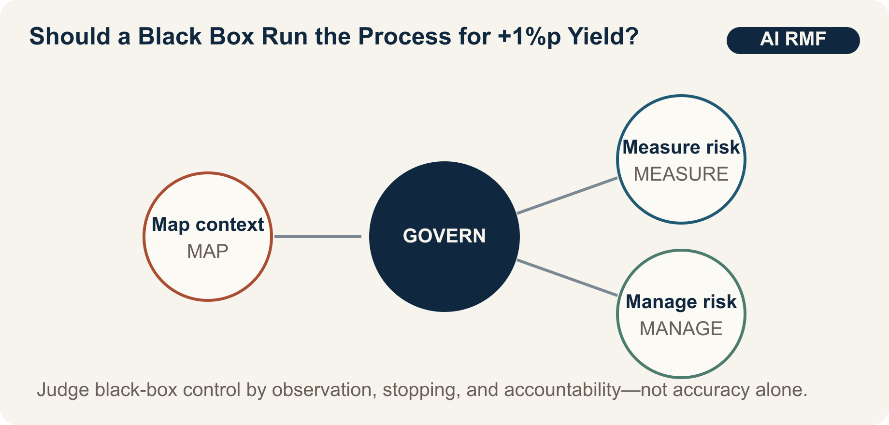

::: {.book-question}
[Today's Chaekmun]{.book-question-label}

{.book-question-image width=30mm fig-alt="An ink-wash semiconductor wafer poised between a black ink mark and process-control lines"}

[Should an AI be allowed to operate a process autonomously if it raises yield by 1 percentage point but cannot explain why?]{.book-question-prompt}
:::

The Joseon chaekmun—an examination question through which the king asked candidates to reason through an urgent problem of state^[The passage linked to this chapter comes from King Myeongjong's 1558 chaekmun, “The Way of Heaven and Human Governance”: “天道難知亦難言也。日月麗乎天，一晝一夜，有遲有速者，孰使之然歟?” It asks whether observing a visible regularity entitles us to claim too quickly that we know its cause. It was not a contemporary question about process AI; the connection between phenomenon, cause, and responsibility is a modern one. The [individual chaekmun and commentary](https://waterfirst.github.io/Joseon-Dynasty-Civil-Service-Examination/#myeongjong-1558/0) and the [Academy of Korean Studies' Annals Wiki entry on “Cheondochek”](https://dh.aks.ac.kr/sillokwiki/index.php/%EC%B2%9C%EB%8F%84%EC%B1%85%28%E5%A4%A9%E9%81%93%E7%AD%96%29) caution against confidently asserting principles that are difficult to know.]—asks us to distinguish an AI's improved average yield from evidence that it will operate safely on an unfamiliar product.

## Why This Question Matters Now

Hundreds of interacting variables and equipment states make it difficult for people to explain every semiconductor-process interaction. AI may improve recipe adjustment and anomaly detection. But when the data distribution changes after a product transition, sensor replacement, or equipment maintenance, yesterday's optimization can create today's defects. A junior validation engineer must move beyond the abstraction of “explainability” and design the conditions that stop operation and determine who receives the handoff.

The NIST AI Risk Management Framework organizes risk management around four functions: GOVERN, MAP, MEASURE, and MANAGE. GOVERN is a cross-cutting function that permeates the others. It calls for defined roles and responsibilities, policies, organizational culture, and continuing review. The essence of autonomous process control is not a statement that a human is sitting in front of a screen. It is a structure in which independent observations and execution logs allow a person to report, stop, and reverse an actual anomaly.

## Data Lens

{fig-alt="Decision structure for validating process AI through an iterative cycle of GOVERN, MAP, MEASURE, and MANAGE"}

### Evidence Table

| Evidence | Scope in the Source | Operational Meaning |
|---:|---|---|
| 1 | NIST AI RMF 1.0 organizes the core of risk management into four functions: GOVERN, MAP, MEASURE, and MANAGE. | Do not decide deployment on yield alone; consider roles, context, measurement, and response together. |
| 2 | GOVERN is a cross-cutting function that permeates MAP, MEASURE, and MANAGE. | Define the accountable operator, change approval, authority to stop, and record retention alongside model performance. |
| 3 | In 2026, NIST released a concept paper for an AI RMF profile on trustworthy AI in critical infrastructure. | Treat process AI across the full life cycle of equipment availability, safety, and supply chains, not only by laboratory accuracy. |

### How to Read These Numbers

The public evidence in this chapter does not provide a single “safety score.” The four functions form an iterative structure, not a certification checklist completed once in sequence. GOVERN does not eliminate risk, and MEASURE does not mean average yield alone. Measure false positives and false negatives by product, operator-intervention rates, drift-detection time, and time to restore the previous recipe.

The scenario's 1-percentage-point yield gain and false-positive rates are therefore validation conditions, not industry averages. Percent and percentage point must also remain distinct. If the false-positive rate rises from 2% to 6%, it has increased by 4 percentage points and tripled.

## Opposing Answers

### Answer A — Performance-First Autonomous Operation

Waiting for a complete causal explanation can forfeit a validated improvement in a complex process. If independent offline testing and a limited pilot show performance more stable than human control, autonomous operation can begin with low-risk, recoverable product families. Scope limits and real-time monitoring can compensate for gaps in explanation.

### Answer B — Explanation and Recovery First

An average yield improvement of 1 percentage point can conceal rising false positives after a product transition or rare, severe losses. Without understanding causes, it is harder to reproduce failures after equipment maintenance or recipe changes, and easier to hide responsibility behind the model. Until diagnosis and safe rollback are validated, AI should recommend actions and a human should execute them.

### Answer C — Limited Operation by Product Family

Do not reduce autonomous operation to two boxes labeled “explainable” and “unexplainable.” Define operating envelopes by product family, dual observation paths, operator stop authority, drift alarms, and time to restore the previous recipe. If false positives, false negatives, or recovery time breach a threshold, downgrade immediately to recommendation mode and resume autonomous operation only after independent validation.

## AI Research Design

### Prompt for the AI

> Using NIST AI RMF 1.0 and the 2026 concept paper for a critical-infrastructure profile, design a validation plan for autonomous semiconductor-process operation. For each of GOVERN, MAP, MEASURE, and MANAGE, tabulate the accountable party, required data, test, stopping condition, and evidentiary log. In addition to average yield, require false-positive and false-negative rates by product, operator-intervention rate, distribution-shift detection time, and safe-rollback time. Separate claims by the model-development team from independent validation results. Cite each source with the NIST document title, year, section, and direct URL. Put equipment failure modes and data gaps unknown to the AI in separate columns.

### Data Acquisition

| Order | Evidence | Fields to Verify |
|---:|---|---|
| 1 | NIST AI RMF and Playbook | Definition by function, life cycle, independent review, risk prioritization |
| 2 | Process history and model versions | Product, equipment, recipe and sensor version, training period, deployment point |
| 3 | Shadow operation and limited pilot | Differences from human decisions, false positives and false negatives, yield, reason for intervention |
| 4 | Incident and recovery logs | Detection time, stop time, restoration of previous recipe, lost wafers |

### Evidence Assessment

1. Separate training lots from test lots and evaluate product-transition periods independently.
2. Examine distributions by product to determine whether an average improvement conceals losses in a specific product.
3. Verify that execution logs fully connect model recommendations to commands actually issued to equipment.
4. Use a live drill to verify that an operator can stop the system without retaliation.
5. Require joint process, quality, and safety signatures for restart, rather than approval by the development team.

### Core Issues for Debate

- How much harm and recoverability can be tolerated when explanation remains incomplete?
- Which takes precedence as a stop signal: average yield or false positives in the worst-performing product family?
- What logs and response times—not merely the presence of a button—prove that a human is “in the loop”?

## Case Discussion

You are a junior engineer on a process-AI validation team. In a limited pilot, average yield rose by 1 percentage point, but false positives increased from 2% to 6% after a product transition. The average time from anomaly detection to human intervention is 18 minutes; restoring the previous recipe takes 25 minutes. **Every number in this section is a hypothetical condition for discussion, not an actual fab result.**

1. Recommend one of three options: continue autonomous operation, permit it only for existing product families, or stop it entirely.
2. Decide whether to downgrade new products to recommendation mode and reclassify false positives by cause.
3. Set a stopping threshold and the number of consecutive validation lots required for restart.
4. Assign stop and restart authority among operators, developers, and the process owner.
5. Write the procedure for returning to the previous model when safety or quality losses exceed the yield benefit.

## Sample 90-Second Answer

“I choose **Answer C: allow autonomous operation only for existing product families and downgrade new products to recommendation mode.** NIST AI RMF calls for four functions—GOVERN, MAP, MEASURE, and MANAGE—and makes GOVERN the accountability structure across them. That is why higher average yield alone cannot authorize autonomous operation. The 1-percentage-point yield gain, increase in false positives from 2% to 6%, 18-minute intervention time, and 25-minute rollback time in this case are all assumptions. I accept the objection that waiting for a complete explanation in a complex process can forfeit an improvement. Just as Yi I distinguished observed phenomena from the principles behind them, I would validate average performance separately from the failure conditions that follow a product transition.^[This is a modern paraphrase of Yi I's (李珥) “Cheondochek,” the winning response in the first stage of a special civil-service examination in 1558. His answer distinguishes changing *gi* (氣) from the underlying principle, *li* (理), while arguing that real-world abuses must still be corrected. See the [individual entry in the Joseon Dynasty Chaekmun Archive](https://waterfirst.github.io/Joseon-Dynasty-Civil-Service-Examination/#myeongjong-1558/0) and the [Academy of Korean Studies' Annals Wiki entry on “Cheondochek”](https://dh.aks.ac.kr/sillokwiki/index.php/%EC%B2%9C%EB%8F%84%EC%B1%85%28%E5%A4%A9%E9%81%93%E7%AD%96%29).] I would give operators immediate stop authority and independently validate drift alarms and rollback drills. I would expand autonomous operation to new products once their false-positive rate returns to roughly 2%; if it approaches 6% again or recovery time grows, I would move existing products to manual mode as well. I would also protect anyone who requests a stop from retaliation. Human control must be demonstrated by actual stop-and-recovery logs, not by an approval stamp.”

## Follow-Up Questions

- How would you compare a 1-percentage-point yield gain and a 4-percentage-point rise in false positives in the same cost unit?
- If performance deteriorates only after a product transition, what would you check first in the training data?
- Is a model safer merely because it explains itself well, even if its performance is lower?
- How would you measure organizational pressure that prevents an operator from pressing the stop button?
- If the independent validation team relies on the same data, is it sufficiently independent?
- What conditions would move your conditional position to full autonomous operation?

## Sources

- [U.S. National Institute of Standards and Technology, *Artificial Intelligence Risk Management Framework (AI RMF 1.0)* (2023)](https://nvlpubs.nist.gov/nistpubs/ai/nist.ai.100-1.pdf)
- [NIST AI Resource Center, *AI RMF Core* (2023; accessed 2026)](https://airc.nist.gov/airmf-resources/airmf/5-sec-core/)
- [NIST, *Concept Note: AI RMF Profile on Trustworthy AI in Critical Infrastructure* (2026)](https://www.nist.gov/programs-projects/concept-note-ai-rmf-profile-trustworthy-ai-critical-infrastructure)
- [Joseon Dynasty Chaekmun Archive, King Myeongjong's “The Way of Heaven and Human Governance”](https://waterfirst.github.io/Joseon-Dynasty-Civil-Service-Examination/#myeongjong-1558/0)

> **Data note:** NIST's four functions are grounded in public documents. The yield, false-positive, intervention, and recovery figures are assumptions created for the scenario.
