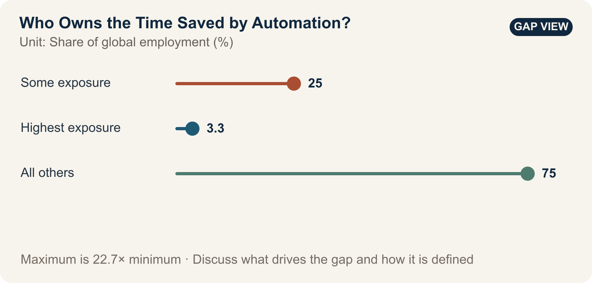

::: {.book-question}
[Today’s Chaekmun]{.book-question-label}

{.book-question-image width=30mm fig-alt="A minimalist ink-wash painting of time flowing between a human hand and the gears of automation"}

[If AI raises productivity by 20%, how should the company, the team, and employees share the resulting gains and reduction in working time?]{.book-question-prompt}
:::

The Joseon chaekmun—a royal policy examination question—^[The original passage most closely related to this chapter comes from the Myeongjong-era chaekmun “Where Should Education Go?”: “敎所以成材也。其本末次第與作人之方何如？” It asks, “Education is what develops capable people; what should be the order of its foundations and particulars, and what methods should be used to form people?” The original did not directly address automation or corporate allocation. This chapter interprets it in relation to preparing people whose work has been reduced for their next role. See the [individual chaekmun and commentary](https://waterfirst.github.io/Joseon-Dynasty-Civil-Service-Examination/#myeongjong-1558-education/0).] treats education not simply as the transfer of knowledge, but as the work of developing people and roles. The gains from automation should likewise be judged by whether they merely reduce the remaining workforce or create new skills.

## Why This Question Matters Now

The ILO estimates that one in four workers worldwide is in an occupation with some degree of exposure to generative AI. Exposure, however, is not a layoff rate. If the likelihood that some tasks will change is read as the percentage of entire jobs that will disappear, both automation investment and workforce planning become distorted. The company supplied the capital for equipment and models; employees supplied process data, exception-handling knowledge, and shop-floor expertise. If the productivity gain has shared origins, its allocation rules should be set before implementation rather than bargained over afterward.

Because the ILO sees job transformation as more likely than wholesale replacement, a new employee’s practical question should be more specific than “Will AI eliminate jobs?” Before automation is introduced, the company should decide who owns the time it saves and who will pay for the paid learning time and on-the-job mentoring needed to move people into new roles.

## Data Lens

{fig-alt="A chart comparing occupations with some exposure to generative AI, at 25% of global employment; the highest-exposure category, at 3.3%; and all other employment, at 75%"}

### Evidence Table

| Evidence | Figure or range in the primary source | Significance for the debate |
|---:|---|---|
| 1 | The ILO estimates that 25% of workers worldwide—one in four—are in occupations with some degree of exposure to generative AI. | Because task change is likely to be widespread, each role needs a transition plan. |
| 2 | The highest-exposure category accounts for 3.3% of global employment. | Claiming that “all 25% of exposed workers will be replaced” wrongly conflates distinct categories. |
| 3 | The ILO judges job transformation to be more likely than wholesale replacement. | Performance measures should extend beyond headcount reductions to changes in tasks, pay, working time, and redeployment. |

### How to Read These Numbers

The 25% figure is the share of employment in occupations that include tasks generative AI can perform—not the share of jobs that will disappear. The 3.3% figure is also not an observed layoff rate; it is the employment share in the highest-exposure category. Exposure also varies by country, gender, and occupational structure. These figures cannot be converted directly into a company’s workforce-reduction target.

Inside the company, compare labor hours, errors, rework, and output before and after automation for the same product under the same quality standard. Also examine whether the saved hours reduced overtime or were absorbed only through headcount cuts, and whether paid training led to actual placement while preserving employment and pay.

## Competing Answers

### Answer A — Reinvestment First

Because the company bore the development cost and the risk of failure, a substantial share of the productivity gain should be reinvested in equipment upgrades and R&D. Distributing all gains immediately through shorter hours and bonuses could reduce the capacity for the next round of automation. Reinvestment that protects long-term employment is also a benefit returned to employees.

### Answer B — Return the Gains to Labor

AI works because shop-floor employees supplied data and exception-handling knowledge. If the company cuts headcount, increases workloads, and monopolizes the productivity gain, trust and the transfer of expertise will break down. Part of the verified net gain should fund shorter working hours, bonuses, and paid retraining.

### Answer C — Agree on an Allocation Formula in Advance

Settle the allocation formula before automation begins. Count only net productivity gains achieved while maintaining quality and safety, then divide them among reinvestment, team rewards, paid training, and shorter hours. If post-training placement and retention rates fall below their targets, improve training and job design before making additional workforce cuts.

## AI Research Design

### Prompt for the AI

> Consult the original 2025 ILO report *Generative AI and Jobs: A Refined Global Index of Occupational Exposure* and distinguish its definitions of exposure, highest exposure, replacement, and job transformation. Build before-and-after task lists for semiconductor production roles, comparing output, quality, rework, labor hours, pay, headcount, paid training hours, and redeployment rates over the same period and product family. Present an allocation table for productivity gains that distinguishes the company’s capital investment from employees’ contributions of data and expertise. Put verified facts, company assumptions, worker views, and analyst inferences in separate columns. Attach the unit, period, role scope, and direct URL to every figure.

### Data Acquisition

| Step | Source | What to verify |
|---:|---|---|
| 1 | ILO report and methodology | Definition of exposure, occupation and task units, highest exposure, and limits of interpretation |
| 2 | Process MES and quality records | Hourly output, defects, rework, and downtime for the same product |
| 3 | HR, payroll, and work records | Headcount, pay, overtime, attrition, and redeployment by role |
| 4 | Training and placement records | Whether training was paid, training hours, and actual placement and retention rather than completion alone |

### Evaluating the Information

1. Remove the effects of product mix and demand growth from any increase in output.
2. Fix the denominator: determine whether the reported 20% productivity gain is per person, per hour, or per piece of equipment.
3. Look beyond training completion to placement, post-placement pay, and continued employment.
4. Deduct the cost of any increase in errors or safety incidents from the productivity gain.
5. Do not rely on an average of employee views; examine the distribution by role, shift, and tenure.

### Core Questions for Debate

- By what standard should the company distinguish recovery of its automation investment from employees’ contributions of data and expertise?
- If saved time is filled with new tasks, can the productivity gain be said to have been returned to employees?
- Should retraining be judged by completion, placement, or preservation of pay?

## Case Discussion

You are a new employee on the production innovation team. After automation, hourly productivity rose 20%, but headcount in one role fell 30%, and only 55% of retrained employees were placed in other roles. The company must allocate the next year’s net productivity gain among equipment reinvestment, bonuses, a four-hour reduction in the workweek, and paid training. **All figures are hypothetical conditions for discussion and are not data from an actual company.**

1. Ask for the net gain to be recalculated after deducting quality losses, rework, and depreciation.
2. Propose an allocation among the four categories and explain your rationale.
3. Decide whether to maintain the 30% headcount reduction or pause further cuts during retraining.
4. Specify changes to roles, mentors, and paid learning time that would raise the 55% placement rate.
5. Define the reversal conditions that would reopen the allocation formula after six months.

## Sample 90-Second Response

“I choose **Answer C: divide productivity gains between the company and employees according to criteria agreed in advance.** The ILO estimates that 25% of workers worldwide are in occupations with some degree of exposure to generative AI, but the highest-exposure category accounts for 3.3%, and job transformation is more likely than wholesale replacement. Exposure rates must not be read as layoff rates. The case figures—a 20% productivity increase, a 30% headcount reduction, and a 55% post-training placement rate—are all hypothetical. I accept the counterargument that the company must recover its investment if it is to fund the next round of automation. But if the allocation excludes the shop floor’s contributions of data and expertise, the next transition will fail. I would divide the net gain after quality and rework costs as follows: 40% for equipment reinvestment, 25% for paid training, 20% for bonuses, and 15% for a four-hour reduction in the workweek. These proportions are also for discussion only. If placement remains below 70%, I would pause further workforce cuts and increase the training share. If placement and pay retention are confirmed, I would raise the reinvestment share. I would publish the results quarterly. Automation should be judged not by how many positions it eliminates, but by how many people move into safer, more skilled roles.”

## Follow-Up Questions

- How would your allocation change depending on whether the 20% productivity gain is per hour or per person?
- Should bonuses be paid before the automation development cost has been recovered?
- If workload intensity rises after a four-hour reduction in the workweek, has time truly been returned to employees?
- How should employees and the company share responsibility for a 55% retraining placement rate?
- If automation removes a new hire’s repetitive work, what should replace that rung on the skills ladder?
- Under what conditions would you reduce the employee share and increase equipment reinvestment?

## Sources

- [International Labour Organization, *Generative AI and Jobs: A Refined Global Index of Occupational Exposure*, Working Paper 140 (2025)](https://www.ilo.org/publications/generative-ai-and-jobs-refined-global-index-occupational-exposure)
- [International Labour Organization, *Generative AI and Jobs: A 2025 Update* (2025)](https://www.ilo.org/publications/generative-ai-and-jobs-2025-update)
- [Joseon Dynasty Chaekmun Archive, Myeongjong-era “Where Should Education Go?”](https://waterfirst.github.io/Joseon-Dynasty-Civil-Service-Examination/#myeongjong-1558-education/0)

> **Data note:** The 25% and 3.3% figures are ILO estimates of occupational exposure. The productivity, workforce-reduction, placement, and allocation figures are either hypothetical case conditions or proposed values.
