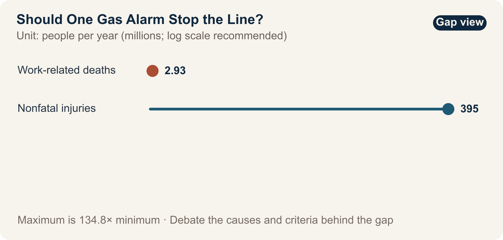

::: {.book-question}
[Today's Chaekmun]{.book-question-label}

{.book-question-image width=30mm fig-alt="A minimalist ink-wash semiconductor fab with a faint trace of gas and a stop symbol"}

[Should a junior engineer request a line shutdown based solely on an unconfirmed gas-leak alarm, even if delivery will be delayed by two days?]{.book-question-prompt}
:::

The Joseon chaekmun—an examination question through which the king asked candidates to reason through an urgent problem of state^[The passage linked to this chapter comes from King Gwanghaegun's 1611 chaekmun, “The Most Urgent Task after the Imjin War”: “今之國事，何者最急？用人、賦役、田政、戶籍，孰先孰後?” It asks, “What is most urgent in the affairs of state today? Of appointing capable people, managing corvée labor, administering land, and maintaining household registers, which should come first and which later?” It is not an old statement about gas alarms translated into modern language. This chapter instead connects it to the judgment required to identify an irreversible danger when several losses compete for priority. See the [individual chaekmun and commentary](https://waterfirst.github.io/Joseon-Dynasty-Civil-Service-Examination/#gwanghae-1611/0) and the [Academy of Korean Studies record of the 1611 examination](https://dh.aks.ac.kr/~sonamu5/wiki/index.php/%EA%B4%91%ED%95%B4%28%E5%85%89%E6%B5%B7%29_3%EB%85%84%281611%29_%EC%8B%A0%ED%95%B4%28%E8%BE%9B%E4%BA%A5%29_%EB%B3%84%EC%8B%9C%28%E5%88%A5%E8%A9%A6%29).]—shows that setting priorities requires considering both the nature of the harm and whether it can be reversed. In a fab, a delivery delay can be recovered; loss of life or health from hazardous-gas exposure cannot.

## Why This Question Matters Now

Semiconductor fabs use toxic, flammable, and corrosive substances while operating continuously for long periods. Stopping the entire line for every alarm raises the cost of false positives and creates alarm fatigue. Waiting for confirmation when a leak is real, however, sacrifices evacuation time. Junior staff in particular may overstate production losses and discount their own sensor interpretation. The answer is not simply to demand courage, but to define shutdown stages and reporting lines in advance.

The ILO estimates that work-related factors cause 2.93 million deaths and 395 million nonfatal occupational injuries each year. These global totals show why prevention matters; they do not tell us whether one alarm in a particular fab indicates a real leak. An operational decision requires the substance's toxicity, concentration, alarm duration, agreement between independent sensors, ventilation and evacuation time, and the sensor's recent failure history.

## Data Lens

{fig-alt="Safety data comparing 2.93 million annual work-related deaths with 395 million nonfatal occupational injuries"}

### Evidence Table

| Evidence | Figure or Scope in the Source | Meaning for Fab Safety Decisions |
|---:|---|---|
| 1 | The ILO estimates that work-related accidents and diseases cause 2.93 million deaths each year. | Safety losses include irreversible harm that is difficult to express as an average delivery cost. |
| 2 | Nonfatal occupational injuries are estimated at 395 million per year. | Counting deaths alone misses treatment, lost work, and long-term health effects. |
| 3 | ILO data attribute about 63% of worldwide work-related deaths to Asia and the Pacific. | A regional total shaped by workforce size and industrial structure must not be used as the risk probability for one factory. |

### How to Read These Numbers

The 2.93 million figure is a global estimate combining work-related **accidents and diseases**, not the number of fab gas incidents in one year. The 395 million figure counts injuries and may not equal the number of individual people injured. Nor is the 63% regional share causal evidence that Asian factories are inherently more dangerous; it reflects the distribution of workers and industries.

These numbers do not command, “Shut down the entire line for every alarm.” They provide the background for keeping the harm from a missed detection in the decision table. Site criteria must separately define exposure limits for each gas, sensor reliability, agreement among alarms, available evacuation time, and the effectiveness of partial isolation.

## Opposing Answers

### Answer A — Immediate Full Shutdown

Because a single missed detection of hazardous gas can cause irreversible harm, even one alarm reported by a junior employee should first move the system to a safe state. The cost of stopping and then using an independent measurement to identify a false alarm is bounded; the cost of missing actual exposure may not be. The reporting employee must face no retaliation if alarms are to retain their protective function.

### Answer B — Verify the False Alarm First

In a process with repeated sensor false alarms, stopping the entire line for every short, isolated signal can damage delivery performance and equipment stability and may teach employees to ignore alarms. A procedure is needed for partial shutdown and remeasurement based on the material's hazard and the status of adjacent sensors and ventilation.

### Answer C — Isolate the Zone and Escalate in Stages

Define automatic actions by toxicity, concentration, duration, and agreement between two sensors. If lethality is high or little evacuation time is available, even a single alarm triggers a full shutdown. When the event can be localized, evacuate and isolate the zone before taking an independent measurement. A safety officer, not the production organization, authorizes restart.

## AI Research Design

### Prompt for the AI

> Review the ILO's primary occupational-safety sources separately from the site's approved gas-safety procedures. For global work-related deaths, nonfatal injuries, and the Asia-Pacific share, record the issuing organization, baseline year, estimate range, unit, and direct URL. Then tabulate the safety data sheet for the gas, sensor calibration records, recent alarm and false-positive history, ventilation zones, evacuation time, and safe-equipment-shutdown procedure. Do not allow AI to decide independently whether to stop the line; distinguish statutory thresholds from internal company thresholds. Put established facts, sensor observations, worker statements, and inferences in separate columns, and label missing information “unverified.”

### Data Acquisition

| Order | Evidence | What to Verify |
|---:|---|---|
| 1 | Site emergency-response procedure and safety data sheet | Hazard by substance; automatic-shutdown threshold; evacuation and first aid |
| 2 | Raw sensor logs and calibration records | Time, concentration, duration, adjacent sensors, calibration expiry |
| 3 | Equipment and ventilation drawings and worker locations | Isolatable zones, airflow, evacuation route, people remaining |
| 4 | Alarm, shutdown, and restart history | Cause of false alarm, downtime, approver, recurrence |

### Evidence Assessment

1. Use raw logs to distinguish a communication fault from an actual sensor measurement.
2. Determine whether normal adjacent sensors are truly exculpatory evidence, given airflow and detection limits.
3. Do not treat the harm of a missed detection and the cost of a false alarm as equal; reflect severity and reversibility.
4. Record any retaliation against a stop-work request or delay in reporting it.
5. Require all three conditions for restart: cause removed, independent measurement completed, and safety officer approval.

### Core Issues for Debate

- For which substances, concentrations, and evacuation conditions should a single sensor trigger an immediate full shutdown?
- Can a recent history of false alarms justify disregarding the present alarm?
- If production and safety teams disagree, who should hold final authority to restart the line?

## Case Discussion

You are a junior process engineer on the night shift. One sensor exceeds the gas threshold for 12 seconds while adjacent sensors remain normal. The same sensor produced two false alarms in the past month, and a full shutdown will delay customer delivery by two days. Three workers are in the affected zone. **The times, staffing, and delivery impact in this section are hypothetical conditions created for discussion.**

1. Choose among immediate evacuation and partial shutdown, full shutdown, or remeasurement while operating.
2. Explain the conditions under which normal readings from adjacent sensors would change your conclusion.
3. Set the sequence and timing for reporting to the safety team, facilities team, and production manager.
4. Decide who authorizes restart after portable independent detection and sensor calibration.
5. Propose record fields that protect the junior employee from retaliation even if the event proves to be a false alarm.

## Sample 90-Second Answer

“I choose **Answer A: evacuate the three workers immediately and request a full line shutdown**. The ILO estimates that work-related accidents and diseases cause 2.93 million deaths each year, but this global statistic does not establish whether the present alarm is genuine. The 12-second alarm, two recent false positives, normal adjacent sensors, and two-day delivery delay in this case are all assumptions. The objection that a false alarm is plausible and a full shutdown is costly is valid. But because the harm from missing hazardous gas in an occupied zone may be irreversible, I would use that information to decide when to restart—not to delay the first evacuation. Immediately after shutdown, I would begin portable independent detection, sensor calibration, and a ventilation check in parallel. I would restart only when the safety officer confirms all three of the following: two independent measurements are normal, the sensor-fault mechanism has been identified, and no one remains in the zone. If any condition is unmet, I would maintain the shutdown regardless of delivery. Even if the event proves to be a false alarm, I would record the request as appropriate to the information available at the time and protect the requester from retaliation.”

## Follow-Up Questions

- Why do worldwide fatality statistics fail to prove whether this sensor alarm is genuine?
- Under what conditions can a leak remain possible even when adjacent sensors read normal?
- How would your conclusion change if a partial shutdown would itself obstruct evacuation?
- When false alarms recur, should the site first raise the alarm threshold or replace the sensor?
- Which metric would show whether protection for employees who request a shutdown works in practice?
- What evidence would make you escalate immediately from a partial to a full shutdown?

## Sources

- [International Labour Organization, *Safety and Health at Work* (2023; accessed 2026)](https://www.ilo.org/topics-and-sectors/safety-and-health-work)
- [International Labour Organization, *Nearly 3 Million People Die of Work-Related Accidents and Diseases* (2023)](https://www.ilo.org/resource/news/nearly-3-million-people-die-work-related-accidents-and-diseases)
- [International Labour Organization, *Safety and Health at Work in Asia and the Pacific* (2022)](https://www.ilo.org/resource/safety-and-health-work-asia-and-pacific-0)
- [Joseon Dynasty Chaekmun Archive, King Gwanghaegun's “The Most Urgent Task after the Imjin War”](https://waterfirst.github.io/Joseon-Dynasty-Civil-Service-Examination/#gwanghae-1611/0)
- [Academy of Korean Studies, 1611 Examination Record](https://dh.aks.ac.kr/~sonamu5/wiki/index.php/%EA%B4%91%ED%95%B4%28%E5%85%89%E6%B5%B7%29_3%EB%85%84%281611%29_%EC%8B%A0%ED%95%B4%28%E8%BE%9B%E4%BA%A5%29_%EB%B3%84%EC%8B%9C%28%E5%88%A5%E8%A9%A6%29)

> **Data note:** The ILO figures are global estimates. The 12 seconds, two false alarms, two-day delivery delay, and three workers are scenario assumptions.
