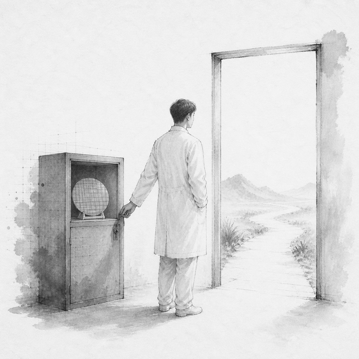
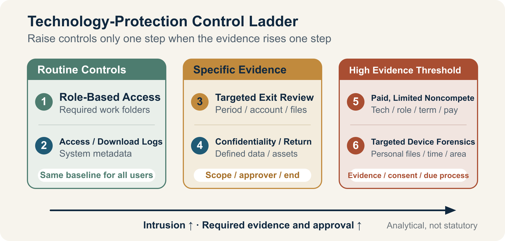

::: {.book-question}
[Today's Chaekmun]{.book-question-label}

{.book-question-image width=30mm fig-alt="An ink-wash engineer measuring the proper scope of protection between a locked technology vault and an open door to a new job"}

[How far should engineers' career moves be restricted and monitored to protect national core technologies?]{.book-question-prompt}
:::

The Joseon chaekmun—an examination question through which the king asked candidates to reason through an urgent problem of state^[The Chaekmun Archive condenses and reconstructs King Seonjo's 1568 special-examination question in Classical Chinese as **「禦外之道，戰與和而已。義、力、勢，何所先後？」** It asks, “When responding to an external threat, in what order should principle, capability, and circumstances be considered?” It is neither a literal transcription of the surviving examination text nor a translation of this chapter's modern question. The connection here is only the mode of reasoning: protection must be assessed through its purpose, actual capacity for control, and specific circumstances rather than by invoking principle alone. See the [individual entry in the Chaekmun Archive](https://waterfirst.github.io/Joseon-Dynasty-Civil-Service-Examination/#seonjo-1568/0) and the [KRpia bibliographic entry for *Park Se-dang's Chaekmun*](https://www.krpia.co.kr/product/detail?nodeId=NODE03961489&plctId=PLCT00004893).]—did not begin by choosing either war or peace. It asked what should be corrected first when principle, capability, and circumstances diverged. Technology protection presents the same problem. Even when the principle of “national security” is weighty, treating every departing employee as a suspect undermines the ability to compete for talent. Speaking only of “freedom of occupation,” while ignoring access privileges and evidence of removal, misses real leakage risks.

This chapter is not a test of personal loyalty. It distinguishes **the technology to protect, the evidence to verify, the measure to use, and the point at which that measure ends**. Nationality and the country of a new employer must not become proxies for risk; the same conduct must trigger the same procedure.

## Why This Question Matters Now

The Notice on the Designation of National Core Technologies, effective in October 2025, expanded and revised the list to 79 technologies across 13 fields. That does not mean 79 people or 79 companies should be monitored. It defines the **scope of technologies** subject to protection.

The Guidelines for the Protection of Industrial Technology, effective in June 2026, require organizations holding national core technologies to manage access rights, block and log unauthorized transfers, identify anomalous activity by employees preparing to leave, and manage the return of company assets. The Guidelines also provide reference forms for confidentiality and noncompete agreements. Nothing in them, however, grants a company a blanket right to copy the entire contents of a departing employee's personal phone and laptop as a matter of course.

The Special Act on National High-Tech Strategic Industries allows contracts with designated specialist personnel to include restrictions on joining the same type of industry overseas and the duration of those restrictions, prevention of confidential-information leakage, and the provision of post-employment information. The system depends on designation and contract; it is not an automatic ban on international travel or job changes for every semiconductor engineer. The government's introduction of a “Top-Tier Visa” in 2025 to recruit global talent in semiconductors, AI, and other fields also demonstrates that international talent mobility is a source of competitiveness.

Enforcement results show that the risk is real. The Korean National Police Agency announced that in 2025 it had apprehended 378 people in 179 technology-leakage cases, eight of which involved national core technologies. “Apprehension,” however, is not a final conviction, and the 179 cases do not establish an incidence rate that includes unreported cases. The figures support the need for protective controls; they do not justify presuming that a particular employee changing jobs is a criminal.

## Data Lens

{fig-alt="A technology-protection control ladder in which intrusiveness and the evidence required both rise from role-based access, work logs, targeted predeparture review, and confidentiality to compensated noncompetes and personal-device forensics"}

### Evidence

| Evidence | Fact Established in the Official Text | Proper Use in the Debate |
|---:|---|---|
| 1 | The Korean National Police Agency announced that in 2025 it apprehended 378 people in 179 technology-leakage cases, eight of which involved national core technologies. | This shows the scale of enforcement, not the crime rate, the number of final convictions, or the risk posed by every departing employee. |
| 2 | The October 2025 Notice expanded and revised the national core technology list to 79 technologies across 13 fields. | First determine whether a specific technology falls within the Notice; the object of protection is not a person's job title. |
| 3 | The 2026 Guidelines for the Protection of Industrial Technology require management of access rights and records of viewing, storage, and removal, as well as review of anomalous activity by employees preparing to leave and the return of company assets. | This supports baseline controls over company systems and company assets. It does not support a complete search of personal devices. |
| 4 | The Personal Information Protection Commission explains that work-network logs are personal information and must not be used for employee surveillance, but may be managed to verify access outside an employee's authority. | The answer is not “logs exist, so we can inspect anything,” but a targeted review with defined purpose, fields, and retention period. |
| 5 | In Supreme Court case 2009Da82244, the Court held that the validity of a noncompete agreement depends on a comprehensive assessment of the interest to be protected; the employee's predeparture position; duration, geography, and occupation; compensation; circumstances of departure; and public interest. | Separate confidentiality from a noncompete that restricts the occupation itself; the latter requires a narrow scope and compensation. |
| 6 | Article 15 of the Constitution guarantees freedom of occupation, while Article 3 of the Personal Information Protection Act requires the minimum information necessary for a stated purpose and minimal intrusion into private life. | The more intrusive the measure—such as copying an entire personal device—the stronger the need for a specific basis and consideration of less intrusive alternatives. |

### Distinguishing the Control Measures

The six levels in the illustration are not official statutory grades. They are an **intrusiveness ladder** constructed for this debate.

| Level | Measure | Scope Examined | Condition for Escalation |
|---:|---|---|---|
| 1 | Role-based access | Work-required folders in company repositories | Role change, excessive privilege, change in protection classification |
| 2 | Download and access logs | Company-system metadata such as time, account, filename, volume, and external-media connection | Access far outside the normal baseline combined with a business explanation that does not fit |
| 3 | Targeted predeparture review | Specific period, account, files, and company assets | A concrete connection between national-core-technology files and an unauthorized removal path |
| 4 | Confirmation of confidentiality, return, and deletion | Nonpublic information and company assets defined by contract | Missing returns, refusal to confirm deletion, or evidence of public disclosure |
| 5 | Compensated, limited noncompete | Specific technology, role, industry, and period | Designation and contract, protectable interest, reasonable scope, and compensation are all established |
| 6 | Targeted forensics on a personal device | Files, period, and area specified by agreement or lawful procedure | Concrete evidence supporting external copying or transmission and independent legal review |

### How to Read These Numbers

Do not interpret the eight national-core-technology cases among 179 cases as a “4.5% probability of national core technology leakage.” The two numbers describe different categories of cases in which apprehensions occurred in 2025; there is no denominator representing all companies or departing employees. Apprehensions must also be distinguished from final convictions.

An anomaly such as a 4.8 GB download is a starting point, not a conclusion. The same volume means different things depending on whether it was approved handover material, how many times it exceeded the employee's ordinary baseline, whether the files were actually written to external media, and whether a transfer succeeded. A gap in the logs proves neither “no leakage” nor “leakage.”

Noncompetition and confidentiality are different tools. Confidentiality prohibits using or disclosing defined information; a noncompete prohibits performing defined work for a period. If a narrower measure can protect the technology, the entire occupation should not be restricted first.

## Opposing Answers

### Answer A — Proactive Protection

Once a national core technology has been copied outside the organization, it is difficult to retrieve. Design drawings and process recipes fit on a small storage device, so litigation after departure may not reverse the harm. Organizations holding these technologies should therefore maintain role-based least privilege, removal approval, download and external-media logs, immediate withdrawal of high-risk privileges at departure, and return of company assets as ordinary controls.

Confidentiality alone may not suffice where designated specialist personnel handle genuinely irreplaceable, leading-edge technology. It may be reasonable to agree in advance on a noncompete tailored to a specific competing role and the useful life of the technology, with adequate compensation, and to seek a prompt court decision when evidence of breach appears. This position does not call for more surveillance. It calls for strengthening the company systems that can be controlled before harm occurs.

The scope of protection must not, however, be drafted broadly or imposed identically on every departing employee. Overbroad restrictions increase control costs and false positives. They can drive strong employees away from critical work and ultimately weaken the capacity to create the very technology being protected.

### Answer B — Protect Mobility and Privacy

An engineer's general experience, public knowledge, and problem-solving ability are not company files. Copying personal devices and banning employment throughout the same industry worldwide merely because someone changes jobs or joins a foreign company can unduly restrict occupational freedom and privacy. A country should also avoid the contradiction of recruiting foreign talent while immobilizing its own.

Security should protect the technology at its source instead of binding the person. Segmented repositories, least privilege, approved transfer channels, auditability of company devices, watermarks and hashes for important files, and confirmation of return and deletion at departure can reduce risk without looking deeply into private life. Without concrete evidence of transmission, the principle should be to reaffirm confidentiality duties while respecting the job change.

Ignoring log anomalies and external-media connections altogether in the name of privacy, however, would make it difficult for a company to perform legally required protective measures. Protecting legitimate mobility therefore requires a targeted review with a clearly defined scope and termination condition.

### Answer C — Risk-Based Conditional Controls

Control intensity should depend on four facts, not on the person's nationality or destination: **the technology's protection classification, the person's actual access privileges, conduct outside the ordinary baseline, and evidence supporting external transmission**. When all four are low, least privilege and the ordinary departure process are sufficient. If some are elevated, conduct a targeted review of company logs and company assets. Escalate to independent legal review, limited forensics, an injunction, or referral to investigators only when evidence of external copying or transmission becomes concrete.

Treat a noncompete as a separate, last-resort measure. Narrow it to roles that directly overlap the protected technology, its useful life, and the relevant industry, and pay compensation. The person under review must receive the basis for the review, an opportunity to respond, and a process for appealing to an independent reviewer. Delete investigation data when the purpose-specific retention period ends.

The core principle is not “inspect everything whenever there is suspicion,” but **raise the control by only one level when the evidence rises by one level**. If an approved handover explains the activity, return immediately to a lower level. If external transmission is verified, escalate under the same procedure regardless of the person's background.

## AI Research Design

### Prompt for the AI

> As of August 2026, investigate the case of an engineer at a Korean semiconductor company who handles national core technology and leaves for a similar role in Korea or abroad. Use as primary sources only the Act on Prevention of Divulgence and Protection of Industrial Technology, its Enforcement Decree, the Guidelines for the Protection of Industrial Technology, and the Notice on the Designation of National Core Technologies in the Korean Law Information Center; the Special Act on Strengthening and Protecting Competitiveness of National High-Tech Strategic Industries and its Enforcement Decree; Articles 3 and 15 of the Personal Information Protection Act; Supreme Court case 2009Da82244; the Personal Information Protection Commission's employment guidance; and the Korean National Police Agency's 2025 enforcement results on technology leakage. Classify access privileges, download logs, predeparture review, confidentiality, noncompetes, and inspection of personal devices as “mandatory,” “potentially permissible,” “contract required,” “court determination required,” or “no basis.” For every conclusion, attach the institution, document title, provision, effective, decision, or publication date, and direct URL. Do not confuse apprehension with conviction, a log anomaly with actual transmission, company assets with personal devices, or national core technology with general know-how. Conclude with a decision table that changes control intensity according to technology sensitivity, access privileges, evidence of anomalous conduct, and evidence of transmission.

### Data Acquisition

| Priority | Evidence | Required Fields |
|---:|---|---|
| 1 | Current statutes, notices, and guidelines in the Korean Law Information Center | Effective date, exact provision, covered party, language establishing duty versus discretion |
| 2 | Full Supreme Court judgment | Case number, decision date, factors governing a noncompete, outcome of the case |
| 3 | Personal Information Protection Commission guidance | Status of logs as personal information, permissible purpose, ban on out-of-purpose surveillance, data-minimization principle |
| 4 | Korean National Police Agency enforcement data | Baseline year, cases versus people, apprehension versus conviction, national-core-technology category |
| 5 | Internal company records | Protection classification, privilege matrix, approval records, logging scope and retention period, contracts and compensation |

### Evidence Assessment

1. **Classify the subject matter:** Verify that the file and process actually fall under the current Notice on national core technology or qualify as national high-tech strategic technology.
2. **Classify the authorization:** Separate authorization to view from authorization to download or remove.
3. **Classify the conduct:** Quantify departures from the ordinary baseline while checking alternative explanations such as handover, incident response, or copying for approved training.
4. **Classify the transmission:** Record external-media connection, file writing, email or cloud upload, and confirmation of receipt as different pieces of evidence.
5. **Classify the measure:** Determine whether a less intrusive measure achieves the same purpose and whether scope, duration, approver, deletion date, and appeal procedure are defined.
6. **Classify the conclusion:** Put “verified fact,” “reasonable inference,” “cannot be verified,” and “hypothetical scenario assumption” in separate fields.

### Core Issues for Debate

- Which specific file, process, and privilege does “protecting the technology” refer to?
- What additional evidence is needed between a log anomaly and actual copying or transmission?
- If reviewing company systems achieves the purpose, why inspect the entirety of a personal device?
- Who sets the role, duration, geography, and compensation of a noncompete, and by which criteria?
- When do the end of the investigation, deletion of data, and the person's response and appeal procedures take effect?

## Case Discussion

You are a first-year process-technology engineer at **Gaon Memory**, a fictional semiconductor company, and a junior member of a task force improving departure-security procedures. Every number below is a **hypothetical condition** created for discussion; none refers to an actual company or case.

A process-integration engineer with seven years of experience will leave in 14 days for an R&D role at a foreign company in the same industry. The engineer was authorized to view an advanced-process recipe that the company is assumed to manage as national core technology. There is no noncompete agreement supported by separate compensation; the employee signed only confidentiality and company-asset-return agreements.

Downloads during the seven days before notice of departure totaled 4.8 GB—16 times the 0.3 GB weekly median over the previous 90 days among employees in the same role. Of that total, however, 4.0 GB, or 83.3%, came from a handover folder approved by the team manager. The remaining 0.8 GB consisted of 12 files outside the handover list, three of which contained critical recipes. All were within the employee's viewing privileges, but removal had not been approved.

The logs also show that a personal external storage device was connected to the company laptop for 11 minutes. An error in the security agent means no record remains of whether any file was successfully written. The company wants to copy the entire contents of the employee's personal laptop and phone and impose a worldwide, industry-wide employment ban for 24 months. The departing employee agrees to return company assets, permit an audit of company accounts, and allow an independent forensic firm to compare hashes for the 12 disputed files, but refuses a complete copy of personal devices.

Choose one of the following:

1. Because most downloads were approved handover material, proceed only with the ordinary departure process.
2. Revoke access to core technology immediately; conduct a targeted review limited to company logs, company assets, and the 12 files; and propose a narrow, compensated noncompete.
3. Seize the entirety of the personal devices and immediately pursue a 24-month blanket noncompete and referral to investigators.

After choosing, specify the scope of the review, the employee's opportunity to respond, the role, duration, and compensation covered by a noncompete, the conditions for escalation and release, and the deletion date for investigation data.

## Sample 90-Second Answer

“I choose **Answer B: respect the freedom to change jobs while reviewing only verified risks**. The Korean National Police Agency announced that in 2025 it apprehended 378 people in 179 technology-leakage cases, eight of which involved national core technologies. That is a serious risk, but not a basis for suspecting everyone who changes jobs. The 4.8 GB download, 16-times-normal volume, three critical recipes outside the handover list, and 24-month employment ban in this case are all assumptions. The counterargument is important: 83.3% of the material was approved, and connecting an external device does not prove intent to leak. I would first preserve the access records and company logs, then have an independent reviewer compare only the hashes of the 12 disputed files and give the employee an opportunity to explain. I would not copy the entirety of any personal device. I would propose a nine-month noncompete covering only roles that directly overlap the technology, with compensation equal to 80% of base salary. Verified external transmission would trigger legal action; confirmation that the activity was approved work would end the restriction and require deletion of investigation data. Protecting technology cannot turn a legitimate job change into a crime.”

## Follow-Up Questions

- Even if the 4.8 GB total is 16 times the normal baseline, what additional metric would you examine given that 83.3% was approved material?
- When the external-device write log is missing, should the record say “no leakage” or “cannot be verified”?
- If the departing employee also refuses a hash comparison of the 12 files, what additional evidence would cause you to seek a court order?
- How would you calculate whether the hypothetical nine-month restriction and compensation equal to 80% of base salary are excessive or insufficient?
- How would you explain any difference between joining a domestic competitor and a foreign company in the same industry in terms of technical risk and legal authority?
- If the investigation ends with evidence supporting innocence, who must verify deletion of logs and forensic data, and when?

## Sources

- [Korean National Police Agency, “2025 Technology-Leakage Enforcement Results at a Glance” (2026)](https://www.police.go.kr/user/bbs/BD_selectBbs.do?q_bbsCode=1007&q_bbscttSn=20260130144015448)
- [Ministry of Trade, Industry and Energy, *Notice on the Designation of National Core Technologies*, Notice No. 2025-2 (2025)](https://www.law.go.kr/LSW/admRulLsInfoP.do?admRulId=25045&efYd=0)
- [Ministry of Trade, Industry and Energy, Reasons for Enactment and Amendment of the *Notice on the Designation of National Core Technologies*: 79 Technologies in 13 Fields (2025)](https://www.law.go.kr/admRulInfoP.do?admRulSeq=2100000272798&chrClsCd=010202&urlMode=admRulRvsInfoR)
- [Ministry of Trade, Industry and Energy, *Guidelines for the Protection of Industrial Technology*, Notice No. 2026-76 (2026)](https://www.law.go.kr/admRulLsInfoP.do?admRulSeq=2100000281960)
- [Korean Law Information Center, *Act on Prevention of Divulgence and Protection of Industrial Technology* (version effective 2026)](https://www.law.go.kr/LSW/lsInfoP.do?ancYnChk=0&chrClsCd=010202&efYd=20260603&lsiSeq=280043&urlMode=lsInfoP)
- [Korean Law Information Center, Article 14 of the *Enforcement Decree of the Industrial Technology Protection Act*: Measures to Protect National Core Technologies (2026)](https://www.law.go.kr/LSW/lsLinkCommonInfo.do?lspttninfSeq=113438)
- [Korean Law Information Center, *Special Act on Strengthening and Protecting Competitiveness of National High-Tech Strategic Industries* (version effective 2026)](https://www.law.go.kr/LSW/lsInfoP.do?ancYnChk=0&chrClsCd=010202&efYd=20260602&lsiSeq=286519&urlMode=lsInfoP)
- [Korean Law Information Center, Article 24 of the *Enforcement Decree of the National High-Tech Strategic Industries Act*: Application for Designation of Specialist Personnel (2026)](https://www.law.go.kr/LSW/lsInfoP.do?ancYnChk=0&chrClsCd=010202&efYd=20260201&lsiSeq=282935&urlMode=lsInfoP)
- [Personal Information Protection Commission, Q&A in the *Personal Information Protection Guidelines for Employment and Labor* (2023)](https://pipc.go.kr/np/cop/bbs/selectBoardArticle.do?bbsId=BS212&mCode=C040030000&nttId=8636)
- [Korean Law Information Center, Article 3 of the *Personal Information Protection Act*: Principles for Protecting Personal Information (version effective 2025)](https://www.law.go.kr/LSW/lsLawLinkInfo.do?chrClsCd=010202&lsJoLnkSeq=900072509)
- [Korean Law Information Center, Article 15 of the *Personal Information Protection Act*: Collection and Use of Personal Information (version effective 2025)](https://www.law.go.kr/LSW/lsLinkCommonInfo.do?chrClsCd=010202&lsJoLnkSeq=1029334745)
- [Korean Law Information Center, Articles 15 and 17 of the *Constitution of the Republic of Korea* (version effective 1988)](https://www.law.go.kr/lsLinkCommonInfo.do?chrClsCd=010202&lsJoLnkSeq=1026032837)
- [Supreme Court of Korea, Decision 2009Da82244, March 11, 2010](https://law.go.kr/precInfoP.do?precSeq=215665)
- [Korea Policy Briefing, Introduction of the “Top-Tier Visa” for Global Talent in Semiconductors, AI, and Other Fields (2025)](https://www.korea.kr/news/policyNewsView.do?newsId=148940244)
- [Joseon Dynasty Chaekmun Archive, King Seonjo's Special-Examination Chaekmun (accessed 2026)](https://waterfirst.github.io/Joseon-Dynasty-Civil-Service-Examination/#seonjo-1568/0)
- [KRpia, Bibliographic Entry for *Park Se-dang's Chaekmun* (accessed 2026)](https://www.krpia.co.kr/product/detail?nodeId=NODE03961489&plctId=PLCT00004893)

> **Data note:** The legal analysis uses the versions in force in the Korean Law Information Center as of August 20, 2026. The police figures describe enforcement outcomes. The company name, positions, data volumes, periods, ratios, and compensation rate in the case are all hypothetical. The control ladder in the illustration is an analytical framework that orders several official measures by intrusiveness; it is not a statutory classification. An actual investigation, noncompete, or forensic examination should not be decided solely under internal company rules, but must receive case-specific legal review by specialists in privacy, labor, and trade-secret law.
