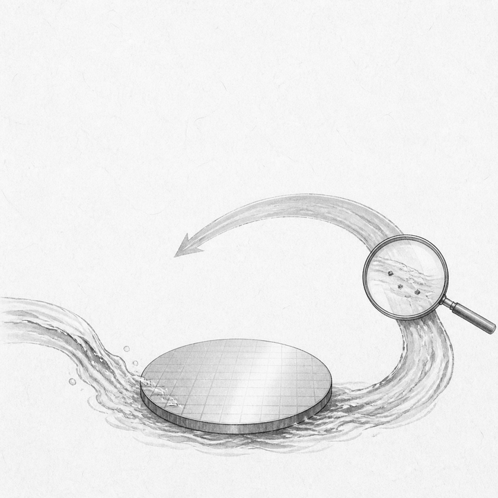
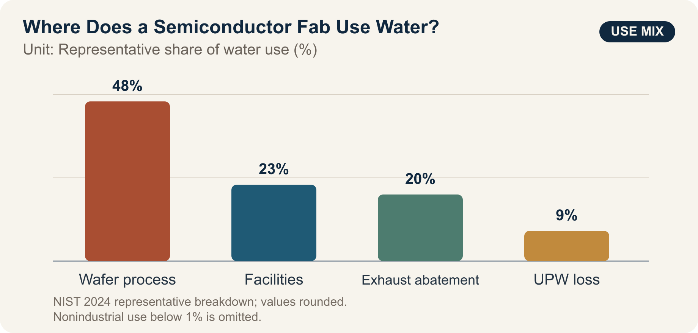

::: {.book-question}
[Today’s Chaekmun]{.book-question-label}

{.book-question-image width=30mm fig-alt="An ink-wash painting of clear water washing a wafer and returning through a reuse loop, with a magnifying glass examining trace contamination"}

[How much trace contamination and yield risk should an AI semiconductor fab accept as it increases ultrapure water reuse?]{.book-question-prompt}
:::

Jeongjo’s 1798 chaekmun on the Honam region^[The historical chaekmun ([策問]{.hanja}) connected to this chapter asked for measures that would sustain both Honam’s resources and the lives of its people. The opening passage preceding the transmitted response reads “[王若曰，湖南一路卽我朝興王之地也。]{.hanja},” or “The king says: the province of Honam is the land where our dynasty arose.” Today’s question is not a translation that transposes the regional policy of that era into a semiconductor plant. It borrows the underlying problem structure: when the benefits of production and the burdens of resources fall in different places, examine not only the total amount but also the distribution of the burden. See the [individual entry in the Joseon Dynasty Chaekmun Archive](https://waterfirst.github.io/Joseon-Dynasty-Civil-Service-Examination/#jeongjo-1798/0).] does not equate abundant resources with improvements in residents’ lives. Even if a fab reuses a great deal of water, its achievement may be overstated unless withdrawal volume, dry-season burdens, effluent quality, and yield risk are measured separately.

## Why This Question Matters Now

Advanced logic and memory processes repeatedly wash particles, ions, and organic matter from wafer surfaces. Converting conventional water into ultrapure water (UPW), then recovering it after use, involves reverse osmosis, ion exchange, ultraviolet oxidation, degassing, and precision filtration. A higher reuse rate can reduce new withdrawals and discharge, but if contaminants become concentrated in the recovered water or monitoring develops blind spots, the result may be membrane fouling, piping contamination, and yield loss.

A 2024 NIST environmental assessment states that the average semiconductor fab recycles 40–70% of the water it receives on-site, while some large manufacturers recycle more than 80% of process UPW. The same document allocates 48% of representative water use to semiconductor processes, 23% to facility support, and 20% to exhaust-abatement systems. These figures indicate substantial scope for greater reuse; they do not mean that every effluent stream can be fed directly into final wafer cleaning.

Actual corporate pathways are also incremental. TSMC reported that it first used reclaimed water for secondary purposes, then expanded it from mature to advanced processes after validation, confirming application in 5 nm and 3 nm processes in 2024. In its 2026 report, Samsung Electronics stated that its domestic semiconductor sites reused 107.967 million tonnes of water in 2025. Reuse “volume” can count the same water each time it recirculates, so it must not be interpreted as equivalent to the reduction in new water withdrawals.

## Data Lens

{fig-alt="A bar chart comparing semiconductor fab water uses: 48% for processes, 23% for facility support, 20% for exhaust abatement, and 9% lost in ultrapure-water treatment"}

### Evidence Table

| Evidence | Figure or range in the official source | Significance for process and infrastructure decisions |
|---:|---|---|
| 1 | NIST’s 2024 environmental assessment summarizes representative water use as 48% for semiconductor processes, 23% for facility support, 20% for exhaust abatement, 9% lost in UPW treatment, and less than 1% for nonindustrial uses. | Water-quality requirements differ by use. A single reuse rate for high-purity cleaning water and cooling or scrubber makeup water conceals risk. |
| 2 | The same assessment gives a typical on-site recycling range of 40–70% of water received, and reports process-UPW recycling above 80% at some large manufacturers. | High percentages demonstrate feasibility, not the acceptance criterion for our process. Align the denominator and process scope first. |
| 3 | TSMC reported receiving 67,000 m³ of reclaimed water per day in Tainan in 2024 and using 19.65 million m³ during the year, reducing municipal-water use by 31% and achieving a 17% reclaimed-water substitution rate. | External reclaimed-water supply, internal recirculation, and reductions in municipal-water use are different metrics. One cannot replace another. |
| 4 | TSMC stated that, following validation, it applied reclaimed water to 5 nm and 3 nm processes in 2024. | Application to advanced processes shows that separation by water quality, pilots, and staged approvals are more realistic than “full deployment.” |
| 5 | Samsung Electronics’ 2026 report lists water reuse at domestic DS sites as 92.657 million tonnes in 2023, 101.106 million tonnes in 2024, and 107.967 million tonnes in 2025. | Higher reuse volume is an achievement, but without total withdrawals and the number of recirculation cycles, it cannot establish either a reuse rate or a reduction in regional withdrawals. |
| 6 | NIST’s 2026 final environmental impact statement for Micron’s New York project forecasts water demand rising from 7.85 million gallons per day in 2029 to 48 million gallons per day at full build-out in 2041. | These are forecasts for a future project plan, not current observed use. Regional infrastructure approvals should be tied to actual phased utilization and dry-season conditions. |

### How to Read These Numbers

Reuse rates cannot be compared when their denominators differ. “Recirculated volume as a share of total use,” “recovered volume as a share of withdrawals,” “recovery rate for process UPW alone,” and “the share of municipal water displaced by externally reclaimed water” answer different questions. If the same water is counted each time it recirculates, reuse volume may exceed new withdrawals.

The chart’s 48%, 23%, 20%, and 9% are a representative breakdown cited in the NIST environmental assessment. They are not proportions that can be applied unchanged to every site, process generation, cooling system, or abatement system. The 40–70% range and the figure above 80% are also industry ranges, not yield-safety limits. Micron’s 7.85–48 million gallons per day are forecasts for a 2029–2041 build-out plan and must be distinguished from actual withdrawal.

A reuse-expansion proposal should connect the following measurements on a common timeline:

- Net withdrawals by source, recovered volume by process, number of recirculation cycles, and discharge volume
- Resistivity, total organic carbon, silica and boron, dissolved oxygen, and particle count at UPW points of use
- Membrane differential pressure and service life, ion-exchange regeneration cycles, and energy and chemical use
- Defect maps, yield, and process capability indices by product family and process stage
- Dry-season river flow, effects on household and agricultural water, and effluent quality

## Competing Answers

### Answer A — Accelerate Reuse Early

If recovered streams are separated by use and supported by sufficient advanced treatment, a fab can reduce new withdrawals, discharge, and the risk of water-supply interruption at the same time. Large fabs collect extensive water-quality sensor and process data, enabling early contamination detection and rapid expansion starting with low-risk uses. Where regional water stress is already high, repeatedly setting conservative targets also externalizes risk to the community.

But if management imposes a single reuse-rate target, teams may have an incentive to combine waters of different quality too aggressively or delay reporting alarms. If new withdrawals fall little while energy and chemical use and concentrated wastewater rise, the environmental gain may be smaller than expected.

### Answer B — Defer Reintroduction into the Process

Trace contamination in advanced processes may appear as defects only after several process steps, making root-cause analysis difficult. Given the importance of customer trust and long learning cycles, reuse should remain in applications that do not contact wafers directly—such as cooling towers, scrubbers, and landscaping—while final cleaning water keeps its existing source until sufficient long-term data have accumulated.

This position also has costs. Waiting for “zero risk” prevents pilot learning from beginning and leaves the community to continue bearing the burden of new withdrawals. Existing municipal supplies also face drought, water-quality variation, and interruption, so the status quo is not risk-free.

### Answer C — Staged Approval by Water-Quality Tier

Separate recovered water by contaminant profile, then validate it in sequence: cooling and abatement, pretreatment, initial cleaning, and final cleaning. Each stage must pass both water-quality criteria and defect-map and yield criteria. Provide dual piping and storage capacity so an anomaly automatically isolates the stream and returns the process to conventional makeup water.

A staged design is operationally complex and has a high initial capital cost. The number of approval stages must not become an end in itself. Put withdrawal reduction, total cost, carbon and chemical use, contamination events, and yield on the same review sheet, then decide whether to expand, hold, or retreat.

## AI Research Design

### Prompt for the AI

> Evaluate a proposal to increase ultrapure-water reuse at an AI semiconductor fab from 58% to 75%. Prioritize NIST environmental assessments and final environmental impact statements; materials from national and local environmental authorities and water agencies; the latest semiconductor-company sustainability reports; and the site’s original water-quality and yield data. For every figure, record the institution, document title, reference year, whether it is actual, a target, or a forecast, the numerator and denominator, water-quality tier, unit, section and page, and direct URL. Do not conflate water reuse volume, internal recycling rate, external reclaimed-water substitution rate, and reduction in new withdrawals. Analyze resistivity, TOC, silica, boron, and particles by recovered-water train; membrane differential pressure; energy and chemicals; defects and yield; and dry-season withdrawals and discharge on the same timeline. Do not infer yield causality from correlation; specify split lots, control trains, regression covariates, and statistical power. Conclude with the sequence of expansion by water-quality tier, automatic-isolation criteria, yield stop conditions, and metrics for public disclosure to the community.

### Data Acquisition

| Step | Source | Required record |
|---:|---|---|
| 1 | Withdrawal, recirculation, and discharge meters | Source and train, hourly flow, net withdrawals, repeat recirculation, losses, discharge |
| 2 | UPW and recovered-water quality logs | Sampling point, resistivity, TOC, ions, silica, boron, particles, calibration, detection limit |
| 3 | Process and yield data | Lot, product, equipment, recipe, defect map, yield, rework, time lag |
| 4 | Equipment and cost data | Membrane differential pressure and life, energy, chemicals, sludge, maintenance, bypass-train capacity |
| 5 | Watershed and community data | Dry-season flow, household and agricultural water, withdrawal permits, effluent, resident complaints and consultation records |

### Evaluating the Information

1. **Distinguish water sources and treatment streams.** Do not combine municipal water, industrial water, external reclaimed water, internally recovered water, and UPW under a single label of “water.”
2. **Fix the denominator.** Exclude from comparisons any rate that does not disclose its reuse formula and treatment of repeat recirculation.
3. **Account for time lags.** Align the process cycle between a water-quality anomaly and subsequent defects or yield changes; do not examine only a post hoc selected period.
4. **Distinguish not detected from absent.** Do not treat a value below the detection limit, a calibration failure, or missing data as normal.
5. **Examine local impact and process fairness together.** If new withdrawals do not fall, or if dry-season burdens, concentrated effluent, or energy use increase, do not declare success from reuse volume alone.

### Core Questions for Debate

- Which train and product family would reveal a yield risk first?
- If water metrics remain within specification but yield falls, which confounding variable should be eliminated first?
- How much additional energy, chemical use, and waste should be allowed per 1 m³ reduction in new withdrawals?
- Where should the boundary fall between indicators disclosed to the community and the company’s trade secrets?

## Case Discussion

You are a new engineer assigned to the infrastructure and process-integration team at a new AI semiconductor fab. The current reuse rate, measured on a total process-water recirculation basis, is 58%; the target one year from now is 75%. If total water demand is held constant at 45,000 m³ per day, new withdrawals fall from 18,900 m³ to 11,250 m³ per day—a reduction of 7,650 m³. This is a simplified assumption for discussion that ignores leakage, evaporation, repeat recirculation, and production changes.

In a 12-week pilot, the share of recovered water used as UPW makeup rose from 20% to 40%. Resistivity remained within the internal specification, but four TOC alarms occurred, and the count of particles measuring at least 20 nm was 15% higher than in the control train. Yield in the pilot lots was 0.18 percentage points lower, but with a sample of only 18 lots, neither causality nor statistical significance was established. The membrane-replacement interval shortened by 10%, while new withdrawals fell by 12%. All figures and internal specifications are hypothetical assumptions for discussion.

The production team wants to slow the expansion because the yield signal is uncertain. The infrastructure team wants to secure a withdrawal buffer before the dry season. The environmental team wants to consider energy, chemicals, and effluent concentration alongside withdrawals. No side denies the legitimacy of the others’ objectives.

You must recommend one of three options: **expand immediately to 75%, stop reintroducing recovered water into the process, or expand in stages by water-quality tier**. A new employee’s role is not final approval, but checking data consistency and drafting the split-lot design, automatic isolation and bypass conditions, and decision log.

## Sample 90-Second Response

“I choose **Answer C: staged expansion by water-quality tier.** NIST describes typical on-site water recycling at fabs as 40–70%, with some facilities exceeding 80%, and TSMC reported applying reclaimed water to 5 nm and 3 nm processes in 2024 following validation. These facts show that high reuse is possible, but they do not set our yield-safety threshold. The case figures—an increase from 58% to 75% reuse, 45,000 m³ per day, and a 0.18-percentage-point yield decline—are all hypothetical. The counterargument that immediate expansion can reduce withdrawals is valid, but the TOC alarms and higher particle count cannot be ignored. I would expand first in cooling, scrubbers, and noncritical cleaning. Final cleaning would advance only after 30 matched lots and eight consecutive weeks of passing water quality. The train would isolate automatically if TOC alarms occur twice in one week or particles rise more than 10% above the control train. If a yield decline of at least 0.10 percentage points relative to the control group is confirmed, the process would revert to the previous stage. I would disclose monthly net withdrawals, dry-season withdrawals, effluent quality, and yield together, so that water-saving benefits and process risks can be judged on the same scorecard.”

## Follow-Up Questions

- How should the numerator and denominator of the 75% reuse rate be defined so that sites can be compared?
- If resistivity is normal but TOC and particles rise, which sampling point and equipment should be isolated first?
- What additional statistical information is needed to decide whether to stop expansion when yield is 0.18 percentage points lower across 18 lots?
- If new withdrawals fall but membrane replacement and energy and chemical use rise, in what unit should the total effect be compared?
- If regional withdrawals approach their dry-season limit, what advance rule should govern production volume, the reuse stage, and residential supply?
- If contamination recurs in production after eight passing weeks, what automatic action should precede any assignment of blame?

## Sources

- [NIST, *Final Programmatic Environmental Assessment for Modernization and Expansion of Existing Semiconductor Fabrication Facilities* (2024)](https://www.nist.gov/system/files/documents/2024/06/28/Final%20PEA%20for%20Modernization%20and%20Expansion%20of%20Semiconductor%20Fabs%206-28-2024%20-%20OGC-508C.pdf)
- [NIST, *Micron Semiconductor Manufacturing Project, Clay, New York—Final Environmental Impact Statement* (2026)](https://www.nist.gov/document/micron-ny-feis-final)
- [TSMC, *2024 Sustainability Report* (2025)](https://esg.tsmc.com/en-US/file/public/2024-TSMC-Sustainability-Report-e.pdf)
- [TSMC, *2024 Annual Report*, Water Management (2025)](https://investor.tsmc.com/static/annualReports/2024/english/ebook/files/basic-html/page159.html)
- [Samsung Electronics, *Sustainability Report 2026* (2026)](https://download.semiconductor.samsung.com/resources/others/Samsung_Electronics_Sustainability_Report_2026_KOR.pdf)
- [Samsung Semiconductor, “MOU for Phase 1 Water-Reuse Project at Semiconductor Sites in the Gyeonggi Region”](https://semiconductor.samsung.com/kr/news-events/news/mou-with-ministry-of-environment/)
- [Joseon Dynasty Chaekmun Archive, Jeongjo 1798, “Seven Problems in Honam and Their Remedies”](https://waterfirst.github.io/Joseon-Dynasty-Civil-Service-Examination/#jeongjo-1798/0)
- [Honam Institute for Korean Studies, “Gwangju Hyanggyo and the Cultivation of Gwangju’s Public Morality” (2021)](https://www.hiks.or.kr/HonamHeritage/19/read/629)
- [National Institute of Korean History, *Annals of King Jeongjo*, entry for the 18th day of the sixth month in Jeongjo’s 22nd year (1798)](https://sillok.history.go.kr/id/kva_12206018_002)

> **Data note:** The chart’s 48%, 23%, 20%, and 9%, along with the 40–70% range and figure above 80%, come from NIST’s 2024 environmental assessment. The TSMC figures are 2024 results for Tainan, the Samsung Electronics figure is a 2025 result for domestic DS sites, and the Micron figures are forecasts for 2029–2041. All case values concerning water demand, reuse rates, water quality, yield, membrane life, approval, and stop conditions are hypothetical and are not the actual operating values of any particular company.
