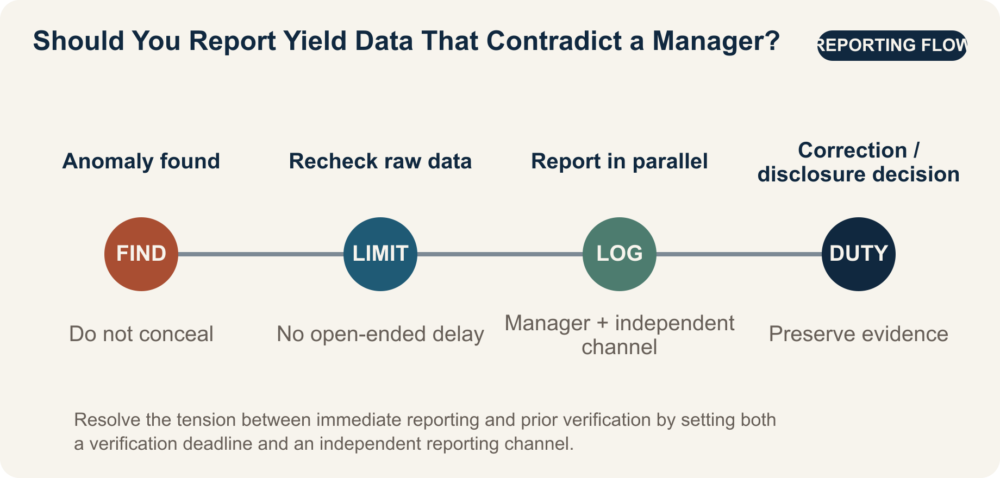

::: {.book-question}
[Today’s Chaekmun]{.book-question-label}

{.book-question-image width=30mm fig-alt="A minimalist ink-wash symbol weighing the courage to speak against the duty to verify, with two conflicting yield tables between them"}

[If a new employee discovers yield data that contradicts a manager’s conclusion just before the quarterly results announcement, should the employee report it immediately?]{.book-question-prompt}
:::

Gwanghaegun’s 1611 chaekmun^[The historical chaekmun ([策問]{.hanja}) connected to this chapter asked how to prioritize the tasks of restoring government after war. The Chaekmun Archive condenses its meaning in the reconstructed Classical Chinese passage “[今之國事，何者最急？用人、賦役、田政、戶籍，孰先孰後？]{.hanja}.” This is not a literal transcription of the original. It asks, “What is most urgent in the affairs of state today? Among appointing capable people, corvée labor, land administration, and household registration, which should come first and which later?” Today’s question is not a direct translation of that sentence into a modern organization. It reinterprets the same structure—setting priorities among uncomfortable facts during a crisis—and applies it to yield reporting.] did not ask candidates to list every worthwhile action. It asked them to choose what should be fixed first and explain the sequence. An organization approaching a quarterly announcement faces the same difficulty: keeping the disclosure timetable, rechecking a possible analytical error, and preventing incorrect figures from reaching customers and investors are all urgent at once.

A new employee’s low rank does not determine whether the data are true. Nor does that mean an initial calculation should immediately be circulated as established fact. The issue in this chapter is not simply the “courage to speak.” It is how to turn **reproducible evidence, limited verification time, an independent reporting line, and protection after raising a concern** into a single procedure.

The OECD Guidelines for Responsible Business Conduct call on companies to maintain risk-based due diligence and grievance mechanisms. In practice, a minority view is not automatically correct. It is an early warning that should undergo reproduction and independent verification before an irreversible announcement.

## Why This Question Matters Now

Semiconductor yield affects revenue, cost, delivery schedules, and customer quality at the same time. Yet the same wafer records can produce different yield figures depending on rules for excluding product families, the treatment of reworked units, inspection stage, the definition of a good unit, and the aggregation cutoff. A difference between two figures is not enough to prove false reporting, but neither can the discrepancy be buried merely by saying that “the sample definitions differ.”

The OECD’s 2023 *Guidelines for Multinational Enterprises on Responsible Business Conduct* cover disclosure, human rights, employment and industrial relations, the environment, consumer interests, and science and technology, among other areas. Responsible business conduct does not end with installing a reporting mailbox. It requires an ongoing process: identify and assess adverse impacts; prevent or mitigate them; track outcomes; communicate how they were addressed; and provide remediation when needed.

A new yield analyst cannot instantly transform an entire corporate culture. What the analyst can do is preserve the raw data, freeze the computing environment, flag the rows that produce the discrepancy, and record both the verifier and the reporting deadline. Organizational voice is better measured not by the impression that “people can speak freely in meetings,” but by the elapsed time across **discovery → request for verification → notification of the decision-maker → action → recurrence check**.

## Data Lens

{fig-alt="A data graphic linking the gap between 92% and 89.8% yield to independent verification and the reporting flow"}

### Evidence Table

| Evidence | Primary source or calculation | Status | Significance for the debate |
|---:|---|---|---|
| 1 | In its 2023 Guidelines, the OECD treats disclosure, human rights, employment, the environment, consumer interests, and science and technology as major areas of responsible business conduct. | Fact based on the OECD source | A concealed yield discrepancy is not merely a matter of personal etiquette; it sits at the intersection of disclosure, customer impact, and technological responsibility. |
| 2 | This chapter’s evidence framework proposes measuring organizational voice through retaliation after reporting, time to corrective action, and recurrence rates rather than merely the existence of an anonymous reporting channel. | Project analytical framework—not a statistic | Count not only reports, but whether reports lead to action and organizational learning. |
| 3 | Separating the time allowed to review a dissenting view from the time allotted for the final decision makes it possible to design for both deliberation and speed. | Project analytical framework—not a statistic | It prevents disagreement from being erased without allowing verification to continue indefinitely. |
| 4 | In this chapter’s case, the proposed announcement of 92% and the recalculation of 89.8% differ by 2.2 percentage points. Expressed as defect rates, the change is from 8% to 10.2%, a relative increase of 27.5%. | **Arithmetic using hypothetical figures for discussion** | A yield gap may look small while implying a much larger change in defect volume and cost. These are not actual company figures. |

### How to Read These Numbers

First, distinguish **percent from percentage points**. The difference between 92% and 89.8% is 2.2 percentage points, not 2.2%. Relative to a 92% baseline, the decrease is about 2.4%.

Second, the defect rate may be closer to the decision that needs to be made than the yield rate. Under the same assumptions, the defect rate rises from 8% to 10.2%, a relative increase of 27.5%. That calculation alone, however, cannot establish the financial loss. It also requires wafer input, die size, saleable grades, rework rates, and customer compensation terms.

Third, the aggregation definitions must match. If the two figures cover different product families, process stages, periods, or treatment of rework, the comparison is invalid. The first report should therefore say, “Applying two definitions to the same raw data reproduces a 2.2-percentage-point gap,” rather than “The yield figure is wrong.”

Fourth, the OECD material is not a statistical study of the effectiveness of whistleblowing at a specific company. This chapter applies the Guidelines’ accountability process to a yield case. Reporting delay, retaliation, action-completion rate, and recurrence of the same error are **internal operating indicators proposed by this chapter**, not industry averages published by the OECD.

## Competing Answers

### Answer A — Report Immediately

Any material discrepancy discovered before an announcement should be escalated immediately, regardless of rank. Correcting an inaccurate yield figure after it has gone public can damage customer production plans, cost estimates, and investor trust at once. If the new employee remains silent, the manager may finalize a conclusion without ever seeing the conflicting data. Alerting the audit, quality, and disclosure teams with the raw data and reproduction steps attached is not disloyalty to the organization; it is a concrete form of loyalty.

This approach also has weaknesses. If one unverified analysis circulates widely, preparations for the announcement may stop, sensitive information may move beyond authorized access, and a legitimate difference in definitions may become an allegation of misconduct. “Immediately” should mean submitting the concern without delay through the designated independent reporting line—not emailing the entire company.

### Answer B — Verify First

Because yield is highly sensitive to definitions, the finding should undergo at least a minimal second check before it is reported. Unless the raw-data hash, query version, exclusion rules, and sample period are aligned, 92% and 89.8% may describe different populations. Rather than spend the limited time before the announcement on rumor and rebuttal, two analysts should reproduce the calculation independently and summarize the source of the discrepancy on one page.

But “more verification is needed” can become the most common instrument of delay. Without a named verifier and a deadline—and if the direct manager alone controls the conclusion—a request to postpone the issue until the next quarter can function as concealment. A verify-first approach must include a time limit and explicit escalation conditions.

### Answer C — Time-Boxed Independent Verification

I would freeze the raw data immediately, request independent reproduction within 24 hours, and at the same time notify the disclosure officer on a need-to-know basis that a “2.2-percentage-point discrepancy under verification” exists. If the gap survives an independent calculation or exceeds a customer or financial materiality threshold, I would escalate it to the audit, quality, and disclosure committee without requiring the direct manager’s consent. If the discrepancy disappears when the definitions are aligned, I would record the correction to the analysis and keep the proposed announcement.

This is not a midpoint between immediate reporting and prior verification. It is a design that **separates in advance the audience for the report, the required level of evidence, the verification deadline, and the escalation conditions**. It protects time for dissent while fixing the time for the final decision.

## AI Research Design

### Prompt for the AI

> Investigate how a semiconductor manufacturer should resolve differences in yield calculations and internal disagreement. Check sources in this order: ① the company’s data dictionary and yield formulas, ② raw data and query or code versions, ③ approval authority across process engineering, quality, and production, ④ audit and disclosure rules, and ⑤ the OECD Guidelines for Responsible Business Conduct. Compare the populations, inspection stages, periods, and treatment of reworked and test units behind 92% and 89.8% in a table. Calculate the discrepancy in percentage points, relative yield change, and defect-rate change. Build an authority matrix showing each department’s claim, evidence, and interest; the neutral mediator; stop and restart conditions; and the final approver. Put verified facts, responsible employees’ claims, AI inferences, and hypothetical discussion assumptions in separate columns. Do not enter personal names, a reporter’s identity, or undisclosed customer information. The conclusion should include 24-hour independent verification; conditions for pausing or maintaining the announcement; protection for dissent; decision-log fields; and a post-decision recurrence check.

### Data Acquisition

| Step | Source | Required record |
|---:|---|---|
| 1 | Raw data from the MES, inspection equipment, and data warehouse | Extraction time; lot and product family; process stage; missing and duplicate values; raw-data hash |
| 2 | Yield queries and analytical code | Repository version; numerator and denominator definitions; exclusion rules; treatment of rework; execution environment |
| 3 | Financial and customer-impact data | Saleable grades; scrap and rework costs; customer compensation; revenue recognition; disclosure deadline |
| 4 | Internal quality, audit, and reporting policies | Recipient; independent verifier; escalation path; confidentiality; anti-retaliation protection; response deadline |
| 5 | Original OECD and regulatory documents | Document title; publication year; scope; direct URL; differences from company policy |

### Evaluating the Information

1. **Reproducibility:** Determine whether another analyst obtains the same value from the same raw data and code.
2. **Consistent definitions:** Align the definitions and aggregation periods for good units, input volume, rework, and test lots.
3. **Separate impacts:** Put the statistical discrepancy, customer quality impact, and financial or disclosure materiality in separate columns.
4. **Source grading:** Treat the system of record and approved policies as facts, responsible employees’ explanations as claims, and AI explanations of causes as inferences.
5. **Security:** Give the AI only de-identified aggregates and approved documents; exclude reporter, customer, and process-recipe information.
6. **Record disconfirmation:** State both the conditions under which 92% would be correct and those under which 89.8% would be correct, and specify the test that distinguishes them.

### Core Questions for Debate

- How widely should an unverified warning be shared to protect both accuracy and confidentiality?
- Who determines when a 2.2-percentage-point yield gap is material for disclosure, customers, or quality?
- When process, quality, and production teams use conflicting definitions, who can mediate without owning the KPI?
- What access controls would preserve a dissenting view in the decision log while separating it from the reporter’s performance evaluation and placement?

## Case Discussion

You joined the yield analysis team four months ago. Management’s proposed announcement reports a 92% yield for the flagship product family, but your recalculation of the raw data produces 89.8% when a particular low-yield product family is included. Your manager says the difference is a sampling-definition issue that can be resolved next quarter. The presentation will be finalized in 36 hours. All additional figures below are hypothetical assumptions for discussion.

- The quarter’s input was 100,000 wafers, using a simple aggregate without adjusting for product mix.
- Independent reproduction by one analyst requires eight hours; a preliminary estimate of the financial impact requires six hours.
- A hypothetical internal policy requires notification of the quality officer within 24 hours if the yield discrepancy is at least 0.5 percentage points or the expected loss is at least KRW 500 million.
- An audit channel bypasses the direct manager, but employees worry that the manager may learn that a report was filed.

The same raw data have produced different interpretations. The process team argues that the low-yield product is still in development and should be excluded from production yield. The production team wants to keep the announcement schedule and use a provisional figure until rework is complete. The quality team argues that any product destined for customer shipment belongs in the current population. Every claim requires verification, and no team is presumed to be engaging in misconduct.

Divide roles and authority. The new analyst preserves the raw data, code, and discrepancy-producing rows. The process, production, and quality teams submit their numerator, denominator, and governing policy within eight hours. A data-governance officer who does not own the KPI mediates; the quality officer has authority to hold shipments; and the disclosure committee approves any pause or resumption of the announcement. The audit officer controls access to the decision log and to the identity of the person who raised the concern. The log records each claim, the data and code versions used, results of attempts to disconfirm it, the final authority, its validity period, and the conditions for review.

The team must choose among **maintaining the announcement and correcting it afterward, conducting a 24-hour independent verification with a conditional hold, or postponing the announcement immediately**. It should also examine hypothetical stop conditions: an aligned-definition discrepancy of at least 0.5 percentage points, an expected loss of at least KRW 500 million, or a break in raw-data traceability. The final plan should specify the work for the first eight hours; the mediation meeting at 24 hours; the announcement decision at 36 hours; departmental authority; the decision log; access to the reporter’s identity; a check for adverse performance consequences; and a recurrence test after 30 days.

## Sample 90-Second Response

“I choose **Answer A: report immediately through the independent channel and pause the announcement first.** The OECD’s 2023 Guidelines for Responsible Business Conduct treat disclosure and responsibility in science and technology as major areas. But the case figures—92% and 89.8% yield, a 2.2-percentage-point gap, an internal threshold of 0.5 percentage points, and an expected loss of KRW 500 million—are all hypothetical. The strongest counterargument is that a legitimate difference in definitions could be escalated too quickly into an allegation of wrongdoing. I would therefore avoid circulating suspicions across the company. I would freeze the raw-data hash and code version, then submit them only to the audit, quality, and disclosure officers. A mediator who does not own the KPI would align the numerators, denominators, and governing rules within 24 hours. If the discrepancy falls below 0.5 percentage points after definitions are aligned and raw-data traceability is complete, I would record both the basis for the correction and the dissenting view, then resume the announcement. If the discrepancy remains or traceability is broken, I would confirm the postponement. Reporting does not establish an allegation; it initiates verification. The first priority is preventing an irreversible misstatement, not preserving the speed of the announcement.”

## Follow-Up Questions

**Cross-Examination and Rebuttal**

- If the process, quality, and production teams each present a different yield definition supported by policy, how should the mediator determine the final population?
- If independent reproduction returns 90.4%, would you select one number or disclose separate figures under each definition?
- If the quality officer and disclosure committee reach different conclusions, how should authority over shipment and authority over the announcement be separated?
- Which fields must appear in the decision log, and which must be kept separate from the reporter’s identity?
- How can the organization protect someone whose analysis proves wrong while distinguishing an honest error from deliberate manipulation?
- If the same error recurs within 30 days after the announcement proceeds, which authority or calculation rule should change?

## Sources

- [OECD, *OECD Guidelines for Multinational Enterprises on Responsible Business Conduct* (2023)](https://www.oecd.org/en/publications/oecd-guidelines-for-multinational-enterprises-on-responsible-business-conduct_81f92357-en.html)
- [OECD, Responsible Business Conduct—Overview of Risk-Based Due Diligence and Grievance Mechanisms (accessed 2026)](https://www.oecd.org/en/topics/responsible-business-conduct.html)
- [Joseon Dynasty Chaekmun Archive, Gwanghaegun 1611, “The Most Urgent Task After the Imjin War”](https://waterfirst.github.io/Joseon-Dynasty-Civil-Service-Examination/#gwanghae-1611/0)
- [Academy of Korean Studies, 1611 Examination Record](https://dh.aks.ac.kr/~sonamu5/wiki/index.php/%EA%B4%91%ED%95%B4%28%E5%85%89%E6%B5%B7%29_3%EB%85%84%281611%29_%EC%8B%A0%ED%95%B4%28%E8%BE%9B%E4%BA%A5%29_%EB%B3%84%EC%8B%9C%28%E5%88%A5%E8%A9%A6%29)

> **Data note:** The figures 92%, 89.8%, 100,000 wafers, 0.5 percentage points, KRW 500 million, eight hours, and 36 hours are all hypothetical assumptions created for this chapter’s discussion; they are not actual corporate results. Do not conflate the content of the OECD Guidelines with the case figures.
