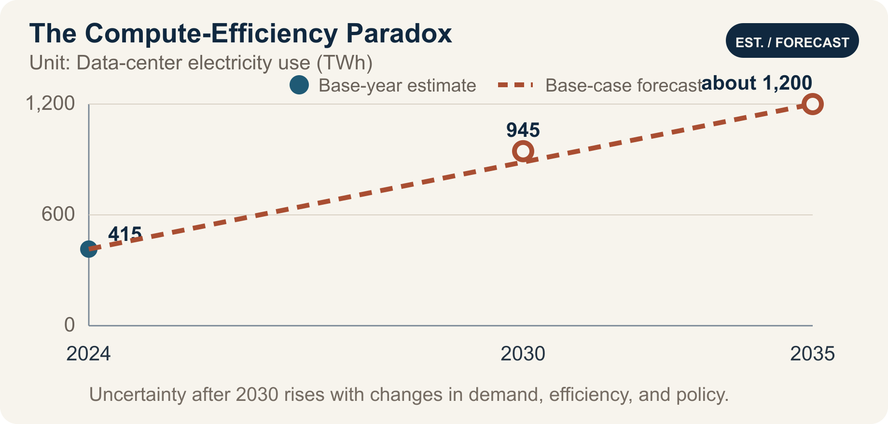

::: {.book-question}
[Today’s Chaekmun]{.book-question-label}

{.book-question-image width=30mm fig-alt="A minimalist ink-wash symbol showing a shrinking drop of energy branching into countless AI requests"}

[If a new AI chip reduces energy per computation by 40% but service usage triples, can it still be described as environmentally sustainable?]{.book-question-prompt}
:::

A Jungjong-era chaekmun on restraint^[The historical chaekmun ([策問]{.hanja}) connected to this chapter asked why wine, despite its beneficial use in ritual and fellowship, becomes an abuse that harms both state and household, and how it should be restrained. The Chaekmun Archive condenses its meaning in the reconstructed Classical Chinese passage “[酒有禮用，而其弊敗國喪家。何以節之？]{.hanja}.” This is not a literal transcription of the original. It asks, “Wine has its proper ritual uses, yet its harms can ruin the state and destroy the household. How should it be restrained?” This chapter does not equate wine with AI. It borrows the question’s structure: acknowledge a useful technology while designing limits for its total use.] did not call for eliminating something useful. It asked how to control the point at which a beneficial use becomes excessive in aggregate.

AI computing presents the same problem. A chip that produces the same answer with less electricity is a genuine technical advance. But if cheaper computation drives a sharp increase in advertising recommendations, video generation, search, and agent calls, total data-center electricity consumption and peak demand may still rise. Efficiency and total consumption are not competing metrics; they answer different questions.

The IEA’s *Energy and AI* analyzes AI demand as a system extending beyond servers to data centers, electricity grids, and generation sources. An efficiency assessment should therefore not end at the chip data sheet. It should extend to service request volume and total data-center electricity consumption.

## Why This Question Matters Now

In the IEA’s 2025 *Energy and AI* base case, global data-center electricity consumption more than doubles from about 415 TWh in 2024 to about 945 TWh in 2030. That is just under 3% of global electricity consumption in 2030. The IEA projects that electricity consumption by accelerated servers will grow by about 30% per year and account for almost half of the net increase.

This forecast does not mean that every AI chip consumes the same amount of electricity or that conditions are identical in every country. Data centers cluster according to grids, climate, cooling methods, semiconductor supply, and service demand. Even if the global share remains below 3%, new loads can substantially affect interconnection, electricity prices, water use, and reserve capacity in particular regions.

A new sustainability analyst should not attach a green label based only on a chip’s TOPS/W. The analysis must connect measured server power, utilization, memory and networking, total facility power including cooling, task quality per request, total request volume, and hourly electricity use and carbon intensity.

## Data Lens

{fig-alt="A data graphic distinguishing the 2024 base-year estimate of 415 TWh of data-center electricity consumption from base-case forecasts of 945 TWh in 2030 and about 1,200 TWh in 2035 using solid and dotted lines"}

### Evidence Table

| Evidence | Figure or range in the primary source | Status | Significance for the debate |
|---:|---|---|---|
| 1 | Global data-center electricity consumption is estimated at about **415 TWh** in 2024. | IEA base-year estimate | This is total data-center consumption, not AI computing alone. |
| 2 | The IEA base case forecasts about **945 TWh** in 2030. | Conditional forecast | The result changes if policy, efficiency, demand, or supply changes. |
| 3 | The 945 TWh forecast for 2030 is **just under 3%** of global electricity consumption. | Global share in the IEA base case | Even if the global average appears small, regional grid impacts require separate analysis. |
| 4 | Electricity consumption by accelerated servers is projected to grow by **about 30% per year** through 2030 and account for almost half of the net increase in data-center electricity use. | IEA technology-level forecast | Track both AI server efficiency and deployment volume. |
| 5 | The IEA base case puts data-center electricity consumption at **about 1,200 TWh** in 2035. | Long-term conditional forecast | The IEA also warns that uncertainty increases beyond 2030. |
| 6 | In the case, a 40% reduction in energy per computation means each request uses 60% of the previous amount. If request volume triples, total electricity use becomes 0.6×3=1.8 times the previous level—an **80% increase**. | **Arithmetic using hypothetical figures for discussion** | Efficiency gains alone do not guarantee lower total electricity consumption. |

### How to Read These Numbers

TWh measures energy consumed over a period; GW measures instantaneous or contracted capacity. Do not restate 945 TWh as 945 GW. Converting annual energy to average power requires dividing by the hours in a year, but actual peak demand will exceed the average.

The 415 TWh figure is a 2024 base-year estimate; 945 TWh and about 1,200 TWh are base-case forecasts for 2030 and 2035, respectively. The three points must not be read as equally certain observed results. Total data-center electricity use includes servers, cooling, power conversion, and other loads, and it is difficult to separate AI electricity fully from traditional workloads. A separate IEA supply analysis reports 460 TWh of generation in 2024; that figure exceeds consumption because it accounts for transmission and distribution losses, so the two values should not be combined.

The annual 30% rate is compounded growth, not the same absolute increase each year. “Almost half of the net increase” is also different from “half of total consumption.”

The calculation 0.6×3=1.8 is a simplified scenario for this chapter. It assumes no change in task quality, model size, batching, caching, request length, server utilization, or cooling. In reality, a more efficient chip may be used for a larger model or higher quality, changing the amount of computation per request itself.

Carbon is not the same as electricity consumption. The emissions from 1 MWh depend on the generation mix at its time and location. Examine hourly carbon-free energy matching, peak electricity demand, and additional generation capacity together.

## Competing Answers

### Answer A — Efficiency-Led Innovation

A 40% reduction in energy per computation lowers cost, electricity use, and cooling demand at the same service level. AI can also create benefits in medicine, science, and industrial optimization, so rising usage should not automatically be called waste. Rapid deployment of efficient chips can replace older servers and support more valuable work within a constrained grid.

But it is necessary to verify whether the “same service level” is actually maintained. If every efficiency gain is spent on larger models and unlimited automated calls, total consumption and peak demand will rise. Product-level metrics cannot substitute for the environmental performance of the facility.

### Answer B — Cap Total Consumption

Environmental impacts arise from final electricity consumption, water use, and emissions. If total electricity rises 80% despite lower energy per request, calling the outcome green is difficult. Establish a data-center electricity budget, peak-demand cap, and restrictions on nonessential inference first, then treat efficiency as a means of allocating use within those limits.

But a fixed cap that treats the social value of every service as equal may also block worthwhile new applications. The cap could become a barrier to entry that favors incumbent providers.

### Answer C — Two-Ledger Approval

I would require both energy per computation and total service energy in chip approval. The product team would be responsible for electricity per standard task at equal quality; the service team would be responsible for monthly inference volume, total electricity use, and peak demand. Set a budget that allows only part of the efficiency savings to fund demand growth and preserves the rest as an absolute reduction.

Do not stop at the annual volume of renewable electricity purchased. Put hourly carbon-free energy, additionality of new generation, grid congestion, demand response, and emergency curtailment into the contract. If total electricity exceeds the approved budget or carbon intensity during peak hours exceeds the threshold, delay low-value requests and lower the cap on automated calls.

## AI Research Design

### Prompt for the AI

> Analyze how a 40% reduction in energy per computation for a new AI chip and a projected tripling of service usage would affect total data-center electricity, carbon, and peak demand. Check sources in this order: ① server measurements under an equal-quality benchmark, ② actual request logs with model, token, and batch data, ③ facility meters, PUE, and cooling, ④ hourly electricity and carbon intensity and power contracts, and ⑤ the original IEA *Energy and AI* report. Compare chip, memory, network, and facility electricity for the baseline and new servers using the same functional unit. Calculate total electricity and peak demand under usage sensitivities of 1×, 2×, 3×, and 5×. Distinguish measurements, modeling, company forecasts, IEA forecasts, and hypothetical discussion assumptions. Do not equate the purchase of renewable-energy certificates with actual hourly carbon-free supply. Conclude with an efficiency KPI, total electricity budget, peak reduction, demand response, and conditions for withdrawing approval.

### Data Acquisition

| Step | Source | What to verify |
|---:|---|---|
| 1 | Server benchmarks | Model, accuracy, latency, batch size, input and output length, chip, memory, and network power |
| 2 | Service request logs | Request count, tokens or image size, retries and cache, automated calls, value by customer and function |
| 3 | Facility metering | Server and facility electricity, PUE, cooling water, peak demand, time and location |
| 4 | Power procurement | Grid electricity, PPA, certificates, additionality, hourly matching, demand-response obligations |
| 5 | Original IEA and grid sources | Scenario, scope, base year, regional concentration, forecast uncertainty |

### Evaluating the Information

1. **Functional equivalence:** Confirm that the systems process the same quality, latency, and amount of work.
2. **Consistent boundary:** Record chip, server, and facility electricity at separate layers rather than mixing them.
3. **Check the total:** Multiply unit efficiency by actual usage to recalculate total electricity use.
4. **Time and location:** Separate annual averages from peaks, and regional carbon intensity from grid constraints.
5. **Additionality:** Determine whether the power purchase resulted in new carbon-free generation.
6. **Cause of rebound:** Distinguish demand growth driven by price, new features, and repeated automated calls.

### Core Questions for Debate

- Should the denominator of an environmental claim be a computation, a useful task, a customer, or total facility electricity?
- How much of the efficiency saving should fund greater demand, and how much should remain as an absolute reduction?
- Who should have authority to classify, delay, or stop a low-value request: the product team or the customer?
- If the annual renewable-energy purchase is unchanged but peak-hour electricity comes from fossil generation, has the target been met?

## Case Discussion

You are a new sustainability analyst for an AI server product. In the same benchmark, the new chip uses 40% less energy per computation, but customer inference volume is projected to triple because of lower prices and new features. All figures below are hypothetical assumptions for discussion.

- The existing service uses 100 GWh of facility electricity per year. If request volume alone triples, the new equipment uses 180 GWh under a simple calculation.
- Current peak demand is 20 MW, and the grid operator requires a KRW 20 billion interconnection-upgrade payment if demand exceeds 25 MW.
- The annual renewable-electricity contract covers 120 GWh, but actual request peaks occur between 6 p.m. and 10 p.m.
- Delay-tolerant batch work accounts for 30% of total electricity use, and half of that load can be shifted to daytime hours.

The new employee must choose among **launching on efficiency performance alone, launching conditionally with a 150 GWh annual cap and demand management, or deferring until demand is confirmed**. The product team owns performance; the service team owns request value; the data-center team owns peak demand; procurement owns power contracts; and finance owns the upgrade cost.

The final contract should include energy per computation at equal quality, monthly total electricity, the 25 MW peak, hourly carbon-free share, batch shifting, request caps, customer notification, and reapproval conditions.

## Sample 90-Second Response

“I choose **Answer C: a conditional launch with a 150 GWh total-electricity cap.** In the IEA base case, data-center electricity consumption rises from about 415 TWh in 2024 to 945 TWh in 2030, while electricity use by accelerated servers grows by about 30% per year. This is real-world evidence that efficiency alone does not guarantee lower total consumption. The case figures—a 40% reduction in energy per computation, triple the requests, an increase from 100 GWh to 180 GWh in total electricity, and a 25 MW peak—are all hypothetical. I accept the counterargument that greater usage may provide more high-value computing. I would shift delay-tolerant work to daytime hours and restrict low-value automated calls when peak demand reaches 25 MW. Six months after launch, I would expand if electricity per useful task has fallen by at least 30% and total electricity remains within 150 GWh. If the cap is exceeded by 5% for two consecutive months or the peak is breached, I would stop new automated calls and require reapproval. I would also publish the hourly carbon-free share to keep total electricity and carbon distinct. An environmental claim should apply not to a fast chip alone, but to a service that controls both efficiency and total demand.”

## Follow-Up Questions

**Cross-Examination and Rebuttal**

- If the tripled request volume supports high-value work such as medical diagnosis, should it be allowed to exceed the 150 GWh cap?
- Would it be arbitrary for the product company to define the value of a “useful task”?
- If PUE improves but memory power outside the chip rises, how should energy efficiency per computation be recalculated?
- If the company purchased all 120 GWh of annual renewable electricity but the evening peak relies on fossil generation, how should its carbon claim change?
- If customers reject usage caps, which instrument should be used first: price, delay, or contract terms?
- If total electricity stays within 150 GWh but local water use and noise rise, should the launch still be considered successful?

## Sources

- [IEA, *Energy and AI—Energy Demand from AI* (2025)](https://www.iea.org/reports/energy-and-ai/energy-demand-from-ai)
- [IEA, *Energy and AI—Executive Summary* (2025)](https://www.iea.org/reports/energy-and-ai/executive-summary)
- [IEA, *Global Data Centre Electricity Consumption by Sensitivity Case, 2020–2035* (2025)](https://www.iea.org/data-and-statistics/charts/global-data-centre-electricity-consumption-by-sensitivity-case-2020-2035)
- [IEA, *Energy and AI—Energy Supply for AI* (2025)](https://www.iea.org/reports/energy-and-ai/energy-supply-for-ai)
- [Joseon Dynasty Chaekmun Archive, Jungjong-era “Discuss the Harms of Wine”](https://waterfirst.github.io/Joseon-Dynasty-Civil-Service-Examination/#jungjong-1513-wine/0)
- [Encyclopedia of Korean Culture, Gim Gu and the Jungjong-era Examination Response](https://encykorea.aks.ac.kr/Article/E0008751)

> **Data note:** The 415 TWh figure is the IEA’s 2024 base-year estimate; 945 TWh and about 1,200 TWh are base-case forecasts for 2030 and 2035. The figure just under 3% and the annual 30% growth rate are also elements of the IEA forecast. The IEA supply analysis reports 460 TWh of generation in 2024 to serve data-center demand. The 40% reduction, tripled demand, and the case figures of 100, 180, and 150 GWh; 20 and 25 MW; KRW 20 billion; 120 GWh; 30%; and all transition conditions are hypothetical assumptions for discussion.
