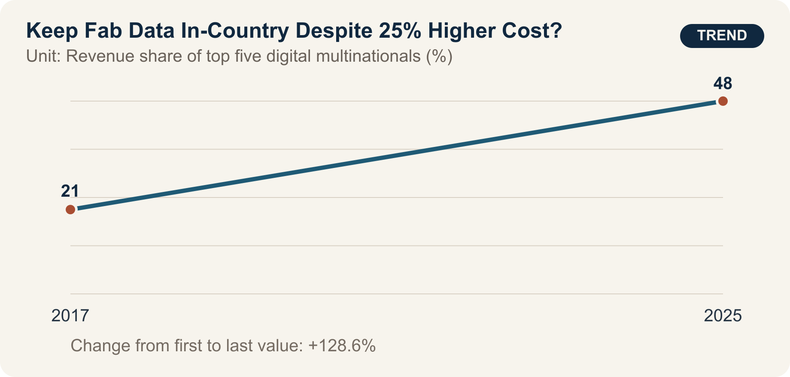

::: {.book-question}
[Today’s Chaekmun]{.book-question-label}

{.book-question-image width=30mm fig-alt="A minimalist ink-wash symbol showing waves of data crossing a border alongside a domestic vault and partner factories"}

[Should fab data be localized even if keeping it in-country raises suppliers’ cloud costs by 25%?]{.book-question-prompt}
:::

Sejong’s 1447 chaekmun on law and authority^[The historical chaekmun ([策問]{.hanja}) connected to this chapter asked why laws repeatedly create harms that prompt new laws, and where authority should reside. The Chaekmun Archive condenses its meaning in the reconstructed Classical Chinese passage “[法立而弊生，弊生而法又立。其所以救之者何歟？政權當歸於何所歟？]{.hanja}.” This is not a literal transcription of the original. It asks, “When a law is established, abuses arise; when abuses arise, another law is established. What can remedy this, and where should governing authority reside?” Today’s question does not map the institutions of power at that time directly onto data centers. Instead, it borrows the question’s structure: when a rule intended to strengthen control creates new costs and concentrations of power, where should authority reside, and what remedy should be available?] held that the existence of rules alone does not constitute good governance. A rule that keeps data in-country can increase control, but it can also create new harms by concentrating the market among a few providers or making recovery and collaboration more difficult.

Fab data are not a single category. Process recipes and equipment parameters, defect images, predictive-maintenance logs, employee personal data, purchasing and customer information, and de-identified production statistics pose different risks when they are disclosed, altered, or unavailable. Applying one location rule to all of them may be too weak for the most sensitive data and excessive for the least sensitive.

## Why This Question Matters Now

In 2025 reporting on concentration in digital markets, UNCTAD stated that the revenue share of the five largest digital multinational enterprises more than doubled from 21% in 2017 to 48% in 2025. It also reported that business e-commerce sales across 43 countries grew by about 60% between 2016 and 2022.

These figures provide context for concentration in global digital markets; they are not direct experiments showing that fab-data localization increases or decreases security. They instead signal that policy designers should examine both the power of a few global cloud providers and the risk of reconcentrating the domestic market among a few local providers.

Security can fail through encryption, key ownership, account privileges, operator access, patching, backup isolation, incident response, and the supply chain—not simply through the physical location of data. Location and jurisdiction are not irrelevant, however. They affect law enforcement during emergencies, seizure and access, requests from foreign governments, service disruption, and contract enforcement.

The practical task of a new data-governance employee is not to vote “domestic” or “overseas.” It is to map data flows, classify sensitivity, and attach storage, processing, backup, cross-border transfer, key, operator, and deletion rules to each class—then test their cost and recovery time.

## Data Lens

{fig-alt="A data graphic showing the revenue share of the five largest digital multinational enterprises rising from 21% in 2017 to 48% in 2025"}

### Evidence Table

| Evidence | Figure or range in the primary source | Status | Significance for the debate |
|---:|---|---|---|
| 1 | The revenue share of the five largest digital multinational enterprises rose from **21%** in 2017 to **48%** in 2025. | UNCTAD analysis of the global market | This is the context for concentration in cloud services, computing, and access to data. |
| 2 | Business e-commerce sales across 43 countries grew by **about 60%** between 2016 and 2022. | UNCTAD evidence cited in the project | As cross-border digital trade expands, the cost of transfer rules may affect a broader range of firms. |
| 3 | Data localization can increase control, but it can also raise the cost of cloud access for small and medium-sized enterprises. | Interpretive evidence in the project | Put the benefits of security and jurisdiction on the same scorecard as suppliers’ costs and recovery. |
| 4 | UNCTAD explains that access to capital, data, and computing can become barriers to entry in digital markets. | Policy analysis in the primary source | Treat access for small and medium-sized suppliers as a separate KPI when designing localization rules. |
| 5 | The case assumes that full localization raises suppliers’ costs by 25%, delays disaster recovery by three hours, and accelerates government emergency access by 24 hours. | **Hypothetical assumptions for discussion** | These are not official statistics; they are conditions for comparing the trade-offs of tiered rules. |

### How to Read These Numbers

The 21% and 48% figures are revenue shares for the five largest digital multinational enterprises as defined by UNCTAD. They must not be restated as shares of the entire cloud market or semiconductor fab software market. Revenue, assets, users, and data volume are different measures of concentration.

The increase between 2017 and 2025 shows that concentration grew; it does not identify a single cause. Economies of scale, mergers and acquisitions, network effects, AI investment, and regulation may all have contributed.

The 60% increase across 43 countries is not the growth rate for every business worldwide. The number of countries, nominal prices, currencies, and sample scope must be checked.

The security effect of localization requires separate measurement. Counting incidents alone can make an organization with better detection look worse. Examine detection time, misuse of privileges, key compromise, achievement of recovery objectives, third-party access, patch delays, independent audits, and actual harm together.

The 25%, three-hour, and 24-hour figures are case assumptions. Specify whether the cost increase uses storage cost or total IT cost as its denominator, whether recovery time means the recovery time objective or the actual average, and what lawful procedure “emergency access” entails.

## Competing Answers

### Answer A — Localize Critical Data

Process recipes, defect models, equipment control data, and security logs may directly affect manufacturing competitiveness and national security. Requiring domestic jurisdiction, domestic key management, approved operators, and isolated in-country backups can increase control over foreign service disruption and foreign legal process. It may also shorten the time needed for a joint government–industry response to an incident.

But if a system satisfies “domestic storage” while retaining weak accounts, encryption, and patching, it has only a safe address. Concentration in one domestic provider also increases common-mode failure and price-escalation risks.

### Answer B — Permit Free Transfer Under Strong Security Controls

End-to-end encryption, customer-held keys, least privilege, immutable logs, multi-region backup, and provider portability matter more than data location. When global equipment suppliers can diagnose machinery on a shared platform, recovery is faster, and small and medium-sized firms can benefit from economies of scale. A 25% cost increase from full localization could weaken innovation and competition.

Yet encryption alone cannot eliminate nontechnical risks such as foreign jurisdiction, demands from overseas governments, sanctions, war, or network disconnection. Location and contracts still affect control and emergency access for the most sensitive data.

### Answer C — Tiered Data Sovereignty

I would divide data into four tiers. Equipment control data, core recipes, and security keys should, in principle, be stored and processed domestically with isolated in-country backups. Sensitive quality and customer data may be transferred in encrypted form between approved countries using customer-held keys. De-identified statistics and public technical materials may use multi-region cloud services. Personal data and export-controlled data require separate legal review.

Tiers should be based on harm scenarios, not labels. Score confidentiality, integrity, availability, legal jurisdiction, recovery time, and provider switching; every exception should have an expiration date and an approver. Offer shared security services and standard transfer tools to small and medium-sized suppliers facing higher localization costs, but do not trade security exceptions for a cheaper contract.

## AI Research Design

### Prompt for the AI

> Design tiered rules for the storage, processing, and cross-border transfer of semiconductor fab data. Check sources in this order: ① the data inventory and actual flows, ② internal legal review of contracts, jurisdiction, privacy, and export controls, ③ account, encryption, key, backup, and incident-response controls, ④ cost, latency, and recovery exercises, and ⑤ UNCTAD material on concentration in digital markets. Distinguish process recipes, equipment control data, defect images, predictive-maintenance logs, employee personal data, purchasing and customer data, and de-identified statistics. Evaluate the confidentiality, integrity, and availability harm for each tier. Do not assume domestic storage automatically guarantees security; include key ownership, operator location, remote access, and backups. Separate verified facts, legal opinions, provider claims, AI inferences, and case assumptions. Do not enter original recipes, personal data, or security keys into the AI, and mark legal conclusions as requiring confirmation by responsible counsel.

### Data Acquisition

| Step | Source | What to verify |
|---:|---|---|
| 1 | Data inventory and flow map | Originating equipment, fields, sensitivity, storage, processing and backup locations, recipients, retention period |
| 2 | Access and security logs | Human and service accounts, key ownership, remote operators, administrator access, anomaly detection |
| 3 | Contract and legal review | Jurisdiction, subcontracting, notice of government requests, transfer and deletion, service termination, audit rights |
| 4 | Cost, performance, and recovery tests | Storage and transfer costs, latency, RTO and RPO, multi-region failure exercises, provider-switching time |
| 5 | Supplier impact | Company size, incremental cost, technical staff, standard tools, security incidents, and support needs |

### Evaluating the Information

1. **Separate location from control:** Record the server address, legal jurisdiction, keys, operators, and backup location independently.
2. **Minimize first:** Remove unnecessary fields and shorten unnecessary retention periods before applying controls.
3. **Demonstrate recovery:** Examine actual disaster-recovery exercises, not only contractual RTOs.
4. **Provider concentration:** Determine whether moving to one domestic provider creates a new single point of failure.
5. **Cost denominator:** Specify whether the 25% increase applies to storage, total cloud cost, or product cost.
6. **Current law:** Have legal counsel reconfirm the original text, effective date, and exceptions of each jurisdiction’s rules and contracts.

### Core Questions for Debate

- Is data sovereignty defined by storage location, encryption keys, legal jurisdiction, or emergency-access authority?
- What costs arise if core process recipes and de-identified equipment-diagnostic statistics are governed by the same rule?
- Under what conditions should a large enterprise or government share the 25% cost borne by small and medium-sized suppliers?
- If localization strengthens a domestic provider monopoly, how can competition and security both be protected?

## Case Discussion

You joined the data-governance team five months ago. An internal review estimates that full localization would raise small and medium-sized suppliers’ total cloud costs by 25% and delay multi-region disaster recovery by three hours, while accelerating lawful government emergency access by 24 hours. All are hypothetical assumptions for discussion.

- The migration covers 2 PB: 5% core recipes and control data, 35% quality and defect images, 40% predictive maintenance, 10% personal and contract data, and 10% de-identified statistics.
- A dual-provider domestic architecture costs KRW 4 billion a year; the existing multi-region architecture costs KRW 3.2 billion.
- Twelve overseas equipment suppliers access predictive-maintenance logs; using a domestic relay adds an average of 90 minutes to diagnosis.
- Domestic key management and immutable logs could reduce the number of high-risk administrator accounts from 180 to 60.

The new employee must choose among **full localization, maintaining the current architecture with stronger security controls, or tiered localization with restricted transfers**. Fab operations, security, legal, small and medium-sized suppliers, overseas equipment suppliers, and the government-response team each present objections.

The final proposal should include a tiering table; storage, processing, and backup locations; key ownership; the overseas-access method; cost sharing; RTO and RPO; emergency-access procedures; exception expiration; and quarterly audit items.

## Sample 90-Second Response

“I choose **Answer C: data sovereignty by tier, not full localization.** UNCTAD reports that the revenue share of the five largest digital multinational enterprises rose from 21% in 2017 to 48% in 2025. The concentration risk is real, but domestic storage alone does not guarantee security. The case figures—2 PB of data, a 25% cost increase, a three-hour recovery delay, and emergency access accelerated by 24 hours—are all hypothetical. I accept the counterargument that full localization can increase jurisdictional control and emergency authority. I would require domestic processing and isolated backups for the 5% consisting of core recipes and control data, as well as for security keys. Quality images would be split between domestic originals and pseudonymized diagnostic copies. Predictive-maintenance data would be minimized by field and made available overseas only under customer-held keys, approved sessions, and immutable logs. If a recovery exercise is more than one hour slower than the current architecture or administrator accounts exceed the target, I would redesign that tier. A single breach of key or logging requirements during overseas access would trigger an immediate switch to the domestic relay. Data sovereignty should be demonstrated through control over access and shutdown, and through recovery capability—not merely through the place of storage.”

## Follow-Up Questions

**Cross-Examination and Rebuttal**

- If core recipes make up only 5% of the data but can be reconstructed by combining other logs, how would you change the tiers?
- If two domestic providers rely on the same power grid and software, does that qualify as redundancy?
- How should the value of accelerating government emergency access by 24 hours be assessed if it ignores how often such access is actually needed?
- If a 90-minute delay in diagnosis by an overseas equipment supplier creates major fab losses, which exception should the security team allow?
- Would your conclusion change if the denominator for the supplier’s 25% cost increase were storage cost rather than total IT cost?
- How should the documentation distinguish data that must be stored domestically by law from data localized voluntarily by the company?

## Sources

- [UNCTAD, “Highly Concentrated Digital Markets Put Consumers at Risk—Here’s How to Change Course,” revenue share of the five largest digital multinational enterprises (2025)](https://unctad.org/news/highly-concentrated-digital-markets-put-consumers-risk-heres-how-change-course)
- [UNCTAD, “Online Dispute Resolution Key to Boosting Consumer Trust,” business e-commerce sales across 43 countries (2024)](https://unctad.org/news/un-trade-and-development-online-dispute-resolution-key-boosting-consumer-trust)
- [Joseon Dynasty Chaekmun Archive, Sejong 1447, “The Harms of Law and the Seat of Power”](https://waterfirst.github.io/Joseon-Dynasty-Civil-Service-Examination/#sejong-1447/0)
- [National Institute of Korean History, *Veritable Records of King Sejong*, entry for the fifth day of the eighth month in 1447](https://sillok.history.go.kr/id/kda_12908005_001)

> **Data note:** The figures 21%, 48%, 43 countries, and about 60% are market aggregates from UNCTAD. The 25% cost increase, three-hour recovery delay, 24-hour acceleration of emergency access, and all case figures concerning 2 PB, data composition, costs, equipment suppliers, account counts, and transition conditions are hypothetical assumptions for discussion. Actual legal obligations must be established by consulting the original rules in each jurisdiction and qualified legal experts.
